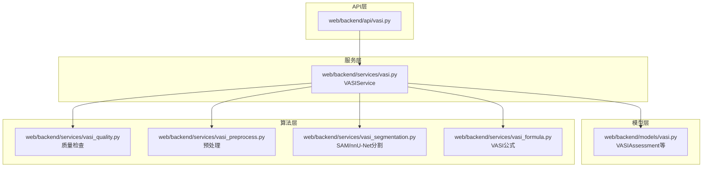
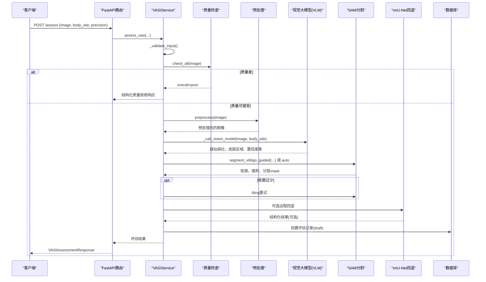
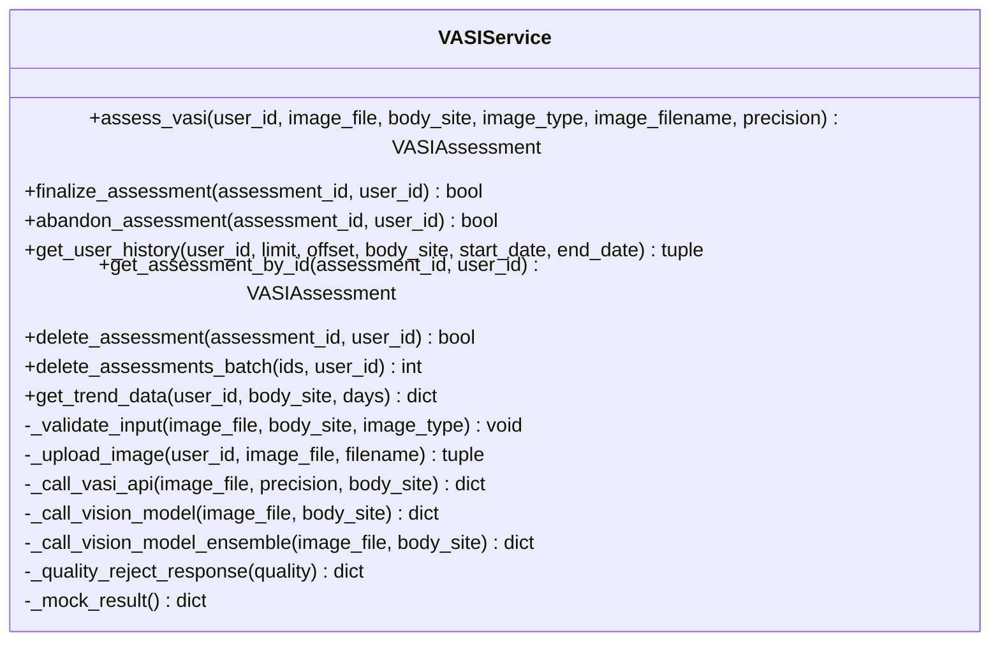
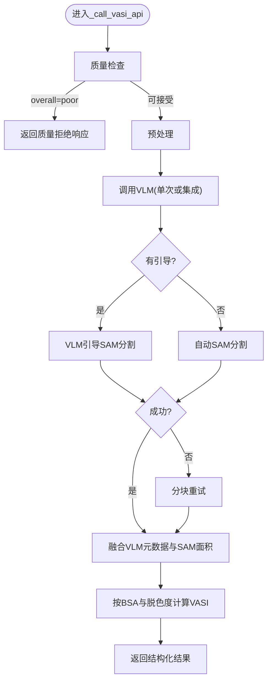
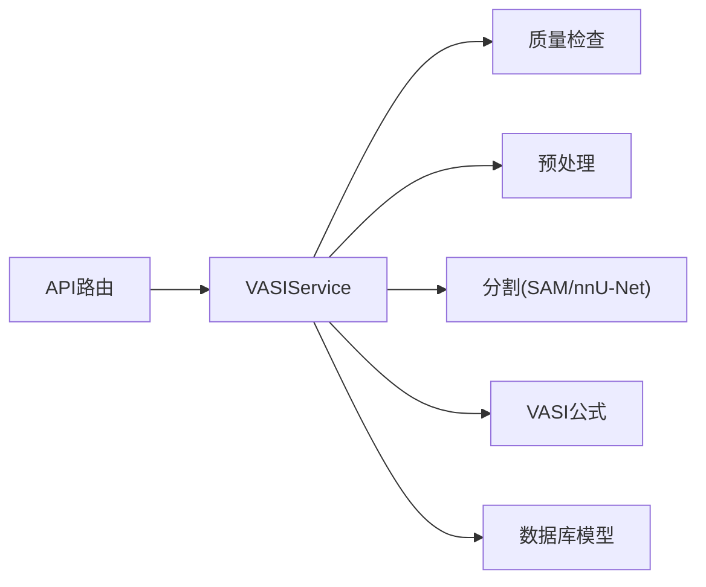

# VASI核心服务

<cite>
**本文引用的文件**   
- [web/backend/services/vasi.py](file://web/backend/services/vasi.py)
- [web/backend/api/vasi.py](file://web/backend/api/vasi.py)
- [web/backend/models/vasi.py](file://web/backend/models/vasi.py)
- [web/backend/services/vasi_segmentation.py](file://web/backend/services/vasi_segmentation.py)
- [web/backend/services/vasi_formula.py](file://web/backend/services/vasi_formula.py)
- [web/backend/services/vasi_preprocess.py](file://web/backend/services/vasi_preprocess.py)
- [web/backend/services/vasi_quality.py](file://web/backend/services/vasi_quality.py)
- [tests/backend/services/test_vasi.py](file://tests/backend/services/test_vasi.py)
</cite>

## 目录
1. [简介](#简介)
2. [项目结构](#项目结构)
3. [核心组件](#核心组件)
4. [架构总览](#架构总览)
5. [详细组件分析](#详细组件分析)
6. [依赖关系分析](#依赖关系分析)
7. [性能考量](#性能考量)
8. [故障排查指南](#故障排查指南)
9. [结论](#结论)
10. [附录：API与使用模式](#附录api与使用模式)

## 简介
本技术文档聚焦于 VASI（白癜风面积严重程度指数）核心服务的后端实现，围绕 VASIService 类展开，系统性说明 assess_vasi 方法的全链路流程：图像上传处理、质量检查、预处理、AI分割调用（VLM引导的SAM与nnU-Net回退）、结果后处理、VASI公式计算、数据库持久化与错误处理机制。同时覆盖业务规则、数据验证、事务管理与性能优化策略，并提供具体代码路径与使用模式，便于研发与维护人员快速定位与扩展。

## 项目结构
VASI相关代码主要分布在以下模块：
- API层：FastAPI路由与请求校验、响应模型封装
- 服务层：VASI评估主流程编排、图像上传、AI调用、结果组装
- 模型层：数据库ORM模型定义与迁移保障
- 算法层：图像质量检查、预处理、分割（SAM/nnU-Net）、VASI公式计算
- 测试层：服务行为与边界用例验证

图表来源
- [web/backend/api/vasi.py:45-165](file://web/backend/api/vasi.py#L45-L165)
- [web/backend/services/vasi.py:56-244](file://web/backend/services/vasi.py#L56-L244)
- [web/backend/models/vasi.py:26-105](file://web/backend/models/vasi.py#L26-L105)
- [web/backend/services/vasi_quality.py:81-271](file://web/backend/services/vasi_quality.py#L81-L271)
- [web/backend/services/vasi_preprocess.py:47-224](file://web/backend/services/vasi_preprocess.py#L47-L224)
- [web/backend/services/vasi_segmentation.py:278-437](file://web/backend/services/vasi_segmentation.py#L278-L437)
- [web/backend/services/vasi_formula.py:71-102](file://web/backend/services/vasi_formula.py#L71-L102)

章节来源
- [web/backend/api/vasi.py:45-165](file://web/backend/api/vasi.py#L45-L165)
- [web/backend/services/vasi.py:56-244](file://web/backend/services/vasi.py#L56-L244)
- [web/backend/models/vasi.py:26-105](file://web/backend/models/vasi.py#L26-L105)

## 核心组件
- VASIService：评估主入口，负责输入校验、图片上传、AI调用、结果组装、数据库写入、历史与趋势查询、删除与批量删除、轮廓修正与二次评分等。
- 图像质量检查器（VasiQualityChecker）：基于模糊度、皮肤占比、光照、分辨率进行质量判定，必要时直接拒绝并返回改进建议。
- 图像预处理器（VasiImagePreprocessor）：白平衡、对比度增强、锐化、尺寸缩放，提升后续分割稳定性。
- 分割服务（segment_vitiligo / segment_vitiligo_guided / nnUNetSegmentationService）：SAM自动分割、VLM引导分割、nnU-Net远程回退、分块重采样兜底。
- VASI公式（compute_vasi_v2）：按部位BSA权重与脱色程度计算临床意义更强的VASI分数。
- 数据模型（VASIAssessment等）：存储评估记录、用户修正、视觉特征、分层mask、状态流转等。

章节来源
- [web/backend/services/vasi.py:56-244](file://web/backend/services/vasi.py#L56-L244)
- [web/backend/services/vasi_quality.py:81-271](file://web/backend/services/vasi_quality.py#L81-L271)
- [web/backend/services/vasi_preprocess.py:47-224](file://web/backend/services/vasi_preprocess.py#L47-L224)
- [web/backend/services/vasi_segmentation.py:278-437](file://web/backend/services/vasi_segmentation.py#L278-L437)
- [web/backend/services/vasi_formula.py:71-102](file://web/backend/services/vasi_formula.py#L71-L102)
- [web/backend/models/vasi.py:26-105](file://web/backend/models/vasi.py#L26-L105)

## 架构总览
下图展示一次完整的VASI评估请求从API到服务再到算法与数据库的调用序列。

图表来源
- [web/backend/api/vasi.py:45-165](file://web/backend/api/vasi.py#L45-L165)
- [web/backend/services/vasi.py:159-244](file://web/backend/services/vasi.py#L159-L244)
- [web/backend/services/vasi_quality.py:188-271](file://web/backend/services/vasi_quality.py#L188-L271)
- [web/backend/services/vasi_preprocess.py:187-224](file://web/backend/services/vasi_preprocess.py#L187-L224)
- [web/backend/services/vasi_segmentation.py:690-800](file://web/backend/services/vasi_segmentation.py#L690-L800)
- [web/backend/services/vasi_segmentation.py:278-437](file://web/backend/services/vasi_segmentation.py#L278-L437)

## 详细组件分析

### VASIService 类与 assess_vasi 方法
- 输入校验：大小限制、MIME类型、Magic byte签名校验、身体部位合法性。
- 图片上传：本地存储生成URL与key，便于下游RL/训练管线读取。
- AI调用流程：
  - 质量检查：若整体质量“poor”，直接返回结构化质量拒绝响应，不消耗AI预算。
  - 预处理：白平衡、CLAHE对比度增强、锐化、尺寸缩放。
  - VLM调用：支持单次与集成（两次并行取交集），输出皮肤区域、疑似病灶、置信度、脱色等级等。
  - SAM分割：优先VLM引导（box/point/edge），失败回退自动模式；必要时分块重试。
  - nnU-Net回退：远程在线预测接口作为额外回退。
  - 结果后处理：按部位BSA权重与加权脱色度计算VASI分数，合并轮廓与分层mask，构造details与raw_response。
- 数据库操作：新建评估记录（draft），提交事务，刷新对象返回。
- 其他能力：确认草稿、放弃草稿、历史查询、趋势统计、单条详情、删除与批量删除（含跨表关联标记）。

图表来源
- [web/backend/services/vasi.py:56-244](file://web/backend/services/vasi.py#L56-L244)
- [web/backend/services/vasi.py:602-1044](file://web/backend/services/vasi.py#L602-L1044)
- [web/backend/services/vasi.py:1086-1587](file://web/backend/services/vasi.py#L1086-L1587)

章节来源
- [web/backend/services/vasi.py:159-244](file://web/backend/services/vasi.py#L159-L244)
- [web/backend/services/vasi.py:539-572](file://web/backend/services/vasi.py#L539-L572)
- [web/backend/services/vasi.py:573-601](file://web/backend/services/vasi.py#L573-L601)
- [web/backend/services/vasi.py:602-1044](file://web/backend/services/vasi.py#L602-L1044)
- [web/backend/services/vasi.py:1086-1587](file://web/backend/services/vasi.py#L1086-L1587)

### 图像上传处理
- 生成唯一文件名（时间戳+随机后缀），保存至 data/uploads/vasi。
- 生成访问URL与对象存储key（相对路径），确保下游训练管线可定位真实文件。
- 计算MD5用于去重与审计。

章节来源
- [web/backend/services/vasi.py:573-601](file://web/backend/services/vasi.py#L573-L601)

### AI分割调用（VLM引导SAM与nnU-Net回退）
- VLM：通过OpenAI兼容接口调用视觉大模型，解析JSON输出，提取皮肤区域、疑似病灶、置信度、脱色等级、边缘关键点等。
- SAM：根据VLM引导（box/point/edge）进行精准分割；若无引导则自动模式；必要时分块重试以提升小病灶召回。
- nnU-Net：远程HTTP调用，结构化返回包含VASI分数、面积、轮廓、置信度等。
- 结果融合：将VLM元数据与SAM测量面积结合，按部位BSA权重与加权脱色度计算最终VASI分数。

图表来源
- [web/backend/services/vasi.py:602-1044](file://web/backend/services/vasi.py#L602-L1044)
- [web/backend/services/vasi_segmentation.py:690-800](file://web/backend/services/vasi_segmentation.py#L690-L800)
- [web/backend/services/vasi_segmentation.py:278-437](file://web/backend/services/vasi_segmentation.py#L278-L437)

章节来源
- [web/backend/services/vasi.py:602-1044](file://web/backend/services/vasi.py#L602-L1044)
- [web/backend/services/vasi_segmentation.py:690-800](file://web/backend/services/vasi_segmentation.py#L690-L800)
- [web/backend/services/vasi_segmentation.py:278-437](file://web/backend/services/vasi_segmentation.py#L278-L437)

### 结果后处理与数据库操作
- 结果组装：合并contours、skin/lesion分层mask、视觉特征、置信度、脱色等级、质量报告等。
- 数据库写入：新建VASIAssessment记录（status=draft），commit并refresh返回。
- 用户修正：支持提交用户轮廓或双层mask（肤色层+白斑层），重新计算面积百分比与VASI分数，标记is_user_corrected。
- 历史与趋势：仅统计active状态的评估，避免草稿/放弃记录污染趋势曲线。

章节来源
- [web/backend/services/vasi.py:196-244](file://web/backend/services/vasi.py#L196-L244)
- [web/backend/services/vasi.py:246-281](file://web/backend/services/vasi.py#L246-L281)
- [web/backend/services/vasi.py:282-335](file://web/backend/services/vasi.py#L282-L335)
- [web/backend/services/vasi.py:443-538](file://web/backend/services/vasi.py#L443-L538)
- [web/backend/api/vasi.py:544-738](file://web/backend/api/vasi.py#L544-L738)

### 错误处理机制
- 输入校验失败：抛出VASIAssessmentError，API层转换为400错误。
- 质量拒绝：返回结构化质量报告与建议，不产生评估记录。
- AI不可用：当所有AI服务不可用时，抛出异常阻止创建虚假评估记录。
- 网络/解析异常：捕获并记录日志，回退到可用路径或返回空结果。

章节来源
- [web/backend/services/vasi.py:539-572](file://web/backend/services/vasi.py#L539-L572)
- [web/backend/services/vasi.py:1045-1084](file://web/backend/services/vasi.py#L1045-L1084)
- [web/backend/api/vasi.py:160-165](file://web/backend/api/vasi.py#L160-L165)

## 依赖关系分析
- API层依赖服务层：路由调用VASIService完成业务编排。
- 服务层依赖算法层：质量检查、预处理、分割、公式计算均为可选依赖，具备优雅降级。
- 服务层依赖模型层：读写VASIAssessment及相关表，确保字段存在（迁移保障）。
- 外部依赖：OpenAI兼容接口（VLM）、SAM库、nnU-Net在线服务、Pillow/OpenCV/numpy等图像处理库。

图表来源
- [web/backend/api/vasi.py:45-165](file://web/backend/api/vasi.py#L45-L165)
- [web/backend/services/vasi.py:56-244](file://web/backend/services/vasi.py#L56-L244)

章节来源
- [web/backend/api/vasi.py:45-165](file://web/backend/api/vasi.py#L45-L165)
- [web/backend/services/vasi.py:56-244](file://web/backend/services/vasi.py#L56-L244)

## 性能考量
- 精度模式：quick（~10s）与precise（~70s）两种，SAM参数与裁剪层数不同，影响速度与精度。
- VLM集成：启用集成时并发两次调用并取交集，提高稳定性但成本翻倍。
- 分块重试：当轮廓数量过少时触发分块重采样，提升小病灶召回。
- 资源加载：SAM模型懒加载与缓存，减少重复初始化开销。
- 数据库事务：最小化事务范围，仅在必要处commit与refresh。

章节来源
- [web/backend/services/vasi_segmentation.py:72-122](file://web/backend/services/vasi_segmentation.py#L72-L122)
- [web/backend/services/vasi.py:636-642](file://web/backend/services/vasi.py#L636-L642)
- [web/backend/services/vasi.py:812-866](file://web/backend/services/vasi.py#L812-L866)

## 故障排查指南
- 常见错误：
  - 图片过大或格式不支持：检查MAX_IMAGE_SIZE与ALLOWED_IMAGE_TYPES。
  - Magic byte校验失败：确保上传的是真实JPG/PNG/WebP文件。
  - 质量拒绝：查看blur_score、skin_ratio、brightness_mean与suggestions。
  - VLM解析失败：检查返回JSON结构与清理逻辑。
  - SAM不可用：确认CUDA/CPU环境与模型路径。
- 调试建议：
  - 开启日志观察各阶段耗时与中间结果。
  - 使用测试用例中的JPEG magic前缀构造有效输入。
  - 对轮廓修正接口，检查user_contours与ai_contours差异指标。

章节来源
- [web/backend/services/vasi.py:539-572](file://web/backend/services/vasi.py#L539-L572)
- [web/backend/services/vasi_quality.py:188-271](file://web/backend/services/vasi_quality.py#L188-L271)
- [web/backend/services/vasi.py:1265-1315](file://web/backend/services/vasi.py#L1265-L1315)
- [tests/backend/services/test_vasi.py:33-92](file://tests/backend/services/test_vasi.py#L33-L92)

## 结论
VASI核心服务以模块化设计实现了从图像上传、质量检查、预处理、AI分割到结果计算与持久化的完整闭环。通过VLM引导SAM与nnU-Net回退的多级容错机制，系统在稳定性与准确性之间取得平衡。严格的输入校验与质量拒绝策略避免了低质量输入导致的误判与资源浪费。未来可在VLM提示词演化、RL自进化与更多部位BSA权重校准方面持续优化。

## 附录：API与使用模式
- 创建评估：POST /assess，参数包括image、body_site、precision、has_reference。
- 确认/放弃草稿：POST /assess/{id}/finalize 与 /assess/{id}/abandon。
- 历史与趋势：GET /history 与 GET /trend。
- 轮廓修正：POST /assess/{id}/contour，支持双层mask与depigmentation_level。
- 质量检查：POST /check-photo-quality。
- 删除：DELETE /assess/{id} 与 DELETE /assess/batch。

章节来源
- [web/backend/api/vasi.py:45-165](file://web/backend/api/vasi.py#L45-L165)
- [web/backend/api/vasi.py:167-202](file://web/backend/api/vasi.py#L167-L202)
- [web/backend/api/vasi.py:204-257](file://web/backend/api/vasi.py#L204-L257)
- [web/backend/api/vasi.py:448-473](file://web/backend/api/vasi.py#L448-L473)
- [web/backend/api/vasi.py:511-542](file://web/backend/api/vasi.py#L511-L542)
- [web/backend/api/vasi.py:487-509](file://web/backend/api/vasi.py#L487-L509)