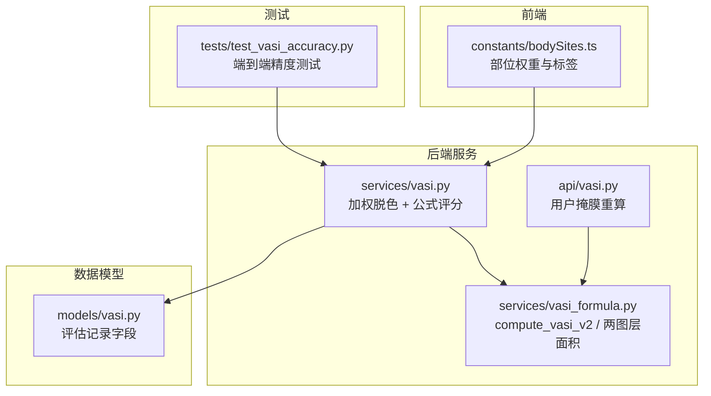
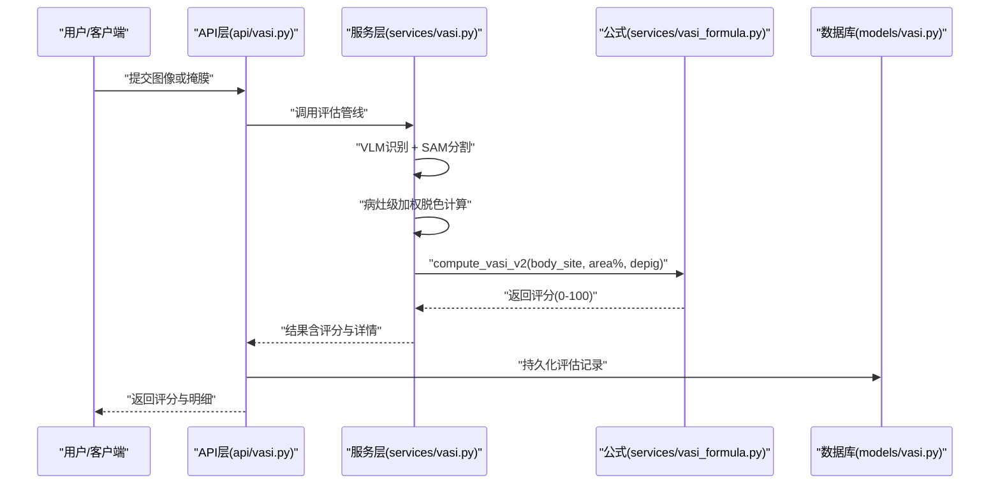
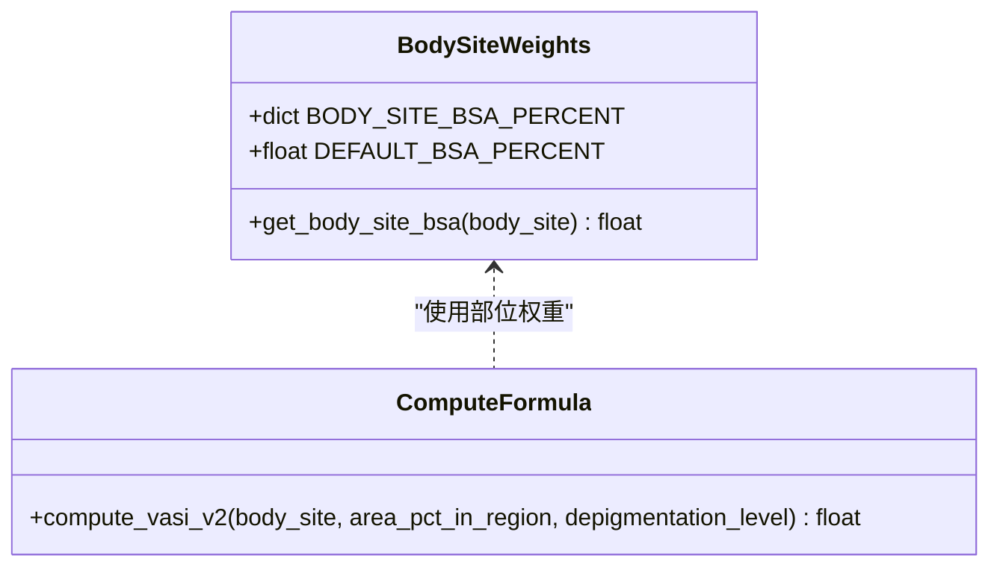
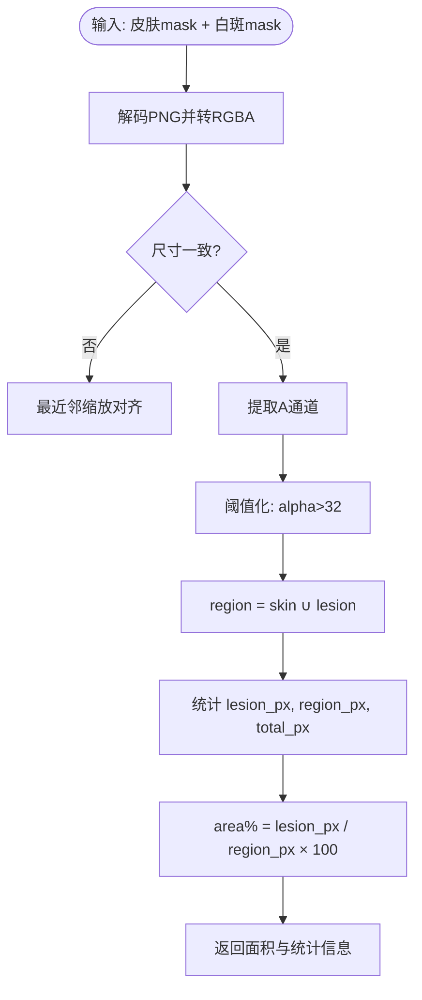
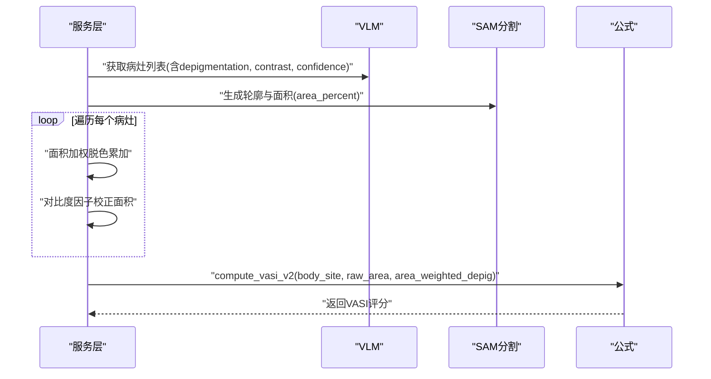
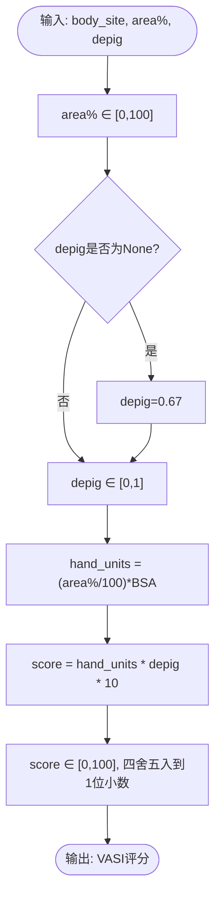
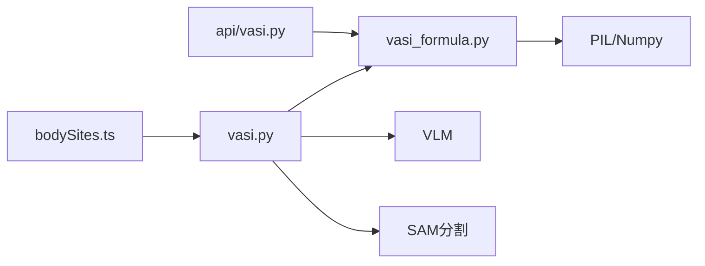

# VASI计算公式

<cite>
**本文引用的文件**   
- [web/backend/services/vasi_formula.py](file://web/backend/services/vasi_formula.py)
- [web/backend/services/vasi.py](file://web/backend/services/vasi.py)
- [web/backend/api/vasi.py](file://web/backend/api/vasi.py)
- [web/app/src/constants/bodySites.ts](file://web/app/src/constants/bodySites.ts)
- [tests/test_vasi_accuracy.py](file://tests/test_vasi_accuracy.py)
- [web/backend/models/vasi.py](file://web/backend/models/vasi.py)
</cite>

## 目录
1. [简介](#简介)
2. [项目结构](#项目结构)
3. [核心组件](#核心组件)
4. [架构总览](#架构总览)
5. [详细组件分析](#详细组件分析)
6. [依赖关系分析](#依赖关系分析)
7. [性能与数值精度](#性能与数值精度)
8. [故障排查指南](#故障排查指南)
9. [结论](#结论)
10. [附录：公式验证与临床说明](#附录公式验证与临床说明)

## 简介
本技术文档聚焦于白癜风面积严重度指数（VASI）计算公式模块，系统阐述其数学原理、部位权重系数、脱色程度影响因子、以及 compute_vasi_v2 函数的实现逻辑。文档同时覆盖 area_percentage 的计算方法、body_site 分类标准、最终评分算法、边界与异常值处理机制，并提供公式验证思路与临床解释。该模块基于改良的 VASI 手单位体系（参考 Hamzavi et al. 2004），将“区域白斑面积占比 × 部位BSA权重 × 脱色程度”统一映射到 0–100 的评分区间，确保前后端一致性与可追溯性。

## 项目结构
与 VASI 计算相关的代码主要分布在后端服务层、API 层、前端常量定义与测试脚本中：
- 公式与工具：web/backend/services/vasi_formula.py
- 流程编排与加权脱色：web/backend/services/vasi.py
- API 调用与用户修正重算：web/backend/api/vasi.py
- 身体部位权重（前端单源）：web/app/src/constants/bodySites.ts
- 评估数据模型与字段扩展：web/backend/models/vasi.py
- 精度对比与流水线测试：tests/test_vasi_accuracy.py

图表来源
- [web/backend/services/vasi_formula.py:1-121](file://web/backend/services/vasi_formula.py#L1-L121)
- [web/backend/services/vasi.py:867-985](file://web/backend/services/vasi.py#L867-L985)
- [web/backend/api/vasi.py:587-618](file://web/backend/api/vasi.py#L587-L618)
- [web/app/src/constants/bodySites.ts:1-87](file://web/app/src/constants/bodySites.ts#L1-L87)
- [web/backend/models/vasi.py:74-88](file://web/backend/models/vasi.py#L74-L88)
- [tests/test_vasi_accuracy.py:251-313](file://tests/test_vasi_accuracy.py#L251-L313)

章节来源
- [web/backend/services/vasi_formula.py:1-121](file://web/backend/services/vasi_formula.py#L1-L121)
- [web/backend/services/vasi.py:867-985](file://web/backend/services/vasi.py#L867-L985)
- [web/backend/api/vasi.py:587-618](file://web/backend/api/vasi.py#L587-L618)
- [web/app/src/constants/bodySites.ts:1-87](file://web/app/src/constants/bodySites.ts#L1-L87)
- [web/backend/models/vasi.py:74-88](file://web/backend/models/vasi.py#L74-L88)
- [tests/test_vasi_accuracy.py:251-313](file://tests/test_vasi_accuracy.py#L251-L313)

## 核心组件
- 部位权重字典与默认值：BODY_SITE_BSA_PERCENT、DEFAULT_BSA_PERCENT、get_body_site_bsa
- 核心评分函数：compute_vasi_v2
- 两图层面积计算：compute_two_layer_area
- 单层掩膜面积计算：compute_mask_area_percent
- 皮肤区域分母面积计算：compute_mask_area_percent_of_skin
- 加权脱色与最终评分：在 vasi.py 中按病灶级加权汇总后调用 compute_vasi_v2

章节来源
- [web/backend/services/vasi_formula.py:22-68](file://web/backend/services/vasi_formula.py#L22-L68)
- [web/backend/services/vasi_formula.py:71-101](file://web/backend/services/vasi_formula.py#L71-L101)
- [web/backend/services/vasi_formula.py:117-165](file://web/backend/services/vasi_formula.py#L117-L165)
- [web/backend/services/vasi_formula.py:168-194](file://web/backend/services/vasi_formula.py#L168-L194)
- [web/backend/services/vasi_formula.py:197-271](file://web/backend/services/vasi_formula.py#L197-L271)
- [web/backend/services/vasi.py:867-985](file://web/backend/services/vasi.py#L867-L985)

## 架构总览
下图展示从输入图像到最终 VASI 评分的关键流程：VLM 识别 → SAM 分割 → 病灶级加权脱色 → 公式评分。

图表来源
- [web/backend/api/vasi.py:587-618](file://web/backend/api/vasi.py#L587-L618)
- [web/backend/services/vasi.py:867-985](file://web/backend/services/vasi.py#L867-L985)
- [web/backend/services/vasi_formula.py:71-101](file://web/backend/services/vasi_formula.py#L71-L101)
- [web/backend/models/vasi.py:74-88](file://web/backend/models/vasi.py#L74-L88)

## 详细组件分析

### 数学原理与公式推导
- 基本思想：以“手单位”为基准，将各部位占体表面积的比例作为权重，结合白斑在该部位的面积占比与脱色程度，得到 0–100 的评分。
- 公式表达：
  - hand_units = (area_pct_in_region / 100) × BSA_PERCENT(body_site)
  - VASI = hand_units × depigmentation_level × 10
  - 其中：
    - area_pct_in_region ∈ [0, 100] 表示该部位内白斑像素占比
    - BSA_PERCENT(body_site) 为该部位占全身表面积的近似百分比
    - depigmentation_level ∈ [0, 1] 表示脱色程度（0=无脱色，1=完全脱色）
- 归一化与截断：
  - 对 area_pct_in_region 做 [0, 100] 截断
  - 对 depigmentation_level 做 [0, 1] 截断
  - 最终 score 再截断至 [0, 100]，并保留一位小数

章节来源
- [web/backend/services/vasi_formula.py:71-101](file://web/backend/services/vasi_formula.py#L71-L101)

### 部位权重系数（BSA）与 body_site 分类标准
- 部位权重字典 BODY_SITE_BSA_PERCENT 提供英文与中文两套键名，涵盖面部、颈部、躯干、上/下背部、左右臂/手/腿/足等，并包含历史别名（如 back、arms、legs、feet）。
- 若 body_site 未知或未命中字典，则回退到 DEFAULT_BSA_PERCENT=9.0（假设一个典型部位）。
- 前端 constants/bodySites.ts 定义了同一套权重与标签，保证前后端一致性。

图表来源
- [web/backend/services/vasi_formula.py:22-68](file://web/backend/services/vasi_formula.py#L22-L68)
- [web/backend/services/vasi_formula.py:71-101](file://web/backend/services/vasi_formula.py#L71-L101)
- [web/app/src/constants/bodySites.ts:32-47](file://web/app/src/constants/bodySites.ts#L32-L47)

章节来源
- [web/backend/services/vasi_formula.py:22-68](file://web/backend/services/vasi_formula.py#L22-L68)
- [web/app/src/constants/bodySites.ts:1-87](file://web/app/src/constants/bodySites.ts#L1-L87)

### area_percentage 计算方法
- 两图层面积（推荐）：compute_two_layer_area
  - 输入：皮肤层 mask（RGBA PNG）、白斑层 mask（RGBA PNG）
  - 计算：region_mask = skin_alpha > 32 ∪ lesion_alpha > 32；area% = lesion_pixels / region_pixels × 100
  - 输出：area_percent_in_region、lesion_pixels、region_pixels、region_percent_of_image
- 单层掩膜面积（备用）：compute_mask_area_percent
  - 计算：不透明像素占比（相对于整图像素总数）
- 皮肤区域分母面积（更贴近临床）：compute_mask_area_percent_of_skin
  - 通过皮肤检测构建分析区域，计算白斑像素在皮肤区域内的占比，并返回 image/skin 双分母指标

图表来源
- [web/backend/services/vasi_formula.py:117-165](file://web/backend/services/vasi_formula.py#L117-L165)

章节来源
- [web/backend/services/vasi_formula.py:117-165](file://web/backend/services/vasi_formula.py#L117-L165)
- [web/backend/services/vasi_formula.py:168-194](file://web/backend/services/vasi_formula.py#L168-L194)
- [web/backend/services/vasi_formula.py:197-271](file://web/backend/services/vasi_formula.py#L197-L271)

### 脱色程度影响因子与加权策略
- 病灶级脱色：由 VLM 给出每个病灶的 depigmentation_level（0–1），并结合对比度与置信度进行合理性校验。
- 加权汇总：按面积加权求和，得到整体加权脱色水平 area_weighted_depig。
- 对比度调整面积：根据各病灶对比度因子对面积进行校正，并按 raw_area 比例缩放避免重复计数。
- 最终评分：使用 SAM 实测面积 raw_area 与加权脱色 area_weighted_depig 代入 compute_vasi_v2。

图表来源
- [web/backend/services/vasi.py:867-985](file://web/backend/services/vasi.py#L867-L985)
- [web/backend/services/vasi_formula.py:71-101](file://web/backend/services/vasi_formula.py#L71-L101)

章节来源
- [web/backend/services/vasi.py:867-985](file://web/backend/services/vasi.py#L867-L985)

### 最终评分算法与边界处理
- 输入参数：
  - body_site：部位标识（支持中英文键）
  - area_pct_in_region：部位内白斑面积占比（0–100）
  - depigmentation_level：脱色程度（0–1），缺失时回退默认值
- 处理步骤：
  - 截断 area_pct_in_region 至 [0, 100]
  - 若 depigmentation_level 为 None，赋默认值 0.67；否则截断至 [0, 1]
  - 计算 hand_units 与 score，并将 score 截断至 [0, 100]，保留一位小数
- 异常与边界：
  - 未知 body_site 使用 DEFAULT_BSA_PERCENT=9.0
  - 非法输入自动截断，不会抛出异常
  - 两图层面积为零时返回空，调用方需降级处理

图表来源
- [web/backend/services/vasi_formula.py:71-101](file://web/backend/services/vasi_formula.py#L71-L101)

章节来源
- [web/backend/services/vasi_formula.py:71-101](file://web/backend/services/vasi_formula.py#L71-L101)

### 用户修正与两图层重算
- API 层支持用户上传皮肤层与白斑层掩膜，重新计算 area% 与 VASI 评分。
- 当用户提供掩膜时，优先采用两图层面积计算，并标记 is_user_corrected=true，保存 user_mask_image 与分层 data URL 用于审计与训练。

章节来源
- [web/backend/api/vasi.py:587-618](file://web/backend/api/vasi.py#L587-L618)
- [web/backend/models/vasi.py:74-88](file://web/backend/models/vasi.py#L74-L88)

## 依赖关系分析
- 公式模块依赖 PIL/Numpy 进行图像处理；若不可用则优雅降级返回 None。
- 服务层依赖 VLM 与 SAM 的结果，并在失败时回退到 VLM 估算。
- 前端常量与后端权重字典保持一致，避免部位权重漂移。

图表来源
- [web/backend/services/vasi_formula.py:117-165](file://web/backend/services/vasi_formula.py#L117-L165)
- [web/backend/services/vasi.py:867-985](file://web/backend/services/vasi.py#L867-L985)
- [web/app/src/constants/bodySites.ts:1-87](file://web/app/src/constants/bodySites.ts#L1-L87)

章节来源
- [web/backend/services/vasi_formula.py:117-165](file://web/backend/services/vasi_formula.py#L117-L165)
- [web/backend/services/vasi.py:867-985](file://web/backend/services/vasi.py#L867-L985)
- [web/app/src/constants/bodySites.ts:1-87](file://web/app/src/constants/bodySites.ts#L1-L87)

## 性能与数值精度
- 数值精度：
  - area% 与 score 均进行四舍五入与截断，确保稳定输出
  - 两图层面积计算使用整数像素计数，避免浮点累积误差
- 性能特征：
  - 两图层面积计算依赖 PIL/Numpy，内存占用与图像尺寸相关
  - 加权脱色与对比度校正为 O(n) 线性扫描，n 为病灶数量
- 优化建议：
  - 大图像预处理时先降采样再进行 mask 计算
  - 缓存 skin_mask 与 analysis_region 避免重复计算

章节来源
- [web/backend/services/vasi_formula.py:117-165](file://web/backend/services/vasi_formula.py#L117-L165)
- [web/backend/services/vasi.py:867-985](file://web/backend/services/vasi.py#L867-L985)

## 故障排查指南
- 常见错误与处理：
  - 两图层 mask 解码失败：返回 None，调用方应回退到单层 mask 或 VLM 估算
  - 尺寸不一致：自动最近邻缩放对齐，仍失败则返回 None
  - 区域像素为零：返回 None，调用方需降级处理
  - 未知 body_site：使用默认权重 9.0，建议在入口处校验并提示用户
- 调试建议：
  - 打印 area_percent_in_region、weighted_depigmentation、contrast_adjusted_area 等中间变量
  - 检查 skin_region_ratio 与 denominator 是否合理
  - 使用 tests/test_vasi_accuracy.py 进行端到端回归测试

章节来源
- [web/backend/services/vasi_formula.py:117-165](file://web/backend/services/vasi_formula.py#L117-L165)
- [web/backend/services/vasi.py:947-985](file://web/backend/services/vasi.py#L947-L985)
- [tests/test_vasi_accuracy.py:251-313](file://tests/test_vasi_accuracy.py#L251-L313)

## 结论
本模块以改良 VASI 手单位体系为核心，通过部位权重、面积占比与脱色程度的乘积映射到 0–100 评分，兼顾临床合理性与工程鲁棒性。两图层面积计算与皮肤区域分母提升了面积估计的临床意义；病灶级加权脱色与对比度校正增强了评分准确性；完善的边界与异常处理确保系统在多种输入条件下稳定运行。前后端一致的 body_site 权重字典避免了权重漂移，测试脚本提供了端到端的精度验证能力。

## 附录：公式验证与临床说明
- 公式验证思路：
  - 构造极端用例：area%=0/100、depig=0/1、不同 body_site，验证输出范围与单调性
  - 随机抽样测试：生成大量随机输入，统计评分分布与均值方差
  - 回归测试：使用 tests/test_vasi_accuracy.py 对真实图片进行全流程评测，比较 VLM 估算与 SAM 实测的差异
- 临床说明：
  - 部位权重依据改良 VASI 手单位体系，反映不同部位对总体病情的贡献差异
  - 脱色程度 0–1 对应“无脱色—完全脱色”，与临床观察一致
  - 两图层面积以皮肤区域为分母，更符合皮肤科评估习惯

章节来源
- [tests/test_vasi_accuracy.py:251-313](file://tests/test_vasi_accuracy.py#L251-L313)
- [web/backend/services/vasi_formula.py:22-68](file://web/backend/services/vasi_formula.py#L22-L68)
- [web/backend/services/vasi.py:867-985](file://web/backend/services/vasi.py#L867-L985)