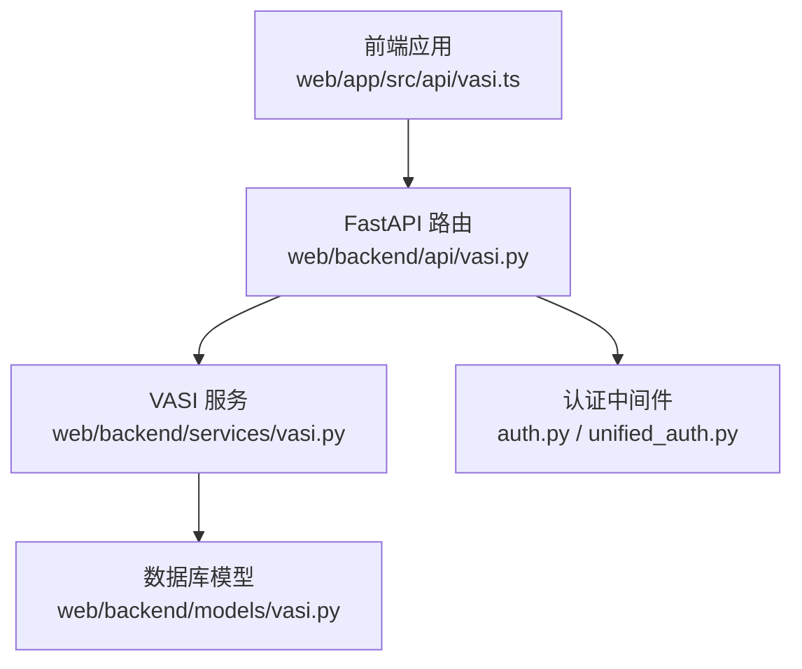
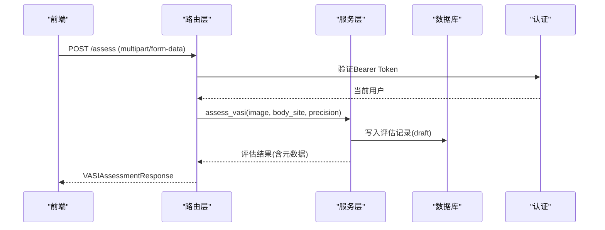
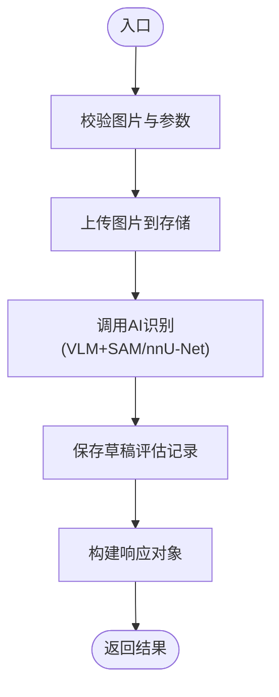
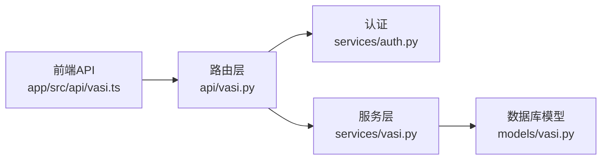

# VASI评估API接口

<cite>
**本文引用的文件**
- [web/backend/api/vasi.py](file://web/backend/api/vasi.py)
- [web/backend/services/vasi.py](file://web/backend/services/vasi.py)
- [web/backend/api/models.py](file://web/backend/api/models.py)
- [web/backend/models/vasi.py](file://web/backend/models/vasi.py)
- [web/backend/services/auth.py](file://web/backend/services/auth.py)
- [web/backend/services/unified_auth.py](file://web/backend/services/unified_auth.py)
- [web/app/src/api/vasi.ts](file://web/app/src/api/vasi.ts)
</cite>

## 目录
1. [简介](#简介)
2. [项目结构](#项目结构)
3. [核心组件](#核心组件)
4. [架构总览](#架构总览)
5. [详细接口说明](#详细接口说明)
6. [依赖关系分析](#依赖关系分析)
7. [性能与可用性](#性能与可用性)
8. [故障排查指南](#故障排查指南)
9. [结论](#结论)
10. [附录：前端集成示例](#附录前端集成示例)

## 简介
本文件为 VASI（白癜风面积严重程度指数）评估模块的 RESTful API 文档，覆盖以下端点：
- POST /assess：创建评估（上传白斑照片并计算VASI评分）
- GET /history：获取用户历史评估记录（支持分页、部位筛选、日期范围）
- GET /trend：获取趋势数据（用于曲线图）
- POST /check-photo-quality：照片质量检查（返回清晰度、亮度、皮肤占比等指标与建议）

所有接口均需要认证（Bearer Token），请求体与响应格式遵循 Pydantic 模型定义。后端采用 FastAPI 路由 + 服务层 + 数据库模型的分层设计，前端通过 TypeScript API 客户端调用。

## 项目结构
- 路由层：web/backend/api/vasi.py
- 服务层：web/backend/services/vasi.py
- 响应模型：web/backend/api/models.py
- 数据模型：web/backend/models/vasi.py
- 认证：web/backend/services/auth.py, web/backend/services/unified_auth.py
- 前端调用：web/app/src/api/vasi.ts

图表来源
- [web/backend/api/vasi.py:45-53](file://web/backend/api/vasi.py#L45-L53)
- [web/backend/services/vasi.py:159-243](file://web/backend/services/vasi.py#L159-L243)
- [web/backend/models/vasi.py:26-104](file://web/backend/models/vasi.py#L26-L104)
- [web/backend/services/auth.py:204-220](file://web/backend/services/auth.py#L204-L220)

章节来源
- [web/backend/api/vasi.py:1-100](file://web/backend/api/vasi.py#L1-L100)
- [web/backend/services/vasi.py:1-120](file://web/backend/services/vasi.py#L1-L120)

## 核心组件
- 路由层：定义REST端点、参数校验、异常处理、响应组装
- 服务层：业务逻辑（图片上传、AI识别流程、历史/趋势查询、轮廓修正）
- 模型层：数据库表结构与字段定义（评估记录、质量标签、反馈信号等）
- 认证：统一JWT Bearer认证，支持可选/必需用户上下文
- 前端：TypeScript类型定义与封装方法，便于页面调用

章节来源
- [web/backend/api/models.py:9-94](file://web/backend/api/models.py#L9-L94)
- [web/backend/models/vasi.py:26-104](file://web/backend/models/vasi.py#L26-L104)
- [web/backend/services/auth.py:204-220](file://web/backend/services/auth.py#L204-L220)
- [web/app/src/api/vasi.ts:122-237](file://web/app/src/api/vasi.ts#L122-L237)

## 架构总览

图表来源
- [web/backend/api/vasi.py:45-165](file://web/backend/api/vasi.py#L45-L165)
- [web/backend/services/vasi.py:159-243](file://web/backend/services/vasi.py#L159-L243)
- [web/backend/services/auth.py:204-220](file://web/backend/services/auth.py#L204-L220)

## 详细接口说明

### 通用约定
- 基础路径：/api/vasi（由路由注册决定）
- 认证：所有接口均需携带 Authorization: Bearer <token>
- 内容类型：
  - 文件上传：multipart/form-data
  - JSON：application/json
- 时间格式：ISO 8601 UTC
- 错误响应：HTTPException 返回标准错误体（包含 detail）

章节来源
- [web/backend/api/vasi.py:45-53](file://web/backend/api/vasi.py#L45-L53)
- [web/backend/services/auth.py:204-220](file://web/backend/services/auth.py#L204-L220)

---

### POST /assess（创建评估）
- 方法：POST
- URL：/api/vasi/assess
- 认证：必须（Bearer Token）
- 请求体：multipart/form-data
  - image：图片文件（JPG/PNG/WebP，建议小于10MB；服务端会进行magic byte校验）
  - body_site：评估部位（支持中英文键值映射）
  - precision：评估精度，默认 quick（快速约10s），可选 precise（精确约70s）
  - has_reference：是否检测到参照物（true/false/1/yes），可选
- 成功响应：VASIAssessmentResponse（见下方字段说明）
- 错误码：
  - 400：输入校验失败（图片过大、格式不支持、部位无效、图片内容与声明不符）
  - 401：未认证或令牌无效
  - 413：图片过大（质量检查端点限制20MB）
  - 500：服务内部错误

响应字段（节选）
- id, user_id, image_url, vasi_score, body_site, area_percentage, classification, stage
- contours：轮廓数组
- assessment_date, created_at
- confidence, final_vasi_score, final_area_percentage, is_user_corrected, depigmentation_level
- skin_layer_data_url, lesion_layer_data_url
- assessment_source, suspected_lesions, reference_objects, skin_fitzpatrick, visual_features

流程图（创建评估）

图表来源
- [web/backend/services/vasi.py:159-243](file://web/backend/services/vasi.py#L159-L243)
- [web/backend/api/vasi.py:45-165](file://web/backend/api/vasi.py#L45-L165)

章节来源
- [web/backend/api/vasi.py:45-165](file://web/backend/api/vasi.py#L45-L165)
- [web/backend/services/vasi.py:159-243](file://web/backend/services/vasi.py#L159-L243)
- [web/backend/api/models.py:9-44](file://web/backend/api/models.py#L9-L44)

---

### GET /history（获取历史）
- 方法：GET
- URL：/api/vasi/history
- 认证：必须（Bearer Token）
- 查询参数：
  - limit：返回条数上限（最大50）
  - offset：偏移量
  - body_site：按部位筛选（支持中英文键值映射）
  - start_date, end_date：ISO 8601 日期范围
- 成功响应：VASIHistoryResponse
  - total：总数
  - items：历史记录列表（每项包含id, image_url, vasi_score, body_site, area_percentage, stage, assessment_date，以及final_*字段）
- 错误码：
  - 401：未认证
  - 500：服务内部错误

章节来源
- [web/backend/api/vasi.py:204-257](file://web/backend/api/vasi.py#L204-L257)
- [web/backend/services/vasi.py:282-334](file://web/backend/services/vasi.py#L282-L334)
- [web/backend/api/models.py:46-64](file://web/backend/api/models.py#L46-L64)

---

### GET /trend（趋势数据）
- 方法：GET
- URL：/api/vasi/trend
- 认证：必须（Bearer Token）
- 查询参数：
  - days：天数范围（1-365，默认30）
  - body_site：按部位筛选（可选）
- 成功响应：VASITrendResponse
  - body_site：部位名称
  - period：起止时间
  - data：时间序列数据（date, vasi_score, stage）
  - summary：首尾分数、变化量、变化百分比、趋势（好转/稳定/恶化）
- 错误码：
  - 401：未认证
  - 500：服务内部错误

章节来源
- [web/backend/api/vasi.py:448-473](file://web/backend/api/vasi.py#L448-L473)
- [web/backend/services/vasi.py:443-537](file://web/backend/services/vasi.py#L443-L537)
- [web/backend/api/models.py:66-87](file://web/backend/api/models.py#L66-L87)

---

### POST /check-photo-quality（照片质量检查）
- 方法：POST
- URL：/api/vasi/check-photo-quality
- 认证：必须（Bearer Token）
- 请求体：multipart/form-data
  - image：图片文件（限制20MB）
- 成功响应：
  - overall：总体质量（good/poor等）
  - blur_score, blur_ok：模糊度评分与判定
  - skin_ratio, skin_ok：皮肤占比与判定
  - brightness_mean, lighting_ok：亮度均值与光照判定
  - resolution：分辨率
  - size_ok：尺寸判定
  - suggestions：改进建议数组
- 错误码：
  - 401：未认证
  - 413：图片过大
  - 500：服务内部错误

章节来源
- [web/backend/api/vasi.py:511-542](file://web/backend/api/vasi.py#L511-L542)

---

### 其他相关端点（补充）
- GET /assess/{assessment_id}：获取单条评估详情（同响应模型）
- POST /assess/{assessment_id}/finalize：确认草稿评估（状态从draft变为active）
- POST /assess/{assessment_id}/abandon：放弃草稿评估（标记为abandoned）
- DELETE /assess/{assessment_id}：删除单条评估
- DELETE /assess/batch：批量删除评估
- POST /assess/{assessment_id}/contour：提交用户修正轮廓（可计算最终VASI分数）
- POST /promptable/prepare, /promptable/click, /promptable/refine-circle：交互式分割辅助

章节来源
- [web/backend/api/vasi.py:167-202](file://web/backend/api/vasi.py#L167-L202)
- [web/backend/api/vasi.py:259-351](file://web/backend/api/vasi.py#L259-L351)
- [web/backend/api/vasi.py:475-738](file://web/backend/api/vasi.py#L475-L738)
- [web/backend/api/vasi.py:357-445](file://web/backend/api/vasi.py#L357-L445)

## 依赖关系分析
- 路由依赖认证：所有端点使用 get_current_user 或 get_current_admin_user 注入当前用户
- 服务依赖数据库会话：get_db 提供 SQLAlchemy Session
- 服务依赖AI子服务：预处理、质量检查、分割（VLM+SAM/nnU-Net）
- 前端依赖TS类型：确保前后端数据结构一致

图表来源
- [web/backend/api/vasi.py:45-53](file://web/backend/api/vasi.py#L45-L53)
- [web/backend/services/auth.py:204-220](file://web/backend/services/auth.py#L204-L220)
- [web/backend/services/vasi.py:159-243](file://web/backend/services/vasi.py#L159-L243)
- [web/backend/models/vasi.py:26-104](file://web/backend/models/vasi.py#L26-L104)
- [web/app/src/api/vasi.ts:122-237](file://web/app/src/api/vasi.ts#L122-L237)

章节来源
- [web/backend/api/vasi.py:1-100](file://web/backend/api/vasi.py#L1-L100)
- [web/backend/services/vasi.py:1-120](file://web/backend/services/vasi.py#L1-L120)

## 性能与可用性
- 评估耗时：quick模式约10秒，precise模式约70秒；前端应设置合理超时
- 图片大小限制：上传评估接口建议≤10MB；质量检查接口限制20MB
- 质量前置拦截：若整体质量为poor，将直接返回质量报告而不执行AI识别，节省资源
- 并发与缓存：promptable系列接口支持图片缓存键，避免重复编码
- 趋势与历史：仅统计active状态的评估，排除草稿与放弃项，保证数据一致性

章节来源
- [web/backend/services/vasi.py:159-243](file://web/backend/services/vasi.py#L159-L243)
- [web/backend/api/vasi.py:511-542](file://web/backend/api/vasi.py#L511-L542)
- [web/backend/services/vasi.py:282-334](file://web/backend/services/vasi.py#L282-L334)
- [web/backend/services/vasi.py:443-537](file://web/backend/services/vasi.py#L443-L537)

## 故障排查指南
- 401 未认证：检查Authorization头是否正确携带Bearer Token；确认Token未过期且用户未被封禁
- 400 参数错误：检查body_site是否在支持列表中；图片格式与magic byte校验是否通过
- 413 图片过大：质量检查接口限制20MB；评估接口建议≤10MB
- 500 服务错误：查看后端日志，确认AI服务可用性与数据库连接正常
- 质量差导致无分数：quality_reject=true时，返回质量报告与建议，需重新拍摄

章节来源
- [web/backend/services/auth.py:204-220](file://web/backend/services/auth.py#L204-L220)
- [web/backend/services/vasi.py:539-572](file://web/backend/services/vasi.py#L539-L572)
- [web/backend/api/vasi.py:511-542](file://web/backend/api/vasi.py#L511-L542)

## 结论
VASI评估API提供了完整的评估生命周期能力：从照片质量检查、AI识别、用户修正到历史与趋势分析。接口设计清晰、认证严格、错误处理完善，适合前后端分离架构下的集成。建议前端在调用时做好超时、重试与错误提示，并在质量不佳时引导用户重新拍摄。

## 附录：前端集成示例
以下为常见场景的前端调用方式（基于TypeScript封装）：

- 创建评估
  - 方法：vasiApi.assess(image, bodySite, precision, options)
  - 说明：支持hasReferenceCard选项以标记参照物检测
  - 参考路径：[web/app/src/api/vasi.ts:122-134](file://web/app/src/api/vasi.ts#L122-L134)

- 获取历史
  - 方法：vasiApi.getHistory(limit, offset, bodySite)
  - 参考路径：[web/app/src/api/vasi.ts:136-141](file://web/app/src/api/vasi.ts#L136-L141)

- 获取趋势
  - 方法：vasiApi.getTrend(bodySite, days)
  - 参考路径：[web/app/src/api/vasi.ts:148-153](file://web/app/src/api/vasi.ts#L148-L153)

- 照片质量检查
  - 方法：vasiApi.checkPhotoQuality(image)
  - 参考路径：[web/app/src/api/vasi.ts:184-191](file://web/app/src/api/vasi.ts#L184-L191)

- 提交轮廓修正
  - 方法：vasiApi.submitContour(assessmentId, contours, maskImage)
  - 参考路径：[web/app/src/api/vasi.ts:155-164](file://web/app/src/api/vasi.ts#L155-L164)

- 双图层掩膜修正
  - 方法：vasiApi.submitTwoLayerMask(assessmentId, skinMaskImage, lesionMaskImage)
  - 参考路径：[web/app/src/api/vasi.ts:166-173](file://web/app/src/api/vasi.ts#L166-L173)

- 确认/放弃草稿
  - 方法：vasiApi.finalizeAssessment / abandonAssessment
  - 参考路径：[web/app/src/api/vasi.ts:228-236](file://web/app/src/api/vasi.ts#L228-L236)

章节来源
- [web/app/src/api/vasi.ts:122-237](file://web/app/src/api/vasi.ts#L122-L237)