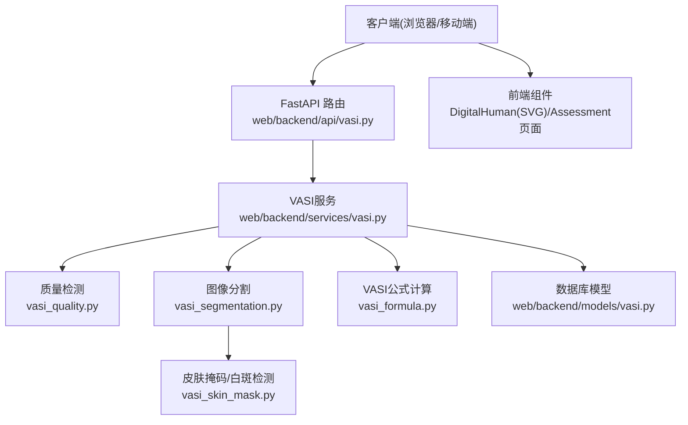
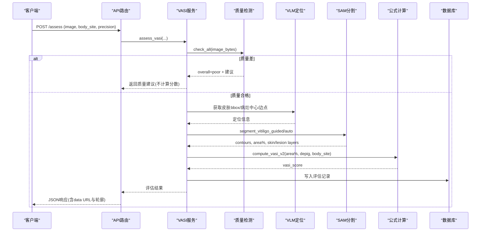
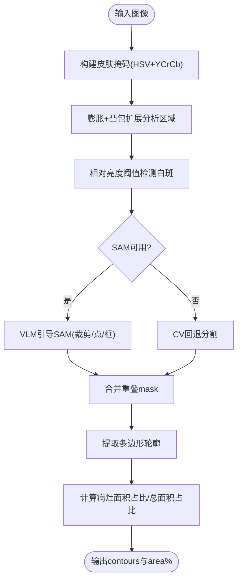
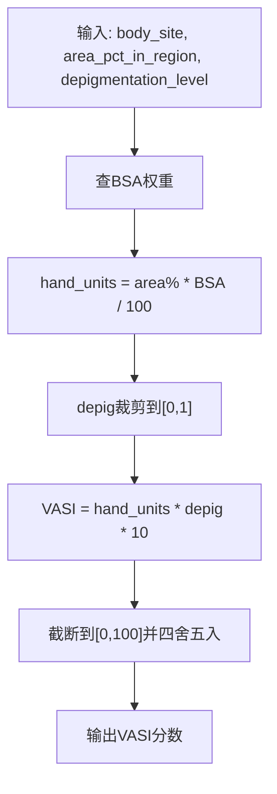
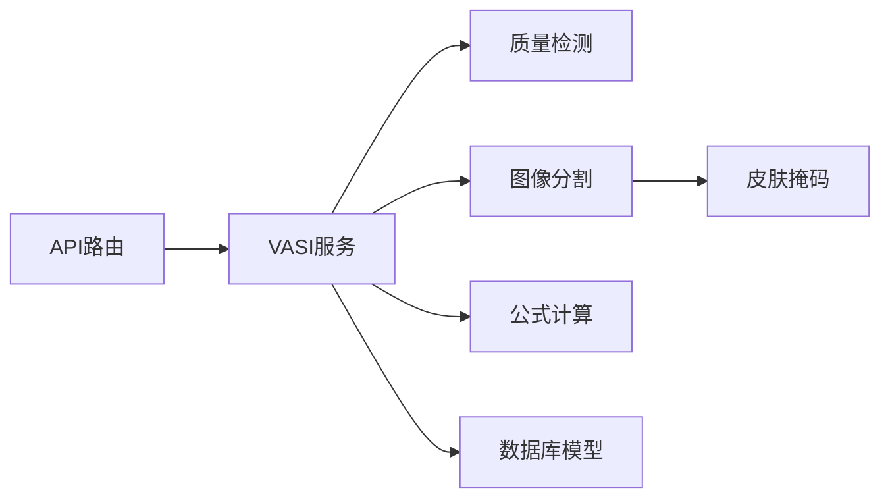

# VASI评估服务

<cite>
**本文引用的文件**
- [web/backend/services/vasi.py](file://web/backend/services/vasi.py)
- [web/backend/api/vasi.py](file://web/backend/api/vasi.py)
- [web/backend/services/vasi_segmentation.py](file://web/backend/services/vasi_segmentation.py)
- [web/backend/services/vasi_skin_mask.py](file://web/backend/services/vasi_skin_mask.py)
- [web/backend/services/vasi_formula.py](file://web/backend/services/vasi_formula.py)
- [web/backend/services/vasi_quality.py](file://web/backend/services/vasi_quality.py)
- [web/backend/models/vasi.py](file://web/backend/models/vasi.py)
- [.agents/skills/3d-model-work/SKILL.md](file://.agents/skills/3d-model-work/SKILL.md)
</cite>

## 目录
1. [简介](#简介)
2. [项目结构](#项目结构)
3. [核心组件](#核心组件)
4. [架构总览](#架构总览)
5. [详细组件分析](#详细组件分析)
6. [依赖关系分析](#依赖关系分析)
7. [性能考量](#性能考量)
8. [故障排查指南](#故障排查指南)
9. [结论](#结论)
10. [附录：API接口规范与集成示例](#附录api接口规范与集成示例)

## 简介
本技术文档面向VASI（白癜风面积严重度指数）评估服务，覆盖以下关键主题：
- 白斑图像分割处理流水线（SAM-Med2D/SAM自动模式、皮肤掩码提取、白斑区域识别）
- VASI评分计算算法（基于身体部位体表面积权重与去色素程度的修正公式）
- 评估报告生成与结果可视化（皮肤层/病灶层数据URL、轮廓多边形、趋势图）
- 质量检测机制（模糊、光照、分辨率、皮肤存在性）
- 批量处理能力、精度验证方法与性能优化策略
- API接口规范与前端集成要点

该服务通过“质量检查→预处理→VLM定位引导→SAM分割→nnU-Net回退→公式计算→持久化”的完整链路，提供可解释、可追溯、可修正的VASI评估能力。

## 项目结构
后端以FastAPI暴露REST接口，核心服务位于web/backend/services，模型定义在web/backend/models，API路由在web/backend/api。前端使用Vue组件进行交互，3D人体展示已切换为SVG矢量图以提升加载性能。

图表来源
- [web/backend/api/vasi.py:45-165](file://web/backend/api/vasi.py#L45-L165)
- [web/backend/services/vasi.py:159-243](file://web/backend/services/vasi.py#L159-L243)
- [web/backend/services/vasi_quality.py:81-285](file://web/backend/services/vasi_quality.py#L81-L285)
- [web/backend/services/vasi_segmentation.py:278-351](file://web/backend/services/vasi_segmentation.py#L278-L351)
- [web/backend/services/vasi_skin_mask.py:144-222](file://web/backend/services/vasi_skin_mask.py#L144-L222)
- [web/backend/services/vasi_formula.py:71-101](file://web/backend/services/vasi_formula.py#L71-L101)
- [web/backend/models/vasi.py:26-104](file://web/backend/models/vasi.py#L26-L104)

章节来源
- [web/backend/api/vasi.py:45-165](file://web/backend/api/vasi.py#L45-L165)
- [web/backend/services/vasi.py:159-243](file://web/backend/services/vasi.py#L159-L243)

## 核心组件
- 质量检查器：对上传图像进行模糊度、光照、分辨率、皮肤存在性等指标评估，返回结构化建议，必要时拒绝低质图片进入AI流程。
- 图像分割服务：基于SAM自动/引导分割，结合皮肤掩码与相对亮度阈值，输出白斑轮廓与总面积占比；支持快速与精确两种精度模式，以及分块推理与迭代细化。
- 皮肤掩码与白斑检测：HSV+YCrCb双空间肤色检测，凸包扩展包含白斑区域，相对亮度阈值自适应检测白斑像素。
- VASI公式计算：按身体部位BSA权重与去色素程度计算VASI分数，支持用户修正后的双层mask重算。
- 评估服务编排：串联质量检查、预处理、VLM定位、SAM分割、回退策略、公式计算与持久化。
- 数据模型：存储评估记录、质量报告、双层mask、用户修正差异、趋势数据等。

章节来源
- [web/backend/services/vasi_quality.py:81-285](file://web/backend/services/vasi_quality.py#L81-L285)
- [web/backend/services/vasi_segmentation.py:278-351](file://web/backend/services/vasi_segmentation.py#L278-L351)
- [web/backend/services/vasi_skin_mask.py:144-222](file://web/backend/services/vasi_skin_mask.py#L144-L222)
- [web/backend/services/vasi_formula.py:71-101](file://web/backend/services/vasi_formula.py#L71-L101)
- [web/backend/services/vasi.py:159-243](file://web/backend/services/vasi.py#L159-L243)
- [web/backend/models/vasi.py:26-104](file://web/backend/models/vasi.py#L26-L104)

## 架构总览
端到端流程如下：
- 客户端上传图片并选择身体部位
- 后端执行质量检查，低质图片直接返回改进建议
- 可选预处理后调用VLM获取皮肤区域框与疑似病灶中心/边界点
- 使用VLM引导的SAM或自动SAM进行白斑分割，合并重叠mask，过滤与皮肤区域重叠不足的候选
- 计算各病灶面积占比与总面积占比，结合去色素程度计算VASI分数
- 将结果持久化为评估记录，返回皮肤层/病灶层data URL与轮廓用于可视化
- 支持用户修正轮廓与双层mask重算，更新最终分数与差异指标

图表来源
- [web/backend/api/vasi.py:45-165](file://web/backend/api/vasi.py#L45-L165)
- [web/backend/services/vasi.py:602-800](file://web/backend/services/vasi.py#L602-L800)
- [web/backend/services/vasi_quality.py:188-271](file://web/backend/services/vasi_quality.py#L188-L271)
- [web/backend/services/vasi_segmentation.py:278-351](file://web/backend/services/vasi_segmentation.py#L278-L351)
- [web/backend/services/vasi_formula.py:71-101](file://web/backend/services/vasi_formula.py#L71-L101)
- [web/backend/models/vasi.py:26-104](file://web/backend/models/vasi.py#L26-L104)

## 详细组件分析

### 图像分割与皮肤掩码
- 皮肤掩码构建：HSV+YCrCb双空间阈值融合，形态学开闭运算，得到稳定肤色前景。
- 分析区域扩展：对肤色前景膨胀并取最大轮廓凸包，确保白斑区域被纳入分析范围。
- 白斑检测：在分析区域内采用相对亮度阈值（皮肤中位L值+偏移），结合色度限制，形态学清理噪声。
- SAM整合：自动模式生成候选mask，仅保留与分析区域重叠≥阈值的mask；支持引导模式（皮肤bbox/病灶中心/边点）裁剪与聚焦。
- 轮廓提取：二值mask转归一化多边形坐标，合并重叠mask，统计各病灶面积占比与总面积占比。

图表来源
- [web/backend/services/vasi_skin_mask.py:144-222](file://web/backend/services/vasi_skin_mask.py#L144-L222)
- [web/backend/services/vasi_skin_mask.py:212-288](file://web/backend/services/vasi_skin_mask.py#L212-L288)
- [web/backend/services/vasi_segmentation.py:278-351](file://web/backend/services/vasi_segmentation.py#L278-L351)
- [web/backend/services/vasi_segmentation.py:1237-1261](file://web/backend/services/vasi_segmentation.py#L1237-L1261)

章节来源
- [web/backend/services/vasi_skin_mask.py:144-222](file://web/backend/services/vasi_skin_mask.py#L144-L222)
- [web/backend/services/vasi_skin_mask.py:212-288](file://web/backend/services/vasi_skin_mask.py#L212-L288)
- [web/backend/services/vasi_segmentation.py:278-351](file://web/backend/services/vasi_segmentation.py#L278-L351)
- [web/backend/services/vasi_segmentation.py:1237-1261](file://web/backend/services/vasi_segmentation.py#L1237-L1261)

### VASI评分计算与双层mask重算
- 基础公式：hand_units = area_pct_in_region × BSA_PERCENT(body_site) / 100；VASI = hand_units × depigmentation_level × 10，结果截断至[0,100]。
- 身体部位权重：中英文映射一致，未知部位默认9%。
- 双层mask重算：用户提供皮肤层与病灶层PNG data URL时，计算病灶像素占(skin∪lesion)的比例作为分母更合理；据此重新计算最终面积百分比与VASI分数。
- 去色素程度：来自VLM整体去色素等级/3，缺失时使用默认中值。

图表来源
- [web/backend/services/vasi_formula.py:22-68](file://web/backend/services/vasi_formula.py#L22-L68)
- [web/backend/services/vasi_formula.py:71-101](file://web/backend/services/vasi_formula.py#L71-L101)
- [web/backend/services/vasi_formula.py:117-165](file://web/backend/services/vasi_formula.py#L117-L165)

章节来源
- [web/backend/services/vasi_formula.py:71-101](file://web/backend/services/vasi_formula.py#L71-L101)
- [web/backend/services/vasi_formula.py:117-165](file://web/backend/services/vasi_formula.py#L117-L165)

### 质量检测机制
- 模糊度：拉普拉斯方差衡量清晰度，低于阈值提示稳定拍摄。
- 皮肤存在性：HSV+YCrCb双空间匹配，皮肤像素占比低于阈值提示取景不当。
- 光照：灰度均值判断过暗/过曝，给出自然光建议。
- 分辨率：最小宽高要求，过低提示使用更高像素设备。
- 综合评级：critical/soft失败数决定overall，poor时直接拒绝进入AI流程。

章节来源
- [web/backend/services/vasi_quality.py:81-285](file://web/backend/services/vasi_quality.py#L81-L285)

### 评估服务编排与持久化
- 输入校验：大小、MIME类型、magic byte签名防伪造。
- 质量检查：poor直接返回建议，避免浪费算力。
- VLM定位：获取皮肤bbox、病灶中心/边点、置信度过滤与尺寸合理性检查。
- SAM分割：优先引导模式，否则自动模式；支持快速/精确精度、分块推理与迭代细化。
- 公式计算：根据body_site与area%、depig计算VASI分数。
- 持久化：创建评估记录，保存原始响应、质量报告、双层mask、视觉特征等。
- 用户修正：提交轮廓或双层mask，重算最终面积与VASI分数，记录差异指标。

章节来源
- [web/backend/services/vasi.py:159-243](file://web/backend/services/vasi.py#L159-L243)
- [web/backend/services/vasi.py:539-600](file://web/backend/services/vasi.py#L539-L600)
- [web/backend/services/vasi.py:602-800](file://web/backend/services/vasi.py#L602-L800)
- [web/backend/api/vasi.py:544-737](file://web/backend/api/vasi.py#L544-L737)

### 3D人体模型渲染现状
- 当前DigitalHuman组件使用SVG木头小人（正面12部位+背面12部位），非Three.js 3D模型，生产bundle约9.8KB。
- GLB资源仍存在于部署目录，但前端不再使用3D渲染进行VASI评估展示。

章节来源
- [.agents/skills/3d-model-work/SKILL.md:30-42](file://.agents/skills/3d-model-work/SKILL.md#L30-L42)

## 依赖关系分析
- API路由依赖VASI服务，服务依赖质量检测、分割、公式计算与数据库模型。
- 分割服务依赖皮肤掩码模块与SAM库（segment_anything），具备cv回退能力。
- 公式计算依赖PIL/numpy解析mask PNG，支持双层mask面积计算。
- 质量检查依赖opencv-headless与numpy，不可用时降级为可接受状态。
- 数据模型包含评估记录、质量标签、反馈信号、训练样本、模型版本等表，支持自进化闭环。

图表来源
- [web/backend/api/vasi.py:45-165](file://web/backend/api/vasi.py#L45-L165)
- [web/backend/services/vasi.py:159-243](file://web/backend/services/vasi.py#L159-L243)
- [web/backend/services/vasi_quality.py:81-285](file://web/backend/services/vasi_quality.py#L81-L285)
- [web/backend/services/vasi_segmentation.py:278-351](file://web/backend/services/vasi_segmentation.py#L278-L351)
- [web/backend/services/vasi_skin_mask.py:144-222](file://web/backend/services/vasi_skin_mask.py#L144-L222)
- [web/backend/services/vasi_formula.py:71-101](file://web/backend/services/vasi_formula.py#L71-L101)
- [web/backend/models/vasi.py:26-104](file://web/backend/models/vasi.py#L26-L104)

章节来源
- [web/backend/services/vasi.py:159-243](file://web/backend/services/vasi.py#L159-L243)
- [web/backend/models/vasi.py:26-104](file://web/backend/models/vasi.py#L26-L104)

## 性能考量
- 精度模式：quick(~10s CPU)与precise(~70s CPU)平衡速度与质量；生产环境可按需启用ensemble提升稳定性。
- 分块推理：大图像切分为512×512重叠tile，独立运行SAM后合并，提高小病灶召回率。
- 迭代细化：基于边界负提示与IoU收敛，逐步优化mask边界。
- 缓存与复用：SAM模型与generator全局缓存，避免重复加载。
- 质量前置：poor质量直接拒绝，减少无效AI调用。
- 前端轻量化：DigitalHuman使用SVG而非3D，降低bundle体积与加载时间。

章节来源
- [web/backend/services/vasi_segmentation.py:1364-1395](file://web/backend/services/vasi_segmentation.py#L1364-L1395)
- [web/backend/services/vasi_quality.py:188-271](file://web/backend/services/vasi_quality.py#L188-L271)
- [.agents/skills/3d-model-work/SKILL.md:30-42](file://.agents/skills/3d-model-work/SKILL.md#L30-L42)

## 故障排查指南
- 图片格式不符：magic byte校验失败会拒绝上传，请确认真实JPG/PNG/WebP。
- 质量不合格：blur、skin_ratio、lighting、resolution任一软失败累积≥2或关键失败≥1，整体评为acceptable/poor，按建议调整拍摄。
- SAM不可用：回退到CV分割，若仍失败检查依赖安装与环境变量。
- 皮肤掩码不足：当皮肤像素占比过低时触发回退，请确保取景包含足够皮肤区域。
- 用户修正无效果：提交双层mask时需保证skin与lesion同尺寸且alpha通道有效；否则无法重算面积。
- 历史/趋势为空：仅active状态的评估计入趋势，草稿与放弃的评估不会显示。

章节来源
- [web/backend/services/vasi.py:539-600](file://web/backend/services/vasi.py#L539-L600)
- [web/backend/services/vasi_quality.py:188-271](file://web/backend/services/vasi_quality.py#L188-L271)
- [web/backend/services/vasi_segmentation.py:323-336](file://web/backend/services/vasi_segmentation.py#L323-L336)
- [web/backend/api/vasi.py:204-256](file://web/backend/api/vasi.py#L204-L256)

## 结论
VASI评估服务通过严谨的质量检查、稳健的皮肤掩码与白斑检测、灵活的SAM分割策略、临床合理的VASI公式与用户修正闭环，提供了高精度、可解释、可扩展的评估能力。当前3D渲染已切换为轻量SVG方案，兼顾性能与可用性。后续可继续优化VLM定位精度、SAM引导策略与RL自进化参数，进一步提升召回率与Dice系数。

## 附录：API接口规范与集成示例

### 主要接口
- 创建评估
  - 路径：POST /api/vasi/assess
  - 表单字段：image(file), body_site(string), precision(string, quick|precise), has_reference(string)
  - 返回：评估ID、VASI分数、部位、面积百分比、分类、阶段、轮廓、皮肤/病灶层data URL、疑似病灶列表、视觉特征、置信度、最终分数等
- 确认/放弃草稿
  - POST /api/vasi/assess/{id}/finalize
  - POST /api/vasi/assess/{id}/abandon
- 查询历史
  - GET /api/vasi/history?limit&offset&body_site&start_date&end_date
- 查询详情
  - GET /api/vasi/assess/{id}
- 提交轮廓修正
  - POST /api/vasi/assess/{id}/contour
  - 请求体：contours(array), skin_mask_image(data URL), lesion_mask_image(data URL), mask_image(data URL, 兼容旧版), depigmentation_level(float)
- 质量检查
  - POST /api/vasi/check-photo-quality
  - 返回：overall、blur_score、skin_ratio、brightness_mean、resolution、suggestions等
- 删除
  - DELETE /api/vasi/assess/{id}
  - DELETE /api/vasi/assess/batch (ids array)

章节来源
- [web/backend/api/vasi.py:45-165](file://web/backend/api/vasi.py#L45-L165)
- [web/backend/api/vasi.py:167-201](file://web/backend/api/vasi.py#L167-L201)
- [web/backend/api/vasi.py:204-256](file://web/backend/api/vasi.py#L204-L256)
- [web/backend/api/vasi.py:259-350](file://web/backend/api/vasi.py#L259-L350)
- [web/backend/api/vasi.py:487-508](file://web/backend/api/vasi.py#L487-L508)
- [web/backend/api/vasi.py:511-541](file://web/backend/api/vasi.py#L511-L541)
- [web/backend/api/vasi.py:544-737](file://web/backend/api/vasi.py#L544-L737)

### 集成示例（前端）
- 上传并评估：选择身体部位，调用/assess，接收contours与data URL用于叠加显示皮肤层与病灶层。
- 用户修正：在画布上编辑轮廓或绘制双层mask，调用/assess/{id}/contour提交，服务端重算final_area_percentage与final_vasi_score。
- 质量预检：先调用check-photo-quality，根据suggestions指导用户重拍。
- 历史与趋势：调用/history与/trend获取曲线数据，仅显示active评估。

章节来源
- [web/backend/api/vasi.py:45-165](file://web/backend/api/vasi.py#L45-L165)
- [web/backend/api/vasi.py:511-541](file://web/backend/api/vasi.py#L511-L541)
- [web/backend/api/vasi.py:544-737](file://web/backend/api/vasi.py#L544-L737)