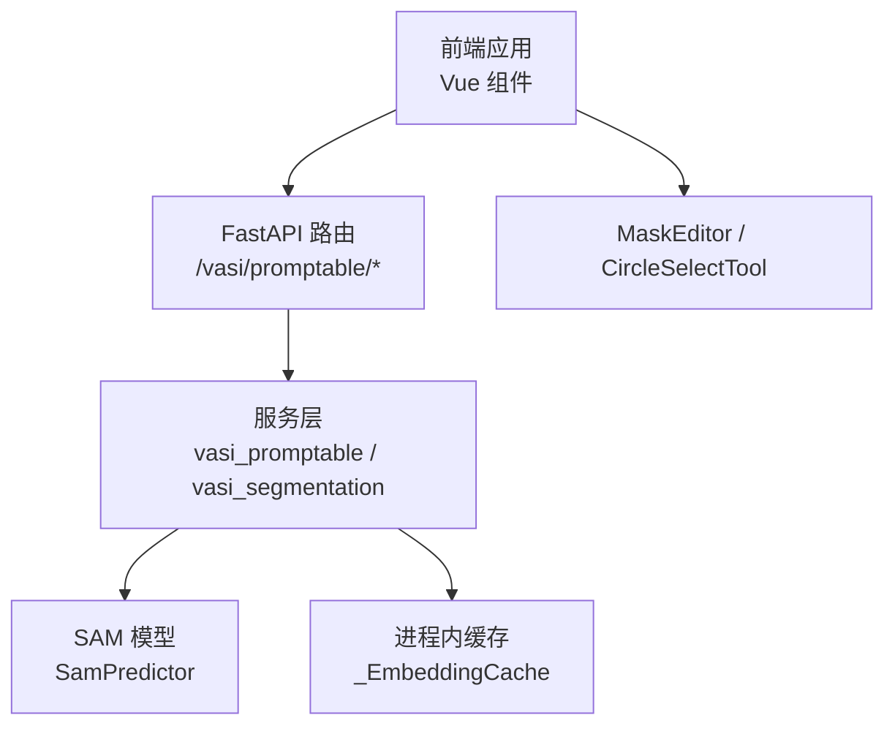
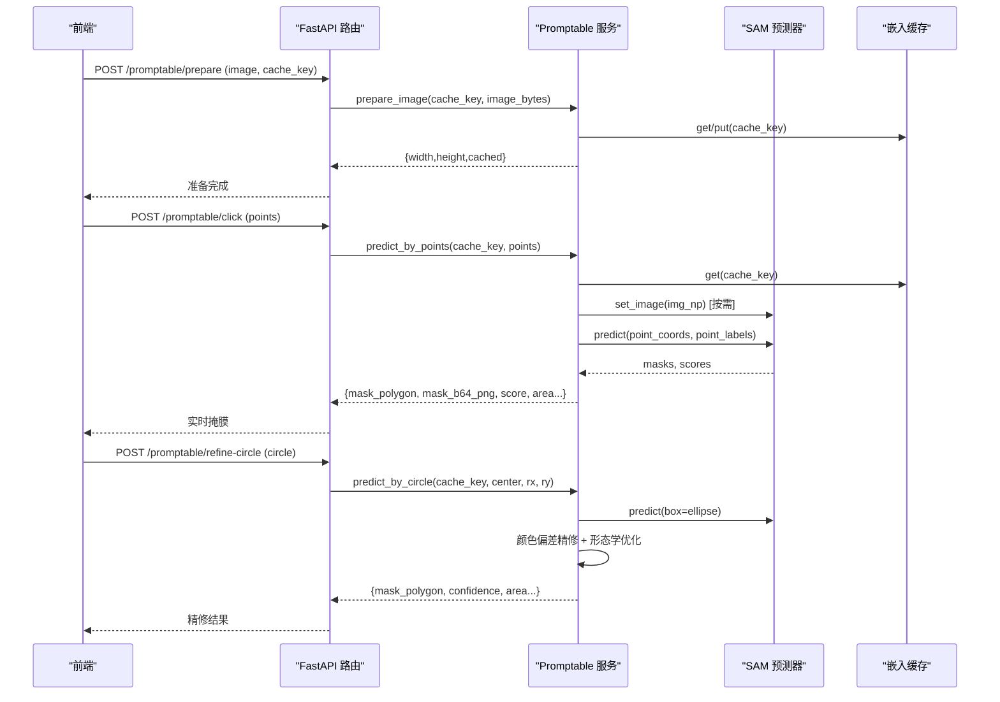
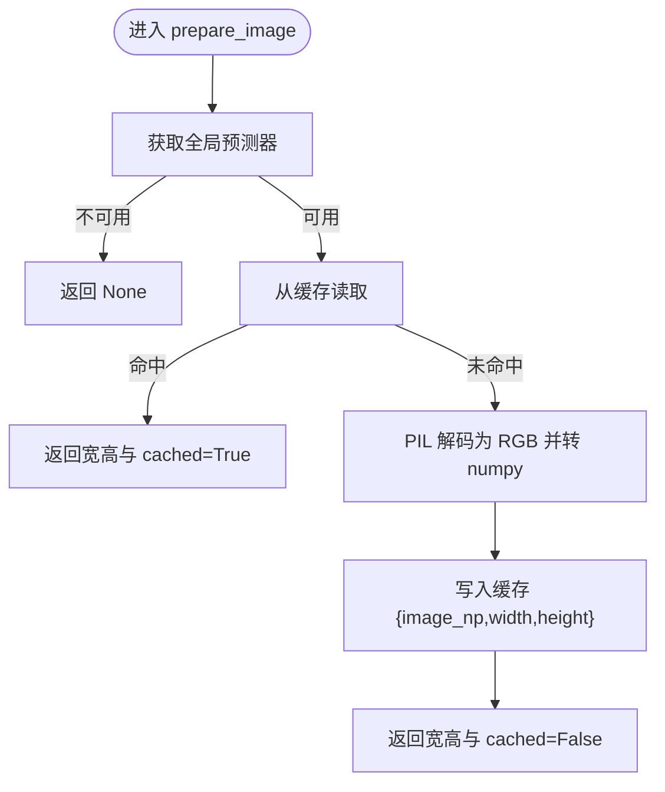
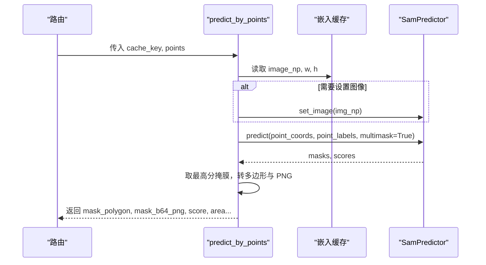
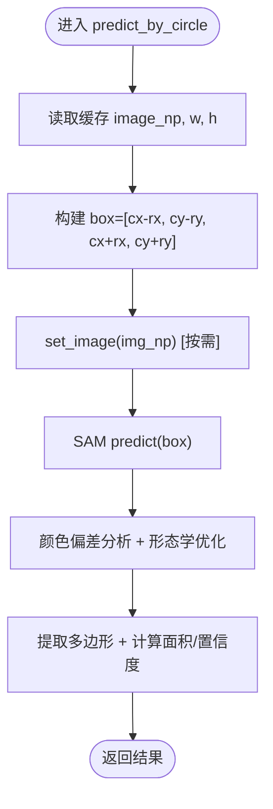
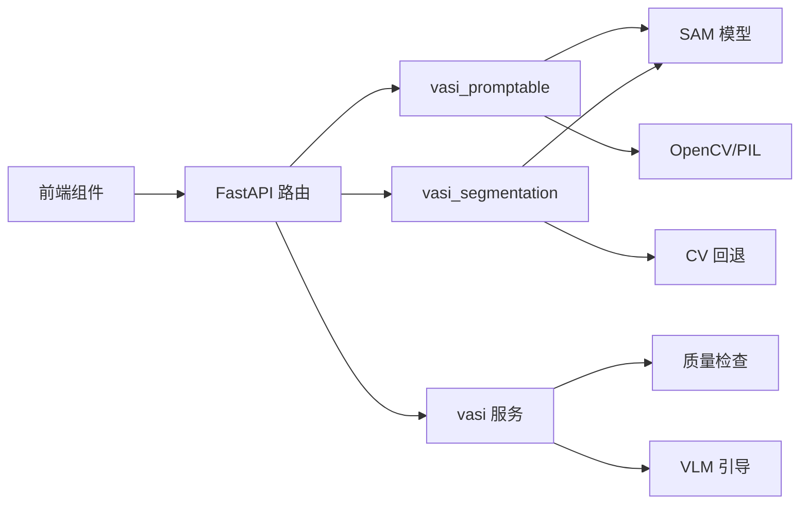
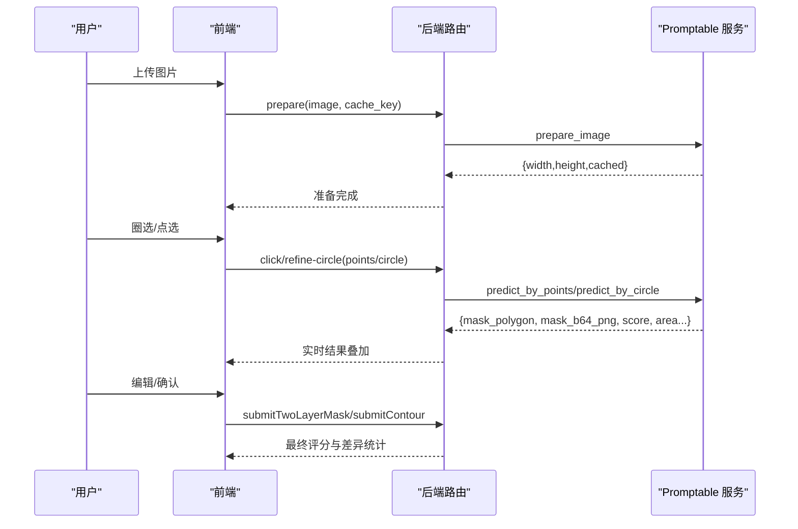

# 交互式AI分割

<cite>
**本文引用的文件**
- [web/backend/api/vasi.py](file://web/backend/api/vasi.py)
- [web/backend/services/vasi_promptable.py](file://web/backend/services/vasi_promptable.py)
- [web/backend/services/vasi_segmentation.py](file://web/backend/services/vasi_segmentation.py)
- [web/backend/services/vasi.py](file://web/backend/services/vasi.py)
- [web/app/src/api/vasi.ts](file://web/app/src/api/vasi.ts)
- [web/app/src/components/tracker/MaskEditor.vue](file://web/app/src/components/tracker/MaskEditor.vue)
- [web/app/src/components/tracker/VitiligoContour.vue](file://web/app/src/components/tracker/VitiligoContour.vue)
- [web/app/src/components/tracker/CircleSelectTool.vue](file://web/app/src/components/tracker/CircleSelectTool.vue)
- [web/app/src/composables/useVasiAssess.ts](file://web/app/src/composables/useVasiAssess.ts)
</cite>

## 目录
1. [简介](#简介)
2. [项目结构](#项目结构)
3. [核心组件](#核心组件)
4. [架构总览](#架构总览)
5. [详细组件分析](#详细组件分析)
6. [依赖关系分析](#依赖关系分析)
7. [性能考量](#性能考量)
8. [故障排查指南](#故障排查指南)
9. [结论](#结论)
10. [附录：前端集成与交互流程](#附录：前端集成与交互流程)

## 简介
本技术文档面向 VASI 交互式 AI 分割服务，聚焦以下能力：
- prepare_image 图片准备流程：解码图像、缓存 numpy 数组、延迟编码 SAM 特征。
- predict_by_points 基于点击点的预测：将归一化坐标转换为像素坐标，调用 SAM 点提示生成掩膜并返回多边形与可视化数据 URL。
- predict_by_circle 基于圆形提示的分割：将椭圆区域转为 SAM 框提示，结合颜色偏差分析与形态学优化边界，输出精修轮廓与置信度。
- 缓存机制与会话管理：进程内 LRU 缓存 + 线程锁保护全局 SamPredictor；cache_key 按用户隔离，防止跨会话污染。
- 用户输入处理与实时反馈：前端支持圈选、点选、画笔编辑，后端提供低延迟推理与结果叠加渲染。
- 提示类型支持、交互状态管理、性能优化与用户体验设计。
- 前端集成指南与交互流程图。

## 项目结构
本项目采用前后端分离架构：
- 后端 FastAPI 暴露评估与交互式分割接口，封装 SAM 模型与图像处理逻辑。
- 前端 Vue 应用提供交互式标注、圈选、点选与结果可视化。

图表来源
- [web/backend/api/vasi.py:357-445](file://web/backend/api/vasi.py#L357-L445)
- [web/backend/services/vasi_promptable.py:31-88](file://web/backend/services/vasi_promptable.py#L31-L88)

章节来源
- [web/backend/api/vasi.py:357-445](file://web/backend/api/vasi.py#L357-L445)
- [web/backend/services/vasi_promptable.py:31-88](file://web/backend/services/vasi_promptable.py#L31-L88)

## 核心组件
- 交互式分割服务（Promptable）：提供 prepare_image、predict_by_points、predict_by_circle，使用全局 SamPredictor 与线程锁保证并发安全，LRU 缓存图像 numpy 数组。
- 自动分割服务（Segmentation）：基于 SAM 自动模式与 CV 回退，用于非交互式批量评估。
- 评估服务（VASI Service）：编排质量检查、预处理、VLM 引导、SAM 分割、nnUNet 回退与结果持久化。
- 前端交互组件：MaskEditor（画笔/橡皮擦/图层）、VitiligoContour（轮廓编辑）、CircleSelectTool（圈选+AI精修）。

章节来源
- [web/backend/services/vasi_promptable.py:91-203](file://web/backend/services/vasi_promptable.py#L91-L203)
- [web/backend/services/vasi_segmentation.py:278-436](file://web/backend/services/vasi_segmentation.py#L278-L436)
- [web/backend/services/vasi.py:159-243](file://web/backend/services/vasi.py#L159-L243)
- [web/app/src/components/tracker/MaskEditor.vue:58-128](file://web/app/src/components/tracker/MaskEditor.vue#L58-L128)
- [web/app/src/components/tracker/CircleSelectTool.vue:61-125](file://web/app/src/components/tracker/CircleSelectTool.vue#L61-L125)

## 架构总览
端到端交互流程如下：
- 前端上传或选择图片后调用 prepare_image 建立会话缓存。
- 用户通过点选或圈选触发 predict_by_points / predict_by_circle。
- 后端在进程内缓存中查找图像，必要时设置 SAM 图像并执行推理。
- 返回掩膜多边形、可视化 PNG data URL、面积占比与耗时等指标。
- 前端实时叠加结果，支持二次编辑与提交修正。

图表来源
- [web/backend/api/vasi.py:357-445](file://web/backend/api/vasi.py#L357-L445)
- [web/backend/services/vasi_promptable.py:91-203](file://web/backend/services/vasi_promptable.py#L91-L203)
- [web/backend/services/vasi_promptable.py:242-321](file://web/backend/services/vasi_promptable.py#L242-L321)

## 详细组件分析

### 图片准备流程（prepare_image）
- 功能：解码图像为 numpy 数组，写入 LRU 缓存，返回宽高与是否命中缓存标记。
- 关键点：
  - 首次加载时惰性设置 SAM 图像，避免重复编码开销。
  - 使用线程安全的 _EmbeddingCache，限制最大条目数，避免内存泄漏。
  - 异常捕获与日志记录，失败时返回 None 以便上层降级。

图表来源
- [web/backend/services/vasi_promptable.py:91-116](file://web/backend/services/vasi_promptable.py#L91-L116)
- [web/backend/services/vasi_promptable.py:63-88](file://web/backend/services/vasi_promptable.py#L63-L88)

章节来源
- [web/backend/services/vasi_promptable.py:91-116](file://web/backend/services/vasi_promptable.py#L91-L116)

### 基于点击点的预测（predict_by_points）
- 功能：接收归一化坐标点列，转换为像素坐标，调用 SAM 点提示推理，返回最佳掩膜的多边形与可视化 PNG。
- 关键点：
  - 坐标转换：x_norm * width, y_norm * height。
  - 线程锁保护 set_image 与 predict，避免共享状态竞争。
  - 多掩膜输出时取最高分掩膜，计算面积与占比。
  - 提取轮廓并简化至最多 60 个点，便于前端渲染。

图表来源
- [web/backend/services/vasi_promptable.py:119-203](file://web/backend/services/vasi_promptable.py#L119-L203)
- [web/backend/services/vasi_promptable.py:206-239](file://web/backend/services/vasi_promptable.py#L206-L239)

章节来源
- [web/backend/services/vasi_promptable.py:119-203](file://web/backend/services/vasi_promptable.py#L119-L203)

### 基于圆形提示的分割（predict_by_circle）
- 功能：将用户绘制的椭圆区域转换为 SAM 框提示，生成初始掩膜后进行颜色偏差分析与形态学优化，输出精修轮廓与置信度。
- 关键点：
  - 椭圆到框：center ± radius 映射为像素坐标。
  - 颜色偏差：HSV 空间计算与皮肤中心对比，剔除非白斑像素。
  - 形态学：开闭运算平滑边界。
  - 置信度：病灶与皮肤 HSV 中心距离归一化。

图表来源
- [web/backend/services/vasi_promptable.py:242-321](file://web/backend/services/vasi_promptable.py#L242-L321)
- [web/backend/services/vasi_promptable.py:324-367](file://web/backend/services/vasi_promptable.py#L324-L367)

章节来源
- [web/backend/services/vasi_promptable.py:242-321](file://web/backend/services/vasi_promptable.py#L242-L321)

### 缓存机制与会话管理
- 缓存策略：
  - 进程内 LRU 缓存，键为 user-scoped cache_key（user{id}:cache_key），避免跨用户污染。
  - 缓存项包含 numpy 数组与宽高，限制最大条目数，自动淘汰最久未用项。
- 并发控制：
  - 全局 SamPredictor 通过线程锁串行化 set_image 与 predict，防止竞态。
  - 仅当 cache_key 变化或预测器未设置图像时才重新编码。
- 失效机制：
  - 提供 invalidate_cache 方法，供外部主动清理特定会话缓存。

章节来源
- [web/backend/services/vasi_promptable.py:31-88](file://web/backend/services/vasi_promptable.py#L31-L88)
- [web/backend/services/vasi_promptable.py:155-163](file://web/backend/services/vasi_promptable.py#L155-L163)
- [web/backend/services/vasi_promptable.py:370-372](file://web/backend/services/vasi_promptable.py#L370-L372)

### 用户输入处理与实时反馈
- 点选输入：
  - 前端发送归一化坐标与标签（前景/背景），后端转换为像素坐标并推理。
  - 返回多边形与 PNG data URL，前端即时叠加显示。
- 圈选输入：
  - 前端绘制椭圆，后端将其转为框提示，进行颜色精修与边界优化。
  - 返回置信度与面积占比，辅助用户判断结果质量。
- 画笔编辑：
  - MaskEditor 支持皮肤层与病灶层双图层绘制，实时更新面积占比与动画轮廓。
  - 支持撤销/重做、缩放平移、移动端手势操作。

章节来源
- [web/app/src/components/tracker/MaskEditor.vue:58-128](file://web/app/src/components/tracker/MaskEditor.vue#L58-L128)
- [web/app/src/components/tracker/CircleSelectTool.vue:61-125](file://web/app/src/components/tracker/CircleSelectTool.vue#L61-L125)
- [web/app/src/api/vasi.ts:193-226](file://web/app/src/api/vasi.ts#L193-L226)

### 提示类型支持与交互状态管理
- 提示类型：
  - 点提示：foreground/background 点列。
  - 框提示：由椭圆推导的 box。
  - 画笔提示：皮肤层/病灶层掩膜。
- 交互状态：
  - 前端维护工具模式（选择/绘制/移动）、历史快照、动画帧循环。
  - 后端维护会话缓存与预测器状态，确保一致性。

章节来源
- [web/app/src/components/tracker/VitiligoContour.vue:21-33](file://web/app/src/components/tracker/VitiligoContour.vue#L21-L33)
- [web/app/src/components/tracker/MaskEditor.vue:95-103](file://web/app/src/components/tracker/MaskEditor.vue#L95-L103)

### 性能优化与用户体验设计
- 后端优化：
  - 惰性 set_image，减少重复编码。
  - LRU 缓存限制大小，避免内存膨胀。
  - 线程锁串行化关键路径，保证稳定性。
- 前端优化：
  - 工作分辨率上限（MAX_CANVAS_DIM=1024），降低内存与 CPU 占用。
  - 离屏缓冲预渲染轮廓点阵，动画帧仅 drawImage。
  - 使用 requestIdleCallback 与节流更新面积，避免主线程阻塞。
  - 移动端手势支持（捏合缩放、双指平移）。

章节来源
- [web/backend/services/vasi_promptable.py:155-163](file://web/backend/services/vasi_promptable.py#L155-L163)
- [web/app/src/components/tracker/MaskEditor.vue:58-65](file://web/app/src/components/tracker/MaskEditor.vue#L58-L65)
- [web/app/src/components/tracker/MaskEditor.vue:341-467](file://web/app/src/components/tracker/MaskEditor.vue#L341-L467)
- [web/app/src/components/tracker/MaskEditor.vue:695-708](file://web/app/src/components/tracker/MaskEditor.vue#L695-L708)

## 依赖关系分析
- 路由依赖：
  - /promptable/prepare → vasi_promptable.prepare_image
  - /promptable/click → vasi_promptable.predict_by_points
  - /promptable/refine-circle → vasi_promptable.predict_by_circle
- 服务依赖：
  - vasi_promptable 依赖 SAM 模型与 OpenCV/PIL。
  - vasi_segmentation 依赖 SAM 自动模式与 CV 回退。
  - vasi 服务编排质量检查、预处理、VLM 引导、分割与持久化。
- 前端依赖：
  - vasi.ts 封装 API 调用。
  - MaskEditor、CircleSelectTool、VitiligoContour 负责交互与可视化。

图表来源
- [web/backend/api/vasi.py:357-445](file://web/backend/api/vasi.py#L357-L445)
- [web/backend/services/vasi_promptable.py:31-88](file://web/backend/services/vasi_promptable.py#L31-L88)
- [web/backend/services/vasi_segmentation.py:278-436](file://web/backend/services/vasi_segmentation.py#L278-L436)
- [web/backend/services/vasi.py:159-243](file://web/backend/services/vasi.py#L159-L243)

章节来源
- [web/backend/api/vasi.py:357-445](file://web/backend/api/vasi.py#L357-L445)
- [web/backend/services/vasi_promptable.py:31-88](file://web/backend/services/vasi_promptable.py#L31-L88)
- [web/backend/services/vasi_segmentation.py:278-436](file://web/backend/services/vasi_segmentation.py#L278-L436)
- [web/backend/services/vasi.py:159-243](file://web/backend/services/vasi.py#L159-L243)

## 性能考量
- 后端：
  - 惰性编码与缓存命中显著降低重复推理成本。
  - 线程锁保障并发安全，但需避免长时间持有锁导致吞吐下降。
  - 建议监控缓存命中率与预测耗时，动态调整 EMBEDDING_CACHE_SIZE。
- 前端：
  - 工作分辨率上限与离屏缓冲有效降低移动端卡顿。
  - 动画帧率降至 12fps，平衡流畅度与能耗。
  - 建议对大尺寸图片进行预压缩或缩略图预览。

[本节为通用指导，不直接分析具体文件]

## 故障排查指南
- 常见问题：
  - 图片缓存失效：predict_by_points/circle 返回 None，需重新调用 prepare_image。
  - SAM 加载失败：检查模型路径与设备可用性（CUDA/CPU）。
  - 前端渲染异常：确认 canvas 尺寸与工作分辨率设置正确。
- 定位方法：
  - 查看后端日志中的 encode/predict 耗时与错误堆栈。
  - 检查前端网络请求与响应数据结构。
  - 验证 cache_key 是否按用户隔离且一致。

章节来源
- [web/backend/api/vasi.py:389-407](file://web/backend/api/vasi.py#L389-L407)
- [web/backend/api/vasi.py:427-445](file://web/backend/api/vasi.py#L427-L445)
- [web/backend/services/vasi_promptable.py:139-142](file://web/backend/services/vasi_promptable.py#L139-L142)
- [web/backend/services/vasi_promptable.py:261-264](file://web/backend/services/vasi_promptable.py#L261-L264)

## 结论
VASI 交互式 AI 分割服务通过“懒编码 + 进程内缓存 + 线程锁”实现高效稳定的点选与圈选分割。前端提供丰富的交互能力与实时反馈，结合颜色精修与形态学优化，显著提升分割精度与用户体验。建议在生产环境中持续监控缓存命中率、预测耗时与前端性能指标，并根据业务需求调整参数与资源分配。

[本节为总结性内容，不直接分析具体文件]

## 附录：前端集成与交互流程
- 集成步骤：
  - 调用 vasiApi.preparePromptable 上传图片并建立会话缓存。
  - 使用 CircleSelectTool 或点选逻辑收集用户提示。
  - 调用 vasiApi.clickPromptable 或 refineCircle 获取实时掩膜。
  - 在 MaskEditor 中进行二次编辑并提交最终结果。
- 交互流程图：

图表来源
- [web/app/src/api/vasi.ts:193-226](file://web/app/src/api/vasi.ts#L193-L226)
- [web/backend/api/vasi.py:357-445](file://web/backend/api/vasi.py#L357-L445)
- [web/backend/services/vasi_promptable.py:91-203](file://web/backend/services/vasi_promptable.py#L91-L203)
- [web/backend/services/vasi_promptable.py:242-321](file://web/backend/services/vasi_promptable.py#L242-L321)

章节来源
- [web/app/src/api/vasi.ts:193-226](file://web/app/src/api/vasi.ts#L193-L226)
- [web/backend/api/vasi.py:357-445](file://web/backend/api/vasi.py#L357-L445)
- [web/backend/services/vasi_promptable.py:91-203](file://web/backend/services/vasi_promptable.py#L91-L203)
- [web/backend/services/vasi_promptable.py:242-321](file://web/backend/services/vasi_promptable.py#L242-L321)