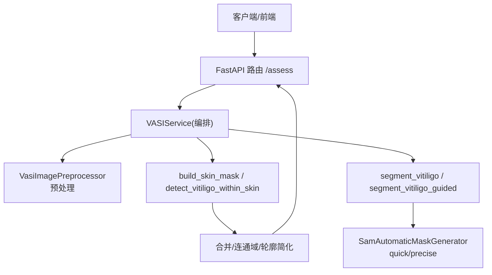
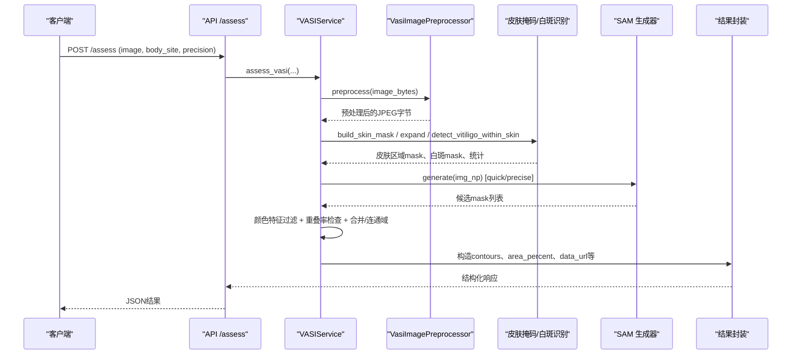
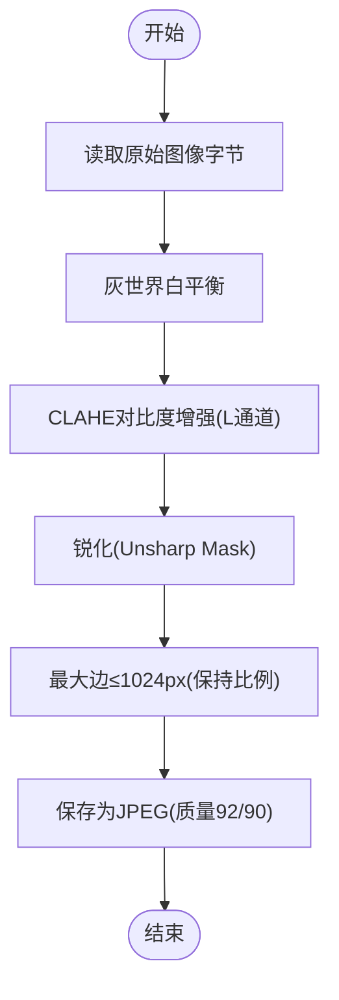
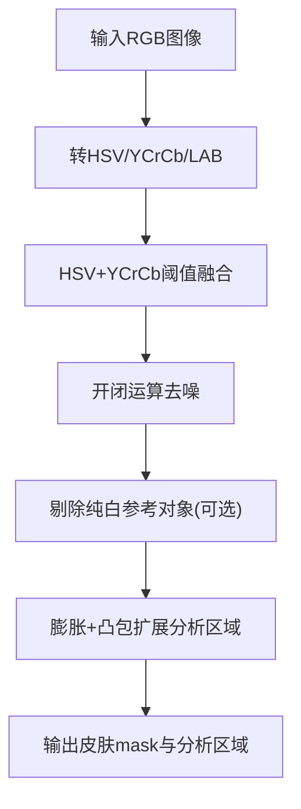
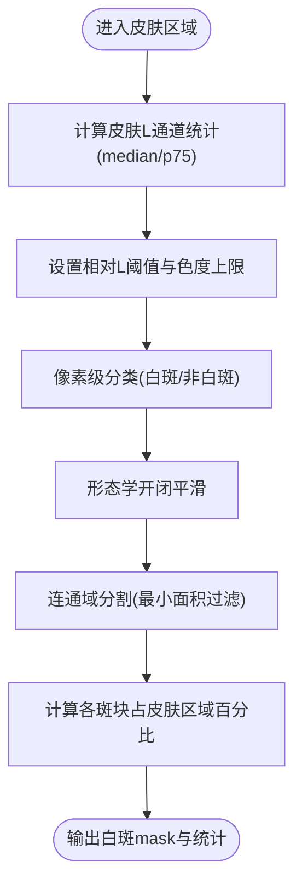
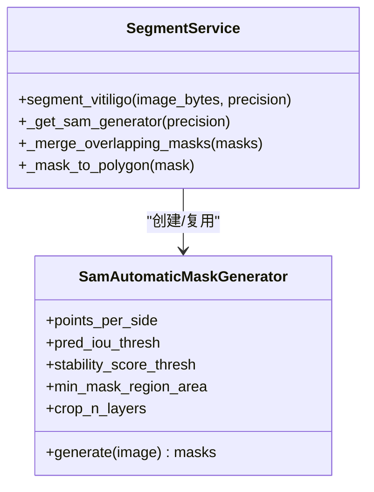
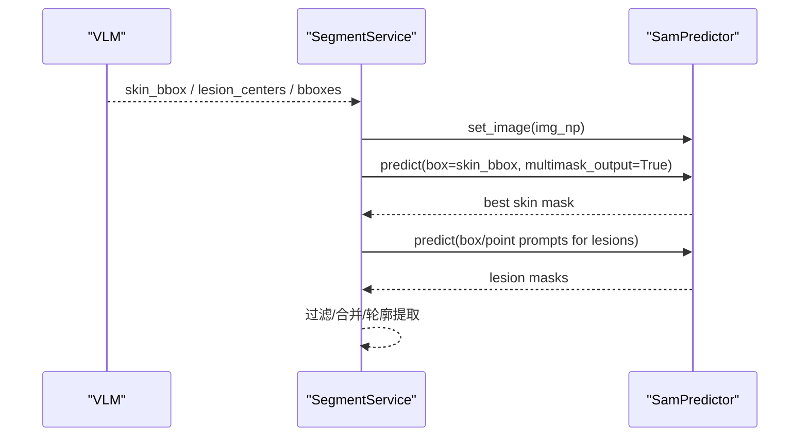
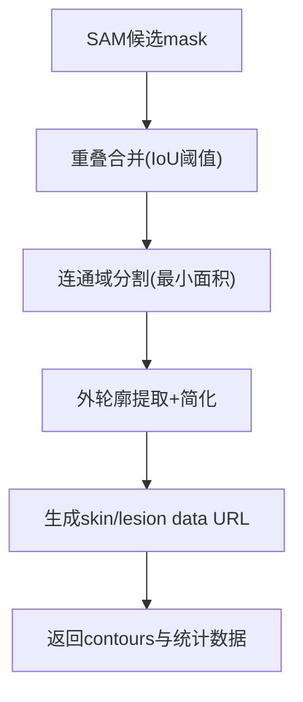
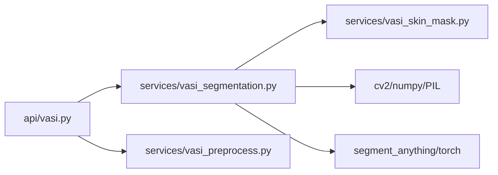
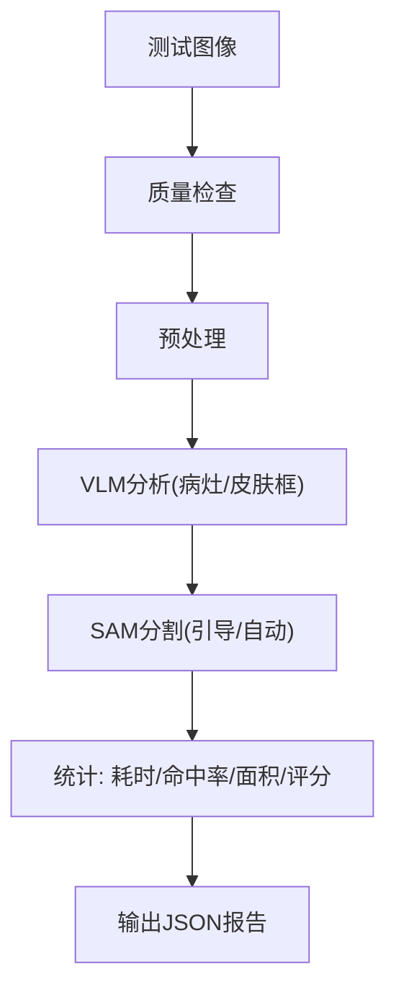

# 图像分割服务

<cite>
**本文引用的文件**
- [web/backend/services/vasi_segmentation.py](file://web/backend/services/vasi_segmentation.py)
- [web/backend/services/vasi_skin_mask.py](file://web/backend/services/vasi_skin_mask.py)
- [web/backend/services/vasi_preprocess.py](file://web/backend/services/vasi_preprocess.py)
- [web/backend/api/vasi.py](file://web/backend/api/vasi.py)
- [scripts/test_vitiligo_segmentation.py](file://scripts/test_vitiligo_segmentation.py)
- [tests/test_vasi_accuracy.py](file://tests/test_vasi_accuracy.py)
</cite>

## 目录
1. [简介](#简介)
2. [项目结构](#项目结构)
3. [核心组件](#核心组件)
4. [架构总览](#架构总览)
5. [详细组件分析](#详细组件分析)
6. [依赖关系分析](#依赖关系分析)
7. [性能与内存管理](#性能与内存管理)
8. [精度评估方法](#精度评估方法)
9. [故障排查指南](#故障排查指南)
10. [结论](#结论)

## 简介
本技术文档面向 VASI 图像分割服务，围绕 SAM-Med2D（基于 SAM 的自动模式）集成、图像预处理、皮肤掩码提取、白斑识别与结果优化进行系统化说明。文档覆盖图像格式转换、尺寸调整、色彩空间处理、噪声过滤、边缘增强等关键技术细节；并给出模型加载配置、推理参数调优、批量处理机制与内存管理策略；最后提供分割精度评估方法与故障排查指南，帮助开发者与运维人员高效定位问题与优化系统。

## 项目结构
VASI 图像分割服务位于后端服务层，主要包含：
- 图像预处理：白平衡、对比度增强、锐化、尺寸限制与编码输出
- 皮肤区域检测与白斑识别：双色彩空间阈值 + 相对亮度判定
- SAM 自动分割：快速/精确两种生成器，结合皮肤区域约束与颜色特征筛选
- API 层：接收上传、调用服务、返回结构化结果与可视化数据层
- 测试与评估：合成用例验证、端到端流水线评测、生产流程评分

图表来源
- [web/backend/api/vasi.py:45-164](file://web/backend/api/vasi.py#L45-L164)
- [web/backend/services/vasi_preprocess.py:47-267](file://web/backend/services/vasi_preprocess.py#L47-L267)
- [web/backend/services/vasi_skin_mask.py:124-288](file://web/backend/services/vasi_skin_mask.py#L124-L288)
- [web/backend/services/vasi_segmentation.py:278-436](file://web/backend/services/vasi_segmentation.py#L278-L436)

章节来源
- [web/backend/api/vasi.py:45-164](file://web/backend/api/vasi.py#L45-L164)
- [web/backend/services/vasi_preprocess.py:47-267](file://web/backend/services/vasi_preprocess.py#L47-L267)
- [web/backend/services/vasi_skin_mask.py:124-288](file://web/backend/services/vasi_skin_mask.py#L124-L288)
- [web/backend/services/vasi_segmentation.py:278-436](file://web/backend/services/vasi_segmentation.py#L278-L436)

## 核心组件
- 图像预处理服务：负责白平衡、CLAHE 对比度增强、锐化、最大边限制与 JPEG 编码，确保输入质量稳定且可控。
- 皮肤掩码与白斑识别：通过 HSV+YCrCb 双色彩空间阈值构建皮肤前景，再在皮肤区域内以相对 L* 阈值和低色度识别白斑像素。
- SAM 自动分割：加载 ViT-B 权重，使用 quick/precise 两种生成器产生候选 mask，结合皮肤区域重叠与颜色特征筛选，得到最终白斑轮廓。
- VLM 引导分割：利用视觉语言模型的语义理解，提供皮肤框或病灶中心/边界点提示，驱动 SAM 更精准地分割不规则病灶。
- API 与结果封装：统一入口接收图片与参数，返回 contours、面积占比、可视化 data URL、置信度与元信息。

章节来源
- [web/backend/services/vasi_preprocess.py:47-267](file://web/backend/services/vasi_preprocess.py#L47-L267)
- [web/backend/services/vasi_skin_mask.py:124-288](file://web/backend/services/vasi_skin_mask.py#L124-L288)
- [web/backend/services/vasi_segmentation.py:278-436](file://web/backend/services/vasi_segmentation.py#L278-L436)
- [web/backend/api/vasi.py:45-164](file://web/backend/api/vasi.py#L45-L164)

## 架构总览
下图展示从请求到结果的完整流程，包括预处理、皮肤掩码、SAM 分割、后处理与结果返回。

图表来源
- [web/backend/api/vasi.py:45-164](file://web/backend/api/vasi.py#L45-L164)
- [web/backend/services/vasi_preprocess.py:187-223](file://web/backend/services/vasi_preprocess.py#L187-L223)
- [web/backend/services/vasi_skin_mask.py:124-288](file://web/backend/services/vasi_skin_mask.py#L124-L288)
- [web/backend/services/vasi_segmentation.py:278-436](file://web/backend/services/vasi_segmentation.py#L278-L436)

## 详细组件分析

### 图像预处理流程
- 白平衡：灰世界算法校正通道均值，避免偏色影响后续色彩空间判断。
- 对比度增强：优先使用 OpenCV CLAHE（LAB 的 L 通道），回退至 PIL Contrast。
- 锐化：Unsharp Mask 提升边缘清晰度，利于轮廓提取。
- 尺寸调整：最长边限制为 1024px，保持比例；SAM 专用缩放保证最短边不低于 256px。
- 编码输出：JPEG 高质量压缩，减少传输与存储开销。

图表来源
- [web/backend/services/vasi_preprocess.py:69-156](file://web/backend/services/vasi_preprocess.py#L69-L156)
- [web/backend/services/vasi_preprocess.py:187-223](file://web/backend/services/vasi_preprocess.py#L187-L223)
- [web/backend/services/vasi_preprocess.py:225-262](file://web/backend/services/vasi_preprocess.py#L225-L262)

章节来源
- [web/backend/services/vasi_preprocess.py:47-267](file://web/backend/services/vasi_preprocess.py#L47-L267)

### 皮肤掩码提取算法
- 双色彩空间阈值：HSV（红区两段范围）与 YCrCb（Cr/Cb 区间）联合构建皮肤前景。
- Fitzpatrick 自适应：根据皮肤中位 L 估计肤质类型，动态调整 HSV/YCrCb 阈值范围，提升不同肤色的鲁棒性。
- 形态学清理：开闭运算去除椒盐噪声与小孔洞，填充不连续区域。
- 参考对象排除：尝试剔除纯白矩形（如参考卡）等干扰区域。
- 区域扩展：对皮肤掩码膨胀并取凸包，确保白斑（低色度）不被误排除在分析区域外。

图表来源
- [web/backend/services/vasi_skin_mask.py:76-174](file://web/backend/services/vasi_skin_mask.py#L76-L174)
- [web/backend/services/vasi_skin_mask.py:177-209](file://web/backend/services/vasi_skin_mask.py#L177-L209)

章节来源
- [web/backend/services/vasi_skin_mask.py:76-209](file://web/backend/services/vasi_skin_mask.py#L76-L209)

### 白斑区域识别技术
- 相对亮度阈值：计算皮肤区域的中位 L*，设定阈值 = max(median_L + offset, p75_L + 5)，仅当像素 L ≥ 阈值且色度低于上限时判定为白斑。
- 自适应阈值：依据 Fitzpatrick 类型选择 offset 与 max_chroma，适配不同肤色。
- 形态学后处理：开闭运算平滑白斑掩码，分离连通分量，按最小面积过滤。
- 面积统计：以皮肤区域为分母计算各斑块占比，避免背景干扰导致面积虚高。

图表来源
- [web/backend/services/vasi_skin_mask.py:212-288](file://web/backend/services/vasi_skin_mask.py#L212-L288)

章节来源
- [web/backend/services/vasi_skin_mask.py:212-288](file://web/backend/services/vasi_skin_mask.py#L212-L288)

### SAM 集成方案与推理参数调优
- 模型加载：延迟加载 ViT-B 权重，支持环境变量指定路径；设备自动选择 CUDA/CPU。
- 生成器配置：
  - Quick：points_per_side=16，pred_iou_thresh=0.80，stability_score_thresh=0.85，min_mask_region_area=200，无裁剪层。
  - Precise：points_per_side=32，pred_iou_thresh=0.88，stability_score_thresh=0.92，min_mask_region_area=100，crop_n_layers=1。
- 过滤策略：
  - 与皮肤区域重叠率≥70% 才保留。
  - 颜色特征校验：斑块中位 L 比周围皮肤中位 L 高出至少 min_l_offset，且色度低于 max_chroma。
  - 合并重叠 mask，限制返回斑块数量。
- 轮廓提取：形态学闭合平滑锯齿，提取外轮廓，Douglas-Peucker 简化，归一化坐标，最多顶点数限制。

图表来源
- [web/backend/services/vasi_segmentation.py:41-121](file://web/backend/services/vasi_segmentation.py#L41-L121)
- [web/backend/services/vasi_segmentation.py:124-219](file://web/backend/services/vasi_segmentation.py#L124-L219)

章节来源
- [web/backend/services/vasi_segmentation.py:41-219](file://web/backend/services/vasi_segmentation.py#L41-L219)

### VLM 引导分割
- 输入提示：皮肤框（bbox）、病灶中心（centers）、每病灶大小（sizes）、直接病灶框（bboxes）、边界关键点（edge_points）。
- 执行流程：优先使用 VLM 提供的 bbox 驱动 SAM 预测皮肤区域；若失败则回退到颜色法；再以中心/框提示驱动病灶分割。
- 优势：语义理解弥补颜色启发式不足，尤其适用于低对比度或不规则边界场景。

图表来源
- [web/backend/services/vasi_segmentation.py:690-800](file://web/backend/services/vasi_segmentation.py#L690-L800)

章节来源
- [web/backend/services/vasi_segmentation.py:690-800](file://web/backend/services/vasi_segmentation.py#L690-L800)

### 分割结果优化
- 重叠合并：按 IoU 阈值合并相邻/重叠 mask，减少碎片化。
- 连通域分割：分离独立病灶，按最小面积过滤噪声。
- 轮廓简化：Douglas-Peucker 降低点数，便于前端渲染与交互。
- 数据层可视化：将皮肤层与病灶层编码为 data URL，供前端叠加显示。

图表来源
- [web/backend/services/vasi_segmentation.py:124-219](file://web/backend/services/vasi_segmentation.py#L124-L219)
- [web/backend/services/vasi_skin_mask.py:291-333](file://web/backend/services/vasi_skin_mask.py#L291-L333)

章节来源
- [web/backend/services/vasi_segmentation.py:124-219](file://web/backend/services/vasi_segmentation.py#L124-L219)
- [web/backend/services/vasi_skin_mask.py:291-333](file://web/backend/services/vasi_skin_mask.py#L291-L333)

## 依赖关系分析
- 外部库：torch、segment_anything（SAM）、opencv-python（cv2）、numpy、Pillow。
- 模块耦合：
  - vasi_segmentation 依赖 vasi_skin_mask（皮肤掩码与白斑识别）与 cv2（轮廓提取）。
  - vasi_preprocess 依赖 PIL/numpy/cv2（CLAHE）。
  - API 层依赖 VASIService（编排）与数据库模型（持久化）。
- 潜在循环依赖：当前实现为单向调用链，未见循环导入。
- 外部集成：可选 nnU-Net 远程服务（火山引擎 ML 平台）作为额外回退路径。

图表来源
- [web/backend/api/vasi.py:45-164](file://web/backend/api/vasi.py#L45-L164)
- [web/backend/services/vasi_segmentation.py:278-436](file://web/backend/services/vasi_segmentation.py#L278-L436)
- [web/backend/services/vasi_skin_mask.py:124-288](file://web/backend/services/vasi_skin_mask.py#L124-L288)
- [web/backend/services/vasi_preprocess.py:47-267](file://web/backend/services/vasi_preprocess.py#L47-L267)

章节来源
- [web/backend/api/vasi.py:45-164](file://web/backend/api/vasi.py#L45-L164)
- [web/backend/services/vasi_segmentation.py:278-436](file://web/backend/services/vasi_segmentation.py#L278-L436)
- [web/backend/services/vasi_skin_mask.py:124-288](file://web/backend/services/vasi_skin_mask.py#L124-L288)
- [web/backend/services/vasi_preprocess.py:47-267](file://web/backend/services/vasi_preprocess.py#L47-L267)

## 性能与内存管理
- 模型加载与缓存：
  - SAM 权重全局单例加载，避免重复 IO。
  - 生成器按精度区分缓存，减少实例化开销。
- 推理时间：
  - Quick 模式约 ~10s CPU；Precise 模式约 ~70s CPU。
  - 图像尺寸直接影响推理时间，建议预处理限制最长边 ≤1024px。
- 内存管理：
  - 使用 numpy 布尔掩码与 uint8 中间数组控制内存占用。
  - 形态学与连通域操作尽量就地或复用缓冲区。
  - 大图像分批处理或流式解码可降低峰值内存。
- 批处理机制：
  - API 层单次请求处理一张图；可封装批处理函数，串行调用 segment_vitiligo/segment_vitiligo_guided。
  - 注意并发时的 GPU 显存与 CPU 线程竞争，建议使用进程池或队列限流。
- 回退策略：
  - SAM 不可用时回退到颜色启发式分割，保证可用性。
  - 可选 nnU-Net 远程服务作为补充。

[本节为通用指导，无需特定文件引用]

## 精度评估方法
- 合成用例验证：构造含皮肤与白斑的合成图像，断言是否检测到白斑以及面积占比是否符合预期。
- 端到端流水线评测：
  - 质量检查 → 预处理 → VLM 分析 → SAM 分割 → 结果汇总。
  - 统计耗时、VLM→SAM 命中率、SAM 实测面积占比、脱色等级加权等指标。
- 生产流程评分：
  - 调用 _call_vasi_api，获取公式化 VASI 评分、对比度调整面积、脱色加权等。
  - 记录 per-lesion 的 SAM 面积与对比因子，用于偏差分析与模型迭代。

图表来源
- [tests/test_vasi_accuracy.py:105-245](file://tests/test_vasi_accuracy.py#L105-L245)
- [tests/test_vasi_accuracy.py:251-313](file://tests/test_vasi_accuracy.py#L251-L313)
- [scripts/test_vitiligo_segmentation.py:41-71](file://scripts/test_vitiligo_segmentation.py#L41-L71)

章节来源
- [tests/test_vasi_accuracy.py:105-245](file://tests/test_vasi_accuracy.py#L105-L245)
- [tests/test_vasi_accuracy.py:251-313](file://tests/test_vasi_accuracy.py#L251-L313)
- [scripts/test_vitiligo_segmentation.py:41-71](file://scripts/test_vitiligo_segmentation.py#L41-L71)

## 故障排查指南
- 模型加载失败：
  - 检查 SAM 权重路径与环境变量；确认 torch/cuda 可用。
  - 日志会记录加载失败原因，必要时降级到颜色启发式分割。
- 皮肤掩码不足：
  - 若皮肤区域占比过低（<3%），将触发回退逻辑；建议用户拍摄时让患处靠近相机。
- 未检测到白斑：
  - 可能因对比度低或光照不均；可尝试 precise 模式或启用 VLM 引导。
  - 检查相对 L 阈值与色度上限是否合理（Fitzpatrick 自适应通常有效）。
- 轮廓为空或过小：
  - 检查最小斑块面积阈值与连通域最小面积；适当放宽过滤条件。
- 性能瓶颈：
  - 图像过大导致推理慢；使用 resize_for_sam 限制尺寸。
  - 并发过高导致资源争用；限制并发或使用队列。
- 数据层可视化异常：
  - 检查 mask_to_data_url 编码过程；确认 alpha 与颜色值合理。

章节来源
- [web/backend/services/vasi_segmentation.py:41-121](file://web/backend/services/vasi_segmentation.py#L41-L121)
- [web/backend/services/vasi_segmentation.py:312-336](file://web/backend/services/vasi_segmentation.py#L312-L336)
- [web/backend/services/vasi_skin_mask.py:124-174](file://web/backend/services/vasi_skin_mask.py#L124-L174)
- [web/backend/services/vasi_preprocess.py:225-262](file://web/backend/services/vasi_preprocess.py#L225-L262)

## 结论
本服务通过“预处理 + 皮肤掩码 + 相对亮度白斑识别 + SAM 自动分割”的多阶段管线，实现了稳健的 VASI 图像分割能力。关键设计包括：
- 双色彩空间皮肤检测与 Fitzpatrick 自适应，提升跨肤色鲁棒性。
- 相对 L 阈值与色度约束，避免背景误检。
- SAM 快速/精确模式与 VLM 引导，兼顾效率与精度。
- 完善的后处理与可视化输出，支持前端交互与评估。
- 测试与评估体系覆盖合成用例、端到端流水线与生产评分，便于持续优化。

建议在部署时：
- 固定 SAM 权重路径并确保 GPU 环境可用。
- 根据业务需求选择 quick/precise 模式与阈值参数。
- 建立监控与日志采集，跟踪皮肤区域占比、命中率和耗时。
- 定期运行精度评估脚本，收集反馈样本用于模型迭代。

[本节为总结性内容，无需特定文件引用]