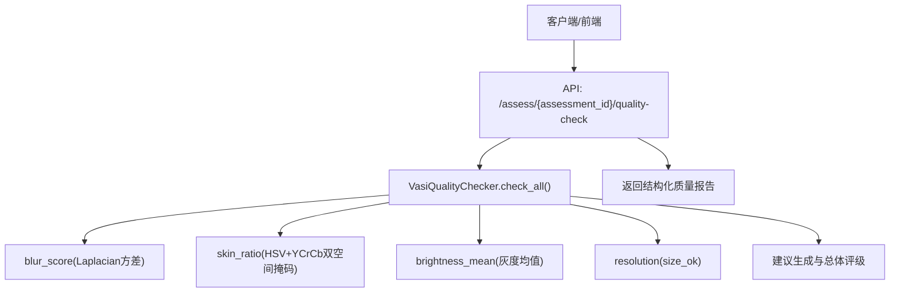
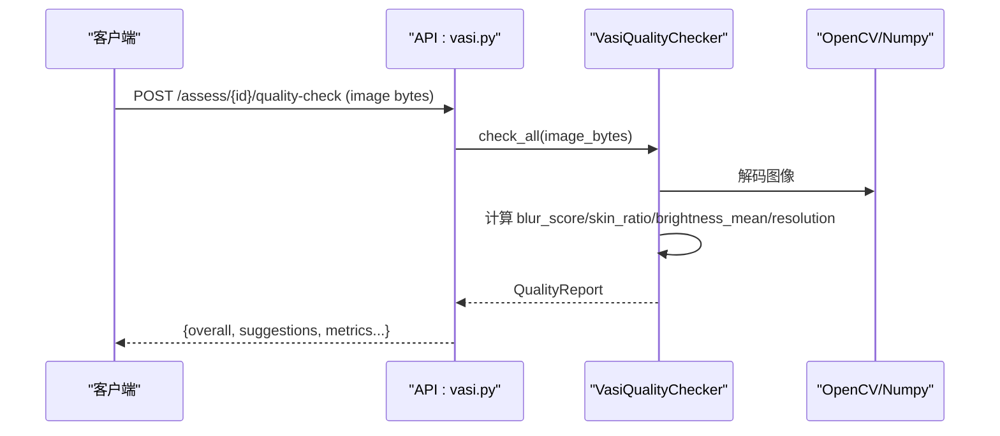
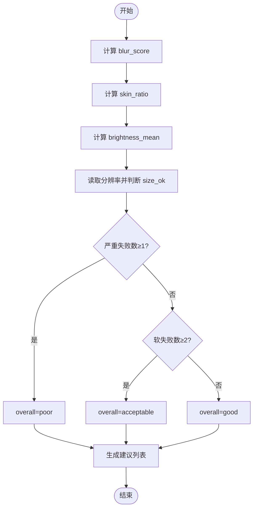
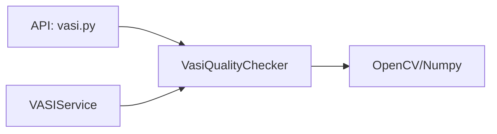

# 图像质量检测

<cite>
**本文引用的文件**
- [web/backend/services/vasi_quality.py](file://web/backend/services/vasi_quality.py)
- [web/backend/api/vasi.py](file://web/backend/api/vasi.py)
- [web/backend/services/vasi.py](file://web/backend/services/vasi.py)
- [tests/test_vasi_accuracy.py](file://tests/test_vasi_accuracy.py)
</cite>

## 目录
1. [简介](#简介)
2. [项目结构](#项目结构)
3. [核心组件](#核心组件)
4. [架构总览](#架构总览)
5. [详细组件分析](#详细组件分析)
6. [依赖关系分析](#依赖关系分析)
7. [性能考量](#性能考量)
8. [故障排查指南](#故障排查指南)
9. [结论](#结论)
10. [附录：API接口说明与集成示例](#附录api接口说明与集成示例)

## 简介
本技术文档面向 VASI（白癜风评估）图像质量检测服务，系统性阐述以下质量指标的计算算法与阈值原理：模糊度检测 blur_score、皮肤区域比例 skin_ratio、亮度评估 brightness_mean、分辨率检查 resolution、大小验证 size_ok。文档还覆盖图像处理流程、特征提取方法、质量评分标准与建议生成机制、用户反馈处理与检测精度优化策略，并提供质量检查的 API 接口说明与集成示例，帮助开发者快速理解并正确集成该能力。

## 项目结构
与本功能直接相关的代码主要位于后端服务的“服务质量检查”模块以及调用它的 API 与服务层：
- 质量检查实现：web/backend/services/vasi_quality.py
- 暴露质量检查的 API：web/backend/api/vasi.py
- 在完整评估管线中调用质量检查并做拒绝策略：web/backend/services/vasi.py
- 测试与端到端流程参考：tests/test_vasi_accuracy.py



图表来源
- [web/backend/api/vasi.py:520-541](file://web/backend/api/vasi.py#L520-L541)
- [web/backend/services/vasi_quality.py:188-271](file://web/backend/services/vasi_quality.py#L188-L271)

章节来源
- [web/backend/services/vasi_quality.py:1-285](file://web/backend/services/vasi_quality.py#L1-L285)
- [web/backend/api/vasi.py:520-541](file://web/backend/api/vasi.py#L520-L541)

## 核心组件
- VasiQualityChecker：封装图像质量检查的核心逻辑，提供模糊度、皮肤存在性、光照、尺寸等指标计算，并输出统一的质量报告 QualityReport。
- QualityReport：包含 overall（good/acceptable/poor）、各单项指标及布尔判定、中文建议列表等。
- API 层：提供 /assess/{assessment_id}/quality-check 接口，接收图片二进制数据，返回质量检查的结构化结果。
- 服务层集成：在完整 VASI 评估流程中，若整体质量为 poor，则直接拒绝并返回带建议的响应，避免对不可用图像进行后续 AI 分析。

章节来源
- [web/backend/services/vasi_quality.py:65-89](file://web/backend/services/vasi_quality.py#L65-L89)
- [web/backend/api/vasi.py:520-541](file://web/backend/api/vasi.py#L520-L541)
- [web/backend/services/vasi.py:614-629](file://web/backend/services/vasi.py#L614-L629)

## 架构总览
质量检查作为前置过滤器，确保进入后续 VLM/SAM 分析的图像具备基本可用性。其关键路径如下：
- 输入：原始图片字节流（JPEG/PNG/WEBP）。
- 预处理：OpenCV 解码为 BGR 数组；若依赖缺失则降级并提示。
- 指标计算：
  - 模糊度：基于灰度图的 Laplacian 方差。
  - 皮肤比例：HSV 与 YCrCb 双空间阈值掩码求并集，计算像素占比。
  - 亮度：灰度图均值。
  - 分辨率：读取宽高，判断是否满足最小要求。
- 综合判定：根据严重失败与软失败数量给出 overall 评级，并生成中文建议。
- 输出：结构化质量报告，供 API 返回或上层服务使用。



图表来源
- [web/backend/api/vasi.py:520-541](file://web/backend/api/vasi.py#L520-L541)
- [web/backend/services/vasi_quality.py:188-271](file://web/backend/services/vasi_quality.py#L188-L271)

## 详细组件分析

### 模糊度检测 blur_score
- 算法原理：将图像转为灰度后计算 Laplacian 算子的方差，方差越大表示图像越清晰，越小表示越模糊。
- 实现要点：
  - 通过 OpenCV 将 BGR 转灰度，再计算 Laplacian 方差。
  - 若 OpenCV/Numpy 不可用，返回 0.0 并记录警告。
- 阈值与判定：
  - BLUR_THRESHOLD_ACCEPTABLE=100：低于此值视为不清晰。
  - BLUR_THRESHOLD_CLEAR=300：用于更严格场景（当前代码主要用于阈值常量定义）。
  - 严重失败条件：blur_score < ACCEPTABLE * 0.5。
- 复杂度：O(W×H)，W/H 为图像宽高。
- 优化建议：
  - 对超大图像可先下采样再计算方差以降低开销。
  - 缓存最近一次图像的 blur_score 以避免重复计算（如预览阶段）。

章节来源
- [web/backend/services/vasi_quality.py:98-116](file://web/backend/services/vasi_quality.py#L98-L116)
- [web/backend/services/vasi_quality.py:40-41](file://web/backend/services/vasi_quality.py#L40-L41)
- [web/backend/services/vasi_quality.py:209-248](file://web/backend/services/vasi_quality.py#L209-L248)

### 皮肤区域比例 skin_ratio
- 算法原理：采用 HSV 与 YCrCb 双空间阈值掩码，取并集以增强对不同肤色与光照条件的鲁棒性。
- 实现要点：
  - HSV 范围覆盖红橙到偏红的色相区间，饱和度与明度范围适配多数皮肤色调。
  - YCrCb 作为备用通道，提升暖光环境下的稳定性。
  - 计算皮肤像素数与总像素数的比值。
- 阈值与判定：
  - SKIN_RATIO_MIN=0.05：至少 5% 像素为皮肤，以容纳特写白斑照片。
  - 严重失败条件：无直接映射，但会参与软失败计数。
- 复杂度：O(W×H)。
- 优化建议：
  - 可引入形态学操作（开闭运算）去除噪声点，提高掩码质量。
  - 针对极端过曝/欠曝图像，可结合直方图均衡化后再检测。

章节来源
- [web/backend/services/vasi_quality.py:118-155](file://web/backend/services/vasi_quality.py#L118-L155)
- [web/backend/services/vasi_quality.py:43-57](file://web/backend/services/vasi_quality.py#L43-L57)
- [web/backend/services/vasi_quality.py:209-248](file://web/backend/services/vasi_quality.py#L209-L248)

### 亮度评估 brightness_mean
- 算法原理：计算灰度图的像素均值，反映整体曝光情况。
- 实现要点：
  - 将 BGR 转为灰度后求均值。
  - 若依赖不可用，返回 0.0。
- 阈值与判定：
  - BRIGHTNESS_DARK_THRESHOLD=60：低于此值视为过暗。
  - BRIGHTNESS_OVEREXPOSED_THRESHOLD=220：高于此值视为过曝。
  - 严重失败条件：brightness < DARK*0.6 或 > OVEREXPOSED+20。
- 复杂度：O(W×H)。
- 优化建议：
  - 可结合直方图统计（如中位数）降低异常像素影响。
  - 对局部过曝/阴影区域可采用分块均值加权。

章节来源
- [web/backend/services/vasi_quality.py:157-172](file://web/backend/services/vasi_quality.py#L157-L172)
- [web/backend/services/vasi_quality.py:59-60](file://web/backend/services/vasi_quality.py#L59-L60)
- [web/backend/services/vasi_quality.py:214-248](file://web/backend/services/vasi_quality.py#L214-L248)

### 分辨率检查 resolution 与大小验证 size_ok
- 算法原理：读取图像宽高，判断是否满足最低分辨率要求。
- 实现要点：
  - 从解码后的图像获取 shape，返回 (width, height)。
  - MIN_WIDTH=640，MIN_HEIGHT=480。
- 阈值与判定：
  - size_ok = w >= MIN_WIDTH and h >= MIN_HEIGHT。
  - 严重失败条件：size_ok 为假且 w < MIN_WIDTH*0.7 或 h < MIN_HEIGHT*0.7。
- 复杂度：O(1)（仅读取元信息）。
- 优化建议：
  - 可在上传阶段即校验文件大小与格式，减少无效请求。

章节来源
- [web/backend/services/vasi_quality.py:174-186](file://web/backend/services/vasi_quality.py#L174-L186)
- [web/backend/services/vasi_quality.py:61-62](file://web/backend/services/vasi_quality.py#L61-L62)
- [web/backend/services/vasi_quality.py:211-248](file://web/backend/services/vasi_quality.py#L211-L248)

### 质量评分标准与建议生成
- 综合评级规则：
  - 严重失败计数：包括极模糊、极暗/极亮、过低分辨率等。
  - 软失败计数：blur/skin/lighting/size 任一不合格。
  - 严重失败≥1 → overall="poor"；否则软失败≥2 → "acceptable"；否则 "good"。
- 建议生成：
  - 针对不同失败项生成中文建议，如“照片模糊，请保持手机稳定后重新拍摄”、“光线过暗/过亮”、“分辨率过低”等。
- 复杂度：O(1)。



图表来源
- [web/backend/services/vasi_quality.py:209-271](file://web/backend/services/vasi_quality.py#L209-L271)

章节来源
- [web/backend/services/vasi_quality.py:209-271](file://web/backend/services/vasi_quality.py#L209-L271)

### 用户反馈处理与检测精度优化策略
- 用户修正轮廓：
  - 支持提交用户对 AI 轮廓的修正，系统计算差异（Dice、面积误差），并记录为训练样本。
  - 若同时提供皮肤层与病灶层 mask，可计算两层面积与 VASI 分数。
- 反馈收集与 RL 自进化：
  - 将显式修正信号写入反馈收集器，必要时触发强化学习学习者更新策略。
- 置信度过滤与边界框合理性检查：
  - 对 VLM 输出的病灶置信度进行分级过滤，低置信度标注需人工复核。
  - 剔除过大 bbox，避免将整片皮肤误判为病灶。
- 精度优化方向：
  - 调整皮肤检测阈值与形态学参数以提升 skin_ratio 准确性。
  - 对极端光照图像增加预处理（如自适应直方图均衡）。
  - 结合多尺度 Laplacian 方差或频域方法改进 blur_score 鲁棒性。

章节来源
- [web/backend/api/vasi.py:544-719](file://web/backend/api/vasi.py#L544-L719)
- [web/backend/services/vasi.py:660-719](file://web/backend/services/vasi.py#L660-L719)

## 依赖关系分析
- 外部依赖：
  - opencv-python-headless：用于图像解码与基础图像处理。
  - numpy：用于数组操作与统计计算。
- 内部依赖：
  - API 层调用质量检查模块。
  - 服务层在评估流程中集成质量检查，并在 poor 时提前拒绝。
- 耦合与内聚：
  - 质量检查模块高内聚，职责单一；对外暴露简洁接口。
  - API 层与服务层通过 QualityReport 解耦，便于扩展新指标。



图表来源
- [web/backend/api/vasi.py:520-541](file://web/backend/api/vasi.py#L520-L541)
- [web/backend/services/vasi.py:614-629](file://web/backend/services/vasi.py#L614-L629)
- [web/backend/services/vasi_quality.py:16-36](file://web/backend/services/vasi_quality.py#L16-L36)

章节来源
- [web/backend/services/vasi_quality.py:16-36](file://web/backend/services/vasi_quality.py#L16-L36)
- [web/backend/api/vasi.py:520-541](file://web/backend/api/vasi.py#L520-L541)
- [web/backend/services/vasi.py:614-629](file://web/backend/services/vasi.py#L614-L629)

## 性能考量
- 时间复杂度：
  - 模糊度、皮肤比例、亮度均为 O(W×H)，受图像尺寸影响显著。
- 内存占用：
  - 解码后的 BGR 数组占用约 W×H×3 字节，大图像需注意内存峰值。
- 优化建议：
  - 对超大图像先缩放至目标尺寸再进行指标计算。
  - 使用多线程/异步并行执行多个指标（当前实现顺序执行，可按需改造）。
  - 启用缓存以减少重复计算（例如同一图片多次预览）。

[本节为通用性能指导，不直接分析具体文件]

## 故障排查指南
- 常见错误与定位：
  - OpenCV/Numpy 未安装：质量检查禁用，返回 acceptable 并提示更新。
  - 图像解码失败：抛出异常并记录警告，返回默认值。
  - 图片过大：API 层限制最大 20MB，超过则返回 413。
- 日志与调试：
  - 关注警告日志中的 “Blur check failed”、“Skin check failed”、“Lighting check failed”、“Size check failed”。
  - 在 API 层打印质量报告字段，确认各项指标是否符合预期。
- 处理策略：
  - 若 overall=poor，引导用户重拍并展示具体建议。
  - 若依赖缺失，提示更新环境或回退到手动标注模式。

章节来源
- [web/backend/services/vasi_quality.py:16-36](file://web/backend/services/vasi_quality.py#L16-L36)
- [web/backend/services/vasi_quality.py:109-186](file://web/backend/services/vasi_quality.py#L109-L186)
- [web/backend/api/vasi.py:520-541](file://web/backend/api/vasi.py#L520-L541)

## 结论
VASI 图像质量检测服务通过清晰的指标设计与合理的阈值设定，有效筛选出可用于后续 AI 分析的图像。其模块化实现便于扩展与维护，结合用户反馈与精度优化策略，持续提升检测鲁棒性与用户体验。建议在部署环境中确保 OpenCV/Numpy 可用，并根据业务需求微调阈值与预处理步骤。

[本节为总结性内容，不直接分析具体文件]

## 附录：API接口说明与集成示例

### 接口：质量检查
- 路径：POST /assess/{assessment_id}/quality-check
- 请求体：multipart/form-data，字段 image 为图片二进制数据（支持 JPEG/PNG/WEBP），最大 20MB。
- 响应字段：
  - overall: "good" | "acceptable" | "poor"
  - blur_score: float（Laplacian 方差）
  - blur_ok: bool
  - skin_ratio: float（皮肤像素占比）
  - skin_ok: bool
  - brightness_mean: float（灰度均值）
  - lighting_ok: bool
  - resolution: [width, height]
  - size_ok: bool
  - suggestions: List[str]（中文建议）

章节来源
- [web/backend/api/vasi.py:520-541](file://web/backend/api/vasi.py#L520-L541)

### 集成示例（伪代码）
```text
POST /assess/{assessment_id}/quality-check
Content-Type: multipart/form-data
Form-Data:
  image: <binary image data>

Response:
{
  "overall": "acceptable",
  "blur_score": 120.3,
  "blur_ok": true,
  "skin_ratio": 0.12,
  "skin_ok": true,
  "brightness_mean": 150.0,
  "lighting_ok": true,
  "resolution": [1280, 720],
  "size_ok": true,
  "suggestions": []
}
```

章节来源
- [web/backend/api/vasi.py:520-541](file://web/backend/api/vasi.py#L520-L541)

### 在评估管线中的使用
- 服务层在调用 VLM/SAM 前执行质量检查，若 overall=poor 则直接返回带建议的拒绝响应，避免浪费资源。
- 测试脚本中也复用了质量检查逻辑，用于端到端流程验证。

章节来源
- [web/backend/services/vasi.py:614-629](file://web/backend/services/vasi.py#L614-L629)
- [tests/test_vasi_accuracy.py:130-139](file://tests/test_vasi_accuracy.py#L130-L139)