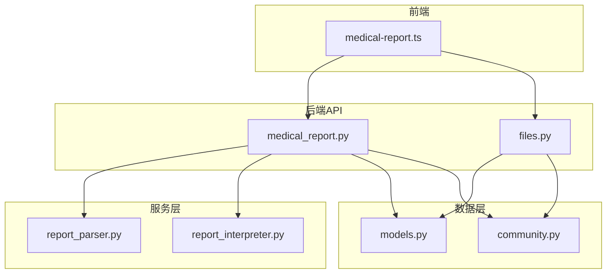
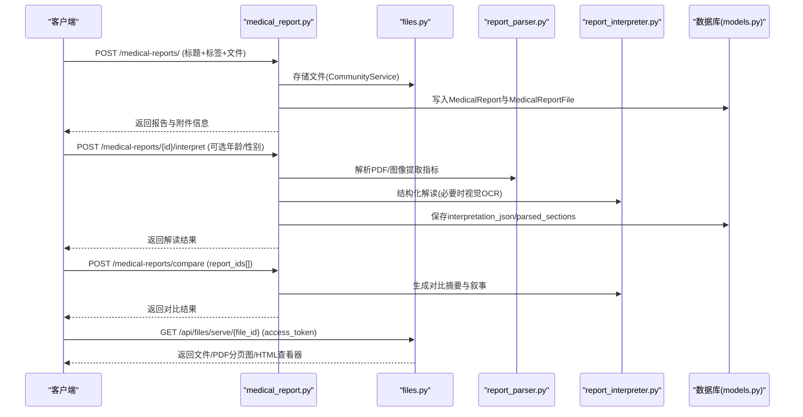
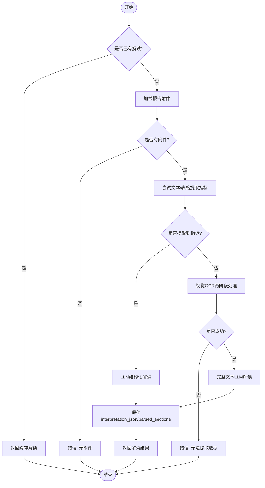
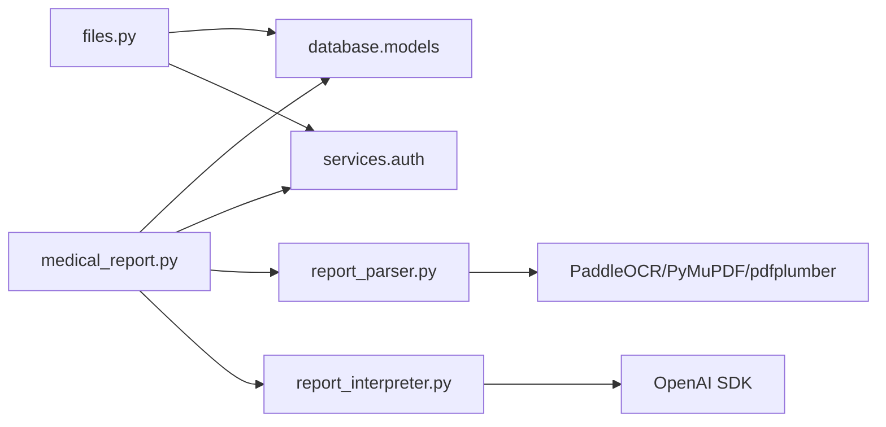

# API接口文档

<cite>
**本文引用的文件**   
- [medical_report.py](file://web/backend/api/medical_report.py)
- [files.py](file://web/backend/api/files.py)
- [report_parser.py](file://web/backend/services/medical/report_parser.py)
- [report_interpreter.py](file://web/backend/services/medical/report_interpreter.py)
- [models.py](file://web/backend/database/models.py)
- [community.py](file://web/backend/models/community.py)
- [medical-report.ts](file://web/app/src/api/medical-report.ts)
</cite>

## 目录
1. [简介](#简介)
2. [项目结构](#项目结构)
3. [核心组件](#核心组件)
4. [架构总览](#架构总览)
5. [详细组件分析](#详细组件分析)
6. [依赖关系分析](#依赖关系分析)
7. [性能考虑](#性能考虑)
8. [故障排查指南](#故障排查指南)
9. [结论](#结论)
10. [附录](#附录)

## 简介
本文件为体检报告模块的API接口文档，覆盖RESTful端点设计、HTTP方法、URL模式与请求/响应格式。包含报告的CRUD操作、文件上传下载、解读触发、对比分析与权限控制。提供完整的请求参数说明、响应数据结构、错误码定义与认证方式，并附带使用示例、最佳实践与常见问题解决方案。

## 项目结构
体检报告功能由后端FastAPI路由、服务层解析与解释器、数据库模型以及前端调用封装组成：
- 路由层：medical_report.py（报告CRUD、解读、对比）、files.py（文件鉴权与访问）
- 服务层：report_parser.py（文本/表格/OCR提取指标）、report_interpreter.py（LLM解读与对比叙事）
- 数据层：models.py（MedicalReport、MedicalReportFile等ORM模型），community.py（Pydantic响应模型）
- 前端：medical-report.ts（客户端封装与类型定义）

图表来源 
- [medical_report.py:1-797](file://web/backend/api/medical_report.py#L1-L797)
- [files.py:1-503](file://web/backend/api/files.py#L1-L503)
- [report_parser.py:1-583](file://web/backend/services/medical/report_parser.py#L1-L583)
- [report_interpreter.py:1-800](file://web/backend/services/medical/report_interpreter.py#L1-L800)
- [models.py:580-622](file://web/backend/database/models.py#L580-L622)
- [community.py:350-427](file://web/backend/models/community.py#L350-L427)

章节来源
- [medical_report.py:1-797](file://web/backend/api/medical_report.py#L1-L797)
- [files.py:1-503](file://web/backend/api/files.py#L1-L503)
- [models.py:580-622](file://web/backend/database/models.py#L580-L622)
- [community.py:350-427](file://web/backend/models/community.py#L350-L427)

## 核心组件
- 报告路由（medical_report.py）
  - 列表/详情/创建/删除
  - 解读触发与查询
  - 多报告对比
  - 关联患者档案
- 文件路由（files.py）
  - 短效文件访问令牌
  - 受控文件下载与预览
  - PDF分页图片服务
  - HTML内嵌查看器
- 解析器（report_parser.py）
  - PDF文本/表格提取
  - 图像OCR
  - 指标识别与状态判定
- 解释器（report_interpreter.py）
  - 结构化解读（含分区、红黄绿风险）
  - 对比总结生成
  - 视觉OCR两阶段处理
- 数据模型（models.py, community.py）
  - ORM模型：MedicalReport、MedicalReportFile
  - Pydantic模型：InterpretationResult、MedicalReportResponse等

章节来源
- [medical_report.py:185-504](file://web/backend/api/medical_report.py#L185-L504)
- [files.py:37-49](file://web/backend/api/files.py#L37-L49)
- [files.py:293-371](file://web/backend/api/files.py#L293-L371)
- [report_parser.py:209-306](file://web/backend/services/medical/report_parser.py#L209-L306)
- [report_interpreter.py:18-116](file://web/backend/services/medical/report_interpreter.py#L18-L116)
- [models.py:581-622](file://web/backend/database/models.py#L581-L622)
- [community.py:372-427](file://web/backend/models/community.py#L372-L427)

## 架构总览
体检报告API的核心流程包括：
- 上传报告并持久化附件
- 触发AI解读（文本优先，失败回退到视觉OCR）
- 获取解读结果或进行多报告对比
- 通过受控的文件服务接口安全访问文件与PDF分页图

图表来源 
- [medical_report.py:214-504](file://web/backend/api/medical_report.py#L214-L504)
- [files.py:293-371](file://web/backend/api/files.py#L293-L371)
- [report_parser.py:209-306](file://web/backend/services/medical/report_parser.py#L209-L306)
- [report_interpreter.py:18-116](file://web/backend/services/medical/report_interpreter.py#L18-L116)
- [models.py:581-622](file://web/backend/database/models.py#L581-L622)

## 详细组件分析

### RESTful端点清单与方法
- 报告管理
  - GET /medical-reports/ 列表（支持limit、offset）
  - POST /medical-reports/ 创建（表单：title、tags、files[]）
  - GET /medical-reports/{report_id} 详情
  - DELETE /medical-reports/{report_id} 删除
  - POST /medical-reports/{report_id}/link-profile 关联患者档案（body: patient_profile_id）
- 解读与对比
  - POST /medical-reports/{report_id}/interpret 触发解读（表单：user_age、user_gender）
  - GET /medical-reports/{report_id}/interpretation 查询解读结果
  - POST /medical-reports/compare 对比分析（body: report_ids[]）
- 文件访问
  - GET /api/files/access-token 获取短效文件访问令牌
  - GET /api/files/serve/{file_path} 受控下载（支持page=页码）
  - GET /api/files/pages/{file_id}/{page_name} 读取PDF分页图
  - GET /api/files/view/{file_id} HTML查看器

章节来源
- [medical_report.py:185-504](file://web/backend/api/medical_report.py#L185-L504)
- [files.py:37-49](file://web/backend/api/files.py#L37-L49)
- [files.py:293-371](file://web/backend/api/files.py#L293-L371)

### 请求与响应规范

#### 通用认证
- 所有接口需携带Bearer Token（除文件访问可使用短效token）。
- 文件访问可通过查询参数 access_token 传递短效令牌，避免泄露长令牌。

章节来源
- [files.py:37-49](file://web/backend/api/files.py#L37-L49)
- [files.py:72-94](file://web/backend/api/files.py#L72-L94)

#### 报告列表
- 方法：GET
- URL：/medical-reports/
- 查询参数：
  - limit: 整数，默认20，最大50
  - offset: 整数，默认0
- 成功响应：MedicalReportListResponse
  - total: 总数
  - items: MedicalReportResponse[]
- 错误：未授权401、无权限403、服务器错误500

章节来源
- [medical_report.py:185-212](file://web/backend/api/medical_report.py#L185-L212)
- [community.py:406-408](file://web/backend/models/community.py#L406-L408)

#### 创建报告
- 方法：POST
- URL：/medical-reports/
- 表单字段：
  - title: 字符串（必填）
  - tags: 字符串（可选）
  - files: 文件数组（可选，支持PDF/图片）
- 成功响应：MedicalReportResponse
- 错误：标题为空400、未授权401、服务器错误500

章节来源
- [medical_report.py:214-276](file://web/backend/api/medical_report.py#L214-L276)
- [community.py:390-404](file://web/backend/models/community.py#L390-L404)

#### 获取报告详情
- 方法：GET
- URL：/medical-reports/{report_id}
- 成功响应：MedicalReportResponse
- 错误：不存在404、未授权401

章节来源
- [medical_report.py:330-352](file://web/backend/api/medical_report.py#L330-L352)

#### 删除报告
- 方法：DELETE
- URL：/medical-reports/{report_id}
- 成功响应：{"detail": "删除成功"}
- 错误：不存在404、未授权401

章节来源
- [medical_report.py:403-424](file://web/backend/api/medical_report.py#L403-L424)

#### 关联患者档案
- 方法：POST
- URL：/medical-reports/{report_id}/link-profile
- 请求体：
  - patient_profile_id: 整数（必填）
- 成功响应：MedicalReportResponse
- 错误：不存在404、未授权401

章节来源
- [medical_report.py:354-380](file://web/backend/api/medical_report.py#L354-L380)
- [community.py:416-418](file://web/backend/models/community.py#L416-L418)

#### 触发解读
- 方法：POST
- URL：/medical-reports/{report_id}/interpret
- 表单字段：
  - user_age: 整数（可选）
  - user_gender: 字符串（可选）
- 成功响应：InterpretationResult（已解读时直接返回缓存）
- 错误：无附件400、无法提取数据400、未授权401

章节来源
- [medical_report.py:426-504](file://web/backend/api/medical_report.py#L426-L504)
- [community.py:372-388](file://web/backend/models/community.py#L372-L388)

#### 查询解读结果
- 方法：GET
- URL：/medical-reports/{report_id}/interpretation
- 成功响应：{interpreted: boolean, ...InterpretationResult}
- 错误：不存在404、未授权401

章节来源
- [medical_report.py:382-401](file://web/backend/api/medical_report.py#L382-L401)

#### 对比分析
- 方法：POST
- URL：/medical-reports/compare
- 请求体：
  - report_ids: 整数数组（至少2个）
- 成功响应：对比结果对象（包含报告摘要、指标变化、叙事）
- 错误：数量不足400、部分不存在404、未授权401

章节来源
- [medical_report.py:278-328](file://web/backend/api/medical_report.py#L278-L328)

#### 文件访问令牌
- 方法：GET
- URL：/api/files/access-token
- 成功响应：{token: string, expires_in: number}

章节来源
- [files.py:37-49](file://web/backend/api/files.py#L37-L49)

#### 文件下载与预览
- 方法：GET
- URL：/api/files/serve/{file_path}
- 查询参数：
  - access_token: 短效令牌（可选，若已有Bearer则无需）
  - page: 页码（仅对PDF分页有效）
- 成功响应：二进制文件或分页PNG
- 错误：无权访问403、不存在404、未授权401

章节来源
- [files.py:293-332](file://web/backend/api/files.py#L293-L332)

#### PDF分页图片服务
- 方法：GET
- URL：/api/files/pages/{file_id}/{page_name}
- 查询参数：access_token（可选）
- 成功响应：PNG图片
- 错误：不存在404、未授权401

章节来源
- [files.py:341-371](file://web/backend/api/files.py#L341-L371)

#### HTML查看器
- 方法：GET
- URL：/api/files/view/{file_id}
- 查询参数：access_token（可选）
- 成功响应：HTML页面（PDF分页浏览/图片全屏/不支持格式下载提示）
- 错误：不存在404、未授权401

章节来源
- [files.py:373-476](file://web/backend/api/files.py#L373-L476)

### 数据模型与字段说明

#### ORM模型
- MedicalReport
  - id, user_id, patient_profile_id, title, tags
  - interpretation_json(JSON), parsed_sections(JSON), extracted_patient_info_json(Text)
  - created_at, updated_at
- MedicalReportFile
  - id, report_id, file_url, file_name, file_size, file_type, order, created_at

章节来源
- [models.py:581-622](file://web/backend/database/models.py#L581-L622)

#### Pydantic响应模型
- InterpretationResult
  - risk_level, summary, parsed_indicators[], abnormal_items[], sections[], recommendations[], disclaimer, schema_version, parser_version, llm_model, generated_at, extracted_patient_info
- MedicalReportResponse
  - id, title, tags, files[], interpretation_json, parsed_sections, patient_profile_id, extracted_patient_info_json, created_at, updated_at
- MedicalReportListResponse
  - total, items[]

章节来源
- [community.py:372-427](file://web/backend/models/community.py#L372-L427)

### 解读流程与算法

图表来源 
- [medical_report.py:426-504](file://web/backend/api/medical_report.py#L426-L504)
- [report_parser.py:209-306](file://web/backend/services/medical/report_parser.py#L209-L306)
- [report_interpreter.py:18-116](file://web/backend/services/medical/report_interpreter.py#L18-L116)

章节来源
- [medical_report.py:426-504](file://web/backend/api/medical_report.py#L426-L504)
- [report_parser.py:209-306](file://web/backend/services/medical/report_parser.py#L209-L306)
- [report_interpreter.py:18-116](file://web/backend/services/medical/report_interpreter.py#L18-L116)

### 权限控制与安全
- 用户级隔离：所有报告操作均校验当前用户ID，确保只能访问本人数据。
- 文件访问鉴权：
  - 支持Bearer Token与短效文件访问令牌（access_token）
  - 路径归属校验（reports、im、temp、vasi等桶）
  - PDF分页图片与HTML查看器均需鉴权
- 防路径穿越：文件路径校验与白名单限制

章节来源
- [medical_report.py:185-212](file://web/backend/api/medical_report.py#L185-L212)
- [files.py:72-94](file://web/backend/api/files.py#L72-L94)
- [files.py:138-227](file://web/backend/api/files.py#L138-L227)
- [files.py:341-371](file://web/backend/api/files.py#L341-L371)

### 前端调用示例
- 列表/详情/创建/删除/解读/对比/链接档案等接口已在medical-report.ts中封装，可直接调用。
- 文件服务URL转换：getFileServeUrl与getFileViewUrl用于拼接带access_token的访问地址。

章节来源
- [medical-report.ts:167-220](file://web/app/src/api/medical-report.ts#L167-L220)

## 依赖关系分析
- medical_report.py依赖：
  - database.models（MedicalReport、MedicalReportFile）
  - services.auth（鉴权）
  - services.medical.report_parser（指标解析）
  - services.medical.report_interpreter（解读与对比）
  - utils.llm_config（LLM配置）
- files.py依赖：
  - database.models（文件与报告关联校验）
  - services.auth（鉴权与短效令牌）
- 服务层依赖：
  - report_parser.py：PyMuPDF/pdfplumber/PaddleOCR
  - report_interpreter.py：OpenAI兼容SDK

图表来源 
- [medical_report.py:1-27](file://web/backend/api/medical_report.py#L1-L27)
- [files.py:1-30](file://web/backend/api/files.py#L1-L30)
- [report_parser.py:1-10](file://web/backend/services/medical/report_parser.py#L1-L10)
- [report_interpreter.py:1-12](file://web/backend/services/medical/report_interpreter.py#L1-L12)

章节来源
- [medical_report.py:1-27](file://web/backend/api/medical_report.py#L1-L27)
- [files.py:1-30](file://web/backend/api/files.py#L1-L30)
- [report_parser.py:1-10](file://web/backend/services/medical/report_parser.py#L1-L10)
- [report_interpreter.py:1-12](file://web/backend/services/medical/report_interpreter.py#L1-L12)

## 性能考虑
- 列表分页：limit上限50，避免大结果集；建议前端按需分页。
- 解读优化：
  - 文本优先，失败回退视觉OCR；OCR按批次处理（每批最多8页）避免上下文超限。
  - PDF转页图仅在首次上传时执行，后续复用。
- 文件服务：
  - 短效令牌减少长令牌泄露风险。
  - PDF分页图以PNG静态资源形式缓存，降低重复转换开销。

[本节为通用指导，不直接分析具体文件]

## 故障排查指南
- 常见错误码
  - 400：参数缺失或无效（如标题为空、无附件、报告数量不足）
  - 401：未授权（缺少Token或Token无效）
  - 403：无权访问（文件路径不属于当前用户）
  - 404：资源不存在（报告/文件）
  - 500：服务器内部错误（文件服务异常、OCR/LLM调用失败）
- 排查步骤
  - 确认Bearer Token或access_token是否正确
  - 检查文件是否存在且路径合法
  - 查看日志中的OCR/LLM调用失败原因
  - 对于PDF，确认已生成分页图或可正常转换

章节来源
- [medical_report.py:214-276](file://web/backend/api/medical_report.py#L214-L276)
- [files.py:293-332](file://web/backend/api/files.py#L293-L332)
- [files.py:341-371](file://web/backend/api/files.py#L341-L371)

## 结论
体检报告API提供了完整的报告生命周期管理能力，结合强大的解析与解读能力，支持多报告对比与安全的文件访问。通过严格的权限控制与短效令牌机制，保障数据安全与用户体验。建议在集成时遵循分页、缓存与错误重试的最佳实践。

[本节为总结性内容，不直接分析具体文件]

## 附录

### 使用示例（前端）
- 创建报告：构造FormData，附加title、tags与files数组，调用create接口
- 触发解读：可选传入age/gender，调用interpret接口
- 文件访问：先获取access_token，再拼接getFileServeUrl或getFileViewUrl

章节来源
- [medical-report.ts:167-220](file://web/app/src/api/medical-report.ts#L167-L220)

### 最佳实践
- 上传前压缩图片，限制单文件大小
- 解读失败时提示用户重新上传清晰文件
- 对比分析时选择同一患者的历史报告
- 使用短效令牌访问文件，避免长令牌泄露

[本节为通用指导，不直接分析具体文件]