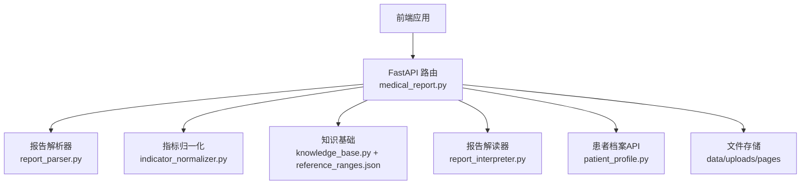
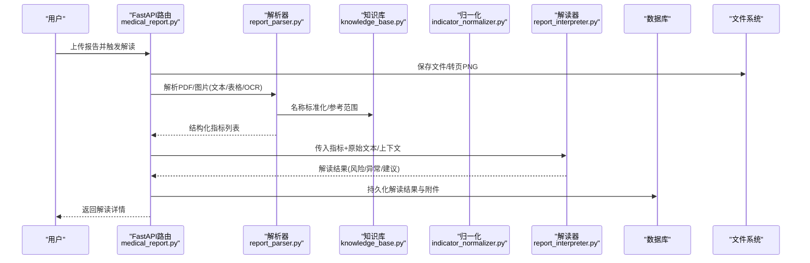
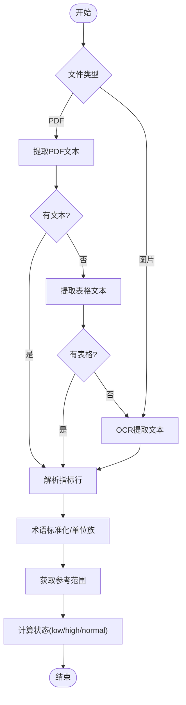
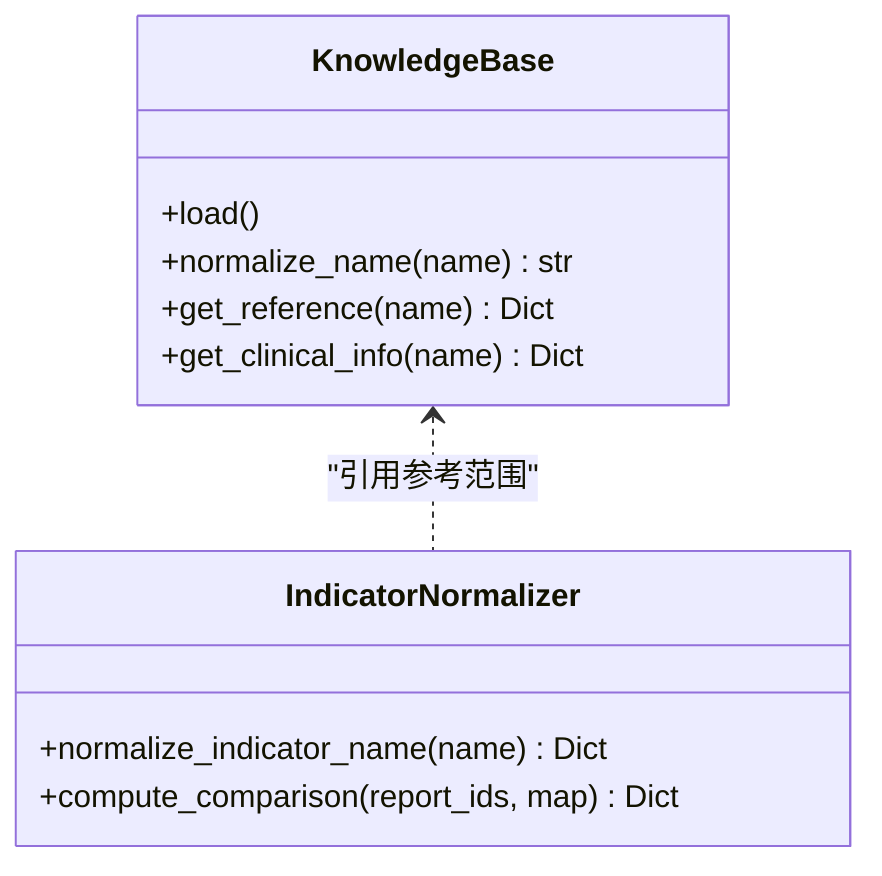
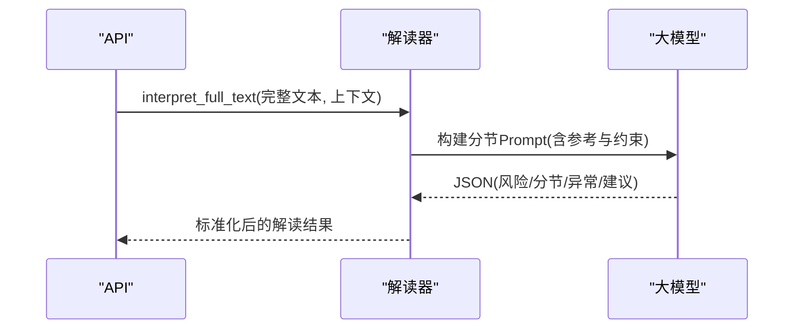
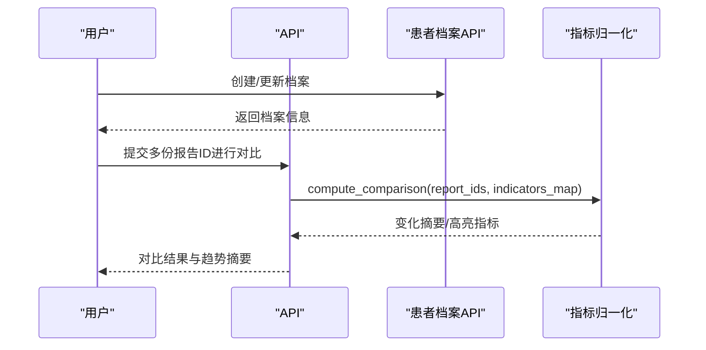
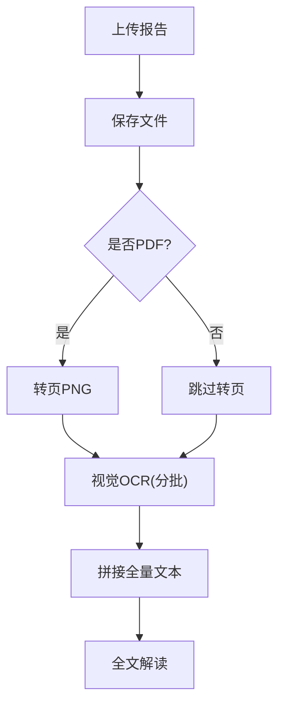
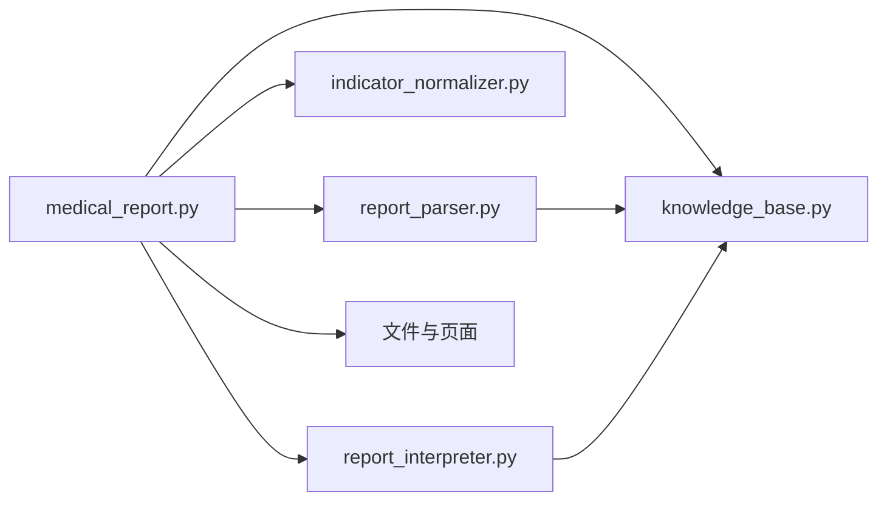

# 体检报告服务

<cite>
**本文引用的文件**
- [medical_report.py](file://web/backend/api/medical_report.py)
- [report_parser.py](file://web/backend/services/medical/report_parser.py)
- [report_interpreter.py](file://web/backend/services/medical/report_interpreter.py)
- [indicator_normalizer.py](file://web/backend/services/medical/indicator_normalizer.py)
- [knowledge_base.py](file://web/backend/services/medical/knowledge_base.py)
- [reference_ranges.json](file://data/medical_knowledge/reference_ranges.json)
- [patient_profile.py](file://web/backend/api/patient_profile.py)
- [models_patient_profile.py](file://web/backend/models/patient_profile.py)
</cite>

## 目录
1. [简介](#简介)
2. [项目结构](#项目结构)
3. [核心组件](#核心组件)
4. [架构总览](#架构总览)
5. [详细组件分析](#详细组件分析)
6. [依赖关系分析](#依赖关系分析)
7. [性能与可扩展性](#性能与可扩展性)
8. [故障排查指南](#故障排查指南)
9. [结论](#结论)
10. [附录](#附录)

## 简介
本技术文档面向“体检报告服务”，覆盖医学报告解析引擎、结构化数据提取、指标正常值判断、健康风险评估与个性化建议生成。系统支持PDF与图片OCR处理、表格识别、医学术语标准化、知识图谱关联（参考范围与临床提示）、报告解读算法，并提供患者档案管理、历史记录对比、趋势分析与预警机制。同时给出报告模板定制思路、批量处理策略与隐私保护方案。

## 项目结构
体检报告服务位于后端模块中，主要包含：
- API层：提供报告上传、解读、对比、档案管理等REST接口
- 服务层：报告解析、指标归一化、知识检索、LLM解读与对比叙事生成
- 数据层：参考范围知识库、数据库模型与文件存储（PDF/图片）
- 前端：报告查看、对比可视化、趋势图表与解读展示

**图示来源**
- [medical_report.py:214-503](file://web/backend/api/medical_report.py#L214-L503)
- [report_parser.py:164-228](file://web/backend/services/medical/report_parser.py#L164-L228)
- [indicator_normalizer.py:313-459](file://web/backend/services/medical/indicator_normalizer.py#L313-L459)
- [knowledge_base.py:15-67](file://web/backend/services/medical/knowledge_base.py#L15-L67)
- [report_interpreter.py:18-115](file://web/backend/services/medical/report_interpreter.py#L18-L115)
- [patient_profile.py:102-297](file://web/backend/api/patient_profile.py#L102-L297)

**章节来源**
- [medical_report.py:214-503](file://web/backend/api/medical_report.py#L214-L503)
- [report_parser.py:164-228](file://web/backend/services/medical/report_parser.py#L164-L228)
- [indicator_normalizer.py:313-459](file://web/backend/services/medical/indicator_normalizer.py#L313-L459)
- [knowledge_base.py:15-67](file://web/backend/services/medical/knowledge_base.py#L15-L67)
- [report_interpreter.py:18-115](file://web/backend/services/medical/report_interpreter.py#L18-L115)
- [patient_profile.py:102-297](file://web/backend/api/patient_profile.py#L102-L297)

## 核心组件
- 报告解析器：负责PDF文本/表格提取、图片OCR、段落检测、指标行解析、单位与参考范围抽取、状态判定
- 指标归一化：将不同名称/别名映射到标准名，统一单位族与面板分类，对齐多份报告的指标序列
- 知识基础：加载参考范围JSON，提供名称标准化、参考区间与临床提示查询
- 报告解读器：调用视觉/文本大模型进行结构化解读，输出风险等级、异常项、建议、患者信息提取；支持分节红黄绿风险标注与对比叙事生成
- 患者档案：管理个人/家属档案，绑定默认档案，支持报告与档案关联
- 文件与页面：PDF转页PNG用于浏览器预览，OCR批处理避免上下文超限

**章节来源**
- [report_parser.py:164-583](file://web/backend/services/medical/report_parser.py#L164-L583)
- [indicator_normalizer.py:6-459](file://web/backend/services/medical/indicator_normalizer.py#L6-L459)
- [knowledge_base.py:15-67](file://web/backend/services/medical/knowledge_base.py#L15-L67)
- [report_interpreter.py:18-800](file://web/backend/services/medical/report_interpreter.py#L18-L800)
- [patient_profile.py:102-297](file://web/backend/api/patient_profile.py#L102-L297)
- [medical_report.py:576-727](file://web/backend/api/medical_report.py#L576-L727)

## 架构总览
体检报告服务采用分层架构：API路由接收请求，调度解析与解读服务，结合知识库与大模型完成结构化输出；文件与页面转换支撑PDF/图片的在线浏览与OCR输入。

**图示来源**
- [medical_report.py:214-503](file://web/backend/api/medical_report.py#L214-L503)
- [report_parser.py:209-267](file://web/backend/services/medical/report_parser.py#L209-L267)
- [knowledge_base.py:21-52](file://web/backend/services/medical/knowledge_base.py#L21-L52)
- [indicator_normalizer.py:313-459](file://web/backend/services/medical/indicator_normalizer.py#L313-L459)
- [report_interpreter.py:18-115](file://web/backend/services/medical/report_interpreter.py#L18-L115)

## 详细组件分析

### 报告解析引擎（PDF/图片OCR、表格识别、术语标准化）
- PDF解析：优先提取可搜索文本；若失败则尝试表格提取；均失败时回退至OCR
- 图片OCR：使用OCR引擎逐行提取中文文本，拼接为结构化输入
- 段落检测：按标题匹配划分检查项目（血常规、肝功能等），便于后续分节解读
- 指标行解析：正则定位数值、单位、参考范围；支持多指标一行、冒号分隔、制表符分隔等格式
- 术语标准化：通过别名映射与知识库名称标准化，得到规范指标名与单位族
- 状态判定：基于参考范围计算low/high/normal/unknown

**图示来源**
- [report_parser.py:209-267](file://web/backend/services/medical/report_parser.py#L209-L267)
- [report_parser.py:285-433](file://web/backend/services/medical/report_parser.py#L285-L433)
- [report_parser.py:499-508](file://web/backend/services/medical/report_parser.py#L499-L508)
- [knowledge_base.py:21-52](file://web/backend/services/medical/knowledge_base.py#L21-L52)

**章节来源**
- [report_parser.py:164-583](file://web/backend/services/medical/report_parser.py#L164-L583)
- [knowledge_base.py:15-67](file://web/backend/services/medical/knowledge_base.py#L15-L67)

### 指标正常值判断与知识图谱关联
- 参考范围来源：reference_ranges.json 提供指标中文名、别名、单位、参考区间、临床意义与白癜风相关性
- 名称映射：通过别名与规范化键查找，得到标准名与单位族
- 状态判定：比较测量值与上下界，输出low/high/normal/unknown
- 临床提示：在解读阶段结合知识库的临床低/高提示与疾病相关性，增强解释质量

**图示来源**
- [knowledge_base.py:15-67](file://web/backend/services/medical/knowledge_base.py#L15-L67)
- [indicator_normalizer.py:6-216](file://web/backend/services/medical/indicator_normalizer.py#L6-L216)

**章节来源**
- [reference_ranges.json:1-51](file://data/medical_knowledge/reference_ranges.json#L1-L51)
- [indicator_normalizer.py:6-216](file://web/backend/services/medical/indicator_normalizer.py#L6-L216)
- [knowledge_base.py:15-67](file://web/backend/services/medical/knowledge_base.py#L15-L67)

### 健康风险评估与个性化建议生成
- 风险等级：low/medium/high/critical，由LLM根据异常程度与组合判断
- 分节风险：每个检查项目（如血常规、肝功能）标注红/黄/绿风险
- 异常项解读：包含可能原因与建议，结合知识库临床提示
- 个性化建议：结合用户上下文（年龄/性别）与报告整体情况生成可执行建议
- 对比叙事：对多份报告的变化生成关键变化总结与后续建议

**图示来源**
- [report_interpreter.py:44-60](file://web/backend/services/medical/report_interpreter.py#L44-L60)
- [report_interpreter.py:287-374](file://web/backend/services/medical/report_interpreter.py#L287-L374)
- [report_interpreter.py:528-619](file://web/backend/services/medical/report_interpreter.py#L528-L619)

**章节来源**
- [report_interpreter.py:18-800](file://web/backend/services/medical/report_interpreter.py#L18-L800)

### 患者档案管理、历史对比与趋势分析
- 档案管理：创建/更新/删除患者档案，限制“本人”唯一性，支持默认模块绑定
- 报告-档案关联：将报告与患者档案ID绑定，便于趋势追踪
- 历史对比：对齐多份报告的指标序列，计算变化类型（新异常/已恢复/持续异常/大幅波动/稳定）
- 趋势与预警：基于变化摘要与高亮指标，生成趋势视图与预警提示

**图示来源**
- [patient_profile.py:102-297](file://web/backend/api/patient_profile.py#L102-L297)
- [indicator_normalizer.py:313-459](file://web/backend/services/medical/indicator_normalizer.py#L313-L459)
- [medical_report.py:278-327](file://web/backend/api/medical_report.py#L278-L327)

**章节来源**
- [patient_profile.py:102-297](file://web/backend/api/patient_profile.py#L102-L297)
- [models_patient_profile.py:7-47](file://web/backend/models/patient_profile.py#L7-L47)
- [indicator_normalizer.py:313-459](file://web/backend/services/medical/indicator_normalizer.py#L313-L459)
- [medical_report.py:278-327](file://web/backend/api/medical_report.py#L278-L327)

### PDF/图片OCR处理与页面预览
- PDF转页：将PDF每页渲染为PNG，存放于pages/{file_id}/，供前端分页查看
- 视觉OCR：将PDF/图片分批送入视觉模型，逐批提取文字，避免上下文超限
- 文本提取：优先从PDF直接提取文本；若无文本则走视觉OCR路径
- 批处理策略：每批最多8页，控制响应长度与稳定性

**图示来源**
- [medical_report.py:576-727](file://web/backend/api/medical_report.py#L576-L727)
- [medical_report.py:506-573](file://web/backend/api/medical_report.py#L506-L573)

**章节来源**
- [medical_report.py:506-727](file://web/backend/api/medical_report.py#L506-L727)

### 报告模板定制与批量处理
- 模板定制：通过调整解析器的段落定义与指标别名映射，适配不同医院/机构报告格式
- 批量处理：对多份报告并行解析与解读，利用批处理OCR与异步任务队列提升吞吐
- 输出模板：标准化解读JSON结构，便于前端渲染与导出

**章节来源**
- [report_parser.py:142-161](file://web/backend/services/medical/report_parser.py#L142-L161)
- [report_interpreter.py:528-619](file://web/backend/services/medical/report_interpreter.py#L528-L619)

### 隐私保护方案
- 访问控制：所有接口需鉴权，仅允许用户访问自身报告与档案
- 数据最小化：仅存储必要字段，敏感信息脱敏后再入库或日志记录
- 传输安全：HTTPS加密传输，文件存储权限隔离
- 审计与合规：记录操作日志，支持数据导出与删除

**章节来源**
- [medical_report.py:185-211](file://web/backend/api/medical_report.py#L185-L211)
- [patient_profile.py:102-297](file://web/backend/api/patient_profile.py#L102-L297)

## 依赖关系分析
- API层依赖解析器、归一化、知识库与解读器
- 解析器依赖知识库进行名称标准化与参考范围查询
- 解读器依赖LLM配置与视觉/文本模型
- 文件处理依赖PDF渲染库与OCR引擎
- 患者档案与报告通过ID关联，支持趋势与对比

**图示来源**
- [medical_report.py:214-503](file://web/backend/api/medical_report.py#L214-L503)
- [report_parser.py:164-228](file://web/backend/services/medical/report_parser.py#L164-L228)
- [indicator_normalizer.py:313-459](file://web/backend/services/medical/indicator_normalizer.py#L313-L459)
- [knowledge_base.py:15-67](file://web/backend/services/medical/knowledge_base.py#L15-L67)
- [report_interpreter.py:18-115](file://web/backend/services/medical/report_interpreter.py#L18-L115)

**章节来源**
- [medical_report.py:214-503](file://web/backend/api/medical_report.py#L214-L503)
- [report_parser.py:164-228](file://web/backend/services/medical/report_parser.py#L164-L228)
- [indicator_normalizer.py:313-459](file://web/backend/services/medical/indicator_normalizer.py#L313-L459)
- [knowledge_base.py:15-67](file://web/backend/services/medical/knowledge_base.py#L15-L67)
- [report_interpreter.py:18-115](file://web/backend/services/medical/report_interpreter.py#L18-L115)

## 性能与可扩展性
- OCR批处理：每批8页，降低单次请求负载，提高稳定性
- PDF转页：按需渲染，减少不必要I/O
- 指标对齐：按面板与显示名排序，便于前端高效渲染
- 可扩展点：新增指标别名与参考范围即可扩展解析能力；替换LLM提供商无需改动上层逻辑

[本节为通用指导，不直接分析具体文件]

## 故障排查指南
- 无法解析PDF：检查PyMuPDF/pdfplumber可用性；确认文件可读且非扫描图
- OCR失败：确认视觉模型配置有效；检查图片清晰度与分辨率
- 指标缺失：核对段落定义与别名映射；补充参考范围与别名
- 解读结果为空：检查LLM配置与网络；查看截断JSON恢复逻辑
- 对比无变化：确认多份报告指标命名一致；检查归一化映射

**章节来源**
- [report_parser.py:230-267](file://web/backend/services/medical/report_parser.py#L230-L267)
- [report_interpreter.py:414-468](file://web/backend/services/medical/report_interpreter.py#L414-L468)
- [indicator_normalizer.py:313-459](file://web/backend/services/medical/indicator_normalizer.py#L313-L459)

## 结论
体检报告服务通过“解析—归一化—知识检索—LLM解读—对比分析”的流水线，实现了从非结构化报告到结构化健康洞察的自动化转化。系统具备较强的鲁棒性与可扩展性，支持多源报告格式、跨期趋势分析与个性化建议生成。未来可进一步增强模板适配、批量并发与隐私合规能力。

[本节为总结，不直接分析具体文件]

## 附录
- 参考范围数据：reference_ranges.json 提供指标中文名、别名、单位、参考区间、临床意义与白癜风相关性
- 患者档案模型：支持姓名、关系、性别、出生日期、诊断日期、白癜风类型与备注
- 报告解读输出：包含风险等级、总体总结、分节风险、异常项解读、建议与患者信息提取

**章节来源**
- [reference_ranges.json:1-51](file://data/medical_knowledge/reference_ranges.json#L1-L51)
- [models_patient_profile.py:7-47](file://web/backend/models/patient_profile.py#L7-L47)
- [report_interpreter.py:528-619](file://web/backend/services/medical/report_interpreter.py#L528-L619)