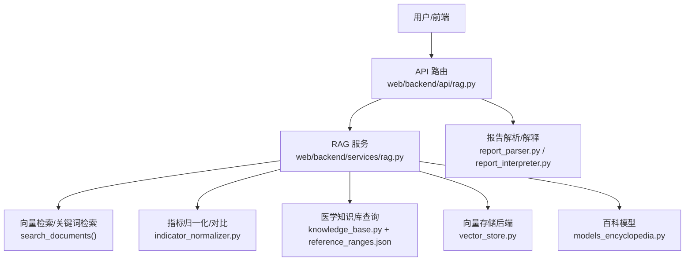
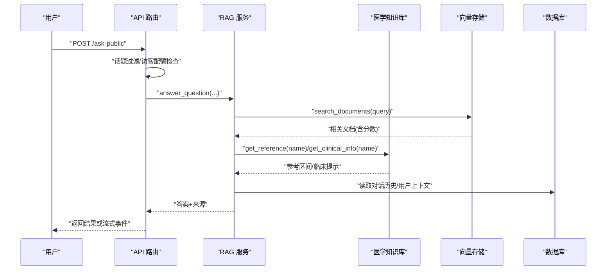
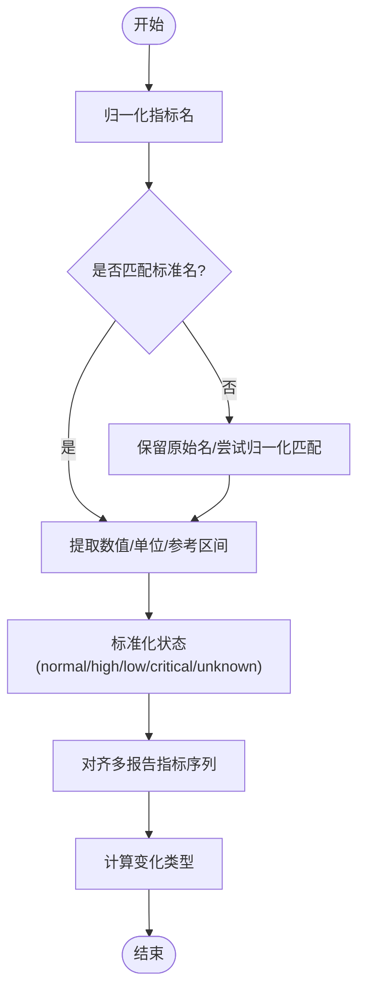
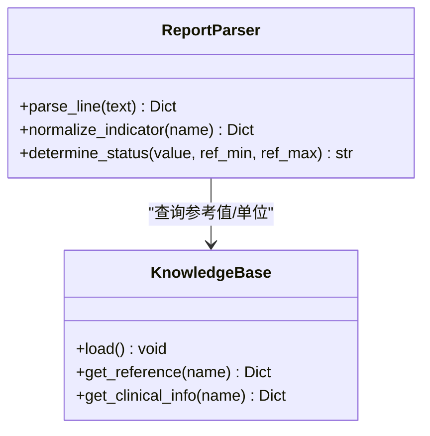
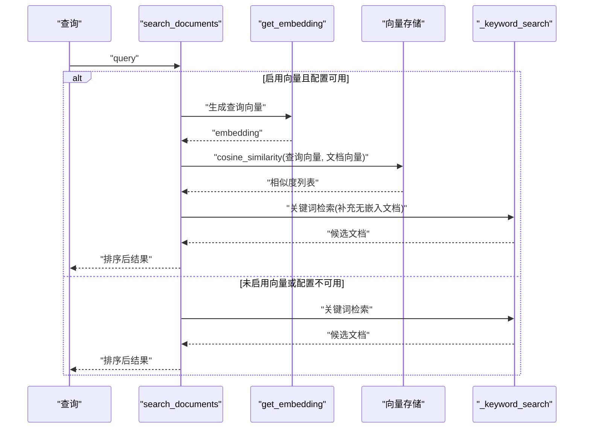
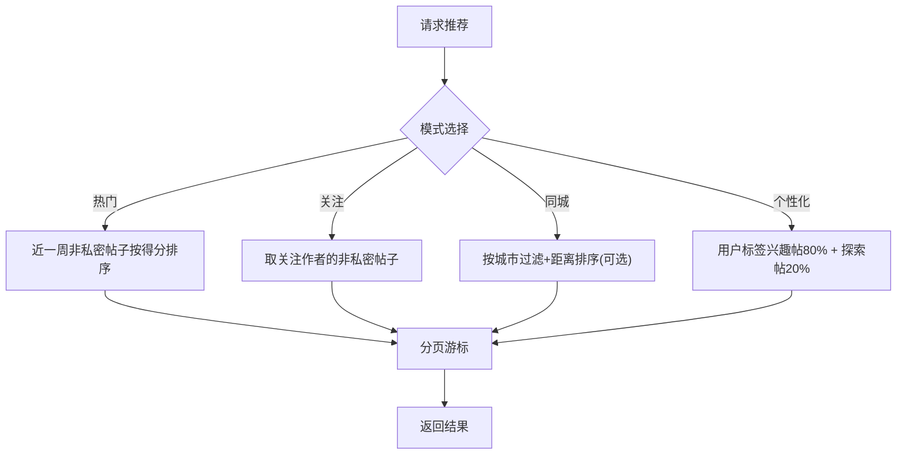
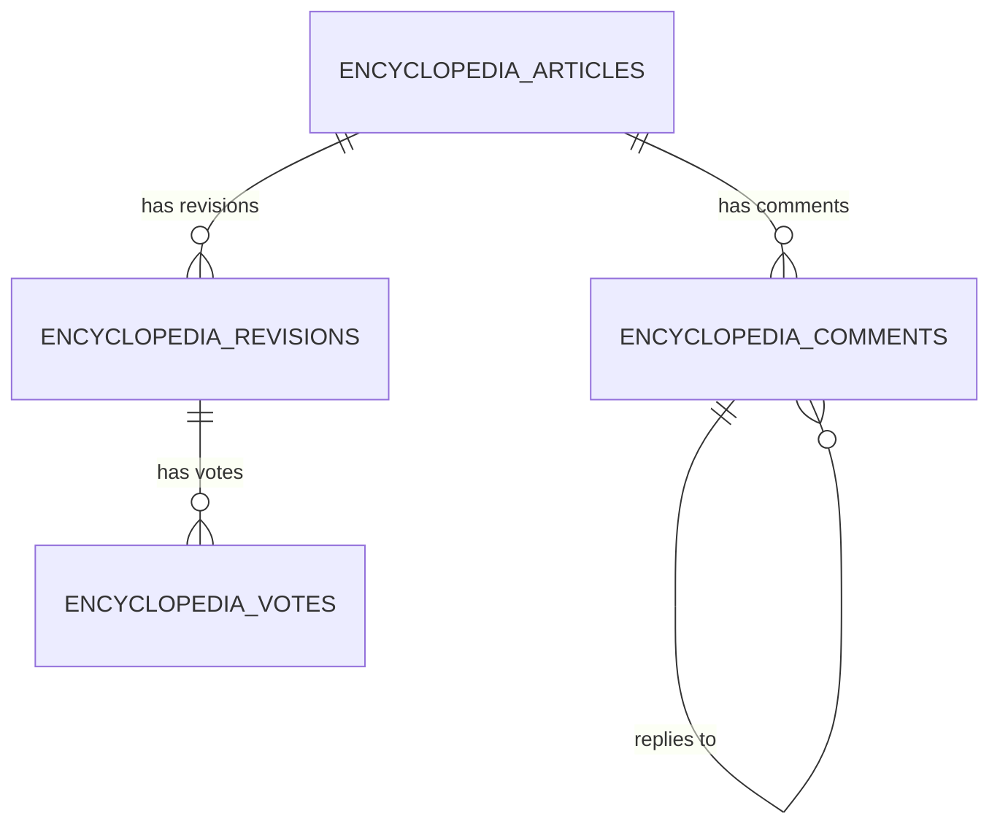
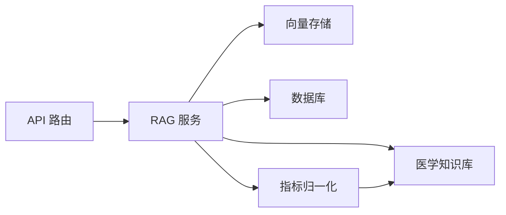

# 医学知识库

<cite>
**本文引用的文件**
- [reference_ranges.json](file://data/medical_knowledge/reference_ranges.json)
- [knowledge_base.py](file://web/backend/services/medical/knowledge_base.py)
- [indicator_normalizer.py](file://web/backend/services/medical/indicator_normalizer.py)
- [rag.py（服务）](file://web/backend/services/rag.py)
- [rag.py（API）](file://web/backend/api/rag.py)
- [models_rag.py](file://web/backend/models/rag.py)
- [vector_store.py](file://web/backend/services/vector_store.py)
- [models_encyclopedia.py](file://web/backend/database/models_encyclopedia.py)
- [report_parser.py](file://web/backend/services/medical/report_parser.py)
- [report_interpreter.py](file://web/backend/services/medical/report_interpreter.py)
</cite>

## 目录
1. [简介](#简介)
2. [项目结构](#项目结构)
3. [核心组件](#核心组件)
4. [架构总览](#架构总览)
5. [详细组件分析](#详细组件分析)
6. [依赖关系分析](#依赖关系分析)
7. [性能考量](#性能考量)
8. [故障排查指南](#故障排查指南)
9. [结论](#结论)
10. [附录](#附录)

## 简介
本技术文档面向医学知识库系统，围绕医学术语标准化、参考值范围管理、疾病知识图谱与健康指标数据库展开，重点说明：
- 指标分类体系与正常值区间定义
- 异常判断规则与趋势变化识别
- 医学文献引用与来源分级
- 知识库更新机制、术语映射表、版本管理与质量评估
- 知识检索接口、相似度计算与智能推荐算法

该知识库服务于白癜风及相关皮肤健康领域的问答、体检报告解读与社区内容推荐。

## 项目结构
与医学知识库相关的代码主要分布在以下位置：
- 数据层：参考值范围 JSON、百科模型
- 服务层：指标归一化、知识查询、RAG 检索与生成、向量存储
- 接口层：FastAPI 路由，提供问答、上传、流式响应等能力
- 解析与解释层：体检报告解析、指标状态判定、临床信息输出

图表来源
- [rag.py（API）:246-330](file://web/backend/api/rag.py#L246-L330)
- [rag.py（服务）:456-522](file://web/backend/services/rag.py#L456-L522)
- [indicator_normalizer.py:203-460](file://web/backend/services/medical/indicator_normalizer.py#L203-L460)
- [knowledge_base.py:15-70](file://web/backend/services/medical/knowledge_base.py#L15-L70)
- [vector_store.py:245-265](file://web/backend/services/vector_store.py#L245-L265)
- [models_encyclopedia.py:18-134](file://web/backend/database/models_encyclopedia.py#L18-L134)

章节来源
- [rag.py（API）:246-330](file://web/backend/api/rag.py#L246-L330)
- [rag.py（服务）:456-522](file://web/backend/services/rag.py#L456-L522)
- [indicator_normalizer.py:203-460](file://web/backend/services/medical/indicator_normalizer.py#L203-L460)
- [knowledge_base.py:15-70](file://web/backend/services/medical/knowledge_base.py#L15-L70)
- [vector_store.py:245-265](file://web/backend/services/vector_store.py#L245-L265)
- [models_encyclopedia.py:18-134](file://web/backend/database/models_encyclopedia.py#L18-L134)

## 核心组件
- 医学术语标准化与参考值管理
  - 通过 JSON 维护指标名称、别名、单位、参考区间、临床意义及与白癜风的关联提示
  - 提供名称归一化与参考信息查询接口
- 指标归一化与对比
  - 将不同来源的指标名统一为标准名，提取数值、构建参考区间字符串、判定状态
  - 对齐多份报告的同一指标序列，识别“新发异常”“恢复”“持续异常”“大幅波动”“稳定”等变化类型
- RAG 知识检索与问答
  - 支持向量检索与关键词检索混合策略，按权威权重与时效性加权评分
  - 内置来源分级（S/A/B/C/D），回答时遵循优先级规则并给出来源引用
- 百科与修订版本管理
  - 文章、修订、评论、投票模型，支持协作编辑与审核流程
- 向量存储与相似度计算
  - 支持 SQLite/pgvector/Qdrant 多种后端；余弦相似度用于文本相似匹配
- 报告解析与解释
  - 从原始报告文本中抽取指标、单位、参考区间，结合知识库判定状态，输出结构化解读与建议

章节来源
- [reference_ranges.json:1-51](file://data/medical_knowledge/reference_ranges.json#L1-L51)
- [knowledge_base.py:15-70](file://web/backend/services/medical/knowledge_base.py#L15-L70)
- [indicator_normalizer.py:203-460](file://web/backend/services/medical/indicator_normalizer.py#L203-L460)
- [rag.py（服务）:525-636](file://web/backend/services/rag.py#L525-L636)
- [models_encyclopedia.py:18-134](file://web/backend/database/models_encyclopedia.py#L18-L134)
- [vector_store.py:245-265](file://web/backend/services/vector_store.py#L245-L265)
- [report_parser.py:375-408](file://web/backend/services/medical/report_parser.py#L375-L408)
- [report_interpreter.py:786-837](file://web/backend/services/medical/report_interpreter.py#L786-L837)

## 架构总览
系统采用分层架构：API 层负责鉴权、限流、参数校验与流式响应；服务层封装业务逻辑（RAG、指标处理、知识库查询）；数据层包含关系型数据库、JSON 配置与可选向量库。

图表来源
- [rag.py（API）:273-330](file://web/backend/api/rag.py#L273-L330)
- [rag.py（服务）:456-522](file://web/backend/services/rag.py#L456-L522)
- [knowledge_base.py:21-70](file://web/backend/services/medical/knowledge_base.py#L21-L70)

## 详细组件分析

### 医学术语标准化与参考值管理
- 术语映射表
  - 通过 CANONICAL_INDICATORS 定义标准名、显示名、别名、单位族、面板分类
  - 构建精确与归一化后的别名映射，支持中英文、缩写、常见别名匹配
- 参考值范围
  - reference_ranges.json 集中维护指标名称、中文名称、别名、单位、参考上下限、类别、临床低/高提示、与白癜风相关性
  - MedicalKnowledgeBase 加载 JSON，建立 name_map，提供 normalize_name/get_reference/get_clinical_info
- 指标归一化与对比
  - normalize_indicator_name 将输入名映射到标准名
  - _normalize_indicator_record 提取数值、构建 ref_range、标准化 status
  - align_indicators 对齐多份报告中的同一指标序列，填充缺失占位
  - classify_change 基于首次与最近测量值的状态与相对变化幅度，归类为 newly_abnormal/resolved_abnormal/persistent_abnormal/large_delta/unchanged_stable/not_measured
  - compute_comparison 汇总变化统计与高亮项

图表来源
- [indicator_normalizer.py:203-460](file://web/backend/services/medical/indicator_normalizer.py#L203-L460)
- [knowledge_base.py:21-70](file://web/backend/services/medical/knowledge_base.py#L21-L70)

章节来源
- [indicator_normalizer.py:203-460](file://web/backend/services/medical/indicator_normalizer.py#L203-L460)
- [knowledge_base.py:21-70](file://web/backend/services/medical/knowledge_base.py#L21-L70)
- [reference_ranges.json:1-51](file://data/medical_knowledge/reference_ranges.json#L1-L51)

### 健康指标数据库与报告解析
- 报告解析
  - 从报告文本中提取指标名、数值、单位、参考区间
  - 使用 knowledge_base.get_reference 获取参考上下限与单位
  - 根据参考区间判定状态（正常/偏高/偏低/危急）
- 报告解释
  - 将 LLM 输出的结构化结果规范化，包括指标名、值、状态、解释、可能原因、建议、置信度、来源指标片段等
  - 对 source_indicators 进行标准化，确保字段一致

图表来源
- [report_parser.py:375-408](file://web/backend/services/medical/report_parser.py#L375-L408)
- [knowledge_base.py:21-70](file://web/backend/services/medical/knowledge_base.py#L21-L70)
- [report_interpreter.py:786-837](file://web/backend/services/medical/report_interpreter.py#L786-L837)

章节来源
- [report_parser.py:375-408](file://web/backend/services/medical/report_parser.py#L375-L408)
- [report_interpreter.py:786-837](file://web/backend/services/medical/report_interpreter.py#L786-L837)
- [knowledge_base.py:21-70](file://web/backend/services/medical/knowledge_base.py#L21-L70)

### 知识检索接口与相似度计算
- 检索策略
  - 优先向量检索：调用 embedding API 生成查询向量，与文档向量计算余弦相似度，按权威权重与时效性加权
  - 回退关键词检索：当向量不可用或维度不匹配时，使用关键词匹配并降权合并
- 相似度计算
  - cosine_similarity 严格校验维度一致性，维度不匹配返回 0 并记录警告，避免错误排名
- 搜索入口
  - search_documents(db, query, top_k) 统一入口，内部决定向量/关键词路径

图表来源
- [rag.py（服务）:354-401](file://web/backend/services/rag.py#L354-L401)
- [rag.py（服务）:456-522](file://web/backend/services/rag.py#L456-L522)
- [vector_store.py:245-265](file://web/backend/services/vector_store.py#L245-L265)

章节来源
- [rag.py（服务）:354-401](file://web/backend/services/rag.py#L354-L401)
- [rag.py（服务）:456-522](file://web/backend/services/rag.py#L456-L522)
- [vector_store.py:245-265](file://web/backend/services/vector_store.py#L245-L265)

### 智能推荐算法
- 推荐服务
  - 基于互动权重（点击、阅读结束、点赞、收藏、评论、分享、跳过）计算帖子得分
  - 支持热门、关注、同城、个性化四种模式
  - 个性化推荐融合用户偏好标签（近200条交互日志聚合）与探索内容
- 本地缓存
  - 同城帖子按城市、页码、页面大小与经纬度缓存 ID 列表，TTL 5 分钟，减少重复查询

图表来源
- [recommendation.py:42-347](file://web/backend/services/recommendation.py#L42-L347)

章节来源
- [recommendation.py:42-347](file://web/backend/services/recommendation.py#L42-L347)

### 百科知识与版本管理
- 模型设计
  - EncyclopediaArticle：文章主表（slug、标题、分类、内容、摘要、图标、排序、发布状态、浏览量、时间戳）
  - EncyclopediaRevision：修订记录（变更类型、审核状态、差异预览、审核信息与意见、投票统计）
  - EncyclopediaComment：评论与回复（层级关系、审核标记）
  - EncyclopediaVote：修订投票（唯一约束：revision_id + user_id）
- 协作与审核
  - 支持 suggest/approved/rejected/rollback 等变更类型与 pending/approved/rejected 审核状态
  - 评论需审核后方可展示，保障内容质量

图表来源
- [models_encyclopedia.py:18-134](file://web/backend/database/models_encyclopedia.py#L18-L134)

章节来源
- [models_encyclopedia.py:18-134](file://web/backend/database/models_encyclopedia.py#L18-L134)

### 知识问答与来源分级
- 来源分级
  - S 级：国际/国家级诊疗指南、监管机构批准文件
  - A 级：同行评审学术论文
  - B 级：临床试验注册数据、专业研究基金会报告
  - C 级：预印本、专业媒体解读、医学科普平台
  - D 级：社区经验、百科内容
- 回答规则
  - 优先采信更高级别资料；C/D 级需标注未经同行评审或个人经验
  - 若 S/A 与 C/D 矛盾，以 S/A 为准
  - 回答末尾主动推荐社区板块，引导进一步交流
  - 拒绝直接诊断，引导线下就医

章节来源
- [rag.py（服务）:525-636](file://web/backend/services/rag.py#L525-L636)

## 依赖关系分析
- 模块耦合
  - API 路由依赖 RAG 服务进行问答与流式响应
  - RAG 服务依赖向量存储、医学知识库、数据库会话
  - 指标归一化与对比独立于 RAG，可被报告解析与解释复用
- 外部依赖
  - OpenAI 兼容的 embedding API（DashScope/Volcengine/OpenAI）
  - 向量存储后端（SQLite/pgvector/Qdrant）
- 潜在循环依赖
  - 当前实现未见明显循环导入；各模块职责清晰

图表来源
- [rag.py（API）:246-330](file://web/backend/api/rag.py#L246-L330)
- [rag.py（服务）:456-522](file://web/backend/services/rag.py#L456-L522)
- [knowledge_base.py:21-70](file://web/backend/services/medical/knowledge_base.py#L21-L70)
- [indicator_normalizer.py:203-460](file://web/backend/services/medical/indicator_normalizer.py#L203-L460)

章节来源
- [rag.py（API）:246-330](file://web/backend/api/rag.py#L246-L330)
- [rag.py（服务）:456-522](file://web/backend/services/rag.py#L456-L522)
- [knowledge_base.py:21-70](file://web/backend/services/medical/knowledge_base.py#L21-L70)
- [indicator_normalizer.py:203-460](file://web/backend/services/medical/indicator_normalizer.py#L203-L460)

## 性能考量
- 向量检索优化
  - 维度不匹配时直接丢弃文档，避免无效比较
  - 关键词检索作为兜底，保证新增内容即时可检索
- 并发与限流
  - 登录用户按用户维度限速，防止 LLM 成本滥用
  - 访客每日配额限制，基于客户端指纹计数
- 缓存策略
  - 同城帖子按条件缓存 ID 列表，降低重复查询压力
- 资源控制
  - 临时文件上传限制大小与类型，避免恶意占用
  - 流式响应减少首包延迟，提升用户体验

章节来源
- [rag.py（服务）:387-401](file://web/backend/services/rag.py#L387-L401)
- [rag.py（服务）:456-522](file://web/backend/services/rag.py#L456-L522)
- [rag.py（API）:228-244](file://web/backend/api/rag.py#L228-L244)
- [rag.py（API）:345-382](file://web/backend/api/rag.py#L345-L382)
- [recommendation.py:28-39](file://web/backend/services/recommendation.py#L28-L39)

## 故障排查指南
- 常见问题
  - 向量维度不匹配：cosine_similarity 返回 0 并记录警告，系统将回退到关键词检索
  - Embedding 生成失败：自动降级为关键词检索，确保可用性
  - 访客配额耗尽：返回 429，提示登录解锁更多功能
  - 会话权限错误：跨用户访问已删除或不属于当前用户的会话将返回 404/403
- 定位方法
  - 查看日志中的 WARNING/ERROR 信息，确认 embedding 配置与向量后端状态
  - 检查临时文件元数据是否存在与归属是否正确
  - 核对访客指纹与日期计数是否准确

章节来源
- [rag.py（服务）:387-401](file://web/backend/services/rag.py#L387-L401)
- [rag.py（服务）:456-476](file://web/backend/services/rag.py#L456-L476)
- [rag.py（API）:136-163](file://web/backend/api/rag.py#L136-L163)
- [rag.py（API）:188-225](file://web/backend/api/rag.py#L188-L225)

## 结论
本医学知识库系统通过标准化的术语映射、完善的参考值范围管理、严谨的异常判断与趋势识别、以及基于向量与关键词混合的知识检索，构建了高质量的医疗问答与报告解读能力。百科协作与版本管理保障了内容的可持续演进，推荐算法提升了社区内容的发现效率。系统在安全性、性能与可扩展性方面具备良好实践，适合在白癜风与皮肤健康领域持续迭代。

## 附录
- 术语映射表与参考值范围
  - 标准名与别名：见 indicator_normalizer.py 中的 CANONICAL_INDICATORS
  - 参考区间与临床提示：见 reference_ranges.json
- 版本管理
  - 百科修订与审核：见 models_encyclopedia.py
- 质量评估标准
  - 来源分级与引用规则：见 rag.py（服务）中的系统提示与评分加权
  - 异常判断与趋势识别：见 indicator_normalizer.py 的变化分类逻辑