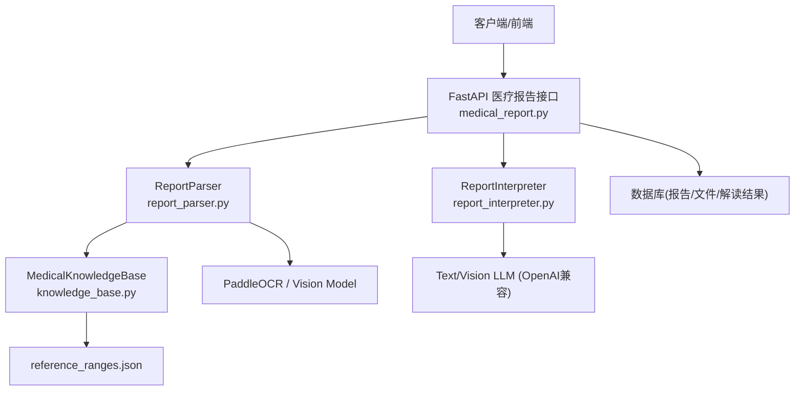
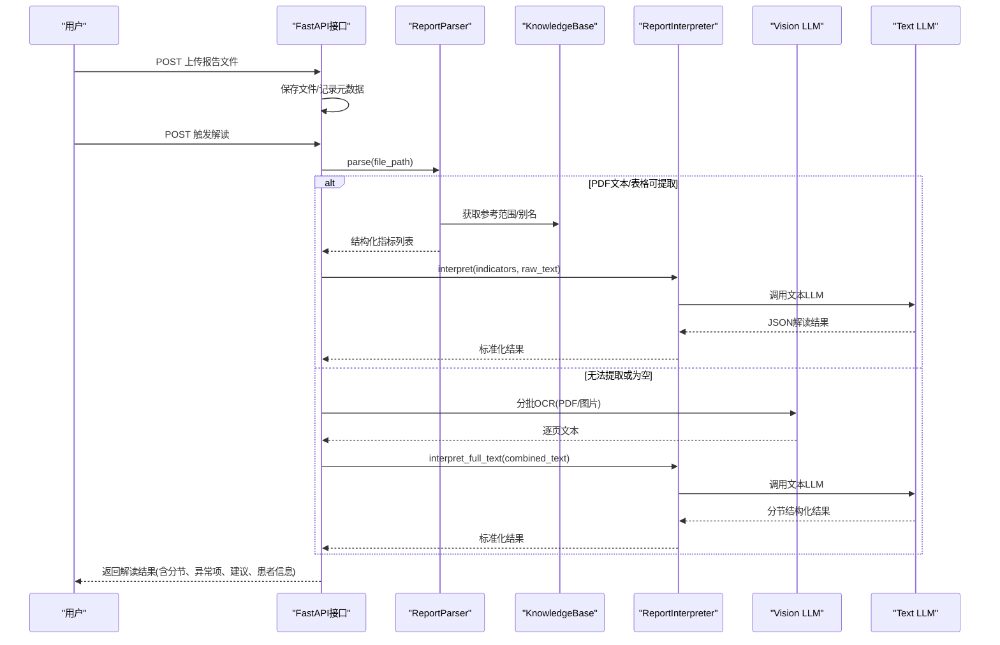
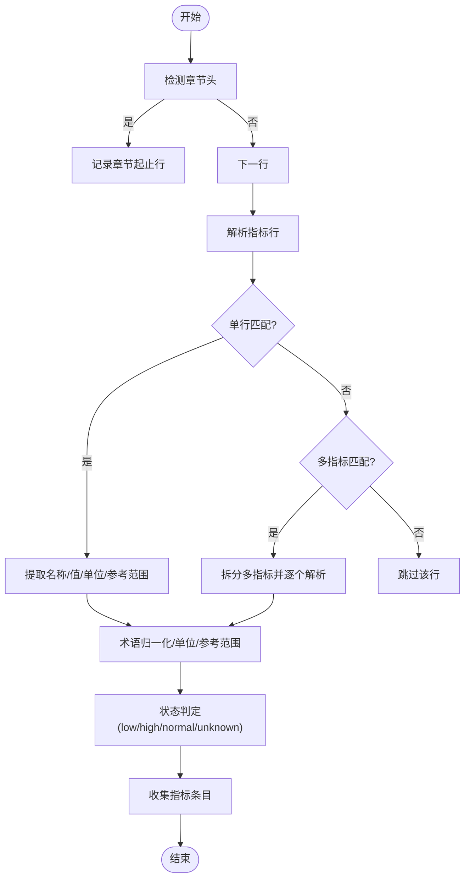
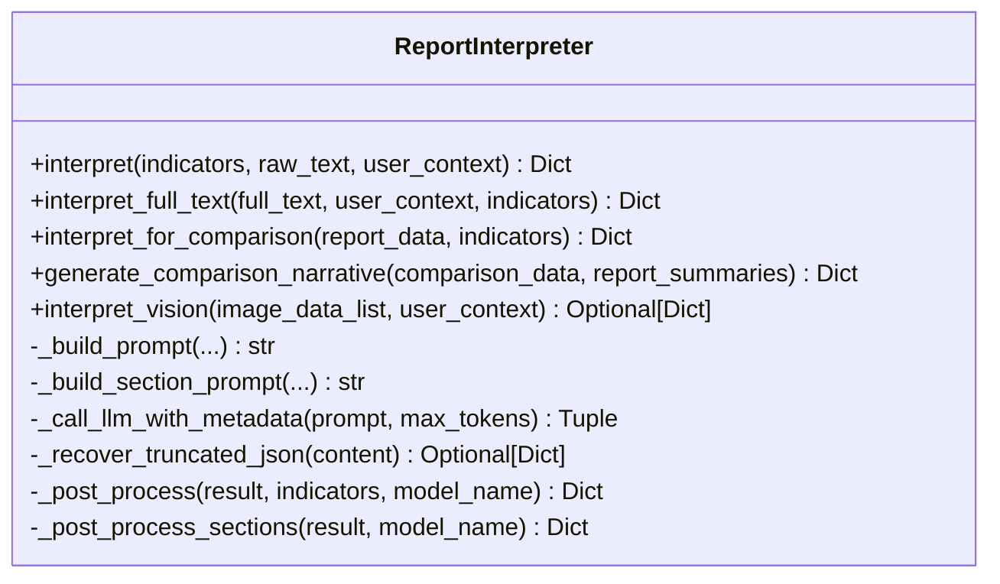
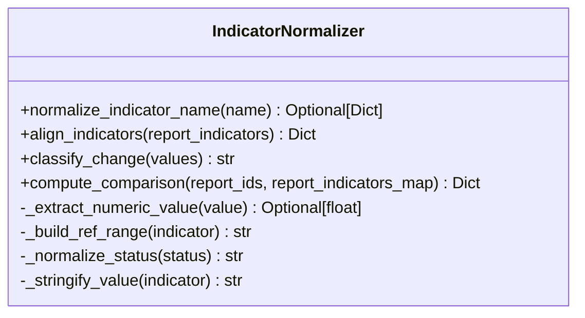
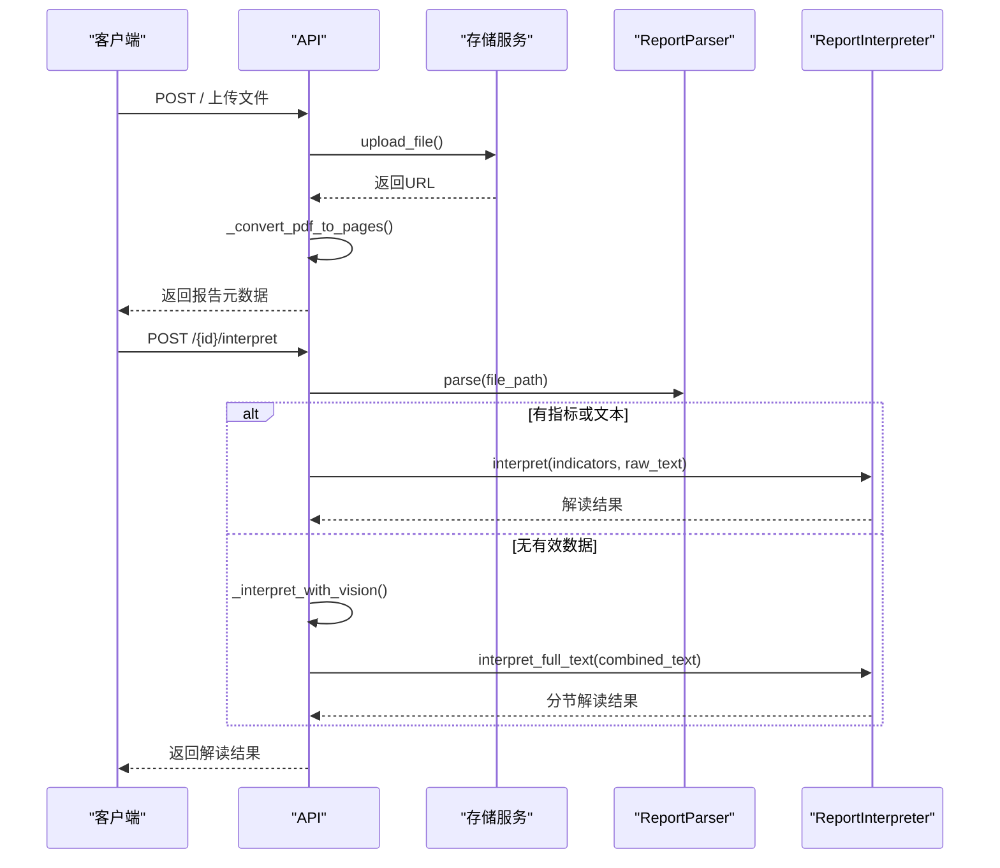
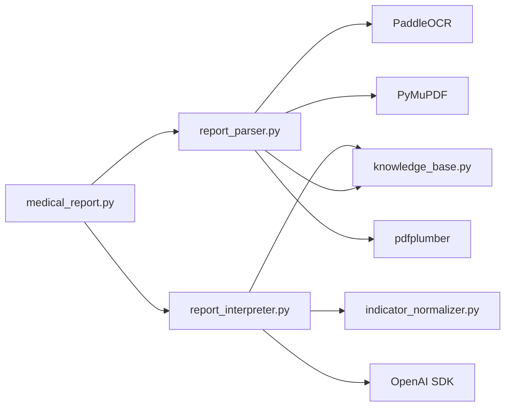

# 报告解析引擎

<cite>
**本文引用的文件**   
- [web/backend/api/medical_report.py](file://web/backend/api/medical_report.py)
- [web/backend/services/medical/report_parser.py](file://web/backend/services/medical/report_parser.py)
- [web/backend/services/medical/report_interpreter.py](file://web/backend/services/medical/report_interpreter.py)
- [web/backend/services/medical/indicator_normalizer.py](file://web/backend/services/medical/indicator_normalizer.py)
- [web/backend/services/medical/knowledge_base.py](file://web/backend/services/medical/knowledge_base.py)
- [data/medical_knowledge/reference_ranges.json](file://data/medical_knowledge/reference_ranges.json)
</cite>

## 目录
1. [简介](#简介)
2. [项目结构](#项目结构)
3. [核心组件](#核心组件)
4. [架构总览](#架构总览)
5. [详细组件分析](#详细组件分析)
6. [依赖关系分析](#依赖关系分析)
7. [性能考虑](#性能考虑)
8. [故障排查指南](#故障排查指南)
9. [结论](#结论)
10. [附录](#附录)

## 简介
本技术文档面向体检报告解析引擎，系统支持PDF与图片（JPG、PNG等）输入，提供文本提取、OCR识别、表格数据识别、医学术语标准化、结构化指标抽取、章节分类、数值单位转换、数据校验与解读。引擎采用“规则解析 + LLM增强”的双通道策略：优先通过本地规则与知识库进行快速解析；当无法可靠提取时，回退到视觉大模型的两阶段OCR+全文结构化分析流程。输出包含按检查项目的分节结果、异常项深度解读、建议与患者信息抽取，并支持多份报告的对比与趋势分析。

## 项目结构
- API层：FastAPI路由负责上传、存储、触发解析与解读、分页展示、对比接口等。
- 服务层：
  - report_parser：PDF文本/表格提取、图片OCR、指标行解析、章节检测、单位与参考范围推断。
  - report_interpreter：LLM调用、提示词构建、JSON后处理、章节化解读、对比叙事生成。
  - indicator_normalizer：指标名称归一化、单位族映射、多报告对齐与变化分类。
  - knowledge_base：加载reference_ranges.json，提供名称归一化与参考范围查询。
- 数据层：reference_ranges.json维护指标别名、单位、参考范围及临床注释。

**图表来源** 
- [web/backend/api/medical_report.py:214-503](file://web/backend/api/medical_report.py#L214-L503)
- [web/backend/services/medical/report_parser.py:209-267](file://web/backend/services/medical/report_parser.py#L209-L267)
- [web/backend/services/medical/report_interpreter.py:18-61](file://web/backend/services/medical/report_interpreter.py#L18-L61)
- [web/backend/services/medical/knowledge_base.py:15-52](file://web/backend/services/medical/knowledge_base.py#L15-L52)
- [data/medical_knowledge/reference_ranges.json:1-51](file://data/medical_knowledge/reference_ranges.json#L1-L51)

**章节来源**
- [web/backend/api/medical_report.py:214-503](file://web/backend/api/medical_report.py#L214-L503)
- [web/backend/services/medical/report_parser.py:209-267](file://web/backend/services/medical/report_parser.py#L209-L267)
- [web/backend/services/medical/report_interpreter.py:18-61](file://web/backend/services/medical/report_interpreter.py#L18-L61)
- [web/backend/services/medical/knowledge_base.py:15-52](file://web/backend/services/medical/knowledge_base.py#L15-L52)
- [data/medical_knowledge/reference_ranges.json:1-51](file://data/medical_knowledge/reference_ranges.json#L1-L51)

## 核心组件
- ReportParser
  - 支持PDF文本与表格提取、图片OCR、多格式图像识别。
  - 章节检测、指标行解析、单位与参考范围推断、状态判定。
- ReportInterpreter
  - 构建提示词、调用LLM、JSON恢复与后处理、章节化解读、对比叙事。
- IndicatorNormalizer
  - 指标名称归一化、单位族映射、多报告对齐、变化类型分类。
- KnowledgeBase
  - 加载参考范围与别名映射，提供名称归一化与参考范围查询。

**章节来源**
- [web/backend/services/medical/report_parser.py:164-583](file://web/backend/services/medical/report_parser.py#L164-L583)
- [web/backend/services/medical/report_interpreter.py:18-800](file://web/backend/services/medical/report_interpreter.py#L18-L800)
- [web/backend/services/medical/indicator_normalizer.py:1-460](file://web/backend/services/medical/indicator_normalizer.py#L1-L460)
- [web/backend/services/medical/knowledge_base.py:15-71](file://web/backend/services/medical/knowledge_base.py#L15-L71)

## 架构总览
整体流程分为两条路径：
- 规则路径：PDF文本/表格 → 指标行解析 → 术语标准化 → 参考范围匹配 → 结构化指标列表。
- 视觉路径：PDF/图片 → 视觉模型OCR（分批）→ 全文拼接 → LLM全文结构化解读（分节、红黄绿风险）。

**图表来源** 
- [web/backend/api/medical_report.py:426-503](file://web/backend/api/medical_report.py#L426-L503)
- [web/backend/api/medical_report.py:506-573](file://web/backend/api/medical_report.py#L506-L573)
- [web/backend/services/medical/report_parser.py:209-267](file://web/backend/services/medical/report_parser.py#L209-L267)
- [web/backend/services/medical/report_interpreter.py:44-61](file://web/backend/services/medical/report_interpreter.py#L44-L61)

## 详细组件分析

### ReportParser：PDF/图片解析与指标抽取
- 多格式支持
  - PDF：PyMuPDF提取文本；pdfplumber提取表格；失败时回退空字符串。
  - 图片：PaddleOCR中文识别；失败时回退空字符串。
- 章节检测
  - 基于SECTION_DEFINITIONS与别名映射，识别“血常规/尿常规/肝功能/肾功能/血脂/血糖/甲状腺功能/彩超”等。
- 指标行解析
  - 单行解析：定位首个数值，前为名称，后为单位与参考范围；支持箭头标记、科学计数法。
  - 多指标行：按制表符/双空格分割，识别“名称-值-单位-参考范围”组合。
- 单位与参考范围
  - 从行尾正则匹配单位；若缺失则从知识库参考范围中获取。
  - 参考范围可从行内“x-y”区间提取，否则使用知识库默认。
- 状态判定
  - 根据ref_min/ref_max判断low/high/normal/unknown。

**图表来源** 
- [web/backend/services/medical/report_parser.py:165-196](file://web/backend/services/medical/report_parser.py#L165-L196)
- [web/backend/services/medical/report_parser.py:308-433](file://web/backend/services/medical/report_parser.py#L308-L433)
- [web/backend/services/medical/report_parser.py:435-488](file://web/backend/services/medical/report_parser.py#L435-L488)
- [web/backend/services/medical/report_parser.py:499-508](file://web/backend/services/medical/report_parser.py#L499-L508)

**章节来源**
- [web/backend/services/medical/report_parser.py:209-267](file://web/backend/services/medical/report_parser.py#L209-L267)
- [web/backend/services/medical/report_parser.py:269-284](file://web/backend/services/medical/report_parser.py#L269-L284)
- [web/backend/services/medical/report_parser.py:285-306](file://web/backend/services/medical/report_parser.py#L285-L306)
- [web/backend/services/medical/report_parser.py:308-433](file://web/backend/services/medical/report_parser.py#L308-L433)
- [web/backend/services/medical/report_parser.py:435-488](file://web/backend/services/medical/report_parser.py#L435-L488)
- [web/backend/services/medical/report_parser.py:499-508](file://web/backend/services/medical/report_parser.py#L499-L508)
- [web/backend/services/medical/report_parser.py:510-520](file://web/backend/services/medical/report_parser.py#L510-L520)
- [web/backend/services/medical/report_parser.py:522-533](file://web/backend/services/medical/report_parser.py#L522-L533)
- [web/backend/services/medical/report_parser.py:540-556](file://web/backend/services/medical/report_parser.py#L540-L556)

### ReportInterpreter：LLM增强与结构化解读
- 双通道解读
  - interpret：优先使用已解析指标与原始文本片段，构建提示词调用文本LLM。
  - interpret_full_text：对完整OCR文本进行分节结构化解读，输出sections、all_indicators、abnormal_items等。
- 视觉两阶段
  - Pass1：分批将PDF/图片送入视觉模型OCR，合并所有页面文本。
  - Pass2：将合并文本交给文本LLM进行全量结构化分析。
- JSON健壮性
  - 自动去除Markdown代码块包裹；截断JSON恢复策略（闭合括号/数组/字符串）。
- 标准化输出
  - 统一risk_level、section risk（green/yellow/red）、指标字段、异常项字段、建议、患者信息抽取。

**图表来源** 
- [web/backend/services/medical/report_interpreter.py:18-61](file://web/backend/services/medical/report_interpreter.py#L18-L61)
- [web/backend/services/medical/report_interpreter.py:117-213](file://web/backend/services/medical/report_interpreter.py#L117-L213)
- [web/backend/services/medical/report_interpreter.py:414-468](file://web/backend/services/medical/report_interpreter.py#L414-L468)
- [web/backend/services/medical/report_interpreter.py:470-526](file://web/backend/services/medical/report_interpreter.py#L470-L526)
- [web/backend/services/medical/report_interpreter.py:528-619](file://web/backend/services/medical/report_interpreter.py#L528-L619)

**章节来源**
- [web/backend/services/medical/report_interpreter.py:18-61](file://web/backend/services/medical/report_interpreter.py#L18-L61)
- [web/backend/services/medical/report_interpreter.py:117-213](file://web/backend/services/medical/report_interpreter.py#L117-L213)
- [web/backend/services/medical/report_interpreter.py:414-468](file://web/backend/services/medical/report_interpreter.py#L414-L468)
- [web/backend/services/medical/report_interpreter.py:470-526](file://web/backend/services/medical/report_interpreter.py#L470-L526)
- [web/backend/services/medical/report_interpreter.py:528-619](file://web/backend/services/medical/report_interpreter.py#L528-L619)

### IndicatorNormalizer：指标归一化与对比分析
- 名称归一化
  - 精确别名映射与规范化文本映射，返回canonical_name、unit_family、panel。
- 多报告对齐
  - align_indicators将多份报告的指标按canonical_name对齐，填充未测量占位。
- 变化分类
  - classify_change依据首次与最近测量值、参考范围宽度，分类newly_abnormal/resolved_abnormal/persistent_abnormal/large_delta/unchanged_stable/not_measured。
- 对比计算
  - compute_comparison汇总变化统计、高亮指标、时间序列对齐结果。

**图表来源** 
- [web/backend/services/medical/indicator_normalizer.py:203-216](file://web/backend/services/medical/indicator_normalizer.py#L203-L216)
- [web/backend/services/medical/indicator_normalizer.py:313-355](file://web/backend/services/medical/indicator_normalizer.py#L313-L355)
- [web/backend/services/medical/indicator_normalizer.py:385-403](file://web/backend/services/medical/indicator_normalizer.py#L385-L403)
- [web/backend/services/medical/indicator_normalizer.py:406-459](file://web/backend/services/medical/indicator_normalizer.py#L406-L459)

**章节来源**
- [web/backend/services/medical/indicator_normalizer.py:1-460](file://web/backend/services/medical/indicator_normalizer.py#L1-L460)

### KnowledgeBase：参考范围与术语库
- 加载reference_ranges.json，建立name/chinese_name/aliases到指标的映射。
- normalize_name返回标准名；get_reference返回参考范围与临床注释。
- get_clinical_info封装单位、参考范围、临床上下限与白癜风相关性说明。

**章节来源**
- [web/backend/services/medical/knowledge_base.py:15-71](file://web/backend/services/medical/knowledge_base.py#L15-L71)
- [data/medical_knowledge/reference_ranges.json:1-51](file://data/medical_knowledge/reference_ranges.json#L1-L51)

### API层：上传、解析与对比
- 上传与存储：POST / 创建报告，保存文件，自动将PDF转换为逐页PNG用于浏览器查看。
- 触发解读：POST /{report_id}/interpret，先尝试规则解析；若无有效数据则进入视觉两阶段OCR+全文结构化。
- 解读结果读取：GET /{report_id}/interpretation，返回stored interpretation_json与patient_profile_id、extracted_patient_info。
- 对比接口：POST /compare，聚合多份报告指标，计算变化统计，生成对比叙事。

**图表来源** 
- [web/backend/api/medical_report.py:214-276](file://web/backend/api/medical_report.py#L214-L276)
- [web/backend/api/medical_report.py:426-503](file://web/backend/api/medical_report.py#L426-L503)
- [web/backend/api/medical_report.py:506-573](file://web/backend/api/medical_report.py#L506-L573)
- [web/backend/api/medical_report.py:665-695](file://web/backend/api/medical_report.py#L665-L695)

**章节来源**
- [web/backend/api/medical_report.py:214-276](file://web/backend/api/medical_report.py#L214-L276)
- [web/backend/api/medical_report.py:426-503](file://web/backend/api/medical_report.py#L426-L503)
- [web/backend/api/medical_report.py:506-573](file://web/backend/api/medical_report.py#L506-L573)
- [web/backend/api/medical_report.py:665-695](file://web/backend/api/medical_report.py#L665-L695)

## 依赖关系分析
- 外部依赖
  - PyMuPDF(fitz)：PDF文本与图像渲染。
  - pdfplumber：PDF表格提取。
  - PaddleOCR：图片OCR。
  - OpenAI兼容SDK：文本与视觉模型调用。
- 内部依赖
  - API依赖Parser与Interpreter。
  - Parser依赖KnowledgeBase。
  - Interpreter依赖IndicatorNormalizer与KnowledgeBase。

**图表来源** 
- [web/backend/api/medical_report.py:24-26](file://web/backend/api/medical_report.py#L24-L26)
- [web/backend/services/medical/report_parser.py:6](file://web/backend/services/medical/report_parser.py#L6)
- [web/backend/services/medical/report_interpreter.py:9-11](file://web/backend/services/medical/report_interpreter.py#L9-L11)

**章节来源**
- [web/backend/api/medical_report.py:24-26](file://web/backend/api/medical_report.py#L24-L26)
- [web/backend/services/medical/report_parser.py:6](file://web/backend/services/medical/report_parser.py#L6)
- [web/backend/services/medical/report_interpreter.py:9-11](file://web/backend/services/medical/report_interpreter.py#L9-L11)

## 性能考虑
- PDF转图与OCR批处理
  - 视觉OCR以批次大小8发送，避免上下文超限；PDF全部页面转换，但仅在前端浏览与解析时使用。
- 文本长度控制
  - 提示词限制在30000字符以内，减少LLM负载与延迟。
- 缓存与复用
  - PDF逐页PNG转换结果按file_id缓存，避免重复转换。
- 降级策略
  - 规则解析失败时自动回退视觉路径；LLM返回不可解析JSON时尝试恢复。
- 资源优化
  - 150 DPI渲染平衡质量与体积；仅必要时进行OCR与LLM调用。

[本节为通用指导，不直接分析具体文件]

## 故障排查指南
- 无法提取有效数据
  - 现象：触发解读返回400错误。
  - 可能原因：文件内容模糊、非报告类图片、PDF无法渲染。
  - 处理：确认文件清晰度；检查PDF是否可被PyMuPDF打开；确保视觉模型配置可用。
- OCR失败
  - 现象：日志显示PaddleOCR或Vision OCR失败。
  - 处理：检查OCR依赖安装；网络连通性与API密钥；重试或降低分辨率。
- JSON解析失败
  - 现象：LLM返回非JSON或截断JSON。
  - 处理：启用JSON恢复策略；调整max_tokens；检查提示词约束。
- 参考范围缺失
  - 现象：单位或参考范围无法确定。
  - 处理：扩展reference_ranges.json别名；在解析器中补充单位正则。

**章节来源**
- [web/backend/api/medical_report.py:488-490](file://web/backend/api/medical_report.py#L488-L490)
- [web/backend/services/medical/report_parser.py:242-244](file://web/backend/services/medical/report_parser.py#L242-L244)
- [web/backend/services/medical/report_parser.py:259-261](file://web/backend/services/medical/report_parser.py#L259-L261)
- [web/backend/services/medical/report_parser.py:281-283](file://web/backend/services/medical/report_parser.py#L281-L283)
- [web/backend/services/medical/report_interpreter.py:454-468](file://web/backend/services/medical/report_interpreter.py#L454-L468)

## 结论
该报告解析引擎通过“规则+LLM”的混合架构，实现了对PDF与图片的高鲁棒性解析与结构化输出。其优势在于：
- 多格式支持与稳健的OCR回退机制。
- 完善的术语标准化与参考范围匹配。
- 分节解读与异常项深度解释，结合用户上下文提升可读性。
- 多报告对齐与变化分类，支持长期趋势分析。
建议在后续迭代中继续扩展指标别名库、优化OCR预处理（去噪、纠偏）、引入更多医学知识图谱以提升解读准确性与可解释性。

[本节为总结性内容，不直接分析具体文件]

## 附录

### 解析结果数据结构
- 顶层字段
  - risk_level：low/medium/high/critical
  - summary：总体总结
  - sections：分节数组（section_name、risk、indicator_count、abnormal_count、section_summary、indicators、abnormal_items）
  - all_indicators：全部指标列表
  - parsed_indicators：标准化后的指标列表
  - abnormal_items：异常项列表（indicator_name、value、status、interpretation、possible_causes、suggestions、source_indicators、confidence等）
  - recommendations：全局建议
  - extracted_patient_info：姓名、性别、年龄、exam_date、confidence
  - disclaimer：免责声明
- 指标字段
  - indicator_name、canonical_name、value、unit、ref_range、status、unit_family、panel

**章节来源**
- [web/backend/services/medical/report_interpreter.py:528-619](file://web/backend/services/medical/report_interpreter.py#L528-L619)
- [web/backend/services/medical/report_interpreter.py:665-756](file://web/backend/services/medical/report_interpreter.py#L665-L756)
- [web/backend/services/medical/report_interpreter.py:758-800](file://web/backend/services/medical/report_interpreter.py#L758-L800)

### 批量处理方案
- 上传阶段：支持多文件上传，顺序保存并记录order。
- 解析阶段：遍历每个文件，分别执行PDF/OCR解析，合并指标与原始文本。
- 对比阶段：传入多份报告ID，聚合指标映射，计算变化统计与高亮指标。

**章节来源**
- [web/backend/api/medical_report.py:214-276](file://web/backend/api/medical_report.py#L214-L276)
- [web/backend/api/medical_report.py:278-327](file://web/backend/api/medical_report.py#L278-L327)

### 数据验证规则
- 数值清洗：去除箭头标记、逗号，支持科学计数法。
- 单位识别：正则匹配常见单位族（mmol/L、μmol/L、g/L、U/L、%等）。
- 参考范围：优先行内区间，其次知识库默认；缺失时状态为unknown。
- 状态判定：基于ref_min/ref_max比较，严格区分low/high/normal/unknown。

**章节来源**
- [web/backend/services/medical/report_parser.py:490-497](file://web/backend/services/medical/report_parser.py#L490-L497)
- [web/backend/services/medical/report_parser.py:510-520](file://web/backend/services/medical/report_parser.py#L510-L520)
- [web/backend/services/medical/report_parser.py:499-508](file://web/backend/services/medical/report_parser.py#L499-L508)