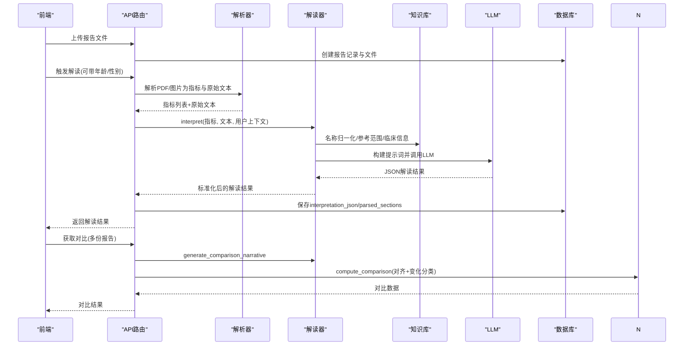
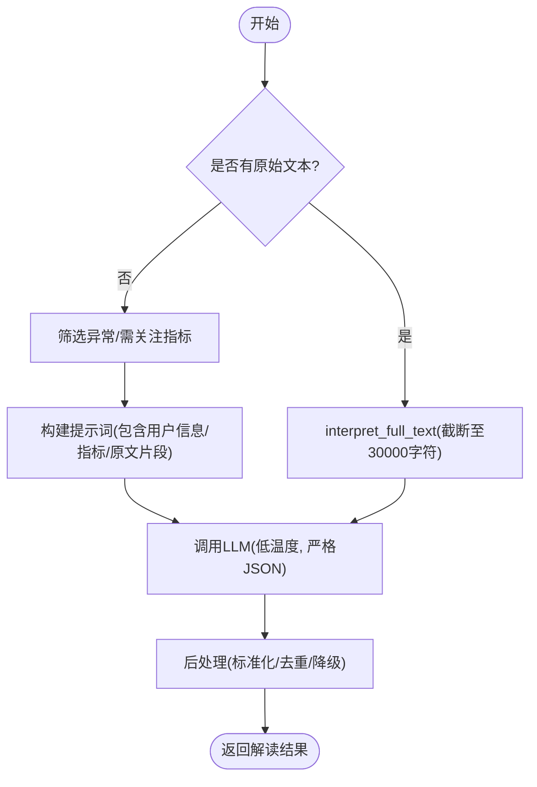
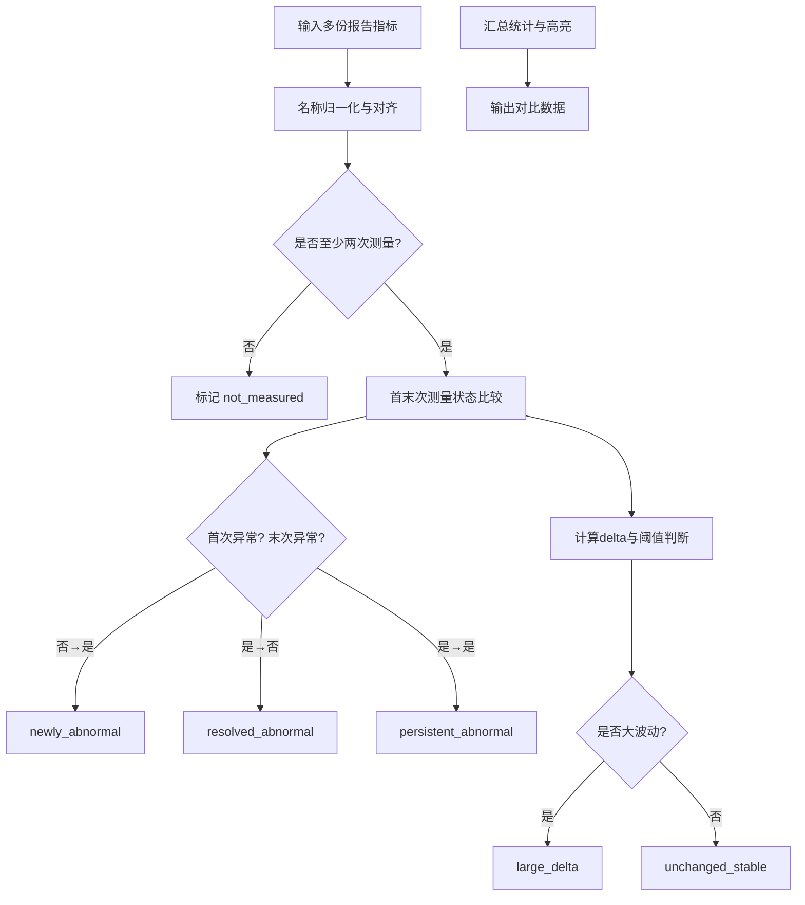
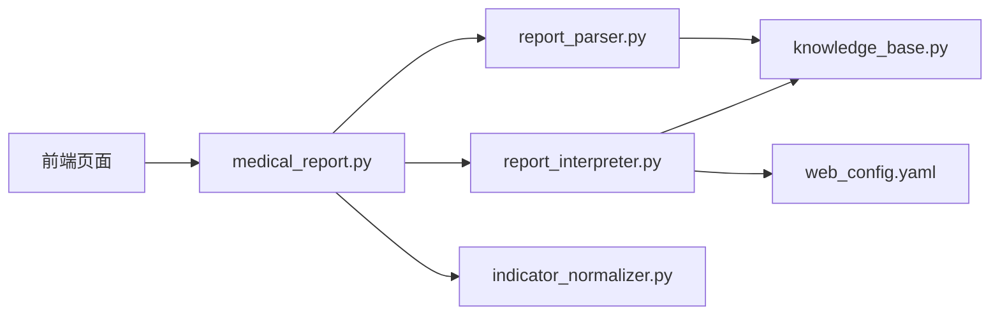

# 报告解读服务

<cite>
**本文引用的文件**
- [web/backend/api/medical_report.py](file://web/backend/api/medical_report.py)
- [web/backend/services/medical/report_interpreter.py](file://web/backend/services/medical/report_interpreter.py)
- [web/backend/services/medical/report_parser.py](file://web/backend/services/medical/report_parser.py)
- [web/backend/services/medical/indicator_normalizer.py](file://web/backend/services/medical/indicator_normalizer.py)
- [web/backend/services/medical/knowledge_base.py](file://web/backend/services/medical/knowledge_base.py)
- [data/medical_knowledge/reference_ranges.json](file://data/medical_knowledge/reference_ranges.json)
- [configs/web_config.yaml](file://configs/web_config.yaml)
- [web/app/src/api/medical-report.ts](file://web/app/src/api/medical-report.ts)
- [web/app/src/views/ReportDetailPage.vue](file://web/app/src/views/ReportDetailPage.vue)
- [web/app/src/views/ReportComparePage.vue](file://web/app/src/views/ReportComparePage.vue)
</cite>

## 目录
1. [简介](#简介)
2. [项目结构](#项目结构)
3. [核心组件](#核心组件)
4. [架构总览](#架构总览)
5. [详细组件分析](#详细组件分析)
6. [依赖关系分析](#依赖关系分析)
7. [性能考量](#性能考量)
8. [故障排查指南](#故障排查指南)
9. [结论](#结论)
10. [附录](#附录)

## 简介
本技术文档面向“体检报告解读服务”，系统性说明其AI驱动的医学报告分析、健康风险评估、个性化建议生成与趋势对比能力。重点覆盖：
- LLM集成方案与提示词工程（文本与视觉双通道）
- 医学知识图谱关联与临床指南匹配（参考范围与疾病相关性）
- 异常指标检测、风险等级分类、健康建议生成与多维度数据分析
- 解读结果格式化、可视化数据准备与多份报告对比算法

该服务支持PDF与图片上传，通过OCR或视觉模型提取文本，结合结构化解析与LLM深度解读，输出标准化JSON结果，并支持前后端渲染与对比展示。

## 项目结构
围绕报告解读的核心代码分布在后端API、医学服务层、知识库与前端接口/页面中：
- API层：接收上传、触发解读、返回解读结果与对比结果
- 解析层：PDF/图片文本提取、指标识别与归一化
- 解读层：构建提示词、调用LLM、后处理与降级策略
- 知识层：参考范围、别名映射、临床信息
- 前端：上传、轮询进度、结果展示、对比视图

```mermaid
graph TB
FE["前端页面<br/>ReportDetailPage / ReportComparePage"] --> API["FastAPI 路由<br/>medical_report.py"]
API --> Parser["报告解析器<br/>report_parser.py"]
API --> Interpreter["报告解读器<br/>report_interpreter.py"]
API --> Normalizer["指标对齐与对比<br/>indicator_normalizer.py"]
Parser --> KB["医学知识库<br/>knowledge_base.py + reference_ranges.json"]
Interpreter --> KB
Interpreter --> LLM["LLM 配置与调用<br/>web_config.yaml"]
API --> DB["数据库存储<br/>MedicalReport / Files"]
FE <- --> API
```

**图表来源**
- [web/backend/api/medical_report.py:214-503](file://web/backend/api/medical_report.py#L214-L503)
- [web/backend/services/medical/report_parser.py:164-306](file://web/backend/services/medical/report_parser.py#L164-L306)
- [web/backend/services/medical/report_interpreter.py:18-115](file://web/backend/services/medical/report_interpreter.py#L18-L115)
- [web/backend/services/medical/indicator_normalizer.py:313-460](file://web/backend/services/medical/indicator_normalizer.py#L313-L460)
- [web/backend/services/medical/knowledge_base.py:15-71](file://web/backend/services/medical/knowledge_base.py#L15-L71)
- [configs/web_config.yaml:80-134](file://configs/web_config.yaml#L80-L134)

**章节来源**
- [web/backend/api/medical_report.py:214-503](file://web/backend/api/medical_report.py#L214-L503)
- [configs/web_config.yaml:80-134](file://configs/web_config.yaml#L80-L134)

## 核心组件
- 报告解析器（ReportParser）：从PDF/图片中提取文本，识别检查项与指标，标注单位、参考范围与状态
- 报告解读器（ReportInterpreter）：构建提示词，调用LLM进行结构化解读，输出风险等级、摘要、异常项与建议；支持视觉模型直读报告图
- 指标对齐与对比（IndicatorNormalizer）：将不同报告的指标按标准名对齐，计算变化类型（新异常、已恢复、持续异常、大幅波动等），生成对比数据
- 医学知识库（KnowledgeBase）：加载reference_ranges.json，提供名称归一化、参考范围查询、临床信息与白癜风相关性标注
- API路由（medical_report.py）：封装上传、解读、对比、分页查看等接口，协调各服务并持久化结果
- 前端API与页面：提供上传、触发解读、轮询进度、结果展示与对比视图

**章节来源**
- [web/backend/services/medical/report_parser.py:164-306](file://web/backend/services/medical/report_parser.py#L164-L306)
- [web/backend/services/medical/report_interpreter.py:18-115](file://web/backend/services/medical/report_interpreter.py#L18-L115)
- [web/backend/services/medical/indicator_normalizer.py:313-460](file://web/backend/services/medical/indicator_normalizer.py#L313-L460)
- [web/backend/services/medical/knowledge_base.py:15-71](file://web/backend/services/medical/knowledge_base.py#L15-L71)
- [web/backend/api/medical_report.py:214-503](file://web/backend/api/medical_report.py#L214-L503)
- [web/app/src/api/medical-report.ts:167-218](file://web/app/src/api/medical-report.ts#L167-L218)

## 架构总览
系统采用分层架构：
- 接入层：FastAPI路由负责鉴权、参数校验、文件存取与响应组装
- 业务层：解析、解读、对比、知识库检索
- 外部服务：LLM（文本/视觉）、OCR（可选）
- 数据层：数据库存储报告元数据、解读结果、附件与页级图片



**图表来源**
- [web/backend/api/medical_report.py:426-503](file://web/backend/api/medical_report.py#L426-L503)
- [web/backend/services/medical/report_interpreter.py:18-115](file://web/backend/services/medical/report_interpreter.py#L18-L115)
- [web/backend/services/medical/report_parser.py:209-306](file://web/backend/services/medical/report_parser.py#L209-L306)
- [web/backend/services/medical/indicator_normalizer.py:406-460](file://web/backend/services/medical/indicator_normalizer.py#L406-L460)

## 详细组件分析

### 报告解析器（ReportParser）
职责：
- 检测章节头（血常规、肝功能等），划分段落
- 单行/多行指标解析，提取名称、数值、单位、参考范围
- 使用正则与知识库映射，归一化指标名与单位族
- 判定指标状态（正常/偏高/偏低/未知）

复杂度与优化：
- 文本预处理与正则匹配时间复杂度近似O(n)，n为行数
- 多指标行解析通过token切分与模式匹配，避免全量扫描
- 支持PDF文本与表格提取、图片OCR（PaddleOCR）

**章节来源**
- [web/backend/services/medical/report_parser.py:164-306](file://web/backend/services/medical/report_parser.py#L164-L306)
- [web/backend/services/medical/report_parser.py:308-433](file://web/backend/services/medical/report_parser.py#L308-L433)
- [web/backend/services/medical/report_parser.py:435-583](file://web/backend/services/medical/report_parser.py#L435-L583)

### 报告解读器（ReportInterpreter）
职责：
- 根据指标与原始文本构建提示词，调用LLM输出结构化JSON
- 支持完整文本解读（长上下文），按检查项目分类输出红黄绿风险
- 视觉模式：直接对报告图片进行OCR+解读（两阶段：全页OCR→全文结构化分析）
- 后处理：标准化字段、去重、降级策略（当LLM不可用时回退基础分析）

提示词工程要点：
- 明确输出JSON结构与字段约束
- 强调风险等级判定规则（red/yellow/green）
- 要求列出所有指标（含正常），并提供异常指标的通俗解释、可能原因与建议
- 附加免责声明



**图表来源**
- [web/backend/services/medical/report_interpreter.py:18-60](file://web/backend/services/medical/report_interpreter.py#L18-L60)
- [web/backend/services/medical/report_interpreter.py:214-374](file://web/backend/services/medical/report_interpreter.py#L214-L374)
- [web/backend/services/medical/report_interpreter.py:414-527](file://web/backend/services/medical/report_interpreter.py#L414-L527)

**章节来源**
- [web/backend/services/medical/report_interpreter.py:18-115](file://web/backend/services/medical/report_interpreter.py#L18-L115)
- [web/backend/services/medical/report_interpreter.py:214-374](file://web/backend/services/medical/report_interpreter.py#L214-L374)
- [web/backend/services/medical/report_interpreter.py:414-527](file://web/backend/services/medical/report_interpreter.py#L414-L527)

### 指标对齐与对比（IndicatorNormalizer）
职责：
- 将多份报告的指标按标准名对齐，补齐缺失值占位
- 计算变化类型：newly_abnormal、resolved_abnormal、persistent_abnormal、large_delta、unchanged_stable、not_measured
- 生成对比摘要与高亮项，供LLM生成自然语言总结

算法要点：
- 名称归一化：精确匹配与规范化匹配（去除空格、大小写、符号）
- 大波动判定：相对基线变化≥20%或超过参考范围宽度的一半
- 排序与分组：按面板（panel）与显示名排序，便于前端展示



**图表来源**
- [web/backend/services/medical/indicator_normalizer.py:313-460](file://web/backend/services/medical/indicator_normalizer.py#L313-L460)

**章节来源**
- [web/backend/services/medical/indicator_normalizer.py:313-460](file://web/backend/services/medical/indicator_normalizer.py#L313-L460)

### 医学知识库（KnowledgeBase）
职责：
- 加载reference_ranges.json，建立名称到指标的映射
- 提供名称归一化、参考范围查询、临床信息与白癜风相关性
- 支撑解析器与解读器的指标判定与解释生成

数据结构示例（节选）：
- 名称、中文名称、别名、单位、参考范围、类别、临床高低意义、白癜风相关性

**章节来源**
- [web/backend/services/medical/knowledge_base.py:15-71](file://web/backend/services/medical/knowledge_base.py#L15-L71)
- [data/medical_knowledge/reference_ranges.json:1-51](file://data/medical_knowledge/reference_ranges.json#L1-L51)

### API路由（medical_report.py）
职责：
- 上传报告与文件，自动转换PDF为页级PNG用于浏览器查看
- 触发解读：优先基于解析的指标与文本；若无法解析则走视觉两阶段流程
- 对比接口：抽取指标、计算对比、生成LLM叙事总结
- 持久化：保存interpretation_json、parsed_sections、extracted_patient_info

关键流程：
- 上传→保存→可选PDF转页→返回报告ID
- 解读→解析→LLM→后处理→保存→返回结果
- 对比→对齐→变化分类→LLM叙事→返回对比数据

**章节来源**
- [web/backend/api/medical_report.py:214-276](file://web/backend/api/medical_report.py#L214-L276)
- [web/backend/api/medical_report.py:278-327](file://web/backend/api/medical_report.py#L278-L327)
- [web/backend/api/medical_report.py:426-503](file://web/backend/api/medical_report.py#L426-L503)
- [web/backend/api/medical_report.py:506-574](file://web/backend/api/medical_report.py#L506-L574)

### 前端API与页面
- medical-report.ts：定义接口类型（InterpretationResult、ComparisonResult等），封装CRUD与对比请求
- ReportDetailPage.vue：上传后触发解读，轮询进度，展示分段结果与交通灯风险
- ReportComparePage.vue：选择多份报告，展示指标趋势、变化类型与综合评估

**章节来源**
- [web/app/src/api/medical-report.ts:47-165](file://web/app/src/api/medical-report.ts#L47-L165)
- [web/app/src/api/medical-report.ts:167-218](file://web/app/src/api/medical-report.ts#L167-L218)
- [web/app/src/views/ReportDetailPage.vue:31-198](file://web/app/src/views/ReportDetailPage.vue#L31-L198)
- [web/app/src/views/ReportComparePage.vue:1-217](file://web/app/src/views/ReportComparePage.vue#L1-L217)
- [web/app/src/views/ReportComparePage.vue:328-361](file://web/app/src/views/ReportComparePage.vue#L328-L361)

## 依赖关系分析
- API路由依赖解析器、解读器、指标对齐模块与知识库
- 解读器依赖知识库进行名称归一化与参考范围查询，依赖LLM配置进行模型调用
- 解析器依赖知识库进行指标映射与参考范围获取
- 前端依赖API接口与类型定义，渲染解读结果与对比数据



**图表来源**
- [web/backend/api/medical_report.py:214-503](file://web/backend/api/medical_report.py#L214-L503)
- [web/backend/services/medical/report_parser.py:164-306](file://web/backend/services/medical/report_parser.py#L164-L306)
- [web/backend/services/medical/report_interpreter.py:18-115](file://web/backend/services/medical/report_interpreter.py#L18-L115)
- [web/backend/services/medical/indicator_normalizer.py:313-460](file://web/backend/services/medical/indicator_normalizer.py#L313-L460)
- [web/backend/services/medical/knowledge_base.py:15-71](file://web/backend/services/medical/knowledge_base.py#L15-L71)
- [configs/web_config.yaml:80-134](file://configs/web_config.yaml#L80-L134)

**章节来源**
- [web/backend/api/medical_report.py:214-503](file://web/backend/api/medical_report.py#L214-L503)
- [configs/web_config.yaml:80-134](file://configs/web_config.yaml#L80-L134)

## 性能考量
- OCR与视觉模型调用：分批处理（每批最多8页），避免上下文超限；PDF转页按需缓存
- LLM调用：低温度与严格JSON约束降低解析失败率；超长文本截断至30000字符
- 指标对齐：按面板与显示名排序，减少前端渲染压力；缺失值占位避免空指针
- 降级策略：LLM不可用或解析失败时，回退为基础参考分析，保证可用性

[本节为通用指导，不直接分析具体文件]

## 故障排查指南
常见问题与定位：
- 无法提取有效数据：检查文件清晰度与格式，确认PDF/图片可读；查看日志中的OCR失败与视觉模型错误
- LLM不可用：检查web_config.yaml中的provider与api_key/base_url；若为none则进入降级流程
- 对比失败：确保所选报告均已解读且包含可对比指标；检查指标对齐是否成功
- 前端轮询无结果：确认后端已保存interpretation_json；检查getInterpretation接口返回interpreted字段

相关实现位置：
- 视觉两阶段流程与错误日志：_interpret_with_vision、_ocr_batch
- LLM调用与JSON恢复：_call_llm_with_metadata、_recover_truncated_json
- 对比前置校验：compare_reports中对解读与指标的检查

**章节来源**
- [web/backend/api/medical_report.py:506-574](file://web/backend/api/medical_report.py#L506-L574)
- [web/backend/api/medical_report.py:278-327](file://web/backend/api/medical_report.py#L278-L327)
- [web/backend/services/medical/report_interpreter.py:414-527](file://web/backend/services/medical/report_interpreter.py#L414-L527)

## 结论
该报告解读服务通过“解析—解读—对比”的分层架构，结合LLM与医学知识库，实现了从原始报告到结构化解读与趋势分析的完整闭环。其优势在于：
- 灵活的多模态输入（文本与图像）
- 严格的JSON输出与后处理保障稳定性
- 标准化的指标对齐与变化分类，支持长期跟踪
- 可扩展的知识库与提示词工程，适配不同科室与疾病场景

未来可进一步优化：
- 引入RAG增强医学知识检索，提升解释准确性
- 扩展更多指标与参考范围，覆盖更全面的体检项目
- 优化前端可视化，提供更直观的指标趋势与健康建议

[本节为总结性内容，不直接分析具体文件]

## 附录
- LLM配置与提示词模板：参见web_config.yaml中的llm与prompts部分
- 医学参考范围：参见data/medical_knowledge/reference_ranges.json
- 前端类型定义：参见web/app/src/api/medical-report.ts中的InterpretationResult与ComparisonResult

**章节来源**
- [configs/web_config.yaml:80-134](file://configs/web_config.yaml#L80-L134)
- [data/medical_knowledge/reference_ranges.json:1-51](file://data/medical_knowledge/reference_ranges.json#L1-L51)
- [web/app/src/api/medical-report.ts:47-165](file://web/app/src/api/medical-report.ts#L47-L165)