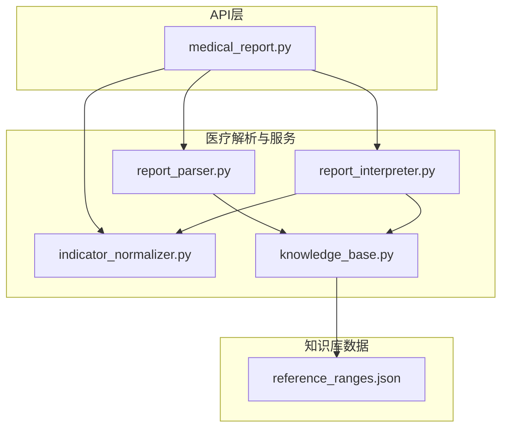
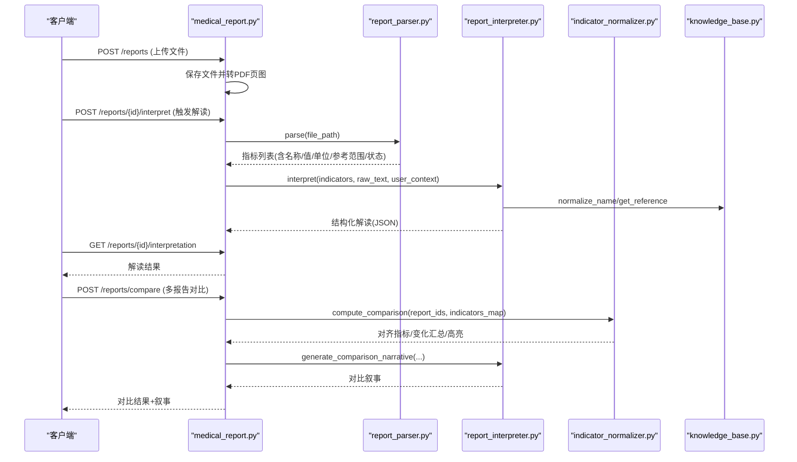
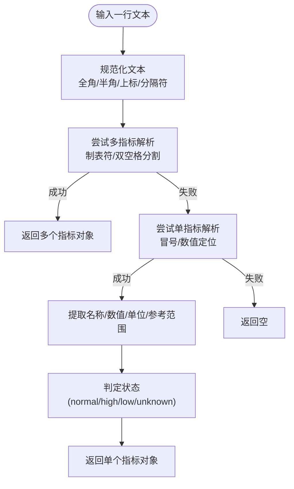
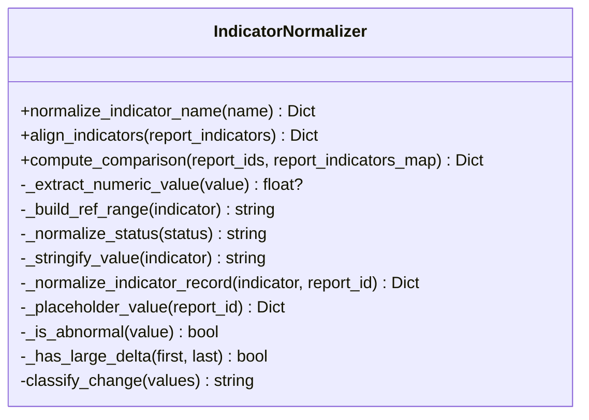
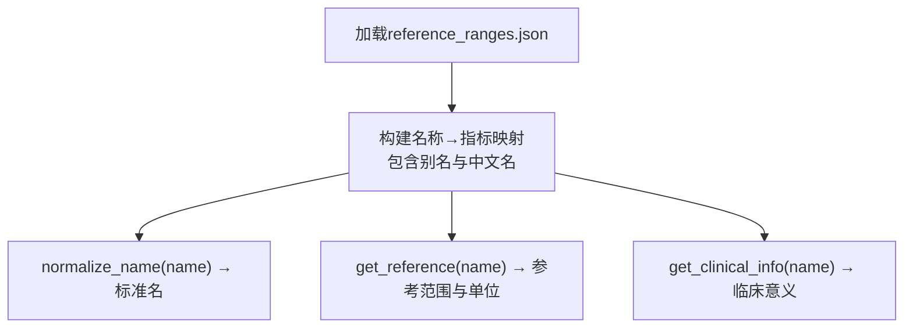
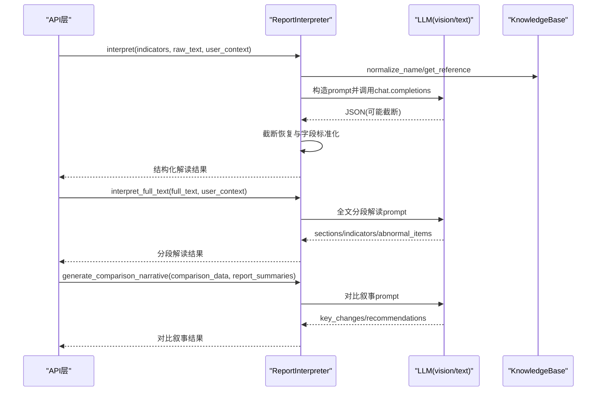
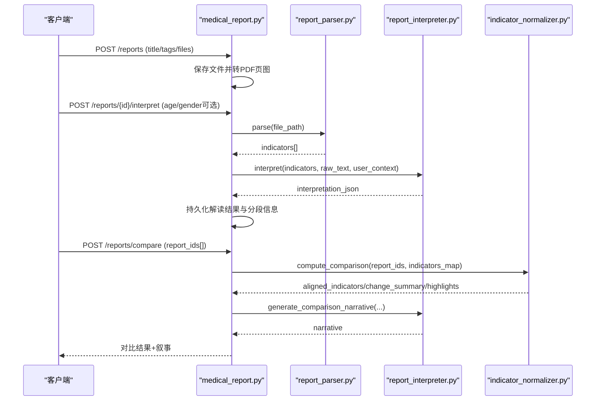
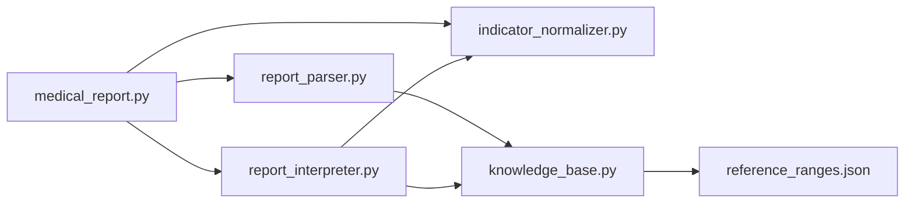

# 指标标准化服务

<cite>
**本文引用的文件**   
- [indicator_normalizer.py](file://web/backend/services/medical/indicator_normalizer.py)
- [report_parser.py](file://web/backend/services/medical/report_parser.py)
- [report_interpreter.py](file://web/backend/services/medical/report_interpreter.py)
- [knowledge_base.py](file://web/backend/services/medical/knowledge_base.py)
- [reference_ranges.json](file://data/medical_knowledge/reference_ranges.json)
- [medical_report.py](file://web/backend/api/medical_report.py)
</cite>

## 目录
1. [简介](#简介)
2. [项目结构](#项目结构)
3. [核心组件](#核心组件)
4. [架构总览](#架构总览)
5. [详细组件分析](#详细组件分析)
6. [依赖关系分析](#依赖关系分析)
7. [性能考虑](#性能考虑)
8. [故障排查指南](#故障排查指南)
9. [结论](#结论)
10. [附录](#附录)

## 简介
本技术文档面向“指标标准化服务”，围绕医学检验报告的结构化解析、指标名称标准化、单位换算与参考范围匹配、异常值检测、多报告对比与趋势计算、以及可视化数据生成等能力进行系统化说明。服务覆盖不同医院报告格式适配、指标名称归一化、单位换算规则与临床意义映射，并提供标准化配置管理、自定义规则扩展与批量处理流程。

## 项目结构
指标标准化服务由以下关键模块组成：
- 报告解析器（ReportParser）：支持PDF、图片OCR与文本行解析，按检查项目分节识别指标。
- 指标标准化器（IndicatorNormalizer）：指标名称对齐、数值提取、状态判定、多报告对齐与对比统计。
- 知识基座（MedicalKnowledgeBase）：加载参考范围与临床意义，提供名称归一化与参考查询。
- 报告解读器（ReportInterpreter）：结合LLM进行结构化解读、分段总结、对比叙事生成与视觉OCR两阶段处理。
- API层（medical_report.py）：对外暴露上传、解读、对比、分页预览等接口，串联上述服务。

**图表来源** 
- [medical_report.py](file://web/backend/api/medical_report.py)
- [report_parser.py](file://web/backend/services/medical/report_parser.py)
- [indicator_normalizer.py](file://web/backend/services/medical/indicator_normalizer.py)
- [report_interpreter.py](file://web/backend/services/medical/report_interpreter.py)
- [knowledge_base.py](file://web/backend/services/medical/knowledge_base.py)
- [reference_ranges.json](file://data/medical_knowledge/reference_ranges.json)

**章节来源**
- [medical_report.py](file://web/backend/api/medical_report.py)
- [report_parser.py](file://web/backend/services/medical/report_parser.py)
- [indicator_normalizer.py](file://web/backend/services/medical/indicator_normalizer.py)
- [report_interpreter.py](file://web/backend/services/medical/report_interpreter.py)
- [knowledge_base.py](file://web/backend/services/medical/knowledge_base.py)
- [reference_ranges.json](file://data/medical_knowledge/reference_ranges.json)

## 核心组件
- 报告解析器（ReportParser）
  - 功能：检测检查项目分节、单行/多行指标解析、数值与单位提取、参考范围推断、状态判定。
  - 关键点：支持PDF文本与表格抽取、图片OCR（PaddleOCR）、中文全角/半角与上标规范化、多种分隔符与表头识别。
- 指标标准化器（IndicatorNormalizer）
  - 功能：指标名称别名映射、数值字符串提取、参考范围字符串构建、状态标准化、多报告指标对齐、变化分类与汇总。
  - 关键点：内置大量指标别名与面板分类；通过相对阈值与参考区间宽度判断“大变化”；输出统一schema用于对比与可视化。
- 知识基座（MedicalKnowledgeBase）
  - 功能：加载reference_ranges.json，维护名称到指标的映射，提供参考范围与临床意义查询。
  - 关键点：惰性加载、大小写与别名归一化、返回包含vitiligo_relevance的临床信息。
- 报告解读器（ReportInterpreter）
  - 功能：基于LLM的指标解读、分段总结、对比叙事生成、视觉OCR两阶段处理（先OCR再结构化）。
  - 关键点：严格JSON输出与截断恢复、风险等级与状态标准化、用户上下文注入、对比数据压缩与标准化。
- API层（medical_report.py）
  - 功能：报告上传、自动PDF转页图、触发解读、获取解读结果、多报告对比、患者档案关联。
  - 关键点：串联解析器与解读器，持久化解读结果与分段信息，提供对比所需的指标集合与摘要。

**章节来源**
- [report_parser.py](file://web/backend/services/medical/report_parser.py)
- [indicator_normalizer.py](file://web/backend/services/medical/indicator_normalizer.py)
- [knowledge_base.py](file://web/backend/services/medical/knowledge_base.py)
- [report_interpreter.py](file://web/backend/services/medical/report_interpreter.py)
- [medical_report.py](file://web/backend/api/medical_report.py)

## 架构总览
整体流程从用户上传报告开始，经API路由进入解析与解读管线，最终产出标准化指标、异常项、建议与对比结果。

**图表来源** 
- [medical_report.py](file://web/backend/api/medical_report.py)
- [report_parser.py](file://web/backend/services/medical/report_parser.py)
- [report_interpreter.py](file://web/backend/services/medical/report_interpreter.py)
- [indicator_normalizer.py](file://web/backend/services/medical/indicator_normalizer.py)
- [knowledge_base.py](file://web/backend/services/medical/knowledge_base.py)

## 详细组件分析

### 报告解析器（ReportParser）
- 分节检测：根据标题别名匹配检查项目（血常规、肝功能、肾功能、血脂、血糖、甲状腺功能等），记录起止行与文本块。
- 指标解析：优先尝试多指标行（制表符/双空格分隔），回退到冒号分隔的单指标行；提取名称、数值、单位、参考范围。
- 数值与状态：去除箭头前缀、逗号，转换为浮点数；依据参考范围判定normal/high/low/unknown。
- 单位提取：正则匹配常见单位族（如×10^x/L、μmol/L、mmol/L、g/L、mg/L、U/L、pmol/L、nmol/L、mIU/L、%、fL、pg）。
- 名称归一化：调用知识基座将别名映射为标准名，必要时保留原始名与别名用于展示。

**图表来源** 
- [report_parser.py](file://web/backend/services/medical/report_parser.py)

**章节来源**
- [report_parser.py](file://web/backend/services/medical/report_parser.py)

### 指标标准化器（IndicatorNormalizer）
- 名称标准化：维护CANONICAL_INDICATORS字典，包含显示名、别名、单位族、面板分类；提供精确与模糊匹配（去空格/大小写/非字母数字）。
- 数值提取：支持整数/浮点/科学计数法，忽略非数字字符。
- 参考范围构建：支持显式ref_range或ref_min/ref_max组合，生成可读字符串。
- 状态标准化：仅接受normal/high/low/critical，其他归为unknown。
- 多报告对齐：按canonical_name或标准化后的名称对齐，缺失值用占位符填充，排序后输出统一结构。
- 变化分类：比较首末测量值，结合异常状态与相对变化阈值（≥20%或超过参考区间宽度的一半）判定newly_abnormal/resolved_abnormal/persistent_abnormal/large_delta/unchanged_stable/not_measured。
- 对比计算：汇总各变化类型计数，输出aligned_indicators与highlights，便于前端可视化。

**图表来源** 
- [indicator_normalizer.py](file://web/backend/services/medical/indicator_normalizer.py)

**章节来源**
- [indicator_normalizer.py](file://web/backend/services/medical/indicator_normalizer.py)

### 知识基座（MedicalKnowledgeBase）
- 数据源：加载data/medical_knowledge/reference_ranges.json，包含指标中文名、别名、单位、参考范围、临床意义与白癜风相关性。
- 名称归一化：将任意别名映射为标准name键，供解析器与解读器使用。
- 参考查询：返回ref_min/ref_max/unit及临床低/高解释，支持后续单位换算与异常判定。

**图表来源** 
- [knowledge_base.py](file://web/backend/services/medical/knowledge_base.py)
- [reference_ranges.json](file://data/medical_knowledge/reference_ranges.json)

**章节来源**
- [knowledge_base.py](file://web/backend/services/medical/knowledge_base.py)
- [reference_ranges.json](file://data/medical_knowledge/reference_ranges.json)

### 报告解读器（ReportInterpreter）
- 解读入口：根据指标与原始文本长度选择短文本解读或全文解读；若无异常且无指标则返回空结果。
- LLM调用：构造系统提示与用户上下文，强制JSON输出；具备截断JSON恢复策略。
- 分段解读：对完整报告文本按检查项目分类输出sections，每个section包含indicators与abnormal_items，标注风险等级与置信度。
- 对比叙事：基于compute_comparison结果生成key_changes与recommendations，聚焦newly_abnormal、resolved_abnormal、persistent_abnormal、large_delta。
- 视觉OCR：两阶段处理——先以vision模型逐页OCR提取文字，再以text LLM进行结构化分析与分段总结。

**图表来源** 
- [report_interpreter.py](file://web/backend/services/medical/report_interpreter.py)
- [knowledge_base.py](file://web/backend/services/medical/knowledge_base.py)

**章节来源**
- [report_interpreter.py](file://web/backend/services/medical/report_interpreter.py)

### API层（medical_report.py）
- 上传与存储：创建报告记录，保存文件并自动将PDF转为每页PNG以便浏览器查看。
- 解读触发：读取所有附件，调用report_parser.parse聚合指标，若无可解析内容则退回vision OCR两阶段流程。
- 解读结果：持久化interpretation_json与parsed_sections，支持提取patient_profile_id与extracted_patient_info。
- 对比接口：校验至少两份报告，提取已解读指标，调用compute_comparison生成对齐指标与变化汇总，再由interpreter生成对比叙事。
- 分页预览：提供files/{file_id}/pages接口返回PDF页图URL列表。

**图表来源** 
- [medical_report.py](file://web/backend/api/medical_report.py)
- [report_parser.py](file://web/backend/services/medical/report_parser.py)
- [report_interpreter.py](file://web/backend/services/medical/report_interpreter.py)
- [indicator_normalizer.py](file://web/backend/services/medical/indicator_normalizer.py)

**章节来源**
- [medical_report.py](file://web/backend/api/medical_report.py)

## 依赖关系分析
- 模块耦合
  - API层依赖解析器、解读器与标准化器，形成清晰的分层调用链。
  - 解析器依赖知识基座进行名称归一化与参考范围查询。
  - 解读器依赖知识基座与LLM配置，负责结构化输出与容错恢复。
  - 标准化器独立运行，提供统一的对比数据结构。
- 外部依赖
  - PDF处理：PyMuPDF（fitz）用于文本抽取与页面渲染。
  - OCR：PaddleOCR用于图片OCR。
  - LLM：OpenAI兼容接口（vision与text模型）。
- 潜在循环依赖
  - 当前模块间单向依赖，未发现循环导入。

**图表来源** 
- [medical_report.py](file://web/backend/api/medical_report.py)
- [report_parser.py](file://web/backend/services/medical/report_parser.py)
- [report_interpreter.py](file://web/backend/services/medical/report_interpreter.py)
- [indicator_normalizer.py](file://web/backend/services/medical/indicator_normalizer.py)
- [knowledge_base.py](file://web/backend/services/medical/knowledge_base.py)
- [reference_ranges.json](file://data/medical_knowledge/reference_ranges.json)

**章节来源**
- [medical_report.py](file://web/backend/api/medical_report.py)
- [report_parser.py](file://web/backend/services/medical/report_parser.py)
- [report_interpreter.py](file://web/backend/services/medical/report_interpreter.py)
- [indicator_normalizer.py](file://web/backend/services/medical/indicator_normalizer.py)
- [knowledge_base.py](file://web/backend/services/medical/knowledge_base.py)
- [reference_ranges.json](file://data/medical_knowledge/reference_ranges.json)

## 性能考虑
- 解析性能
  - PDF文本抽取与表格抽取采用try/except保护，失败时降级处理，避免阻塞主流程。
  - 图片OCR按需启用，默认优先文本路径；仅在无法解析时退回vision OCR。
- 对比计算
  - align_indicators时间复杂度O(N×M)，N为报告数，M为指标条目数；通过占位符快速补齐缺失值。
  - classify_change仅比较首末测量值，避免全序列扫描，降低开销。
- LLM调用
  - 短文本解读限制token上限，长文本分段解读减少单次请求负载。
  - JSON截断恢复策略减少重试次数，提升稳定性。
- 存储与IO
  - PDF转页图在上传时一次性完成，后续读取直接命中文件系统，避免重复转换。

[本节为通用指导，不直接分析具体文件]

## 故障排查指南
- 解析失败
  - 现象：parse返回空列表。
  - 排查：确认文件格式是否受支持（PDF/图片）；检查OCR环境是否可用；验证文本抽取是否成功。
  - 相关实现：PDF文本与表格抽取、图片OCR、行解析策略。
- 指标名称未匹配
  - 现象：canonical_name为空。
  - 排查：检查别名是否在CANONICAL_INDICATORS或reference_ranges.json中；确认名称规范化逻辑（大小写、空格、符号）。
- 参考范围缺失
  - 现象：ref_min/ref_max为空，状态为unknown。
  - 排查：确认knowledge_base是否正确加载reference_ranges.json；检查名称映射是否生效。
- LLM返回异常
  - 现象：JSON解析失败或返回非dict。
  - 排查：检查截断恢复逻辑；确认prompt格式与模型配置；查看日志中的错误堆栈。
- 对比结果不完整
  - 现象：aligned_indicators缺失或change_summary异常。
  - 排查：确认各报告均已解读且包含可对比指标；检查compute_comparison输入顺序与report_ids一致性。

**章节来源**
- [report_parser.py](file://web/backend/services/medical/report_parser.py)
- [knowledge_base.py](file://web/backend/services/medical/knowledge_base.py)
- [report_interpreter.py](file://web/backend/services/medical/report_interpreter.py)
- [indicator_normalizer.py](file://web/backend/services/medical/indicator_normalizer.py)
- [medical_report.py](file://web/backend/api/medical_report.py)

## 结论
指标标准化服务通过“解析—标准化—解读—对比”的流水线，实现了跨医院报告格式的指标对齐与临床意义映射。其核心优势包括：
- 强大的名称归一化与参考范围匹配能力；
- 稳健的多报告对齐与变化分类算法；
- 灵活的LLM集成与容错机制；
- 完善的API与数据持久化支持。
建议在后续迭代中补充单位换算引擎、更多指标别名库与可视化模板，以提升自动化程度与用户体验。

[本节为总结性内容，不直接分析具体文件]

## 附录
- 指标名称标准化配置
  - CANONICAL_INDICATORS：定义显示名、别名、单位族与面板分类。
  - reference_ranges.json：提供中文名、别名、单位、参考范围与临床意义。
- 自定义规则扩展
  - 新增指标：在CANONICAL_INDICATORS中添加别名与单位族；在reference_ranges.json中补充参考范围与临床信息。
  - 新增分节：在SECTION_DEFINITIONS中添加标题别名与panel映射。
- 批量处理
  - 通过API循环调用create_report与interpret，或使用compare接口进行多报告对比；注意控制并发与限流。
- 可视化数据生成
  - 使用compute_comparison输出的aligned_indicators与change_summary，结合前端图表库绘制趋势线与异常高亮。

**章节来源**
- [indicator_normalizer.py](file://web/backend/services/medical/indicator_normalizer.py)
- [reference_ranges.json](file://data/medical_knowledge/reference_ranges.json)
- [report_parser.py](file://web/backend/services/medical/report_parser.py)
- [medical_report.py](file://web/backend/api/medical_report.py)