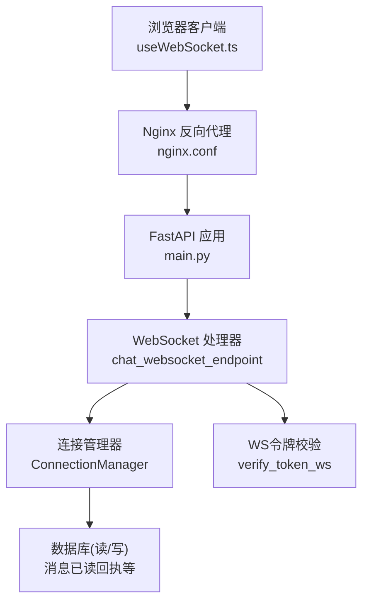
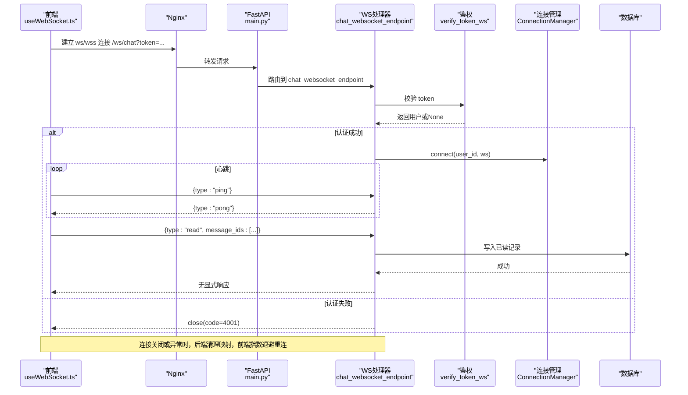
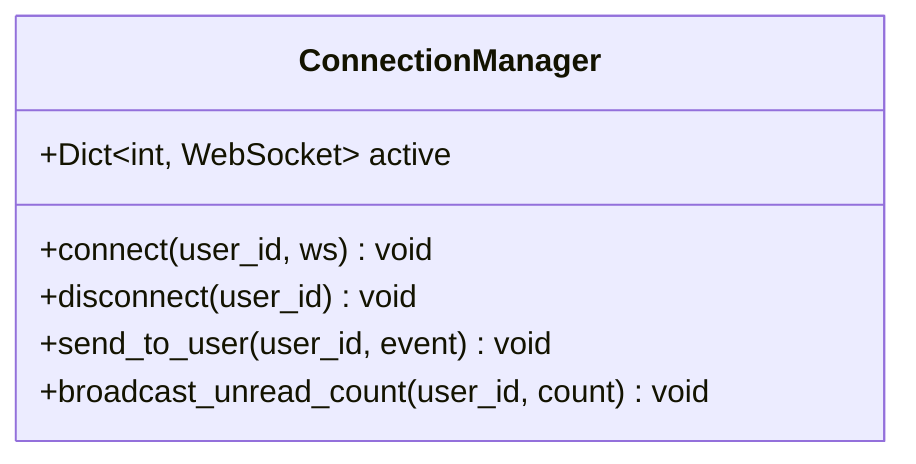
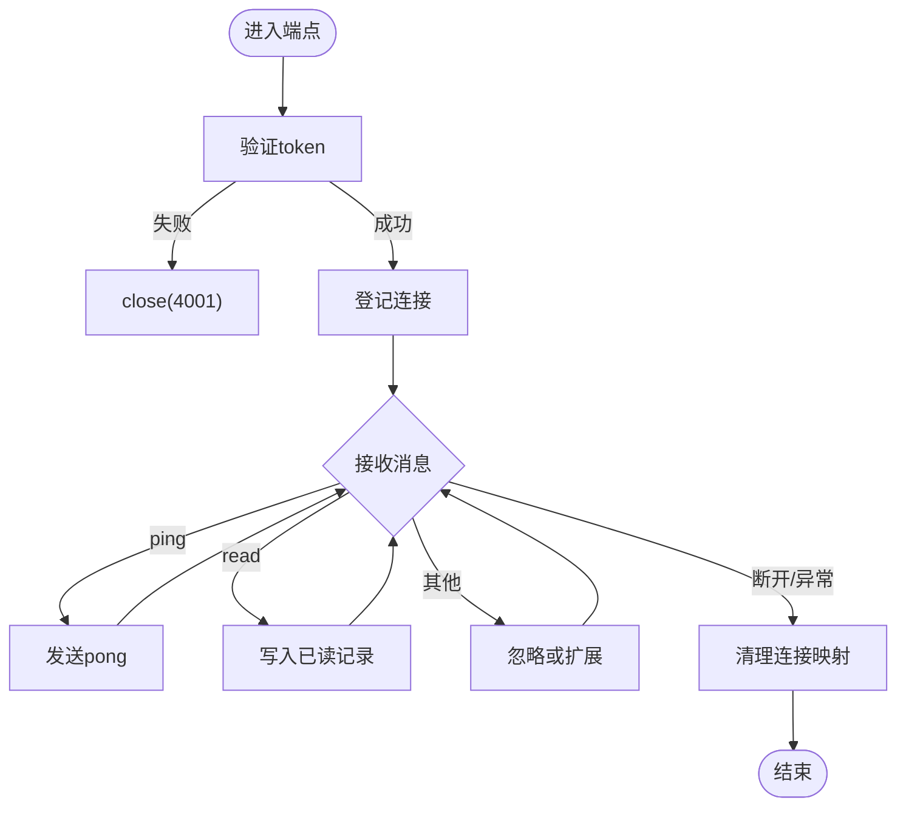
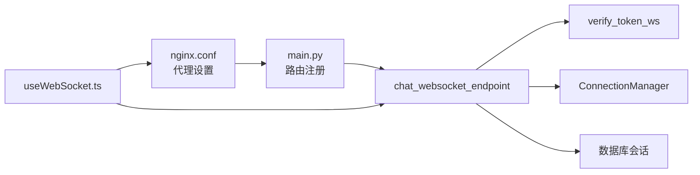

# WebSocket连接管理

<cite>
**本文引用的文件**
- [web/backend/ws/chat.py](file://web/backend/ws/chat.py)
- [web/backend/services/auth.py](file://web/backend/services/auth.py)
- [web/backend/app/main.py](file://web/backend/app/main.py)
- [web/app/src/composables/useWebSocket.ts](file://web/app/src/composables/useWebSocket.ts)
- [web/deploy/nginx.conf](file://web/deploy/nginx.conf)
</cite>

## 目录
1. [简介](#简介)
2. [项目结构](#项目结构)
3. [核心组件](#核心组件)
4. [架构总览](#架构总览)
5. [详细组件分析](#详细组件分析)
6. [依赖关系分析](#依赖关系分析)
7. [性能与内存优化](#性能与内存优化)
8. [故障排查指南](#故障排查指南)
9. [结论](#结论)
10. [附录：最佳实践与调优建议](#附录最佳实践与调优建议)

## 简介
本技术文档聚焦于后端WebSocket连接管理，围绕ConnectionManager类实现原理展开，覆盖连接建立、维护、断开的完整生命周期；详细说明用户会话映射机制、连接状态监控、心跳检测（ping/pong）与异常处理；并给出连接池管理、内存优化、并发安全与高可用设计建议，以及故障恢复策略和性能调优方案。

## 项目结构
本项目在后端通过FastAPI暴露一个WebSocket端点，前端使用Vue组合式函数封装连接、心跳与重连逻辑。关键路径如下：
- 后端WebSocket端点与连接管理器：web/backend/ws/chat.py
- 认证校验（WS专用）：web/backend/services/auth.py
- FastAPI应用注册WS路由：web/backend/app/main.py
- 前端WebSocket封装（含心跳与重连）：web/app/src/composables/useWebSocket.ts
- Nginx代理配置（对WS流式响应相关参数）：web/deploy/nginx.conf

图表来源
- [web/backend/app/main.py:340-342](file://web/backend/app/main.py#L340-L342)
- [web/backend/ws/chat.py:14-42](file://web/backend/ws/chat.py#L14-L42)
- [web/backend/services/auth.py:257-282](file://web/backend/services/auth.py#L257-L282)
- [web/app/src/composables/useWebSocket.ts:11-30](file://web/app/src/composables/useWebSocket.ts#L11-L30)
- [web/deploy/nginx.conf:37-47](file://web/deploy/nginx.conf#L37-L47)

章节来源
- [web/backend/app/main.py:340-342](file://web/backend/app/main.py#L340-L342)
- [web/backend/ws/chat.py:14-42](file://web/backend/ws/chat.py#L14-L42)
- [web/backend/services/auth.py:257-282](file://web/backend/services/auth.py#L257-L282)
- [web/app/src/composables/useWebSocket.ts:11-30](file://web/app/src/composables/useWebSocket.ts#L11-L30)
- [web/deploy/nginx.conf:37-47](file://web/deploy/nginx.conf#L37-L47)

## 核心组件
- ConnectionManager：维护用户到WebSocket连接的映射，提供连接、断开、单发消息、广播未读数等方法。
- chat_websocket_endpoint：处理WebSocket握手、鉴权、消息循环、心跳响应、读取回执写入、异常清理。
- verify_token_ws：从查询参数token中解析JWT，校验类型与有效性，并返回用户对象。
- useWebSocket（前端）：负责建立连接、定时发送ping、接收消息、错误与关闭时的指数退避重连。

章节来源
- [web/backend/ws/chat.py:14-42](file://web/backend/ws/chat.py#L14-L42)
- [web/backend/ws/chat.py:45-111](file://web/backend/ws/chat.py#L45-L111)
- [web/backend/services/auth.py:257-282](file://web/backend/services/auth.py#L257-L282)
- [web/app/src/composables/useWebSocket.ts:11-75](file://web/app/src/composables/useWebSocket.ts#L11-L75)

## 架构总览
整体流程包括：
- 前端发起ws/wss连接，携带token查询参数。
- Nginx将请求转发至FastAPI，保持长连接。
- FastAPI调用WS处理器进行鉴权，成功后由ConnectionManager登记连接。
- 前端每30秒发送一次ping，后端收到后回发pong。
- 业务消息（如read回执）在连接内完成读写。
- 连接异常或关闭时，后端清理映射，前端触发重连。

图表来源
- [web/backend/app/main.py:340-342](file://web/backend/app/main.py#L340-L342)
- [web/backend/ws/chat.py:45-111](file://web/backend/ws/chat.py#L45-L111)
- [web/backend/services/auth.py:257-282](file://web/backend/services/auth.py#L257-L282)
- [web/app/src/composables/useWebSocket.ts:11-75](file://web/app/src/composables/useWebSocket.ts#L11-L75)

## 详细组件分析

### ConnectionManager类
- 作用：以用户ID为键维护活跃WebSocket连接字典，提供连接、断开、向用户发送事件、广播未读数等能力。
- 数据结构：active: Dict[int, WebSocket]，时间复杂度O(1)的插入、查找、删除。
- 并发安全：当前实现为进程内单例字典，未加锁。在多Worker或多进程部署下存在竞态风险，需引入线程锁或分布式连接表。
- 异常处理：send_to_user捕获异常后自动断开对应连接，避免僵尸连接。

图表来源
- [web/backend/ws/chat.py:14-42](file://web/backend/ws/chat.py#L14-L42)

章节来源
- [web/backend/ws/chat.py:14-42](file://web/backend/ws/chat.py#L14-L42)

### WebSocket端点与生命周期
- 建立连接：接受连接，鉴权通过后登记到ConnectionManager。
- 消息循环：阻塞等待文本消息，支持ping/pong与read回执。
- 心跳检测：服务端收到{type:"ping"}即回复{type:"pong"}；前端每30秒发送一次ping。
- 异常处理：捕获WebSocketDisconnect与通用异常，统一清理连接映射。
- 数据持久化：read回执涉及数据库写入，包含会话创建、提交与关闭。

图表来源
- [web/backend/ws/chat.py:45-111](file://web/backend/ws/chat.py#L45-L111)

章节来源
- [web/backend/ws/chat.py:45-111](file://web/backend/ws/chat.py#L45-L111)

### 认证机制（WS专用）
- verify_token_ws从token中解码JWT，要求类型为access，并校验用户状态（激活且未被封禁）。
- 兼容历史token：优先按username匹配，再尝试按id匹配。
- 失败场景：token无效、过期、非access类型、用户不存在或被封禁，均返回None，端点关闭连接。

章节来源
- [web/backend/services/auth.py:257-282](file://web/backend/services/auth.py#L257-L282)

### 前端连接管理（useWebSocket）
- 连接建立：根据协议选择ws/wss，拼接token参数。
- 心跳：onopen后启动定时器，每30秒发送ping；连接关闭时清除定时器。
- 消息分发：按data.type分派到具体处理器，同时支持通配符“*”监听。
- 重连策略：onclose时指数退避重连，最大重试次数限制，防止风暴。
- 资源释放：组件卸载时关闭连接。

章节来源
- [web/app/src/composables/useWebSocket.ts:11-75](file://web/app/src/composables/useWebSocket.ts#L11-L75)

## 依赖关系分析
- 路由注册：FastAPI在main.py中将/ws/chat路由指向chat_websocket_endpoint。
- 认证依赖：WS端点依赖verify_token_ws进行鉴权。
- 数据库依赖：read回执写入需要数据库会话，注意会话生命周期管理。
- 代理依赖：Nginx对/api路径设置了proxy_buffering off与超时，利于流式与长连接。

图表来源
- [web/backend/app/main.py:340-342](file://web/backend/app/main.py#L340-L342)
- [web/backend/ws/chat.py:45-111](file://web/backend/ws/chat.py#L45-L111)
- [web/backend/services/auth.py:257-282](file://web/backend/services/auth.py#L257-L282)
- [web/app/src/composables/useWebSocket.ts:11-75](file://web/app/src/composables/useWebSocket.ts#L11-L75)
- [web/deploy/nginx.conf:37-47](file://web/deploy/nginx.conf#L37-L47)

章节来源
- [web/backend/app/main.py:340-342](file://web/backend/app/main.py#L340-L342)
- [web/backend/ws/chat.py:45-111](file://web/backend/ws/chat.py#L45-L111)
- [web/backend/services/auth.py:257-282](file://web/backend/services/auth.py#L257-L282)
- [web/app/src/composables/useWebSocket.ts:11-75](file://web/app/src/composables/useWebSocket.ts#L11-L75)
- [web/deploy/nginx.conf:37-47](file://web/deploy/nginx.conf#L37-L47)

## 性能与内存优化
- 连接映射：使用字典存储活跃连接，O(1)访问；确保断开时及时清理，避免内存泄漏。
- 心跳频率：当前30秒间隔，可根据负载调整；过高会增加网络开销，过低可能误判离线。
- 数据库写入：read回执批量写入，减少事务次数；注意索引与查询条件优化。
- 并发安全：多Worker部署时需引入锁或外部存储（如Redis）维护连接映射，避免跨进程不一致。
- 代理配置：Nginx关闭buffering并设置合理超时，保障长连接稳定性。

[本节为通用指导，不直接分析具体文件]

## 故障排查指南
- 认证失败：检查token是否有效、类型是否为access、用户是否激活且未被封禁。
- 连接未建立：确认Nginx代理配置允许长连接，检查URL与token参数是否正确。
- 心跳无响应：确认前端定时器正常、后端收到ping并返回pong。
- read回执未生效：检查数据库会话是否正确提交，消息ID与对话成员权限校验是否通过。
- 异常断开：查看日志中的WS错误信息，确认异常分支是否执行了连接清理。

章节来源
- [web/backend/ws/chat.py:45-111](file://web/backend/ws/chat.py#L45-L111)
- [web/backend/services/auth.py:257-282](file://web/backend/services/auth.py#L257-L282)
- [web/deploy/nginx.conf:37-47](file://web/deploy/nginx.conf#L37-L47)

## 结论
该WebSocket连接管理实现了基础的连接生命周期、心跳检测与异常清理，具备可扩展性。当前实现简洁高效，但在多进程并发、连接池管理与监控方面仍有提升空间。建议引入锁或分布式连接表、完善监控指标、优化心跳与重连策略，以提升高可用性与可观测性。

[本节为总结性内容，不直接分析具体文件]

## 附录：最佳实践与调优建议
- 连接池管理
  - 使用进程内锁保护active字典，或在多Worker环境下使用Redis维护连接映射。
  - 定期扫描并清理失效连接（如长时间无心跳），释放资源。
- 内存优化
  - 避免在连接对象上附加大对象；必要时使用弱引用或外置缓存。
  - 控制消息大小与频率，避免内存抖动。
- 并发安全
  - 对连接增删改操作加锁；对数据库会话使用上下文管理器确保正确关闭。
- 高可用性
  - 前端指数退避重连，结合心跳检测快速感知断线。
  - 后端异常统一捕获并记录，便于定位问题。
- 性能调优
  - 调整心跳间隔与重连上限，平衡实时性与资源消耗。
  - 数据库层面对read回执查询添加合适索引，减少慢查询。
  - Nginx保持proxy_buffering off与合理超时，保障长连接稳定。

[本节为通用指导，不直接分析具体文件]