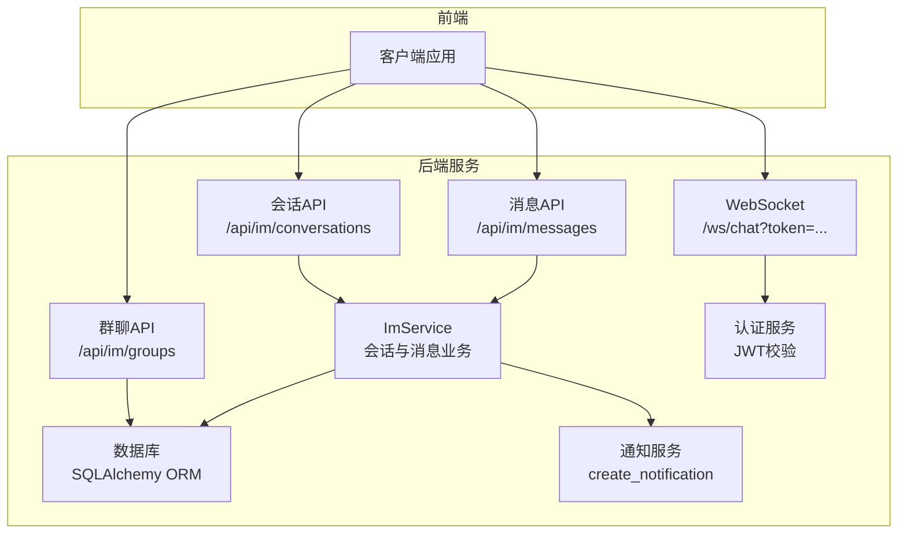
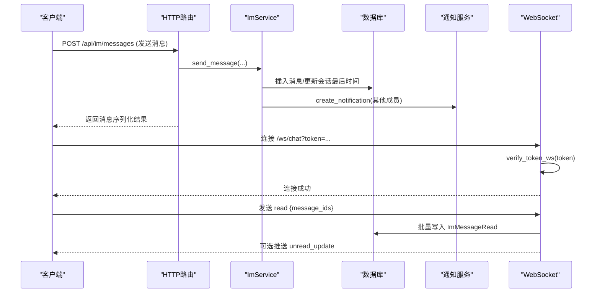
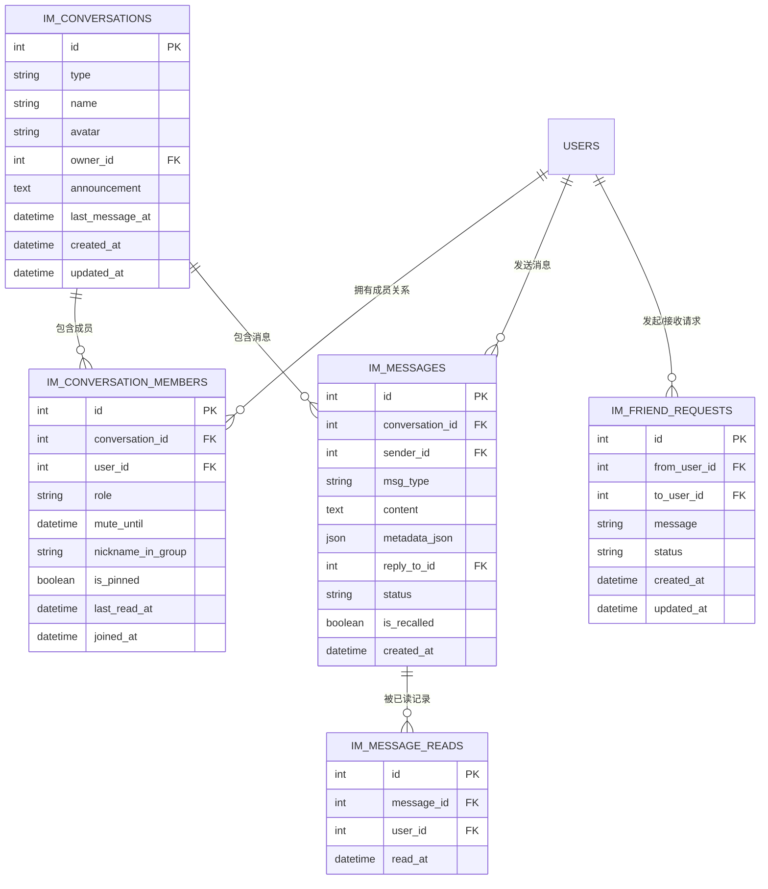
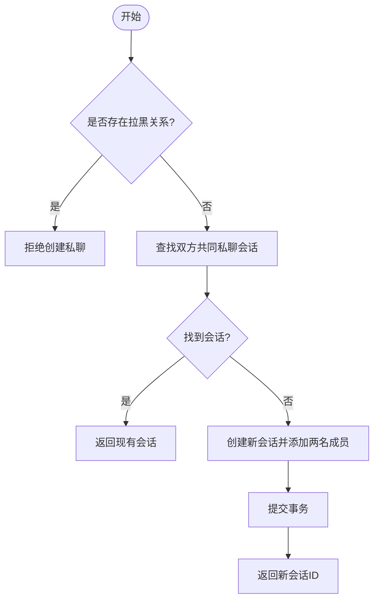
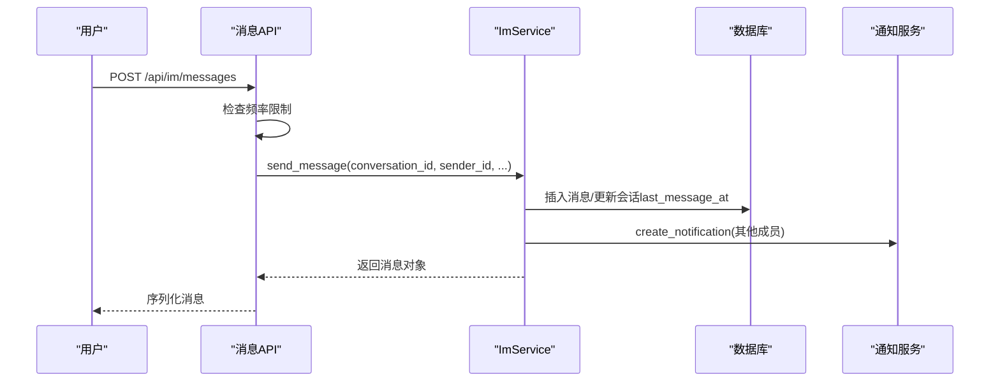
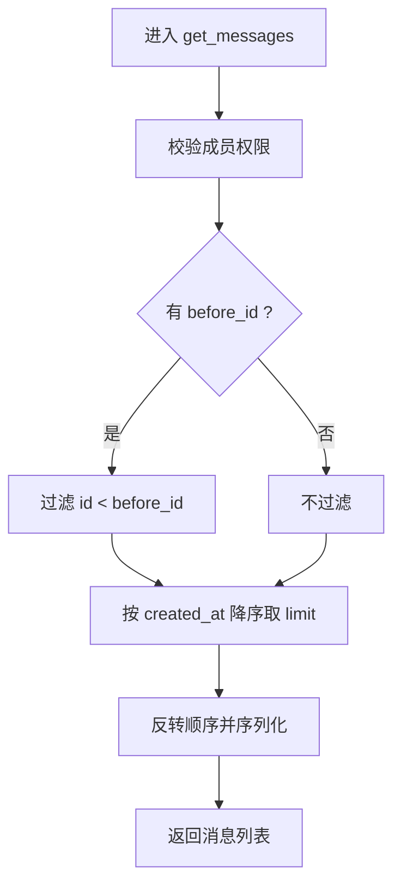
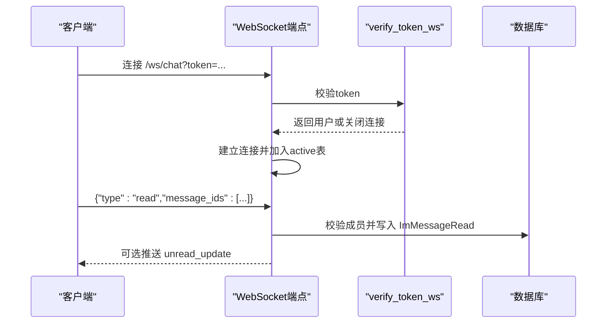
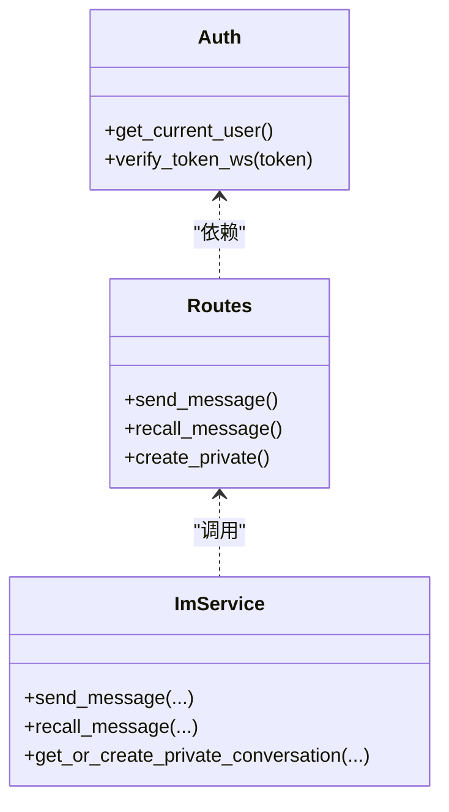
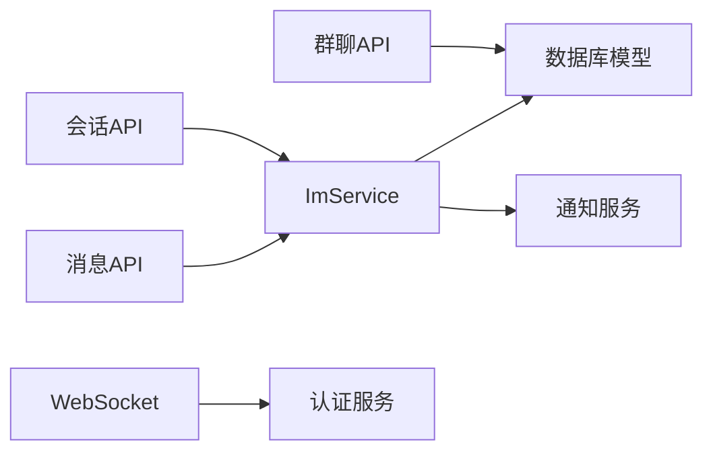

# 会话管理

<cite>
**本文引用的文件**   
- [im_conversations.py](file://web/backend/api/im_conversations.py)
- [im_messages.py](file://web/backend/api/im_messages.py)
- [im_groups.py](file://web/backend/api/im_groups.py)
- [chat.py](file://web/backend/ws/chat.py)
- [im_service.py](file://web/backend/services/im_service.py)
- [models.py](file://web/backend/database/models.py)
- [auth.py](file://web/backend/services/auth.py)
- [notifications.py](file://web/backend/api/notifications.py)
</cite>

## 目录
1. [引言](#引言)
2. [项目结构](#项目结构)
3. [核心组件](#核心组件)
4. [架构总览](#架构总览)
5. [详细组件分析](#详细组件分析)
6. [依赖关系分析](#依赖关系分析)
7. [性能考量](#性能考量)
8. [故障排查指南](#故障排查指南)
9. [结论](#结论)
10. [附录](#附录)

## 引言
本技术文档围绕会话管理系统，系统性阐述会话创建、成员管理、权限控制与安全验证机制；详细说明一对一聊天与群组聊天的数据结构设计、关系映射与业务逻辑；覆盖会话状态同步、历史消息加载、未读计数更新与搜索索引构建；并提供会话迁移、数据备份、性能优化与扩展性设计的实现方案。读者可据此快速理解并扩展 IM 能力。

## 项目结构
IM 相关功能主要分布在后端 FastAPI 路由、服务层、WebSocket 通道以及数据库模型中：
- API 路由：会话、消息、群聊、通讯录匹配等 HTTP 接口
- 服务层：会话与消息的核心业务逻辑（创建会话、发送消息、撤回、未读计算等）
- WebSocket：实时连接管理与已读回执处理
- 数据库模型：会话、成员、消息、已读记录、好友请求等实体定义
- 认证授权：JWT 访问令牌校验与 WebSocket 鉴权

图表来源
- [im_conversations.py:1-103](file://web/backend/api/im_conversations.py#L1-L103)
- [im_messages.py:1-78](file://web/backend/api/im_messages.py#L1-L78)
- [im_groups.py:1-183](file://web/backend/api/im_groups.py#L1-L183)
- [chat.py:1-111](file://web/backend/ws/chat.py#L1-L111)
- [im_service.py:1-419](file://web/backend/services/im_service.py#L1-L419)
- [models.py:956-1058](file://web/backend/database/models.py#L956-L1058)
- [auth.py:257-283](file://web/backend/services/auth.py#L257-L283)
- [notifications.py:84-110](file://web/backend/api/notifications.py#L84-L110)

章节来源
- [im_conversations.py:1-103](file://web/backend/api/im_conversations.py#L1-L103)
- [im_messages.py:1-78](file://web/backend/api/im_messages.py#L1-L78)
- [im_groups.py:1-183](file://web/backend/api/im_groups.py#L1-L183)
- [chat.py:1-111](file://web/backend/ws/chat.py#L1-L111)
- [im_service.py:1-419](file://web/backend/services/im_service.py#L1-L419)
- [models.py:956-1058](file://web/backend/database/models.py#L956-L1058)
- [auth.py:257-283](file://web/backend/services/auth.py#L257-L283)
- [notifications.py:84-110](file://web/backend/api/notifications.py#L84-L110)

## 核心组件
- 会话与消息服务（ImService）
  - 私聊会话的获取或创建、会话列表与未读计数计算
  - 消息发送、撤回、历史分页查询
  - 好友系统（请求、接受、好友列表）
- API 路由
  - 会话：列表、私聊创建、历史消息、标记已读、置顶切换
  - 消息：发送、撤回（含频率限制）
  - 群聊：创建、成员增删、群信息更新
- WebSocket 通道
  - 连接管理、心跳、已读回执写入、未读计数推送
- 认证与鉴权
  - JWT 访问令牌校验、WS 参数 token 校验、封禁用户拦截
- 通知服务
  - 消息到达时生成站内通知

章节来源
- [im_service.py:26-419](file://web/backend/services/im_service.py#L26-L419)
- [im_conversations.py:1-103](file://web/backend/api/im_conversations.py#L1-L103)
- [im_messages.py:1-78](file://web/backend/api/im_messages.py#L1-L78)
- [im_groups.py:1-183](file://web/backend/api/im_groups.py#L1-L183)
- [chat.py:1-111](file://web/backend/ws/chat.py#L1-L111)
- [auth.py:179-283](file://web/backend/services/auth.py#L179-L283)
- [notifications.py:84-110](file://web/backend/api/notifications.py#L84-L110)

## 架构总览
整体采用“HTTP + WebSocket”双通道：
- HTTP 负责会话管理、消息收发、群管理、通讯录匹配等
- WebSocket 负责实时已读回执与未读计数推送
- 服务层统一封装业务逻辑，避免在路由中直接操作数据库
- 认证服务贯穿所有接口，确保身份与权限一致

图表来源
- [im_messages.py:41-63](file://web/backend/api/im_messages.py#L41-L63)
- [im_service.py:215-286](file://web/backend/services/im_service.py#L215-L286)
- [notifications.py:84-110](file://web/backend/api/notifications.py#L84-L110)
- [chat.py:45-111](file://web/backend/ws/chat.py#L45-L111)
- [auth.py:257-283](file://web/backend/services/auth.py#L257-L283)

## 详细组件分析

### 数据模型与关系映射
会话、成员、消息与已读记录构成 IM 核心实体：
- ImConversation：会话（私聊/群聊），包含类型、名称、头像、群主、公告、最后消息时间
- ImConversationMember：会话成员，角色（owner/admin/member）、禁言截止时间、群昵称、是否置顶、最后阅读时间
- ImMessage：消息，类型、内容、元数据、回复引用、状态、撤回标记、时间戳
- ImMessageRead：已读记录，唯一约束（message_id, user_id）
- ImFriendRequest：好友请求，状态（pending/accepted/declined）

图表来源
- [models.py:956-1058](file://web/backend/database/models.py#L956-L1058)

章节来源
- [models.py:956-1058](file://web/backend/database/models.py#L956-L1058)

### 会话创建与成员管理
- 私聊会话创建
  - 若双方已有私聊会话则复用；否则新建会话并添加两名成员
  - 拉黑检查：任一方向存在拉黑则拒绝创建
- 群聊创建
  - 创建者自动成为 owner，邀请成员为 member
  - 支持后续增删成员与信息更新（仅 owner/admin 可操作）
- 成员权限
  - 通过角色字段控制：owner/admin 可管理群信息与成员；member 仅参与聊天

图表来源
- [im_service.py:32-88](file://web/backend/services/im_service.py#L32-L88)
- [im_groups.py:24-48](file://web/backend/api/im_groups.py#L24-L48)

章节来源
- [im_service.py:32-88](file://web/backend/services/im_service.py#L32-L88)
- [im_groups.py:24-48](file://web/backend/api/im_groups.py#L24-L48)

### 消息收发与撤回
- 发送消息
  - 校验成员身份与禁言状态
  - 持久化消息并更新会话最后消息时间
  - 为其他成员生成站内通知
- 撤回消息
  - 仅允许发送者在 2 分钟内撤回
  - 撤回后标记并替换内容为提示文本
- 频率限制
  - 基于内存的滑动窗口限流（每分钟上限）

图表来源
- [im_messages.py:41-63](file://web/backend/api/im_messages.py#L41-L63)
- [im_service.py:215-286](file://web/backend/services/im_service.py#L215-L286)
- [notifications.py:84-110](file://web/backend/api/notifications.py#L84-L110)

章节来源
- [im_messages.py:41-63](file://web/backend/api/im_messages.py#L41-L63)
- [im_service.py:215-286](file://web/backend/services/im_service.py#L215-L286)
- [notifications.py:84-110](file://web/backend/api/notifications.py#L84-L110)

### 历史消息加载与未读计数
- 历史消息
  - 按会话分页加载，支持 before_id 游标分页
  - 按 created_at 降序返回，服务端反转顺序保证时间正序
- 未读计数
  - 基于成员 last_read_at 与消息 created_at 比较
  - 排除自身发送与已撤回消息

图表来源
- [im_service.py:288-313](file://web/backend/services/im_service.py#L288-L313)

章节来源
- [im_service.py:288-313](file://web/backend/services/im_service.py#L288-L313)

### 会话状态同步与已读回执
- WebSocket 连接
  - 使用 URL 参数 token 进行鉴权
  - 维护 active 连接映射，支持断线清理
- 已读回执
  - 客户端批量上报 message_ids
  - 服务端校验成员身份后写入 ImMessageRead
- 未读计数推送
  - 提供广播方法用于推送 total_unread

图表来源
- [chat.py:45-111](file://web/backend/ws/chat.py#L45-L111)
- [auth.py:257-283](file://web/backend/services/auth.py#L257-L283)

章节来源
- [chat.py:45-111](file://web/backend/ws/chat.py#L45-L111)
- [auth.py:257-283](file://web/backend/services/auth.py#L257-L283)

### 权限控制与安全验证
- HTTP 接口
  - 通过 OAuth2PasswordBearer 解析 Bearer Token
  - 校验用户有效性、活跃状态与封禁状态
- WebSocket 接口
  - 从查询参数解析 token，兼容子串为字符串或整型 ID 的旧格式
- 会话内权限
  - 发送消息需为会话成员且未被禁言
  - 群管理操作需 owner/admin 角色

图表来源
- [auth.py:179-283](file://web/backend/services/auth.py#L179-L283)
- [im_service.py:215-331](file://web/backend/services/im_service.py#L215-L331)
- [im_conversations.py:29-42](file://web/backend/api/im_conversations.py#L29-L42)

章节来源
- [auth.py:179-283](file://web/backend/services/auth.py#L179-L283)
- [im_service.py:215-331](file://web/backend/services/im_service.py#L215-L331)
- [im_conversations.py:29-42](file://web/backend/api/im_conversations.py#L29-L42)

### 通讯录匹配与隐私安全
- 手机号哈希匹配
  - 客户端上传 SHA256(phone_normalized)，服务端预计算允许被发现的用户哈希映射
  - 返回匹配用户及好友状态、待处理请求状态
- 用户名搜索
  - 模糊匹配用户名，受隐私模式与活跃状态限制

章节来源
- [im_contacts.py:1-192](file://web/backend/api/im_contacts.py#L1-L192)

## 依赖关系分析
- 路由层依赖服务层，服务层依赖数据库模型与通知服务
- WebSocket 依赖认证服务与数据库模型
- 通知服务被消息发送流程调用，形成松耦合的事件驱动

图表来源
- [im_conversations.py:1-103](file://web/backend/api/im_conversations.py#L1-L103)
- [im_messages.py:1-78](file://web/backend/api/im_messages.py#L1-L78)
- [im_groups.py:1-183](file://web/backend/api/im_groups.py#L1-L183)
- [chat.py:1-111](file://web/backend/ws/chat.py#L1-L111)
- [im_service.py:1-419](file://web/backend/services/im_service.py#L1-L419)
- [notifications.py:84-110](file://web/backend/api/notifications.py#L84-L110)

章节来源
- [im_conversations.py:1-103](file://web/backend/api/im_conversations.py#L1-L103)
- [im_messages.py:1-78](file://web/backend/api/im_messages.py#L1-L78)
- [im_groups.py:1-183](file://web/backend/api/im_groups.py#L1-L183)
- [chat.py:1-111](file://web/backend/ws/chat.py#L1-L111)
- [im_service.py:1-419](file://web/backend/services/im_service.py#L1-L419)
- [notifications.py:84-110](file://web/backend/api/notifications.py#L84-L110)

## 性能考量
- 数据库索引
  - 消息表按 conversation_id、created_at 建复合索引，提升分页查询效率
  - 会话成员表对 conversation_id、user_id 建唯一约束与索引
- 查询优化
  - 会话列表使用子查询与排序，避免 N+1 查询
  - 未读计数基于 last_read_at 与 created_at 的比较，减少全表扫描
- 限流与缓存
  - 消息发送频率限制防止滥用
  - 可将热点会话列表与未读计数引入 Redis 缓存（建议）
- WebSocket 连接管理
  - 内存映射 active 连接，注意进程重启后的连接丢失问题（建议持久化或外部存储）

章节来源
- [models.py:990-1006](file://web/backend/database/models.py#L990-L1006)
- [im_service.py:90-194](file://web/backend/services/im_service.py#L90-L194)
- [im_messages.py:18-31](file://web/backend/api/im_messages.py#L18-L31)
- [chat.py:14-42](file://web/backend/ws/chat.py#L14-L42)

## 故障排查指南
- 无法创建私聊会话
  - 检查是否存在拉黑关系
  - 确认双方均为有效用户
- 发送消息失败
  - 检查是否为会话成员且未被禁言
  - 查看频率限制是否触发
- 撤回消息失败
  - 确认发送者为本人且在 2 分钟内
- WebSocket 连接失败
  - 检查 token 是否有效且未过期
  - 确认用户处于活跃且未被封禁
- 未读计数不准确
  - 检查 last_read_at 是否正确更新
  - 确认消息撤回与自身发送已被排除

章节来源
- [im_service.py:32-88](file://web/backend/services/im_service.py#L32-L88)
- [im_service.py:215-331](file://web/backend/services/im_service.py#L215-L331)
- [chat.py:45-111](file://web/backend/ws/chat.py#L45-L111)
- [auth.py:179-283](file://web/backend/services/auth.py#L179-L283)

## 结论
本会话管理系统以清晰的分层架构与严格的权限控制为基础，实现了私聊与群聊的完整能力。通过 HTTP 与 WebSocket 的双通道设计，保证了消息的可靠传输与实时状态同步。未来可在缓存、分库分表、全文检索等方面进一步优化与扩展。

## 附录

### 会话迁移与数据备份
- 迁移策略
  - 使用 Alembic 版本化管理数据库变更
  - 针对 IM 新增字段与索引，编写增量迁移脚本
- 备份与恢复
  - 定期导出 im_conversations、im_conversation_members、im_messages、im_message_reads、im_friend_requests 表
  - 恢复时先导入基础表，再导入关联表，确保外键一致性

章节来源
- [models.py:956-1058](file://web/backend/database/models.py#L956-L1058)

### 搜索索引构建
- 当前实现
  - 消息内容未建立全文索引
- 建议方案
  - 引入 Elasticsearch/OpenSearch，对消息内容建立倒排索引
  - 异步任务将消息增量同步至搜索引擎
  - 前端支持关键词搜索与高亮显示

[本节为概念性说明，不直接分析具体文件]

### 扩展性设计
- 水平扩展
  - 无状态服务部署，多实例共享数据库
  - WebSocket 使用外部消息总线（如 Redis Pub/Sub）跨进程广播
- 模块化扩展
  - 消息类型扩展（图片、视频、文件）通过 metadata_json 承载
  - 风控与审核模块独立，通过事件驱动集成

[本节为概念性说明，不直接分析具体文件]