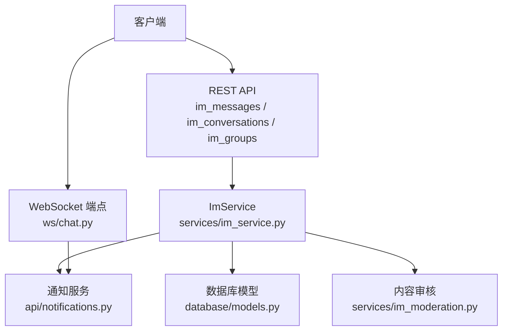
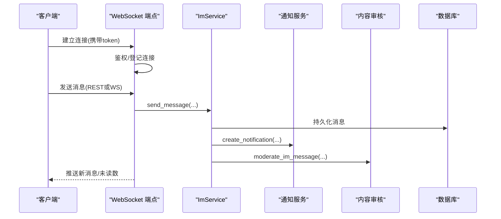
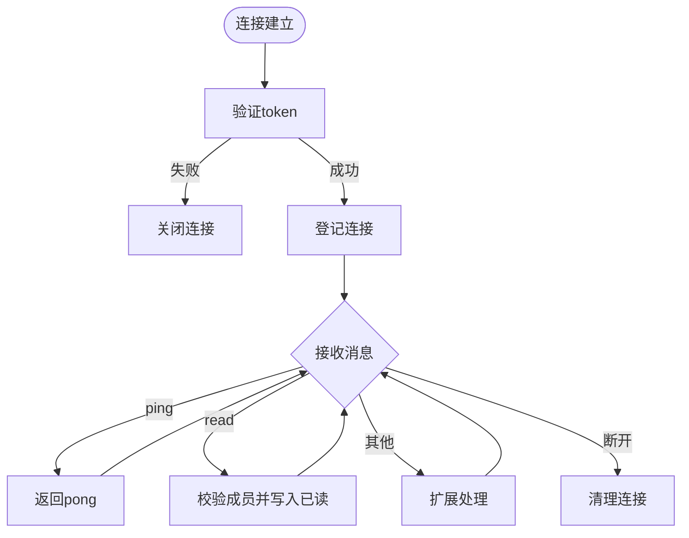
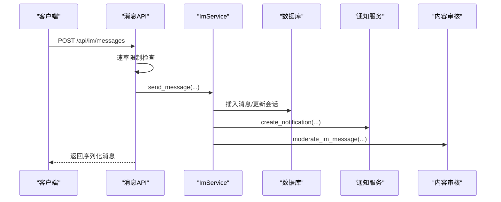
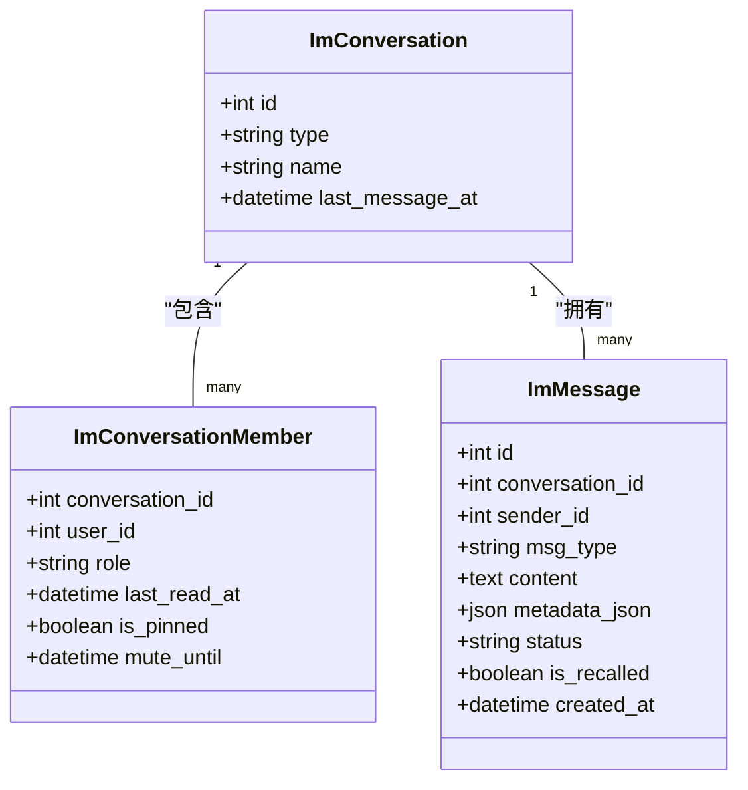
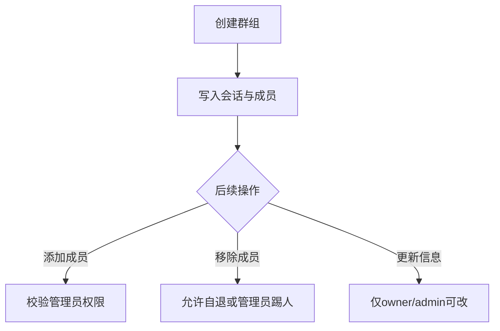
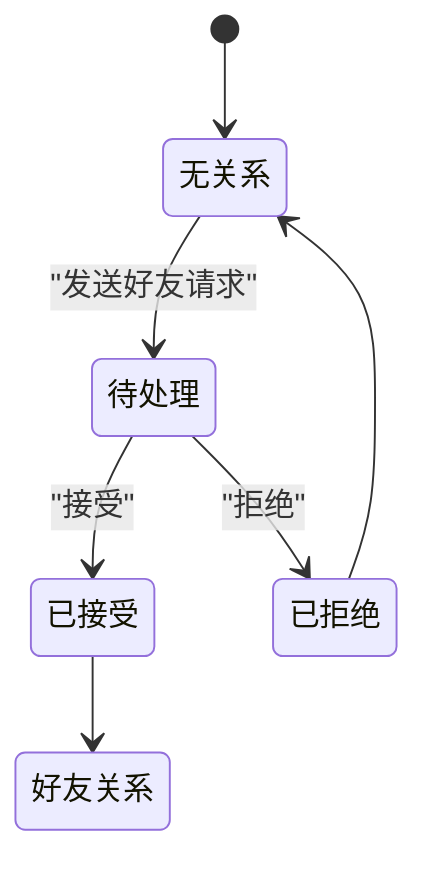
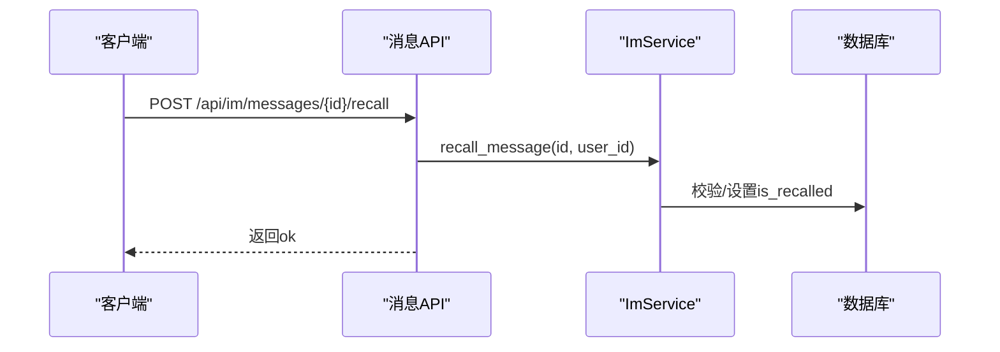
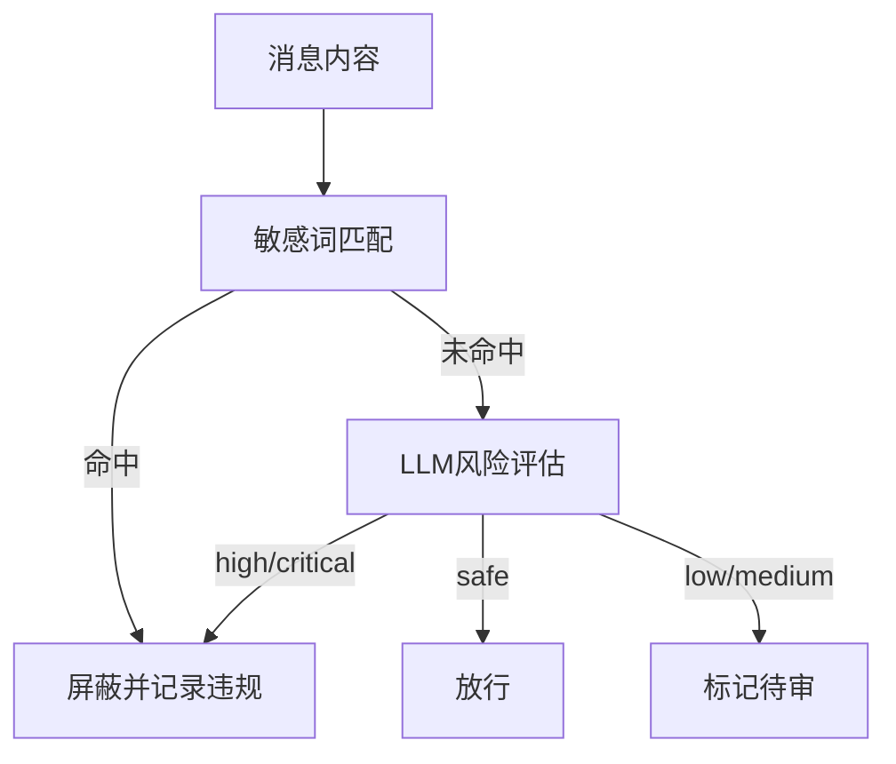
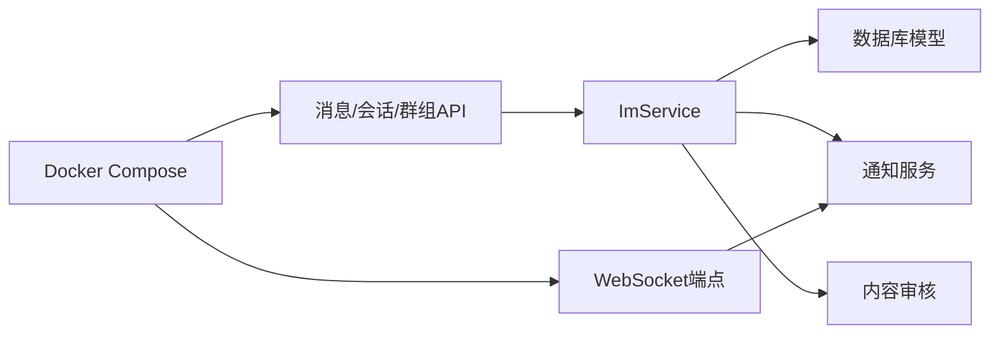

# 即时通讯服务

<cite>
**本文引用的文件**
- [web/backend/ws/chat.py](file://web/backend/ws/chat.py)
- [web/backend/api/im_messages.py](file://web/backend/api/im_messages.py)
- [web/backend/api/im_conversations.py](file://web/backend/api/im_conversations.py)
- [web/backend/api/im_groups.py](file://web/backend/api/im_groups.py)
- [web/backend/services/im_service.py](file://web/backend/services/im_service.py)
- [web/backend/services/im_moderation.py](file://web/backend/services/im_moderation.py)
- [web/backend/api/notifications.py](file://web/backend/api/notifications.py)
- [web/backend/database/models.py](file://web/backend/database/models.py)
- [web/deploy/docker-compose.yml](file://web/deploy/docker-compose.yml)
</cite>

## 目录
1. [简介](#简介)
2. [项目结构](#项目结构)
3. [核心组件](#核心组件)
4. [架构总览](#架构总览)
5. [详细组件分析](#详细组件分析)
6. [依赖关系分析](#依赖关系分析)
7. [性能与扩展性](#性能与扩展性)
8. [故障排查指南](#故障排查指南)
9. [结论](#结论)
10. [附录](#附录)

## 简介
本技术文档面向即时通讯（IM）子系统，覆盖WebSocket连接管理、消息路由、会话状态维护、消息持久化、离线通知、一对一聊天、群组通信、好友关系管理、消息搜索与历史同步、内容审核与反垃圾、消息撤回与已读状态等能力。同时给出实时通信协议要点、消息队列集成建议、负载均衡与水平扩展方案，帮助读者快速理解并落地生产环境。

## 项目结构
IM相关代码主要分布在后端FastAPI模块中：
- WebSocket端点与连接管理：ws/chat.py
- 消息与会话API：api/im_messages.py、api/im_conversations.py
- 群聊管理API：api/im_groups.py
- 业务逻辑与服务：services/im_service.py
- 内容安全与风控：services/im_moderation.py
- 通知系统：api/notifications.py
- 数据模型：database/models.py
- 部署编排：deploy/docker-compose.yml

图表来源
- [web/backend/ws/chat.py:14-111](file://web/backend/ws/chat.py#L14-L111)
- [web/backend/api/im_messages.py:16-78](file://web/backend/api/im_messages.py#L16-L78)
- [web/backend/api/im_conversations.py:14-103](file://web/backend/api/im_conversations.py#L14-L103)
- [web/backend/api/im_groups.py:12-183](file://web/backend/api/im_groups.py#L12-L183)
- [web/backend/services/im_service.py:26-419](file://web/backend/services/im_service.py#L26-L419)
- [web/backend/services/im_moderation.py:1-148](file://web/backend/services/im_moderation.py#L1-L148)
- [web/backend/api/notifications.py:84-186](file://web/backend/api/notifications.py#L84-L186)
- [web/backend/database/models.py:88-200](file://web/backend/database/models.py#L88-L200)

章节来源
- [web/backend/ws/chat.py:14-111](file://web/backend/ws/chat.py#L14-L111)
- [web/backend/api/im_messages.py:16-78](file://web/backend/api/im_messages.py#L16-L78)
- [web/backend/api/im_conversations.py:14-103](file://web/backend/api/im_conversations.py#L14-L103)
- [web/backend/api/im_groups.py:12-183](file://web/backend/api/im_groups.py#L12-L183)
- [web/backend/services/im_service.py:26-419](file://web/backend/services/im_service.py#L26-L419)
- [web/backend/services/im_moderation.py:1-148](file://web/backend/services/im_moderation.py#L1-L148)
- [web/backend/api/notifications.py:84-186](file://web/backend/api/notifications.py#L84-L186)
- [web/backend/database/models.py:88-200](file://web/backend/database/models.py#L88-L200)

## 核心组件
- WebSocket连接管理器：维护在线用户与连接映射，支持心跳ping/pong、按用户推送事件、未读数广播。
- 消息服务：封装会话创建、消息发送、历史分页、撤回、好友请求与列表等核心业务。
- 内容审核：敏感词过滤+LLM判定，记录审核结果并对高风险消息进行屏蔽或标记。
- 通知系统：统一的通知写入与查询接口，用于消息到达、好友通过等场景的离线触达。
- 数据模型：会话、成员、消息、已读回执、好友请求、违规记录等实体定义。

章节来源
- [web/backend/ws/chat.py:14-111](file://web/backend/ws/chat.py#L14-L111)
- [web/backend/services/im_service.py:26-419](file://web/backend/services/im_service.py#L26-L419)
- [web/backend/services/im_moderation.py:1-148](file://web/backend/services/im_moderation.py#L1-L148)
- [web/backend/api/notifications.py:84-186](file://web/backend/api/notifications.py#L84-L186)
- [web/backend/database/models.py:88-200](file://web/backend/database/models.py#L88-L200)

## 架构总览
IM子系统采用“REST + WebSocket”混合架构：
- REST负责会话管理、消息历史、群成员管理等强一致性操作。
- WebSocket负责实时消息投递、已读回执、未读数更新等低延迟场景。
- 消息持久化由数据库承担；通知系统提供离线触达；内容审核在消息落库前后进行风控拦截。

图表来源
- [web/backend/ws/chat.py:45-111](file://web/backend/ws/chat.py#L45-L111)
- [web/backend/services/im_service.py:215-286](file://web/backend/services/im_service.py#L215-L286)
- [web/backend/api/notifications.py:84-109](file://web/backend/api/notifications.py#L84-L109)
- [web/backend/services/im_moderation.py:91-148](file://web/backend/services/im_moderation.py#L91-L148)

## 详细组件分析

### WebSocket连接管理与实时协议
- 连接生命周期：鉴权通过后登记到内存映射；异常或断开时清理。
- 心跳机制：客户端定时发送ping，服务端返回pong以维持长连接。
- 已读回执：客户端上报message_ids，服务端校验会话成员后写入已读表。
- 未读数广播：服务端可主动推送unread_update事件。

图表来源
- [web/backend/ws/chat.py:14-111](file://web/backend/ws/chat.py#L14-L111)

章节来源
- [web/backend/ws/chat.py:14-111](file://web/backend/ws/chat.py#L14-L111)

### 消息发送与路由
- 速率限制：单用户每分钟上限，防止滥用。
- 发送流程：校验会话成员与禁言状态 -> 持久化消息 -> 更新会话最后消息时间 -> 生成通知 -> 可选内容审核。
- 路由策略：当前实现为进程内广播（通过通知与WebSocket），可扩展为基于会话ID的消息队列广播。

图表来源
- [web/backend/api/im_messages.py:16-78](file://web/backend/api/im_messages.py#L16-L78)
- [web/backend/services/im_service.py:215-286](file://web/backend/services/im_service.py#L215-L286)
- [web/backend/api/notifications.py:84-109](file://web/backend/api/notifications.py#L84-L109)
- [web/backend/services/im_moderation.py:91-148](file://web/backend/services/im_moderation.py#L91-L148)

章节来源
- [web/backend/api/im_messages.py:16-78](file://web/backend/api/im_messages.py#L16-L78)
- [web/backend/services/im_service.py:215-286](file://web/backend/services/im_service.py#L215-L286)
- [web/backend/api/notifications.py:84-109](file://web/backend/api/notifications.py#L84-L109)
- [web/backend/services/im_moderation.py:91-148](file://web/backend/services/im_moderation.py#L91-L148)

### 会话与历史同步
- 会话列表：按最近消息时间排序，计算未读数、是否置顶、是否静音。
- 历史分页：支持before_id游标分页，按创建时间倒序读取。
- 已读标记：会话级last_read_at更新，结合消息时间计算未读数。

图表来源
- [web/backend/database/models.py:88-200](file://web/backend/database/models.py#L88-L200)
- [web/backend/services/im_service.py:90-194](file://web/backend/services/im_service.py#L90-L194)
- [web/backend/api/im_conversations.py:21-81](file://web/backend/api/im_conversations.py#L21-L81)

章节来源
- [web/backend/api/im_conversations.py:21-103](file://web/backend/api/im_conversations.py#L21-L103)
- [web/backend/services/im_service.py:90-194](file://web/backend/services/im_service.py#L90-L194)
- [web/backend/database/models.py:88-200](file://web/backend/database/models.py#L88-L200)

### 群组通信
- 创建群组：指定名称与初始成员，自动将创建者设为owner。
- 成员管理：支持添加/移除成员，仅owner/admin可操作。
- 群信息：支持修改名称与公告，权限校验严格。

图表来源
- [web/backend/api/im_groups.py:24-183](file://web/backend/api/im_groups.py#L24-L183)

章节来源
- [web/backend/api/im_groups.py:24-183](file://web/backend/api/im_groups.py#L24-L183)

### 好友关系管理
- 发起请求：目标用户隐私模式控制是否可添加。
- 接受/拒绝：状态机从pending到accepted/declined。
- 好友列表：聚合双方已接受的请求，返回用户基本信息。

图表来源
- [web/backend/api/im_friends.py:24-144](file://web/backend/api/im_friends.py#L24-L144)
- [web/backend/services/im_service.py:335-419](file://web/backend/services/im_service.py#L335-L419)

章节来源
- [web/backend/api/im_friends.py:24-144](file://web/backend/api/im_friends.py#L24-L144)
- [web/backend/services/im_service.py:335-419](file://web/backend/services/im_service.py#L335-L419)

### 消息撤回与已读状态
- 撤回：仅本人消息且在限定时间内可撤回，撤回后内容替换为提示文案。
- 已读：客户端上报message_ids，服务端校验成员后写入已读表；会话级last_read_at用于未读数计算。

图表来源
- [web/backend/api/im_messages.py:66-78](file://web/backend/api/im_messages.py#L66-L78)
- [web/backend/services/im_service.py:315-331](file://web/backend/services/im_service.py#L315-L331)
- [web/backend/ws/chat.py:58-105](file://web/backend/ws/chat.py#L58-L105)

章节来源
- [web/backend/api/im_messages.py:66-78](file://web/backend/api/im_messages.py#L66-L78)
- [web/backend/services/im_service.py:315-331](file://web/backend/services/im_service.py#L315-L331)
- [web/backend/ws/chat.py:58-105](file://web/backend/ws/chat.py#L58-L105)

### 内容审核与反垃圾
- 敏感词匹配：命中即标记为高风险并屏蔽。
- LLM判定：根据配置调用外部模型进行风险分类与置信度评估。
- 处置策略：高风险直接屏蔽并计入违规计数；低风险标记供人工复核。

图表来源
- [web/backend/services/im_moderation.py:16-88](file://web/backend/services/im_moderation.py#L16-L88)
- [web/backend/services/im_moderation.py:91-148](file://web/backend/services/im_moderation.py#L91-L148)

章节来源
- [web/backend/services/im_moderation.py:16-148](file://web/backend/services/im_moderation.py#L16-L148)

### 通知与离线触达
- 统一创建通知：消息到达、好友通过等事件通过create_notification写入。
- 查询与标记：支持分页、未读计数、批量已读。
- 与WebSocket联动：在线时可配合WS推送未读数更新。

章节来源
- [web/backend/api/notifications.py:84-186](file://web/backend/api/notifications.py#L84-L186)
- [web/backend/services/im_service.py:260-286](file://web/backend/services/im_service.py#L260-L286)
- [web/backend/ws/chat.py:35-39](file://web/backend/ws/chat.py#L35-L39)

## 依赖关系分析
- 模块耦合：API层依赖ImService进行业务编排；ImService依赖数据库模型与通知服务；WebSocket端点依赖认证与通知。
- 外部依赖：内容审核依赖LLM配置与OpenAI客户端；部署使用Docker Compose编排前后端。

图表来源
- [web/backend/api/im_messages.py:16-78](file://web/backend/api/im_messages.py#L16-L78)
- [web/backend/api/im_conversations.py:14-103](file://web/backend/api/im_conversations.py#L14-L103)
- [web/backend/api/im_groups.py:12-183](file://web/backend/api/im_groups.py#L12-L183)
- [web/backend/services/im_service.py:26-419](file://web/backend/services/im_service.py#L26-L419)
- [web/backend/api/notifications.py:84-186](file://web/backend/api/notifications.py#L84-L186)
- [web/backend/services/im_moderation.py:1-148](file://web/backend/services/im_moderation.py#L1-L148)
- [web/deploy/docker-compose.yml:1-22](file://web/deploy/docker-compose.yml#L1-L22)

章节来源
- [web/backend/api/im_messages.py:16-78](file://web/backend/api/im_messages.py#L16-L78)
- [web/backend/api/im_conversations.py:14-103](file://web/backend/api/im_conversations.py#L14-L103)
- [web/backend/api/im_groups.py:12-183](file://web/backend/api/im_groups.py#L12-L183)
- [web/backend/services/im_service.py:26-419](file://web/backend/services/im_service.py#L26-L419)
- [web/backend/api/notifications.py:84-186](file://web/backend/api/notifications.py#L84-L186)
- [web/backend/services/im_moderation.py:1-148](file://web/backend/services/im_moderation.py#L1-L148)
- [web/deploy/docker-compose.yml:1-22](file://web/deploy/docker-compose.yml#L1-L22)

## 性能与扩展性
- 速率限制：进程内令牌桶/滑动窗口限流，适合单机；多实例需迁移至Redis共享计数。
- 消息广播：当前为进程内通知+WebSocket直推；水平扩展时需引入消息队列（如Redis Pub/Sub、RabbitMQ、Kafka）按conversation_id路由。
- 数据库优化：对会话成员、消息时间戳、已读索引进行优化；分页使用游标避免深翻页。
- 缓存策略：会话列表、未读数可引入Redis缓存，降低热点查询压力。
- 水平扩展：无状态API与WS节点可横向扩容；会话亲和可通过会话ID哈希路由到固定节点，或使用集中式连接网关。
- 存储与归档：历史消息可按会话分片存储；冷热分离提升查询性能。

[本节为通用指导，不直接分析具体文件]

## 故障排查指南
- WebSocket连接失败：检查token鉴权与网络连通性；确认连接登记与清理逻辑。
- 消息发送频繁被拒：检查速率限制阈值与并发量；必要时调整限制或引入队列削峰。
- 消息未送达：确认通知是否创建成功；在线用户是否收到WS推送；离线用户是否通过通知触达。
- 内容审核误判：调整敏感词库与LLM提示词；对高风险样本进行回测与阈值调优。
- 历史分页异常：检查before_id参数与索引；确保按created_at排序一致。

章节来源
- [web/backend/ws/chat.py:45-111](file://web/backend/ws/chat.py#L45-L111)
- [web/backend/api/im_messages.py:18-30](file://web/backend/api/im_messages.py#L18-L30)
- [web/backend/services/im_moderation.py:16-88](file://web/backend/services/im_moderation.py#L16-L88)
- [web/backend/api/im_conversations.py:45-61](file://web/backend/api/im_conversations.py#L45-L61)

## 结论
该IM子系统以REST+WebSocket为核心，实现了会话管理、消息收发、群组与好友关系、内容审核与通知等关键能力。当前版本适合中小规模场景；在生产环境中建议引入消息队列、分布式缓存与连接网关以实现高可用与水平扩展。通过完善的内容审核与反垃圾机制，保障社区消息质量与安全。

[本节为总结，不直接分析具体文件]

## 附录
- 实时通信协议要点
  - 连接：WebSocket握手携带token进行鉴权。
  - 心跳：客户端定时发送ping，服务端返回pong。
  - 消息：REST持久化，WS推送新消息与未读数更新。
  - 已读：客户端上报message_ids，服务端写入已读表。
- 消息队列集成建议
  - 使用Redis Pub/Sub或消息中间件按conversation_id广播。
  - 将通知与WS推送解耦，提高可靠性与可观测性。
- 负载均衡与水平扩展
  - 无状态API与WS节点可横向扩容。
  - 会话亲和：基于会话ID哈希路由到固定节点，或使用集中式连接网关。
- 安全与合规
  - 传输加密：建议使用HTTPS/WSS。
  - 内容审核：敏感词+LLM双通道，记录审计日志。
  - 反垃圾：速率限制、黑名单、违规计数与处罚策略。

[本节为补充说明，不直接分析具体文件]