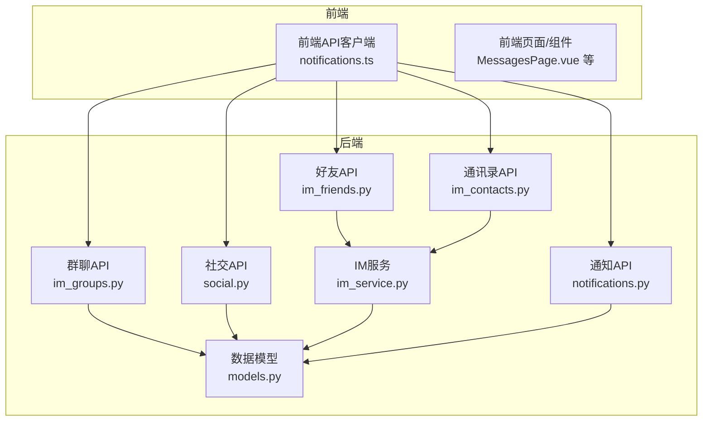
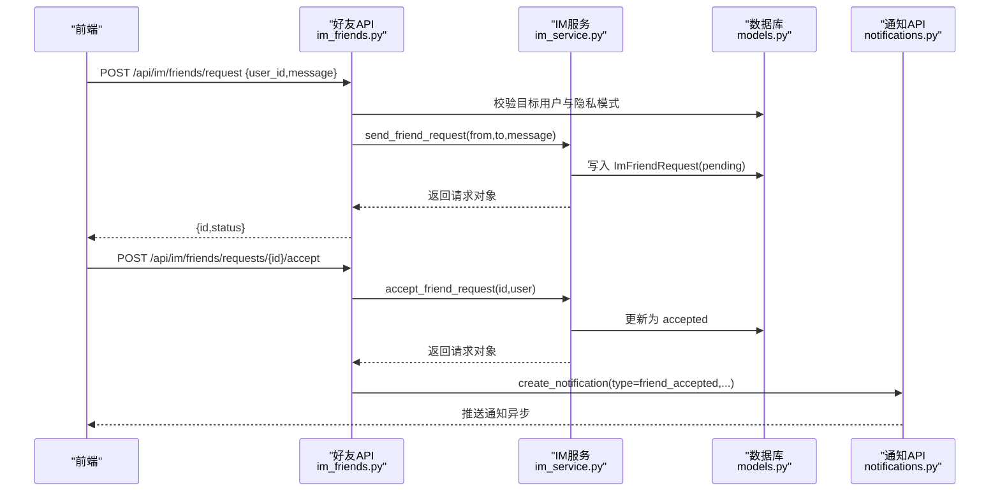
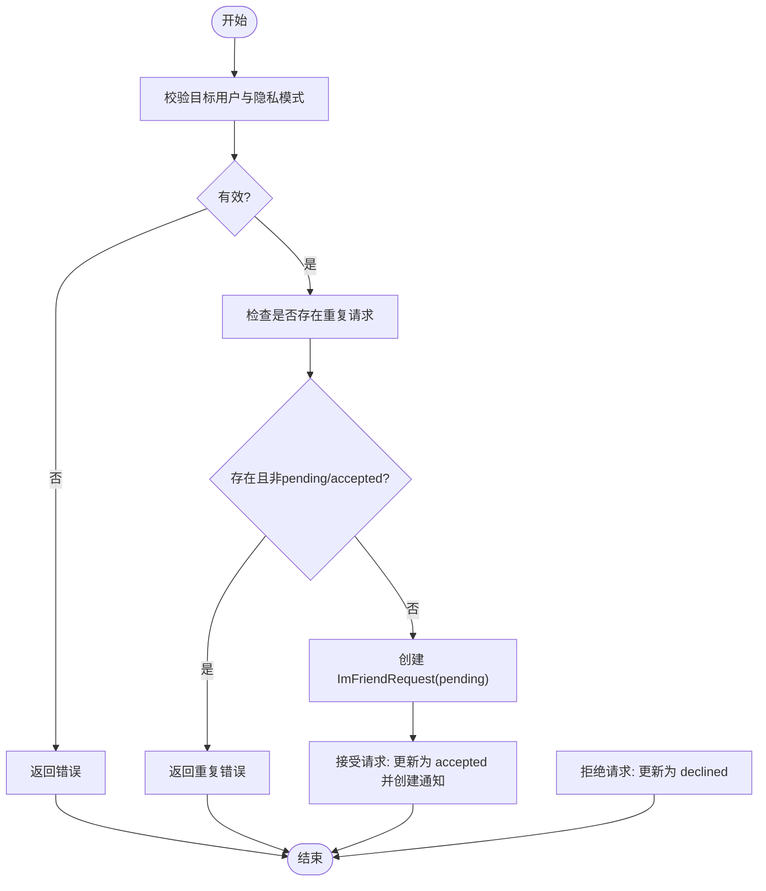
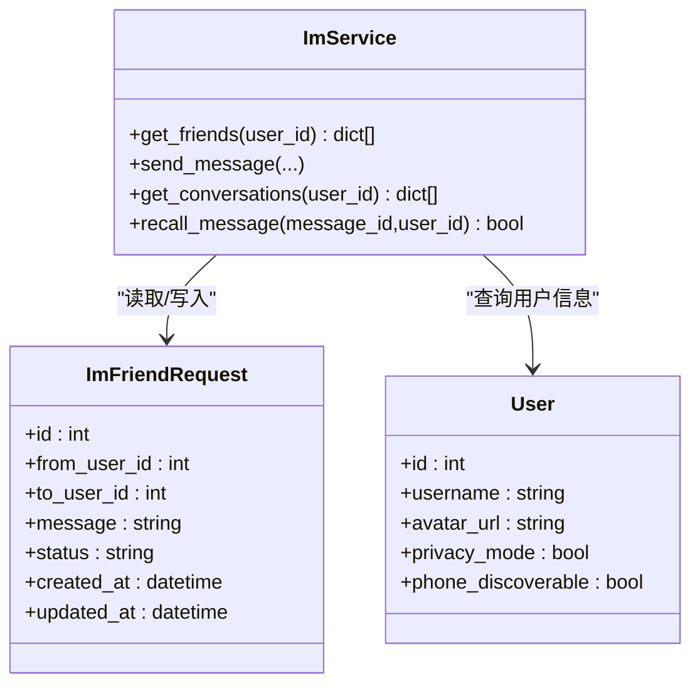
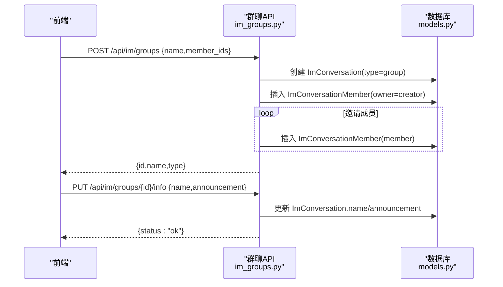
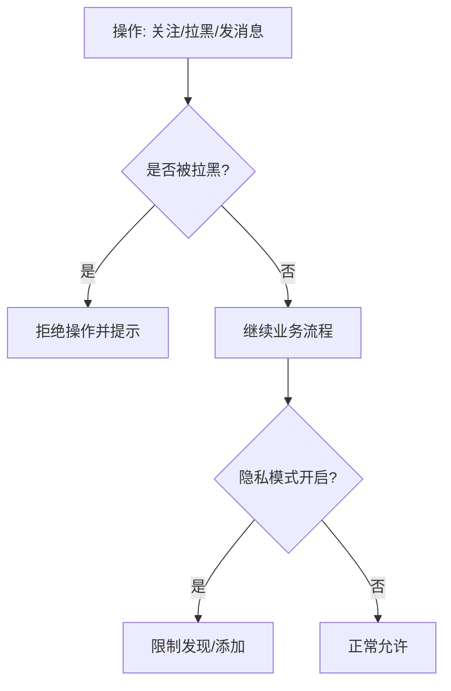
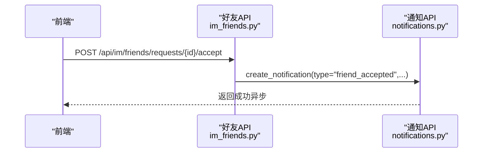
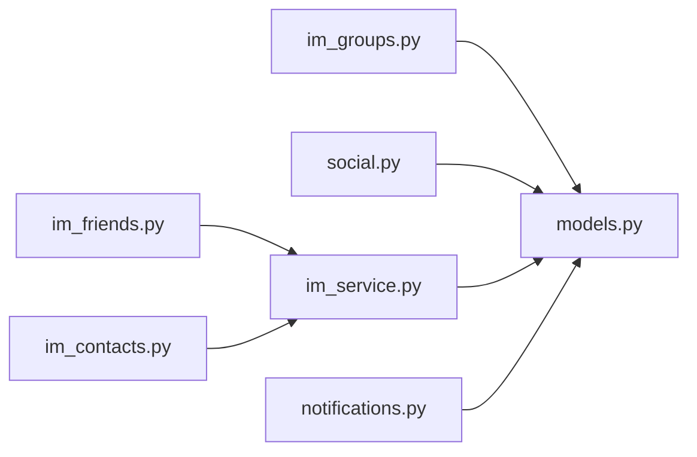

# 好友关系管理

<cite>
**本文引用的文件**   
- [im_friends.py](file://web/backend/api/im_friends.py)
- [im_contacts.py](file://web/backend/api/im_contacts.py)
- [im_groups.py](file://web/backend/api/im_groups.py)
- [im_service.py](file://web/backend/services/im_service.py)
- [models.py](file://web/backend/database/models.py)
- [social.py](file://web/backend/api/social.py)
- [notifications.py](file://web/backend/api/notifications.py)
- [recommendation.py](file://web/backend/services/recommendation.py)
- [notifications.ts](file://web/app/src/api/notifications.ts)
</cite>

## 目录
1. [简介](#简介)
2. [项目结构](#项目结构)
3. [核心组件](#核心组件)
4. [架构总览](#架构总览)
5. [详细组件分析](#详细组件分析)
6. [依赖分析](#依赖分析)
7. [性能考虑](#性能考虑)
8. [故障排查指南](#故障排查指南)
9. [结论](#结论)
10. [附录](#附录)

## 简介
本技术文档围绕“好友关系管理系统”展开，覆盖好友申请、同意、拒绝的完整流程与状态管理；介绍好友列表管理、分组功能、黑名单机制与隐私设置；并给出关系图谱构建思路、社交推荐算法、共同好友计算与影响力分析的扩展设计。同时提供关系数据同步、缓存策略、查询优化与扩展性设计的实现细节，帮助读者从业务到代码层面全面理解系统。

## 项目结构
本项目采用前后端分离架构：
- 后端（FastAPI）：路由层（api）、服务层（services）、数据模型（database/models.py）、通知模块（api/notifications.py）
- 前端（Vue + TypeScript）：API 客户端（app/src/api/*.ts）、页面与组件（app/src/views/*, app/src/components/*）

与好友关系相关的核心文件包括：
- API 路由：im_friends.py、im_contacts.py、im_groups.py、social.py、notifications.py
- 服务逻辑：im_service.py
- 数据模型：models.py（包含 ImFriendRequest、ImConversation、ImConversationMember、ImMessage、UserBlock、UserNotification 等）
- 前端通知接口：notifications.ts

**图表来源** 
- [im_friends.py:1-144](file://web/backend/api/im_friends.py#L1-L144)
- [im_contacts.py:1-192](file://web/backend/api/im_contacts.py#L1-L192)
- [im_groups.py:1-183](file://web/backend/api/im_groups.py#L1-L183)
- [im_service.py:1-419](file://web/backend/services/im_service.py#L1-L419)
- [models.py:937-1136](file://web/backend/database/models.py#L937-L1136)
- [notifications.py:1-56](file://web/backend/api/notifications.py#L1-L56)
- [notifications.ts:1-41](file://web/app/src/api/notifications.ts#L1-L41)

**章节来源**
- [im_friends.py:1-144](file://web/backend/api/im_friends.py#L1-L144)
- [im_contacts.py:1-192](file://web/backend/api/im_contacts.py#L1-L192)
- [im_groups.py:1-183](file://web/backend/api/im_groups.py#L1-L183)
- [im_service.py:1-419](file://web/backend/services/im_service.py#L1-L419)
- [models.py:937-1136](file://web/backend/database/models.py#L937-L1136)
- [notifications.py:1-56](file://web/backend/api/notifications.py#L1-L56)
- [notifications.ts:1-41](file://web/app/src/api/notifications.ts#L1-L41)

## 核心组件
- 好友请求与列表：通过 /api/im/friends 路由暴露发送请求、列出待处理请求、接受/拒绝、获取好友列表的能力
- 通讯录匹配与搜索：通过 /api/im/contacts 提供基于手机号哈希的安全匹配与用户名搜索，返回是否好友、是否已发送请求等状态
- 群聊管理：通过 /api/im/groups 提供创建群、成员增删、群信息更新
- IM 服务：封装会话、消息、好友关系的业务逻辑，含拉黑检查、未读计数、撤回、好友关系判定等
- 数据模型：定义好友请求、会话、成员、消息、拉黑、通知等表结构与约束
- 通知系统：统一的通知创建与列表接口，支持好友通过、私信等事件类型

**章节来源**
- [im_friends.py:1-144](file://web/backend/api/im_friends.py#L1-L144)
- [im_contacts.py:1-192](file://web/backend/api/im_contacts.py#L1-L192)
- [im_groups.py:1-183](file://web/backend/api/im_groups.py#L1-L183)
- [im_service.py:1-419](file://web/backend/services/im_service.py#L1-L419)
- [models.py:937-1136](file://web/backend/database/models.py#L937-L1136)
- [notifications.py:1-56](file://web/backend/api/notifications.py#L1-L56)

## 架构总览
下图展示好友关系管理的端到端调用链：前端发起请求，路由层校验与参数绑定，服务层执行业务逻辑，数据库持久化，并在关键节点触发通知。

**图表来源** 
- [im_friends.py:24-40](file://web/backend/api/im_friends.py#L24-L40)
- [im_service.py:335-381](file://web/backend/services/im_service.py#L335-L381)
- [models.py:940-954](file://web/backend/database/models.py#L940-L954)
- [notifications.py:46-56](file://web/backend/api/notifications.py#L46-L56)

## 详细组件分析

### 好友申请、同意、拒绝流程与状态管理
- 发送好友请求
  - 校验目标用户存在性与隐私模式
  - 防重：同一对用户仅允许一个 pending 或 accepted 的请求
  - 写入 ImFriendRequest，状态为 pending
- 接受请求
  - 校验请求归属当前用户
  - 将状态更新为 accepted，并触发“已通过好友请求”通知
- 拒绝请求
  - 校验请求归属当前用户
  - 将状态更新为 declined

**图表来源** 
- [im_friends.py:24-40](file://web/backend/api/im_friends.py#L24-L40)
- [im_service.py:335-381](file://web/backend/services/im_service.py#L335-L381)
- [models.py:940-954](file://web/backend/database/models.py#L940-L954)

**章节来源**
- [im_friends.py:24-40](file://web/backend/api/im_friends.py#L24-L40)
- [im_service.py:335-381](file://web/backend/services/im_service.py#L335-L381)
- [models.py:940-954](file://web/backend/database/models.py#L940-L954)

### 好友列表管理与通讯录匹配
- 好友列表
  - 聚合双方 accepted 的 ImFriendRequest，去重后批量查询用户信息
- 通讯录匹配
  - 客户端上传 SHA256(phone_normalized)，服务端预计算可发现用户的哈希映射
  - 过滤已拉黑、封禁、隐私不可见用户，返回匹配结果及好友状态
- 用户名搜索
  - 模糊匹配 username，限制可见用户范围，返回好友/待处理状态

**图表来源** 
- [im_service.py:383-418](file://web/backend/services/im_service.py#L383-L418)
- [models.py:940-954](file://web/backend/database/models.py#L940-L954)

**章节来源**
- [im_service.py:383-418](file://web/backend/services/im_service.py#L383-L418)
- [im_contacts.py:54-132](file://web/backend/api/im_contacts.py#L54-L132)
- [im_contacts.py:135-192](file://web/backend/api/im_contacts.py#L135-L192)
- [models.py:940-954](file://web/backend/database/models.py#L940-L954)

### 分组功能（群聊）
- 创建群：指定名称与初始成员，创建者自动成为 owner
- 成员管理：管理员/所有者可添加、移除成员
- 群信息更新：修改名称与公告

**图表来源** 
- [im_groups.py:24-48](file://web/backend/api/im_groups.py#L24-L48)
- [im_groups.py:155-183](file://web/backend/api/im_groups.py#L155-L183)
- [models.py:956-988](file://web/backend/database/models.py#L956-L988)

**章节来源**
- [im_groups.py:24-48](file://web/backend/api/im_groups.py#L24-L48)
- [im_groups.py:77-107](file://web/backend/api/im_groups.py#L77-L107)
- [im_groups.py:110-152](file://web/backend/api/im_groups.py#L110-L152)
- [im_groups.py:155-183](file://web/backend/api/im_groups.py#L155-L183)
- [models.py:956-988](file://web/backend/database/models.py#L956-L988)

### 黑名单机制与隐私设置
- 黑名单
  - 记录 blocker_id 与 blocked_id，唯一约束防止重复
  - 关注时检查黑名单，禁止关注被拉黑用户
  - 拉黑时自动解除双向关注
- 隐私模式
  - 用户可通过 privacy_mode 控制是否可被发现与添加好友
  - 通讯录匹配与搜索均受隐私模式影响

**图表来源** 
- [models.py:806-824](file://web/backend/database/models.py#L806-L824)
- [social.py:29-85](file://web/backend/api/social.py#L29-L85)
- [im_service.py:32-53](file://web/backend/services/im_service.py#L32-L53)

**章节来源**
- [models.py:806-824](file://web/backend/database/models.py#L806-L824)
- [social.py:158-218](file://web/backend/api/social.py#L158-L218)
- [im_service.py:32-53](file://web/backend/services/im_service.py#L32-L53)

### 通知机制
- 通知类型：like/comment/follow/bookmark/collect/system/moderation/mute/ban/post_approved/post_rejected 等
- 好友通过：在 accept 流程中创建 friend_accepted 通知
- 私信消息：在发送消息时为目标会话其他成员创建 message 通知
- 前端：提供列表、未读数、标记已读、全部已读等能力

**图表来源** 
- [im_friends.py:89-114](file://web/backend/api/im_friends.py#L89-L114)
- [notifications.py:46-56](file://web/backend/api/notifications.py#L46-L56)
- [notifications.ts:21-41](file://web/app/src/api/notifications.ts#L21-L41)

**章节来源**
- [im_friends.py:89-114](file://web/backend/api/im_friends.py#L89-L114)
- [notifications.py:1-56](file://web/backend/api/notifications.py#L1-L56)
- [notifications.ts:1-41](file://web/app/src/api/notifications.ts#L1-L41)

### 关系图谱构建、共同好友计算与影响力分析（扩展设计）
- 关系图谱
  - 以用户为节点，ImFriendRequest.accepted 为边，构建无向图
  - 使用邻接表或图数据库存储，支持快速遍历
- 共同好友
  - 对两个用户的好友集合求交集，时间复杂度 O(min(|A|,|B|))
  - 可结合索引加速查询
- 影响力分析
  - 基于度中心性、介数中心性等指标评估用户影响力
  - 可引入权重（互动频率、内容质量）进行加权评分

[本节为概念性扩展设计，不直接分析具体文件]

### 社交推荐算法（现有基础）
- 交互权重：click/read_end/like/bookmark/comment/share/skip 等
- 排序公式：综合点赞、评论、阅读次数等指标生成分数表达式
- 后续可扩展至好友动态、共同兴趣、地理位置等维度

**章节来源**
- [recommendation.py:42-75](file://web/backend/services/recommendation.py#L42-L75)

## 依赖分析
- 路由层依赖服务层与数据模型
- 服务层封装复杂业务逻辑，避免路由层臃肿
- 通知模块独立，便于扩展更多事件类型
- 前端通过统一的 API 客户端访问后端能力

**图表来源** 
- [im_friends.py:1-144](file://web/backend/api/im_friends.py#L1-L144)
- [im_contacts.py:1-192](file://web/backend/api/im_contacts.py#L1-L192)
- [im_groups.py:1-183](file://web/backend/api/im_groups.py#L1-L183)
- [im_service.py:1-419](file://web/backend/services/im_service.py#L1-L419)
- [models.py:937-1136](file://web/backend/database/models.py#L937-L1136)
- [notifications.py:1-56](file://web/backend/api/notifications.py#L1-L56)

**章节来源**
- [im_friends.py:1-144](file://web/backend/api/im_friends.py#L1-L144)
- [im_contacts.py:1-192](file://web/backend/api/im_contacts.py#L1-L192)
- [im_groups.py:1-183](file://web/backend/api/im_groups.py#L1-L183)
- [im_service.py:1-419](file://web/backend/services/im_service.py#L1-L419)
- [models.py:937-1136](file://web/backend/database/models.py#L937-L1136)
- [notifications.py:1-56](file://web/backend/api/notifications.py#L1-L56)

## 性能考虑
- 数据库索引
  - ImFriendRequest.from_user_id、to_user_id、status 建立索引，提升查询效率
  - ImConversation.last_message_at、ImMessage.created_at 用于会话与消息排序
- 查询优化
  - 好友列表使用 in_ 批量查询，减少 N+1 问题
  - 通讯录匹配预计算哈希映射，避免重复计算
- 缓存策略
  - 对高频只读数据（如用户头像、用户名）可引入 Redis 缓存
  - 好友关系可缓存短期热点用户的好友集合
- 扩展性设计
  - 将通知创建改为异步任务队列，降低主流程延迟
  - 关系图谱与推荐算法可迁移至图数据库或向量检索引擎

[本节为通用性能建议，不直接分析具体文件]

## 故障排查指南
- 常见错误
  - 重复请求：同一用户对之间已有 pending 或 accepted 请求
  - 隐私保护：对方开启隐私模式导致无法添加好友
  - 拉黑限制：被拉黑用户无法发消息或关注
- 定位方法
  - 检查 ImFriendRequest 的状态与时间戳
  - 查看 UserBlock 是否存在对应记录
  - 确认 User.privacy_mode 与 phone_discoverable 配置
- 日志与监控
  - 关注服务层异常日志（如通知创建失败）
  - 统计接口响应时间与错误率

**章节来源**
- [im_service.py:335-381](file://web/backend/services/im_service.py#L335-L381)
- [social.py:29-85](file://web/backend/api/social.py#L29-L85)
- [im_service.py:32-53](file://web/backend/services/im_service.py#L32-L53)

## 结论
本系统实现了完整的好友关系管理能力，涵盖申请、同意、拒绝流程与状态管理，提供通讯录匹配、搜索、群聊管理与黑名单机制，并通过通知系统增强用户体验。未来可在关系图谱、共同好友计算与影响力分析方面进一步扩展，结合缓存与异步机制提升性能与扩展性。

[本节为总结性内容，不直接分析具体文件]

## 附录
- 相关 API 路径
  - 好友：/api/im/friends/request、/api/im/friends/requests、/api/im/friends/requests/{id}/accept、/api/im/friends/requests/{id}/decline、/api/im/friends
  - 通讯录：/api/im/contacts/match、/api/im/contacts/search
  - 群聊：/api/im/groups、/api/im/groups/{id}/members、/api/im/groups/{id}/info
  - 社交：/api/social/follow、/api/social/block、/api/social/report
  - 通知：/api/notifications、/api/notifications/unread-count、/api/notifications/{id}/read、/api/notifications/read-all

[本节为概览性内容，不直接分析具体文件]