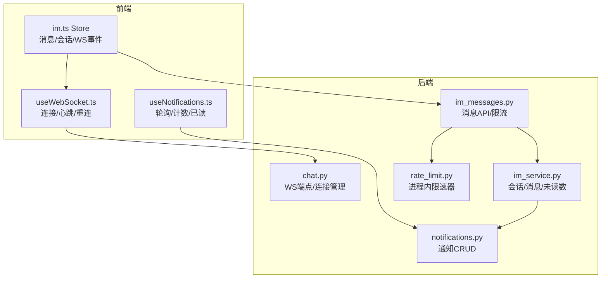
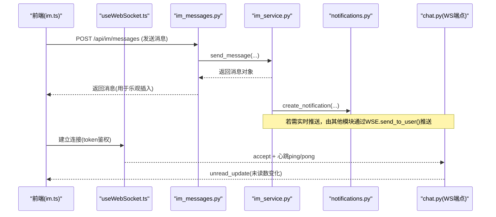
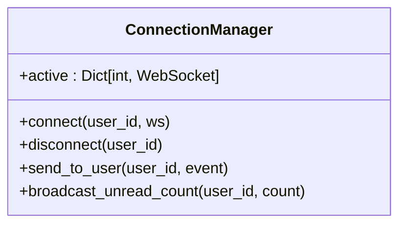
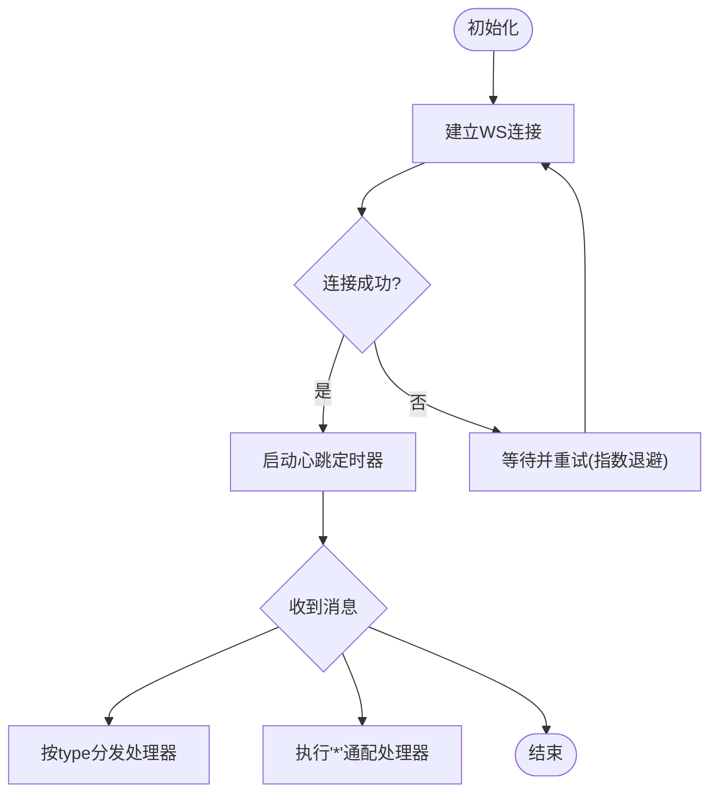
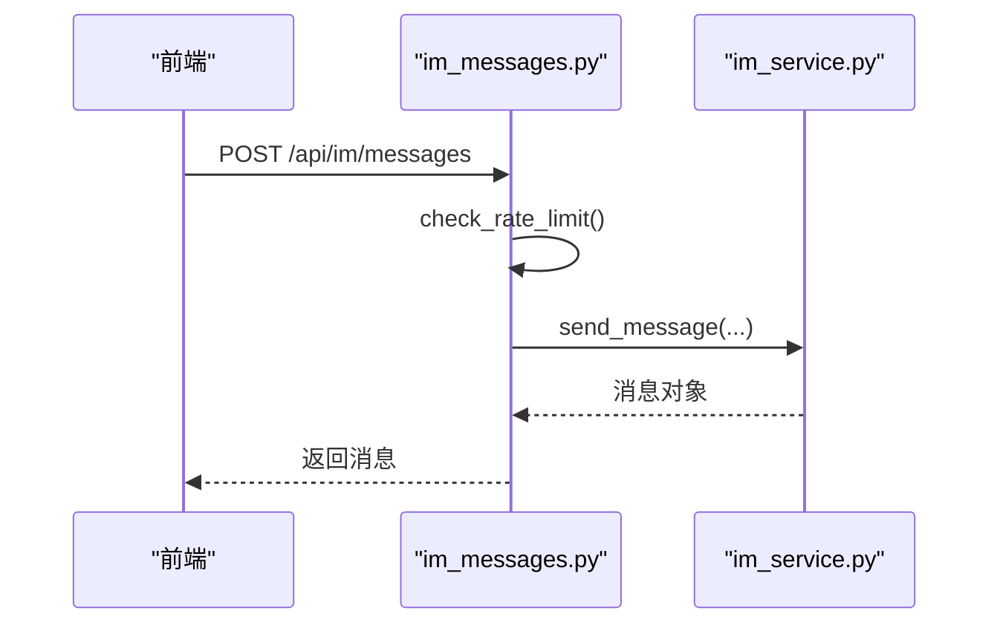
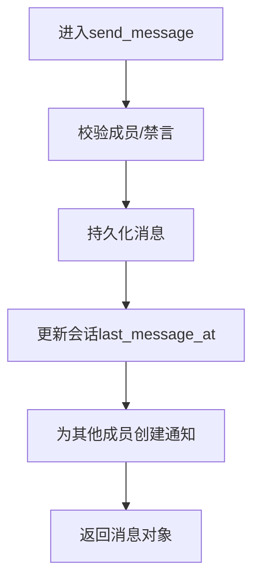
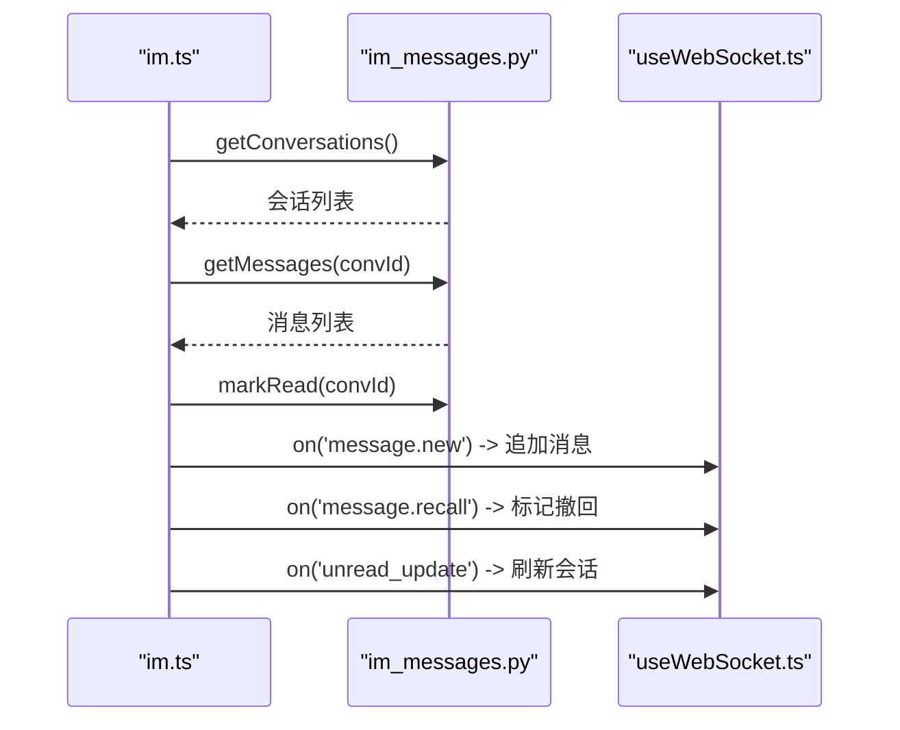
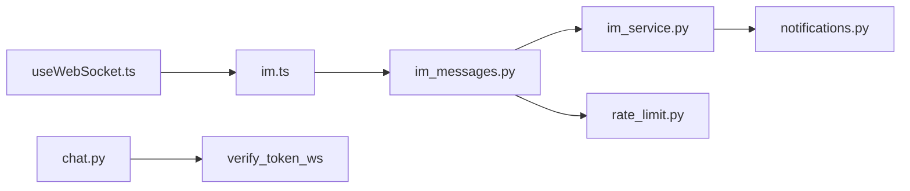

# 实时同步机制

<cite>
**本文引用的文件**   
- [web/backend/ws/chat.py](file://web/backend/ws/chat.py)
- [web/app/src/composables/useWebSocket.ts](file://web/app/src/composables/useWebSocket.ts)
- [web/backend/api/im_messages.py](file://web/backend/api/im_messages.py)
- [web/backend/services/im_service.py](file://web/backend/services/im_service.py)
- [web/app/src/stores/im.ts](file://web/app/src/stores/im.ts)
- [hermes_plan/2026-04-28_IM-social-system-plan.md](file://hermes_plan/2026-04-28_IM-social-system-plan.md)
- [web/backend/api/notifications.py](file://web/backend/api/notifications.py)
- [web/app/src/composables/useNotifications.ts](file://web/app/src/composables/useNotifications.ts)
- [web/backend/app/middleware/rate_limit.py](file://web/backend/app/middleware/rate_limit.py)
</cite>

## 目录
1. [引言](#引言)
2. [项目结构](#项目结构)
3. [核心组件](#核心组件)
4. [架构总览](#架构总览)
5. [详细组件分析](#详细组件分析)
6. [依赖关系分析](#依赖关系分析)
7. [性能考虑](#性能考虑)
8. [故障排查指南](#故障排查指南)
9. [结论](#结论)
10. [附录](#附录)

## 引言
本技术文档围绕“实时同步机制”展开，覆盖消息推送、状态同步、冲突解决与数据一致性保证。重点阐述离线消息处理、增量同步、全量同步与断线重连；并给出多端同步、跨设备一致、冲突检测与合并策略、实时通信协议设计、消息去重、幂等性保证与性能优化方案。内容基于仓库中现有的 WebSocket、IM API、通知系统与限流中间件实现进行系统化梳理与扩展建议。

## 项目结构
与实时同步相关的代码主要分布在以下位置：
- 后端 WebSocket 连接管理与事件分发：web/backend/ws/chat.py
- 前端 WebSocket 客户端封装与重连逻辑：web/app/src/composables/useWebSocket.ts
- IM 消息 API（发送、撤回、速率限制）：web/backend/api/im_messages.py
- IM 业务服务（会话、消息、好友、未读数计算）：web/backend/services/im_service.py
- 前端 IM Store（消息列表、会话列表、WS 事件处理）：web/app/src/stores/im.ts
- 通知系统（创建、查询、已读标记）：web/backend/api/notifications.py
- 前端通知轮询与计数：web/app/src/composables/useNotifications.ts
- 通用限流中间件（按 IP/用户维度）：web/backend/app/middleware/rate_limit.py
- 协议与推送计划说明（含事件协议、离线消息策略）：hermes_plan/2026-04-28_IM-social-system-plan.md

图表来源 
- [web/app/src/composables/useWebSocket.ts](file://web/app/src/composables/useWebSocket.ts)
- [web/app/src/stores/im.ts](file://web/app/src/stores/im.ts)
- [web/backend/ws/chat.py](file://web/backend/ws/chat.py)
- [web/backend/api/im_messages.py](file://web/backend/api/im_messages.py)
- [web/backend/services/im_service.py](file://web/backend/services/im_service.py)
- [web/backend/api/notifications.py](file://web/backend/api/notifications.py)
- [web/backend/app/middleware/rate_limit.py](file://web/backend/app/middleware/rate_limit.py)

章节来源
- [web/backend/ws/chat.py:1-111](file://web/backend/ws/chat.py#L1-L111)
- [web/app/src/composables/useWebSocket.ts:1-75](file://web/app/src/composables/useWebSocket.ts#L1-L75)
- [web/backend/api/im_messages.py:1-78](file://web/backend/api/im_messages.py#L1-L78)
- [web/backend/services/im_service.py:1-419](file://web/backend/services/im_service.py#L1-L419)
- [web/app/src/stores/im.ts:1-116](file://web/app/src/stores/im.ts#L1-L116)
- [web/backend/api/notifications.py:1-186](file://web/backend/api/notifications.py#L1-L186)
- [web/app/src/composables/useNotifications.ts:1-50](file://web/app/src/composables/useNotifications.ts#L1-L50)
- [web/backend/app/middleware/rate_limit.py:1-40](file://web/backend/app/middleware/rate_limit.py#L1-L40)
- [hermes_plan/2026-04-28_IM-social-system-plan.md:267-300](file://hermes_plan/2026-04-28_IM-social-system-plan.md#L267-L300)

## 核心组件
- WebSocket 连接管理器（服务端）：维护用户到 WebSocket 的映射，支持发送单播与未读数广播。
- WebSocket 客户端（前端）：建立连接、心跳保活、错误重连、事件订阅分发。
- IM 消息 API：发送消息、撤回消息、请求级速率限制。
- IM 业务服务：会话创建/获取、消息持久化、未读数统计、好友系统。
- 通知系统：统一通知模型与接口，供 IM 等业务触发通知。
- 限流中间件：进程内令牌桶/滑动窗口限流，保护写接口。

章节来源
- [web/backend/ws/chat.py:14-42](file://web/backend/ws/chat.py#L14-L42)
- [web/app/src/composables/useWebSocket.ts:11-53](file://web/app/src/composables/useWebSocket.ts#L11-L53)
- [web/backend/api/im_messages.py:23-31](file://web/backend/api/im_messages.py#L23-L31)
- [web/backend/services/im_service.py:90-194](file://web/backend/services/im_service.py#L90-L194)
- [web/backend/api/notifications.py:84-109](file://web/backend/api/notifications.py#L84-L109)
- [web/backend/app/middleware/rate_limit.py:10-32](file://web/backend/app/middleware/rate_limit.py#L10-L32)

## 架构总览
下图展示了从前端到后端的完整实时同步链路，包括 HTTP 写入与 WS 推送双通道、通知与未读数更新。

图表来源 
- [web/app/src/stores/im.ts:62-80](file://web/app/src/stores/im.ts#L62-L80)
- [web/backend/api/im_messages.py:41-64](file://web/backend/api/im_messages.py#L41-L64)
- [web/backend/services/im_service.py:215-286](file://web/backend/services/im_service.py#L215-L286)
- [web/backend/api/notifications.py:84-109](file://web/backend/api/notifications.py#L84-L109)
- [web/backend/ws/chat.py:45-51](file://web/backend/ws/chat.py#L45-L51)
- [web/app/src/composables/useWebSocket.ts:22-30](file://web/app/src/composables/useWebSocket.ts#L22-L30)

## 详细组件分析

### WebSocket 连接与事件分发（服务端）
- 连接管理：维护 active 字典 user_id → WebSocket，提供 connect/disconnect/send_to_user/broadcast_unread_count。
- 鉴权：通过 verify_token_ws 校验 token，失败则关闭连接。
- 心跳：响应 ping 事件，维持长连接存活。
- 已读回执：接收 read 事件，批量记录 ImMessageRead，避免重复写入。

图表来源 
- [web/backend/ws/chat.py:14-42](file://web/backend/ws/chat.py#L14-L42)

章节来源
- [web/backend/ws/chat.py:14-42](file://web/backend/ws/chat.py#L14-L42)
- [web/backend/ws/chat.py:45-51](file://web/backend/ws/chat.py#L45-L51)
- [web/backend/ws/chat.py:56-58](file://web/backend/ws/chat.py#L56-L58)
- [web/backend/ws/chat.py:58-105](file://web/backend/ws/chat.py#L58-L105)

### WebSocket 客户端与断线重连（前端）
- 连接建立：根据协议选择 ws/wss，携带 token 参数。
- 心跳保活：每 30s 发送一次 ping。
- 事件分发：按 type 路由到对应处理器，支持通配符 *。
- 断线重连：指数退避重试，最大次数限制。

图表来源 
- [web/app/src/composables/useWebSocket.ts:11-53](file://web/app/src/composables/useWebSocket.ts#L11-L53)
- [web/app/src/composables/useWebSocket.ts:44-52](file://web/app/src/composables/useWebSocket.ts#L44-L52)

章节来源
- [web/app/src/composables/useWebSocket.ts:11-53](file://web/app/src/composables/useWebSocket.ts#L11-L53)
- [web/app/src/composables/useWebSocket.ts:44-52](file://web/app/src/composables/useWebSocket.ts#L44-L52)

### IM 消息 API 与速率限制
- 发送消息：校验频率限制，调用服务层持久化消息，返回序列化结果。
- 撤回消息：校验权限与时间窗，标记 is_recalled 并更新内容。
- 速率限制：进程内滑动窗口，按用户维度限制每分钟请求数。

图表来源 
- [web/backend/api/im_messages.py:23-31](file://web/backend/api/im_messages.py#L23-L31)
- [web/backend/api/im_messages.py:41-64](file://web/backend/api/im_messages.py#L41-L64)
- [web/backend/services/im_service.py:215-286](file://web/backend/services/im_service.py#L215-L286)

章节来源
- [web/backend/api/im_messages.py:23-31](file://web/backend/api/im_messages.py#L23-L31)
- [web/backend/api/im_messages.py:41-64](file://web/backend/api/im_messages.py#L41-L64)
- [web/backend/api/im_messages.py:66-78](file://web/backend/api/im_messages.py#L66-L78)

### IM 业务服务（会话、消息、未读数）
- 会话管理：私聊会话自动创建或复用，成员校验与禁言检查。
- 消息收发：持久化消息，更新会话 last_message_at，生成通知。
- 未读数统计：基于 last_read_at 与消息 created_at 计算。
- 好友系统：请求、接受、查询好友列表。

图表来源 
- [web/backend/services/im_service.py:215-286](file://web/backend/services/im_service.py#L215-L286)
- [web/backend/services/im_service.py:90-194](file://web/backend/services/im_service.py#L90-L194)

章节来源
- [web/backend/services/im_service.py:90-194](file://web/backend/services/im_service.py#L90-L194)
- [web/backend/services/im_service.py:215-286](file://web/backend/services/im_service.py#L215-L286)
- [web/backend/services/im_service.py:288-332](file://web/backend/services/im_service.py#L288-L332)

### 前端 IM Store（消息与会话同步）
- 会话加载：拉取会话列表与未读数。
- 打开会话：拉取历史消息，标记已读，刷新会话列表。
- 发送消息：调用 API 成功后本地追加消息，刷新会话。
- WS 事件处理：message.new 追加消息，message.recall 标记撤回，unread_update 刷新未读数。

图表来源 
- [web/app/src/stores/im.ts:41-102](file://web/app/src/stores/im.ts#L41-L102)

章节来源
- [web/app/src/stores/im.ts:41-102](file://web/app/src/stores/im.ts#L41-L102)

### 通知系统（创建、查询、已读）
- 创建通知：供 IM 等服务调用，避免自发自知。
- 列表与计数：分页查询、未读数统计。
- 已读标记：单条与全部已读。

章节来源
- [web/backend/api/notifications.py:84-109](file://web/backend/api/notifications.py#L84-L109)
- [web/backend/api/notifications.py:114-142](file://web/backend/api/notifications.py#L114-L142)
- [web/backend/api/notifications.py:145-155](file://web/backend/api/notifications.py#L145-L155)
- [web/backend/api/notifications.py:158-186](file://web/backend/api/notifications.py#L158-L186)
- [web/app/src/composables/useNotifications.ts:13-50](file://web/app/src/composables/useNotifications.ts#L13-L50)

### 协议设计与事件规范
- 客户端→服务端：ping、typing、read 等。
- 服务端→客户端：message.new、message.recall、message.read、typing、friend.request、conversation.new、unread_update。
- 离线消息：不在线时落库，必要时推送通知；重连后拉取未读。

章节来源
- [hermes_plan/2026-04-28_IM-social-system-plan.md:267-300](file://hermes_plan/2026-04-28_IM-social-system-plan.md#L267-L300)
- [hermes_plan/2026-04-28_IM-social-system-plan.md:524-545](file://hermes_plan/2026-04-28_IM-social-system-plan.md#L524-L545)

## 依赖关系分析
- 前端 useWebSocket.ts 依赖认证 store 以获取 token。
- 前端 im.ts Store 依赖 im_api 与 useWebSocket。
- 后端 im_messages.py 依赖 auth 与 im_service。
- im_service.py 依赖数据库模型与 notifications 服务。
- chat.py 依赖 auth 验证与数据库模型（已读回执）。
- rate_limit.py 被多个 API 使用，保障写操作不被滥用。

图表来源 
- [web/app/src/composables/useWebSocket.ts:1-10](file://web/app/src/composables/useWebSocket.ts#L1-L10)
- [web/app/src/stores/im.ts:1-10](file://web/app/src/stores/im.ts#L1-L10)
- [web/backend/api/im_messages.py:1-15](file://web/backend/api/im_messages.py#L1-L15)
- [web/backend/services/im_service.py:1-23](file://web/backend/services/im_service.py#L1-L23)
- [web/backend/api/notifications.py:1-18](file://web/backend/api/notifications.py#L1-L18)
- [web/backend/app/middleware/rate_limit.py:1-15](file://web/backend/app/middleware/rate_limit.py#L1-L15)
- [web/backend/ws/chat.py:1-12](file://web/backend/ws/chat.py#L1-L12)

章节来源
- [web/app/src/composables/useWebSocket.ts:1-10](file://web/app/src/composables/useWebSocket.ts#L1-L10)
- [web/app/src/stores/im.ts:1-10](file://web/app/src/stores/im.ts#L1-L10)
- [web/backend/api/im_messages.py:1-15](file://web/backend/api/im_messages.py#L1-L15)
- [web/backend/services/im_service.py:1-23](file://web/backend/services/im_service.py#L1-L23)
- [web/backend/api/notifications.py:1-18](file://web/backend/api/notifications.py#L1-L18)
- [web/backend/app/middleware/rate_limit.py:1-15](file://web/backend/app/middleware/rate_limit.py#L1-L15)
- [web/backend/ws/chat.py:1-12](file://web/backend/ws/chat.py#L1-L12)

## 性能考虑
- 心跳与重连：前端 30s 心跳，指数退避重连，降低无效连接占用。
- 速率限制：API 层按用户维度限制发送频率，防止滥用。
- 未读数计算：基于 last_read_at 与 created_at 的 SQL 聚合，注意索引优化。
- 通知批量：消息发送后批量创建通知，减少多次 IO。
- 进程内限流：简单高效，重启后清空，适合短期突发保护。

[本节为通用指导，无需特定文件引用]

## 故障排查指南
- 连接失败：检查 token 有效性与服务端鉴权流程。
- 消息未推送：确认 WS 连接存在且用户在线；检查是否调用 send_to_user。
- 未读数异常：核对 read 事件是否上报、ImMessageRead 是否重复写入。
- 频繁限流：调整 rate limit 配置或优化客户端发送频率。
- 通知丢失：检查 create_notification 调用是否成功，事务是否提交。

章节来源
- [web/backend/ws/chat.py:45-51](file://web/backend/ws/chat.py#L45-L51)
- [web/backend/ws/chat.py:58-105](file://web/backend/ws/chat.py#L58-L105)
- [web/backend/api/im_messages.py:23-31](file://web/backend/api/im_messages.py#L23-L31)
- [web/backend/api/notifications.py:84-109](file://web/backend/api/notifications.py#L84-L109)

## 结论
当前实现已具备基础的实时同步能力：HTTP 写入 + WS 推送、心跳保活、断线重连、未读数更新与通知系统。为进一步完善，建议补充：
- 完整的 WS 消息推送路径（在消息持久化后通过 WS 推送给在线用户）。
- 离线消息队列与重连后的增量拉取（基于 message id 或时间戳）。
- 消息去重与幂等（客户端生成唯一 id，服务端按 id 去重）。
- 冲突检测与合并策略（如并发编辑场景采用 CRDT 或操作转换）。
- 更细粒度的限流与监控指标（QPS、延迟、错误率）。

[本节为总结，无需特定文件引用]

## 附录
- 协议参考：事件类型与 JSON 格式见 IM 计划文档。
- 离线消息策略：不在线落库，重连后拉取未读。
- 限流策略：进程内滑动窗口，按用户/IP 维度控制。

章节来源
- [hermes_plan/2026-04-28_IM-social-system-plan.md:267-300](file://hermes_plan/2026-04-28_IM-social-system-plan.md#L267-L300)
- [hermes_plan/2026-04-28_IM-social-system-plan.md:524-545](file://hermes_plan/2026-04-28_IM-social-system-plan.md#L524-L545)
- [web/backend/app/middleware/rate_limit.py:10-32](file://web/backend/app/middleware/rate_limit.py#L10-L32)