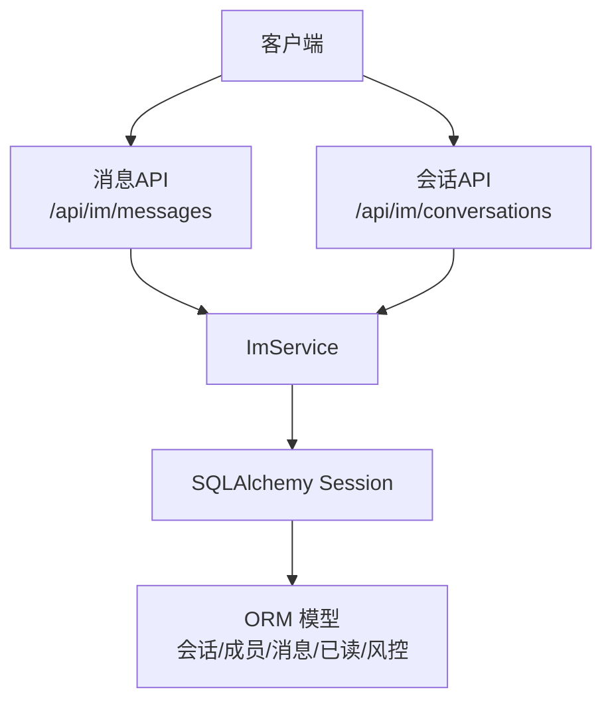
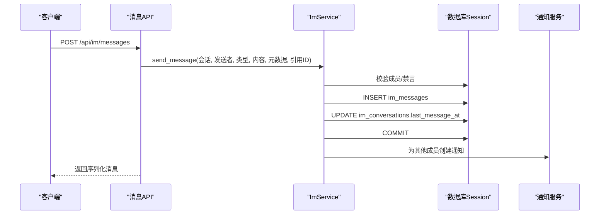
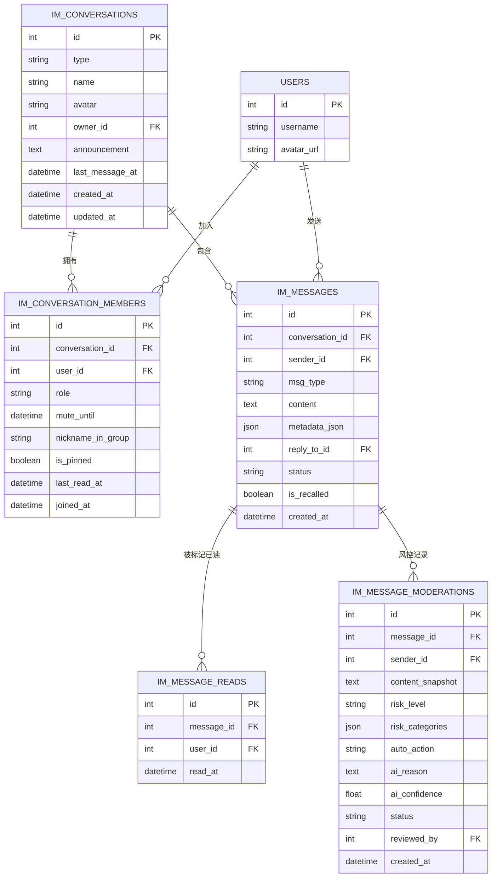
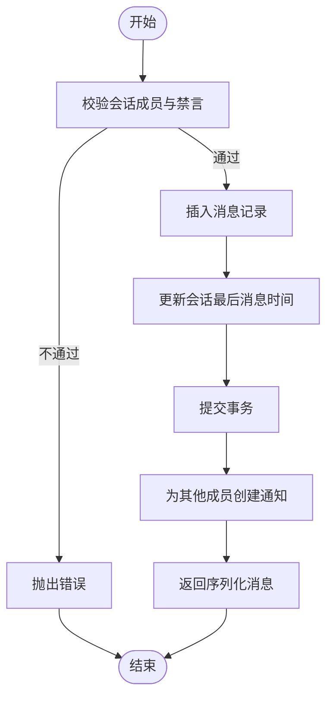
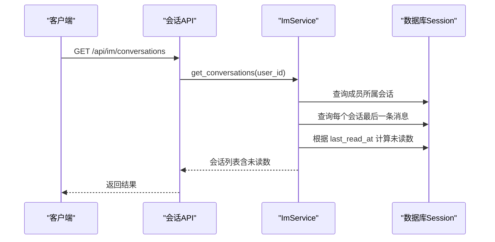
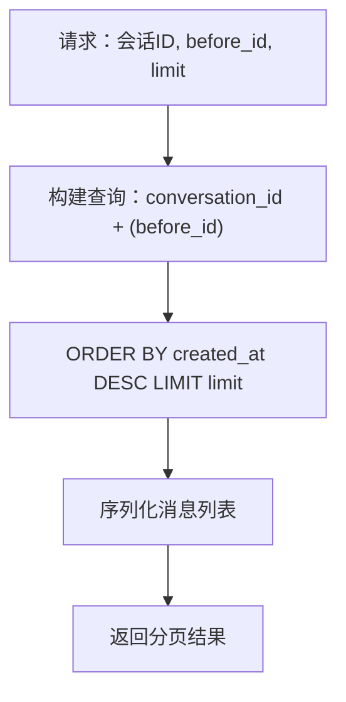
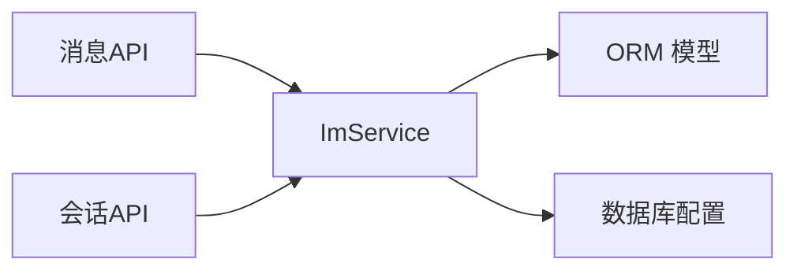

# 消息持久化

<cite>
**本文引用的文件**
- [im_messages.py](file://web/backend/api/im_messages.py)
- [im_conversations.py](file://web/backend/api/im_conversations.py)
- [im_service.py](file://web/backend/services/im_service.py)
- [models.py](file://web/backend/database/models.py)
- [database.py](file://web/backend/database/database.py)
</cite>

## 目录
1. [简介](#简介)
2. [项目结构](#项目结构)
3. [核心组件](#核心组件)
4. [架构总览](#架构总览)
5. [详细组件分析](#详细组件分析)
6. [依赖关系分析](#依赖关系分析)
7. [性能与容量规划](#性能与容量规划)
8. [故障排查指南](#故障排查指南)
9. [结论](#结论)
10. [附录](#附录)

## 简介
本技术文档聚焦于即时通讯（IM）消息的持久化实现，围绕存储结构设计、数据库表关系、索引优化与查询性能展开，并覆盖消息撤回、会话成员管理、已读状态追踪、风控记录等关键能力。同时给出批量写入、事务一致性、备份恢复、冷热数据分离与压缩策略的实践建议，帮助在现有 SQLite/SQLAlchemy 基础上进行扩展与优化。

## 项目结构
IM 消息相关代码主要分布在以下位置：
- API 层：提供发送消息、获取会话列表、拉取历史消息、标记已读、撤回消息等接口
- 服务层：封装会话创建、消息收发、好友请求、未读数计算等业务逻辑
- 数据模型层：定义会话、成员、消息、已读、风控等 ORM 模型及索引
- 数据库配置：连接引擎、会话工厂、SQLite 池策略与超时设置

图表来源
- [im_messages.py:41-78](file://web/backend/api/im_messages.py#L41-L78)
- [im_conversations.py:21-103](file://web/backend/api/im_conversations.py#L21-L103)
- [im_service.py:26-332](file://web/backend/services/im_service.py#L26-L332)
- [models.py:956-1058](file://web/backend/database/models.py#L956-L1058)

章节来源
- [im_messages.py:1-78](file://web/backend/api/im_messages.py#L1-L78)
- [im_conversations.py:1-103](file://web/backend/api/im_conversations.py#L1-L103)
- [im_service.py:1-419](file://web/backend/services/im_service.py#L1-L419)
- [models.py:937-1058](file://web/backend/database/models.py#L937-L1058)
- [database.py:1-46](file://web/backend/database/database.py#L1-L46)

## 核心组件
- 消息发送与撤回：通过 API 接收请求，调用服务层校验与会话成员权限检查，落库消息并更新会话最后消息时间；支持2分钟内撤回并替换内容
- 会话与成员：私聊会话自动创建或复用，成员表维护角色、禁言、置顶、最后阅读时间等
- 消息读取与未读数：基于成员 last_read_at 与消息 created_at 计算未读数量
- 风控与审计：消息风控表记录风险等级、类别、自动处置动作与审核状态
- 通知：消息发送后为其他成员创建站内通知

章节来源
- [im_messages.py:41-78](file://web/backend/api/im_messages.py#L41-L78)
- [im_conversations.py:21-103](file://web/backend/api/im_conversations.py#L21-L103)
- [im_service.py:32-332](file://web/backend/services/im_service.py#L32-L332)
- [models.py:956-1058](file://web/backend/database/models.py#L956-L1058)

## 架构总览
IM 消息持久化的端到端流程如下：

图表来源
- [im_messages.py:41-78](file://web/backend/api/im_messages.py#L41-L78)
- [im_service.py:215-286](file://web/backend/services/im_service.py#L215-L286)

## 详细组件分析

### 数据模型与表关系
- 会话（im_conversations）：区分私聊/群聊，维护名称、头像、群主、公告、最后消息时间
- 成员（im_conversation_members）：会话与用户多对多，包含角色、禁言截止时间、昵称、是否置顶、最后阅读时间
- 消息（im_messages）：会话内消息，包含发送者、类型、文本内容、JSON 元数据、引用消息ID、状态、是否撤回、创建时间
- 已读（im_message_reads）：消息级已读追踪（message_id, user_id 唯一）
- 风控（im_message_moderations）：消息风控记录，含风险等级、类别、自动处置、AI 原因与置信度、审核状态

图表来源
- [models.py:956-1058](file://web/backend/database/models.py#L956-L1058)

章节来源
- [models.py:956-1058](file://web/backend/database/models.py#L956-L1058)

### 消息发送与撤回流程
- 发送消息：校验会话成员与禁言状态，插入消息并更新会话最后消息时间，提交事务，随后为其他成员创建通知
- 撤回消息：仅允许发送者在2分钟内撤回，将 is_recalled 置为真并将内容替换为提示文案

图表来源
- [im_service.py:215-286](file://web/backend/services/im_service.py#L215-L286)
- [im_messages.py:41-78](file://web/backend/api/im_messages.py#L41-L78)

章节来源
- [im_service.py:215-286](file://web/backend/services/im_service.py#L215-L286)
- [im_messages.py:41-78](file://web/backend/api/im_messages.py#L41-L78)

### 会话列表与未读数计算
- 获取会话：按最近消息时间排序，关联成员信息
- 未读数：基于成员 last_read_at 与消息 created_at 过滤非本人且未被撤回的消息计数

图表来源
- [im_conversations.py:21-27](file://web/backend/api/im_conversations.py#L21-L27)
- [im_service.py:90-194](file://web/backend/services/im_service.py#L90-L194)

章节来源
- [im_conversations.py:21-27](file://web/backend/api/im_conversations.py#L21-L27)
- [im_service.py:90-194](file://web/backend/services/im_service.py#L90-L194)

### 消息分页加载
- 分页参数：before_id 与 limit
- 查询条件：按会话过滤，可选 before_id 限制，按创建时间倒序，限制条数

图表来源
- [im_service.py:288-313](file://web/backend/services/im_service.py#L288-L313)
- [im_conversations.py:45-61](file://web/backend/api/im_conversations.py#L45-L61)

章节来源
- [im_service.py:288-313](file://web/backend/services/im_service.py#L288-L313)
- [im_conversations.py:45-61](file://web/backend/api/im_conversations.py#L45-L61)

### 已读标记
- 接口：POST /api/im/conversations/{conversation_id}/read
- 行为：更新当前用户在会话中的 last_read_at 为当前时间

章节来源
- [im_conversations.py:64-81](file://web/backend/api/im_conversations.py#L64-L81)

### 消息风控与审核
- 风控表记录消息快照、风险等级、类别、自动处置动作、AI 原因与置信度、审核状态与审核人
- 用于后续人工审核与自动化处置

章节来源
- [models.py:1041-1058](file://web/backend/database/models.py#L1041-L1058)

## 依赖关系分析
- API 层依赖服务层：消息与会话接口均通过 ImService 执行业务逻辑
- 服务层依赖数据模型：使用 SQLAlchemy ORM 访问会话、成员、消息、已读、风控等表
- 数据库配置：使用 NullPool 避免 SQLite 在高并发下的连接池耗尽问题，写锁等待超时设置为15秒

图表来源
- [im_messages.py:41-78](file://web/backend/api/im_messages.py#L41-L78)
- [im_conversations.py:21-103](file://web/backend/api/im_conversations.py#L21-L103)
- [im_service.py:26-332](file://web/backend/services/im_service.py#L26-L332)
- [database.py:18-33](file://web/backend/database/database.py#L18-L33)

章节来源
- [database.py:18-33](file://web/backend/database/database.py#L18-L33)

## 性能与容量规划

### 索引与查询优化
- 会话-消息联合索引：im_messages 表上建立 (conversation_id, created_at) 复合索引，加速按会话分页与时间范围查询
- 会话列表排序：im_conversations.last_message_at 索引提升会话排序效率
- 成员查询：im_conversation_members 上对 conversation_id、user_id 建索引，提升成员权限校验与未读数计算
- 已读追踪：im_message_reads 上对 message_id、user_id 建唯一约束，避免重复标记

优化建议
- 对高频查询字段增加合适索引，避免全表扫描
- 分页查询尽量使用基于 ID 或时间的游标方式，减少深翻页开销
- 对 JSON 字段（如 metadata_json、risk_categories）进行必要结构化拆分，便于精确查询

章节来源
- [models.py:990-1005](file://web/backend/database/models.py#L990-L1005)
- [models.py:956-987](file://web/backend/database/models.py#L956-L987)
- [models.py:1028-1038](file://web/backend/database/models.py#L1028-L1038)

### 批量写入与事务管理
- 单条写入：当前 send_message 采用单条插入并在同一事务中更新会话最后消息时间
- 批量写入建议：
  - 使用 session.add_all 批量插入消息，再统一 commit
  - 对于高吞吐场景，可考虑分片会话或异步任务队列（如 Celery）处理通知与风控
- 事务一致性：确保消息插入与会话更新时间在同一事务内，失败回滚保证一致性

章节来源
- [im_service.py:215-286](file://web/backend/services/im_service.py#L215-L286)

### 数据一致性与幂等性
- 幂等键：可为消息生成业务唯一键（如 conversation_id + sender_id + timestamp_ms），防止重放
- 去重策略：在应用层或数据库层对重复请求进行拦截
- 并发安全：利用数据库唯一约束与行级锁避免重复写入

### 灾难恢复与备份恢复
- SQLite 备份：定期拷贝 subskin.db 文件或使用 WAL 模式进行热备
- 迁移与版本控制：使用 Alembic 管理数据库变更，确保升级与回滚路径清晰
- 恢复演练：定期执行恢复演练，验证备份可用性与恢复时长

章节来源
- [database.py:13-33](file://web/backend/database/database.py#L13-L33)

### 冷热数据分离与归档
- 热数据：近30天消息保留在主库，保障低延迟读取
- 冷数据：超过阈值的历史消息归档至只读库或对象存储，保留必要索引以支持审计与检索
- 归档策略：按会话或时间窗口分批迁移，归档后删除主库记录或标记不可见

### 压缩策略
- 文本压缩：对大段文本内容启用压缩存储（如 gzip），降低磁盘占用
- JSON 元数据：对冗余字段进行精简，必要时拆分为独立表以提升查询性能
- 媒体附件：图片/视频等二进制资源建议外存（对象存储），数据库仅保存 URL 与元数据

### 存储容量规划
- 估算指标：日新增消息量、平均消息大小、保留周期、峰值并发
- 容量公式：总容量 ≈ 日新增 × 保留天数 × 平均大小 × 膨胀系数
- 监控告警：对磁盘使用率、慢查询、锁等待进行监控与告警

[本节为通用指导，无需具体文件来源]

## 故障排查指南
- 发送频繁限制：API 层对每分钟发送次数进行限流，超限返回429
- 权限与禁言：服务层校验成员身份与禁言状态，非法操作抛出异常
- 撤回限制：仅允许2分钟内撤回，超时报错
- 数据库锁等待：SQLite 写锁竞争时可能阻塞，调整超时与并发策略

章节来源
- [im_messages.py:18-30](file://web/backend/api/im_messages.py#L18-L30)
- [im_service.py:224-238](file://web/backend/services/im_service.py#L224-L238)
- [im_service.py:315-331](file://web/backend/services/im_service.py#L315-L331)
- [database.py:19-30](file://web/backend/database/database.py#L19-L30)

## 结论
当前 IM 消息持久化方案基于 SQLAlchemy 与 SQLite，具备清晰的会话-成员-消息模型与必要的索引设计，支持消息发送、分页读取、已读标记与撤回等核心功能。建议在现有基础上引入批量写入、幂等控制、冷热数据分离与压缩策略，并结合 Alembic 完善版本管理与备份恢复流程，以满足更高吞吐与长期可运维性的需求。

## 附录

### 加密存储说明
- 现状：消息内容以明文存储在数据库中，未发现服务端加密实现
- 建议：
  - 对敏感字段（如 content、metadata_json）进行应用层加密（如 AES-GCM）
  - 密钥管理采用专用密钥管理服务（KMS），避免硬编码
  - 对日志与调试输出进行脱敏，防止敏感信息泄露

[本节为通用指导，无需具体文件来源]

### 版本控制与迁移
- 使用 Alembic 管理数据库变更，确保每次迁移可追溯、可回滚
- 对新增字段与索引进行充分测试，避免线上迁移失败

章节来源
- [database.py:13-33](file://web/backend/database/database.py#L13-L33)

### 删除策略
- 软删除：可通过标志位标记消息为“已删除”，对外隐藏但保留审计
- 硬删除：结合归档策略，对过期数据进行物理删除，释放存储空间
- 合规要求：遵循隐私法规，提供用户数据删除与导出能力

[本节为通用指导，无需具体文件来源]