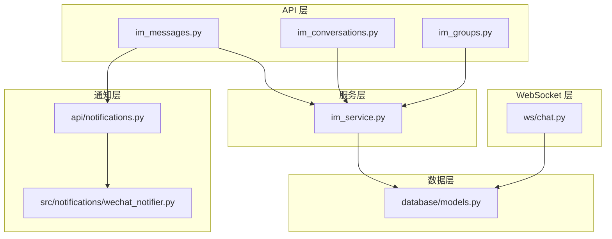
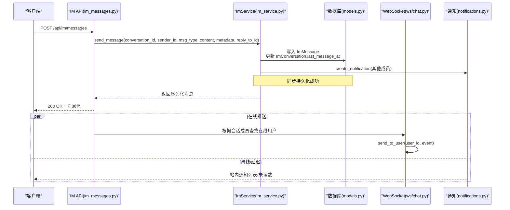
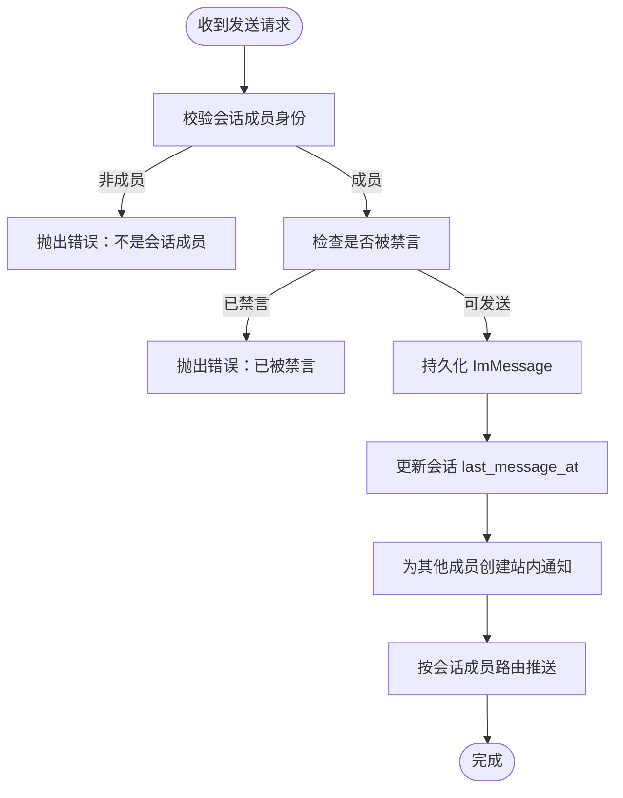
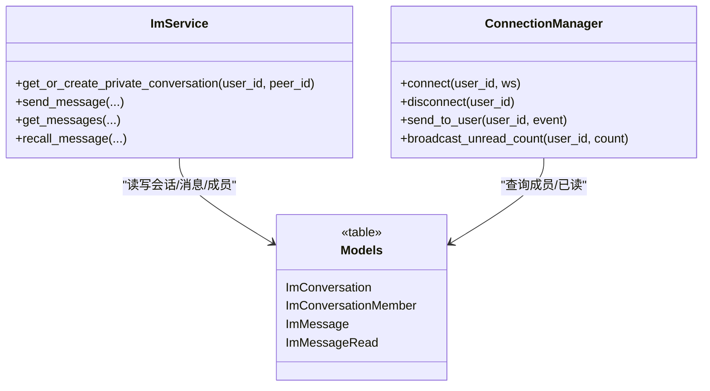
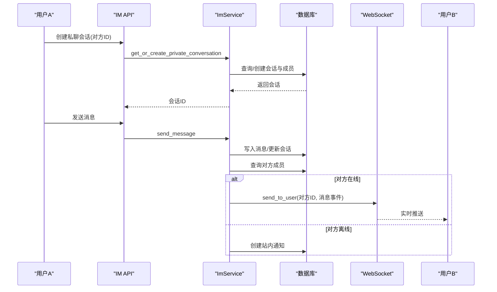
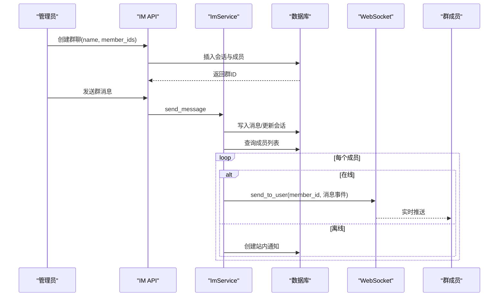
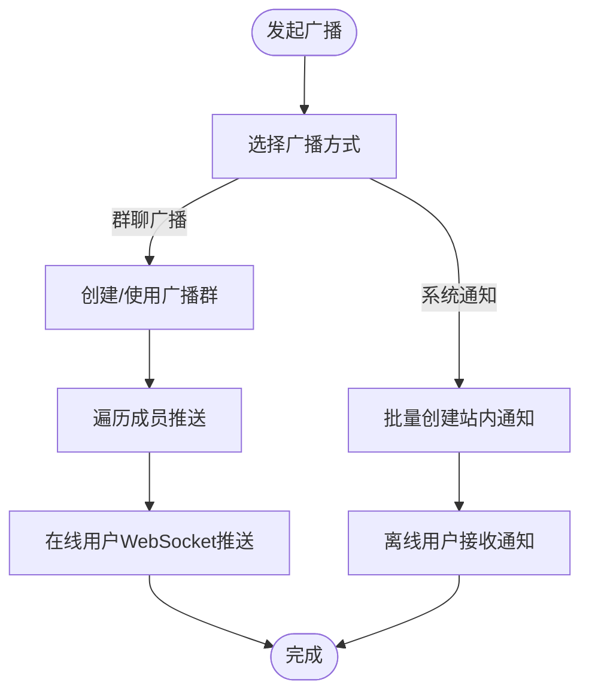
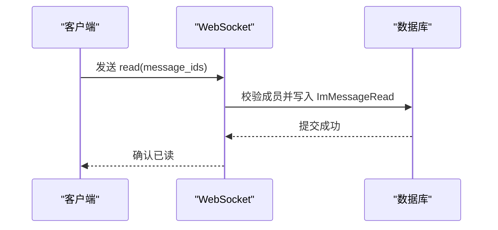
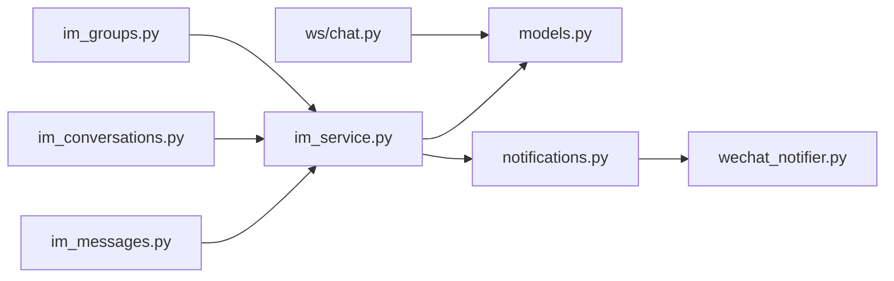

# 消息路由与分发

<cite>
**本文引用的文件**
- [web/backend/ws/chat.py](file://web/backend/ws/chat.py)
- [web/backend/api/im_messages.py](file://web/backend/api/im_messages.py)
- [web/backend/api/im_conversations.py](file://web/backend/api/im_conversations.py)
- [web/backend/api/im_groups.py](file://web/backend/api/im_groups.py)
- [web/backend/services/im_service.py](file://web/backend/services/im_service.py)
- [web/backend/database/models.py](file://web/backend/database/models.py)
- [web/backend/api/notifications.py](file://web/backend/api/notifications.py)
- [src/notifications/wechat_notifier.py](file://src/notifications/wechat_notifier.py)
</cite>

## 目录
1. [简介](#简介)
2. [项目结构](#项目结构)
3. [核心组件](#核心组件)
4. [架构总览](#架构总览)
5. [详细组件分析](#详细组件分析)
6. [依赖关系分析](#依赖关系分析)
7. [性能考虑](#性能考虑)
8. [故障排查指南](#故障排查指南)
9. [结论](#结论)
10. [附录](#附录)

## 简介
本技术文档围绕“消息路由与分发系统”展开，聚焦以下目标：
- 消息类型识别与路由规则配置
- 目标用户定位与消息转发机制
- 一对一、群组、广播消息的处理流程
- 与消息队列的集成、异步处理、负载均衡与水平扩展方案
- 消息优先级、重试机制、死信处理与监控告警的实现细节

当前代码库实现了基于 FastAPI 的 IM 能力（会话、消息、成员管理）、WebSocket 实时通道、站内通知以及外部微信通知。消息路由以“会话”为中心，通过数据库模型与业务服务完成目标用户定位与持久化；WebSocket 用于在线用户的实时推送与已读回执。

## 项目结构
与消息路由与分发相关的核心目录与职责如下：
- API 层：提供 HTTP 接口用于发送消息、管理会话与群聊、查询消息等
- 服务层：封装 IM 核心业务逻辑（会话创建、消息收发、撤回、好友系统等）
- WebSocket 层：维护在线连接、实现点对点推送与已读回执
- 数据层：定义会话、消息、成员、已读记录等 ORM 模型
- 通知层：站内通知与外部渠道（如微信）通知

图表来源
- [web/backend/api/im_messages.py:1-78](file://web/backend/api/im_messages.py#L1-L78)
- [web/backend/api/im_conversations.py:1-103](file://web/backend/api/im_conversations.py#L1-L103)
- [web/backend/api/im_groups.py:1-183](file://web/backend/api/im_groups.py#L1-L183)
- [web/backend/services/im_service.py:1-419](file://web/backend/services/im_service.py#L1-L419)
- [web/backend/ws/chat.py:1-111](file://web/backend/ws/chat.py#L1-L111)
- [web/backend/database/models.py:937-1039](file://web/backend/database/models.py#L937-L1039)
- [web/backend/api/notifications.py:1-186](file://web/backend/api/notifications.py#L1-L186)
- [src/notifications/wechat_notifier.py:1-216](file://src/notifications/wechat_notifier.py#L1-L216)

章节来源
- [web/backend/api/im_messages.py:1-78](file://web/backend/api/im_messages.py#L1-L78)
- [web/backend/api/im_conversations.py:1-103](file://web/backend/api/im_conversations.py#L1-L103)
- [web/backend/api/im_groups.py:1-183](file://web/backend/api/im_groups.py#L1-L183)
- [web/backend/services/im_service.py:1-419](file://web/backend/services/im_service.py#L1-L419)
- [web/backend/ws/chat.py:1-111](file://web/backend/ws/chat.py#L1-L111)
- [web/backend/database/models.py:937-1039](file://web/backend/database/models.py#L937-L1039)
- [web/backend/api/notifications.py:1-186](file://web/backend/api/notifications.py#L1-L186)
- [src/notifications/wechat_notifier.py:1-216](file://src/notifications/wechat_notifier.py#L1-L216)

## 核心组件
- 会话与成员管理：支持私聊与群聊，成员角色控制（owner/admin/member），禁言与置顶
- 消息收发：文本、媒体元数据、引用回复、撤回、状态流转（sent/delivered/read）
- 已读回执：WebSocket 上报已读，更新已读时间并计算未读数
- 通知体系：站内通知（UserNotification）与外部通知（WeChat）
- 速率限制：按用户维度限制每分钟消息发送次数，防止滥用

章节来源
- [web/backend/api/im_conversations.py:1-103](file://web/backend/api/im_conversations.py#L1-L103)
- [web/backend/api/im_groups.py:1-183](file://web/backend/api/im_groups.py#L1-L183)
- [web/backend/api/im_messages.py:1-78](file://web/backend/api/im_messages.py#L1-L78)
- [web/backend/services/im_service.py:1-419](file://web/backend/services/im_service.py#L1-L419)
- [web/backend/ws/chat.py:1-111](file://web/backend/ws/chat.py#L1-L111)
- [web/backend/api/notifications.py:1-186](file://web/backend/api/notifications.py#L1-L186)

## 架构总览
消息路由以“会话”为路由键，结合成员表确定目标用户集合；消息写入后生成站内通知，并通过 WebSocket 向在线用户推送。群聊场景下，所有成员均为目标用户；私聊场景下，仅对方为用户；广播消息可通过群聊或系统通知实现。

图表来源
- [web/backend/api/im_messages.py:41-63](file://web/backend/api/im_messages.py#L41-L63)
- [web/backend/services/im_service.py:215-286](file://web/backend/services/im_service.py#L215-L286)
- [web/backend/database/models.py:956-1005](file://web/backend/database/models.py#L956-L1005)
- [web/backend/ws/chat.py:14-42](file://web/backend/ws/chat.py#L14-L42)
- [web/backend/api/notifications.py:84-109](file://web/backend/api/notifications.py#L84-L109)

## 详细组件分析

### 消息类型识别与路由规则
- 消息类型：由 msg_type 标识（text/image/video/file/voice/system/share_post），在 ImMessage 中存储，便于后续解析与展示
- 路由规则：以 conversation_id 作为路由键，查询 ImConversationMember 获取目标用户集合；私聊自动去重，群聊包含全部成员
- 权限校验：发送前校验是否为会话成员，是否被禁言；读取消息需具备会话成员权限

图表来源
- [web/backend/services/im_service.py:215-286](file://web/backend/services/im_service.py#L215-L286)
- [web/backend/database/models.py:956-1005](file://web/backend/database/models.py#L956-L1005)

章节来源
- [web/backend/services/im_service.py:215-286](file://web/backend/services/im_service.py#L215-L286)
- [web/backend/database/models.py:956-1005](file://web/backend/database/models.py#L956-L1005)

### 目标用户定位与消息转发机制
- 私聊：通过 get_or_create_private_conversation 确保双方为成员，避免重复会话；发送时排除发送者本人
- 群聊：创建群会话并添加成员；发送时遍历所有成员进行推送
- 广播：可通过群聊或系统通知实现；当前代码通过群聊成员列表实现多目标推送
- 在线推送：ConnectionManager 维护 user_id -> WebSocket 映射，send_to_user 推送事件；离线则依赖站内通知

图表来源
- [web/backend/ws/chat.py:14-42](file://web/backend/ws/chat.py#L14-L42)
- [web/backend/services/im_service.py:32-88](file://web/backend/services/im_service.py#L32-L88)
- [web/backend/database/models.py:956-1039](file://web/backend/database/models.py#L956-L1039)

章节来源
- [web/backend/ws/chat.py:14-42](file://web/backend/ws/chat.py#L14-L42)
- [web/backend/services/im_service.py:32-88](file://web/backend/services/im_service.py#L32-L88)
- [web/backend/database/models.py:956-1039](file://web/backend/database/models.py#L956-L1039)

### 一对一消息处理流程
- 创建或获取私聊会话：确保双方为成员且未被拉黑
- 发送消息：校验成员与禁言状态，持久化消息并更新会话最后消息时间
- 通知与推送：为对方创建站内通知；若对方在线，通过 WebSocket 推送

图表来源
- [web/backend/api/im_conversations.py:29-42](file://web/backend/api/im_conversations.py#L29-L42)
- [web/backend/services/im_service.py:32-88](file://web/backend/services/im_service.py#L32-L88)
- [web/backend/services/im_service.py:215-286](file://web/backend/services/im_service.py#L215-L286)
- [web/backend/ws/chat.py:14-42](file://web/backend/ws/chat.py#L14-L42)

章节来源
- [web/backend/api/im_conversations.py:29-42](file://web/backend/api/im_conversations.py#L29-L42)
- [web/backend/services/im_service.py:32-88](file://web/backend/services/im_service.py#L32-L88)
- [web/backend/services/im_service.py:215-286](file://web/backend/services/im_service.py#L215-L286)
- [web/backend/ws/chat.py:14-42](file://web/backend/ws/chat.py#L14-L42)

### 群组消息处理流程
- 创建群聊：指定名称与初始成员，设置角色（owner/admin/member）
- 发送消息：校验成员与禁言，持久化消息并更新会话时间
- 推送策略：遍历除发送者外的所有成员进行推送；在线走 WebSocket，离线写站内通知

图表来源
- [web/backend/api/im_groups.py:24-48](file://web/backend/api/im_groups.py#L24-L48)
- [web/backend/services/im_service.py:215-286](file://web/backend/services/im_service.py#L215-L286)
- [web/backend/database/models.py:956-987](file://web/backend/database/models.py#L956-L987)

章节来源
- [web/backend/api/im_groups.py:24-48](file://web/backend/api/im_groups.py#L24-L48)
- [web/backend/services/im_service.py:215-286](file://web/backend/services/im_service.py#L215-L286)
- [web/backend/database/models.py:956-987](file://web/backend/database/models.py#L956-L987)

### 广播消息处理流程
- 当前实现通过群聊成员列表实现多目标推送，可作为广播的替代方案
- 系统级广播可通过站内通知批量创建，或通过专用广播会话（空成员或全平台成员）实现

图表来源
- [web/backend/api/im_groups.py:24-48](file://web/backend/api/im_groups.py#L24-L48)
- [web/backend/api/notifications.py:84-109](file://web/backend/api/notifications.py#L84-L109)

章节来源
- [web/backend/api/im_groups.py:24-48](file://web/backend/api/im_groups.py#L24-L48)
- [web/backend/api/notifications.py:84-109](file://web/backend/api/notifications.py#L84-L109)

### 已读回执与未读数计算
- 已读回执：WebSocket 上报 message_ids，服务端校验成员关系后写入 ImMessageRead
- 未读数：根据 last_read_at 与消息 created_at 计算会话内未读数量

图表来源
- [web/backend/ws/chat.py:58-105](file://web/backend/ws/chat.py#L58-L105)
- [web/backend/database/models.py:1028-1039](file://web/backend/database/models.py#L1028-L1039)

章节来源
- [web/backend/ws/chat.py:58-105](file://web/backend/ws/chat.py#L58-L105)
- [web/backend/database/models.py:1028-1039](file://web/backend/database/models.py#L1028-L1039)

### 消息撤回机制
- 限制：仅发送者可撤回，且在 120 秒内可撤回
- 行为：标记 is_recalled=True，内容替换为提示文案

章节来源
- [web/backend/services/im_service.py:315-331](file://web/backend/services/im_service.py#L315-L331)
- [web/backend/database/models.py:990-1005](file://web/backend/database/models.py#L990-L1005)

### 速率限制与防滥用
- 实现：按用户维度记录最近一分钟内的发送时间戳，超过阈值拒绝
- 目的：防止恶意刷屏与资源耗尽

章节来源
- [web/backend/api/im_messages.py:18-30](file://web/backend/api/im_messages.py#L18-L30)

### 通知与外部渠道
- 站内通知：create_notification 为其他成员创建通知，支持类型、标题、内容与关联对象
- 外部通知：WeChatNotifier 将简报写入文件供 Hermes 定时任务投递，或尝试通过 CLI 直接发送

章节来源
- [web/backend/api/notifications.py:84-109](file://web/backend/api/notifications.py#L84-L109)
- [src/notifications/wechat_notifier.py:55-106](file://src/notifications/wechat_notifier.py#L55-L106)

## 依赖关系分析
- API 层依赖服务层进行业务编排；服务层依赖数据库模型进行持久化
- WebSocket 层依赖认证服务验证连接，并访问数据库进行已读回执
- 通知模块被服务层调用，形成“消息→通知→推送”的链路

图表来源
- [web/backend/api/im_messages.py:1-78](file://web/backend/api/im_messages.py#L1-L78)
- [web/backend/api/im_conversations.py:1-103](file://web/backend/api/im_conversations.py#L1-L103)
- [web/backend/api/im_groups.py:1-183](file://web/backend/api/im_groups.py#L1-L183)
- [web/backend/services/im_service.py:1-419](file://web/backend/services/im_service.py#L1-L419)
- [web/backend/ws/chat.py:1-111](file://web/backend/ws/chat.py#L1-L111)
- [web/backend/database/models.py:937-1039](file://web/backend/database/models.py#L937-L1039)
- [web/backend/api/notifications.py:1-186](file://web/backend/api/notifications.py#L1-L186)
- [src/notifications/wechat_notifier.py:1-216](file://src/notifications/wechat_notifier.py#L1-L216)

章节来源
- [web/backend/api/im_messages.py:1-78](file://web/backend/api/im_messages.py#L1-L78)
- [web/backend/services/im_service.py:1-419](file://web/backend/services/im_service.py#L1-L419)
- [web/backend/ws/chat.py:1-111](file://web/backend/ws/chat.py#L1-L111)
- [web/backend/database/models.py:937-1039](file://web/backend/database/models.py#L937-L1039)
- [web/backend/api/notifications.py:1-186](file://web/backend/api/notifications.py#L1-L186)
- [src/notifications/wechat_notifier.py:1-216](file://src/notifications/wechat_notifier.py#L1-L216)

## 性能考虑
- 数据库索引：会话与消息按 conversation_id、created_at 建立索引，提升分页与排序性能
- 会话最后消息时间：减少重复查询，提高会话列表加载速度
- 未读数计算：基于 last_read_at 与消息时间范围过滤，避免全量扫描
- 速率限制：内存中按用户维度维护时间窗口，简单高效但需注意多实例一致性
- WebSocket 连接管理：内存中维护 active 连接，单实例有效；多实例需引入共享状态（如 Redis）

[本节为通用性能建议，不直接分析具体文件]

## 故障排查指南
- 发送失败：检查会话成员权限与禁言状态；查看速率限制是否触发
- 无法撤回：确认消息是否在 120 秒内且为本人发送
- 未读计数异常：核对 last_read_at 与消息 created_at；检查已读回执是否正确写入
- WebSocket 推送失败：检查连接是否存活；捕获异常后断开并重连
- 通知未送达：确认站内通知是否创建；外部渠道（微信）是否写入文件或 CLI 执行成功

章节来源
- [web/backend/api/im_messages.py:41-63](file://web/backend/api/im_messages.py#L41-L63)
- [web/backend/services/im_service.py:215-286](file://web/backend/services/im_service.py#L215-L286)
- [web/backend/ws/chat.py:58-111](file://web/backend/ws/chat.py#L58-L111)
- [src/notifications/wechat_notifier.py:55-106](file://src/notifications/wechat_notifier.py#L55-L106)

## 结论
当前系统以“会话”为核心实现消息路由与分发，支持一对一与群组消息，具备基本的已读回执与站内通知能力。WebSocket 提供在线实时推送，数据库模型保障数据一致性与查询效率。未来可扩展方向包括：
- 引入消息队列与异步处理，解耦发送与推送
- 增加消息优先级与重试机制，提升可靠性
- 实现死信队列与监控告警，增强可观测性
- 多实例下的连接状态共享与负载均衡

[本节为总结性内容，不直接分析具体文件]

## 附录
- 数据模型要点：
  - ImConversation：会话类型（private/group）、最后消息时间
  - ImConversationMember：成员角色、禁言时间、最后已读时间
  - ImMessage：消息类型、内容、元数据、引用、状态、撤回标记
  - ImMessageRead：消息已读追踪
  - UserNotification：站内通知类型、标题、内容、关联对象

章节来源
- [web/backend/database/models.py:956-1039](file://web/backend/database/models.py#L956-L1039)
- [web/backend/api/notifications.py:23-42](file://web/backend/api/notifications.py#L23-L42)