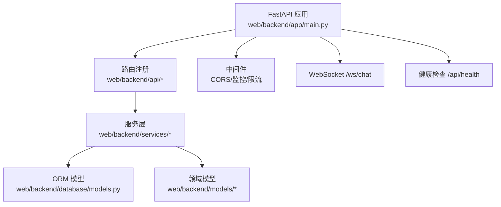
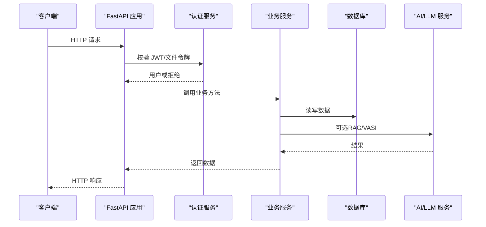
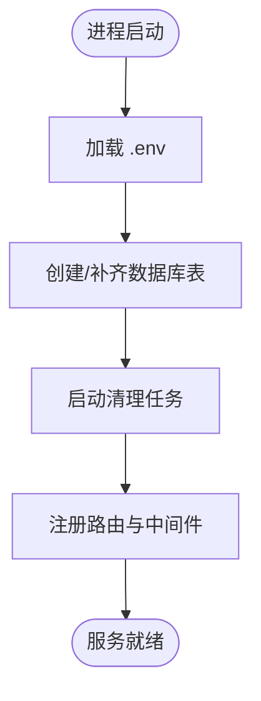
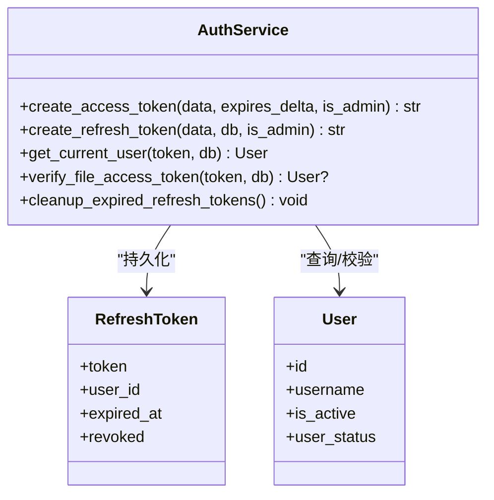
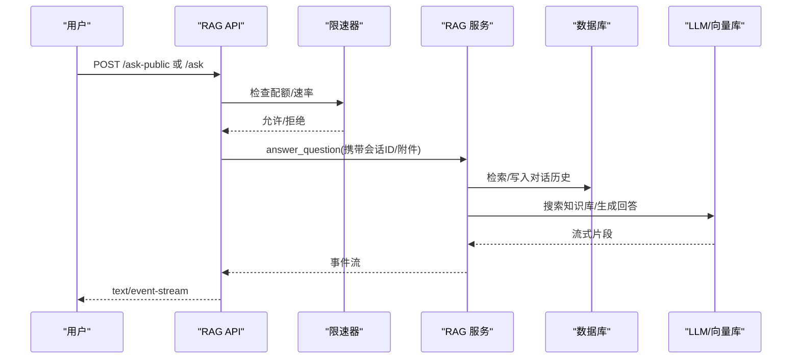
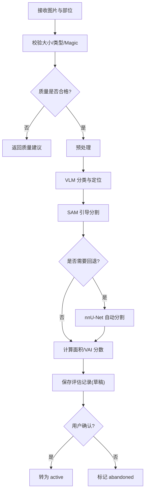
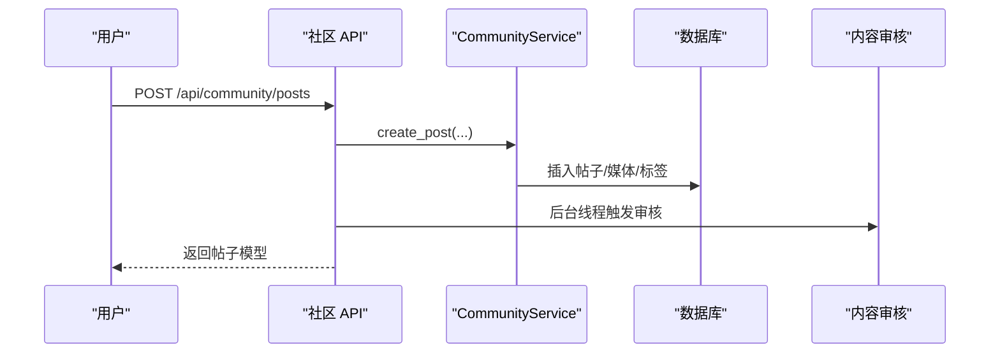
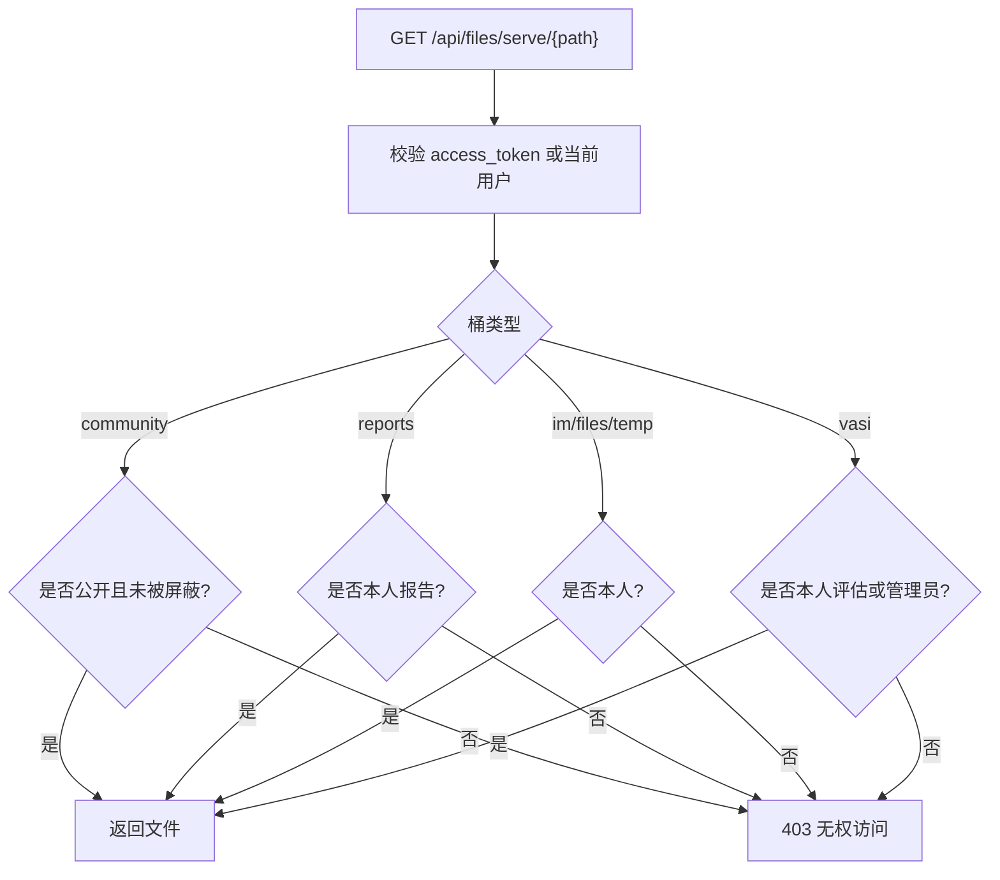
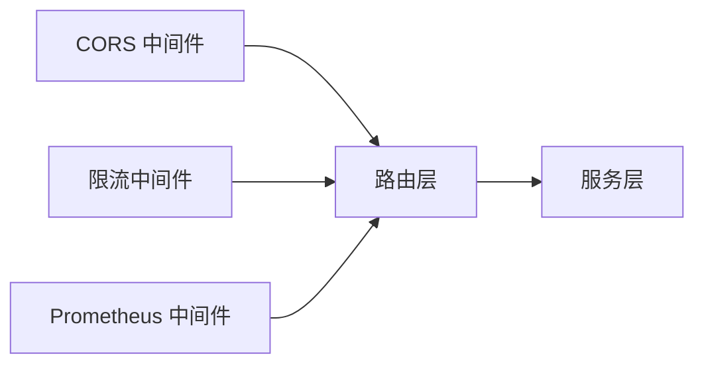
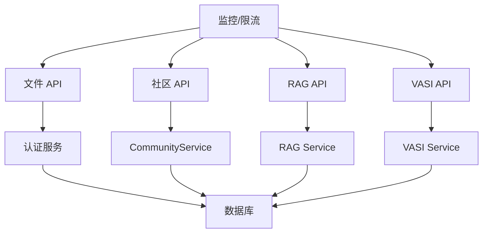

# 后端服务

<cite>
**本文引用的文件**
- [web/backend/app/main.py](file://web/backend/app/main.py)
- [web/backend/exceptions.py](file://web/backend/exceptions.py)
- [web/backend/database/models.py](file://web/backend/database/models.py)
- [web/backend/services/auth.py](file://web/backend/services/auth.py)
- [web/backend/api/community.py](file://web/backend/api/community.py)
- [web/backend/services/vasi.py](file://web/backend/services/vasi.py)
- [web/backend/api/rag.py](file://web/backend/api/rag.py)
- [web/backend/api/files.py](file://web/backend/api/files.py)
- [web/backend/app/middleware/rate_limit.py](file://web/backend/app/middleware/rate_limit.py)
- [web/backend/database/database.py](file://web/backend/database/database.py)
- [web/backend/services/community.py](file://web/backend/services/community.py)
- [web/backend/services/rag.py](file://web/backend/services/rag.py)
- [web/backend/models/vasi.py](file://web/backend/models/vasi.py)
- [web/backend/services/monitoring.py](file://web/backend/services/monitoring.py)
</cite>

## 目录
1. [简介](#简介)
2. [项目结构](#项目结构)
3. [核心组件](#核心组件)
4. [架构总览](#架构总览)
5. [详细组件分析](#详细组件分析)
6. [依赖关系分析](#依赖关系分析)
7. [性能与缓存策略](#性能与缓存策略)
8. [故障排查指南](#故障排查指南)
9. [结论](#结论)
10. [附录：API 设计原则与最佳实践](#附录api-设计原则与最佳实践)

## 简介
本文件为 Subskin 后端服务的全面技术文档，聚焦 FastAPI 应用架构、分层设计、中间件机制、异常处理与日志记录；深入解析用户认证、AI 问答（RAG）、VASI 评估、社区内容与文件管理等核心模块。同时给出 API 设计原则、数据验证、权限控制、缓存策略与性能优化建议，并提供可追溯的代码片段路径与图示说明。

## 项目结构
后端采用“路由层（API）—服务层（Services）—数据模型（ORM）”的分层架构，配合中间件实现跨切面能力（CORS、限流、监控）。启动时完成数据库表结构补齐、定时任务初始化与 LLM 配置预热。

**图表来源**
- [web/backend/app/main.py:264-349](file://web/backend/app/main.py#L264-L349)
- [web/backend/app/middleware/rate_limit.py:10-36](file://web/backend/app/middleware/rate_limit.py#L10-L36)
- [web/backend/database/database.py:17-33](file://web/backend/database/database.py#L17-L33)

**章节来源**
- [web/backend/app/main.py:264-349](file://web/backend/app/main.py#L264-L349)
- [web/backend/database/database.py:17-33](file://web/backend/database/database.py#L17-L33)

## 核心组件
- 应用入口与生命周期管理：加载环境变量、创建数据库表、注册路由、启用 CORS、初始化监控与 LLM 配置、清理临时文件与刷新令牌。
- 认证与授权：JWT 访问令牌、刷新令牌、文件专用短时效令牌、WebSocket 鉴权、封禁状态拦截。
- 社区服务：帖子 CRUD、评论、点赞、收藏、标签、推荐流、内容安全审核、审计日志。
- AI 问答（RAG）：访客/登录用户提问、流式响应、附件上传与解析、会话归属校验、访客配额与聊天限速。
- VASI 评估：图像质量检查、预处理、VLM+SAM 分割、nnU-Net 回退、趋势统计、草稿确认/放弃、删除保护。
- 文件服务：统一鉴权、路径白名单、桶级访问控制、PDF 分页预览、HTML 查看器、临时文件清理。
- 监控与可观测性：Sentry 错误追踪、Prometheus 指标采集、请求耗时与并发度量。

**章节来源**
- [web/backend/app/main.py:228-349](file://web/backend/app/main.py#L228-L349)
- [web/backend/services/auth.py:1-309](file://web/backend/services/auth.py#L1-L309)
- [web/backend/api/community.py:1-800](file://web/backend/api/community.py#L1-L800)
- [web/backend/services/vasi.py:1-800](file://web/backend/services/vasi.py#L1-L800)
- [web/backend/api/rag.py:1-800](file://web/backend/api/rag.py#L1-L800)
- [web/backend/api/files.py:1-503](file://web/backend/api/files.py#L1-L503)
- [web/backend/services/monitoring.py:1-200](file://web/backend/services/monitoring.py#L1-L200)

## 架构总览
系统以 FastAPI 为核心，通过中间件提供横切能力，API 路由调用服务层完成业务编排，服务层通过 ORM 访问数据库并调用外部 AI 服务。关键流程包括：
- 启动阶段：确保数据库字段存在、启动清理任务、初始化 LLM 配置。
- 请求阶段：CORS → 鉴权 → 限流 → 业务逻辑 → 审计/通知 → 响应。
- 异步与流式：RAG 流式 SSE、WS 聊天、后台线程执行内容审核。

**图表来源**
- [web/backend/app/main.py:264-349](file://web/backend/app/main.py#L264-L349)
- [web/backend/services/auth.py:179-251](file://web/backend/services/auth.py#L179-L251)
- [web/backend/api/rag.py:246-330](file://web/backend/api/rag.py#L246-L330)
- [web/backend/services/vasi.py:159-243](file://web/backend/services/vasi.py#L159-L243)

## 详细组件分析

### 应用启动与生命周期
- 环境变量加载、数据库表结构补齐（含 VASI、图片标注、医疗报告等字段）。
- 启动清理任务：临时上传清理、过期刷新令牌清理（每 24 小时）。
- 注册路由与中间件：CORS、监控（Sentry/Prometheus）、LLM 配置初始化。
- WebSocket 端点与健康检查。

**图表来源**
- [web/backend/app/main.py:18-21](file://web/backend/app/main.py#L18-L21)
- [web/backend/app/main.py:74-191](file://web/backend/app/main.py#L74-L191)
- [web/backend/app/main.py:228-349](file://web/backend/app/main.py#L228-L349)

**章节来源**
- [web/backend/app/main.py:18-21](file://web/backend/app/main.py#L18-L21)
- [web/backend/app/main.py:74-191](file://web/backend/app/main.py#L74-L191)
- [web/backend/app/main.py:228-349](file://web/backend/app/main.py#L228-L349)

### 用户认证系统
- 支持用户名/邮箱/手机号登录，密码哈希校验。
- 访问令牌与刷新令牌分离，管理员令牌更长有效期。
- 文件专用短时效令牌，限制仅用于文件读取。
- WebSocket 鉴权兼容历史 token 格式。
- 封禁账号在依赖层直接返回 403，便于前端提示原因。

**图表来源**
- [web/backend/services/auth.py:43-127](file://web/backend/services/auth.py#L43-L127)
- [web/backend/services/auth.py:179-251](file://web/backend/services/auth.py#L179-L251)
- [web/backend/database/models.py:75-137](file://web/backend/database/models.py#L75-L137)

**章节来源**
- [web/backend/services/auth.py:1-309](file://web/backend/services/auth.py#L1-L309)
- [web/backend/database/models.py:75-137](file://web/backend/database/models.py#L75-L137)

### AI 问答服务（RAG）
- 访客每日限额与登录用户按用户限速，防止滥用。
- 访客问题主题过滤（白癜风/皮肤健康），危机消息放行以便提供心理援助。
- 会话所有权校验，防止跨用户注入或删除后仍可读。
- 流式 SSE 响应，分阶段输出思考过程与动作卡片（VASI 分析、报告解读、日记草稿）。
- 临时文件上传与归属校验，确认后迁移到正式存储。

**图表来源**
- [web/backend/api/rag.py:246-330](file://web/backend/api/rag.py#L246-L330)
- [web/backend/api/rag.py:534-629](file://web/backend/api/rag.py#L534-L629)
- [web/backend/app/middleware/rate_limit.py:29-36](file://web/backend/app/middleware/rate_limit.py#L29-L36)

**章节来源**
- [web/backend/api/rag.py:1-800](file://web/backend/api/rag.py#L1-L800)
- [web/backend/services/rag.py:1-200](file://web/backend/services/rag.py#L1-L200)
- [web/backend/app/middleware/rate_limit.py:29-36](file://web/backend/app/middleware/rate_limit.py#L29-L36)

### VASI 评估服务
- 输入校验：大小、类型、Magic Byte 校验，防止伪造文件进入 AI 管线。
- 质量检查：低质量照片直接反馈改进建议，避免浪费 AI 成本。
- 识别流程：预处理 → VLM 分类与定位 → SAM 引导分割 → nnU-Net 回退 → 计算面积与 VASI 分数。
- 结果落库：草稿状态需用户确认后才生效；支持趋势统计、批量删除保护。
- 安全：删除时保留元数据至 ImageLabel，防止误删导致训练数据丢失。

**图表来源**
- [web/backend/services/vasi.py:159-243](file://web/backend/services/vasi.py#L159-L243)
- [web/backend/services/vasi.py:539-800](file://web/backend/services/vasi.py#L539-L800)
- [web/backend/models/vasi.py:26-105](file://web/backend/models/vasi.py#L26-L105)

**章节来源**
- [web/backend/services/vasi.py:1-800](file://web/backend/services/vasi.py#L1-L800)
- [web/backend/models/vasi.py:1-200](file://web/backend/models/vasi.py#L1-L200)

### 社区服务
- 帖子与评论：支持多类型内容（文本/图片/视频/音频/附件）、标签、收藏、版本历史、书签。
- 推荐流：基于用户行为与地理位置的个性化推荐。
- 安全与合规：夸张宣称检测、内容审核（后台线程）、审计日志。
- 权限控制：私密帖子仅作者可见，被屏蔽内容对非作者不可见。

**图表来源**
- [web/backend/api/community.py:219-293](file://web/backend/api/community.py#L219-L293)
- [web/backend/services/community.py:136-200](file://web/backend/services/community.py#L136-L200)

**章节来源**
- [web/backend/api/community.py:1-800](file://web/backend/api/community.py#L1-L800)
- [web/backend/services/community.py:1-200](file://web/backend/services/community.py#L1-L200)

### 文件管理服务
- 统一鉴权：优先使用文件专用短时效令牌，兼容通用访问令牌。
- 路径白名单与桶级控制：avatar/community/reports/files/im/temp/vasi 等桶分别校验。
- PDF 分页预览与 HTML 查看器：内置模板渲染，防 XSS 转义文件名。
- 临时文件清理：支持按用户归属校验与批量清理。

**图表来源**
- [web/backend/api/files.py:72-227](file://web/backend/api/files.py#L72-L227)
- [web/backend/api/files.py:293-331](file://web/backend/api/files.py#L293-L331)

**章节来源**
- [web/backend/api/files.py:1-503](file://web/backend/api/files.py#L1-L503)

### 中间件机制
- CORS：根据环境动态允许域名，生产模式仅允许生产域名。
- 限流：读接口按 IP，写接口按用户 ID（或 IP 回退），聊天接口按用户 ID（或 IP 回退）。
- 监控：Sentry 错误追踪与 Prometheus 指标收集（请求数、耗时、并发）。

**图表来源**
- [web/backend/app/main.py:271-278](file://web/backend/app/main.py#L271-L278)
- [web/backend/app/middleware/rate_limit.py:29-36](file://web/backend/app/middleware/rate_limit.py#L29-L36)
- [web/backend/services/monitoring.py:96-172](file://web/backend/services/monitoring.py#L96-L172)

**章节来源**
- [web/backend/app/middleware/rate_limit.py:1-96](file://web/backend/app/middleware/rate_limit.py#L1-L96)
- [web/backend/services/monitoring.py:1-200](file://web/backend/services/monitoring.py#L1-L200)

## 依赖关系分析
- 路由层依赖服务层进行业务编排，服务层依赖 ORM 模型与领域模型。
- 认证服务被多个路由复用，提供统一的鉴权能力。
- 文件服务与社区、VASI、RAG 共享存储与鉴权逻辑。
- 监控与限流作为横切关注点，贯穿整个请求链路。

**图表来源**
- [web/backend/api/community.py:1-800](file://web/backend/api/community.py#L1-L800)
- [web/backend/api/rag.py:1-800](file://web/backend/api/rag.py#L1-L800)
- [web/backend/services/vasi.py:1-800](file://web/backend/services/vasi.py#L1-L800)
- [web/backend/api/files.py:1-503](file://web/backend/api/files.py#L1-L503)
- [web/backend/services/auth.py:1-309](file://web/backend/services/auth.py#L1-L309)

**章节来源**
- [web/backend/api/community.py:1-800](file://web/backend/api/community.py#L1-L800)
- [web/backend/api/rag.py:1-800](file://web/backend/api/rag.py#L1-L800)
- [web/backend/services/vasi.py:1-800](file://web/backend/services/vasi.py#L1-L800)
- [web/backend/api/files.py:1-503](file://web/backend/api/files.py#L1-L503)
- [web/backend/services/auth.py:1-309](file://web/backend/services/auth.py#L1-L309)

## 性能与缓存策略
- 数据库连接池：SQLite 使用 NullPool 避免并发阻塞，提升突发流量稳定性。
- 社区列表：批量转换避免 N+1 查询，减少数据库往返。
- 访客 IP 地理定位：内存缓存 TTL 1 小时，降低第三方 API 调用。
- 聊天限速：按用户维度限流，防止 LLM 成本滥用。
- 临时文件清理：启动时与定时任务清理，避免磁盘膨胀。
- 监控：Prometheus 指标用于容量规划与瓶颈定位。

**章节来源**
- [web/backend/database/database.py:17-33](file://web/backend/database/database.py#L17-L33)
- [web/backend/api/community.py:345-353](file://web/backend/api/community.py#L345-L353)
- [web/backend/api/community.py:64-145](file://web/backend/api/community.py#L64-L145)
- [web/backend/app/middleware/rate_limit.py:29-36](file://web/backend/app/middleware/rate_limit.py#L29-L36)
- [web/backend/services/monitoring.py:96-172](file://web/backend/services/monitoring.py#L96-L172)

## 故障排查指南
- 认证失败：检查 JWT 签名、过期时间、用户状态（封禁/未激活）。
- 文件访问 401/403：确认 access_token 是否为文件专用令牌，路径是否在白名单内，桶级权限是否满足。
- 社区发布失败：检查用户状态（封禁/禁言）、内容安全审核是否触发、审计日志是否写入。
- VASI 评估失败：检查图片质量、Magic Byte 校验、VLM/SAM 可用性、nnU-Net 回退路径。
- 监控缺失：确认 Sentry DSN 与 Prometheus 开关环境变量是否正确设置。

**章节来源**
- [web/backend/services/auth.py:179-251](file://web/backend/services/auth.py#L179-L251)
- [web/backend/api/files.py:72-227](file://web/backend/api/files.py#L72-L227)
- [web/backend/api/community.py:219-293](file://web/backend/api/community.py#L219-L293)
- [web/backend/services/vasi.py:539-800](file://web/backend/services/vasi.py#L539-L800)
- [web/backend/services/monitoring.py:28-63](file://web/backend/services/monitoring.py#L28-L63)

## 结论
Subskin 后端以 FastAPI 为核心，采用清晰的分层架构与完善的中间件体系，实现了用户认证、AI 问答、VASI 评估、社区内容与文件管理的完整闭环。通过严格的输入校验、权限控制、限流与监控，系统在安全性、可用性与可维护性方面具备良好基础。后续可进一步引入分布式缓存、异步任务队列与更细粒度的权限模型，以支撑更大规模的用户增长与功能扩展。

## 附录：API 设计原则与最佳实践
- 统一鉴权：所有受保护接口通过依赖注入获取当前用户，文件接口支持短时效令牌。
- 数据验证：请求体使用 Pydantic 模型，服务端二次校验（如 VASI 图片 Magic Byte）。
- 权限控制：桶级与资源级双重校验，敏感操作记录审计日志。
- 限流与配额：读/写/聊天分别限流，访客按指纹计数，登录用户按用户 ID 限流。
- 缓存策略：内存缓存热点数据（如 IP 地理信息），合理 TTL 与失效策略。
- 性能优化：批量转换、索引优化、避免 N+1 查询、流式响应降低首屏延迟。
- 可观测性：Sentry 捕获异常，Prometheus 采集指标，便于问题定位与容量规划。

**章节来源**
- [web/backend/services/auth.py:179-251](file://web/backend/services/auth.py#L179-L251)
- [web/backend/services/vasi.py:539-571](file://web/backend/services/vasi.py#L539-L571)
- [web/backend/api/files.py:72-227](file://web/backend/api/files.py#L72-L227)
- [web/backend/app/middleware/rate_limit.py:29-36](file://web/backend/app/middleware/rate_limit.py#L29-L36)
- [web/backend/api/community.py:64-145](file://web/backend/api/community.py#L64-L145)
- [web/backend/services/monitoring.py:96-172](file://web/backend/services/monitoring.py#L96-L172)