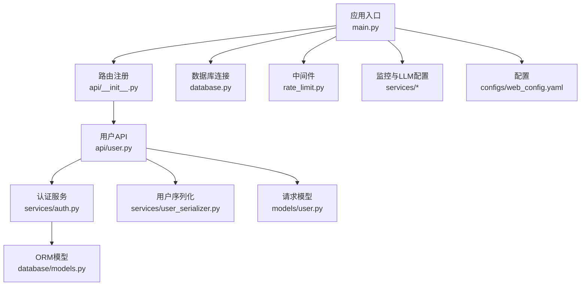
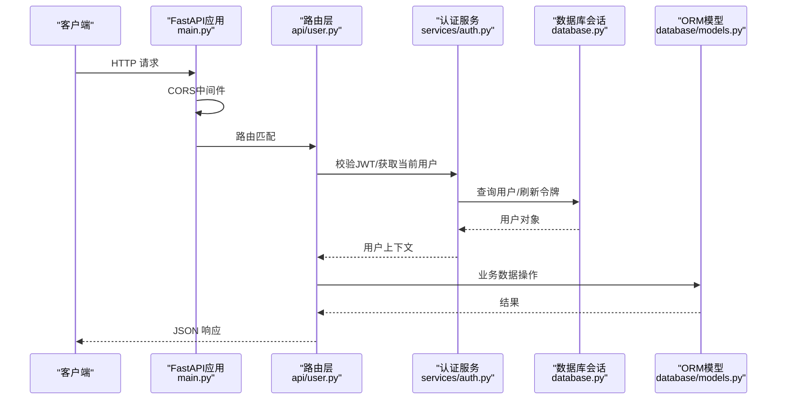
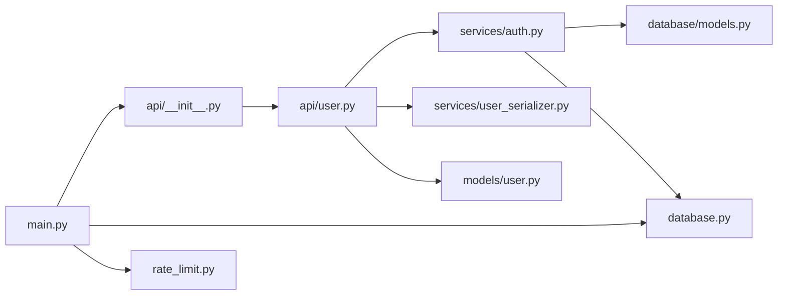

# 后端架构设计

<cite>
**本文引用的文件**   
- [web/backend/app/main.py](file://web/backend/app/main.py)
- [web/backend/api/__init__.py](file://web/backend/api/__init__.py)
- [web/backend/database/database.py](file://web/backend/database/database.py)
- [web/backend/services/auth.py](file://web/backend/services/auth.py)
- [web/backend/api/user.py](file://web/backend/api/user.py)
- [web/backend/app/middleware/rate_limit.py](file://web/backend/app/middleware/rate_limit.py)
- [web/backend/exceptions.py](file://web/backend/exceptions.py)
- [web/backend/services/user_serializer.py](file://web/backend/services/user_serializer.py)
- [web/backend/models/user.py](file://web/backend/models/user.py)
- [web/backend/database/models.py](file://web/backend/database/models.py)
- [configs/web_config.yaml](file://configs/web_config.yaml)
</cite>

## 目录
1. [简介](#简介)
2. [项目结构](#项目结构)
3. [核心组件](#核心组件)
4. [架构总览](#架构总览)
5. [详细组件分析](#详细组件分析)
6. [依赖关系分析](#依赖关系分析)
7. [性能考量](#性能考量)
8. [故障排查指南](#故障排查指南)
9. [结论](#结论)
10. [附录：扩展新服务模块最佳实践](#附录扩展新服务模块最佳实践)

## 简介
本文件为 Subskin 后端（FastAPI）的架构设计与实现说明，覆盖整体架构、分层模式（API层、服务层、数据访问层）、中间件机制（CORS、认证、限流）、生命周期管理、异常处理策略与日志记录系统。文档还包含应用启动流程、路由注册机制、依赖注入模式与配置管理的详细说明，并提供扩展新服务模块的实践指导与示例路径。

## 项目结构
Subskin 后端采用清晰的模块化组织方式：
- 应用入口与生命周期：位于 web/backend/app/main.py，负责 FastAPI 实例创建、中间件注册、路由挂载、监控初始化、数据库表结构保障等。
- API 路由层：位于 web/backend/api/*，按业务域拆分路由模块，统一在入口中集中注册。
- 服务层：位于 web/backend/services/*，封装领域逻辑（如认证、短信、邮件、RAG、VASI 等）。
- 数据访问层：位于 web/backend/database/*，提供 SQLAlchemy 引擎、会话工厂与 ORM 模型定义。
- 中间件与工具：位于 web/backend/app/middleware/* 与 utils/*，提供限流、时间工具、UID 生成等能力。
- 配置：通过环境变量与 YAML 配置文件统一管理。

图表来源 
- [web/backend/app/main.py:264-349](file://web/backend/app/main.py#L264-L349)
- [web/backend/api/__init__.py:1-62](file://web/backend/api/__init__.py#L1-L62)
- [web/backend/database/database.py:1-46](file://web/backend/database/database.py#L1-L46)
- [web/backend/app/middleware/rate_limit.py:1-96](file://web/backend/app/middleware/rate_limit.py#L1-L96)
- [web/backend/services/auth.py:1-309](file://web/backend/services/auth.py#L1-L309)
- [web/backend/services/user_serializer.py:1-54](file://web/backend/services/user_serializer.py#L1-L54)
- [web/backend/models/user.py:1-138](file://web/backend/models/user.py#L1-L138)
- [web/backend/database/models.py:1-200](file://web/backend/database/models.py#L1-L200)
- [configs/web_config.yaml:1-284](file://configs/web_config.yaml#L1-L284)

章节来源
- [web/backend/app/main.py:264-349](file://web/backend/app/main.py#L264-L349)
- [web/backend/api/__init__.py:1-62](file://web/backend/api/__init__.py#L1-L62)
- [web/backend/database/database.py:1-46](file://web/backend/database/database.py#L1-L46)
- [configs/web_config.yaml:1-284](file://configs/web_config.yaml#L1-L284)

## 核心组件
- 应用入口与生命周期管理
  - FastAPI 实例创建、lifespan 钩子用于启动时清理临时上传、定时清理刷新令牌、初始化监控与 LLM 配置、修复 datetime 序列化问题。
  - 健康检查端点 /api/health。
- 中间件机制
  - CORS：根据环境动态允许源，支持生产与开发差异。
  - 限流：基于进程内令牌桶的读/写/聊天接口限流，按 IP 或用户 ID 区分。
- 认证与授权
  - JWT 访问令牌与刷新令牌，支持管理员长时效令牌；WebSocket 鉴权；可选当前用户解析。
- 数据访问层
  - SQLAlchemy 引擎与会话工厂，SQLite 使用 NullPool 避免并发阻塞；通用 get_db 依赖注入。
- 模型与序列化
  - Pydantic 请求/响应模型；用户数据序列化器对敏感字段进行脱敏控制。

章节来源
- [web/backend/app/main.py:228-349](file://web/backend/app/main.py#L228-L349)
- [web/backend/app/middleware/rate_limit.py:1-96](file://web/backend/app/middleware/rate_limit.py#L1-L96)
- [web/backend/services/auth.py:1-309](file://web/backend/services/auth.py#L1-L309)
- [web/backend/database/database.py:1-46](file://web/backend/database/database.py#L1-L46)
- [web/backend/services/user_serializer.py:1-54](file://web/backend/services/user_serializer.py#L1-L54)
- [web/backend/models/user.py:1-138](file://web/backend/models/user.py#L1-L138)

## 架构总览
下图展示从客户端到数据库的完整调用链，包括认证、限流、服务层与数据访问层的交互。

图表来源 
- [web/backend/app/main.py:264-349](file://web/backend/app/main.py#L264-L349)
- [web/backend/api/user.py:1-200](file://web/backend/api/user.py#L1-L200)
- [web/backend/services/auth.py:1-309](file://web/backend/services/auth.py#L1-L309)
- [web/backend/database/database.py:1-46](file://web/backend/database/database.py#L1-L46)
- [web/backend/database/models.py:1-200](file://web/backend/database/models.py#L1-L200)

## 详细组件分析

### 应用入口与生命周期（main.py）
- 启动阶段
  - 加载 .env 环境变量。
  - 确保数据库表结构与必要列存在（幂等迁移）。
  - 创建上传目录。
  - 配置 CORS 允许源（生产/开发差异化）。
  - 注册所有 API 路由。
  - 初始化监控（Sentry + Prometheus 可选）。
  - 初始化 LLM 配置并执行密钥重加密。
  - 修复 datetime 序列化无时区后缀导致的前端偏移。
- 生命周期钩子
  - lifespan：启动时清理临时上传、启动后台任务清理刷新令牌；关闭时取消任务。
- WebSocket
  - /ws/chat 接入聊天 WebSocket 端点。
- 健康检查
  - /api/health 返回服务状态。

章节来源
- [web/backend/app/main.py:1-349](file://web/backend/app/main.py#L1-L349)

### 路由注册机制（api/__init__.py）
- 集中导入各业务路由模块，便于 main.py 统一 include_router。
- 暴露 vasi_router 供外部引用。
- 保持路由命名空间清晰，便于前端对接。

章节来源
- [web/backend/api/__init__.py:1-62](file://web/backend/api/__init__.py#L1-L62)

### 数据访问层（database.py）
- 引擎与会话
  - SQLite：使用 NullPool 避免并发阻塞，设置 connect_args 与 timeout。
  - 其他数据库：启用 pool_pre_ping 保证连接健康。
- 依赖注入
  - get_db() 作为 FastAPI 依赖，自动管理会话生命周期。

章节来源
- [web/backend/database/database.py:1-46](file://web/backend/database/database.py#L1-L46)

### 认证服务（services/auth.py）
- 令牌体系
  - 访问令牌：短效，支持管理员长时效。
  - 刷新令牌：持久化存储，支持撤销与批量撤销。
  - 文件专用令牌：仅允许文件读取，作用域受限。
- 用户验证
  - 支持用户名/手机号/邮箱登录。
  - 密码哈希与校验。
- 依赖注入
  - get_current_user/get_required_user/get_current_user_optional 作为 FastAPI 依赖。
- WebSocket 鉴权
  - verify_token_ws 从查询参数解析并校验 JWT。
- 清理任务
  - cleanup_expired_refresh_tokens 定期清理过期/撤销的刷新令牌。

章节来源
- [web/backend/services/auth.py:1-309](file://web/backend/services/auth.py#L1-L309)

### 用户API（api/user.py）
- 功能范围
  - 多种登录方式（手机验证码、邮箱验证码、用户名密码、刷新令牌）。
  - 用户资料更新、绑定凭证、重置密码等。
- 数据模型
  - 使用 models/user.py 中的 Pydantic 模型进行输入校验与输出序列化。
- 安全与审计
  - 结合 services/auth.py 进行鉴权。
  - 结合 services/audit.py 记录审计日志。
  - 内容安全校验 moderate_profile_field。

章节来源
- [web/backend/api/user.py:1-200](file://web/backend/api/user.py#L1-L200)
- [web/backend/models/user.py:1-138](file://web/backend/models/user.py#L1-L138)

### 用户数据序列化（services/user_serializer.py）
- 将 ORM User 转换为 API 响应字典。
- 支持私密字段与敏感字段的开关控制，默认脱敏手机号、邮箱等。

章节来源
- [web/backend/services/user_serializer.py:1-54](file://web/backend/services/user_serializer.py#L1-L54)

### 限流中间件（app/middleware/rate_limit.py）
- 令牌桶算法
  - 读接口：按 IP 限制（60次/分钟）。
  - 写接口：按用户ID或IP限制（10次/分钟）。
  - 聊天接口：按用户ID或IP限制（20次/分钟），防止LLM滥用。
- 依赖注入
  - ReadRateLimit、WriteRateLimit、ChatRateLimit 可作为 FastAPI 依赖使用。

章节来源
- [web/backend/app/middleware/rate_limit.py:1-96](file://web/backend/app/middleware/rate_limit.py#L1-L96)

### ORM模型（database/models.py）
- 核心实体
  - User、UserCredential、RefreshToken、SMSCode、EmailVerificationCode、OAuthState、PatientProfile 等。
- 索引与约束
  - 唯一约束、复合索引提升查询性能。
- 关系映射
  - 一对多、外键关联，支持级联删除。

章节来源
- [web/backend/database/models.py:1-200](file://web/backend/database/models.py#L1-L200)

### 配置管理（configs/web_config.yaml）
- 站点信息、认证、数据库、LLM、内容管理、搜索、邮件、监控与安全等配置项。
- 支持环境变量占位符（如 ${SITE_URL}、${DATABASE_URL}）。
- 安全策略：CORS、CSP、速率限制、安全头。

章节来源
- [configs/web_config.yaml:1-284](file://configs/web_config.yaml#L1-L284)

## 依赖关系分析
- 模块耦合
  - main.py 依赖 api/*、services/*、database/*、middleware/*。
  - user.py 依赖 auth.py、user_serializer.py、models/user.py、database/models.py。
  - auth.py 依赖 database/models.py 与 database/database.py。
- 外部依赖
  - FastAPI、SQLAlchemy、Pydantic、python-jose、passlib。
- 潜在循环依赖
  - 通过分层隔离避免循环导入；API层不直接依赖数据库，而是通过服务层。

图表来源 
- [web/backend/app/main.py:264-349](file://web/backend/app/main.py#L264-L349)
- [web/backend/api/__init__.py:1-62](file://web/backend/api/__init__.py#L1-L62)
- [web/backend/api/user.py:1-200](file://web/backend/api/user.py#L1-L200)
- [web/backend/services/auth.py:1-309](file://web/backend/services/auth.py#L1-L309)
- [web/backend/database/database.py:1-46](file://web/backend/database/database.py#L1-L46)
- [web/backend/database/models.py:1-200](file://web/backend/database/models.py#L1-L200)

章节来源
- [web/backend/app/main.py:264-349](file://web/backend/app/main.py#L264-L349)
- [web/backend/api/user.py:1-200](file://web/backend/api/user.py#L1-L200)
- [web/backend/services/auth.py:1-309](file://web/backend/services/auth.py#L1-L309)

## 性能考量
- 数据库连接池
  - SQLite 使用 NullPool 避免并发阻塞，适合单文件数据库场景。
  - 其他数据库启用 pool_pre_ping 确保连接健康。
- 限流策略
  - 读/写/聊天接口分别限流，防止恶意刷量与LLM成本失控。
- 异步任务
  - 使用 asyncio.create_task 启动后台清理任务，避免阻塞主线程。
- 序列化优化
  - 统一时间格式化处理，避免前端时区问题。

[本节为通用性能建议，无需特定文件引用]

## 故障排查指南
- 常见异常类型
  - SubSkinException 基类及其子类（CredentialConflictError、CredentialNotFoundError）用于业务异常抛出。
- 认证失败
  - 检查 JWT 令牌是否有效、用户是否被封禁或禁用。
- 数据库锁
  - SQLite 在高并发写入时可能锁定，需调整超时或改用更合适的数据库。
- 限流触发
  - 检查客户端频率是否超过限制，适当放宽或优化请求策略。

章节来源
- [web/backend/exceptions.py:1-20](file://web/backend/exceptions.py#L1-L20)
- [web/backend/services/auth.py:1-309](file://web/backend/services/auth.py#L1-L309)
- [web/backend/database/database.py:1-46](file://web/backend/database/database.py#L1-L46)
- [web/backend/app/middleware/rate_limit.py:1-96](file://web/backend/app/middleware/rate_limit.py#L1-L96)

## 结论
Subskin 后端采用清晰的 FastAPI 分层架构，结合中间件、依赖注入与生命周期管理，实现了高内聚、低耦合的可维护系统。通过严格的认证、限流与异常处理策略，保障了安全性与稳定性。配置管理灵活，支持多环境部署。未来可扩展更多服务模块，遵循本文档的最佳实践可快速集成。

[本节为总结性内容，无需特定文件引用]

## 附录：扩展新服务模块最佳实践
- 新增服务层模块
  - 在 services/* 下创建新模块，封装业务逻辑。
  - 使用依赖注入模式，通过 FastAPI Depends 注入数据库会话与其他服务。
- 新增API路由
  - 在 api/* 下创建路由模块，定义 Pydantic 模型与端点。
  - 在 api/__init__.py 中导出路由，并在 main.py 中 include_router。
- 数据模型扩展
  - 在 database/models.py 中定义新的 ORM 模型，添加索引与约束。
  - 在 models/* 中定义 Pydantic 请求/响应模型。
- 配置管理
  - 在 configs/web_config.yaml 中添加新配置项，支持环境变量。
- 测试与文档
  - 编写单元测试与集成测试，覆盖关键路径。
  - 更新 API 文档与架构图。

章节来源
- [web/backend/api/__init__.py:1-62](file://web/backend/api/__init__.py#L1-L62)
- [web/backend/app/main.py:264-349](file://web/backend/app/main.py#L264-L349)
- [web/backend/database/models.py:1-200](file://web/backend/database/models.py#L1-L200)
- [web/backend/models/user.py:1-138](file://web/backend/models/user.py#L1-L138)
- [configs/web_config.yaml:1-284](file://configs/web_config.yaml#L1-L284)