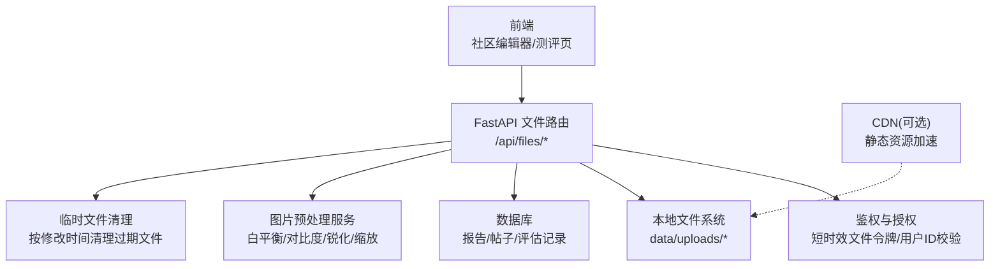
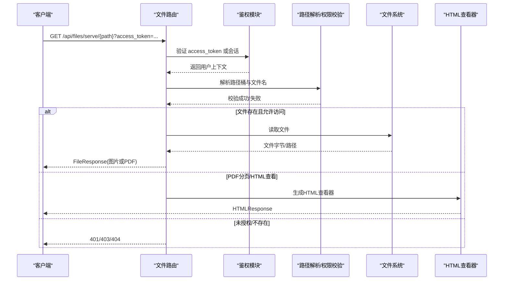
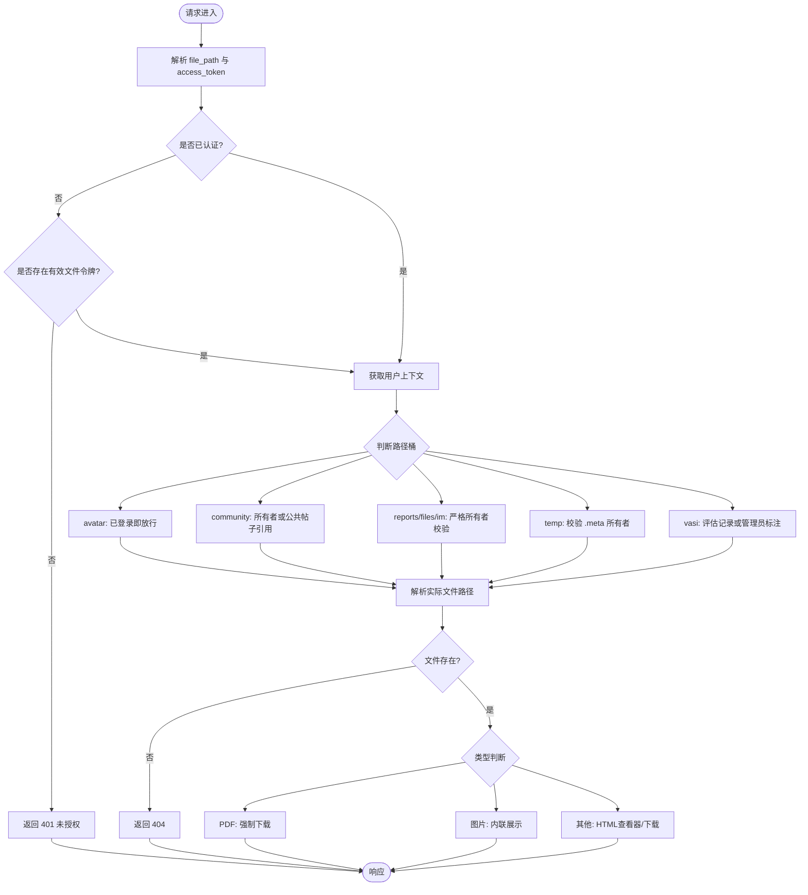
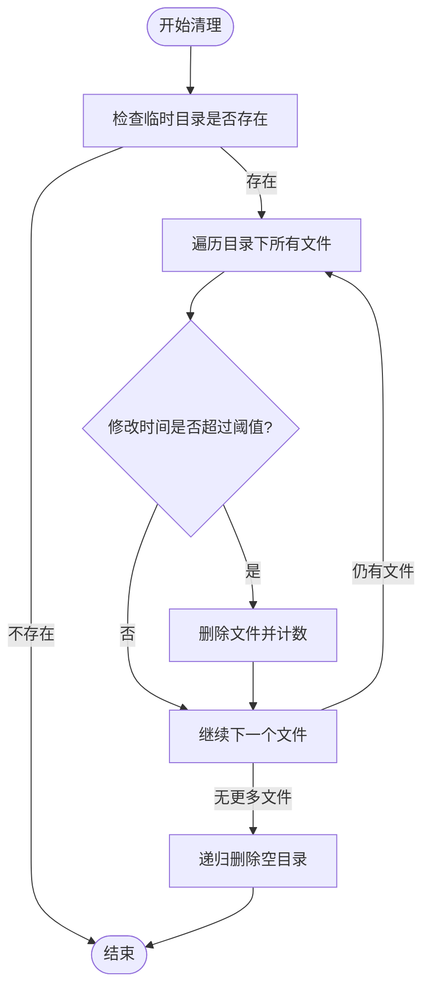
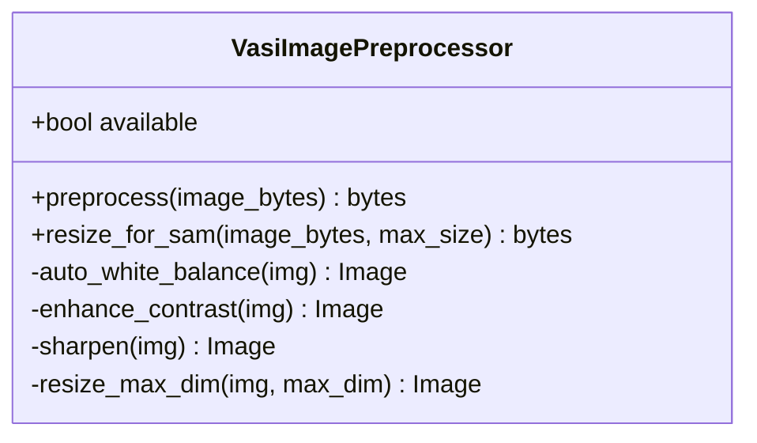
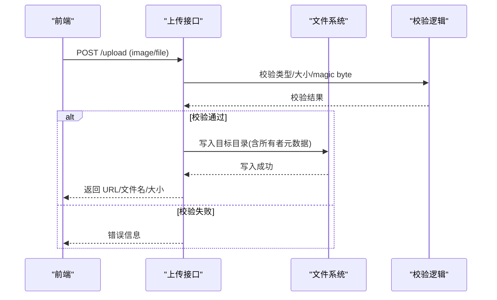
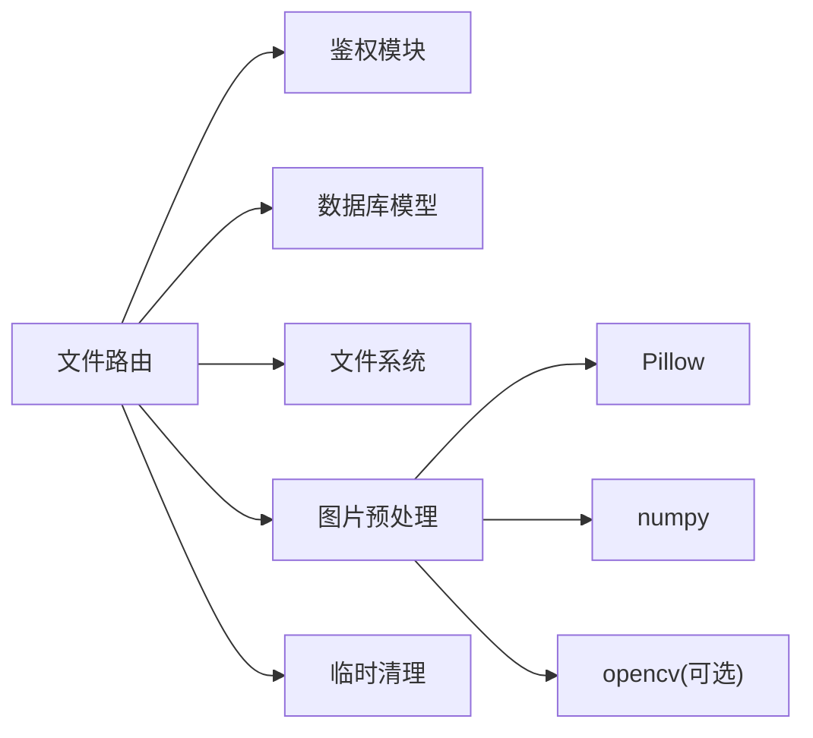

# 文件管理服务

<cite>
**本文引用的文件**
- [web/backend/api/files.py](file://web/backend/api/files.py)
- [web/backend/services/temp_cleanup.py](file://web/backend/services/temp_cleanup.py)
- [web/backend/services/vasi_preprocess.py](file://web/backend/services/vasi_preprocess.py)
- [web/backend/api/rag.py](file://web/backend/api/rag.py)
- [web/backend/api/image_label.py](file://web/backend/api/image_label.py)
- [web/backend/api/vasi.py](file://web/backend/api/vasi.py)
- [tests/backend/api/test_files.py](file://tests/backend/api/test_files.py)
- [web/app/src/components/community/Editor/ImagePostEditor.vue](file://web/app/src/components/community/Editor/ImagePostEditor.vue)
- [web/vitepress/docs/.vitepress/theme/components/VASIAssessment.vue](file://web/vitepress/docs/.vitepress/theme/components/VASIAssessment.vue)
- [src/settings/settings.py](file://src/settings/settings.py)
- [web/backend/app/middleware/rate_limit.py](file://web/backend/app/middleware/rate_limit.py)
- [web/app/vite.config.staging.ts](file://web/app/vite.config.staging.ts)
- [docs/design/risk-mitigation-plan.md](file://docs/design/risk-mitigation-plan.md)
</cite>

## 目录
1. [简介](#简介)
2. [项目结构](#项目结构)
3. [核心组件](#核心组件)
4. [架构总览](#架构总览)
5. [详细组件分析](#详细组件分析)
6. [依赖关系分析](#依赖关系分析)
7. [性能考量](#性能考量)
8. [故障排查指南](#故障排查指南)
9. [结论](#结论)
10. [附录](#附录)

## 简介
本技术文档围绕“文件管理服务”展开，覆盖上传下载机制、图片处理流水线、临时文件清理、存储策略配置与安全访问控制。重点说明：
- 支持的格式类型、压缩与尺寸调整能力
- 大文件分片上传、断点续传、并发控制与存储空间管理
- 文件URL生成、CDN集成、备份恢复与监控告警的实现方案
- 基于路径桶的细粒度权限校验与短时效文件访问令牌

## 项目结构
后端文件服务以 FastAPI 路由为核心，提供统一的文件鉴权、读取与预览接口；图片预处理采用独立的预处理服务；临时文件清理通过定时任务或手动触发完成；前端在编辑器与测评页面中实现上传与预览。

图表来源
- [web/backend/api/files.py:293-331](file://web/backend/api/files.py#L293-L331)
- [web/backend/services/temp_cleanup.py:15-52](file://web/backend/services/temp_cleanup.py#L15-L52)
- [web/backend/services/vasi_preprocess.py:187-223](file://web/backend/services/vasi_preprocess.py#L187-L223)

章节来源
- [web/backend/api/files.py:1-503](file://web/backend/api/files.py#L1-L503)
- [web/backend/services/temp_cleanup.py:1-66](file://web/backend/services/temp_cleanup.py#L1-L66)
- [web/backend/services/vasi_preprocess.py:1-267](file://web/backend/services/vasi_preprocess.py#L1-L267)

## 核心组件
- 文件访问与鉴权
  - 统一入口 /api/files/serve/{file_path}，支持按路径桶（avatar、community、reports、files、im、temp、vasi）进行所有权与公开性校验
  - 支持短时效文件访问令牌（access_token），降低泄露风险
  - PDF 强制下载，图片内联显示，PDF 分页预览与 HTML 自包含查看器
- 临时文件清理
  - 按修改时间阈值清理 data/uploads/temp 下的过期文件，并递归删除空目录
  - 提供手动清理接口 /api/files/cleanup-temp
- 图片预处理流水线
  - 自动白平衡、CLAHE对比度增强、锐化、最大边限制缩放、JPEG输出
  - 为 SAM 推理提供专用缩放流程，保证最短边不低于阈值
- 上传与校验
  - 社区图片上传（前端限制大小与类型）、IM 图片上传、RAG 临时上传（带 .meta 所有者标记）
  - Magic byte 校验与 MIME 检测，拒绝伪造内容类型
- 安全与限流
  - 基于 IP/用户的速率限制中间件
  - 健康检查与降级策略设计（文档层面）

章节来源
- [web/backend/api/files.py:37-48](file://web/backend/api/files.py#L37-L48)
- [web/backend/api/files.py:293-331](file://web/backend/api/files.py#L293-L331)
- [web/backend/api/files.py:334-338](file://web/backend/api/files.py#L334-L338)
- [web/backend/services/temp_cleanup.py:15-52](file://web/backend/services/temp_cleanup.py#L15-L52)
- [web/backend/services/vasi_preprocess.py:187-223](file://web/backend/services/vasi_preprocess.py#L187-L223)
- [web/backend/api/rag.py:367-382](file://web/backend/api/rag.py#L367-L382)
- [web/backend/api/image_label.py:934-965](file://web/backend/api/image_label.py#L367-L382)
- [web/backend/app/middleware/rate_limit.py:1-40](file://web/backend/app/middleware/rate_limit.py#L1-L40)

## 架构总览
文件服务遵循“鉴权先行、最小权限、可审计”的设计原则。所有受保护文件均通过统一路由校验身份与归属，再返回文件或生成预览视图。

图表来源
- [web/backend/api/files.py:293-331](file://web/backend/api/files.py#L293-L331)
- [web/backend/api/files.py:373-476](file://web/backend/api/files.py#L373-L476)

## 详细组件分析

### 文件访问与鉴权
- 短时效文件令牌
  - 端点 /api/files/access-token 签发仅用于文件读取的短期令牌，降低泄露影响面
- 统一读取入口
  - /api/files/serve/{file_path} 支持查询参数 page 与 access_token
  - 对数字型 file_id 走医疗报告文件路径，支持分页预览
- 路径桶权限模型
  - avatar：已登录即可访问
  - community：按文件名中的 user_id 匹配或公共帖子引用判定
  - reports/files/im：严格的所有者校验
  - temp：需存在同名 .meta 文件声明所有者
  - vasi：按评估记录或管理员标注图权限开放
- PDF 与图片渲染
  - PDF 强制下载；图片内联展示；支持 HTML 自包含查看器适配微信等 WebView

图表来源
- [web/backend/api/files.py:37-48](file://web/backend/api/files.py#L37-L48)
- [web/backend/api/files.py:138-227](file://web/backend/api/files.py#L138-L227)
- [web/backend/api/files.py:293-331](file://web/backend/api/files.py#L293-L331)
- [web/backend/api/files.py:373-476](file://web/backend/api/files.py#L373-L476)

章节来源
- [web/backend/api/files.py:37-48](file://web/backend/api/files.py#L37-L48)
- [web/backend/api/files.py:138-227](file://web/backend/api/files.py#L138-L227)
- [web/backend/api/files.py:293-331](file://web/backend/api/files.py#L293-L331)
- [web/backend/api/files.py:373-476](file://web/backend/api/files.py#L373-L476)
- [tests/backend/api/test_files.py:21-60](file://tests/backend/api/test_files.py#L21-L60)

### 临时文件清理
- 清理策略
  - 默认保留周期 24 小时，间隔 1 小时执行一次清理循环
  - 扫描 data/uploads/temp 下所有文件，按 mtime 比较阈值删除，随后清理空目录
- 手动清理接口
  - /api/files/cleanup-temp 返回已删除数量，便于运维确认

图表来源
- [web/backend/services/temp_cleanup.py:15-52](file://web/backend/services/temp_cleanup.py#L15-L52)
- [web/backend/api/files.py:334-338](file://web/backend/api/files.py#L334-L338)

章节来源
- [web/backend/services/temp_cleanup.py:15-52](file://web/backend/services/temp_cleanup.py#L15-L52)
- [web/backend/api/files.py:334-338](file://web/backend/api/files.py#L334-L338)
- [tests/backend/api/test_files.py:70-96](file://tests/backend/api/test_files.py#L70-L96)

### 图片处理流水线
- 预处理步骤
  - 自动白平衡（灰世界算法）
  - 对比度增强（优先 CLAHE，回退 PIL 增强）
  - 锐化（Unsharp Mask）
  - 最大边限制缩放（默认 1024px，保持比例）
  - 编码为 JPEG（质量 92，优化）
- SAM 专用缩放
  - 最长边不超过 max_size，最短边不低于 256px，确保推理效率与质量平衡

图表来源
- [web/backend/services/vasi_preprocess.py:47-66](file://web/backend/services/vasi_preprocess.py#L47-L66)
- [web/backend/services/vasi_preprocess.py:187-223](file://web/backend/services/vasi_preprocess.py#L187-L223)
- [web/backend/services/vasi_preprocess.py:225-262](file://web/backend/services/vasi_preprocess.py#L225-L262)

章节来源
- [web/backend/services/vasi_preprocess.py:187-223](file://web/backend/services/vasi_preprocess.py#L187-L223)
- [web/backend/services/vasi_preprocess.py:225-262](file://web/backend/services/vasi_preprocess.py#L225-L262)

### 上传与校验
- 社区图片上传
  - 前端限制类型（image/*）与大小（5MB），成功后返回 image_url
- IM 图片上传
  - 后端写入 data/uploads/im/{user_id}/{uid_hash}.ext，返回 URL、文件名与大小
- RAG 临时上传
  - 写入 data/uploads/temp/{temp_id}.ext，并创建 .meta 文件记录所有者
- 格式与内容校验
  - 使用 mimetypes 与 magic byte 双重校验，拒绝非预期类型
  - VASI 评估路径增加 magic byte 校验，防止伪装内容绕过

图表来源
- [web/app/src/components/community/Editor/ImagePostEditor.vue:90-105](file://web/app/src/components/community/Editor/ImagePostEditor.vue#L90-L105)
- [web/backend/api/files.py:479-502](file://web/backend/api/files.py#L479-L502)
- [web/backend/api/rag.py:367-382](file://web/backend/api/rag.py#L367-L382)
- [web/backend/api/image_label.py:934-965](file://web/backend/api/image_label.py#L934-L965)
- [web/backend/api/vasi.py:511-541](file://web/backend/api/vasi.py#L511-L541)

章节来源
- [web/app/src/components/community/Editor/ImagePostEditor.vue:90-105](file://web/app/src/components/community/Editor/ImagePostEditor.vue#L90-L105)
- [web/backend/api/files.py:479-502](file://web/backend/api/files.py#L479-L502)
- [web/backend/api/rag.py:367-382](file://web/backend/api/rag.py#L367-L382)
- [web/backend/api/image_label.py:934-965](file://web/backend/api/image_label.py#L934-L965)
- [web/backend/api/vasi.py:511-541](file://web/backend/api/vasi.py#L511-L541)

### 预览与查看器
- PDF 分页预览
  - 将 PDF 转换为 pages/{file_id}/page-*.png，提供 /api/files/pages/{file_id}/{page_name} 与 /api/files/serve/{file_id}?page=N
- HTML 查看器
  - /api/files/view/{file_id} 根据类型返回图片全屏或下载提示，内置 token 注入避免越权

章节来源
- [web/backend/api/files.py:341-370](file://web/backend/api/files.py#L341-L370)
- [web/backend/api/files.py:373-476](file://web/backend/api/files.py#L373-L476)

### 安全访问控制
- 短时效文件令牌
  - 仅授予文件读取权限，过期时间短，降低泄露风险
- 路径桶权限
  - 不同桶采用不同策略：所有者校验、公共引用、管理员特例等
- 限速与防护
  - 进程内令牌桶限流，区分读/写/聊天场景
  - 健康检查与降级策略（文档层面）

章节来源
- [web/backend/api/files.py:37-48](file://web/backend/api/files.py#L37-L48)
- [web/backend/api/files.py:138-227](file://web/backend/api/files.py#L138-L227)
- [web/backend/app/middleware/rate_limit.py:1-40](file://web/backend/app/middleware/rate_limit.py#L1-L40)
- [docs/design/risk-mitigation-plan.md:282-341](file://docs/design/risk-mitigation-plan.md#L282-L341)

## 依赖关系分析
- 组件耦合
  - 文件路由强依赖鉴权模块与数据库模型（报告、帖子、评估、标注）
  - 图片预处理服务独立，通过函数式调用被上层服务使用
  - 临时清理服务与文件路由解耦，可通过接口或后台任务触发
- 外部依赖
  - Pillow/numpy/opencv（可选）用于图像处理
  - 文件系统（data/uploads）作为主存储
  - 可选 CDN 加速静态资源

图表来源
- [web/backend/api/files.py:1-30](file://web/backend/api/files.py#L1-L30)
- [web/backend/services/vasi_preprocess.py:15-44](file://web/backend/services/vasi_preprocess.py#L15-L44)

章节来源
- [web/backend/api/files.py:1-30](file://web/backend/api/files.py#L1-L30)
- [web/backend/services/vasi_preprocess.py:15-44](file://web/backend/services/vasi_preprocess.py#L15-L44)

## 性能考量
- 图片处理
  - 预处理流水线仅在可用时启用，失败回退到原图，避免阻塞
  - 缩放使用 LANCZOS 插值，兼顾质量与速度
- 存储与缓存
  - 前端 PWA 缓存策略对 /uploads 使用 CacheFirst，提升重复加载性能
- 并发与限流
  - 进程内限流器保护写接口与聊天接口，避免滥用
- 配置与监控
  - 工作进程数、并发任务上限、超时、日志与告警开关由设置中心管理

章节来源
- [web/backend/services/vasi_preprocess.py:187-223](file://web/backend/services/vasi_preprocess.py#L187-L223)
- [web/app/vite.config.staging.ts:65-87](file://web/app/vite.config.staging.ts#L65-L87)
- [web/backend/app/middleware/rate_limit.py:1-40](file://web/backend/app/middleware/rate_limit.py#L1-L40)
- [src/settings/settings.py:189-241](file://src/settings/settings.py#L189-L241)

## 故障排查指南
- 常见错误码
  - 401 未授权：缺少或无效的文件令牌/会话
  - 403 禁止访问：路径桶权限不满足（非所有者、非公共引用、非管理员）
  - 404 文件不存在：路径解析失败或文件缺失
- 调试建议
  - 检查 uploads 目录结构与 .meta 文件是否正确
  - 确认前端上传限制与后端校验一致（类型、大小）
  - 查看临时清理日志与删除计数
  - 使用 HTML 查看器定位渲染问题

章节来源
- [tests/backend/api/test_files.py:21-60](file://tests/backend/api/test_files.py#L21-L60)
- [tests/backend/api/test_files.py:70-96](file://tests/backend/api/test_files.py#L70-L96)
- [web/backend/services/temp_cleanup.py:15-52](file://web/backend/services/temp_cleanup.py#L15-L52)

## 结论
文件管理服务通过统一的鉴权与路径桶模型，实现了安全可控的文件访问；图片预处理流水线在保证质量的同时兼顾性能；临时文件清理保障磁盘空间；前端缓存与限流提升了用户体验与系统稳定性。后续可在云存储多后端、CDN 集成与大文件分片上传方面进一步增强。

## 附录
- 支持的格式类型
  - 图片：JPG、PNG、WebP（前端与后端均有校验）
  - 文档：PDF（强制下载，支持分页预览）
- 压缩与尺寸调整
  - 预处理输出 JPEG（质量 92），最大边 1024px；SAM 专用缩放最短边不低于 256px
- 水印与格式转换
  - 当前代码未实现水印功能；格式转换主要体现为 JPEG 输出与 PDF 分页 PNG 化
- 大文件分片上传与断点续传
  - 当前实现为单块上传；分片与续传可作为扩展方向
- 并发控制与存储空间管理
  - 进程内限流器；data/uploads 目录结构化管理；临时文件按时间清理
- 文件URL生成与CDN集成
  - 返回相对路径 URL；可通过反向代理或对象存储签名 URL 接入 CDN
- 备份恢复与监控告警
  - 配置备份/恢复接口（LLM 配置示例）；设置项包含告警开关与收件人

章节来源
- [web/app/src/components/community/Editor/ImagePostEditor.vue:90-105](file://web/app/src/components/community/Editor/ImagePostEditor.vue#L90-L105)
- [web/vitepress/docs/.vitepress/theme/components/VASIAssessment.vue:52-68](file://web/vitepress/docs/.vitepress/theme/components/VASIAssessment.vue#L52-L68)
- [web/backend/services/vasi_preprocess.py:187-223](file://web/backend/services/vasi_preprocess.py#L187-L223)
- [web/backend/api/files.py:341-370](file://web/backend/api/files.py#L341-L370)
- [docs/design/risk-mitigation-plan.md:282-341](file://docs/design/risk-mitigation-plan.md#L282-L341)
- [web/backend/api/llm_config_admin.py:231-311](file://web/backend/api/llm_config_admin.py#L231-L311)
- [src/settings/settings.py:189-241](file://src/settings/settings.py#L189-L241)