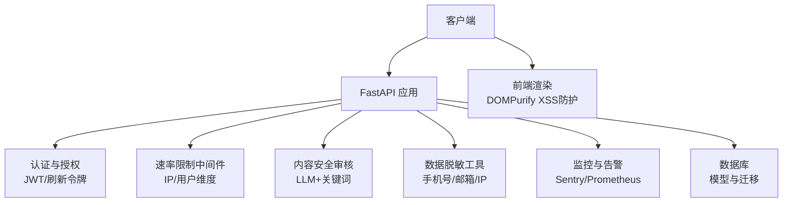
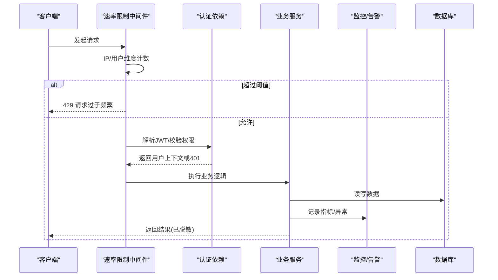
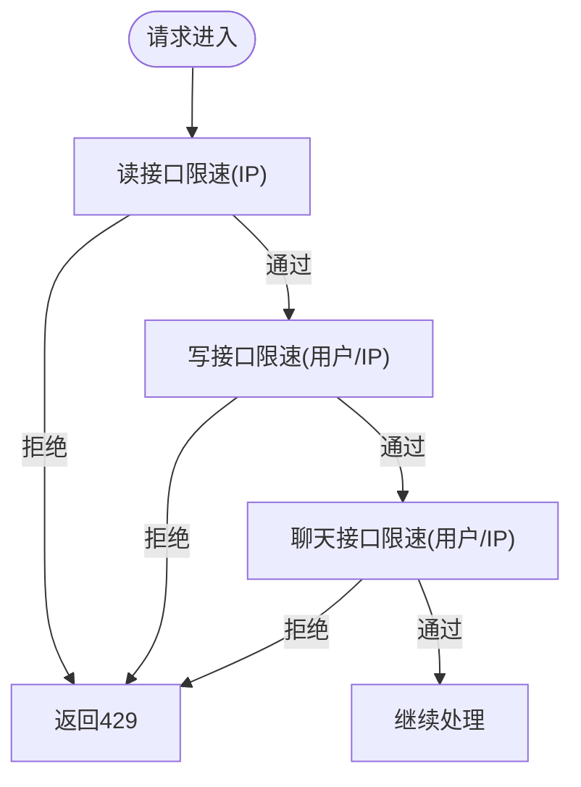
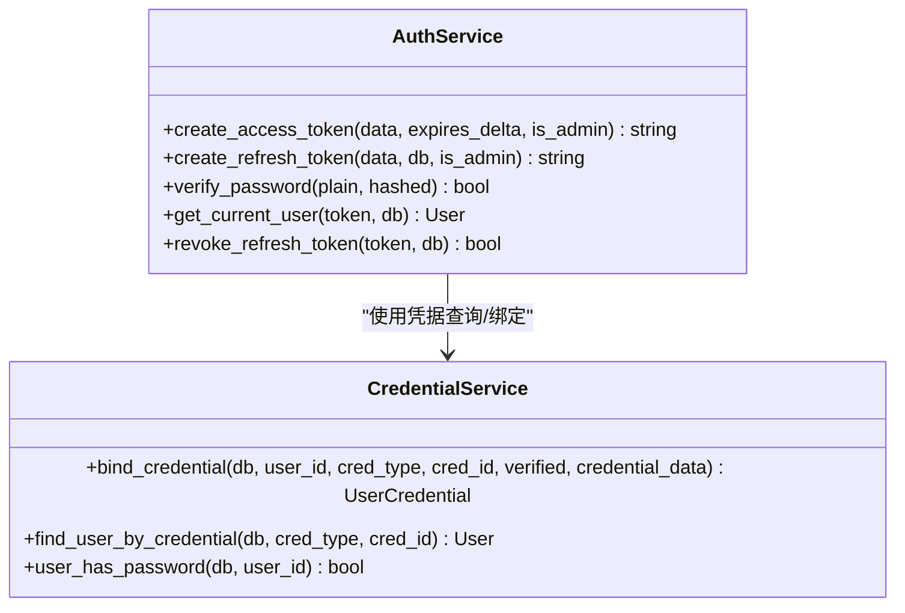
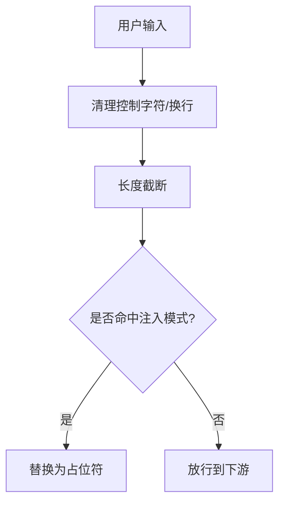
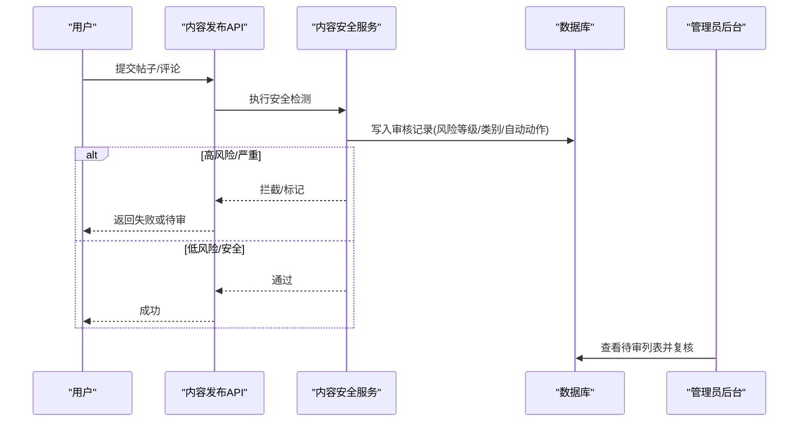
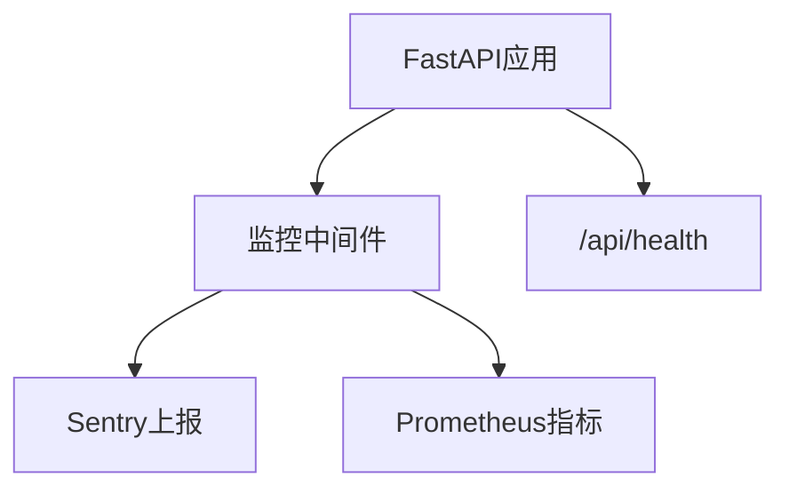
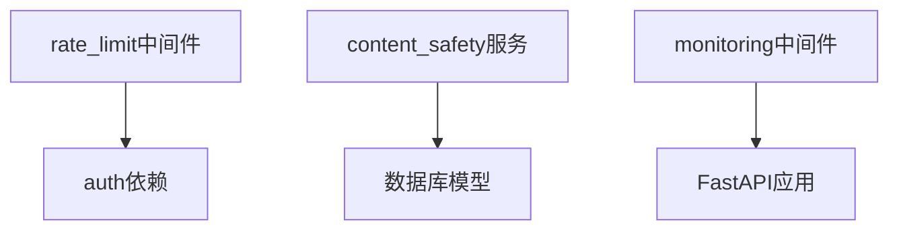

# 安全策略与防护

<cite>
**本文引用的文件**
- [web/backend/app/middleware/rate_limit.py](file://web/backend/app/middleware/rate_limit.py)
- [src/utils/rate_limiter.py](file://src/utils/rate_limiter.py)
- [configs/web_config.yaml](file://configs/web_config.yaml)
- [web/backend/services/auth.py](file://web/backend/services/auth.py)
- [web/backend/services/credential.py](file://web/backend/services/credential.py)
- [web/backend/api/user.py](file://web/backend/api/user.py)
- [web/backend/database/migration_add_sms_security.py](file://web/backend/database/migration_add_sms_security.py)
- [web/backend/utils/redact.py](file://web/backend/utils/redact.py)
- [web/backend/services/content_safety.py](file://web/backend/services/content_safety.py)
- [web/backend/services/im_moderation.py](file://web/backend/services/im_moderation.py)
- [web/backend/api/moderation.py](file://web/backend/api/moderation.py)
- [web/backend/api/im_admin.py](file://web/backend/api/im_admin.py)
- [web/backend/database/models.py](file://web/backend/database/models.py)
- [web/backend/services/monitoring.py](file://web/backend/services/monitoring.py)
- [web/app/src/utils/file-url.ts](file://web/app/src/utils/file-url.ts)
- [AGENTS.md](file://AGENTS.md)
</cite>

## 目录
1. [简介](#简介)
2. [项目结构](#项目结构)
3. [核心组件](#核心组件)
4. [架构总览](#架构总览)
5. [详细组件分析](#详细组件分析)
6. [依赖关系分析](#依赖关系分析)
7. [性能与安全权衡](#性能与安全权衡)
8. [故障排查指南](#故障排查指南)
9. [结论](#结论)
10. [附录：配置与应急清单](#附录配置与应急清单)

## 简介
本文件面向SubSkin项目的安全策略与防护，覆盖防暴力破解、输入验证与过滤、敏感信息保护、内容安全审核、恶意行为检测与异常监控，以及安全配置、漏洞扫描建议与应急响应预案。文档基于仓库现有实现进行梳理，并给出可操作的落地建议。

## 项目结构
后端采用FastAPI，安全能力分布在中间件、服务层、API层与数据库模型中；前端在渲染用户生成内容时进行XSS防护；配置集中在YAML与环境变量；监控与告警通过Sentry与Prometheus集成。

**图表来源**
- [web/backend/app/middleware/rate_limit.py:1-96](file://web/backend/app/middleware/rate_limit.py#L1-L96)
- [web/backend/services/auth.py:1-309](file://web/backend/services/auth.py#L1-L309)
- [web/backend/services/content_safety.py:1-178](file://web/backend/services/content_safety.py#L1-L178)
- [web/backend/utils/redact.py:1-53](file://web/backend/utils/redact.py#L1-L53)
- [web/backend/services/monitoring.py:1-260](file://web/backend/services/monitoring.py#L1-L260)
- [web/backend/database/models.py:848-873](file://web/backend/database/models.py#L848-L873)
- [web/app/src/utils/file-url.ts:109-139](file://web/app/src/utils/file-url.ts#L109-L139)

**章节来源**
- [configs/web_config.yaml:253-284](file://configs/web_config.yaml#L253-L284)
- [web/backend/app/middleware/rate_limit.py:1-96](file://web/backend/app/middleware/rate_limit.py#L1-L96)
- [web/backend/services/auth.py:1-309](file://web/backend/services/auth.py#L1-L309)

## 核心组件
- 防暴力破解与速率限制：按IP与用户维度的请求限速，验证码发送的IP维度限速与短信验证码尝试次数锁定。
- 认证与凭据管理：JWT访问令牌与刷新令牌、文件专用短时效令牌、密码bcrypt哈希存储与凭据绑定。
- 输入验证与过滤：前端DOMPurify对富文本进行XSS清洗；后端对提示词注入模式进行过滤；业务接口对图片类型、大小、身体部位等参数校验。
- 敏感信息保护：日志与响应中的手机号、邮箱、姓名、IP脱敏；Sentry事件过滤敏感头；最小化收集与分级管控。
- 内容安全审核：关键词白/黑名单与LLM风控判定，自动处置（拦截/标记）与人工复核流程。
- 监控与异常：Sentry错误追踪、Prometheus指标与健康检查端点。

**章节来源**
- [web/backend/app/middleware/rate_limit.py:1-96](file://web/backend/app/middleware/rate_limit.py#L1-L96)
- [web/backend/services/auth.py:1-309](file://web/backend/services/auth.py#L1-L309)
- [web/backend/utils/redact.py:1-53](file://web/backend/utils/redact.py#L1-L53)
- [web/backend/services/content_safety.py:1-178](file://web/backend/services/content_safety.py#L1-L178)
- [web/backend/services/monitoring.py:1-260](file://web/backend/services/monitoring.py#L1-L260)
- [web/app/src/utils/file-url.ts:109-139](file://web/app/src/utils/file-url.ts#L109-L139)

## 架构总览
下图展示一次受保护的API请求从进入应用到鉴权、限流、内容审核、监控记录的关键路径。

**图表来源**
- [web/backend/app/middleware/rate_limit.py:39-96](file://web/backend/app/middleware/rate_limit.py#L39-L96)
- [web/backend/services/auth.py:179-254](file://web/backend/services/auth.py#L179-L254)
- [web/backend/services/monitoring.py:96-183](file://web/backend/services/monitoring.py#L96-L183)

## 详细组件分析

### 防暴力破解与速率限制
- 进程内令牌桶/滑动窗口限速器：提供读/写/聊天三类限速，分别以IP或用户ID为键，防止高频滥用与DoS。
- 验证码频率控制：短信验证码支持尝试次数与锁定字段，配合IP维度限速，降低分布式骚扰风险。
- 配置化开关与阈值：通过配置文件启用CORS、CSP与安全头，结合服务端限速形成纵深防御。

**图表来源**
- [web/backend/app/middleware/rate_limit.py:29-96](file://web/backend/app/middleware/rate_limit.py#L29-L96)
- [src/utils/rate_limiter.py:10-81](file://src/utils/rate_limiter.py#L10-L81)
- [web/backend/database/migration_add_sms_security.py:1-37](file://web/backend/database/migration_add_sms_security.py#L1-L37)
- [web/backend/api/user.py:419-423](file://web/backend/api/user.py#L419-L423)

**章节来源**
- [web/backend/app/middleware/rate_limit.py:1-96](file://web/backend/app/middleware/rate_limit.py#L1-L96)
- [src/utils/rate_limiter.py:1-81](file://src/utils/rate_limiter.py#L1-L81)
- [web/backend/database/migration_add_sms_security.py:1-37](file://web/backend/database/migration_add_sms_security.py#L1-L37)
- [configs/web_config.yaml:253-284](file://configs/web_config.yaml#L253-L284)

### 认证与凭据安全
- 密码存储：使用bcrypt哈希，不保存明文；登录时通过凭据服务查找对应凭证并校验。
- 令牌机制：访问令牌短时效（可配置），刷新令牌持久化于数据库并可撤销；文件专用令牌仅用于文件读取且短时效。
- 权限控制：统一依赖获取当前用户，封禁账号直接拒绝；可选用户获取用于匿名场景。

**图表来源**
- [web/backend/services/auth.py:35-150](file://web/backend/services/auth.py#L35-L150)
- [web/backend/services/credential.py:37-151](file://web/backend/services/credential.py#L37-L151)

**章节来源**
- [web/backend/services/auth.py:1-309](file://web/backend/services/auth.py#L1-L309)
- [web/backend/services/credential.py:1-151](file://web/backend/services/credential.py#L1-L151)

### 输入验证与过滤
- 前端XSS防护：对用户生成的富文本使用DOMPurify严格白名单标签与属性，禁用危险事件处理器与data属性。
- 提示词注入防护：对用户输入进行控制字符清理、长度截断与常见注入模式替换，避免被用于越权指令。
- 业务输入校验：如VASI评估接口对图片类型、大小、身体部位等进行校验，非法输入抛出明确错误。

**图表来源**
- [web/app/src/utils/file-url.ts:109-139](file://web/app/src/utils/file-url.ts#L109-L139)
- [web/backend/experiments/vasi_prompt_evolver.py:33-62](file://web/backend/experiments/vasi_prompt_evolver.py#L33-L62)
- [tests/backend/services/test_vasi.py:45-82](file://tests/backend/services/test_vasi.py#L45-L82)

**章节来源**
- [web/app/src/utils/file-url.ts:109-139](file://web/app/src/utils/file-url.ts#L109-L139)
- [web/backend/experiments/vasi_prompt_evolver.py:33-62](file://web/backend/experiments/vasi_prompt_evolver.py#L33-L62)
- [tests/backend/services/test_vasi.py:45-82](file://tests/backend/services/test_vasi.py#L45-L82)

### 敏感信息保护
- 数据脱敏：手机号保留前3后4、邮箱保留前2字符+“***@domain”、姓名保留姓氏、IP仅保留前两组。
- 日志与告警脱敏：Sentry初始化时过滤敏感请求头；生产环境日志遵循脱敏规范。
- 数据分级：依据L1-L4分级规则，L4绝对不可出现在响应/日志/前端代码；L3对外暴露需脱敏。

**图表来源**
- [web/backend/utils/redact.py:1-53](file://web/backend/utils/redact.py#L1-L53)
- [web/backend/services/monitoring.py:66-77](file://web/backend/services/monitoring.py#L66-L77)
- [AGENTS.md:591-598](file://AGENTS.md#L591-L598)

**章节来源**
- [web/backend/utils/redact.py:1-53](file://web/backend/utils/redact.py#L1-L53)
- [web/backend/services/monitoring.py:66-77](file://web/backend/services/monitoring.py#L66-L77)
- [AGENTS.md:591-598](file://AGENTS.md#L591-L598)

### 内容安全审核与恶意行为检测
- 关键词+LLM双轨：先快速匹配敏感词，再调用LLM进行综合风险评估，输出风险等级、类别与置信度。
- 自动处置：高风险/严重风险直接拦截或标记，并触发用户违规记录与通知。
- 人工复核：管理员可通过审核面板查看待审项并进行批准/拒绝/升级操作。

**图表来源**
- [web/backend/services/content_safety.py:1-178](file://web/backend/services/content_safety.py#L1-L178)
- [web/backend/services/im_moderation.py:1-44](file://web/backend/services/im_moderation.py#L1-L44)
- [web/backend/api/moderation.py:1-50](file://web/backend/api/moderation.py#L1-L50)
- [web/backend/api/im_admin.py:1-44](file://web/backend/api/im_admin.py#L1-L44)
- [web/backend/database/models.py:848-873](file://web/backend/database/models.py#L848-L873)

**章节来源**
- [web/backend/services/content_safety.py:1-178](file://web/backend/services/content_safety.py#L1-L178)
- [web/backend/services/im_moderation.py:1-44](file://web/backend/services/im_moderation.py#L1-L44)
- [web/backend/api/moderation.py:1-50](file://web/backend/api/moderation.py#L1-L50)
- [web/backend/api/im_admin.py:1-44](file://web/backend/api/im_admin.py#L1-L44)
- [web/backend/database/models.py:848-873](file://web/backend/database/models.py#L848-L873)

### 异常监控与健康检查
- Sentry集成：自动捕获异常，过滤敏感头，支持追踪采样与环境标识。
- Prometheus指标：统计HTTP请求总量、耗时、并发数，并提供/metrics端点。
- 健康检查：/api/health返回数据库连接与磁盘空间状态，便于编排系统探测。

**图表来源**
- [web/backend/services/monitoring.py:28-77](file://web/backend/services/monitoring.py#L28-L77)
- [web/backend/services/monitoring.py:96-183](file://web/backend/services/monitoring.py#L96-L183)
- [web/backend/services/monitoring.py:208-240](file://web/backend/services/monitoring.py#L208-L240)

**章节来源**
- [web/backend/services/monitoring.py:1-260](file://web/backend/services/monitoring.py#L1-L260)

## 依赖关系分析
- 中间件依赖认证上下文（request.state.user_id）进行用户维度限速。
- 内容安全服务依赖数据库模型写入审核记录，并与管理员审核API联动。
- 监控模块独立于业务逻辑，通过中间件与初始化函数接入。

**图表来源**
- [web/backend/app/middleware/rate_limit.py:53-96](file://web/backend/app/middleware/rate_limit.py#L53-L96)
- [web/backend/services/content_safety.py:16-24](file://web/backend/services/content_safety.py#L16-L24)
- [web/backend/services/monitoring.py:96-183](file://web/backend/services/monitoring.py#L96-L183)

**章节来源**
- [web/backend/app/middleware/rate_limit.py:1-96](file://web/backend/app/middleware/rate_limit.py#L1-L96)
- [web/backend/services/content_safety.py:1-178](file://web/backend/services/content_safety.py#L1-L178)
- [web/backend/services/monitoring.py:1-260](file://web/backend/services/monitoring.py#L1-L260)

## 性能与安全权衡
- 速率限制：进程内内存计数器在服务重启后清空，适合单机或会话级防护；若需跨实例共享，应引入Redis等外部存储。
- 内容审核：LLM调用带来延迟与成本，建议对低危内容采用异步审核与缓存策略，减少实时阻塞。
- 监控开销：Prometheus指标采集与Sentry上报会增加少量CPU与网络开销，建议在生产开启并按需调整采样率。

[本节为通用指导，不直接分析具体文件]

## 故障排查指南
- 429过多请求：检查对应IP或用户的请求频率是否超过阈值；确认中间件是否正确挂载。
- 认证失败：确认JWT是否有效、是否过期或被撤销；检查用户状态是否为封禁。
- 内容被拦截：查看内容审核记录的风险等级与类别；必要时在管理员后台进行复核与申诉。
- 日志泄露：确保所有敏感字段通过redact工具处理；检查Sentry过滤规则是否生效。

**章节来源**
- [web/backend/app/middleware/rate_limit.py:39-96](file://web/backend/app/middleware/rate_limit.py#L39-L96)
- [web/backend/services/auth.py:179-254](file://web/backend/services/auth.py#L179-L254)
- [web/backend/api/moderation.py:1-50](file://web/backend/api/moderation.py#L1-L50)
- [web/backend/utils/redact.py:1-53](file://web/backend/utils/redact.py#L1-L53)

## 结论
本项目已具备较为完善的安全基线：多层速率限制、强认证的JWT体系、严格的输入清洗与提示词注入防护、完善的敏感信息脱敏、AI辅助的内容审核与人工复核闭环，以及监控与告警能力。建议在后续迭代中持续强化：
- 将进程内限速升级为分布式共享存储，提升横向扩展下的安全性。
- 扩大LLM风控模型的覆盖面与误报调优，建立反馈闭环。
- 完善日志审计与合规报表，满足监管要求。
- 定期开展渗透测试与漏洞扫描，及时修复问题。

[本节为总结性内容，不直接分析具体文件]

## 附录：配置与应急清单

### 安全配置要点
- 启用CORS/CSP与安全头：在配置文件中设置允许的源、脚本/样式策略、HSTS与XSS保护。
- 环境变量：SECRET_KEY、ALGORITHM、ACCESS_TOKEN_EXPIRE_MINUTES、REFRESH_TOKEN_EXPIRE_DAYS、SENTRY_DSN、PROMETHEUS_ENABLED等。
- 文件访问令牌：仅用于文件读取，短时效且作用域受限。

**章节来源**
- [configs/web_config.yaml:253-284](file://configs/web_config.yaml#L253-L284)
- [web/backend/services/auth.py:20-28](file://web/backend/services/auth.py#L20-L28)

### 漏洞扫描建议
- 依赖扫描：定期扫描Python与前端依赖库，修复已知CVE。
- 代码扫描：启用静态分析与SAST，关注SQL注入、XSS、硬编码密钥等问题。
- 运行时防护：WAF/网关层增加SQL注入与XSS规则；对上传文件进行类型与大小校验。

[本节为通用指导，不直接分析具体文件]

### 应急响应预案
- 暴力破解：临时提高限速阈值或封禁可疑IP；核查验证码发送量与费用。
- 数据泄露：立即撤销相关令牌，强制下线受影响会话；审查日志定位泄露点。
- 内容违规：批量拦截高风险内容，通知用户并记录违规；必要时升级至人工复审。
- 服务异常：通过健康检查与监控面板快速定位；必要时降级或熔断非核心功能。

[本节为通用指导，不直接分析具体文件]