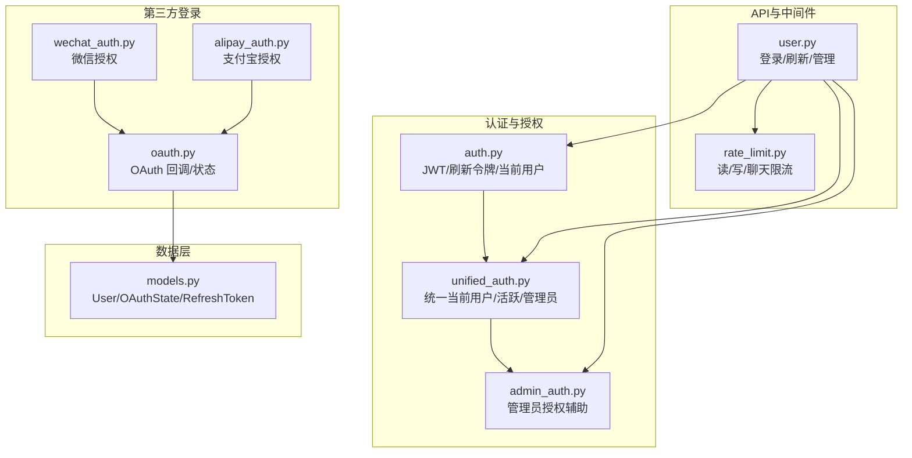
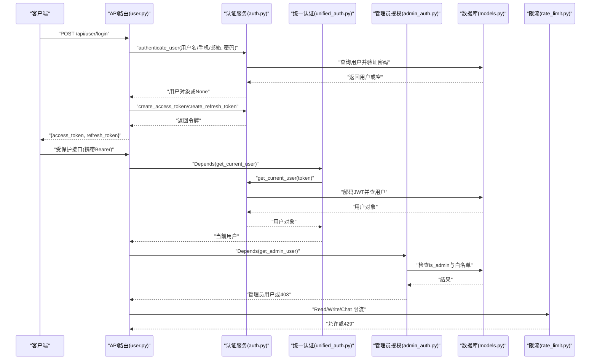
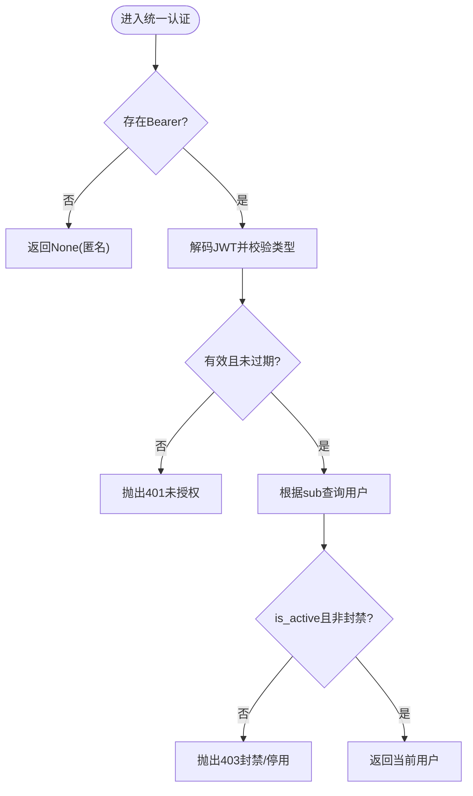
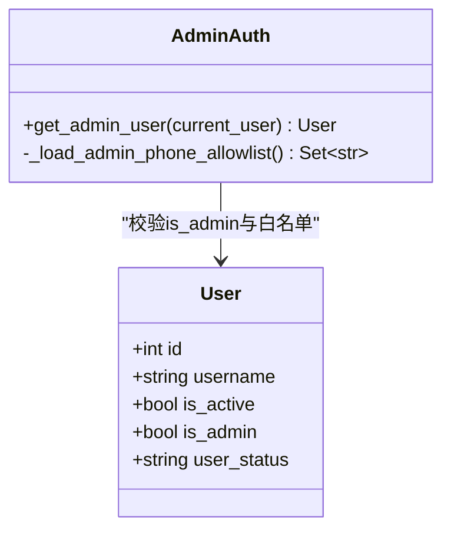
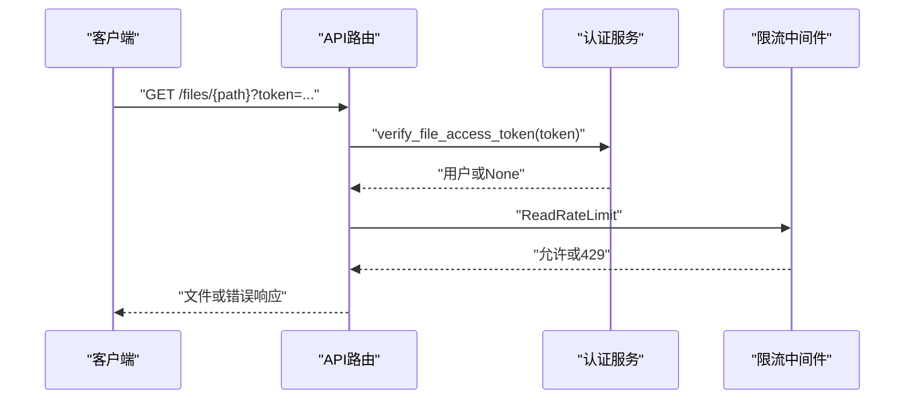
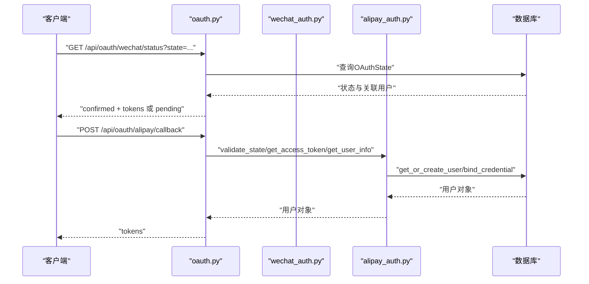
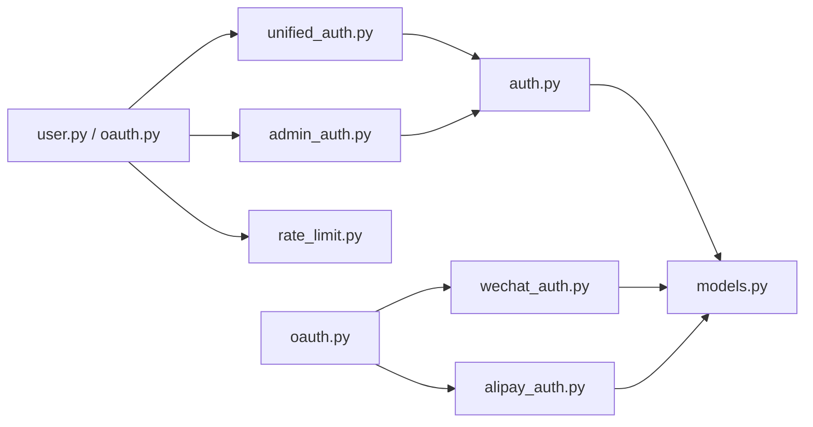

# 权限控制系统

<cite>
**本文引用的文件**
- [web/backend/services/auth.py](file://web/backend/services/auth.py)
- [web/backend/services/unified_auth.py](file://web/backend/services/unified_auth.py)
- [web/backend/services/admin_auth.py](file://web/backend/services/admin_auth.py)
- [web/backend/database/models.py](file://web/backend/database/models.py)
- [web/backend/api/user.py](file://web/backend/api/user.py)
- [web/backend/api/oauth.py](file://web/backend/api/oauth.py)
- [web/backend/services/wechat_auth.py](file://web/backend/services/wechat_auth.py)
- [web/backend/services/alipay_auth.py](file://web/backend/services/alipay_auth.py)
- [web/backend/app/middleware/rate_limit.py](file://web/backend/app/middleware/rate_limit.py)
- [tests/backend/services/test_auth.py](file://tests/backend/services/test_auth.py)
</cite>

## 目录
1. [简介](#简介)
2. [项目结构](#项目结构)
3. [核心组件](#核心组件)
4. [架构总览](#架构总览)
5. [详细组件分析](#详细组件分析)
6. [依赖关系分析](#依赖关系分析)
7. [性能考虑](#性能考虑)
8. [故障排查指南](#故障排查指南)
9. [结论](#结论)
10. [附录：配置与最佳实践](#附录：配置与最佳实践)

## 简介
本技术文档围绕项目的权限控制系统，系统性阐述基于角色的访问控制（RBAC）实现、统一认证服务设计、管理员与普通用户的权限校验流程、资源访问控制策略，以及中间件与装饰器的使用方式。文档同时提供常见问题的定位思路与安全最佳实践建议，帮助开发者快速理解并安全扩展系统权限能力。

## 项目结构
权限相关代码主要分布在后端服务的认证与授权模块、数据模型、API路由以及限流中间件中：
- 认证与令牌：JWT 访问令牌、刷新令牌、文件专用短时效令牌
- 统一认证：聚合多种登录来源（用户名/密码、微信、支付宝），对外暴露统一的当前用户获取接口
- 管理员授权：强制要求 is_admin 标志，并提供手机号白名单的二次检查提示
- 数据模型：用户表包含角色与状态字段，OAuth 状态表用于第三方登录 CSRF 防护
- API 路由：登录、刷新、第三方回调、管理员操作等
- 限流中间件：按 IP/用户维度限制请求频率，防止滥用

图表来源
- [web/backend/services/auth.py:1-309](file://web/backend/services/auth.py#L1-L309)
- [web/backend/services/unified_auth.py:1-68](file://web/backend/services/unified_auth.py#L1-L68)
- [web/backend/services/admin_auth.py:1-56](file://web/backend/services/admin_auth.py#L1-L56)
- [web/backend/database/models.py:61-150](file://web/backend/database/models.py#L61-L150)
- [web/backend/api/user.py:1-200](file://web/backend/api/user.py#L1-L200)
- [web/backend/api/oauth.py:79-168](file://web/backend/api/oauth.py#L79-L168)
- [web/backend/services/wechat_auth.py:44-78](file://web/backend/services/wechat_auth.py#L44-L78)
- [web/backend/services/alipay_auth.py:1-190](file://web/backend/services/alipay_auth.py#L1-L190)
- [web/backend/app/middleware/rate_limit.py:1-96](file://web/backend/app/middleware/rate_limit.py#L1-L96)

章节来源
- [web/backend/services/auth.py:1-309](file://web/backend/services/auth.py#L1-L309)
- [web/backend/services/unified_auth.py:1-68](file://web/backend/services/unified_auth.py#L1-L68)
- [web/backend/services/admin_auth.py:1-56](file://web/backend/services/admin_auth.py#L1-L56)
- [web/backend/database/models.py:61-150](file://web/backend/database/models.py#L61-L150)
- [web/backend/api/user.py:1-200](file://web/backend/api/user.py#L1-L200)
- [web/backend/api/oauth.py:79-168](file://web/backend/api/oauth.py#L79-L168)
- [web/backend/services/wechat_auth.py:44-78](file://web/backend/services/wechat_auth.py#L44-L78)
- [web/backend/services/alipay_auth.py:1-190](file://web/backend/services/alipay_auth.py#L1-L190)
- [web/backend/app/middleware/rate_limit.py:1-96](file://web/backend/app/middleware/rate_limit.py#L1-L96)

## 核心组件
- JWT 认证服务：负责密码哈希验证、访问令牌签发与校验、刷新令牌生命周期管理、文件专用短时效令牌、WebSocket 鉴权。
- 统一认证中间件：封装 HTTP Bearer 校验，提供 get_current_user、get_current_active_user、get_current_admin_user、get_optional_user 等依赖注入函数。
- 管理员授权辅助：强制 is_admin 标志，结合环境变量中的手机号白名单进行二次提示，禁止运行时自动提升权限。
- 数据模型：User 表包含 is_admin、is_active、user_status 等关键权限与状态字段；OAuthState 表用于第三方登录 CSRF 防护；RefreshToken 表管理刷新令牌。
- 第三方登录：微信与支付宝通过 OAuthState 与回调接口完成授权，最终生成统一令牌。
- API 路由：用户登录、刷新、第三方登录回调、管理员操作（如实名认证审核）。
- 限流中间件：按 IP/用户维度对读、写、聊天接口进行限速，保护后端资源。

章节来源
- [web/backend/services/auth.py:1-309](file://web/backend/services/auth.py#L1-L309)
- [web/backend/services/unified_auth.py:1-68](file://web/backend/services/unified_auth.py#L1-L68)
- [web/backend/services/admin_auth.py:1-56](file://web/backend/services/admin_auth.py#L1-L56)
- [web/backend/database/models.py:61-150](file://web/backend/database/models.py#L61-L150)
- [web/backend/api/user.py:1-200](file://web/backend/api/user.py#L1-L200)
- [web/backend/api/oauth.py:79-168](file://web/backend/api/oauth.py#L79-L168)
- [web/backend/services/wechat_auth.py:44-78](file://web/backend/services/wechat_auth.py#L44-L78)
- [web/backend/services/alipay_auth.py:1-190](file://web/backend/services/alipay_auth.py#L1-L190)
- [web/backend/app/middleware/rate_limit.py:1-96](file://web/backend/app/middleware/rate_limit.py#L1-L96)

## 架构总览
下图展示了从客户端到后端的完整认证与授权流程，包括多源登录、令牌签发、权限校验与资源访问控制。

图表来源
- [web/backend/api/user.py:1-200](file://web/backend/api/user.py#L1-L200)
- [web/backend/services/auth.py:1-309](file://web/backend/services/auth.py#L1-L309)
- [web/backend/services/unified_auth.py:1-68](file://web/backend/services/unified_auth.py#L1-L68)
- [web/backend/services/admin_auth.py:1-56](file://web/backend/services/admin_auth.py#L1-L56)
- [web/backend/database/models.py:61-150](file://web/backend/database/models.py#L61-L150)
- [web/backend/app/middleware/rate_limit.py:1-96](file://web/backend/app/middleware/rate_limit.py#L1-L96)

## 详细组件分析

### 统一认证服务（JWT + 多源登录）
- 访问令牌与刷新令牌：支持普通用户与管理员的不同过期策略；文件专用短时效令牌仅允许读取文件资源。
- 当前用户解析：从 Bearer Token 解码并校验用户状态（是否激活、是否被封禁）。
- 可选用户解析：在匿名友好的端点中，若无法解析则返回 None。
- WebSocket 鉴权：从查询参数解析 JWT，兼容历史 token 格式。

图表来源
- [web/backend/services/auth.py:179-254](file://web/backend/services/auth.py#L179-L254)
- [web/backend/services/unified_auth.py:18-43](file://web/backend/services/unified_auth.py#L18-L43)

章节来源
- [web/backend/services/auth.py:1-309](file://web/backend/services/auth.py#L1-L309)
- [web/backend/services/unified_auth.py:1-68](file://web/backend/services/unified_auth.py#L1-L68)

### 管理员权限验证机制
- 强制 is_admin：所有管理员接口通过 get_admin_user 依赖注入，确保调用者具备管理员身份。
- 手机号白名单：作为二次提示门控，若用户在白名单但未 provisioned（未设置 is_admin），将明确提示需先开通管理员权限。
- 审计日志：管理员操作记录审计日志，便于追踪与合规。

图表来源
- [web/backend/services/admin_auth.py:22-55](file://web/backend/services/admin_auth.py#L22-L55)
- [web/backend/database/models.py:88-137](file://web/backend/database/models.py#L88-L137)

章节来源
- [web/backend/services/admin_auth.py:1-56](file://web/backend/services/admin_auth.py#L1-L56)
- [web/backend/database/models.py:88-137](file://web/backend/database/models.py#L88-L137)

### 普通用户权限检查与资源访问控制
- 普通用户：通过 get_current_user/get_required_user 获取已认证用户，拒绝未认证或封禁用户。
- 资源访问：文件专用短时效令牌仅允许读取文件，避免泄露的通用令牌扩大影响面。
- 限流保护：读接口按 IP 限流，写接口按用户 ID（或 IP 回退）限流，聊天接口按用户 ID（或 IP 回退）限流。

图表来源
- [web/backend/services/auth.py:59-93](file://web/backend/services/auth.py#L59-L93)
- [web/backend/app/middleware/rate_limit.py:39-50](file://web/backend/app/middleware/rate_limit.py#L39-L50)

章节来源
- [web/backend/services/auth.py:59-93](file://web/backend/services/auth.py#L59-L93)
- [web/backend/app/middleware/rate_limit.py:1-96](file://web/backend/app/middleware/rate_limit.py#L1-L96)

### 第三方登录整合（微信/支付宝）
- 微信：创建授权 URL，存储 state 防 CSRF，回调时校验 state 并生成统一令牌。
- 支付宝：类似流程，使用 SDK 获取 access_token 与用户信息，绑定凭证并创建或查找用户。
- 统一响应：无论哪种来源，最终返回标准令牌结构，前端可统一处理。

图表来源
- [web/backend/api/oauth.py:79-168](file://web/backend/api/oauth.py#L79-L168)
- [web/backend/services/wechat_auth.py:44-78](file://web/backend/services/wechat_auth.py#L44-L78)
- [web/backend/services/alipay_auth.py:80-190](file://web/backend/services/alipay_auth.py#L80-L190)
- [web/backend/database/models.py:61-73](file://web/backend/database/models.py#L61-L73)

章节来源
- [web/backend/api/oauth.py:79-168](file://web/backend/api/oauth.py#L79-L168)
- [web/backend/services/wechat_auth.py:44-78](file://web/backend/services/wechat_auth.py#L44-L78)
- [web/backend/services/alipay_auth.py:1-190](file://web/backend/services/alipay_auth.py#L1-L190)
- [web/backend/database/models.py:61-73](file://web/backend/database/models.py#L61-L73)

### 权限装饰器与中间件实现原理
- 装饰器（FastAPI Depends）：
  - get_current_user：解析 Bearer Token，校验用户状态，返回当前用户。
  - get_current_active_user：在已认证基础上检查账号是否激活。
  - get_current_admin_user：在已认证基础上检查管理员身份。
  - get_optional_user：尝试解析用户，失败返回 None。
- 中间件（限流）：
  - ReadRateLimit：按 IP 限制读接口频率。
  - WriteRateLimit：按用户 ID（或 IP 回退）限制写接口频率。
  - ChatRateLimit：按用户 ID（或 IP 回退）限制聊天接口频率，防止 LLM 成本滥用。

章节来源
- [web/backend/services/unified_auth.py:18-68](file://web/backend/services/unified_auth.py#L18-L68)
- [web/backend/app/middleware/rate_limit.py:1-96](file://web/backend/app/middleware/rate_limit.py#L1-L96)

### 管理员权限检查示例（实名认证审核）
- 管理员接口：通过 get_current_user 获取当前用户，并在业务逻辑中检查 is_admin。
- 审计日志：管理员操作记录审计日志，便于追踪。

章节来源
- [web/backend/api/user.py:1124-1150](file://web/backend/api/user.py#L1124-L1150)

## 依赖关系分析
- 认证服务依赖数据库模型（User、RefreshToken、OAuthState）。
- 统一认证依赖认证服务，提供标准化的当前用户获取接口。
- 管理员授权依赖认证服务与数据库模型，执行 is_admin 与白名单检查。
- API 路由依赖统一认证与管理员授权，结合限流中间件保护资源。
- 第三方登录依赖数据库模型与认证服务，最终产出统一令牌。

图表来源
- [web/backend/services/auth.py:1-309](file://web/backend/services/auth.py#L1-L309)
- [web/backend/services/unified_auth.py:1-68](file://web/backend/services/unified_auth.py#L1-L68)
- [web/backend/services/admin_auth.py:1-56](file://web/backend/services/admin_auth.py#L1-L56)
- [web/backend/api/user.py:1-200](file://web/backend/api/user.py#L1-L200)
- [web/backend/api/oauth.py:79-168](file://web/backend/api/oauth.py#L79-L168)
- [web/backend/services/wechat_auth.py:44-78](file://web/backend/services/wechat_auth.py#L44-L78)
- [web/backend/services/alipay_auth.py:1-190](file://web/backend/services/alipay_auth.py#L1-L190)
- [web/backend/app/middleware/rate_limit.py:1-96](file://web/backend/app/middleware/rate_limit.py#L1-L96)
- [web/backend/database/models.py:61-150](file://web/backend/database/models.py#L61-L150)

章节来源
- [web/backend/services/auth.py:1-309](file://web/backend/services/auth.py#L1-L309)
- [web/backend/services/unified_auth.py:1-68](file://web/backend/services/unified_auth.py#L1-L68)
- [web/backend/services/admin_auth.py:1-56](file://web/backend/services/admin_auth.py#L1-L56)
- [web/backend/api/user.py:1-200](file://web/backend/api/user.py#L1-L200)
- [web/backend/api/oauth.py:79-168](file://web/backend/api/oauth.py#L79-L168)
- [web/backend/services/wechat_auth.py:44-78](file://web/backend/services/wechat_auth.py#L44-L78)
- [web/backend/services/alipay_auth.py:1-190](file://web/backend/services/alipay_auth.py#L1-L190)
- [web/backend/app/middleware/rate_limit.py:1-96](file://web/backend/app/middleware/rate_limit.py#L1-L96)
- [web/backend/database/models.py:61-150](file://web/backend/database/models.py#L61-L150)

## 性能考虑
- 令牌过期策略：管理员令牌默认较长有效期，减少频繁重登；普通用户令牌较短，降低泄露风险。
- 刷新令牌清理：定期清理过期或被撤销的刷新令牌，防止数据库膨胀。
- 文件专用令牌：短时效、作用域受限，降低泄露影响范围。
- 限流保护：读/写/聊天接口分别限流，防止恶意刷量与资源耗尽。
- 数据库查询优化：用户查询使用索引字段（username、uid、phone、email），提高认证效率。

章节来源
- [web/backend/services/auth.py:20-28](file://web/backend/services/auth.py#L20-L28)
- [web/backend/services/auth.py:285-309](file://web/backend/services/auth.py#L285-L309)
- [web/backend/app/middleware/rate_limit.py:29-36](file://web/backend/app/middleware/rate_limit.py#L29-L36)
- [web/backend/database/models.py:93-100](file://web/backend/database/models.py#L93-L100)

## 故障排查指南
- 401 未授权：检查请求是否携带有效的 Bearer Token；确认 Token 类型与过期时间；确认用户未被封禁或停用。
- 403 禁止访问：确认用户是否为管理员；检查手机号白名单是否匹配但尚未 provisioned；确认账号状态。
- 429 请求过多：检查限流中间件配置；确认请求频率是否超过阈值；必要时调整窗口大小或最大请求数。
- 第三方登录失败：检查 OAuthState 是否有效；确认回调参数是否正确；查看第三方服务返回的错误信息。
- 刷新令牌失效：检查 RefreshToken 是否被撤销或过期；必要时重新登录获取新令牌。

章节来源
- [web/backend/services/auth.py:198-254](file://web/backend/services/auth.py#L198-L254)
- [web/backend/services/admin_auth.py:34-55](file://web/backend/services/admin_auth.py#L34-L55)
- [web/backend/app/middleware/rate_limit.py:39-84](file://web/backend/app/middleware/rate_limit.py#L39-L84)
- [web/backend/api/oauth.py:79-168](file://web/backend/api/oauth.py#L79-L168)
- [web/backend/services/auth.py:113-150](file://web/backend/services/auth.py#L113-L150)

## 结论
本权限控制系统以 JWT 为核心，结合统一认证服务与管理员授权辅助，实现了多源登录、细粒度权限校验与资源访问控制。通过限流中间件与审计日志，系统在安全性与可用性之间取得平衡。建议在生产环境中严格配置环境变量、定期清理刷新令牌、监控限流指标，并持续完善管理员权限的 Provisioning 流程。

## 附录：配置与最佳实践
- 环境变量配置
  - SECRET_KEY：必须设置，用于签名 JWT。
  - ALGORITHM：JWT 算法，默认 HS256。
  - ACCESS_TOKEN_EXPIRE_MINUTES：普通用户访问令牌过期时间。
  - REFRESH_TOKEN_EXPIRE_DAYS：刷新令牌过期天数。
  - ADMIN_TOKEN_EXPIRE_DAYS：管理员令牌过期天数。
  - FILE_TOKEN_EXPIRE_MINUTES：文件专用令牌过期分钟数。
  - ADMIN_PHONES：管理员手机号白名单（逗号分隔）。
  - WECHAT_APP_ID/WECHAT_APP_SECRET/WECHAT_REDIRECT_URI：微信登录配置。
  - ALIPAY_APP_ID/ALIPAY_PRIVATE_KEY/ALIPAY_PUBLIC_KEY/ALIPAY_REDIRECT_URI：支付宝登录配置。
- 安全最佳实践
  - 禁止硬编码密钥与敏感信息，全部通过环境变量注入。
  - 管理员权限通过显式 Provisioning（脚本或迁移）授予，不在运行时自动提升。
  - 使用文件专用短时效令牌限制资源访问范围。
  - 启用限流与审计日志，防范滥用与便于追溯。
  - 定期清理过期或被撤销的刷新令牌，保持数据库健康。

章节来源
- [web/backend/services/auth.py:20-28](file://web/backend/services/auth.py#L20-L28)
- [web/backend/services/admin_auth.py:1-10](file://web/backend/services/admin_auth.py#L1-L10)
- [web/backend/check_oauth_config.py:1-45](file://web/backend/check_oauth_config.py#L1-L45)
- [tests/backend/services/test_auth.py:1-47](file://tests/backend/services/test_auth.py#L1-L47)