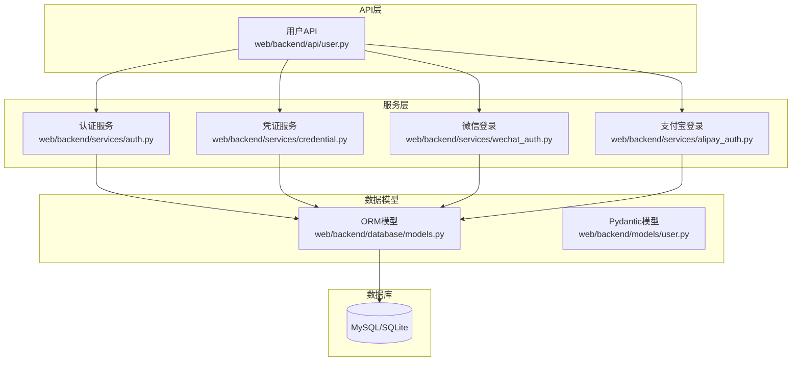
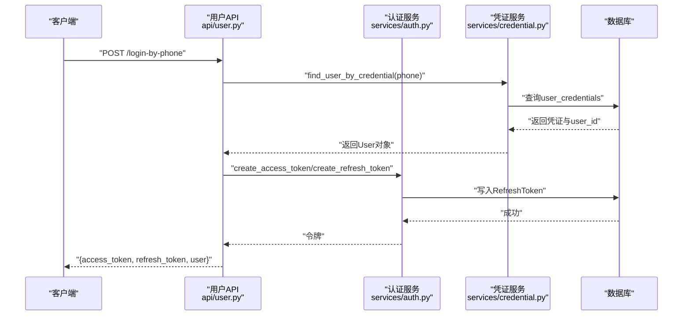
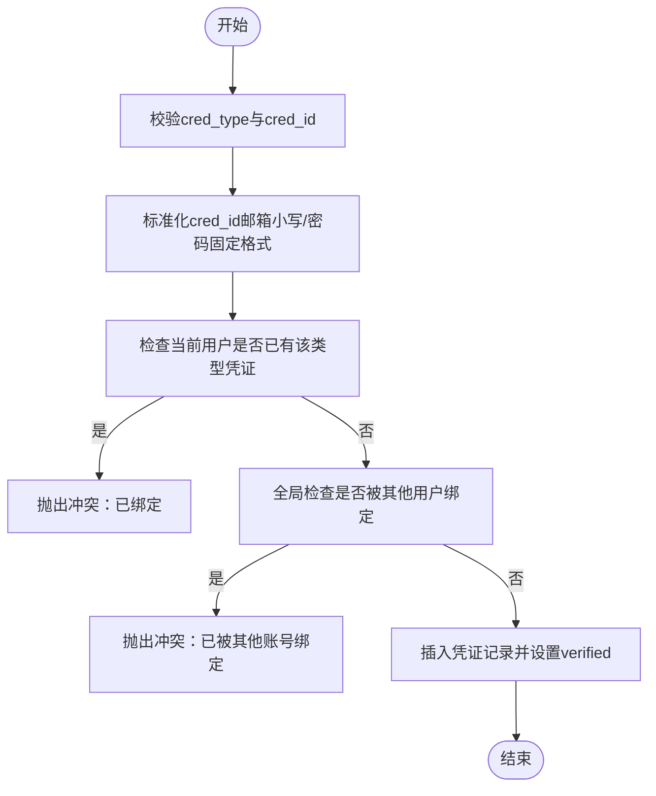
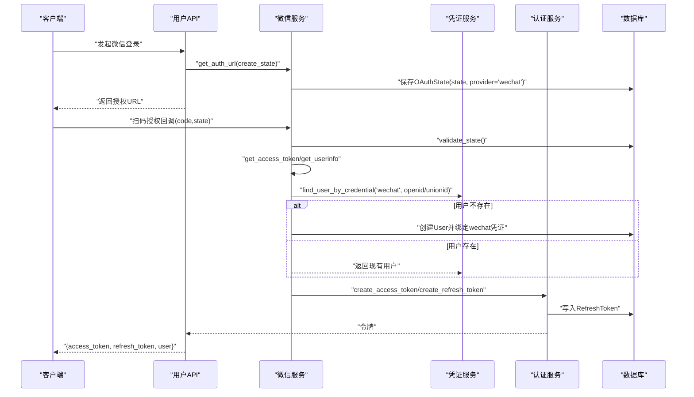
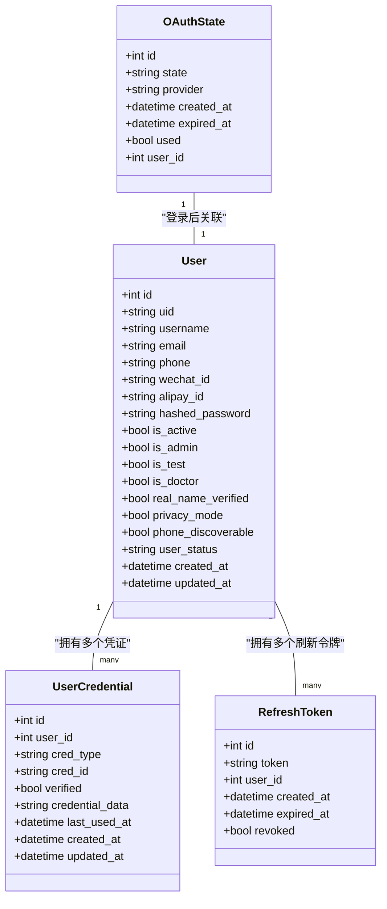

# 用户模型设计

<cite>
**本文引用的文件**   
- [web/backend/database/models.py](file://web/backend/database/models.py)
- [web/backend/models/user.py](file://web/backend/models/user.py)
- [web/backend/api/user.py](file://web/backend/api/user.py)
- [web/backend/services/auth.py](file://web/backend/services/auth.py)
- [web/backend/services/credential.py](file://web/backend/services/credential.py)
- [web/backend/services/wechat_auth.py](file://web/backend/services/wechat_auth.py)
- [web/backend/services/alipay_auth.py](file://web/backend/services/alipay_auth.py)
- [web/backend/database/migration_auth_v2.py](file://web/backend/database/migration_auth_v2.py)
- [web/backend/database/migration_add_uid.py](file://web/backend/database/migration_add_uid.py)
- [web/backend/database/init_db.py](file://web/backend/database/init_db.py)
</cite>

## 目录
1. [简介](#简介)
2. [项目结构](#项目结构)
3. [核心组件](#核心组件)
4. [架构总览](#架构总览)
5. [详细组件分析](#详细组件分析)
6. [依赖关系分析](#依赖关系分析)
7. [性能考虑](#性能考虑)
8. [故障排查指南](#故障排查指南)
9. [结论](#结论)
10. [附录：SQL与迁移示例](#附录sql与迁移示例)

## 简介
本技术文档围绕“用户模型”展开，系统性阐述 User 实体、UserCredential 凭证体系、状态字段语义、索引策略、数据完整性约束以及多认证方式（手机号、邮箱、密码、微信、支付宝）的存储与校验流程。同时给出数据库表结构设计要点、字段验证规则、性能优化建议，并提供可直接落地的 SQL 示例与迁移方案参考。

## 项目结构
与用户模型相关的代码主要分布在以下模块：
- ORM 模型定义：web/backend/database/models.py
- Pydantic 请求/响应模型：web/backend/models/user.py
- 用户相关 API：web/backend/api/user.py
- 认证服务（JWT、刷新令牌、密码哈希等）：web/backend/services/auth.py
- 凭证服务（绑定/解绑/查找/校验）：web/backend/services/credential.py
- 第三方登录（微信、支付宝）：web/backend/services/wechat_auth.py, web/backend/services/alipay_auth.py
- 数据库初始化与迁移脚本：web/backend/database/init_db.py, migration_auth_v2.py, migration_add_uid.py

**图表来源** 
- [web/backend/api/user.py](file://web/backend/api/user.py)
- [web/backend/services/auth.py](file://web/backend/services/auth.py)
- [web/backend/services/credential.py](file://web/backend/services/credential.py)
- [web/backend/services/wechat_auth.py](file://web/backend/services/wechat_auth.py)
- [web/backend/services/alipay_auth.py](file://web/backend/services/alipay_auth.py)
- [web/backend/database/models.py](file://web/backend/database/models.py)
- [web/backend/models/user.py](file://web/backend/models/user.py)

**章节来源**
- [web/backend/database/models.py:88-179](file://web/backend/database/models.py#L88-L179)
- [web/backend/models/user.py:10-138](file://web/backend/models/user.py#L10-L138)

## 核心组件
- User（用户主实体）
  - 标识：id（自增主键）、uid（业务唯一ID，可选）
  - 身份：username（唯一）、email（唯一）、phone（唯一）
  - 社交：wechat_id（唯一）、alipay_id（唯一）
  - 密码：hashed_password（可空，社交登录用户可为空）
  - 状态：is_active、is_admin、is_test、is_doctor、real_name_verified、privacy_mode、phone_discoverable
  - 行为与风控：user_status（normal/muted/banned）、muted_until、banned_at、ban_reason、violation_count/critical_count/warning_count
  - 时间戳：created_at、updated_at
  - 关联：评论、患者档案、默认档案引用等

- UserCredential（用户凭证）
  - 支持 cred_type：phone、email、password、wechat、alipay
  - 字段：cred_id（标准化后的唯一值）、verified、credential_data（如密码哈希JSON）、last_used_at、创建/更新时间
  - 约束：(cred_type, cred_id) 唯一；按 user_id、cred_type+cred_id 建立索引

- 辅助表
  - SMSCode、EmailVerificationCode：短信/邮箱验证码
  - OAuthState：OAuth state（CSRF防护）
  - RefreshToken：刷新令牌

**章节来源**
- [web/backend/database/models.py:88-179](file://web/backend/database/models.py#L88-L179)
- [web/backend/database/models.py:30-86](file://web/backend/database/models.py#L30-L86)

## 架构总览
用户认证与授权的整体流程如下：
- 传统账号密码：用户名/手机/邮箱 + 密码 → JWT access_token + refresh_token
- 验证码登录：手机号/邮箱 + 验证码 → JWT
- 第三方登录：微信/支付宝扫码 → 获取第三方用户ID → 绑定或创建用户 → JWT
- 统一凭据管理：所有登录方式均通过 UserCredential 统一管理，便于扩展与审计

**图表来源** 
- [web/backend/api/user.py:526-546](file://web/backend/api/user.py#L526-L546)
- [web/backend/services/auth.py:96-127](file://web/backend/services/auth.py#L96-L127)
- [web/backend/services/credential.py:37-49](file://web/backend/services/credential.py#L37-L49)

## 详细组件分析

### User 实体模型
- 字段类型与约束
  - id: Integer PK, index
  - uid: String, unique, index, nullable
  - username/email/phone: String, unique, index, phone/email/username 分别有业务唯一性
  - wechat_id/alipay_id: String, unique, index
  - hashed_password: String, nullable（社交登录用户可为空）
  - is_active/is_admin/is_test/is_doctor/real_name_verified: Boolean
  - privacy_mode/phone_discoverable: Boolean（隐私控制）
  - patient_relation: String（白友关系枚举）
  - default_tracker/report/diary profile IDs: ForeignKey to PatientProfile
  - user_status: String(20), index（normal/muted/banned）
  - muted_until/banned_at/ban_reason/violation_count/critical_count/warning_count: 风控字段
  - created_at/updated_at: DateTime, UTC

- 关系映射
  - 与 Comment、PatientProfile、Post、Collection、Bookmark、UserInteractionLog 等多表存在外键或反向引用
  - 默认档案字段使用 post_update=True 避免循环更新问题

- 索引策略
  - 主键与常用查询字段（username/email/phone/wechat_id/alipay_id）均建索引
  - user_status 用于快速过滤活跃/封禁用户
  - 时间字段 created_at/updated_at 便于审计与排序

- 业务含义
  - is_active：账户是否启用（未激活无法登录）
  - is_admin：管理员标识（权限控制）
  - is_test：测试账号标记
  - is_doctor：医生认证标识
  - real_name_verified：实名认证标识
  - privacy_mode：隐私模式（影响可见性与匹配）
  - phone_discoverable：允许他人通过手机号匹配到该用户（受隐私模式限制）
  - user_status：正常/静音/封禁，配合封禁时间与原因字段实现精细化管控

**章节来源**
- [web/backend/database/models.py:88-154](file://web/backend/database/models.py#L88-L154)
- [web/backend/models/user.py:120-131](file://web/backend/models/user.py#L120-L131)

### UserCredential 凭证系统
- 设计原理
  - 将多种登录方式抽象为统一的凭证记录，避免在 User 表中膨胀大量列
  - cred_type 区分来源（phone/email/password/wechat/alipay）
  - cred_id 存储标准化后的唯一值（邮箱小写、手机号原样、密码固定为 password:user_id）
  - credential_data 存储扩展信息（如密码哈希 JSON）
  - verified 表示是否已验证（验证码通过后置为真）
  - last_used_at 记录最近使用时间，便于统计与风控

- 约束与索引
  - (cred_type, cred_id) 唯一约束防止重复绑定
  - 索引 idx_cred_user(user_id)、idx_cred_lookup(cred_type, cred_id) 加速查找

- 典型流程
  - 绑定：检查用户是否已绑定同类型凭证；检查全局是否已被其他用户占用；写入并设置 verified
  - 解绑：至少保留一个登录方式，否则拒绝
  - 查找：根据 cred_type+cred_id 定位用户

**图表来源** 
- [web/backend/services/credential.py:63-102](file://web/backend/services/credential.py#L63-L102)

**章节来源**
- [web/backend/database/models.py:156-179](file://web/backend/database/models.py#L156-L179)
- [web/backend/services/credential.py:1-151](file://web/backend/services/credential.py#L1-L151)

### 多认证方式支持
- 手机号验证码登录
  - 发送验证码：IP维度限速 + 目标号码冷却与上限
  - 登录：校验验证码 → 通过 cred_type=phone 查找用户 → 生成JWT
- 邮箱验证码登录
  - 发送验证码：目的参数 login/register/reset/bind
  - 登录：校验验证码 → 通过 cred_type=email 查找用户 → 生成JWT
- 密码登录
  - 用户名/手机号/邮箱 + 密码 → 从 UserCredential(password) 中读取哈希 → 校验 → 生成JWT
- 微信登录
  - 生成state → 跳转微信授权 → 回调获取access_token与openid/unionid → 查找或创建用户 → 绑定weixin凭证 → 生成JWT
- 支付宝登录
  - 生成state → 跳转支付宝授权 → 回调获取token与用户信息 → 查找或创建用户 → 绑定alipay凭证 → 生成JWT

**图表来源** 
- [web/backend/services/wechat_auth.py:54-151](file://web/backend/services/wechat_auth.py#L54-L151)
- [web/backend/services/auth.py:96-127](file://web/backend/services/auth.py#L96-L127)
- [web/backend/services/credential.py:37-49](file://web/backend/services/credential.py#L37-L49)

**章节来源**
- [web/backend/api/user.py:454-481](file://web/backend/api/user.py#L454-L481)
- [web/backend/api/user.py:484-546](file://web/backend/api/user.py#L484-L546)
- [web/backend/services/wechat_auth.py:1-156](file://web/backend/services/wechat_auth.py#L1-L156)
- [web/backend/services/alipay_auth.py:1-190](file://web/backend/services/alipay_auth.py#L1-L190)

### 用户状态管理字段
- is_active：账户启用开关，未激活用户无法登录
- is_admin：管理员标识，用于后台权限控制
- is_test：测试账号标记，便于隔离测试数据
- is_doctor：医生认证标识，用于医疗相关功能权限
- real_name_verified：实名认证标识，满足合规要求
- privacy_mode：隐私模式，影响用户可见性与匹配策略
- phone_discoverable：允许通过手机号匹配到该用户（受隐私模式限制）
- user_status：normal/muted/banned，配合封禁时间与原因实现精细化风控

这些字段在 API 层与鉴权中间件中被广泛使用，确保访问控制与用户体验的一致性。

**章节来源**
- [web/backend/database/models.py:88-154](file://web/backend/database/models.py#L88-L154)
- [web/backend/services/auth.py:179-221](file://web/backend/services/auth.py#L179-L221)

## 依赖关系分析
- API 层依赖认证服务与凭证服务，完成登录、注册、绑定、解绑等操作
- 认证服务负责 JWT 签发与校验、刷新令牌管理、密码哈希
- 凭证服务提供统一的凭据绑定/查找/校验逻辑
- 第三方登录服务依赖凭证服务进行用户查找与绑定
- ORM 模型定义表结构与关系，支撑上层服务

**图表来源** 
- [web/backend/database/models.py:88-179](file://web/backend/database/models.py#L88-L179)
- [web/backend/database/models.py:61-86](file://web/backend/database/models.py#L61-L86)

**章节来源**
- [web/backend/database/models.py:88-179](file://web/backend/database/models.py#L88-L179)

## 性能考虑
- 索引优化
  - 对高频查询字段（username/email/phone/wechat_id/alipay_id、user_status、cred_type+cred_id）建立索引
  - 复合索引（cred_type, cred_id）提升凭证查找效率
- 数据一致性
  - 使用唯一约束防止重复绑定与冲突
  - 外键约束保证用户与凭证、刷新令牌之间的关系完整
- 令牌清理
  - 定期清理过期或撤销的刷新令牌，避免数据库膨胀
- 缓存与限流
  - 验证码发送增加 IP 维度限速，防止滥用
  - 敏感操作（换绑手机号/邮箱）强制验证码校验，降低会话劫持风险

**章节来源**
- [web/backend/services/auth.py:285-309](file://web/backend/services/auth.py#L285-L309)
- [web/backend/api/user.py:419-452](file://web/backend/api/user.py#L419-L452)

## 故障排查指南
- 登录失败
  - 检查凭证是否存在且已验证（cred_type+cred_id）
  - 密码登录需确认 UserCredential(password).credential_data 包含哈希
  - 账户状态 is_active 与 user_status 是否正常
- 绑定冲突
  - 同一用户重复绑定同类型凭证会抛出冲突错误
  - 全局已被其他用户占用的凭证会被拒绝
- 令牌失效
  - 检查 RefreshToken 是否过期或被撤销
  - 重置密码后会撤销所有刷新令牌，需重新登录
- 第三方登录异常
  - 检查 OAuthState 是否有效（未过期、未使用）
  - 确认第三方平台配置（AppID、密钥、回调地址）正确

**章节来源**
- [web/backend/services/credential.py:63-124](file://web/backend/services/credential.py#L63-L124)
- [web/backend/services/auth.py:113-151](file://web/backend/services/auth.py#L113-L151)
- [web/backend/services/wechat_auth.py:62-79](file://web/backend/services/wechat_auth.py#L62-L79)
- [web/backend/services/alipay_auth.py:88-105](file://web/backend/services/alipay_auth.py#L88-L105)

## 结论
本设计通过 User 与 UserCredential 的分离，实现了灵活可扩展的多认证体系，结合严格的约束与索引策略，保障了数据一致性与查询性能。状态字段与风控机制为运营与安全提供了坚实基础。后续可在不改动核心结构的前提下，轻松接入新的第三方登录方式或增强安全策略。

## 附录：SQL与迁移示例
以下为基于现有 ORM 模型的 SQL 示例与迁移思路，供落地参考：

- 创建用户表与凭证表（概念性示例）
  - users：包含 id、uid、username、email、phone、wechat_id、alipay_id、hashed_password、is_active、is_admin、is_test、is_doctor、real_name_verified、privacy_mode、phone_discoverable、user_status、muted_until、banned_at、ban_reason、violation_count、critical_count、warning_count、created_at、updated_at
  - user_credentials：包含 id、user_id、cred_type、cred_id、verified、credential_data、last_used_at、created_at、updated_at，并添加唯一约束 (cred_type, cred_id) 与索引

- 验证码与令牌表
  - sms_codes、email_verification_codes、oauth_states、refresh_tokens

- 迁移步骤
  - 执行认证系统V2迁移：创建新表、修改 users.hashed_password 为可空
  - 执行 UID 迁移：为现有用户生成 uid 并回填

- 初始化
  - 创建数据库表结构
  - 创建管理员账户
  - 初始化社区分类（如需）

**章节来源**
- [web/backend/database/migration_auth_v2.py:25-63](file://web/backend/database/migration_auth_v2.py#L25-L63)
- [web/backend/database/migration_add_uid.py:12-81](file://web/backend/database/migration_add_uid.py#L12-L81)
- [web/backend/database/init_db.py:20-46](file://web/backend/database/init_db.py#L20-L46)