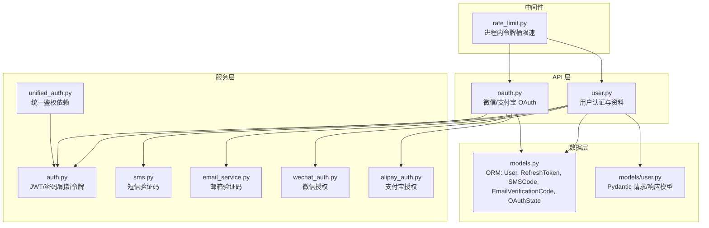
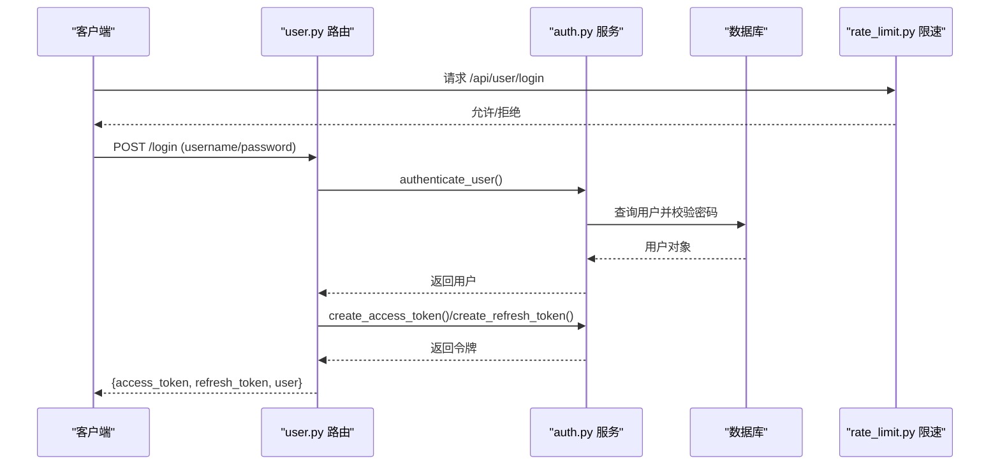
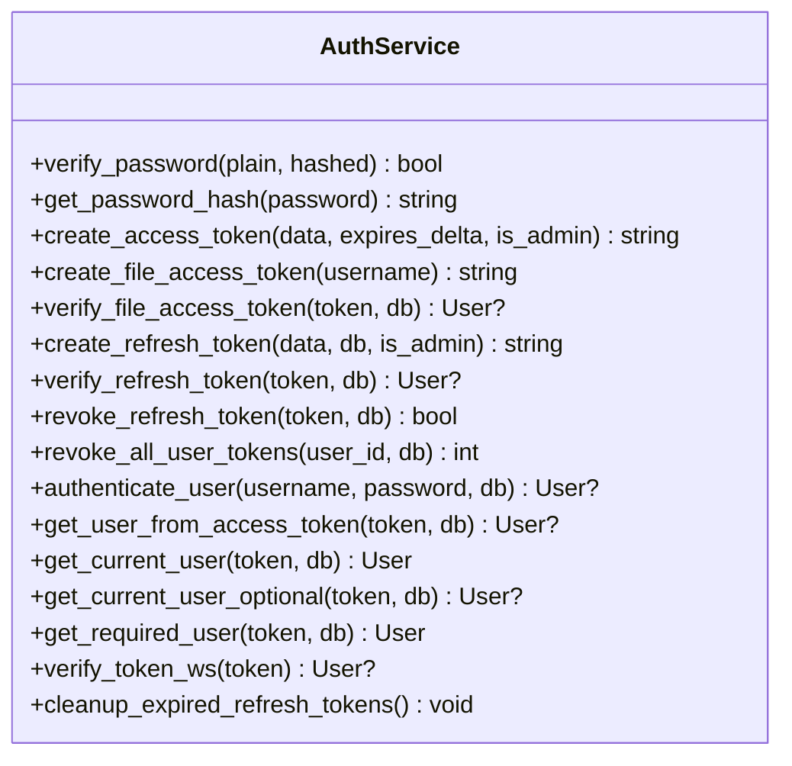
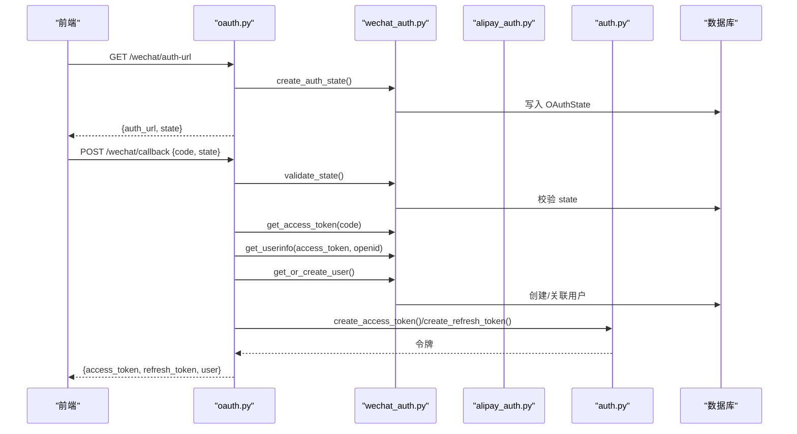
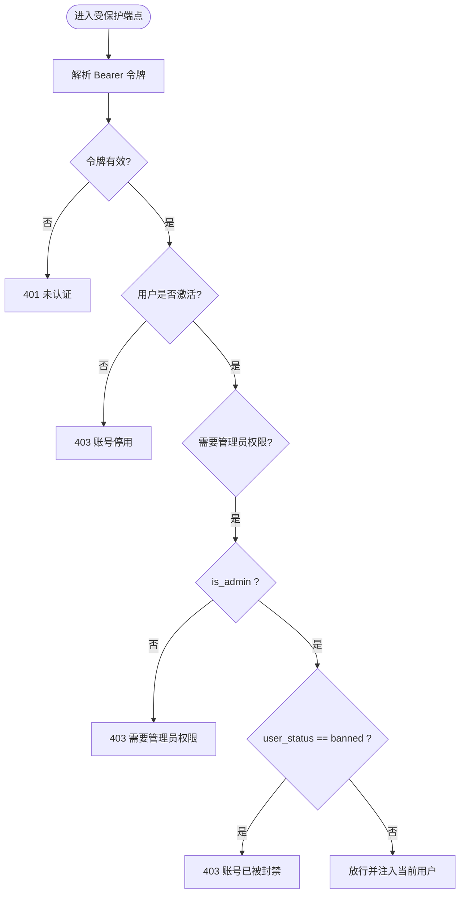
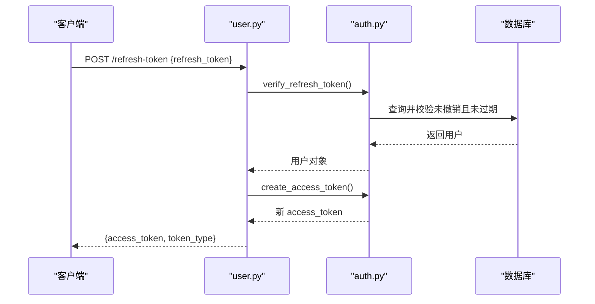
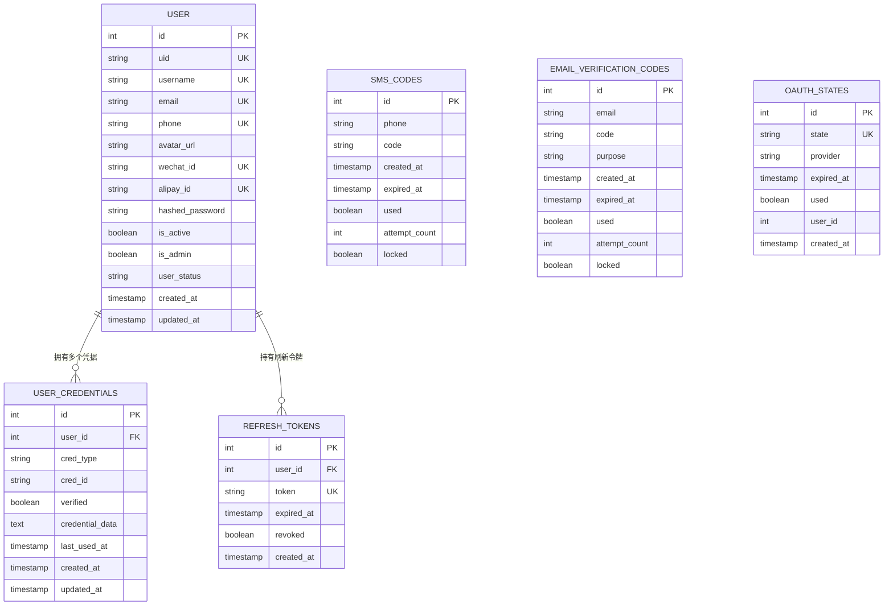
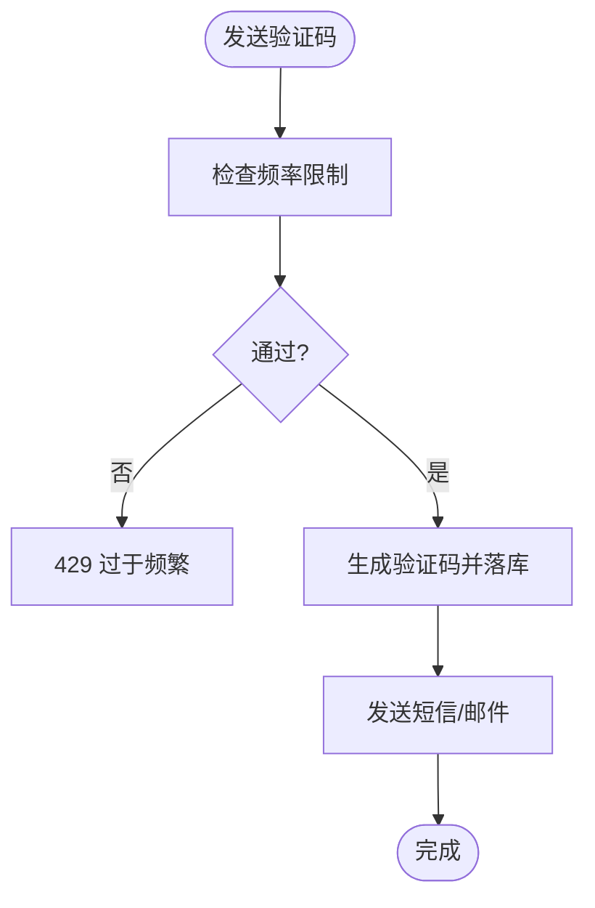
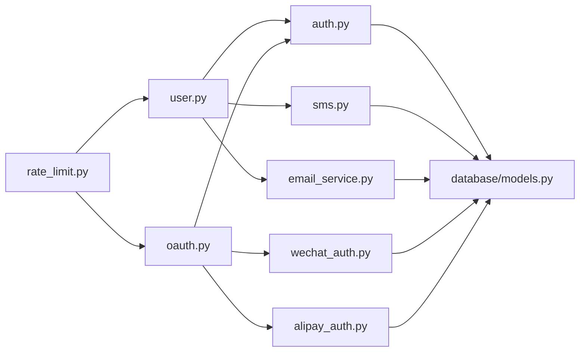

# 用户认证服务

<cite>
**本文引用的文件**   
- [web/backend/services/auth.py](file://web/backend/services/auth.py)
- [web/backend/services/unified_auth.py](file://web/backend/services/unified_auth.py)
- [web/backend/api/oauth.py](file://web/backend/api/oauth.py)
- [web/backend/api/user.py](file://web/backend/api/user.py)
- [web/backend/models/user.py](file://web/backend/models/user.py)
- [web/backend/database/models.py](file://web/backend/database/models.py)
- [web/backend/services/sms.py](file://web/backend/services/sms.py)
- [web/backend/services/email_service.py](file://web/backend/services/email_service.py)
- [web/backend/app/middleware/rate_limit.py](file://web/backend/app/middleware/rate_limit.py)
</cite>

## 目录
1. [简介](#简介)
2. [项目结构](#项目结构)
3. [核心组件](#核心组件)
4. [架构总览](#架构总览)
5. [详细组件分析](#详细组件分析)
6. [依赖关系分析](#依赖关系分析)
7. [性能考量](#性能考量)
8. [故障排查指南](#故障排查指南)
9. [结论](#结论)
10. [附录：API 接口规范与安全最佳实践](#附录api-接口规范与安全最佳实践)

## 简介
本技术文档面向“用户认证服务”，覆盖 JWT 令牌管理、多方式登录（邮箱、手机、OAuth）、权限控制、会话管理与安全策略。重点说明用户模型设计、密码加密算法、令牌刷新机制、登录状态维护与防暴力破解措施，并提供 API 接口规范、请求响应示例、错误处理方案、性能优化建议以及集成示例和安全最佳实践。

## 项目结构
认证相关代码主要分布在以下模块：
- API 层：用户认证与 OAuth 回调路由
- 服务层：JWT/密码/验证码/OAuth 业务逻辑
- 数据模型：ORM 实体与 Pydantic 校验模型
- 中间件：通用鉴权与限速

图表来源
- [web/backend/api/user.py:1-120](file://web/backend/api/user.py#L1-L120)
- [web/backend/api/oauth.py:1-60](file://web/backend/api/oauth.py#L1-L60)
- [web/backend/services/auth.py:1-60](file://web/backend/services/auth.py#L1-L60)
- [web/backend/services/unified_auth.py:1-40](file://web/backend/services/unified_auth.py#L1-L40)
- [web/backend/services/sms.py:1-60](file://web/backend/services/sms.py#L1-L60)
- [web/backend/services/email_service.py:1-60](file://web/backend/services/email_service.py#L1-L60)
- [web/backend/database/models.py:60-120](file://web/backend/database/models.py#L60-L120)
- [web/backend/app/middleware/rate_limit.py:1-40](file://web/backend/app/middleware/rate_limit.py#L1-L40)

章节来源
- [web/backend/api/user.py:1-120](file://web/backend/api/user.py#L1-L120)
- [web/backend/api/oauth.py:1-60](file://web/backend/api/oauth.py#L1-L60)
- [web/backend/services/auth.py:1-60](file://web/backend/services/auth.py#L1-L60)
- [web/backend/services/unified_auth.py:1-40](file://web/backend/services/unified_auth.py#L1-L40)
- [web/backend/services/sms.py:1-60](file://web/backend/services/sms.py#L1-L60)
- [web/backend/services/email_service.py:1-60](file://web/backend/services/email_service.py#L1-L60)
- [web/backend/database/models.py:60-120](file://web/backend/database/models.py#L60-L120)
- [web/backend/app/middleware/rate_limit.py:1-40](file://web/backend/app/middleware/rate_limit.py#L1-L40)

## 核心组件
- JWT 认证服务：访问令牌、刷新令牌、文件专用短效令牌、WebSocket 鉴权
- 统一鉴权依赖：Bearer 令牌解析、活跃/管理员权限检查
- 用户认证 API：用户名/手机号/邮箱 + 密码登录、手机/邮箱验证码登录、注册、绑定/解绑凭证、重置密码、刷新令牌
- OAuth 登录：微信、支付宝扫码登录流程（state 防护、轮询）
- 验证码服务：短信与邮箱验证码的生成、发送、限频、锁定与验证
- 数据模型：User、RefreshToken、SMSCode、EmailVerificationCode、OAuthState、UserCredential
- 速率限制：按 IP/用户维度的令牌桶限速

章节来源
- [web/backend/services/auth.py:1-120](file://web/backend/services/auth.py#L1-L120)
- [web/backend/services/unified_auth.py:1-68](file://web/backend/services/unified_auth.py#L1-L68)
- [web/backend/api/user.py:1-120](file://web/backend/api/user.py#L1-L120)
- [web/backend/api/oauth.py:1-60](file://web/backend/api/oauth.py#L1-L60)
- [web/backend/services/sms.py:1-120](file://web/backend/services/sms.py#L1-L120)
- [web/backend/services/email_service.py:1-120](file://web/backend/services/email_service.py#L1-L120)
- [web/backend/database/models.py:60-200](file://web/backend/database/models.py#L60-L200)
- [web/backend/app/middleware/rate_limit.py:1-96](file://web/backend/app/middleware/rate_limit.py#L1-L96)

## 架构总览
整体采用 FastAPI 分层架构：API 路由负责入参校验与编排，服务层封装业务逻辑（JWT、验证码、OAuth），数据层通过 SQLAlchemy ORM 操作数据库，中间件提供统一鉴权与限速。

图表来源
- [web/backend/api/user.py:217-229](file://web/backend/api/user.py#L217-L229)
- [web/backend/services/auth.py:153-176](file://web/backend/services/auth.py#L153-L176)
- [web/backend/app/middleware/rate_limit.py:39-66](file://web/backend/app/middleware/rate_limit.py#L39-L66)

## 详细组件分析

### JWT 令牌管理机制
- 访问令牌：基于 HS256（可配置），包含子主体、类型、过期时间、管理员标记；支持普通与管理员两种过期策略；文件专用短效令牌仅用于文件读取且带 scope。
- 刷新令牌：服务端持久化存储，支持撤销与批量撤销；清理任务定期删除过期或已撤销记录。
- WebSocket 鉴权：从查询参数解析 JWT，兼容历史整数 subject。
- 密码哈希：bcrypt 上下文，提供哈希与校验方法。

图表来源
- [web/backend/services/auth.py:35-110](file://web/backend/services/auth.py#L35-L110)
- [web/backend/services/auth.py:113-151](file://web/backend/services/auth.py#L113-L151)
- [web/backend/services/auth.py:153-201](file://web/backend/services/auth.py#L153-L201)
- [web/backend/services/auth.py:204-254](file://web/backend/services/auth.py#L204-L254)
- [web/backend/services/auth.py:257-309](file://web/backend/services/auth.py#L257-L309)

章节来源
- [web/backend/services/auth.py:1-309](file://web/backend/services/auth.py#L1-L309)

### 多方式登录支持（邮箱、手机、OAuth）
- 用户名/手机号/邮箱 + 密码登录：统一入口，支持多种凭据匹配与密码校验。
- 手机验证码登录：发送验证码（IP 维度限频）、校验验证码、自动创建或查找用户并签发令牌。
- 邮箱验证码登录：发送验证码（频率限制）、校验验证码、自动创建或查找用户并签发令牌。
- OAuth 登录：微信与支付宝，包含 state 生成/校验、CSRF 防护、授权码换取 access_token、获取用户信息、自动创建用户并绑定第三方 ID。

图表来源
- [web/backend/api/oauth.py:39-77](file://web/backend/api/oauth.py#L39-L77)
- [web/backend/services/wechat_auth.py:54-151](file://web/backend/services/wechat_auth.py#L54-L151)
- [web/backend/services/auth.py:43-56](file://web/backend/services/auth.py#L43-L56)

章节来源
- [web/backend/api/user.py:217-229](file://web/backend/api/user.py#L217-L229)
- [web/backend/api/user.py:484-524](file://web/backend/api/user.py#L484-L524)
- [web/backend/api/user.py:582-602](file://web/backend/api/user.py#L582-L602)
- [web/backend/api/oauth.py:39-169](file://web/backend/api/oauth.py#L39-L169)
- [web/backend/services/wechat_auth.py:1-156](file://web/backend/services/wechat_auth.py#L1-L156)
- [web/backend/services/alipay_auth.py:1-190](file://web/backend/services/alipay_auth.py#L1-L190)

### 权限控制系统
- 统一鉴权依赖：优先解析 Bearer 令牌，失败则抛出 401；可选用户解析用于匿名场景。
- 活跃用户检查：is_active 为 false 时返回 403。
- 管理员检查：is_admin 为 false 时返回 403。
- 封禁处理：user_status="banned" 时返回 403，并携带封禁原因。

图表来源
- [web/backend/services/unified_auth.py:18-53](file://web/backend/services/unified_auth.py#L18-L53)
- [web/backend/services/auth.py:198-254](file://web/backend/services/auth.py#L198-L254)

章节来源
- [web/backend/services/unified_auth.py:1-68](file://web/backend/services/unified_auth.py#L1-L68)
- [web/backend/services/auth.py:198-254](file://web/backend/services/auth.py#L198-L254)

### 会话管理与令牌刷新机制
- 刷新令牌：服务端持久化，支持单条撤销与批量撤销；密码重置时强制撤销所有刷新令牌以强制重新认证。
- 清理任务：定时清理过期或已撤销的刷新令牌，防止数据库膨胀。
- 文件专用令牌：短效、scope=files，仅用于文件读取，降低泄露影响面。

图表来源
- [web/backend/api/user.py:776-800](file://web/backend/api/user.py#L776-L800)
- [web/backend/services/auth.py:96-151](file://web/backend/services/auth.py#L96-L151)
- [web/backend/services/auth.py:285-309](file://web/backend/services/auth.py#L285-L309)

章节来源
- [web/backend/services/auth.py:96-151](file://web/backend/services/auth.py#L96-L151)
- [web/backend/services/auth.py:285-309](file://web/backend/services/auth.py#L285-L309)
- [web/backend/api/user.py:776-800](file://web/backend/api/user.py#L776-L800)

### 用户模型设计与凭证体系
- User 表：包含基础字段、社交 ID、隐私开关、封禁状态等。
- UserCredential：多凭据绑定（phone/email/password/wechat/alipay），支持 verified 与 last_used_at。
- 同步逻辑：登录与资料更新时同步凭据到 User 字段，保证前端展示一致性。

图表来源
- [web/backend/database/models.py:88-200](file://web/backend/database/models.py#L88-L200)
- [web/backend/database/models.py:30-74](file://web/backend/database/models.py#L30-L74)
- [web/backend/database/models.py:75-87](file://web/backend/database/models.py#L75-L87)

章节来源
- [web/backend/database/models.py:88-200](file://web/backend/database/models.py#L88-L200)
- [web/backend/models/user.py:1-138](file://web/backend/models/user.py#L1-L138)
- [web/backend/api/user.py:135-175](file://web/backend/api/user.py#L135-L175)

### 密码加密算法与安全性
- 使用 bcrypt 进行密码哈希与校验，避免明文存储。
- 凭据表集中管理密码哈希，支持无密码社交登录用户。
- 重置密码后强制撤销所有刷新令牌，确保其他设备需重新认证。

章节来源
- [web/backend/services/auth.py:35-41](file://web/backend/services/auth.py#L35-L41)
- [web/backend/api/user.py:153-175](file://web/backend/api/user.py#L153-L175)
- [web/backend/api/user.py:776-800](file://web/backend/api/user.py#L776-L800)

### 防暴力破解措施
- 短信验证码：
  - 每号 60 秒冷却，每日上限 10 次。
  - 连续失败 5 次锁定该验证码记录。
  - IP 维度每小时最多发送固定次数（默认 20）。
- 邮箱验证码：
  - 每号 60 秒冷却，每日上限 10 次。
  - 连续失败 5 次锁定该验证码记录。
- 通用速率限制：
  - 读接口按 IP 限速，写接口按用户/IP 限速，聊天接口按用户/IP 限速。

图表来源
- [web/backend/services/sms.py:32-87](file://web/backend/services/sms.py#L32-L87)
- [web/backend/services/email_service.py:39-99](file://web/backend/services/email_service.py#L39-L99)
- [web/backend/api/user.py:419-452](file://web/backend/api/user.py#L419-L452)
- [web/backend/app/middleware/rate_limit.py:39-96](file://web/backend/app/middleware/rate_limit.py#L39-L96)

章节来源
- [web/backend/services/sms.py:32-147](file://web/backend/services/sms.py#L32-L147)
- [web/backend/services/email_service.py:39-147](file://web/backend/services/email_service.py#L39-L147)
- [web/backend/api/user.py:419-452](file://web/backend/api/user.py#L419-L452)
- [web/backend/app/middleware/rate_limit.py:39-96](file://web/backend/app/middleware/rate_limit.py#L39-L96)

## 依赖关系分析
- API 层依赖服务层：user.py 依赖 auth.py、sms.py、email_service.py；oauth.py 依赖 wechat_auth.py、alipay_auth.py、auth.py。
- 服务层依赖数据模型：auth.py、sms.py、email_service.py、wechat_auth.py、alipay_auth.py 均依赖 database/models.py。
- 中间件与 API：rate_limit.py 作为依赖在路由中使用，对读写与聊天接口进行限速。

图表来源
- [web/backend/api/user.py:1-120](file://web/backend/api/user.py#L1-L120)
- [web/backend/api/oauth.py:1-60](file://web/backend/api/oauth.py#L1-L60)
- [web/backend/services/auth.py:1-60](file://web/backend/services/auth.py#L1-L60)
- [web/backend/services/sms.py:1-60](file://web/backend/services/sms.py#L1-L60)
- [web/backend/services/email_service.py:1-60](file://web/backend/services/email_service.py#L1-L60)
- [web/backend/services/wechat_auth.py:1-60](file://web/backend/services/wechat_auth.py#L1-L60)
- [web/backend/services/alipay_auth.py:1-60](file://web/backend/services/alipay_auth.py#L1-L60)
- [web/backend/database/models.py:60-120](file://web/backend/database/models.py#L60-L120)
- [web/backend/app/middleware/rate_limit.py:1-40](file://web/backend/app/middleware/rate_limit.py#L1-L40)

章节来源
- [web/backend/api/user.py:1-120](file://web/backend/api/user.py#L1-L120)
- [web/backend/api/oauth.py:1-60](file://web/backend/api/oauth.py#L1-L60)
- [web/backend/services/auth.py:1-60](file://web/backend/services/auth.py#L1-L60)
- [web/backend/services/sms.py:1-60](file://web/backend/services/sms.py#L1-L60)
- [web/backend/services/email_service.py:1-60](file://web/backend/services/email_service.py#L1-L60)
- [web/backend/services/wechat_auth.py:1-60](file://web/backend/services/wechat_auth.py#L1-L60)
- [web/backend/services/alipay_auth.py:1-60](file://web/backend/services/alipay_auth.py#L1-L60)
- [web/backend/database/models.py:60-120](file://web/backend/database/models.py#L60-L120)
- [web/backend/app/middleware/rate_limit.py:1-40](file://web/backend/app/middleware/rate_limit.py#L1-L40)

## 性能考量
- 令牌校验与数据库查询：访问令牌解析后直接查用户，建议对用户表 username 建立索引（已存在）。
- 刷新令牌清理：定期清理过期/撤销记录，避免表膨胀。
- 验证码限频：本地内存与数据库结合，减少外部依赖调用开销。
- 速率限制：进程内令牌桶，重启后清空，适合单机部署；分布式场景建议使用 Redis 实现。
- 文件专用令牌：短效且受限 scope，降低泄露风险与资源滥用。

[本节为通用指导，不直接分析具体文件]

## 故障排查指南
- 401 未认证：检查 Authorization 头是否正确携带 Bearer 令牌；确认令牌未过期且 type=access。
- 403 账号停用/封禁：检查用户 is_active 与 user_status；封禁原因可通过 detail 获取。
- 验证码失败：检查验证码是否过期、是否被锁定、是否达到频率限制；开发模式可在日志中查看验证码。
- OAuth 失败：检查 state 是否有效、第三方授权配置是否完整、网络请求是否成功。
- 刷新令牌无效：检查数据库中是否存在未撤销且未过期的刷新令牌；必要时批量撤销并重新登录。

章节来源
- [web/backend/services/auth.py:198-254](file://web/backend/services/auth.py#L198-L254)
- [web/backend/services/sms.py:102-147](file://web/backend/services/sms.py#L102-L147)
- [web/backend/services/email_service.py:102-147](file://web/backend/services/email_service.py#L102-L147)
- [web/backend/api/oauth.py:47-77](file://web/backend/api/oauth.py#L47-L77)

## 结论
本认证服务通过 JWT 与刷新令牌实现无状态访问与有状态会话管理，支持多方式登录与 OAuth 集成，具备完善的权限控制与安全防护（验证码限频、锁定、封禁、速率限制）。建议在生产环境启用 HTTPS、严格配置环境变量、使用分布式限频与缓存以提升可扩展性与稳定性。

[本节为总结，不直接分析具体文件]

## 附录：API 接口规范与安全最佳实践

### 用户认证 API
- 用户名/手机号/邮箱 + 密码登录
  - 路径：POST /api/user/login
  - 请求体：OAuth2PasswordRequestForm（username, password）
  - 响应：{access_token, refresh_token, token_type, user}
- 手机验证码登录
  - 路径：POST /api/user/login-by-phone
  - 请求体：{phone, code}
  - 响应：{access_token, refresh_token, token_type, user}
- 邮箱验证码登录
  - 路径：POST /api/user/login-by-email
  - 请求体：{email, code}
  - 响应：{access_token, refresh_token, token_type, user}
- 手机密码登录
  - 路径：POST /api/user/login-by-phone-password
  - 请求体：{phone, password}
  - 响应：{access_token, refresh_token, token_type, user}
- 邮箱密码登录
  - 路径：POST /api/user/login-by-email-password
  - 请求体：{email, password}
  - 响应：{access_token, refresh_token, token_type, user}
- 注册（用户名+邮箱+密码）
  - 路径：POST /api/user/register
  - 请求体：{username, email, password}
  - 响应：{user}
- 注册（手机验证码）
  - 路径：POST /api/user/register-by-phone
  - 请求体：{phone, code, password?}
  - 响应：{access_token, refresh_token, token_type, user}
- 注册（邮箱验证码）
  - 路径：POST /api/user/register-by-email
  - 请求体：{email, code, username?, password}
  - 响应：{access_token, refresh_token, token_type, user}
- 刷新令牌
  - 路径：POST /api/user/refresh-token
  - 请求体：{refresh_token}
  - 响应：{access_token, token_type}
- 获取当前用户
  - 路径：GET /api/user/me
  - 头部：Authorization: Bearer <access_token>
  - 响应：{user}
- 设置/重置密码
  - 设置密码：POST /api/user/set-password
  - 重置密码：POST /api/user/reset-password
  - 请求体：根据端点要求（含验证码与凭据类型）
  - 响应：{detail}

章节来源
- [web/backend/api/user.py:217-229](file://web/backend/api/user.py#L217-L229)
- [web/backend/api/user.py:484-524](file://web/backend/api/user.py#L484-L524)
- [web/backend/api/user.py:582-602](file://web/backend/api/user.py#L582-L602)
- [web/backend/api/user.py:548-580](file://web/backend/api/user.py#L548-L580)
- [web/backend/api/user.py:664-696](file://web/backend/api/user.py#L664-L696)
- [web/backend/api/user.py:364-417](file://web/backend/api/user.py#L364-L417)
- [web/backend/api/user.py:776-800](file://web/backend/api/user.py#L776-L800)
- [web/backend/api/user.py:231-240](file://web/backend/api/user.py#L231-L240)

### OAuth 登录 API
- 微信授权 URL
  - 路径：GET /api/oauth/wechat/auth-url
  - 响应：{auth_url, state}
- 微信回调
  - 路径：POST /api/oauth/wechat/callback
  - 请求体：{code, state}
  - 响应：{access_token, refresh_token, token_type, user}
- 支付宝授权 URL
  - 路径：GET /api/oauth/alipay/auth-url
  - 响应：{auth_url, state}
- 支付宝回调
  - 路径：POST /api/oauth/alipay/callback
  - 请求体：{code, state}
  - 响应：{access_token, refresh_token, token_type, user}

章节来源
- [web/backend/api/oauth.py:39-77](file://web/backend/api/oauth.py#L39-L77)
- [web/backend/api/oauth.py:102-146](file://web/backend/api/oauth.py#L102-L146)

### 安全最佳实践
- 环境变量：SECRET_KEY、ALGORITHM、ACCESS_TOKEN_EXPIRE_MINUTES、REFRESH_TOKEN_DAYS、ADMIN_TOKEN_EXPIRE_DAYS、FILE_TOKEN_EXPIRE_MINUTES 必须正确配置。
- HTTPS：生产环境强制 HTTPS，启用 HSTS。
- CORS：仅允许可信来源。
- CSP：限制脚本与样式来源，避免 XSS。
- 速率限制：开启读/写/聊天接口限速，生产建议使用 Redis 实现分布式限频。
- 日志脱敏：验证码与手机号/邮箱在日志中脱敏。
- 令牌最小权限：文件专用令牌仅授予文件读取权限。
- 定期清理：运行刷新令牌清理任务，避免数据库膨胀。

章节来源
- [web/backend/services/auth.py:20-28](file://web/backend/services/auth.py#L20-L28)
- [web/backend/app/middleware/rate_limit.py:1-96](file://web/backend/app/middleware/rate_limit.py#L1-L96)
- [web/backend/services/sms.py:193-220](file://web/backend/services/sms.py#L193-L220)
- [web/backend/services/email_service.py:150-162](file://web/backend/services/email_service.py#L150-L162)