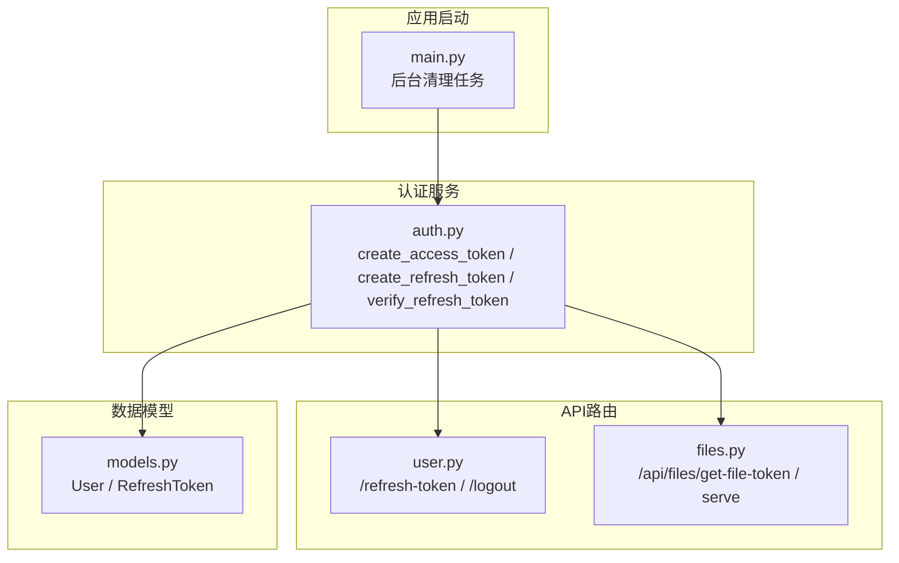
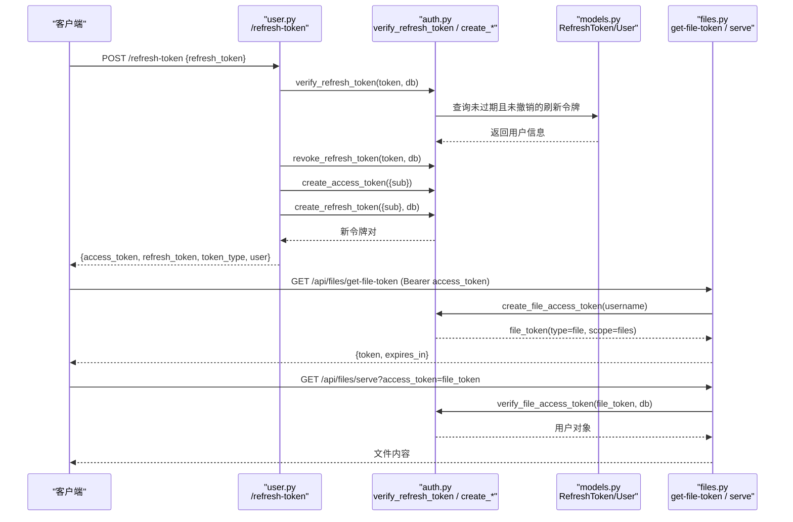
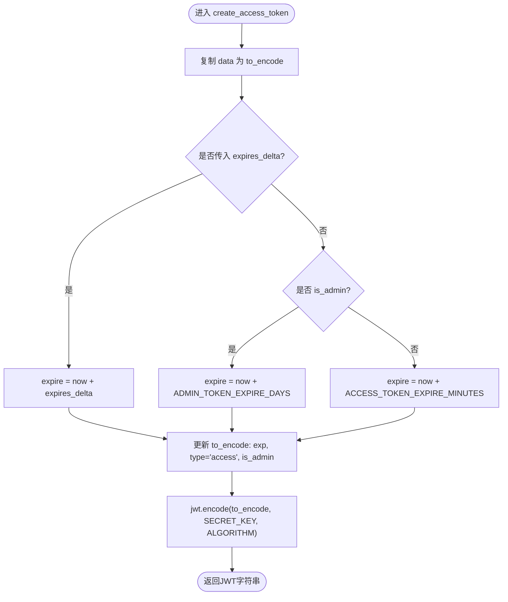
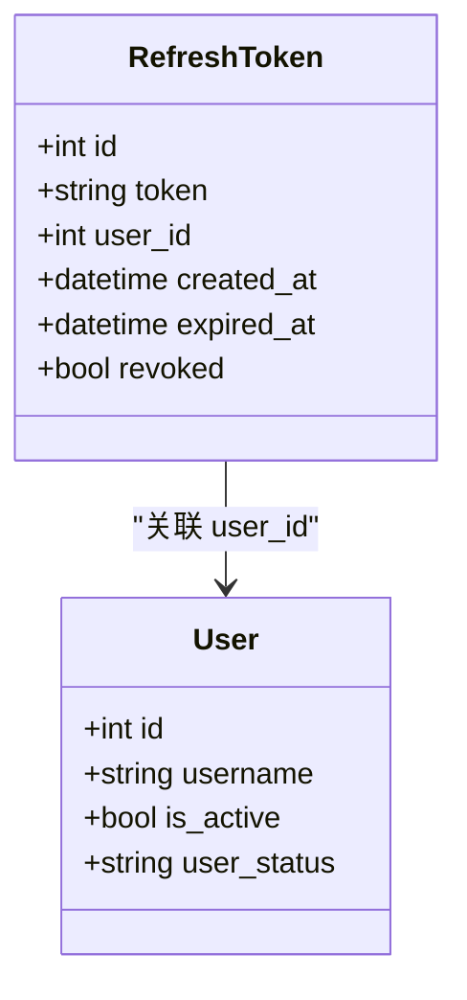
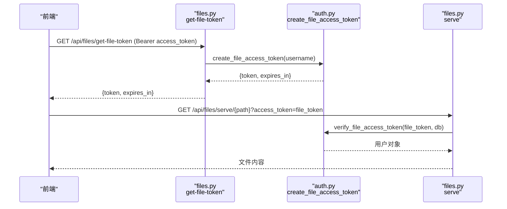
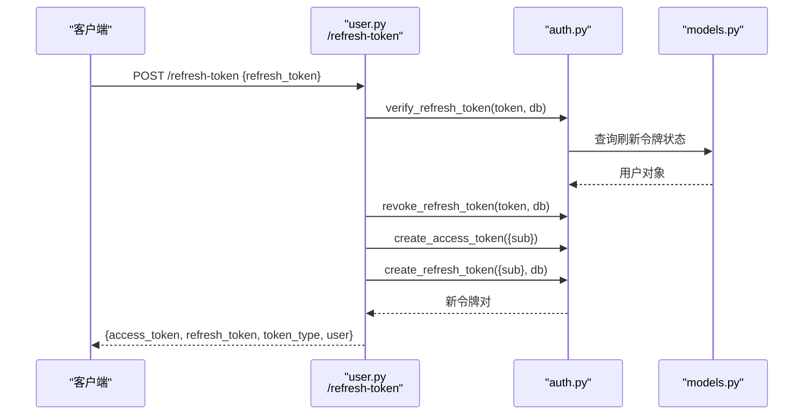
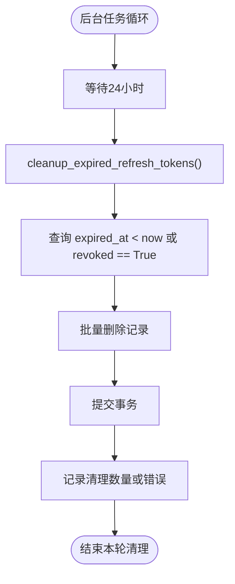
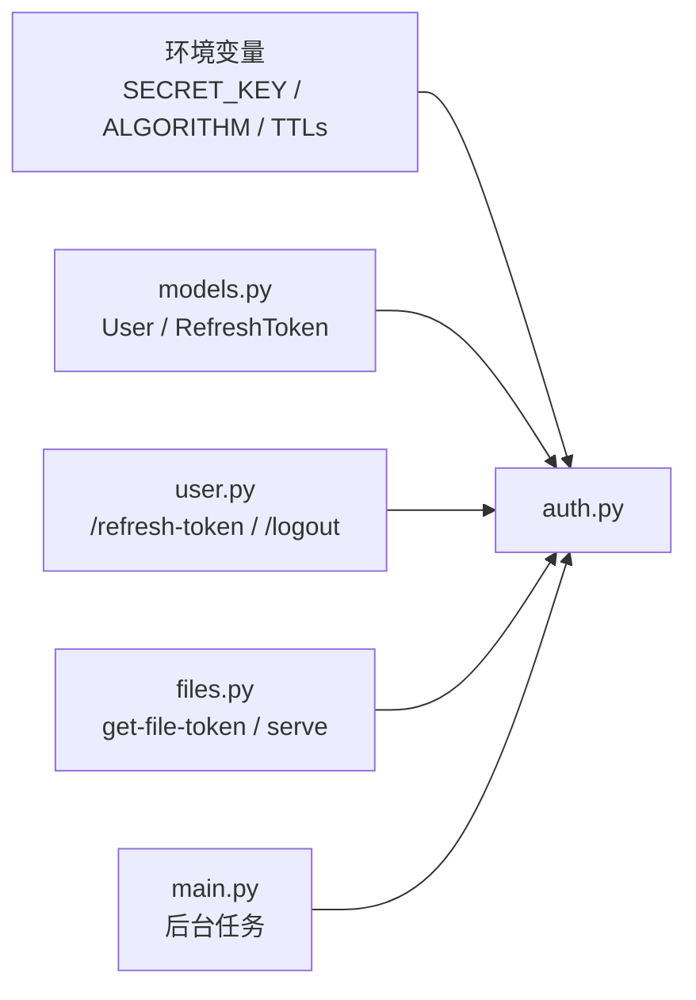

# JWT令牌管理

<cite>
**本文引用的文件**   
- [web/backend/services/auth.py](file://web/backend/services/auth.py)
- [web/backend/api/user.py](file://web/backend/api/user.py)
- [web/backend/api/files.py](file://web/backend/api/files.py)
- [web/backend/database/models.py](file://web/backend/database/models.py)
- [web/backend/app/main.py](file://web/backend/app/main.py)
- [tests/backend/services/test_auth.py](file://tests/backend/services/test_auth.py)
- [scripts/create_e2e_test_user.py](file://scripts/create_e2e_test_user.py)
</cite>

## 目录
1. [简介](#简介)
2. [项目结构](#项目结构)
3. [核心组件](#核心组件)
4. [架构总览](#架构总览)
5. [详细组件分析](#详细组件分析)
6. [依赖关系分析](#依赖关系分析)
7. [性能考量](#性能考量)
8. [故障排查指南](#故障排查指南)
9. [结论](#结论)
10. [附录：完整操作示例与最佳实践](#附录完整操作示例与最佳实践)

## 简介
本技术文档围绕JWT令牌管理系统展开，覆盖访问令牌（Access Token）与刷新令牌（Refresh Token）的完整生命周期：创建、验证、刷新与撤销。重点解析以下函数与机制：
- create_access_token：载荷结构、过期时间计算、管理员令牌特殊处理
- create_refresh_token / verify_refresh_token：数据库存储与验证流程
- create_file_access_token：文件专用令牌的安全设计（type字段与scope权限控制）
- 刷新接口与撤销机制：/refresh-token、logout、批量撤销、定时清理

## 项目结构
JWT相关代码主要位于后端服务层与API层：
- 服务层：web/backend/services/auth.py 实现令牌生成、校验、撤销与清理
- API层：web/backend/api/user.py 提供登录、刷新、登出等接口；web/backend/api/files.py 提供文件专用令牌与鉴权
- 数据模型：web/backend/database/models.py 定义用户与刷新令牌表结构
- 应用启动：web/backend/app/main.py 启动后台任务定期清理过期刷新令牌
- 测试与脚本：tests/backend/services/test_auth.py、scripts/create_e2e_test_user.py 提供使用示例与断言

**图表来源** 
- [web/backend/services/auth.py:43-126](file://web/backend/services/auth.py#L43-L126)
- [web/backend/api/user.py:803-820](file://web/backend/api/user.py#L803-L820)
- [web/backend/api/files.py:40-94](file://web/backend/api/files.py#L40-L94)
- [web/backend/database/models.py:75-86](file://web/backend/database/models.py#L75-L86)
- [web/backend/app/main.py:240-248](file://web/backend/app/main.py#L240-L248)

**章节来源**
- [web/backend/services/auth.py:1-309](file://web/backend/services/auth.py#L1-L309)
- [web/backend/api/user.py:803-820](file://web/backend/api/user.py#L803-L820)
- [web/backend/api/files.py:40-94](file://web/backend/api/files.py#L40-L94)
- [web/backend/database/models.py:75-86](file://web/backend/database/models.py#L75-L86)
- [web/backend/app/main.py:240-248](file://web/backend/app/main.py#L240-L248)

## 核心组件
- 访问令牌（Access Token）
  - 由 create_access_token 生成，载荷包含 sub、exp、type="access"、is_admin
  - 过期时间策略：支持自定义 expires_delta；管理员令牌默认极长有效期（ADMIN_TOKEN_EXPIRE_DAYS）；普通令牌默认 ACCESS_TOKEN_EXPIRE_MINUTES
- 刷新令牌（Refresh Token）
  - 由 create_refresh_token 生成并持久化到 refresh_tokens 表，记录 user_id、expired_at、revoked
  - 由 verify_refresh_token 校验有效性（未过期且未撤销），返回对应用户
- 文件专用令牌（File Access Token）
  - 由 create_file_access_token 生成，载荷 type="file"、scope="files"，短时效（FILE_TOKEN_EXPIRE_MINUTES）
  - 仅用于文件读取，不授予通用API权限
- 撤销与清理
  - revoke_refresh_token：单条撤销
  - revoke_all_user_tokens：按用户批量撤销
  - cleanup_expired_refresh_tokens：定时清理过期或已撤销的刷新令牌

**章节来源**
- [web/backend/services/auth.py:43-126](file://web/backend/services/auth.py#L43-L126)
- [web/backend/services/auth.py:96-151](file://web/backend/services/auth.py#L96-L151)
- [web/backend/services/auth.py:285-308](file://web/backend/services/auth.py#L285-L308)
- [web/backend/database/models.py:75-86](file://web/backend/database/models.py#L75-L86)

## 架构总览
下图展示从登录到令牌刷新、文件访问的端到端流程，以及后台清理任务的作用。

**图表来源** 
- [web/backend/api/user.py:803-820](file://web/backend/api/user.py#L803-L820)
- [web/backend/services/auth.py:96-126](file://web/backend/services/auth.py#L96-L126)
- [web/backend/api/files.py:40-94](file://web/backend/api/files.py#L40-L94)
- [web/backend/database/models.py:75-86](file://web/backend/database/models.py#L75-L86)

## 详细组件分析

### 访问令牌 create_access_token
- 输入参数
  - data：载荷字典，至少包含 sub（用户名）
  - expires_delta：可选，自定义过期时长
  - is_admin：是否管理员令牌
- 过期时间计算
  - 若传入 expires_delta，则 expire = now + expires_delta
  - 若 is_admin=True，则 expire = now + timedelta(days=ADMIN_TOKEN_EXPIRE_DAYS)
  - 否则 expire = now + timedelta(minutes=ACCESS_TOKEN_EXPIRE_MINUTES)
- 载荷结构
  - sub：用户名
  - exp：过期时间戳
  - type："access"
  - is_admin：布尔值
- 输出
  - 使用 SECRET_KEY 与 ALGORITHM（HS256）编码为JWT字符串

**图表来源** 
- [web/backend/services/auth.py:43-56](file://web/backend/services/auth.py#L43-L56)

**章节来源**
- [web/backend/services/auth.py:43-56](file://web/backend/services/auth.py#L43-L56)
- [tests/backend/services/test_auth.py:54-124](file://tests/backend/services/test_auth.py#L54-L124)

### 刷新令牌 create_refresh_token 与 verify_refresh_token
- create_refresh_token
  - 生成随机安全令牌 secrets.token_urlsafe(64)
  - 校验 data.sub 为用户名字符串，查找用户
  - 根据 is_admin 决定过期天数（ADMIN_TOKEN_EXPIRE_DAYS 或 REFRESH_TOKEN_EXPIRE_DAYS）
  - 写入数据库 RefreshToken 表（token、user_id、expired_at），提交事务后返回 token
- verify_refresh_token
  - 查询条件：token匹配、revoked=False、expired_at > now
  - 找到后通过 user_id 获取用户对象并返回

**图表来源** 
- [web/backend/database/models.py:75-86](file://web/backend/database/models.py#L75-L86)

**章节来源**
- [web/backend/services/auth.py:96-126](file://web/backend/services/auth.py#L96-L126)
- [web/backend/database/models.py:75-86](file://web/backend/database/models.py#L75-L86)

### 文件专用令牌 create_file_access_token
- 目的
  - 为文件读取场景提供短效、受限范围的令牌，降低泄露风险
- 载荷设计
  - sub：用户名
  - type："file"
  - scope："files"
  - exp：当前时间 + FILE_TOKEN_EXPIRE_MINUTES
- 验证逻辑
  - verify_file_access_token 严格校验 type="file" 且 scope="files"
  - 检查用户名存在且用户活跃、未被封禁
- 使用方式
  - 前端通过 /api/files/get-file-token 获取文件令牌，并在文件URL中附带 ?access_token=<file_token>
  - 文件服务优先接受 file_token，回退到通用 access_token 以兼容旧客户端

**图表来源** 
- [web/backend/api/files.py:40-94](file://web/backend/api/files.py#L40-L94)
- [web/backend/services/auth.py:59-93](file://web/backend/services/auth.py#L59-L93)

**章节来源**
- [web/backend/services/auth.py:59-93](file://web/backend/services/auth.py#L59-L93)
- [web/backend/api/files.py:40-94](file://web/backend/api/files.py#L40-L94)

### 刷新接口与撤销机制
- 刷新接口 /refresh-token
  - 调用 verify_refresh_token 校验刷新令牌
  - 撤销原刷新令牌 revoke_refresh_token
  - 生成新的 access_token 与 refresh_token
  - 返回新令牌对及用户信息
- 登出 /logout
  - 调用 revoke_all_user_tokens 撤销该用户所有有效刷新令牌
- 密码重置时也会撤销所有刷新令牌，强制重新认证

**图表来源** 
- [web/backend/api/user.py:803-820](file://web/backend/api/user.py#L803-L820)
- [web/backend/services/auth.py:96-151](file://web/backend/services/auth.py#L96-L151)

**章节来源**
- [web/backend/api/user.py:803-820](file://web/backend/api/user.py#L803-L820)
- [web/backend/services/auth.py:129-151](file://web/backend/services/auth.py#L129-L151)

### 后台清理任务
- main.py 启动一个后台任务，每24小时执行一次 cleanup_expired_refresh_tokens
- 清理条件：expired_at < now 或 revoked == True
- 使用批量删除避免会话同步开销，异常时回滚并记录日志

**图表来源** 
- [web/backend/app/main.py:240-248](file://web/backend/app/main.py#L240-L248)
- [web/backend/services/auth.py:285-308](file://web/backend/services/auth.py#L285-L308)

**章节来源**
- [web/backend/app/main.py:240-248](file://web/backend/app/main.py#L240-L248)
- [web/backend/services/auth.py:285-308](file://web/backend/services/auth.py#L285-L308)

## 依赖关系分析
- 环境变量与配置
  - SECRET_KEY、ALGORITHM、ACCESS_TOKEN_EXPIRE_MINUTES、REFRESH_TOKEN_EXPIRE_DAYS、ADMIN_TOKEN_EXPIRE_DAYS、FILE_TOKEN_EXPIRE_MINUTES
- 模块耦合
  - auth.py 依赖 models.py 中的 User 与 RefreshToken
  - user.py 与 files.py 依赖 auth.py 提供的令牌生成与校验函数
  - main.py 依赖 auth.py 的清理函数，作为后台任务调度

**图表来源** 
- [web/backend/services/auth.py:20-28](file://web/backend/services/auth.py#L20-L28)
- [web/backend/database/models.py:75-86](file://web/backend/database/models.py#L75-L86)
- [web/backend/api/user.py:803-820](file://web/backend/api/user.py#L803-L820)
- [web/backend/api/files.py:40-94](file://web/backend/api/files.py#L40-L94)
- [web/backend/app/main.py:240-248](file://web/backend/app/main.py#L240-L248)

**章节来源**
- [web/backend/services/auth.py:20-28](file://web/backend/services/auth.py#L20-L28)
- [web/backend/database/models.py:75-86](file://web/backend/database/models.py#L75-L86)
- [web/backend/api/user.py:803-820](file://web/backend/api/user.py#L803-L820)
- [web/backend/api/files.py:40-94](file://web/backend/api/files.py#L40-L94)
- [web/backend/app/main.py:240-248](file://web/backend/app/main.py#L240-L248)

## 性能考量
- 令牌生成与校验
  - JWT解码与签名验证为CPU密集型，建议在高并发场景下合理设置超时与重试
  - 刷新令牌校验涉及两次数据库查询（刷新令牌+用户），可考虑缓存热点用户或令牌状态
- 数据库操作
  - 批量撤销与清理使用 UPDATE/DELETE 批量操作，减少会话同步开销
  - 索引优化：refresh_tokens.token、refresh_tokens.user_id、refresh_tokens.expired_at、refresh_tokens.revoked
- 后台任务
  - 清理任务周期较长（24小时），可根据业务量调整频率
  - 异常处理与日志记录确保稳定性

[本节为通用指导，无需特定文件引用]

## 故障排查指南
- 常见错误
  - 无效或过期的刷新令牌：verify_refresh_token 返回 None，应提示“刷新令牌无效或已过期”
  - 无法验证凭据：get_current_user 抛出401，检查Authorization头与令牌格式
  - 账号被封禁：get_current_user_optional 捕获异常返回匿名，需区分401与403
- 调试建议
  - 打印或记录JWT载荷（注意脱敏），确认 type、scope、exp、sub 字段正确
  - 检查数据库 refresh_tokens 表中 revoked 与 expired_at 状态
  - 查看后台清理任务日志，确认是否误删或未及时清理

**章节来源**
- [web/backend/services/auth.py:179-221](file://web/backend/services/auth.py#L179-L221)
- [web/backend/api/user.py:803-820](file://web/backend/api/user.py#L803-L820)
- [web/backend/services/auth.py:285-308](file://web/backend/services/auth.py#L285-L308)

## 结论
本系统实现了完整的JWT令牌生命周期管理：
- 访问令牌支持自定义过期与管理员特权
- 刷新令牌持久化存储，支持撤销与批量撤销
- 文件专用令牌限制作用域与时效，提升安全性
- 后台任务定期清理，防止数据库膨胀
整体设计兼顾安全性、可用性与性能，适用于高并发Web应用。

[本节为总结性内容，无需特定文件引用]

## 附录：完整操作示例与最佳实践
- 创建访问令牌
  - 参考测试用例：tests/backend/services/test_auth.py 中对 create_access_token 的默认与自定义过期时间断言
- 创建刷新令牌
  - 参考脚本：scripts/create_e2e_test_user.py 中 _issue_tokens 函数，演示同时签发 access_token 与 refresh_token
- 刷新令牌流程
  - 参考 user.py 的 /refresh-token 接口，展示验证、撤销、签发新令牌的完整流程
- 文件专用令牌
  - 参考 files.py 的 get-file-token 与 serve 接口，说明短效、受限范围令牌的使用方式
- 错误处理与异常
  - 参考测试用例中对无效令牌、过期令牌的处理断言
- 性能优化建议
  - 合理设置 ACCESS_TOKEN_EXPIRE_MINUTES 与 FILE_TOKEN_EXPIRE_MINUTES
  - 使用数据库索引优化刷新令牌查询
  - 调整后台清理任务频率，平衡资源占用与数据整洁

**章节来源**
- [tests/backend/services/test_auth.py:54-124](file://tests/backend/services/test_auth.py#L54-L124)
- [scripts/create_e2e_test_user.py:443-448](file://scripts/create_e2e_test_user.py#L443-L448)
- [web/backend/api/user.py:803-820](file://web/backend/api/user.py#L803-L820)
- [web/backend/api/files.py:40-94](file://web/backend/api/files.py#L40-L94)