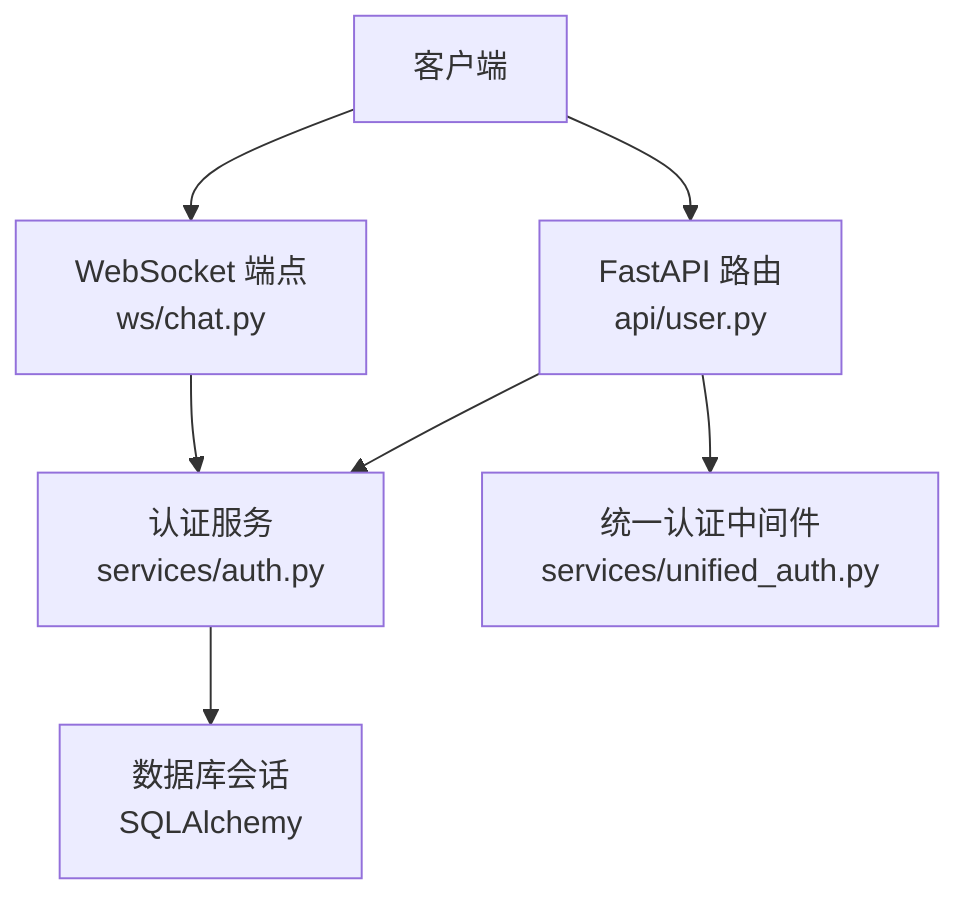
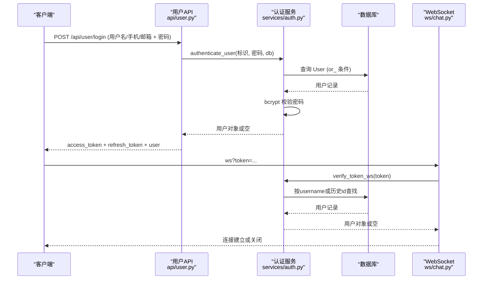
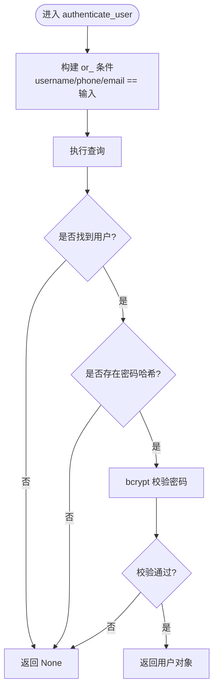
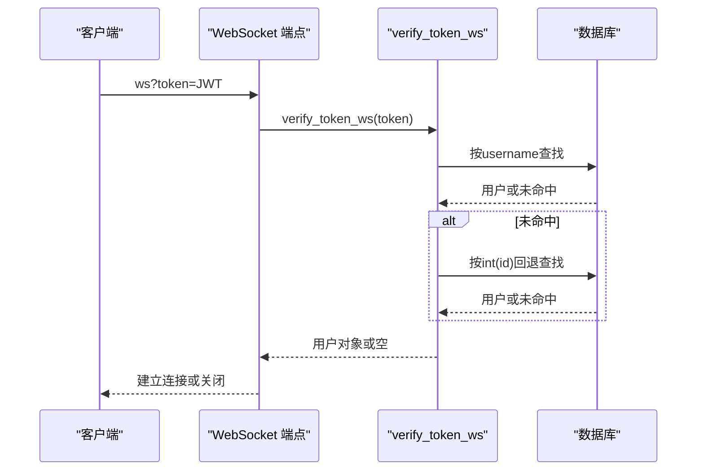
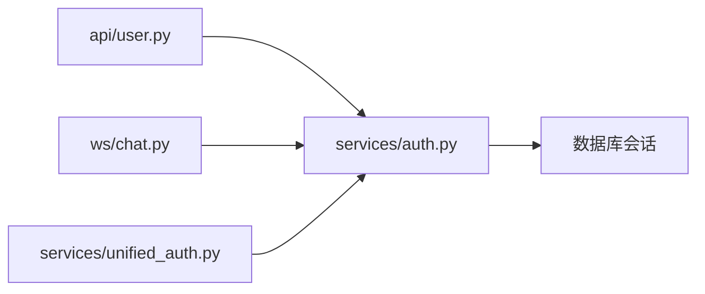

# 多方式登录

<cite>
**本文引用的文件**
- [services/auth.py](file://web/backend/services/auth.py)
- [api/user.py](file://web/backend/api/user.py)
- [services/unified_auth.py](file://web/backend/services/unified_auth.py)
- [ws/chat.py](file://web/backend/ws/chat.py)
</cite>

## 目录
1. [简介](#简介)
2. [项目结构](#项目结构)
3. [核心组件](#核心组件)
4. [架构总览](#架构总览)
5. [详细组件分析](#详细组件分析)
6. [依赖关系分析](#依赖关系分析)
7. [性能与并发安全](#性能与并发安全)
8. [故障排查指南](#故障排查指南)
9. [结论](#结论)
10. [附录：API调用示例](#附录api调用示例)

## 简介
本技术文档围绕“多方式登录系统”展开，重点说明以下能力：
- 统一登录接口 authenticate_user：支持用户名、手机号、邮箱三种标识的统一认证。
- SQLAlchemy 查询中的 or_ 条件构建与用户查找逻辑。
- 密码验证流程：基于 bcrypt 的哈希生成与比对。
- get_current_user 与 get_required_user 的区别与使用场景。
- 可选用户获取 get_current_user_optional 的实现机制。
- WebSocket 认证 verify_token_ws 的特殊处理：兼容历史遗留的数值 ID 格式。
- 完整登录 API 调用示例、错误处理、并发安全考虑与性能优化策略。

## 项目结构
多方式登录相关代码主要分布在后端服务的认证服务、API路由以及WebSocket模块中：
- 认证服务：提供JWT令牌签发/校验、密码哈希/校验、当前用户解析等通用能力。
- 用户API：暴露登录、注册、绑定、重置密码等HTTP接口，并复用认证服务。
- 统一认证中间件：封装Bearer鉴权，便于在路由层以Depends形式注入当前用户。
- WebSocket：通过URL参数携带token进行连接认证，兼容历史ID格式。

图表来源
- [api/user.py:217-228](file://web/backend/api/user.py#L217-L228)
- [services/auth.py:153-176](file://web/backend/services/auth.py#L153-L176)
- [services/unified_auth.py:18-33](file://web/backend/services/unified_auth.py#L18-L33)
- [ws/chat.py:45-51](file://web/backend/ws/chat.py#L45-L51)

章节来源
- [api/user.py:217-228](file://web/backend/api/user.py#L217-L228)
- [services/auth.py:153-176](file://web/backend/services/auth.py#L153-L176)
- [services/unified_auth.py:18-33](file://web/backend/services/unified_auth.py#L18-L33)
- [ws/chat.py:45-51](file://web/backend/ws/chat.py#L45-L51)

## 核心组件
- 统一登录入口：authenticate_user(username, password, db)
  - 通过 or_ 条件同时匹配 username、phone、email，实现“一个字段多种登录方式”。
  - 找到用户后，读取其密码哈希并使用 bcrypt 进行校验。
- 密码工具：get_password_hash / verify_password
  - 使用 passlib 的 CryptContext 配置 bcrypt 算法，负责安全地哈希与校验。
- 当前用户解析：
  - get_current_user：从请求头提取Bearer token，解析为User对象；若被封禁则返回403。
  - get_required_user：与前者类似，但用于必须登录的路由（抛出401）。
  - get_current_user_optional：可选登录，失败时返回None而非抛错，适合匿名可用接口。
- WebSocket 认证：verify_token_ws(token)
  - 解析JWT，优先按username查找；如未命中，尝试将subject作为数值id回退查找，兼容历史遗留。
  - 仅当用户激活且未被封禁时返回有效用户。

章节来源
- [services/auth.py:35-40](file://web/backend/services/auth.py#L35-L40)
- [services/auth.py:153-176](file://web/backend/services/auth.py#L153-L176)
- [services/auth.py:204-251](file://web/backend/services/auth.py#L204-L251)
- [services/auth.py:257-282](file://web/backend/services/auth.py#L257-L282)

## 架构总览
下图展示了从HTTP登录到令牌签发、再到后续受保护接口的整体流程，以及WebSocket连接的认证路径。

图表来源
- [api/user.py:217-228](file://web/backend/api/user.py#L217-L228)
- [services/auth.py:153-176](file://web/backend/services/auth.py#L153-L176)
- [services/auth.py:257-282](file://web/backend/services/auth.py#L257-L282)
- [ws/chat.py:45-51](file://web/backend/ws/chat.py#L45-L51)

## 详细组件分析

### 统一登录：authenticate_user 与 or_ 条件
- 功能要点
  - 接收一个“标识”字段，可同时是用户名、手机号或邮箱。
  - 使用 SQLAlchemy 的 or_ 构造复合条件，一次查询覆盖三种可能。
  - 若未找到用户或无密码哈希，直接返回空。
  - 使用 bcrypt 校验密码，成功则返回用户对象。
- 复杂度
  - 单次数据库查询，时间复杂度O(1)（假设索引良好），空间复杂度O(1)。
- 优化建议
  - 确保 username、phone、email 列具备唯一索引，提升查询效率。
  - 对频繁失败的账号可引入短时缓存防暴力破解（需配合速率限制）。

图表来源
- [services/auth.py:153-176](file://web/backend/services/auth.py#L153-L176)

章节来源
- [services/auth.py:153-176](file://web/backend/services/auth.py#L153-L176)

### 密码验证：bcrypt 的使用与哈希比对
- 哈希生成：get_password_hash
  - 使用 passlib 的 CryptContext(schemes=["bcrypt"]) 生成强哈希。
- 密码校验：verify_password
  - 将明文与存储的哈希进行比对，防止时序攻击和明文存储风险。
- 应用位置
  - 注册、设置密码、重置密码等写路径均使用此函数生成/更新哈希。
  - 登录时通过 verify_password 完成校验。

章节来源
- [services/auth.py:35-40](file://web/backend/services/auth.py#L35-L40)
- [api/user.py:381-416](file://web/backend/api/user.py#L381-L416)
- [api/user.py:764-800](file://web/backend/api/user.py#L764-L800)

### 当前用户解析：get_current_user vs get_required_user
- get_current_user
  - 从请求头解析Bearer token，解码后根据sub（用户名）查库。
  - 若用户被封禁，返回403；否则返回用户对象。
  - 适用于需要明确区分“未认证”和“已封禁”的场景。
- get_required_user
  - 与前者行为一致，但更强调“必须登录”的语义，常用于受保护路由。
- 区别与建议
  - 两者都拒绝无效/过期/被封禁的token；差异主要在语义与异常信息。
  - 建议在需要严格鉴权的接口使用 get_required_user，以便前端统一处理401。

章节来源
- [services/auth.py:179-251](file://web/backend/services/auth.py#L179-L251)

### 可选用户获取：get_current_user_optional
- 行为
  - 若无token，直接返回None。
  - 若有token但解析失败或被封禁/停用，捕获异常并返回None。
- 适用场景
  - 允许匿名访问但可识别已登录用户的接口，例如内容浏览、统计上报等。

章节来源
- [services/auth.py:223-234](file://web/backend/services/auth.py#L223-L234)

### WebSocket 认证：verify_token_ws 的特殊处理
- 特殊兼容
  - 优先按username查找；若未命中，尝试将subject转换为int并按id查找，兼容历史遗留的数值ID格式。
  - 仅当用户激活且未被封禁时返回有效用户。
- 使用方式
  - WebSocket 连接通过URL参数传递token，服务端调用 verify_token_ws 完成认证。
  - 认证失败则关闭连接，成功则加入连接管理器。

图表来源
- [services/auth.py:257-282](file://web/backend/services/auth.py#L257-L282)
- [ws/chat.py:45-51](file://web/backend/ws/chat.py#L45-L51)

章节来源
- [services/auth.py:257-282](file://web/backend/services/auth.py#L257-L282)
- [ws/chat.py:45-51](file://web/backend/ws/chat.py#L45-L51)

### 统一认证中间件：unified_auth.get_current_user
- 作用
  - 封装HTTP Bearer认证，内部委托给 services/auth.get_current_user_jwt。
  - 提供 get_current_active_user、get_current_admin_user、get_optional_user 等便捷依赖。
- 使用建议
  - 在新接口中优先使用该中间件，以获得一致的鉴权体验。

章节来源
- [services/unified_auth.py:18-68](file://web/backend/services/unified_auth.py#L18-L68)

## 依赖关系分析
- 模块耦合
  - api/user.py 依赖 services/auth.py 的认证能力，并通过数据库会话访问数据。
  - ws/chat.py 依赖 services/auth.py 的 verify_token_ws 进行WebSocket鉴权。
  - services/unified_auth.py 是对 services/auth.py 的轻量封装，便于路由层注入。
- 外部依赖
  - JWT：pyjwt（jose）用于令牌编解码。
  - 密码学：passlib 的 bcrypt 用于密码哈希与校验。
  - ORM：SQLAlchemy 用于数据库查询。

图表来源
- [api/user.py:217-228](file://web/backend/api/user.py#L217-L228)
- [services/auth.py:153-176](file://web/backend/services/auth.py#L153-L176)
- [services/unified_auth.py:18-33](file://web/backend/services/unified_auth.py#L18-L33)
- [ws/chat.py:45-51](file://web/backend/ws/chat.py#L45-L51)

章节来源
- [api/user.py:217-228](file://web/backend/api/user.py#L217-L228)
- [services/auth.py:153-176](file://web/backend/services/auth.py#L153-L176)
- [services/unified_auth.py:18-33](file://web/backend/services/unified_auth.py#L18-L33)
- [ws/chat.py:45-51](file://web/backend/ws/chat.py#L45-L51)

## 性能与并发安全
- 查询性能
  - 统一登录使用 or_ 条件，建议为 username、phone、email 建立唯一索引，避免全表扫描。
  - 登录成功后立即签发短时效access token与长时效refresh token，减少重复认证开销。
- 并发安全
  - 验证码发送存在IP维度限速（内存字典+锁），防止高频刷短信/邮件。
  - 密码重置会撤销该用户所有refresh token，强制其他设备重新认证，避免并发状态不一致。
- 资源清理
  - 提供清理过期/已撤销refresh token的定时任务，防止数据库膨胀。
- 建议
  - 在高并发场景下，结合Redis实现分布式限流与验证码存储。
  - 对敏感操作（改密、换绑）增加二次确认与审计日志。

章节来源
- [api/user.py:419-452](file://web/backend/api/user.py#L419-L452)
- [api/user.py:776-800](file://web/backend/api/user.py#L776-L800)
- [services/auth.py:285-309](file://web/backend/services/auth.py#L285-L309)

## 故障排查指南
- 登录失败
  - 检查用户名/手机号/邮箱是否正确，确认对应字段有值。
  - 确认密码哈希是否存在，若为空则无法登录。
  - 查看返回码：401表示凭据错误，403表示账号被封禁。
- WebSocket 连接失败
  - 检查token是否有效且类型为access。
  - 确认用户处于激活状态且未被封禁。
  - 若使用历史ID格式的token，确认subject可转为整数且对应用户存在。
- 验证码相关问题
  - 检查IP限速是否触发（429）。
  - 检查短信/邮件服务是否返回成功。
- 刷新令牌问题
  - 检查refresh token是否过期或被撤销。
  - 使用 revoke_all_user_tokens 强制下线可疑设备。

章节来源
- [services/auth.py:179-251](file://web/backend/services/auth.py#L179-L251)
- [services/auth.py:257-282](file://web/backend/services/auth.py#L257-L282)
- [api/user.py:419-452](file://web/backend/api/user.py#L419-L452)
- [api/user.py:776-800](file://web/backend/api/user.py#L776-L800)

## 结论
本系统通过统一的 authenticate_user 接口实现了用户名、手机号、邮箱的多方式登录，结合 bcrypt 的安全密码校验与JWT令牌体系，提供了稳定可靠的认证能力。get_current_user、get_required_user 与 get_current_user_optional 覆盖了不同鉴权强度的场景。WebSocket 认证兼容历史ID格式，保障平滑迁移。配合IP限速、令牌撤销与定期清理等机制，系统在安全性与性能之间取得平衡。

## 附录：API调用示例
以下为常见登录场景的调用示例与注意事项（不展示具体代码，仅描述步骤）：

- 用户名/手机号/邮箱 + 密码登录
  - 方法：POST
  - 路径：/api/user/login
  - 请求体：OAuth2PasswordRequestForm（username、password）
  - 成功响应：包含 access_token、refresh_token、token_type、user
  - 失败处理：
    - 401：用户名或密码错误
    - 403：账号被封禁（后续受保护接口）
  - 参考路径
    - [api/user.py:217-228](file://web/backend/api/user.py#L217-L228)
    - [services/auth.py:153-176](file://web/backend/services/auth.py#L153-L176)

- 手机号验证码登录
  - 方法：POST
  - 路径：/api/user/login-by-phone
  - 请求体：phone、code
  - 成功响应：access_token、refresh_token、user
  - 失败处理：
    - 401：验证码错误或已过期
    - 404：手机号未注册
  - 参考路径
    - [api/user.py:526-545](file://web/backend/api/user.py#L526-L545)

- 邮箱验证码登录
  - 方法：POST
  - 路径：/api/user/login-by-email
  - 请求体：email、code
  - 成功响应：access_token、refresh_token、user
  - 失败处理：
    - 401：验证码错误或已过期
    - 404：邮箱未注册
  - 参考路径
    - [api/user.py:582-601](file://web/backend/api/user.py#L582-L601)

- 手机号密码登录
  - 方法：POST
  - 路径：/api/user/login-by-phone-password
  - 请求体：phone、password
  - 成功响应：access_token、refresh_token、user
  - 失败处理：
    - 401：手机号或密码错误
    - 403：账号已被禁用
  - 参考路径
    - [api/user.py:548-579](file://web/backend/api/user.py#L548-L579)

- 邮箱密码登录
  - 方法：POST
  - 路径：/api/user/login-by-email-password
  - 请求体：email、password
  - 成功响应：access_token、refresh_token、user
  - 失败处理：
    - 401：邮箱或密码错误
    - 403：账号已被禁用
  - 参考路径
    - [api/user.py:664-695](file://web/backend/api/user.py#L664-L695)

- 刷新令牌
  - 方法：POST
  - 路径：/api/user/refresh-token（示意）
  - 请求体：refresh_token
  - 成功响应：新的 access_token
  - 失败处理：
    - 401：refresh_token无效或已撤销
  - 参考路径
    - [services/auth.py:96-126](file://web/backend/services/auth.py#L96-L126)

- WebSocket 连接认证
  - 方法：WS
  - 路径：/ws/chat?token=JWT
  - 成功：建立连接，开始收发事件
  - 失败：关闭连接（4001 Unauthorized）
  - 参考路径
    - [ws/chat.py:45-51](file://web/backend/ws/chat.py#L45-L51)
    - [services/auth.py:257-282](file://web/backend/services/auth.py#L257-L282)