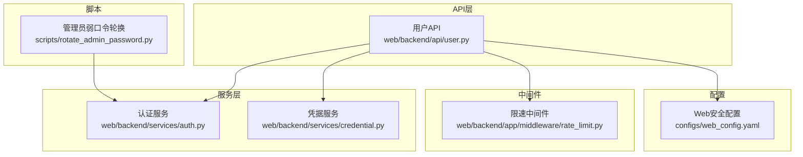
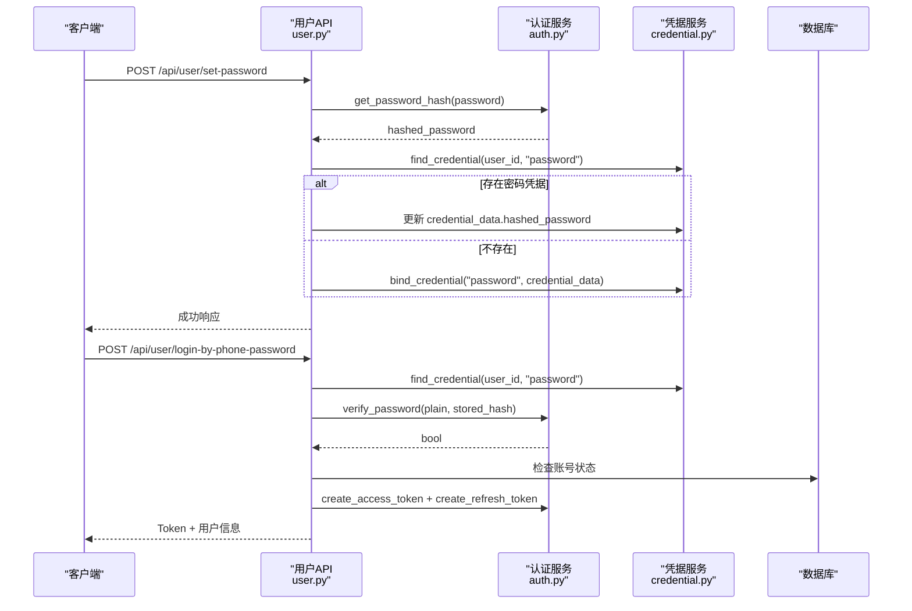
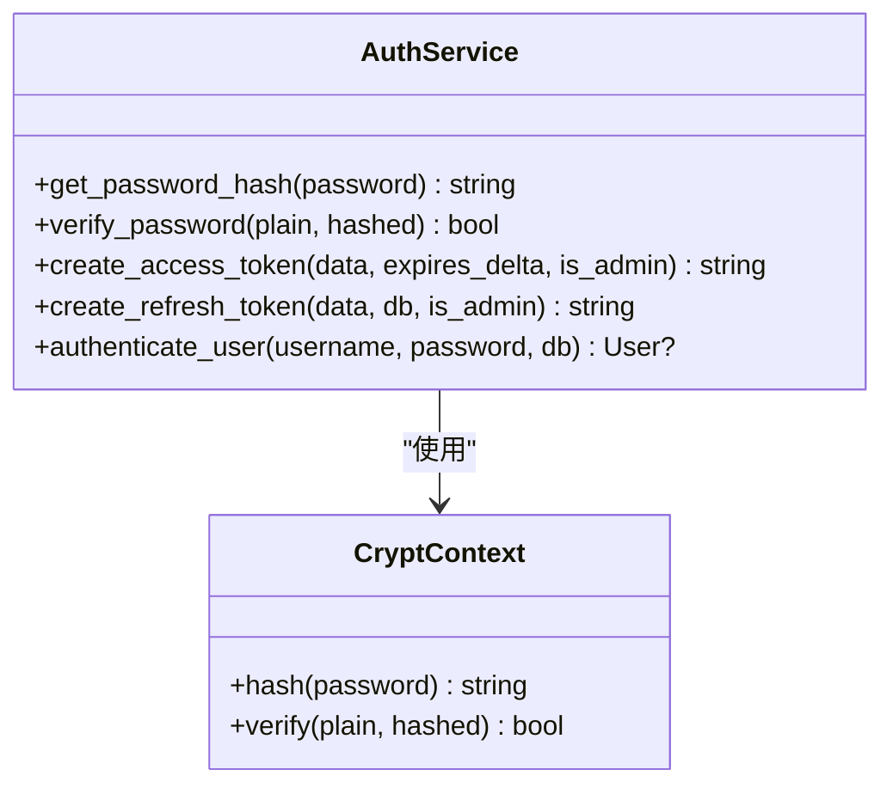
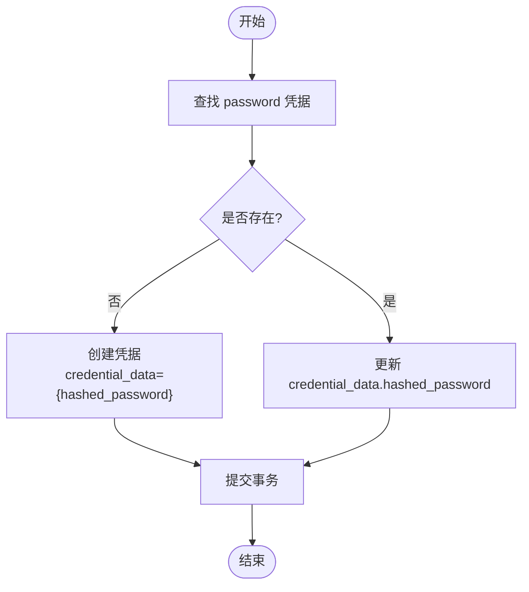
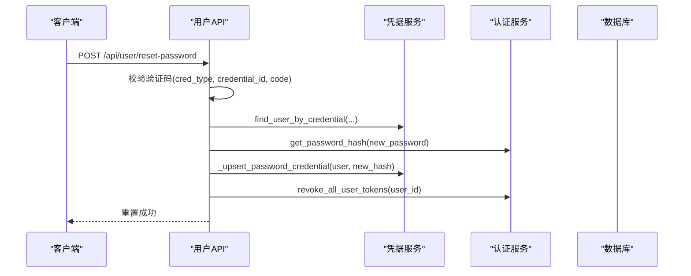
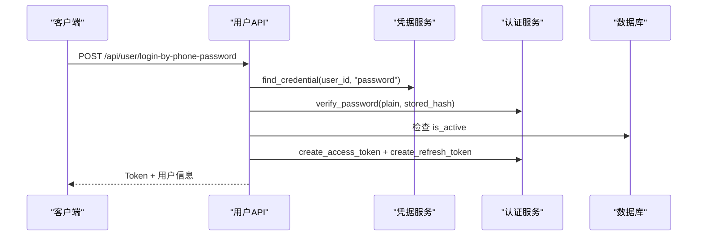
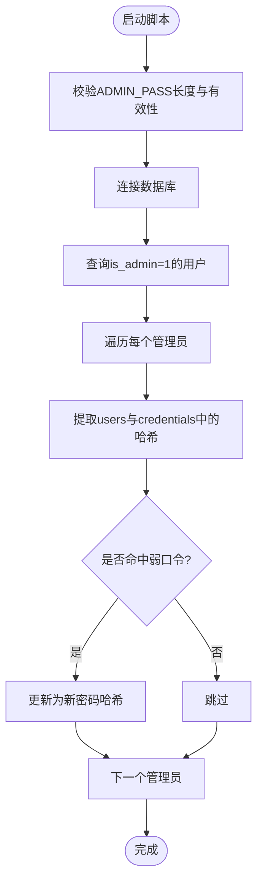
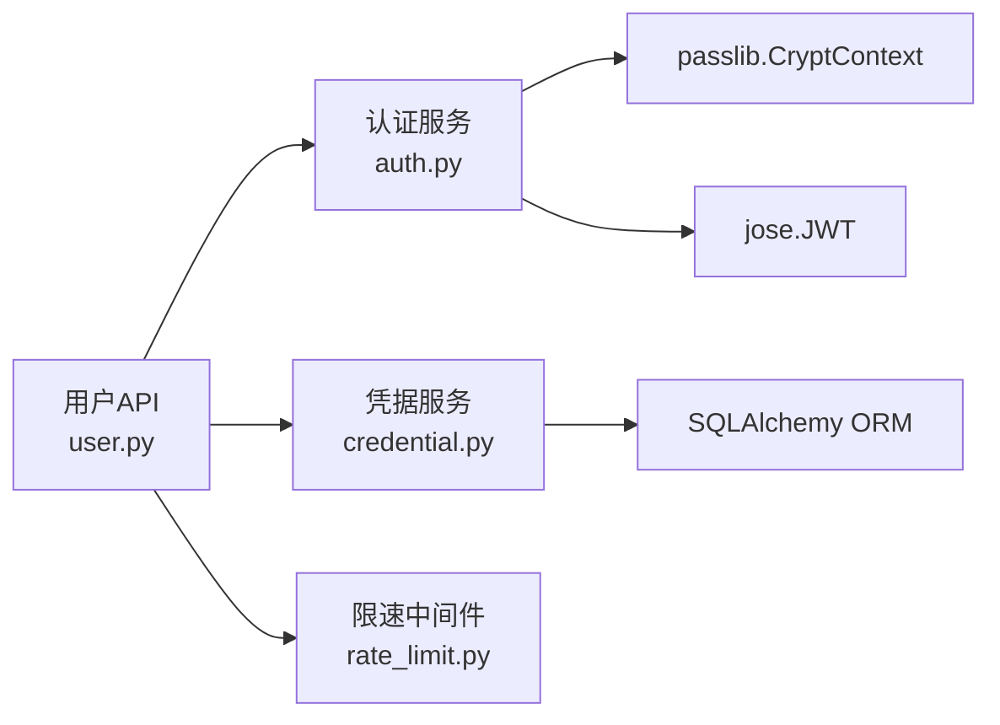

# 密码安全管理

<cite>
**本文引用的文件**   
- [auth.py](file://web/backend/services/auth.py)
- [credential.py](file://web/backend/services/credential.py)
- [user.py](file://web/backend/api/user.py)
- [user.py（模型）](file://web/backend/models/user.py)
- [rotate_admin_password.py](file://scripts/rotate_admin_password.py)
- [rate_limit.py](file://web/backend/app/middleware/rate_limit.py)
- [web_config.yaml](file://configs/web_config.yaml)
- [test_auth.py](file://tests/backend/services/test_auth.py)
- [test_user.py](file://tests/backend/api/test_user.py)
</cite>

## 目录
1. [简介](#简介)
2. [项目结构](#项目结构)
3. [核心组件](#核心组件)
4. [架构总览](#架构总览)
5. [详细组件分析](#详细组件分析)
6. [依赖关系分析](#依赖关系分析)
7. [性能与安全考量](#性能与安全考量)
8. [故障排查指南](#故障排查指南)
9. [结论](#结论)
10. [附录：配置与加固建议](#附录配置与加固建议)

## 简介
本技术文档聚焦于项目的密码安全管理体系，围绕 bcrypt 算法的 CryptContext 配置、密码哈希生成与验证流程、密码存储最佳实践、密码强度校验、密码重置流程以及账户锁定机制进行系统化说明。同时给出防止暴力破解与时序攻击等安全加固建议，并提供可操作的配置示例与排障指引。

## 项目结构
密码安全相关代码主要分布在以下模块：
- 认证服务层：负责 JWT、令牌生命周期、bcrypt 上下文封装与密码加解密接口
- 凭据服务层：管理多凭据绑定、查询与校验（含 password 类型凭据）
- API 层：用户注册、登录、设置/重置密码、刷新令牌、退出登录等端点
- 数据模型：输入校验（如密码长度、邮箱格式、验证码长度等）
- 运维脚本：管理员弱口令轮换工具
- 中间件：通用限速器（防暴力破解）
- 配置：安全头、CSP、CORS 等

图表来源
- [user.py](file://web/backend/api/user.py)
- [auth.py](file://web/backend/services/auth.py)
- [credential.py](file://web/backend/services/credential.py)
- [rate_limit.py](file://web/backend/app/middleware/rate_limit.py)
- [web_config.yaml](file://configs/web_config.yaml)
- [rotate_admin_password.py](file://scripts/rotate_admin_password.py)

章节来源
- [user.py](file://web/backend/api/user.py)
- [auth.py](file://web/backend/services/auth.py)
- [credential.py](file://web/backend/services/credential.py)
- [rate_limit.py](file://web/backend/app/middleware/rate_limit.py)
- [web_config.yaml](file://configs/web_config.yaml)
- [rotate_admin_password.py](file://scripts/rotate_admin_password.py)

## 核心组件
- bcrypt 密码上下文与接口
  - CryptContext 使用 schemes=["bcrypt"], deprecated="auto" 初始化，提供 verify 与 hash 方法
  - 暴露 get_password_hash 与 verify_password 两个函数供 API 调用
- 凭据系统
  - UserCredential 表承载 phone/email/wechat/alipay/password 等多类凭据
  - password 类型凭据以 JSON 字段 credential_data 存储 {"hashed_password": "..."}
  - 提供 bind/unbind/verify/find 等能力
- 用户API
  - 支持手机号/邮箱验证码登录、用户名/邮箱+密码登录、设置密码、重置密码、刷新令牌、退出登录
  - 登录成功后签发 access_token 与 refresh_token，并返回用户信息
- 限速与风控
  - 进程内令牌桶限速器，按 IP 或 user_id 维度限制请求频率
  - 验证码发送具备目标号/邮箱维度的冷却与每日上限（由短信/邮件服务实现）

章节来源
- [auth.py](file://web/backend/services/auth.py)
- [credential.py](file://web/backend/services/credential.py)
- [user.py](file://web/backend/api/user.py)
- [rate_limit.py](file://web/backend/app/middleware/rate_limit.py)

## 架构总览
下图展示了从客户端到后端的核心调用链，包括密码哈希生成、凭据绑定、登录验证与令牌签发。

图表来源
- [user.py](file://web/backend/api/user.py)
- [auth.py](file://web/backend/services/auth.py)
- [credential.py](file://web/backend/services/credential.py)

## 详细组件分析

### bcrypt 密码上下文与接口
- CryptContext 初始化
  - 使用 schemes=["bcrypt"], deprecated="auto"，确保向后兼容与自动迁移
- 密码哈希生成
  - get_password_hash：调用 pwd_context.hash，每次生成不同哈希（内置随机盐）
- 密码验证
  - verify_password：调用 pwd_context.verify，内部对时序敏感操作由 passlib/bcrypt 库保证常量时间比较

图表来源
- [auth.py](file://web/backend/services/auth.py)

章节来源
- [auth.py](file://web/backend/services/auth.py)
- [test_auth.py](file://tests/backend/services/test_auth.py)

### 凭据系统与密码存储
- 存储位置
  - 新版：UserCredential.credential_data 中 JSON 保存 {"hashed_password": "..."}
  - 兼容旧版：users.hashed_password 字段仍被同步用于历史兼容
- 绑定与更新
  - bind_credential：同一用户同一 cred_type 仅允许一个；跨用户冲突会抛出异常
  - _upsert_password_credential：若已存在则覆盖 credential_data，否则新建
- 查询与校验
  - find_credential：按 user_id + cred_type 查找
  - user_has_password：判断是否存在有效的 password 凭据

图表来源
- [credential.py](file://web/backend/services/credential.py)
- [user.py](file://web/backend/api/user.py)

章节来源
- [credential.py](file://web/backend/services/credential.py)
- [user.py](file://web/backend/api/user.py)

### 用户API：设置密码与重置密码
- 设置密码
  - 入口：POST /api/user/set-password
  - 流程：获取当前用户 -> 计算哈希 -> upsert password 凭据 -> 同步 legacy 字段 -> 提交
- 重置密码
  - 入口：POST /api/user/reset-password
  - 流程：校验验证码（短信/邮箱）-> 定位用户 -> upsert password 凭据 -> 撤销该用户所有 refresh token -> 提交

图表来源
- [user.py](file://web/backend/api/user.py)
- [auth.py](file://web/backend/services/auth.py)
- [credential.py](file://web/backend/services/credential.py)

章节来源
- [user.py](file://web/backend/api/user.py)
- [test_user.py](file://tests/backend/api/test_user.py)

### 登录流程与密码验证
- 手机号+密码登录
  - 优先从 password 凭据读取 hashed_password，再调用 verify_password
  - 校验账号激活状态，记录 last_used_at，签发令牌
- 邮箱+密码登录
  - 通过 email 凭据定位用户，校验密码后签发令牌
- 验证码登录
  - 短信/邮箱验证码通过后签发令牌（不依赖密码）

图表来源
- [user.py](file://web/backend/api/user.py)
- [auth.py](file://web/backend/services/auth.py)
- [credential.py](file://web/backend/services/credential.py)

章节来源
- [user.py](file://web/backend/api/user.py)
- [test_user.py](file://tests/backend/api/test_user.py)

### 管理员弱口令轮换脚本
- 目的：检测存量管理员账号是否命中弱口令（users.hashed_password 与 user_credentials.credential_data），并统一替换为强密码
- 行为：幂等执行，支持 dry-run 模式；要求 .env 中的 ADMIN_PASS 满足最小长度
- 实现要点：CryptContext(schemes=["bcrypt"]) 用于验证与生成新哈希；兼容两种 credential_data 格式

图表来源
- [rotate_admin_password.py](file://scripts/rotate_admin_password.py)

章节来源
- [rotate_admin_password.py](file://scripts/rotate_admin_password.py)

## 依赖关系分析
- API 层依赖认证服务与凭据服务，间接依赖数据库
- 认证服务依赖 passlib 的 CryptContext 与 jose 的 JWT
- 凭据服务依赖 SQLAlchemy ORM 与自定义异常
- 中间件提供进程内限速，保护认证与验证码接口免受暴力破解

图表来源
- [user.py](file://web/backend/api/user.py)
- [auth.py](file://web/backend/services/auth.py)
- [credential.py](file://web/backend/services/credential.py)
- [rate_limit.py](file://web/backend/app/middleware/rate_limit.py)

章节来源
- [user.py](file://web/backend/api/user.py)
- [auth.py](file://web/backend/services/auth.py)
- [credential.py](file://web/backend/services/credential.py)
- [rate_limit.py](file://web/backend/app/middleware/rate_limit.py)

## 性能与安全考量
- 性能
  - bcrypt 哈希计算开销较大，建议在异步任务或限流策略下处理批量场景
  - 刷新令牌清理定期执行，避免数据库膨胀
- 安全
  - 常量时间比较：passlib/bcrypt 默认实现抵御时序攻击
  - 随机盐：每次哈希均包含随机盐，相同明文产生不同密文
  - 令牌安全：access_token 短效，refresh_token 可撤销；重置密码时撤销全部刷新令牌
  - 速率限制：按 IP/用户维度限制请求，降低暴力破解风险
  - 安全头与CSP：启用 HSTS、XSS 防护、Content-Type 嗅探防护等

章节来源
- [auth.py](file://web/backend/services/auth.py)
- [rate_limit.py](file://web/backend/app/middleware/rate_limit.py)
- [web_config.yaml](file://configs/web_config.yaml)

## 故障排查指南
- 常见问题
  - 登录失败但凭据存在：确认 password 凭据的 credential_data 是否为有效 JSON 且包含 hashed_password
  - 重置密码无效：检查验证码是否过期、cred_type 与 credential_id 是否匹配
  - 令牌刷新失败：确认 refresh_token 未过期且未被撤销
- 日志与审计
  - 关键操作（隐私模式变更、导出等）有审计日志，便于追踪
- 调试建议
  - 使用 rotate_admin_password.py 的 dry-run 模式先评估影响范围
  - 在测试用例中 mock verify_password 以隔离外部依赖

章节来源
- [user.py](file://web/backend/api/user.py)
- [rotate_admin_password.py](file://scripts/rotate_admin_password.py)
- [test_user.py](file://tests/backend/api/test_user.py)

## 结论
本项目采用 bcrypt 作为密码哈希算法，结合 passlib 的 CryptContext 提供安全的哈希与验证接口。凭据系统统一管理多类型凭据，密码以 JSON 形式存储在 credential_data 中，兼顾兼容性与安全性。API 层提供完善的设置/重置密码、登录与令牌管理流程，配合进程内限速器与安全头配置，形成较为完整的密码安全体系。建议在生产环境持续强化速率限制、监控与审计，并定期执行弱口令轮换。

## 附录：配置与加固建议
- 密码强度验证
  - 前端：提示至少6位字符，建议增加复杂度规则（大小写、数字、特殊字符）
  - 后端：在 SetPasswordRequest/ResetPasswordRequest 中增加复杂度校验（正则或第三方库）
- 密码存储最佳实践
  - 始终使用 bcrypt 哈希，禁止明文存储
  - 使用随机盐（由库自动处理），确保相同明文不同哈希
  - 将哈希存于凭据表的 credential_data，保持与旧字段兼容
- 密码重置流程
  - 基于短信/邮箱验证码的身份核验
  - 重置后撤销该用户所有刷新令牌，强制重新登录
- 账户锁定机制设计思路
  - 连续失败 N 次触发临时锁定（例如 15 分钟）
  - 结合 IP 与用户维度限速，区分正常用户与恶意扫描
  - 记录风控事件与审计日志，支持人工复核
- 防止暴力破解与时序攻击
  - 启用进程内/分布式限速器（IP/用户维度）
  - 使用 passlib/bcrypt 提供的常量时间比较
  - 限制验证码发送频率（目标号/邮箱维度冷却与每日上限）
- 安全加固建议
  - 启用 HTTPS（全站 TLS）
  - 配置安全头：HSTS、X-Content-Type-Options、X-XSS-Protection、Frame-Options
  - 合理设置 CORS 与 CSP，减少注入与跨站风险
  - 定期清理过期/撤销的刷新令牌，控制数据库规模

章节来源
- [user.py（模型）](file://web/backend/models/user.py)
- [user.py](file://web/backend/api/user.py)
- [rate_limit.py](file://web/backend/app/middleware/rate_limit.py)
- [web_config.yaml](file://configs/web_config.yaml)