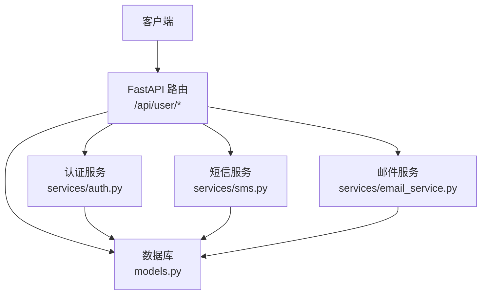
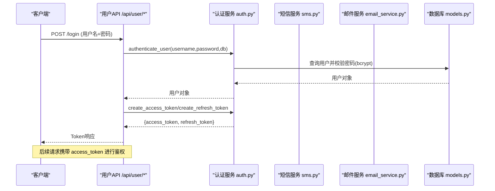
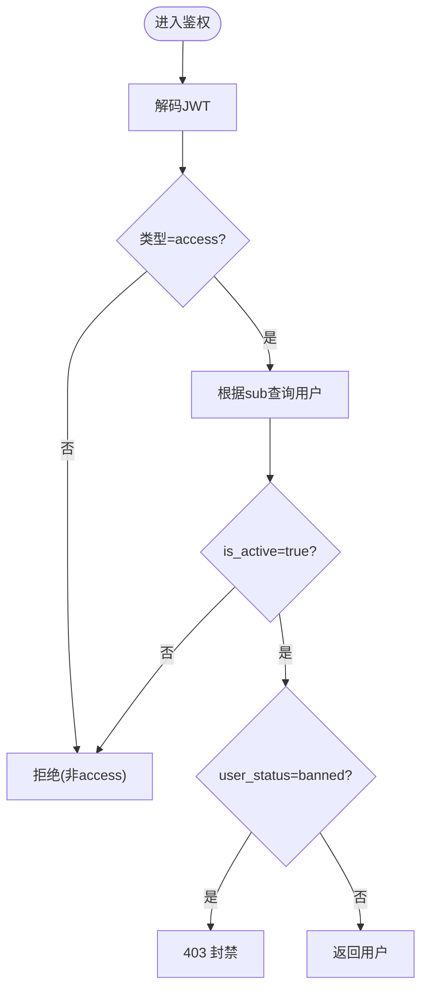
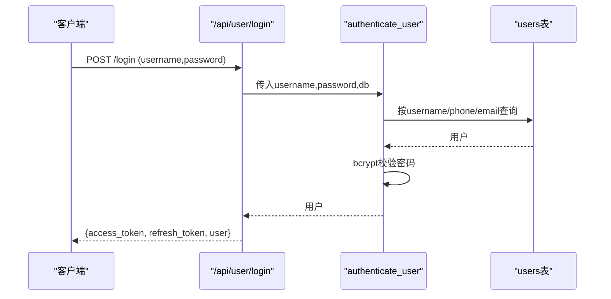
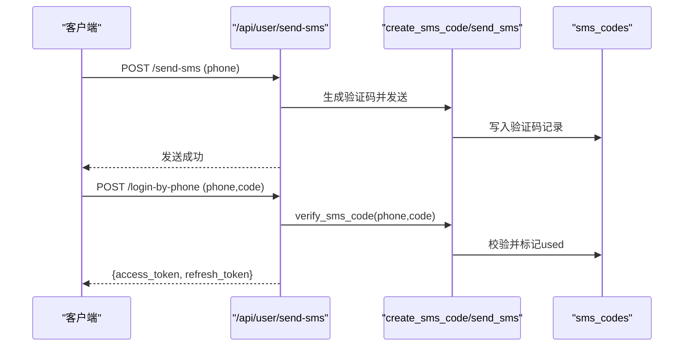
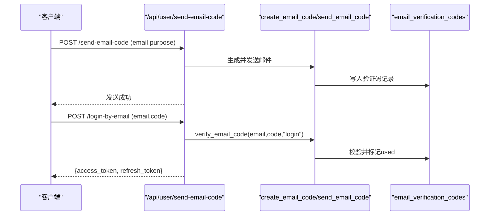
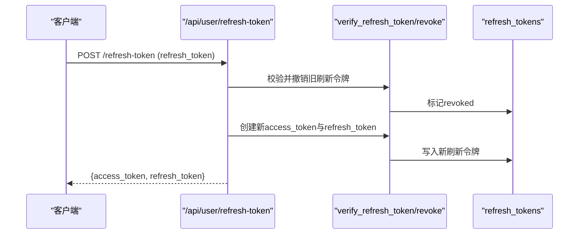
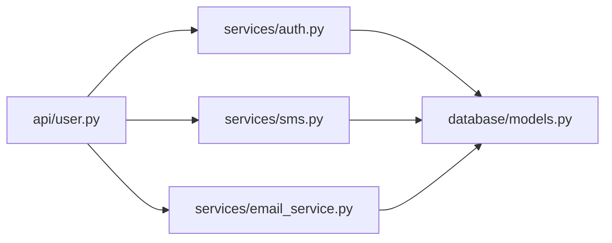
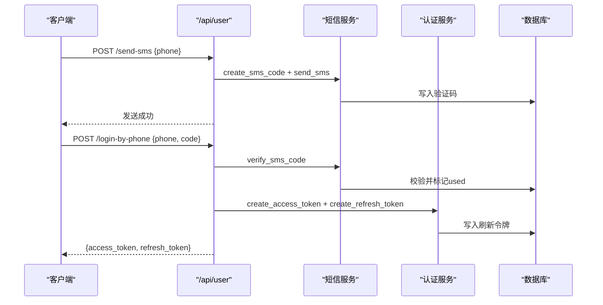

# 认证流程实现

<cite>
**本文引用的文件**
- [web/backend/services/auth.py](file://web/backend/services/auth.py)
- [web/backend/api/user.py](file://web/backend/api/user.py)
- [web/backend/services/sms.py](file://web/backend/services/sms.py)
- [web/backend/services/email_service.py](file://web/backend/services/email_service.py)
- [web/backend/database/models.py](file://web/backend/database/models.py)
- [web/backend/models/user.py](file://web/backend/models/user.py)
- [configs/web_config.yaml](file://configs/web_config.yaml)
</cite>

## 目录
1. [简介](#简介)
2. [项目结构](#项目结构)
3. [核心组件](#核心组件)
4. [架构总览](#架构总览)
5. [详细组件分析](#详细组件分析)
6. [依赖关系分析](#依赖关系分析)
7. [性能与安全考量](#性能与安全考量)
8. [故障排查指南](#故障排查指南)
9. [结论](#结论)
10. [附录：API调用示例与调试技巧](#附录api调用示例与调试技巧)

## 简介
本技术文档围绕后端认证体系，系统性说明JWT访问令牌与刷新令牌的生成、验证、刷新与撤销机制；覆盖多方式登录（用户名/手机号/邮箱 + 密码，以及手机验证码、邮箱验证码）的实现细节；解释密码加密算法（bcrypt）、令牌过期时间配置、会话管理与安全策略；并提供完整的API调用示例、错误处理机制、并发安全考虑与性能优化建议，以及集成代码示例和调试技巧。

## 项目结构
认证相关代码主要分布在以下模块：
- API路由层：用户注册、登录、验证码发送、绑定/解绑凭证、刷新令牌、登出等接口
- 服务层：JWT令牌管理、短信验证码、邮箱验证码、凭据绑定与查询
- 数据模型层：用户、凭据、短信/邮箱验证码、刷新令牌等ORM模型
- 配置层：JWT、会话、速率限制、CORS、安全头等配置项

图表来源
- [web/backend/api/user.py:217-826](file://web/backend/api/user.py#L217-L826)
- [web/backend/services/auth.py:43-150](file://web/backend/services/auth.py#L43-L150)
- [web/backend/services/sms.py:69-147](file://web/backend/services/sms.py#L69-L147)
- [web/backend/services/email_service.py:77-147](file://web/backend/services/email_service.py#L77-L147)
- [web/backend/database/models.py:30-86](file://web/backend/database/models.py#L30-L86)

章节来源
- [web/backend/api/user.py:1-800](file://web/backend/api/user.py#L1-L800)
- [web/backend/services/auth.py:1-309](file://web/backend/services/auth.py#L1-L309)
- [web/backend/services/sms.py:1-405](file://web/backend/services/sms.py#L1-L405)
- [web/backend/services/email_service.py:1-225](file://web/backend/services/email_service.py#L1-L225)
- [web/backend/database/models.py:1-200](file://web/backend/database/models.py#L1-L200)
- [configs/web_config.yaml:25-60](file://configs/web_config.yaml#L25-L60)

## 核心组件
- JWT令牌服务：负责访问令牌与刷新令牌的创建、校验、撤销与清理，支持管理员长时令牌与文件专用短效令牌
- 多方式登录：用户名/手机号/邮箱 + 密码；手机验证码登录；邮箱验证码登录
- 验证码服务：短信与邮箱验证码的生成、存储、限流、锁定与验证
- 凭据系统：将手机号、邮箱、密码等作为可绑定的“凭证”，支持绑定、解绑与查询
- 会话与权限：通过OAuth2 Bearer模式注入当前用户，支持可选/必需两种鉴权依赖

章节来源
- [web/backend/services/auth.py:35-254](file://web/backend/services/auth.py#L35-L254)
- [web/backend/api/user.py:217-826](file://web/backend/api/user.py#L217-L826)
- [web/backend/services/sms.py:28-147](file://web/backend/services/sms.py#L28-L147)
- [web/backend/services/email_service.py:35-147](file://web/backend/services/email_service.py#L35-L147)
- [web/backend/database/models.py:75-179](file://web/backend/database/models.py#L75-L179)

## 架构总览
认证流程采用分层设计：
- API层暴露REST端点，统一接收请求并返回标准化响应
- 服务层封装业务逻辑（JWT、验证码、凭据）
- 数据层使用SQLAlchemy ORM持久化用户、凭证、验证码、刷新令牌等
- 配置层提供环境变量或配置文件控制安全参数与行为

图表来源
- [web/backend/api/user.py:217-228](file://web/backend/api/user.py#L217-L228)
- [web/backend/services/auth.py:153-176](file://web/backend/services/auth.py#L153-L176)
- [web/backend/services/auth.py:43-56](file://web/backend/services/auth.py#L43-L56)
- [web/backend/services/auth.py:96-110](file://web/backend/services/auth.py#L96-L110)

## 详细组件分析

### JWT令牌与访问控制
- 访问令牌：
  - 创建：包含subject（用户名）、类型（access）、是否管理员、过期时间
  - 校验：解码后校验类型与主体，再查库获取用户并检查活跃状态
  - 文件专用令牌：type=file且scope=files，仅用于文件读取，短时效
- 刷新令牌：
  - 创建：生成随机token，记录用户ID与过期时间，写入数据库
  - 校验：查找未撤销且未过期的记录，关联用户
  - 撤销：单条撤销与批量撤销（按用户ID）
- 当前用户解析：
  - 从Bearer token中解析用户，封禁账号抛出明确403
  - 提供必需/可选两种依赖，便于匿名场景

图表来源
- [web/backend/services/auth.py:179-220](file://web/backend/services/auth.py#L179-L220)
- [web/backend/services/auth.py:198-201](file://web/backend/services/auth.py#L198-L201)

章节来源
- [web/backend/services/auth.py:20-150](file://web/backend/services/auth.py#L20-L150)
- [web/backend/services/auth.py:179-254](file://web/backend/services/auth.py#L179-L254)

### 多方式登录实现

#### 用户名/手机号/邮箱 + 密码登录
- 支持以username、phone或email任一标识匹配用户
- 密码校验使用bcrypt上下文进行比对
- 成功后生成access_token与refresh_token并返回

图表来源
- [web/backend/api/user.py:217-228](file://web/backend/api/user.py#L217-L228)
- [web/backend/services/auth.py:153-176](file://web/backend/services/auth.py#L153-L176)

章节来源
- [web/backend/api/user.py:217-228](file://web/backend/api/user.py#L217-L228)
- [web/backend/services/auth.py:153-176](file://web/backend/services/auth.py#L153-L176)

#### 手机验证码登录
- 发送验证码：IP维度限速 + 号码维度冷却与日上限
- 登录：校验验证码有效性（未使用、未过期、未锁定），找到用户并签发令牌
- 更新凭证last_used_at用于审计追踪

图表来源
- [web/backend/api/user.py:454-466](file://web/backend/api/user.py#L454-L466)
- [web/backend/api/user.py:526-545](file://web/backend/api/user.py#L526-L545)
- [web/backend/services/sms.py:69-147](file://web/backend/services/sms.py#L69-L147)

章节来源
- [web/backend/api/user.py:454-545](file://web/backend/api/user.py#L454-L545)
- [web/backend/services/sms.py:32-147](file://web/backend/services/sms.py#L32-L147)

#### 邮箱验证码登录
- 发送验证码：邮箱维度冷却与日上限
- 登录：校验验证码（用途purpose=login），找到用户并签发令牌

图表来源
- [web/backend/api/user.py:469-481](file://web/backend/api/user.py#L469-L481)
- [web/backend/api/user.py:582-601](file://web/backend/api/user.py#L582-L601)
- [web/backend/services/email_service.py:77-147](file://web/backend/services/email_service.py#L77-L147)

章节来源
- [web/backend/api/user.py:469-601](file://web/backend/api/user.py#L469-L601)
- [web/backend/services/email_service.py:39-147](file://web/backend/services/email_service.py#L39-L147)

#### 手机号/邮箱 + 密码登录
- 通过凭据表定位用户，提取密码哈希进行bcrypt校验
- 成功后签发令牌，并更新凭证last_used_at

章节来源
- [web/backend/api/user.py:548-579](file://web/backend/api/user.py#L548-L579)
- [web/backend/api/user.py:664-695](file://web/backend/api/user.py#L664-L695)

### 令牌刷新与撤销
- 刷新：校验refresh_token，撤销旧刷新令牌，签发新的access_token与refresh_token
- 登出：撤销该用户所有刷新令牌
- 重置密码：重置后撤销该用户所有刷新令牌，强制重新认证

图表来源
- [web/backend/api/user.py:803-820](file://web/backend/api/user.py#L803-L820)
- [web/backend/services/auth.py:96-150](file://web/backend/services/auth.py#L96-L150)

章节来源
- [web/backend/api/user.py:803-826](file://web/backend/api/user.py#L803-L826)
- [web/backend/services/auth.py:96-150](file://web/backend/services/auth.py#L96-L150)

### 密码加密与配置
- 密码加密：使用passlib的CryptContext，scheme为bcrypt
- 令牌过期：
  - 访问令牌默认分钟级（可通过环境变量覆盖）
  - 刷新令牌默认天级（管理员更长）
  - 文件专用令牌分钟级且受限scope
- 配置项参考web_config.yaml中的auth.jwt与session部分

章节来源
- [web/backend/services/auth.py:20-30](file://web/backend/services/auth.py#L20-L30)
- [configs/web_config.yaml:47-60](file://configs/web_config.yaml#L47-L60)

## 依赖关系分析
- API路由依赖认证服务、短信/邮件服务、凭据服务与数据库会话
- 认证服务依赖数据库模型（User、RefreshToken）与JWT库
- 验证码服务依赖数据库模型（SMSCode、EmailVerificationCode）
- 数据模型定义用户、凭据、验证码、刷新令牌等实体及索引约束

图表来源
- [web/backend/api/user.py:43-77](file://web/backend/api/user.py#L43-L77)
- [web/backend/services/auth.py:17-18](file://web/backend/services/auth.py#L17-L18)
- [web/backend/services/sms.py:19](file://web/backend/services/sms.py#L19)
- [web/backend/services/email_service.py:14](file://web/backend/services/email_service.py#L14)
- [web/backend/database/models.py:30-86](file://web/backend/database/models.py#L30-L86)

章节来源
- [web/backend/api/user.py:43-77](file://web/backend/api/user.py#L43-L77)
- [web/backend/database/models.py:30-86](file://web/backend/database/models.py#L30-L86)

## 性能与安全考量
- 速率限制
  - 验证码发送：IP维度每小时上限、号码维度60秒冷却与每日上限
  - 失败尝试：验证码多次错误会锁定，防止暴力破解
- 并发安全
  - 验证码使用数据库事务标记used，避免重复使用
  - 刷新令牌撤销使用原子更新，确保一致性
- 安全策略
  - bcrypt密码哈希，不存储明文
  - JWT类型与scope严格校验，文件令牌仅限文件读取
  - 封禁账号在鉴权层直接返回403，前端可展示原因
  - 日志中对手机号/邮箱进行脱敏，生产环境不输出敏感信息
- 性能优化
  - 数据库索引：用户、凭据、验证码、刷新令牌关键字段建立索引
  - 清理过期刷新令牌：提供清理函数，定期删除已过期或已撤销的记录，防止膨胀
  - 异步任务：头像审核等耗时操作使用后台线程执行，减少主流程延迟

章节来源
- [web/backend/services/sms.py:32-67](file://web/backend/services/sms.py#L32-L67)
- [web/backend/services/email_service.py:39-74](file://web/backend/services/email_service.py#L39-L74)
- [web/backend/services/auth.py:285-309](file://web/backend/services/auth.py#L285-L309)
- [web/backend/database/models.py:156-179](file://web/backend/database/models.py#L156-L179)

## 故障排查指南
- 登录失败
  - 用户名/手机号/邮箱不存在或密码错误：检查用户是否存在、密码是否正确设置
  - 验证码错误或过期：确认验证码未使用、未过期、未锁定
- 刷新失败
  - 刷新令牌无效或已过期：检查refresh_token是否存在且未撤销
- 封禁账号
  - 403并提示封禁原因：检查用户user_status与ban_reason
- 验证码发送失败
  - 短信/邮件服务商配置缺失或异常：检查环境变量与SDK安装情况
- 性能问题
  - 刷新令牌表膨胀：运行清理函数删除过期/已撤销记录
  - 频繁发送验证码触发限流：检查IP与号码维度限制

章节来源
- [web/backend/api/user.py:217-228](file://web/backend/api/user.py#L217-L228)
- [web/backend/api/user.py:454-481](file://web/backend/api/user.py#L454-L481)
- [web/backend/api/user.py:803-826](file://web/backend/api/user.py#L803-L826)
- [web/backend/services/auth.py:198-220](file://web/backend/services/auth.py#L198-L220)
- [web/backend/services/sms.py:193-219](file://web/backend/services/sms.py#L193-L219)
- [web/backend/services/email_service.py:150-161](file://web/backend/services/email_service.py#L150-L161)

## 结论
本认证体系基于JWT与刷新令牌实现无状态访问控制与有状态会话续期，结合多方式登录与严格的验证码限流与锁定机制，兼顾安全性与可用性。通过凭据系统与数据库索引优化，保证高并发下的稳定表现。配合完善的错误处理与审计日志，便于问题定位与合规要求。

## 附录：API调用示例与调试技巧

### API端点概览
- 用户名/密码登录：POST /api/user/login
- 手机验证码登录：POST /api/user/login-by-phone
- 邮箱验证码登录：POST /api/user/login-by-email
- 手机号+密码登录：POST /api/user/login-by-phone-password
- 邮箱+密码登录：POST /api/user/login-by-email-password
- 发送短信验证码：POST /api/user/send-sms
- 发送邮箱验证码：POST /api/user/send-email-code
- 刷新令牌：POST /api/user/refresh-token
- 登出：POST /api/user/logout

章节来源
- [web/backend/api/user.py:217-826](file://web/backend/api/user.py#L217-L826)

### 典型调用序列（手机验证码登录）

图表来源
- [web/backend/api/user.py:454-466](file://web/backend/api/user.py#L454-L466)
- [web/backend/api/user.py:526-545](file://web/backend/api/user.py#L526-L545)
- [web/backend/services/sms.py:69-147](file://web/backend/services/sms.py#L69-L147)
- [web/backend/services/auth.py:96-110](file://web/backend/services/auth.py#L96-L110)

### 调试技巧
- 开发模式验证码回显：当短信/邮件提供商设置为log时，会在日志中打印验证码（手机号/邮箱已脱敏）
- 查看验证码状态：检查数据库中对应记录的used、expired_at、attempt_count、locked字段
- 刷新令牌清理：调用清理函数删除过期/已撤销记录，避免数据库膨胀
- 封禁账号排查：检查用户user_status与ban_reason，确认鉴权层返回403的原因

章节来源
- [web/backend/services/sms.py:202-219](file://web/backend/services/sms.py#L202-L219)
- [web/backend/services/email_service.py:150-161](file://web/backend/services/email_service.py#L150-L161)
- [web/backend/services/auth.py:285-309](file://web/backend/services/auth.py#L285-L309)
- [web/backend/database/models.py:30-86](file://web/backend/database/models.py#L30-L86)