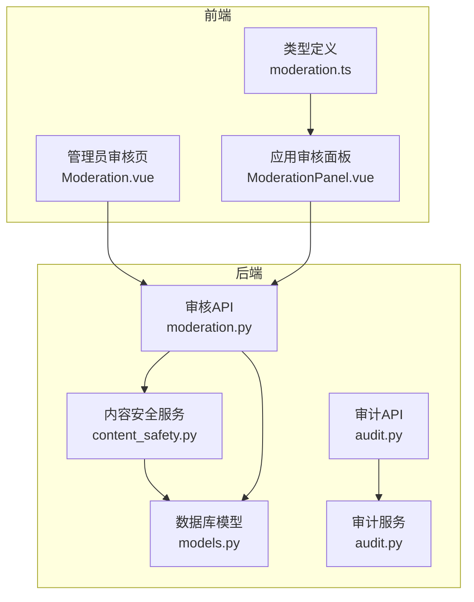
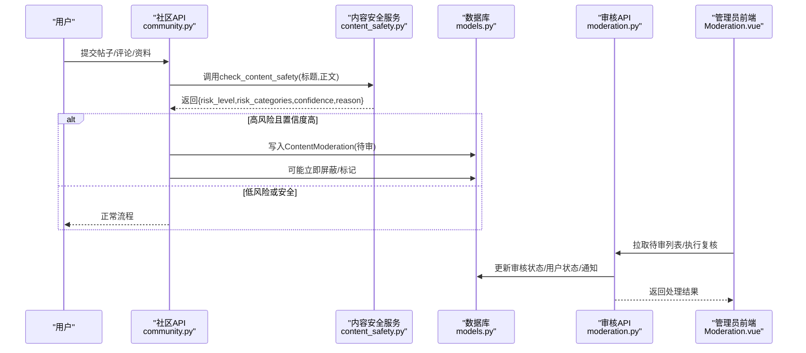
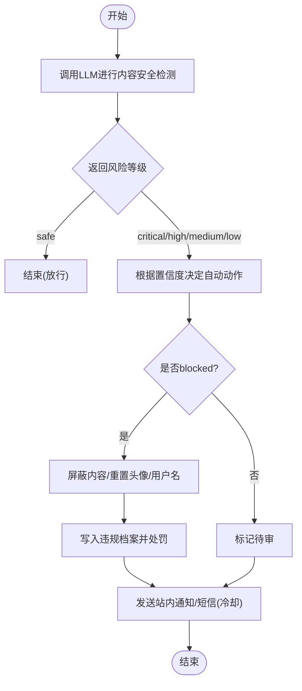
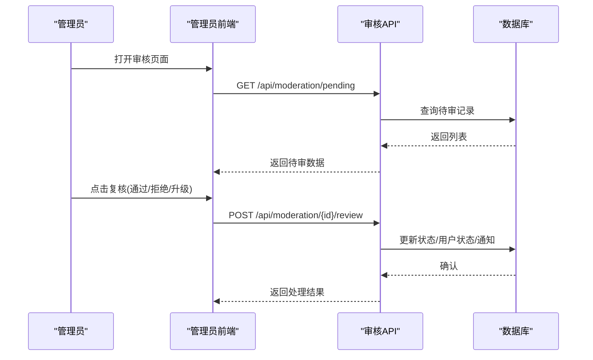
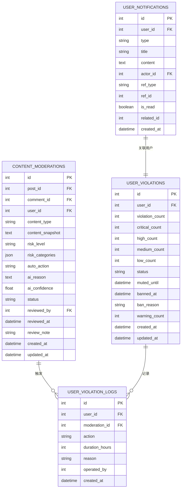
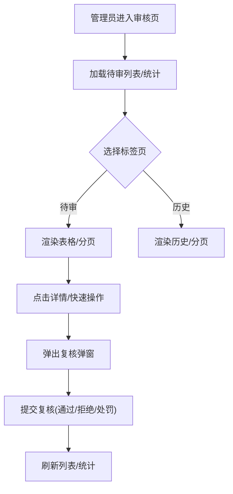
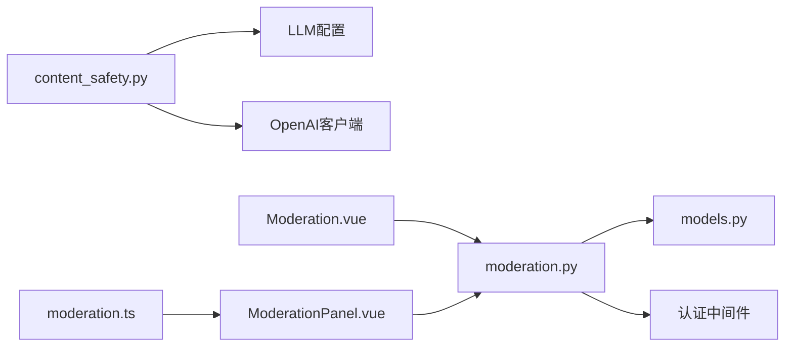

# 内容审核机制

<cite>
**本文引用的文件**
- [web/backend/services/content_safety.py](file://web/backend/services/content_safety.py)
- [web/backend/api/moderation.py](file://web/backend/api/moderation.py)
- [web/backend/database/models.py](file://web/backend/database/models.py)
- [web/admin/src/views/Moderation.vue](file://web/admin/src/views/Moderation.vue)
- [web/app/src/components/moderation/ModerationPanel.vue](file://web/app/src/components/moderation/ModerationPanel.vue)
- [web/app/src/api/moderation.ts](file://web/app/src/api/moderation.ts)
- [web/backend/api/community.py](file://web/backend/api/community.py)
- [web/backend/api/audit.py](file://web/backend/api/audit.py)
- [web/backend/services/audit.py](file://web/backend/services/audit.py)
</cite>

## 目录
1. [简介](#简介)
2. [项目结构](#项目结构)
3. [核心组件](#核心组件)
4. [架构总览](#架构总览)
5. [详细组件分析](#详细组件分析)
6. [依赖关系分析](#依赖关系分析)
7. [性能考虑](#性能考虑)
8. [故障排查指南](#故障排查指南)
9. [结论](#结论)
10. [附录：API 接口文档](#附录api-接口文档)

## 简介
本技术文档围绕内容审核机制，系统阐述内容安全检测、违规识别、自动审核流程与人工审核界面；覆盖夸张声明检测、敏感词过滤（通过 LLM 风控分类）、AI 内容分析、审核规则配置；并说明审核日志记录、审计追踪与违规处理机制。同时提供内容审核 API 接口规范，以及前端审核工作流与管理员操作界面的实现要点。

## 项目结构
内容审核由“服务层 + API 层 + 数据模型 + 前端管理/应用”组成：
- 服务层：内容安全检测与自动处置（LLM 调用、风险判定、自动处罚）
- API 层：待审队列、复核、用户动作、通知、历史查询
- 数据模型：内容审核记录、用户违规档案、违规明细、站内通知等
- 前端：管理员审核页面、应用侧审核面板、类型定义与请求封装

**图表来源**
- [web/backend/services/content_safety.py:54-100](file://web/backend/services/content_safety.py#L54-L100)
- [web/backend/api/moderation.py:108-229](file://web/backend/api/moderation.py#L108-L229)
- [web/backend/database/models.py:848-933](file://web/backend/database/models.py#L848-L933)
- [web/admin/src/views/Moderation.vue:1-220](file://web/admin/src/views/Moderation.vue#L1-L220)
- [web/app/src/components/moderation/ModerationPanel.vue:1-140](file://web/app/src/components/moderation/ModerationPanel.vue#L1-L140)
- [web/app/src/api/moderation.ts:1-70](file://web/app/src/api/moderation.ts#L1-L70)
- [web/backend/api/audit.py:33-124](file://web/backend/api/audit.py#L33-L124)
- [web/backend/services/audit.py:11-136](file://web/backend/services/audit.py#L11-L136)

**章节来源**
- [web/backend/services/content_safety.py:54-100](file://web/backend/services/content_safety.py#L54-L100)
- [web/backend/api/moderation.py:108-229](file://web/backend/api/moderation.py#L108-L229)
- [web/backend/database/models.py:848-933](file://web/backend/database/models.py#L848-L933)
- [web/admin/src/views/Moderation.vue:1-220](file://web/admin/src/views/Moderation.vue#L1-L220)
- [web/app/src/components/moderation/ModerationPanel.vue:1-140](file://web/app/src/components/moderation/ModerationPanel.vue#L1-L140)
- [web/app/src/api/moderation.ts:1-70](file://web/app/src/api/moderation.ts#L1-L70)
- [web/backend/api/audit.py:33-124](file://web/backend/api/audit.py#L33-L124)
- [web/backend/services/audit.py:11-136](file://web/backend/services/audit.py#L11-L136)

## 核心组件
- 内容安全检测服务：基于 LLM 的内容风控判定，输出风险等级、风险类别、置信度与理由；根据阈值决定自动处置（屏蔽/标记/放行）。
- 自动处罚与违规档案：对严重/高危/中危/低危触发不同处罚策略（警告、禁言、封号），并同步用户状态与通知。
- 审核 API：提供待审列表、复核操作、用户动作（禁言/解封/封号/解封）、通知与历史记录查询。
- 数据模型：内容审核记录、用户违规档案、违规明细、站内通知等。
- 前端审核界面：管理员审核页与应用侧审核面板，支持筛选、分页、快速复核、详情弹窗、用户画像查看与操作。
- 审计追踪：通用审计日志服务，记录关键操作的不可篡改轨迹，支持撤销与按目标回溯。

**章节来源**
- [web/backend/services/content_safety.py:54-100](file://web/backend/services/content_safety.py#L54-L100)
- [web/backend/services/content_safety.py:229-339](file://web/backend/services/content_safety.py#L229-L339)
- [web/backend/api/moderation.py:108-324](file://web/backend/api/moderation.py#L108-L324)
- [web/backend/database/models.py:848-933](file://web/backend/database/models.py#L848-L933)
- [web/admin/src/views/Moderation.vue:1-220](file://web/admin/src/views/Moderation.vue#L1-L220)
- [web/app/src/components/moderation/ModerationPanel.vue:1-140](file://web/app/src/components/moderation/ModerationPanel.vue#L1-L140)
- [web/backend/api/audit.py:33-124](file://web/backend/api/audit.py#L33-L124)
- [web/backend/services/audit.py:11-136](file://web/backend/services/audit.py#L11-L136)

## 架构总览
内容从发布到展示经历“前置检测 → AI 风控 → 自动处置 → 人工复核 → 结果生效 → 通知与审计”的闭环。

**图表来源**
- [web/backend/api/community.py:236-268](file://web/backend/api/community.py#L236-L268)
- [web/backend/services/content_safety.py:54-100](file://web/backend/services/content_safety.py#L54-L100)
- [web/backend/database/models.py:848-873](file://web/backend/database/models.py#L848-L873)
- [web/backend/api/moderation.py:108-229](file://web/backend/api/moderation.py#L108-L229)
- [web/admin/src/views/Moderation.vue:1-220](file://web/admin/src/views/Moderation.vue#L1-L220)

## 详细组件分析

### 内容安全检测与自动处置
- 风险类别与等级：支持涉政、暴恐、色情、赌博、诈骗、毒品、枪支、自残教唆、辱骂歧视、人身攻击、引流广告、违反公序良俗等；等级分为 critical/high/medium/low/safe。
- 自动动作策略：依据风险等级与置信度阈值决定 blocked/flagged/none；异常时降级为 flagged 并提示检测异常。
- 自动处罚：根据等级累计违规次数，触发警告、禁言（含时长）、封号，并同步用户状态与站内通知；短信通知具备冷却防抖。

**图表来源**
- [web/backend/services/content_safety.py:54-100](file://web/backend/services/content_safety.py#L54-L100)
- [web/backend/services/content_safety.py:229-339](file://web/backend/services/content_safety.py#L229-L339)

**章节来源**
- [web/backend/services/content_safety.py:54-100](file://web/backend/services/content_safety.py#L54-L100)
- [web/backend/services/content_safety.py:229-339](file://web/backend/services/content_safety.py#L229-L339)

### 审核 API 与工作流
- 待审列表：支持按风险等级筛选、分页；返回作者名、帖子标题、AI 理由与置信度等。
- 复核操作：支持 approved/rejected/escalated；拒绝时可附加禁言时长或封号；通过后恢复可见并通知用户。
- 用户动作：支持 mute/unmute/ban/unban，并记录违规明细与通知。
- 通知与历史：提供未读计数、已读标记、历史审核记录查询。

**图表来源**
- [web/backend/api/moderation.py:108-229](file://web/backend/api/moderation.py#L108-L229)
- [web/admin/src/views/Moderation.vue:519-622](file://web/admin/src/views/Moderation.vue#L519-L622)

**章节来源**
- [web/backend/api/moderation.py:108-324](file://web/backend/api/moderation.py#L108-L324)
- [web/admin/src/views/Moderation.vue:1-220](file://web/admin/src/views/Moderation.vue#L1-L220)

### 数据模型与关系
- ContentModeration：记录每次内容风控结果与处置建议，关联帖子/评论/用户，包含风险等级、类别、自动动作、AI 理由与置信度、审核状态与备注。
- UserViolation：用户违规档案，统计各等级违规次数，维护当前状态（正常/禁言/封号）及时间戳。
- UserViolationLog：违规操作明细，记录动作类型、时长、原因、操作者。
- UserNotification：站内通知，用于向用户推送审核结果、禁言/封号等信息。

**图表来源**
- [web/backend/database/models.py:848-933](file://web/backend/database/models.py#L848-L933)

**章节来源**
- [web/backend/database/models.py:848-933](file://web/backend/database/models.py#L848-L933)

### 前端审核工作流与管理界面
- 管理员审核页：展示待审队列与复核历史，支持按风险等级筛选、分页；弹窗显示内容快照、AI 分析结果与复核表单；支持快速通过/拒绝/处罚。
- 应用侧审核面板：面向运营/管理员的轻量审核视图，支持风险过滤、分页、快速操作与用户画像查看（违规统计、最近操作记录、禁言/封号操作）。
- 类型定义：前端 TypeScript 类型统一了审核项、列表响应、复核请求、违规日志、用户审核画像等数据结构。

**图表来源**
- [web/admin/src/views/Moderation.vue:1-220](file://web/admin/src/views/Moderation.vue#L1-L220)
- [web/app/src/components/moderation/ModerationPanel.vue:1-140](file://web/app/src/components/moderation/ModerationPanel.vue#L1-L140)
- [web/app/src/api/moderation.ts:1-70](file://web/app/src/api/moderation.ts#L1-L70)

**章节来源**
- [web/admin/src/views/Moderation.vue:1-700](file://web/admin/src/views/Moderation.vue#L1-L700)
- [web/app/src/components/moderation/ModerationPanel.vue:1-377](file://web/app/src/components/moderation/ModerationPanel.vue#L1-L377)
- [web/app/src/api/moderation.ts:1-70](file://web/app/src/api/moderation.ts#L1-L70)

### 夸张声明检测与敏感词过滤
- 夸张声明检测：在创建帖子前后对标题与正文进行检测，若发现夸张声明则记录日志并标记待审，便于后续人工复核。
- 敏感词过滤：通过 LLM 风控分类将疑似违规内容归类至预设类别（如涉政、色情、引流广告等），并结合置信度决定自动处置。

**章节来源**
- [web/backend/api/community.py:162-169](file://web/backend/api/community.py#L162-L169)
- [web/backend/api/community.py:236-268](file://web/backend/api/community.py#L236-L268)
- [web/backend/services/content_safety.py:28-51](file://web/backend/services/content_safety.py#L28-L51)

### 审核规则配置
- LLM 模块配置：通过配置表集中管理各模块（如 im_moderation、summarizer、translator 等）的提供商、聊天模型、视觉模型与嵌入模型，便于切换与扩展。
- 安全提示词：内置安全检测提示词，明确风险类别与等级定义，约束输出 JSON 格式，确保稳定解析。

**章节来源**
- [web/backend/database/models.py:1008-1025](file://web/backend/database/models.py#L1008-L1025)
- [web/backend/services/content_safety.py:33-51](file://web/backend/services/content_safety.py#L33-L51)

### 审核日志记录与审计追踪
- 审核日志：通过通用审计 API 与服务记录关键操作（创建、撤销、按目标回溯），支持 IP 脱敏与可撤销标记。
- 违规明细：每次自动/人工处置均生成违规明细，记录动作类型、时长、原因与操作者，便于追溯与复盘。

**章节来源**
- [web/backend/api/audit.py:33-124](file://web/backend/api/audit.py#L33-L124)
- [web/backend/services/audit.py:11-136](file://web/backend/services/audit.py#L11-L136)
- [web/backend/database/models.py:899-914](file://web/backend/database/models.py#L899-L914)

## 依赖关系分析
- 内容安全服务依赖 LLM 配置与 OpenAI 客户端；当未配置或调用失败时，降级为 flagged 并记录异常。
- 审核 API 依赖数据库模型与认证中间件，所有管理端点需管理员权限。
- 前端审核界面依赖后端 API 与类型定义，保证数据结构一致性与类型安全。

**图表来源**
- [web/backend/services/content_safety.py:54-86](file://web/backend/services/content_safety.py#L54-L86)
- [web/backend/api/moderation.py:108-229](file://web/backend/api/moderation.py#L108-L229)
- [web/admin/src/views/Moderation.vue:519-622](file://web/admin/src/views/Moderation.vue#L519-L622)
- [web/app/src/components/moderation/ModerationPanel.vue:1-140](file://web/app/src/components/moderation/ModerationPanel.vue#L1-L140)
- [web/app/src/api/moderation.ts:1-70](file://web/app/src/api/moderation.ts#L1-L70)

**章节来源**
- [web/backend/services/content_safety.py:54-86](file://web/backend/services/content_safety.py#L54-L86)
- [web/backend/api/moderation.py:108-229](file://web/backend/api/moderation.py#L108-L229)
- [web/admin/src/views/Moderation.vue:519-622](file://web/admin/src/views/Moderation.vue#L519-L622)
- [web/app/src/components/moderation/ModerationPanel.vue:1-140](file://web/app/src/components/moderation/ModerationPanel.vue#L1-L140)
- [web/app/src/api/moderation.ts:1-70](file://web/app/src/api/moderation.ts#L1-L70)

## 性能考虑
- LLM 调用延迟与稳定性：建议在高峰期采用异步任务或队列化调用，避免阻塞主流程；失败时快速降级为 flagged。
- 批量违规短信通知：通过冷却机制限制单位时间内重复通知，降低短信成本与骚扰。
- 数据库查询优化：待审列表与历史查询使用分页与索引字段（status、risk_level、created_at），控制最大 limit 防止大结果集。

[本节为通用指导，不直接分析具体文件]

## 故障排查指南
- LLM 未配置或调用失败：检查 LLM 模块配置与网络连通性；服务会返回 flagged 并记录异常日志。
- 审核状态不一致：核对 ContentModeration.status 与 Post.moderation_status 的一致性；复核后应同步更新。
- 通知未送达：检查站内通知是否写入、短信服务是否可用；注意冷却逻辑可能导致短时抑制。
- 权限错误：管理端点需管理员身份，确认当前用户角色与权限。

**章节来源**
- [web/backend/services/content_safety.py:54-86](file://web/backend/services/content_safety.py#L54-L86)
- [web/backend/api/moderation.py:144-229](file://web/backend/api/moderation.py#L144-L229)
- [web/backend/services/content_safety.py:341-368](file://web/backend/services/content_safety.py#L341-L368)

## 结论
该审核机制以 LLM 为核心，结合规则化阈值与自动化处置，形成“检测—处置—复核—通知—审计”的完整闭环。通过清晰的数据模型与 API 设计，配合管理员与应用侧的前端界面，实现了高效、可追溯、可扩展的内容治理体系。未来可进一步引入多模态检测、更细粒度的规则引擎与更丰富的可视化报表。

[本节为总结，不直接分析具体文件]

## 附录：API 接口文档

### 内容审核相关 API
- 获取待审列表
  - 方法：GET
  - 路径：/api/moderation/pending
  - 参数：risk_level（可选）、limit（默认20）、offset（默认0）
  - 权限：管理员
  - 返回：ModerationListResponse（total、items）
  - 参考：[web/backend/api/moderation.py:108-141](file://web/backend/api/moderation.py#L108-L141)

- 复核审核记录
  - 方法：POST
  - 路径：/api/moderation/{moderation_id}/review
  - 请求体：ReviewRequest（action: approved/rejected/escalated；note；mute_hours；ban）
  - 权限：管理员
  - 行为：更新审核状态、用户状态、写入违规明细与通知
  - 参考：[web/backend/api/moderation.py:144-229](file://web/backend/api/moderation.py#L144-L229)

- 获取用户审核画像
  - 方法：GET
  - 路径：/api/moderation/user/{user_id}
  - 权限：管理员
  - 返回：UserProfileModeration（违规统计、最近日志）
  - 参考：[web/backend/api/moderation.py:232-261](file://web/backend/api/moderation.py#L232-L261)

- 用户动作（禁言/解封/封号/解封）
  - 方法：POST
  - 路径：/api/moderation/user/{user_id}/action
  - 参数：action（mute/unmute/ban/unban）、hours（可选）、reason（可选）
  - 权限：管理员
  - 行为：更新用户状态、写入违规明细与通知
  - 参考：[web/backend/api/moderation.py:264-324](file://web/backend/api/moderation.py#L264-L324)

- 通知列表与已读
  - 方法：GET /api/moderation/notifications
  - 方法：POST /api/moderation/notifications/{notification_id}/read
  - 方法：GET /api/moderation/notifications/unread-count
  - 权限：登录用户
  - 参考：[web/backend/api/moderation.py:328-370](file://web/backend/api/moderation.py#L328-L370)

- 审核历史
  - 方法：GET
  - 路径：/api/moderation/history
  - 参数：page、page_size、status（可选）
  - 权限：管理员
  - 返回：ModerationListResponse
  - 参考：[web/backend/api/moderation.py:374-417](file://web/backend/api/moderation.py#L374-L417)

### 审计日志 API
- 创建审计日志
  - 方法：POST
  - 路径：/api/logs
  - 权限：登录用户
  - 参考：[web/backend/api/audit.py:33-52](file://web/backend/api/audit.py#L33-L52)

- 查询用户审计日志
  - 方法：GET
  - 路径：/api/logs
  - 参数：limit、offset
  - 权限：登录用户
  - 参考：[web/backend/api/audit.py:55-68](file://web/backend/api/audit.py#L55-L68)

- 查询日志详情
  - 方法：GET
  - 路径：/api/logs/{log_id}
  - 权限：登录用户
  - 参考：[web/backend/api/audit.py:71-81](file://web/backend/api/audit.py#L71-L81)

- 撤销审计日志
  - 方法：POST
  - 路径：/api/logs/{log_id}/revoke
  - 权限：登录用户
  - 参考：[web/backend/api/audit.py:84-98](file://web/backend/api/audit.py#L84-L98)

- 按目标回溯审计轨迹
  - 方法：GET
  - 路径：/api/logs/target/{target_type}/{target_id}
  - 权限：管理员或非管理员仅见自身操作
  - 参考：[web/backend/api/audit.py:101-124](file://web/backend/api/audit.py#L101-L124)

**章节来源**
- [web/backend/api/moderation.py:108-417](file://web/backend/api/moderation.py#L108-L417)
- [web/backend/api/audit.py:33-124](file://web/backend/api/audit.py#L33-L124)