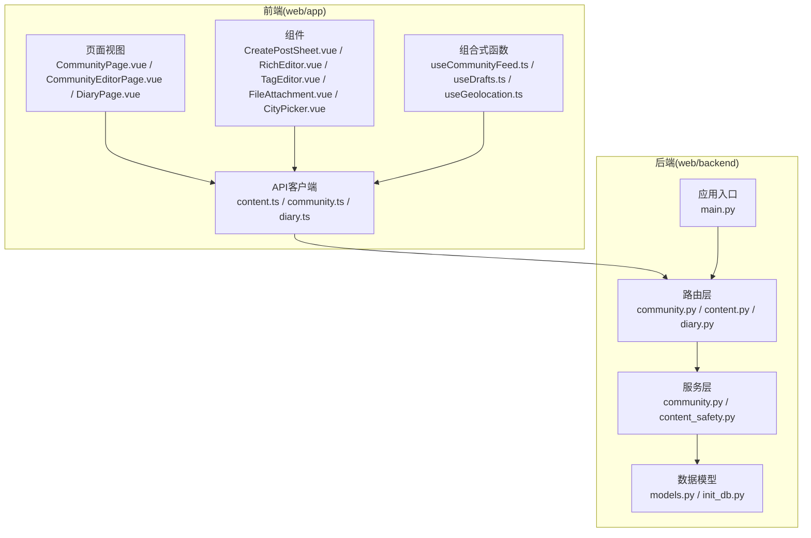
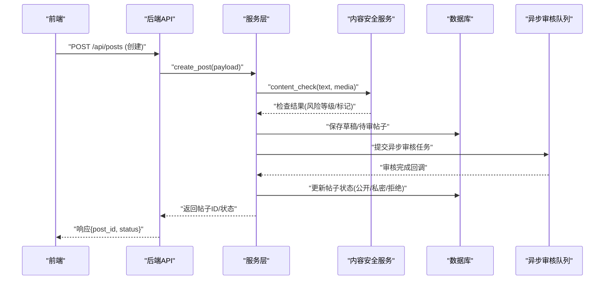
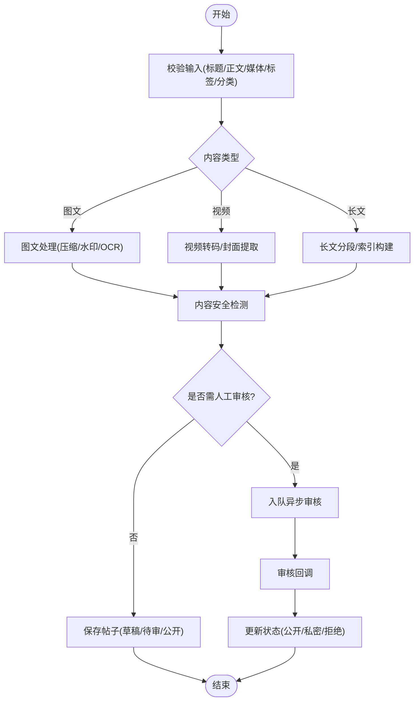
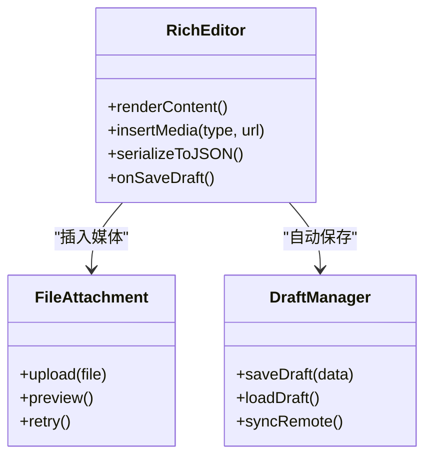
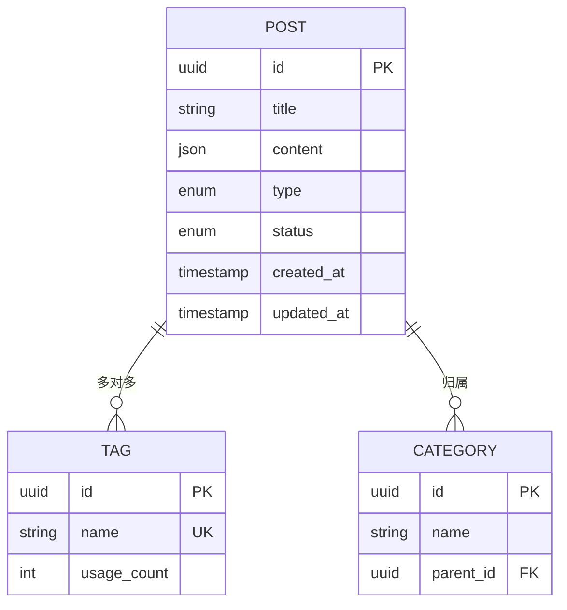
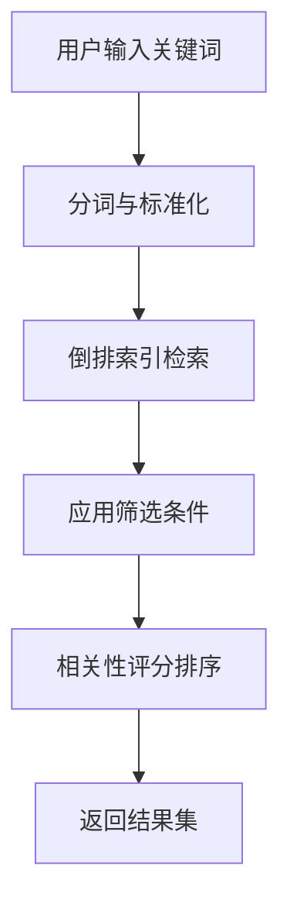
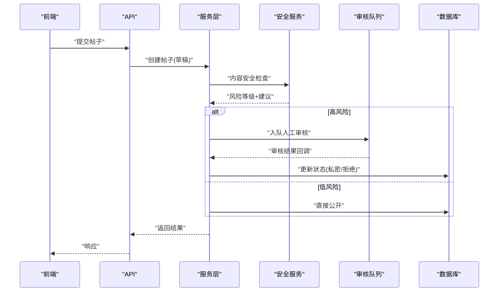
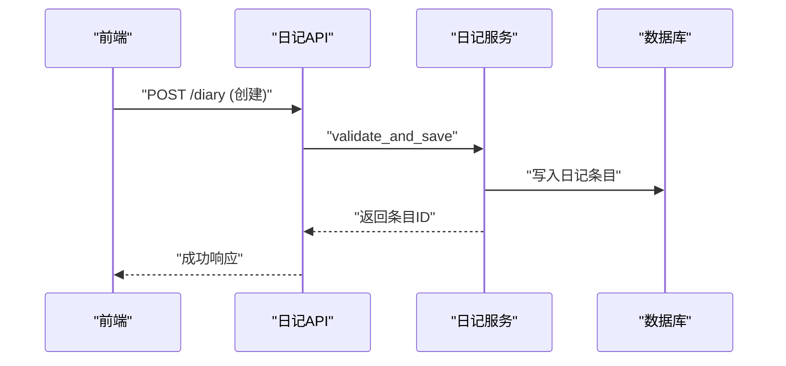
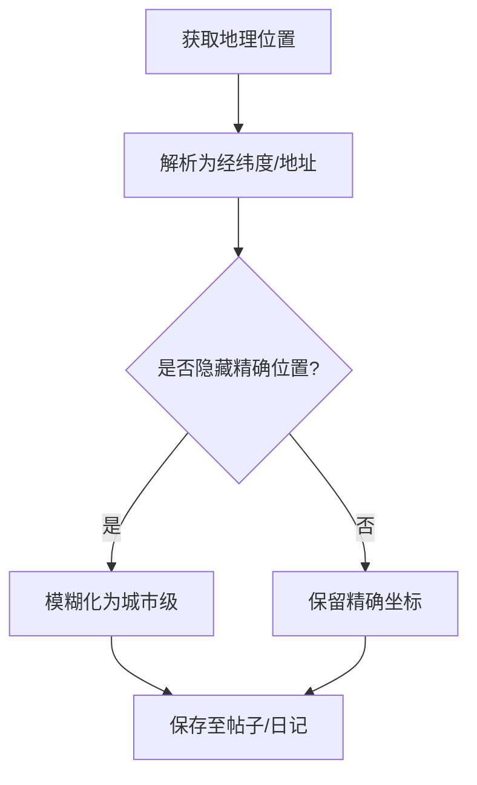
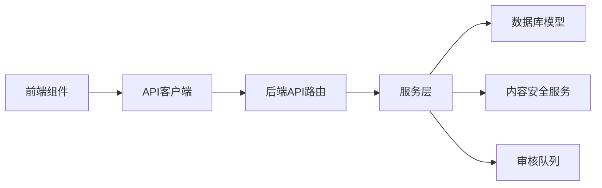

# 帖子管理系统

<cite>
**本文引用的文件**   
- [README.md](file://README.md)
- [PROJECT_FRAMEWORK.md](file://PROJECT_FRAMEWORK.md)
- [INSTALLATION.md](file://INSTALLATION.md)
- [web/STRUCTURE.md](file://web/STRUCTURE.md)
- [web/app/src/api/content.ts](file://web/app/src/api/content.ts)
- [web/app/src/api/community.ts](file://web/app/src/api/community.ts)
- [web/app/src/api/diary.ts](file://web/app/src/api/diary.ts)
- [web/app/src/components/community/CreatePostSheet.vue](file://web/app/src/components/community/CreatePostSheet.vue)
- [web/app/src/components/community/RichEditor.vue](file://web/app/src/components/community/RichEditor.vue)
- [web/app/src/components/community/TagEditor.vue](file://web/app/src/components/community/TagEditor.vue)
- [web/app/src/components/community/TagSelector.vue](file://web/app/src/components/community/TagSelector.vue)
- [web/app/src/components/community/FileAttachment.vue](file://web/app/src/components/community/FileAttachment.vue)
- [web/app/src/components/community/CityPicker.vue](file://web/app/src/components/community/CityPicker.vue)
- [web/app/src/composables/useCommunityFeed.ts](file://web/app/src/composables/useCommunityFeed.ts)
- [web/app/src/composables/useDrafts.ts](file://web/app/src/composables/useDrafts.ts)
- [web/app/src/composables/useGeolocation.ts](file://web/app/src/composables/useGeolocation.ts)
- [web/app/src/views/CommunityPage.vue](file://web/app/src/views/CommunityPage.vue)
- [web/app/src/views/CommunityEditorPage.vue](file://web/app/src/views/CommunityEditorPage.vue)
- [web/app/src/views/DiaryPage.vue](file://web/app/src/views/DiaryPage.vue)
- [web/backend/api/community.py](file://web/backend/api/community.py)
- [web/backend/api/content.py](file://web/backend/api/content.py)
- [web/backend/api/diary.py](file://web/backend/api/diary.py)
- [web/backend/services/community.py](file://web/backend/services/community.py)
- [web/backend/services/content_safety.py](file://web/backend/services/content_safety.py)
- [web/backend/database/models.py](file://web/backend/database/models.py)
- [web/backend/database/init_db.py](file://web/backend/database/init_db.py)
- [web/backend/app/main.py](file://web/backend/app/main.py)
</cite>

## 目录
1. [简介](#简介)
2. [项目结构](#项目结构)
3. [核心组件](#核心组件)
4. [架构总览](#架构总览)
5. [详细组件分析](#详细组件分析)
6. [依赖关系分析](#依赖关系分析)
7. [性能考量](#性能考量)
8. [故障排查指南](#故障排查指南)
9. [结论](#结论)
10. [附录](#附录)

## 简介
本技术文档围绕“帖子管理系统”展开，覆盖帖子的CRUD操作、内容类型（图文、视频、长文）、富文本编辑器集成、标签与分类系统、搜索能力；并详细说明创建流程中的内容安全检测、夸张声明检查、异步审核机制；同时涵盖帖子状态管理（公开/私密）、日记功能、地理位置信息处理。文末提供完整的API接口规范（请求参数、响应格式、错误处理、权限控制）以及前端组件集成示例与最佳实践。

## 项目结构
本项目采用前后端分离架构：
- 前端位于 web/app，使用 Vue + TypeScript，包含社区发帖、编辑、展示、日记等页面与组件。
- 后端位于 web/backend，基于 Python 框架，提供 REST API、数据库模型、服务层与安全审核能力。
- 配置与部署相关文件位于根目录与 web/deploy。

图表来源
- [web/app/src/api/content.ts](file://web/app/src/api/content.ts)
- [web/app/src/api/community.ts](file://web/app/src/api/community.ts)
- [web/app/src/api/diary.ts](file://web/app/src/api/diary.ts)
- [web/app/src/views/CommunityPage.vue](file://web/app/src/views/CommunityPage.vue)
- [web/app/src/views/CommunityEditorPage.vue](file://web/app/src/views/CommunityEditorPage.vue)
- [web/app/src/views/DiaryPage.vue](file://web/app/src/views/DiaryPage.vue)
- [web/app/src/components/community/CreatePostSheet.vue](file://web/app/src/components/community/CreatePostSheet.vue)
- [web/app/src/components/community/RichEditor.vue](file://web/app/src/components/community/RichEditor.vue)
- [web/app/src/components/community/TagEditor.vue](file://web/app/src/components/community/TagEditor.vue)
- [web/app/src/components/community/FileAttachment.vue](file://web/app/src/components/community/FileAttachment.vue)
- [web/app/src/components/community/CityPicker.vue](file://web/app/src/components/community/CityPicker.vue)
- [web/app/src/composables/useCommunityFeed.ts](file://web/app/src/composables/useCommunityFeed.ts)
- [web/app/src/composables/useDrafts.ts](file://web/app/src/composables/useDrafts.ts)
- [web/app/src/composables/useGeolocation.ts](file://web/app/src/composables/useGeolocation.ts)
- [web/backend/app/main.py](file://web/backend/app/main.py)
- [web/backend/api/community.py](file://web/backend/api/community.py)
- [web/backend/api/content.py](file://web/backend/api/content.py)
- [web/backend/api/diary.py](file://web/backend/api/diary.py)
- [web/backend/services/community.py](file://web/backend/services/community.py)
- [web/backend/services/content_safety.py](file://web/backend/services/content_safety.py)
- [web/backend/database/models.py](file://web/backend/database/models.py)
- [web/backend/database/init_db.py](file://web/backend/database/init_db.py)

章节来源
- [web/STRUCTURE.md](file://web/STRUCTURE.md)
- [README.md](file://README.md)
- [PROJECT_FRAMEWORK.md](file://PROJECT_FRAMEWORK.md)
- [INSTALLATION.md](file://INSTALLATION.md)

## 核心组件
- 帖子API客户端：封装帖子创建、更新、删除、查询、搜索等HTTP调用。
- 社区服务：聚合帖子业务逻辑，包括内容校验、标签/分类处理、附件上传、草稿持久化、审核队列。
- 内容安全服务：负责敏感词过滤、图片/视频安全检测、夸张声明识别、异步审核任务调度。
- 数据库模型：定义帖子、评论、标签、分类、附件、地理位置、日记条目等实体及关系。
- 前端组件：富文本编辑器、标签选择器、文件附件、城市选择器、发帖面板、日记日历等。
- 组合式函数：社区流加载、草稿管理、地理位置获取等。

章节来源
- [web/app/src/api/content.ts](file://web/app/src/api/content.ts)
- [web/app/src/api/community.ts](file://web/app/src/api/community.ts)
- [web/app/src/api/diary.ts](file://web/app/src/api/diary.ts)
- [web/backend/services/community.py](file://web/backend/services/community.py)
- [web/backend/services/content_safety.py](file://web/backend/services/content_safety.py)
- [web/backend/database/models.py](file://web/backend/database/models.py)
- [web/app/src/components/community/CreatePostSheet.vue](file://web/app/src/components/community/CreatePostSheet.vue)
- [web/app/src/components/community/RichEditor.vue](file://web/app/src/components/community/RichEditor.vue)
- [web/app/src/components/community/TagEditor.vue](file://web/app/src/components/community/TagEditor.vue)
- [web/app/src/components/community/FileAttachment.vue](file://web/app/src/components/community/FileAttachment.vue)
- [web/app/src/components/community/CityPicker.vue](file://web/app/src/components/community/CityPicker.vue)
- [web/app/src/composables/useCommunityFeed.ts](file://web/app/src/composables/useCommunityFeed.ts)
- [web/app/src/composables/useDrafts.ts](file://web/app/src/composables/useDrafts.ts)
- [web/app/src/composables/useGeolocation.ts](file://web/app/src/composables/useGeolocation.ts)

## 架构总览
整体数据流从前端发起请求，经API路由进入服务层，服务层进行业务编排与安全审核，最终读写数据库。审核结果通过异步任务回写至帖子状态。

图表来源
- [web/app/src/api/content.ts](file://web/app/src/api/content.ts)
- [web/backend/api/content.py](file://web/backend/api/content.py)
- [web/backend/services/community.py](file://web/backend/services/community.py)
- [web/backend/services/content_safety.py](file://web/backend/services/content_safety.py)
- [web/backend/database/models.py](file://web/backend/database/models.py)

## 详细组件分析

### 帖子CRUD与内容类型支持
- 创建帖子：支持图文、视频、长文三种内容类型，富文本编辑器生成结构化内容，附件上传后生成媒体元数据。
- 读取帖子：按ID或列表分页查询，支持筛选分类、标签、时间范围、关键词搜索。
- 更新帖子：允许作者修改内容与附件，保留版本历史（可选）。
- 删除帖子：软删除，支持回收站恢复。
- 内容类型字段：统一以JSON结构存储正文与媒体引用，便于渲染与检索。

图表来源
- [web/app/src/components/community/CreatePostSheet.vue](file://web/app/src/components/community/CreatePostSheet.vue)
- [web/app/src/components/community/RichEditor.vue](file://web/app/src/components/community/RichEditor.vue)
- [web/app/src/components/community/FileAttachment.vue](file://web/app/src/components/community/FileAttachment.vue)
- [web/backend/api/content.py](file://web/backend/api/content.py)
- [web/backend/services/community.py](file://web/backend/services/community.py)
- [web/backend/services/content_safety.py](file://web/backend/services/content_safety.py)
- [web/backend/database/models.py](file://web/backend/database/models.py)

章节来源
- [web/app/src/api/content.ts](file://web/app/src/api/content.ts)
- [web/backend/api/content.py](file://web/backend/api/content.py)
- [web/backend/services/community.py](file://web/backend/services/community.py)
- [web/backend/database/models.py](file://web/backend/database/models.py)

### 富文本编辑器集成
- 编辑器组件：RichEditor.vue 提供所见即所得编辑，支持插入图片、视频、链接、表格、代码块。
- 内容序列化：将HTML/Markdown转换为统一JSON结构，便于存储与跨平台渲染。
- 草稿自动保存：结合 useDrafts.ts 实现本地缓存与云端同步。
- 附件上传：FileAttachment.vue 支持拖拽、预览、进度条、失败重试。

图表来源
- [web/app/src/components/community/RichEditor.vue](file://web/app/src/components/community/RichEditor.vue)
- [web/app/src/components/community/FileAttachment.vue](file://web/app/src/components/community/FileAttachment.vue)
- [web/app/src/composables/useDrafts.ts](file://web/app/src/composables/useDrafts.ts)

章节来源
- [web/app/src/components/community/RichEditor.vue](file://web/app/src/components/community/RichEditor.vue)
- [web/app/src/components/community/FileAttachment.vue](file://web/app/src/components/community/FileAttachment.vue)
- [web/app/src/composables/useDrafts.ts](file://web/app/src/composables/useDrafts.ts)

### 标签管理与分类系统
- 标签：支持创建、关联、去重、热榜统计；TagEditor.vue 与 TagSelector.vue 提供交互。
- 分类：层级结构，用于内容组织与导航；可在创建帖子时选择主/次分类。
- 搜索：基于标签与分类的过滤条件，结合全文检索提升命中率。

图表来源
- [web/backend/database/models.py](file://web/backend/database/models.py)
- [web/app/src/components/community/TagEditor.vue](file://web/app/src/components/community/TagEditor.vue)
- [web/app/src/components/community/TagSelector.vue](file://web/app/src/components/community/TagSelector.vue)

章节来源
- [web/app/src/components/community/TagEditor.vue](file://web/app/src/components/community/TagEditor.vue)
- [web/app/src/components/community/TagSelector.vue](file://web/app/src/components/community/TagSelector.vue)
- [web/backend/database/models.py](file://web/backend/database/models.py)

### 搜索功能
- 关键词检索：对标题、正文、标签进行分词与倒排索引。
- 高级筛选：按分类、标签、时间、作者、可见性过滤。
- 排序策略：相关性评分、热度、时间降序。

章节来源
- [web/app/src/api/content.ts](file://web/app/src/api/content.ts)
- [web/backend/api/content.py](file://web/backend/api/content.py)
- [web/backend/database/models.py](file://web/backend/database/models.py)

### 内容安全检测与异步审核
- 安全检测：文本敏感词过滤、图片/视频违规检测、夸张声明识别（如绝对化用语、医疗承诺）。
- 审核机制：高风险内容入队人工审核，低风险直接发布，中风险限流或打标签。
- 回调更新：审核完成后更新帖子状态（公开/私密/拒绝），并通知作者。

图表来源
- [web/backend/services/content_safety.py](file://web/backend/services/content_safety.py)
- [web/backend/services/community.py](file://web/backend/services/community.py)
- [web/backend/api/content.py](file://web/backend/api/content.py)
- [web/backend/database/models.py](file://web/backend/database/models.py)

章节来源
- [web/backend/services/content_safety.py](file://web/backend/services/content_safety.py)
- [web/backend/services/community.py](file://web/backend/services/community.py)
- [web/backend/api/content.py](file://web/backend/api/content.py)

### 帖子状态管理（公开/私密）
- 状态枚举：公开、私密、草稿、待审、拒绝。
- 可见性控制：公开可被搜索与推荐，私密仅作者与授权用户可见。
- 变更审计：记录状态变更原因与操作人。

章节来源
- [web/backend/database/models.py](file://web/backend/database/models.py)
- [web/backend/services/community.py](file://web/backend/services/community.py)

### 日记功能
- 日记条目：支持短文本、图片、位置、心情标签。
- 日历视图：按月展示，点击日期查看/编辑条目。
- 隐私保护：默认私密，可设置为公开分享。

图表来源
- [web/app/src/api/diary.ts](file://web/app/src/api/diary.ts)
- [web/backend/api/diary.py](file://web/backend/api/diary.py)
- [web/backend/database/models.py](file://web/backend/database/models.py)

章节来源
- [web/app/src/api/diary.ts](file://web/app/src/api/diary.ts)
- [web/backend/api/diary.py](file://web/backend/api/diary.py)
- [web/backend/database/models.py](file://web/backend/database/models.py)

### 地理位置信息处理
- 定位获取：浏览器地理定位或手动选择城市。
- 数据存储：经纬度与地址解析，支持模糊匹配与缓存。
- 隐私控制：可选择隐藏精确位置，仅显示城市级。

图表来源
- [web/app/src/components/community/CityPicker.vue](file://web/app/src/components/community/CityPicker.vue)
- [web/app/src/composables/useGeolocation.ts](file://web/app/src/composables/useGeolocation.ts)
- [web/backend/database/models.py](file://web/backend/database/models.py)

章节来源
- [web/app/src/components/community/CityPicker.vue](file://web/app/src/components/community/CityPicker.vue)
- [web/app/src/composables/useGeolocation.ts](file://web/app/src/composables/useGeolocation.ts)
- [web/backend/database/models.py](file://web/backend/database/models.py)

## 依赖关系分析
- 前端依赖：Vue生态、TypeScript、Vite构建；API客户端统一封装HTTP请求与错误处理。
- 后端依赖：Python Web框架、ORM、消息队列（异步审核）、存储服务（图片/视频）。
- 模块耦合：API层薄封装，服务层承载业务逻辑，数据库模型清晰分层。

图表来源
- [web/app/src/api/content.ts](file://web/app/src/api/content.ts)
- [web/backend/api/community.py](file://web/backend/api/community.py)
- [web/backend/services/community.py](file://web/backend/services/community.py)
- [web/backend/services/content_safety.py](file://web/backend/services/content_safety.py)
- [web/backend/database/models.py](file://web/backend/database/models.py)

章节来源
- [web/app/src/api/content.ts](file://web/app/src/api/content.ts)
- [web/backend/api/community.py](file://web/backend/api/community.py)
- [web/backend/services/community.py](file://web/backend/services/community.py)
- [web/backend/services/content_safety.py](file://web/backend/services/content_safety.py)
- [web/backend/database/models.py](file://web/backend/database/models.py)

## 性能考量
- 富文本序列化：避免过大HTML，优先使用轻量JSON结构。
- 媒体处理：图片压缩、视频转码在异步任务中执行，减少主线程阻塞。
- 搜索优化：建立倒排索引，定期重建索引，分页与缓存热点查询。
- 审核队列：使用消息队列削峰填谷，确保高并发下稳定性。
- 数据库索引：对常用查询字段（作者、分类、标签、时间）建立索引。

[本节为通用指导，不直接分析具体文件]

## 故障排查指南
- 帖子创建失败：检查输入校验、附件上传、安全检测结果、审核队列状态。
- 搜索无结果：确认索引是否构建完成、关键词分词是否正确、筛选条件是否过严。
- 审核延迟：检查队列消费者日志、外部安全服务可用性、回调处理逻辑。
- 地理位置异常：验证浏览器权限、城市数据源、经纬度转换精度。

章节来源
- [web/backend/services/content_safety.py](file://web/backend/services/content_safety.py)
- [web/backend/services/community.py](file://web/backend/services/community.py)
- [web/backend/database/models.py](file://web/backend/database/models.py)

## 结论
本帖子管理系统通过清晰的前后端分层、完善的内容安全与审核机制、灵活的富文本与附件支持、健壮的标签与分类体系，实现了高质量的社区内容生产与管理。未来可进一步扩展AI辅助创作、个性化推荐与多语言支持。

[本节为总结性内容，不直接分析具体文件]

## 附录

### API接口规范（摘要）
- 帖子创建
  - 方法：POST
  - 路径：/api/posts
  - 请求体：标题、内容（JSON）、类型（图文/视频/长文）、标签数组、分类ID、附件列表、可见性
  - 响应：帖子ID、状态（草稿/待审/公开/私密）
  - 错误：参数校验失败、附件上传失败、安全检测拦截
- 帖子更新
  - 方法：PUT
  - 路径：/api/posts/{id}
  - 请求体：可更新字段（标题、内容、标签、分类、可见性）
  - 响应：更新后的帖子对象
  - 错误：权限不足、资源不存在
- 帖子删除
  - 方法：DELETE
  - 路径：/api/posts/{id}
  - 响应：成功标志
  - 错误：权限不足、资源不存在
- 帖子查询
  - 方法：GET
  - 路径：/api/posts?query=&category=&tags=&page=&size=
  - 响应：帖子列表、总数、分页信息
  - 错误：参数非法
- 日记创建/查询/更新/删除
  - 方法：POST/GET/PUT/DELETE
  - 路径：/api/diary
  - 请求体：内容、位置、心情标签、可见性
  - 响应：日记条目对象
  - 错误：权限不足、参数非法

章节来源
- [web/app/src/api/content.ts](file://web/app/src/api/content.ts)
- [web/app/src/api/diary.ts](file://web/app/src/api/diary.ts)
- [web/backend/api/content.py](file://web/backend/api/content.py)
- [web/backend/api/diary.py](file://web/backend/api/diary.py)

### 前端组件集成示例与最佳实践
- 使用 CreatePostSheet.vue 作为发帖入口，集成 RichEditor.vue 与 FileAttachment.vue。
- 通过 useDrafts.ts 实现草稿自动保存与恢复。
- 使用 TagEditor.vue 与 TagSelector.vue 管理标签，确保去重与热榜统计。
- 使用 CityPicker.vue 与 useGeolocation.ts 获取并处理地理位置，注意隐私设置。
- 统一错误处理：捕获网络错误、业务错误，提示用户友好信息。

章节来源
- [web/app/src/components/community/CreatePostSheet.vue](file://web/app/src/components/community/CreatePostSheet.vue)
- [web/app/src/components/community/RichEditor.vue](file://web/app/src/components/community/RichEditor.vue)
- [web/app/src/components/community/FileAttachment.vue](file://web/app/src/components/community/FileAttachment.vue)
- [web/app/src/components/community/TagEditor.vue](file://web/app/src/components/community/TagEditor.vue)
- [web/app/src/components/community/TagSelector.vue](file://web/app/src/components/community/TagSelector.vue)
- [web/app/src/components/community/CityPicker.vue](file://web/app/src/components/community/CityPicker.vue)
- [web/app/src/composables/useDrafts.ts](file://web/app/src/composables/useDrafts.ts)
- [web/app/src/composables/useGeolocation.ts](file://web/app/src/composables/useGeolocation.ts)