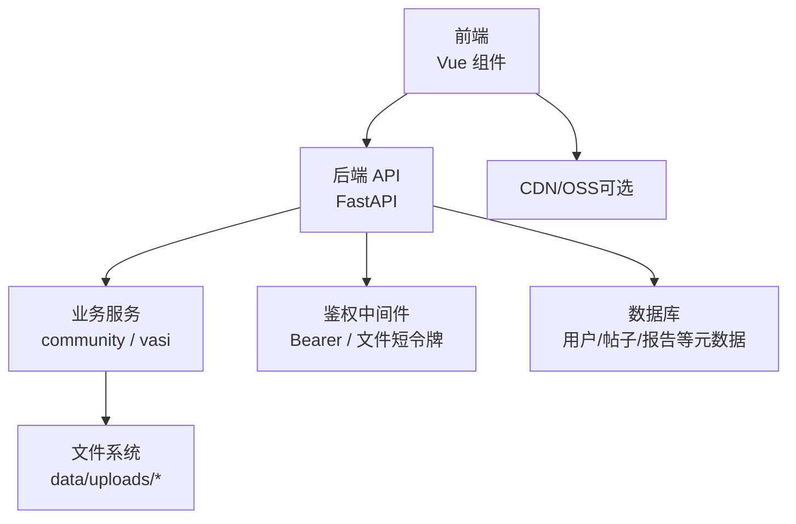
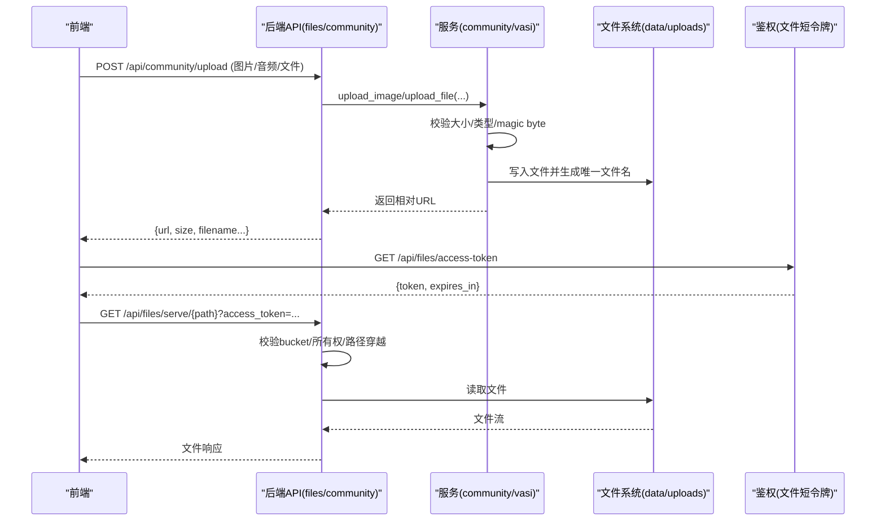
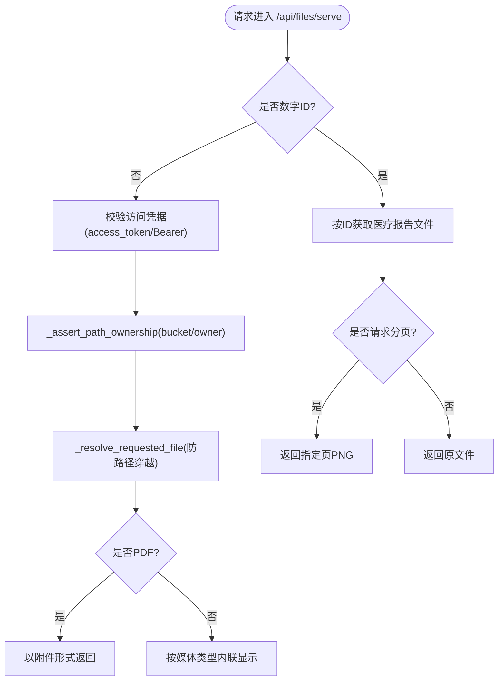
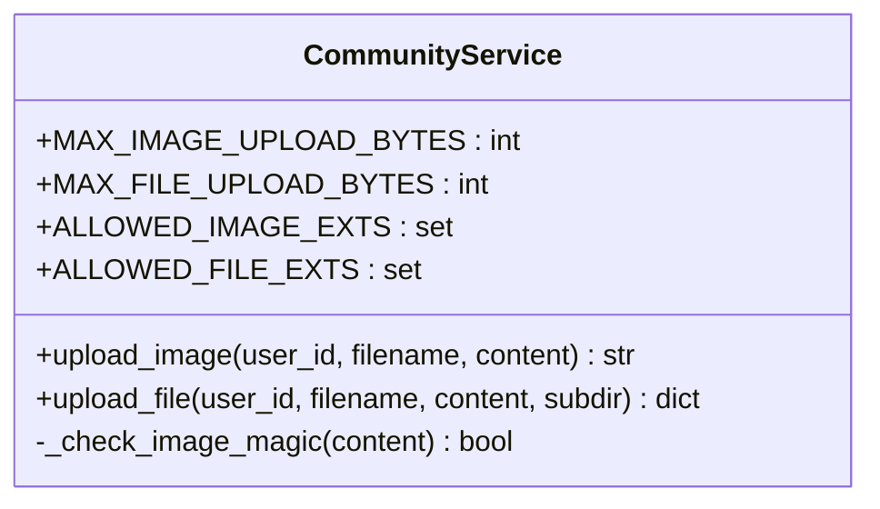
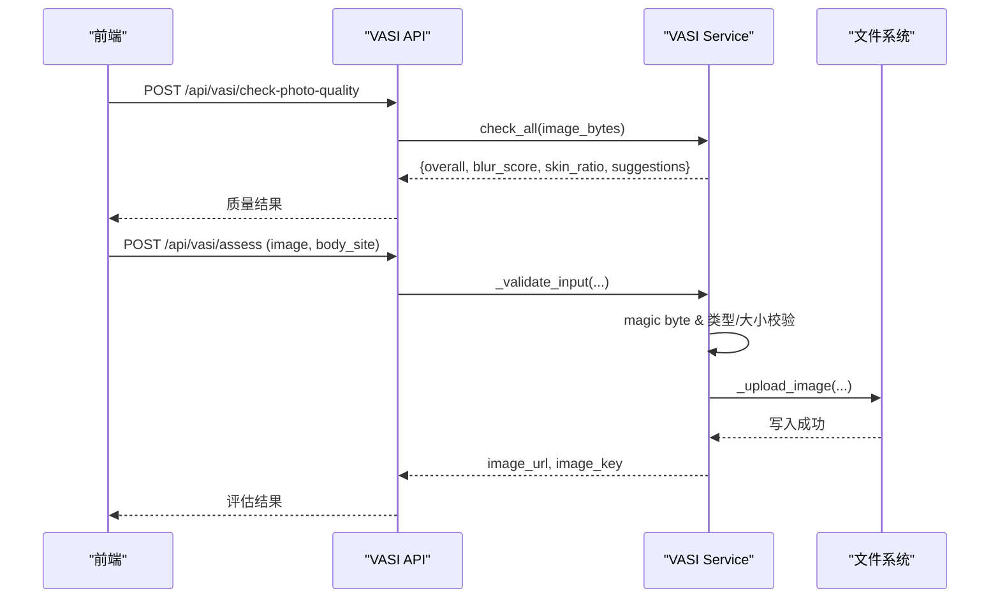
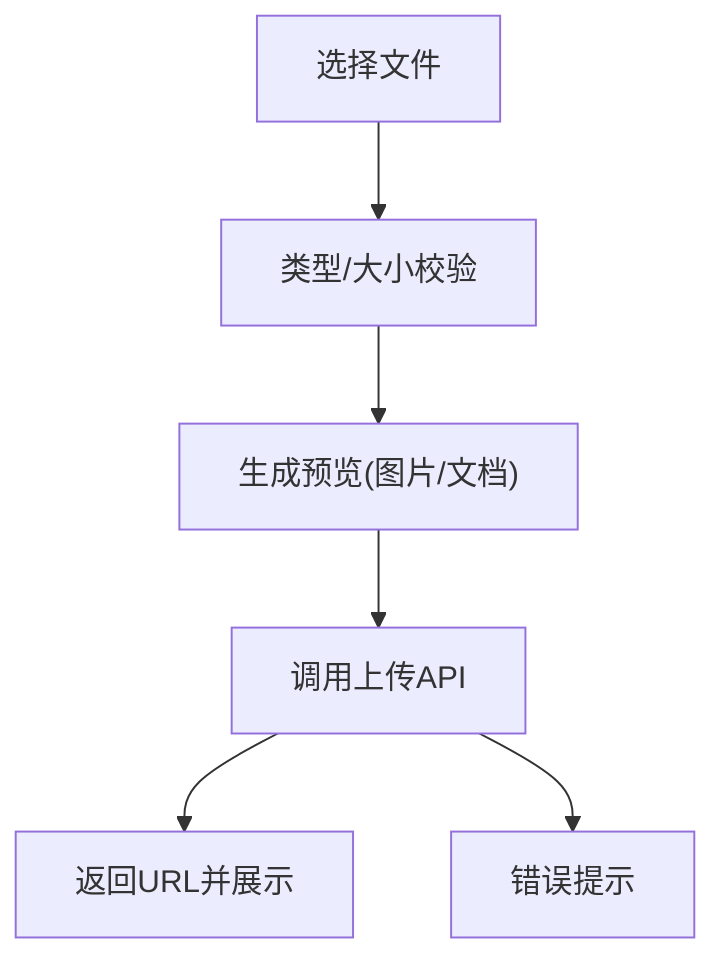
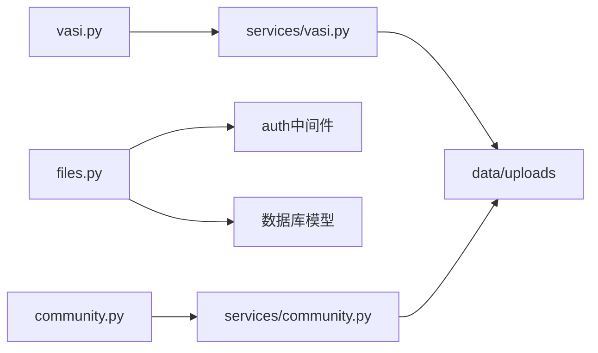

# 文件上传服务

<cite>
**本文引用的文件**   
- [web/backend/api/files.py](file://web/backend/api/files.py)
- [web/backend/api/community.py](file://web/backend/api/community.py)
- [web/backend/services/community.py](file://web/backend/services/community.py)
- [web/backend/services/vasi.py](file://web/backend/services/vasi.py)
- [web/app/src/utils/file-url.ts](file://web/app/src/utils/file-url.ts)
- [web/app/src/components/community/FileAttachment.vue](file://web/app/src/components/community/FileAttachment.vue)
- [web/app/src/components/tracker/ReportUploader.vue](file://web/app/src/components/tracker/ReportUploader.vue)
- [web/vitepress/docs/.vitepress/theme/components/VASIAssessment.vue](file://web/vitepress/docs/.vitepress/theme/components/VASIAssessment.vue)
- [tests/backend/api/test_files.py](file://tests/backend/api/test_files.py)
</cite>

## 目录
1. [简介](#简介)
2. [项目结构](#项目结构)
3. [核心组件](#核心组件)
4. [架构总览](#架构总览)
5. [详细组件分析](#详细组件分析)
6. [依赖关系分析](#依赖关系分析)
7. [性能与扩展性](#性能与扩展性)
8. [故障排查指南](#故障排查指南)
9. [结论](#结论)
10. [附录：API 接口规范](#附录api-接口规范)

## 简介
本技术文档围绕“文件上传服务”展开，覆盖图片、音频与通用文件附件的完整上传流程，包括类型校验、大小限制、存储策略、访问权限控制、CDN 集成思路以及前端选择器、进度条与预览的实现要点。后端采用 FastAPI 提供 REST 接口，文件落盘至本地 data/uploads 目录并通过受保护的 /api/files/serve 路由统一分发；社区内容上传通过 community API 路由处理；VASI 评估路径包含质量检查与魔法字节校验；前端使用 Vue 组件实现拖拽、预览、鉴权短令牌等能力。

## 项目结构
- 后端
  - 文件服务路由：web/backend/api/files.py（统一鉴权、下载、PDF 分页预览、临时文件清理）
  - 社区上传路由：web/backend/api/community.py（图片、音频、通用文件上传）
  - 社区服务实现：web/backend/services/community.py（大小限制、扩展名白名单、magic byte 校验、落盘命名）
  - VASI 评估服务：web/backend/services/vasi.py（输入校验、质量检查、上传与 URL 生成）
- 前端
  - 安全文件 URL 工具：web/app/src/utils/file-url.ts（短生命周期文件访问令牌缓存与拼接）
  - 附件展示：web/app/src/components/community/FileAttachment.vue（图标区分、文件大小格式化、受保护链接）
  - 报告上传：web/app/src/components/tracker/ReportUploader.vue（多文件选择、预览、提交与解读）
  - VASI 评估页：web/vitepress/docs/.vitepress/theme/components/VASIAssessment.vue（类型与大小校验、预览、提交）

**图示来源** 
- [web/backend/api/files.py:293-331](file://web/backend/api/files.py#L293-L331)
- [web/backend/api/community.py:683-757](file://web/backend/api/community.py#L683-L757)
- [web/backend/services/community.py:501-583](file://web/backend/services/community.py#L501-L583)
- [web/backend/services/vasi.py:540-600](file://web/backend/services/vasi.py#L540-L600)
- [web/app/src/utils/file-url.ts:1-34](file://web/app/src/utils/file-url.ts#L1-L34)

**章节来源**
- [web/backend/api/files.py:293-331](file://web/backend/api/files.py#L293-L331)
- [web/backend/api/community.py:683-757](file://web/backend/api/community.py#L683-L757)
- [web/backend/services/community.py:501-583](file://web/backend/services/community.py#L501-L583)
- [web/backend/services/vasi.py:540-600](file://web/backend/services/vasi.py#L540-L600)
- [web/app/src/utils/file-url.ts:1-34](file://web/app/src/utils/file-url.ts#L1-L34)

## 核心组件
- 文件服务路由（files.py）
  - 统一文件访问入口 /api/files/serve/{path}，支持按 ID 或相对路径访问
  - 短生命周期文件访问令牌（/api/files/access-token），降低泄露风险
  - 基于 bucket 的细粒度访问控制（avatar、community、reports、files、im、temp、vasi）
  - PDF 分页预览与 HTML 内嵌查看器
- 社区上传（community.py + services/community.py）
  - 图片上传：类型白名单、大小限制、magic byte 校验、SHA256 前缀命名
  - 音频/文件上传：扩展名白名单、大小限制、子目录隔离
- VASI 评估（services/vasi.py）
  - 输入校验：大小、类型、magic byte、身体部位枚举
  - 质量检查：模糊度、皮肤占比、亮度、分辨率等指标
  - 上传与 URL 生成：时间戳+随机后缀，返回可访问路径
- 前端工具与组件
  - file-url.ts：短令牌缓存、URL 拼接、兼容旧版 access token
  - FileAttachment.vue：附件列表渲染、图标区分、大小格式化
  - ReportUploader.vue：多文件选择、预览、提交与 AI 解读触发
  - VASIAssessment.vue：类型与大小校验、拖拽、预览、提交

**章节来源**
- [web/backend/api/files.py:37-48](file://web/backend/api/files.py#L37-L48)
- [web/backend/api/files.py:138-227](file://web/backend/api/files.py#L138-L227)
- [web/backend/api/files.py:293-331](file://web/backend/api/files.py#L293-L331)
- [web/backend/api/community.py:683-757](file://web/backend/api/community.py#L683-L757)
- [web/backend/services/community.py:501-583](file://web/backend/services/community.py#L501-L583)
- [web/backend/services/vasi.py:540-600](file://web/backend/services/vasi.py#L540-L600)
- [web/app/src/utils/file-url.ts:1-34](file://web/app/src/utils/file-url.ts#L1-L34)
- [web/app/src/components/community/FileAttachment.vue:1-98](file://web/app/src/components/community/FileAttachment.vue#L1-L98)
- [web/app/src/components/tracker/ReportUploader.vue:1-308](file://web/app/src/components/tracker/ReportUploader.vue#L1-L308)
- [web/vitepress/docs/.vitepress/theme/components/VASIAssessment.vue:52-90](file://web/vitepress/docs/.vitepress/theme/components/VASIAssessment.vue#L52-L90)

## 架构总览
文件上传服务采用“路由层 + 服务层 + 文件系统”的分层设计：
- 路由层负责请求解析、鉴权、参数校验与响应封装
- 服务层负责业务规则（大小限制、类型白名单、magic byte 校验、命名策略）
- 文件系统负责持久化存储，统一通过 /api/files/serve 受控访问
- 前端通过短令牌机制访问文件，避免长令牌泄露

**图示来源** 
- [web/backend/api/community.py:683-757](file://web/backend/api/community.py#L683-L757)
- [web/backend/services/community.py:501-583](file://web/backend/services/community.py#L501-L583)
- [web/backend/api/files.py:37-48](file://web/backend/api/files.py#L37-L48)
- [web/backend/api/files.py:293-331](file://web/backend/api/files.py#L293-L331)

## 详细组件分析

### 文件服务路由（files.py）
- 功能要点
  - 短令牌颁发：/api/files/access-token，用于文件访问，过期时间短，降低泄露影响
  - 统一访问入口：/api/files/serve/{file_path}，支持按 ID 或相对路径访问
  - 访问控制：_assert_path_ownership 针对 avatar、community、reports、files、im、temp、vasi 等 bucket 进行细粒度校验
  - PDF 分页预览：/api/files/pages/{file_id}/{page_name} 与 /api/files/view/{file_id} 提供内嵌查看器
  - 临时文件清理：/api/files/cleanup-temp 删除过期临时文件
- 安全要点
  - 路径穿越防护：relative_to 校验与 page_name 白名单过滤
  - 鉴权优先：无有效凭据时返回 401，无权限时返回 403
  - PDF 强制下载：部分浏览器无法在线渲染 PDF，强制以附件形式下载

**图示来源** 
- [web/backend/api/files.py:293-331](file://web/backend/api/files.py#L293-L331)
- [web/backend/api/files.py:138-227](file://web/backend/api/files.py#L138-L227)
- [web/backend/api/files.py:341-370](file://web/backend/api/files.py#L341-L370)

**章节来源**
- [web/backend/api/files.py:37-48](file://web/backend/api/files.py#L37-L48)
- [web/backend/api/files.py:138-227](file://web/backend/api/files.py#L138-L227)
- [web/backend/api/files.py:293-331](file://web/backend/api/files.py#L293-L331)
- [web/backend/api/files.py:341-370](file://web/backend/api/files.py#L341-L370)

### 社区上传（community.py + services/community.py）
- 图片上传
  - 大小限制：10MB
  - 类型白名单：jpg/jpeg/png/webp/gif
  - Magic byte 校验：防止 Content-Type 伪造
  - 命名策略：user_id + sha256[:16] + ext，避免冲突且便于溯源
- 音频/文件上传
  - 大小限制：50MB
  - 扩展名白名单：mp3/wav/m4a/aac/pdf/txt/doc/docx
  - 子目录隔离：audio、files 等
- 错误处理
  - 大小超限、不支持格式、magic byte 失败均抛出明确异常，前端可捕获提示

**图示来源** 
- [web/backend/services/community.py:501-583](file://web/backend/services/community.py#L501-L583)

**章节来源**
- [web/backend/api/community.py:683-757](file://web/backend/api/community.py#L683-L757)
- [web/backend/services/community.py:501-583](file://web/backend/services/community.py#L501-L583)

### VASI 评估（services/vasi.py）
- 输入校验
  - 大小限制、类型白名单、magic byte 校验、身体部位枚举
- 质量检查
  - 模糊度、皮肤占比、亮度、分辨率等指标，整体质量不佳时拒绝进入 AI 流程
- 上传与 URL
  - 生成时间戳+随机后缀的文件名，返回 /api/files/serve/vasi/{stored_name} 的可访问路径

**图示来源** 
- [web/backend/services/vasi.py:540-600](file://web/backend/services/vasi.py#L540-L600)
- [web/backend/api/vasi.py:511-541](file://web/backend/api/vasi.py#L511-L541)

**章节来源**
- [web/backend/services/vasi.py:540-600](file://web/backend/services/vasi.py#L540-L600)
- [web/backend/api/vasi.py:511-541](file://web/backend/api/vasi.py#L511-L541)

### 前端文件选择器、进度条与预览
- 文件选择与预览
  - ReportUploader.vue：多文件选择、图片预览（FileReader）、拖拽上传、大小校验
  - VASIAssessment.vue：类型与大小校验、拖拽、预览、提交
  - FileAttachment.vue：附件列表渲染、图标区分、文件大小格式化
- 进度条与上传体验
  - 当前实现未内置进度回调，可在前端使用 XMLHttpRequest.upload.onprogress 或 fetch 流式上报实现
- 安全访问
  - file-url.ts：短令牌缓存与拼接，避免泄露长令牌

**图示来源** 
- [web/app/src/components/tracker/ReportUploader.vue:48-103](file://web/app/src/components/tracker/ReportUploader.vue#L48-L103)
- [web/vitepress/docs/.vitepress/theme/components/VASIAssessment.vue:52-90](file://web/vitepress/docs/.vitepress/theme/components/VASIAssessment.vue#L52-L90)
- [web/app/src/components/community/FileAttachment.vue:41-98](file://web/app/src/components/community/FileAttachment.vue#L41-L98)
- [web/app/src/utils/file-url.ts:1-34](file://web/app/src/utils/file-url.ts#L1-L34)

**章节来源**
- [web/app/src/components/tracker/ReportUploader.vue:48-103](file://web/app/src/components/tracker/ReportUploader.vue#L48-L103)
- [web/vitepress/docs/.vitepress/theme/components/VASIAssessment.vue:52-90](file://web/vitepress/docs/.vitepress/theme/components/VASIAssessment.vue#L52-L90)
- [web/app/src/components/community/FileAttachment.vue:41-98](file://web/app/src/components/community/FileAttachment.vue#L41-L98)
- [web/app/src/utils/file-url.ts:1-34](file://web/app/src/utils/file-url.ts#L1-L34)

## 依赖关系分析
- 路由与服务耦合
  - community.py 路由依赖 services/community.py 的 upload_image/upload_file
  - files.py 路由依赖 auth 中间件与数据库模型进行权限校验
- 外部依赖
  - 文件系统：data/uploads 目录结构
  - 数据库：用户、帖子、报告等元数据
  - 可选：CDN/OSS（当前代码未直接集成，可通过替换存储服务实现）

**图示来源** 
- [web/backend/api/community.py:683-757](file://web/backend/api/community.py#L683-L757)
- [web/backend/services/community.py:501-583](file://web/backend/services/community.py#L501-L583)
- [web/backend/api/files.py:293-331](file://web/backend/api/files.py#L293-L331)
- [web/backend/services/vasi.py:540-600](file://web/backend/services/vasi.py#L540-L600)

**章节来源**
- [web/backend/api/community.py:683-757](file://web/backend/api/community.py#L683-L757)
- [web/backend/services/community.py:501-583](file://web/backend/services/community.py#L501-L583)
- [web/backend/api/files.py:293-331](file://web/backend/api/files.py#L293-L331)
- [web/backend/services/vasi.py:540-600](file://web/backend/services/vasi.py#L540-L600)

## 性能与扩展性
- 性能优化建议
  - 大文件分片上传与断点续传（前端切片 + 后端合并）
  - 异步处理：将质量检查、AI 评估放入任务队列（如 Celery/RQ）
  - 静态资源加速：接入 CDN/OSS，后端仅返回签名 URL
  - 并发控制：限流与队列化，避免单点阻塞
- 扩展性建议
  - 存储服务抽象：定义统一 StorageProvider 接口，支持本地/OSS/S3
  - 元数据集中管理：将文件元信息（类型、大小、哈希、归属）入库，便于检索与审计
  - 版本化与归档：对历史文件进行归档与压缩，降低存储压力

[本节为通用指导，不直接分析具体文件]

## 故障排查指南
- 常见错误与定位
  - 401 未授权：检查 Authorization 头或 access_token 是否有效
  - 403 无权访问：确认 bucket 与 owner 匹配，或社区图片是否为公开帖子引用
  - 404 文件不存在：检查路径是否正确，PDF 分页是否存在
  - 413 过大：前端/后端大小限制不一致导致
- 调试技巧
  - 启用日志：记录上传路径、大小、类型、magic byte 校验结果
  - 单元测试：参考 tests/backend/api/test_files.py 验证鉴权与清理逻辑
  - 前端控制台：检查短令牌缓存与 URL 拼接是否正确

**章节来源**
- [tests/backend/api/test_files.py:21-67](file://tests/backend/api/test_files.py#L21-L67)
- [web/backend/api/files.py:138-227](file://web/backend/api/files.py#L138-L227)

## 结论
文件上传服务通过分层设计与严格的校验机制，实现了安全、可控、可扩展的文件处理能力。结合短令牌访问、bucket 级权限控制与统一的 serve 路由，既保障了数据安全，又提升了用户体验。未来可通过 CDN/OSS 集成、分片上传与异步处理进一步提升性能与稳定性。

[本节为总结，不直接分析具体文件]

## 附录：API 接口规范
- 文件访问
  - GET /api/files/access-token：获取短生命周期文件访问令牌
    - 响应：{token, expires_in}
  - GET /api/files/serve/{file_path}：按相对路径访问文件
    - 查询参数：access_token（可选，支持短令牌或旧版 access token）
    - 响应：文件流或 HTML 查看器（PDF/图片）
  - GET /api/files/serve/{file_id}：按 ID 访问医疗报告文件
    - 查询参数：page（可选，指定页码）
  - GET /api/files/pages/{file_id}/{page_name}：访问 PDF 分页图片
  - DELETE /api/files/cleanup-temp：清理过期临时文件（需认证）
- 社区上传
  - POST /api/community/upload：上传图片
    - 表单字段：image（文件）
    - 响应：{image_url}
  - POST /api/community/upload/audio：上传音频
    - 表单字段：audio（文件）
    - 响应：{audio_url, duration, file_size}
  - POST /api/community/upload/file：上传通用文件
    - 表单字段：file（文件）
    - 响应：{file_url, file_name, file_size, file_type}
- 前端实现要点
  - 文件选择器：input[type=file] 或拖拽事件
  - 预览：FileReader.readAsDataURL 或 URL.createObjectURL
  - 进度条：XMLHttpRequest.upload.onprogress 或 fetch 流式上报
  - 安全访问：使用 /api/files/access-token 获取短令牌并拼接到 URL

**章节来源**
- [web/backend/api/files.py:37-48](file://web/backend/api/files.py#L37-L48)
- [web/backend/api/files.py:293-331](file://web/backend/api/files.py#L293-L331)
- [web/backend/api/files.py:341-370](file://web/backend/api/files.py#L341-L370)
- [web/backend/api/community.py:683-757](file://web/backend/api/community.py#L683-L757)
- [web/app/src/utils/file-url.ts:1-34](file://web/app/src/utils/file-url.ts#L1-L34)