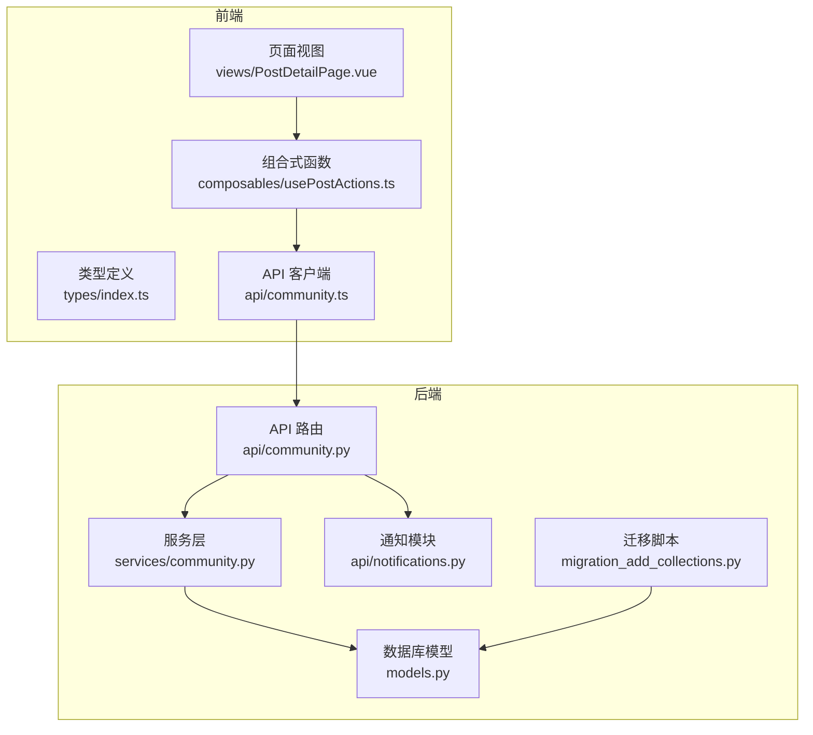
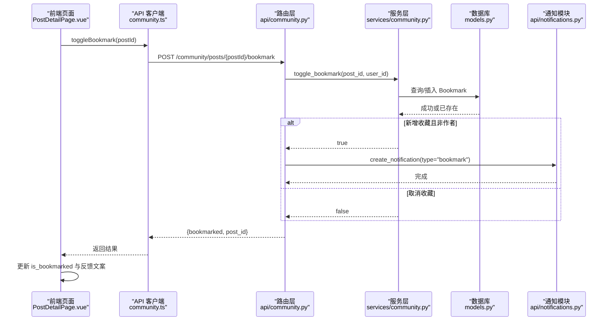
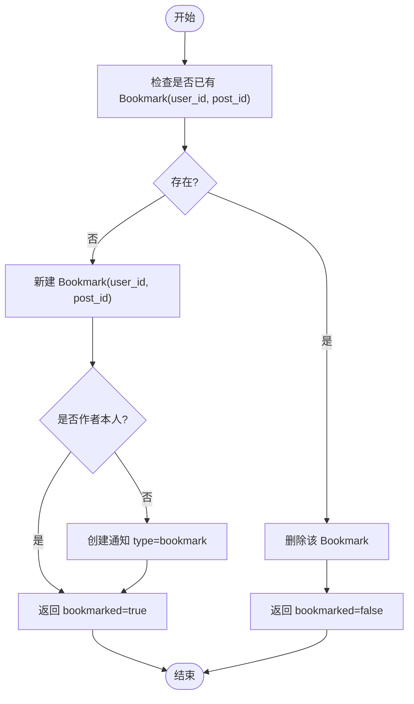
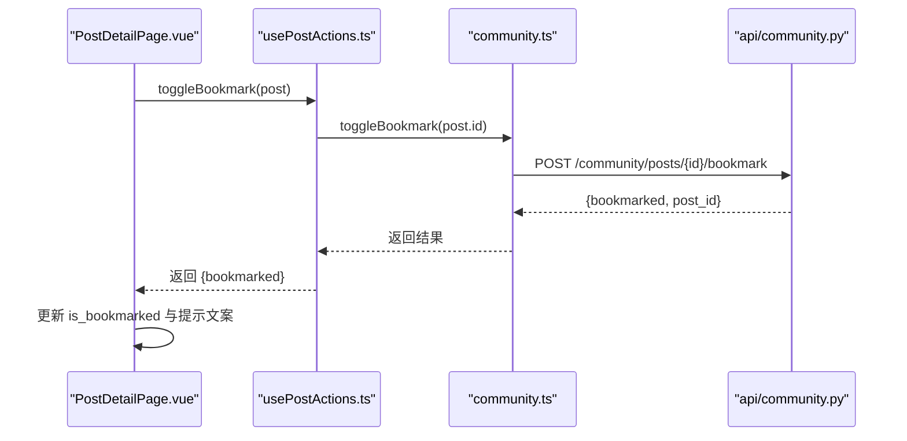
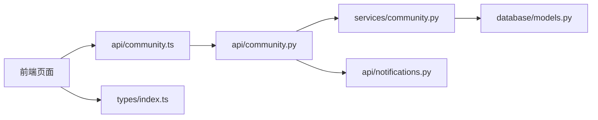

# 书签系统

<cite>
**本文引用的文件**
- [web/backend/database/models.py](file://web/backend/database/models.py)
- [web/backend/services/community.py](file://web/backend/services/community.py)
- [web/backend/api/community.py](file://web/backend/api/community.py)
- [scripts/migration_add_collections.py](file://scripts/migration_add_collections.py)
- [web/app/src/api/community.ts](file://web/app/src/api/community.ts)
- [web/app/src/types/index.ts](file://web/app/src/types/index.ts)
- [web/app/src/composables/usePostActions.ts](file://web/app/src/composables/usePostActions.ts)
- [web/app/src/views/PostDetailPage.vue](file://web/app/src/views/PostDetailPage.vue)
- [web/backend/api/notifications.py](file://web/backend/api/notifications.py)
</cite>

## 目录
1. [简介](#简介)
2. [项目结构](#项目结构)
3. [核心组件](#核心组件)
4. [架构总览](#架构总览)
5. [详细组件分析](#详细组件分析)
6. [依赖关系分析](#依赖关系分析)
7. [性能考虑](#性能考虑)
8. [故障排查指南](#故障排查指南)
9. [结论](#结论)
10. [附录](#附录)

## 简介
本技术文档围绕“书签系统”展开，系统性说明书签的数据模型、与内容的关联关系、CRUD 操作、状态管理、同步机制，以及分类管理（收藏夹）、标签系统与搜索能力。同时给出完整的书签 API 规范，并展示前端在帖子详情页的交互设计，包括收藏切换、批量管理与智能推荐联动等。

## 项目结构
书签功能横跨后端数据模型、服务层、API 路由、迁移脚本，以及前端的类型定义、API 客户端、组合式函数与页面视图。整体组织如下：
- 数据模型：Bookmark、Collection、CollectionItem、UserInteractionLog 等
- 服务层：CommunityService 中的书签切换、查询与统计方法
- API 层：FastAPI 路由暴露 toggle_bookmark 与 list_bookmarks
- 迁移脚本：创建 bookmarks 表及索引
- 前端：类型定义、API 调用封装、组合式函数与页面交互



图表来源
- [web/backend/database/models.py:486-560](file://web/backend/database/models.py#L486-L560)
- [web/backend/services/community.py:737-771](file://web/backend/services/community.py#L737-L771)
- [web/backend/api/community.py:1107-1147](file://web/backend/api/community.py#L1107-L1147)
- [web/backend/api/notifications.py:46-56](file://web/backend/api/notifications.py#L46-L56)
- [scripts/migration_add_collections.py:75-109](file://scripts/migration_add_collections.py#L75-L109)
- [web/app/src/types/index.ts:368-371](file://web/app/src/types/index.ts#L368-L371)
- [web/app/src/api/community.ts:107-115](file://web/app/src/api/community.ts#L107-L115)
- [web/app/src/composables/usePostActions.ts:25-36](file://web/app/src/composables/usePostActions.ts#L25-L36)
- [web/app/src/views/PostDetailPage.vue:195-205](file://web/app/src/views/PostDetailPage.vue#L195-L205)

章节来源
- [web/backend/database/models.py:486-560](file://web/backend/database/models.py#L486-L560)
- [web/backend/services/community.py:737-771](file://web/backend/services/community.py#L737-L771)
- [web/backend/api/community.py:1107-1147](file://web/backend/api/community.py#L1107-L1147)
- [scripts/migration_add_collections.py:75-109](file://scripts/migration_add_collections.py#L75-L109)
- [web/app/src/types/index.ts:368-371](file://web/app/src/types/index.ts#L368-L371)
- [web/app/src/api/community.ts:107-115](file://web/app/src/api/community.ts#L107-L115)
- [web/app/src/composables/usePostActions.ts:25-36](file://web/app/src/composables/usePostActions.ts#L25-L36)
- [web/app/src/views/PostDetailPage.vue:195-205](file://web/app/src/views/PostDetailPage.vue#L195-L205)

## 核心组件
- Bookmark 模型：用户快速收藏的核心实体，包含用户与帖子的唯一约束，记录创建时间，便于排序与分页。
- Collection / CollectionItem：收藏夹（个人知识库文件夹）与条目，实现更丰富的分类管理能力。
- CommunityService：提供书签切换、状态查询、用户书签列表获取等业务逻辑。
- API 路由：暴露 POST /posts/{post_id}/bookmark 与 GET /bookmarks，分别用于切换收藏与列出用户书签。
- 前端类型与客户端：BookmarkResponse、toggleBookmark、getBookmarks 等接口封装。
- 组合式函数 usePostActions：统一处理点赞与收藏的前端交互逻辑。
- 页面视图 PostDetailPage：集成收藏按钮与反馈文案，驱动收藏状态更新。

章节来源
- [web/backend/database/models.py:546-560](file://web/backend/database/models.py#L546-L560)
- [web/backend/database/models.py:486-526](file://web/backend/database/models.py#L486-L526)
- [web/backend/services/community.py:737-771](file://web/backend/services/community.py#L737-L771)
- [web/backend/api/community.py:1107-1147](file://web/backend/api/community.py#L1107-L1147)
- [web/app/src/types/index.ts:368-371](file://web/app/src/types/index.ts#L368-L371)
- [web/app/src/api/community.ts:107-115](file://web/app/src/api/community.ts#L107-L115)
- [web/app/src/composables/usePostActions.ts:25-36](file://web/app/src/composables/usePostActions.ts#L25-L36)
- [web/app/src/views/PostDetailPage.vue:195-205](file://web/app/src/views/PostDetailPage.vue#L195-L205)

## 架构总览
书签系统的端到端流程：
- 前端点击收藏按钮，调用 communityApi.toggleBookmark。
- 后端路由接收请求，限流后进入服务层切换书签状态。
- 若新增收藏且非作者本人，触发通知模块为作者发送“收藏了你的帖子”通知。
- 返回 bookmarked 状态给前端，前端即时更新 UI。



图表来源
- [web/app/src/views/PostDetailPage.vue:195-205](file://web/app/src/views/PostDetailPage.vue#L195-L205)
- [web/app/src/api/community.ts:107-115](file://web/app/src/api/community.ts#L107-L115)
- [web/backend/api/community.py:1110-1133](file://web/backend/api/community.py#L1110-L1133)
- [web/backend/services/community.py:739-750](file://web/backend/services/community.py#L739-L750)
- [web/backend/database/models.py:546-560](file://web/backend/database/models.py#L546-L560)
- [web/backend/api/notifications.py:46-56](file://web/backend/api/notifications.py#L46-L56)

## 详细组件分析

### 数据模型与关系
- Bookmark：用户与帖子的多对一关系，通过唯一约束保证同一用户对同一帖子仅有一个书签；created_at 用于排序。
- Collection / CollectionItem：实现更灵活的收藏夹分类，支持排序与备注，集合与帖子之间为多对多关系。
- UserInteractionLog：记录用户行为（如 click/read_end/like/bookmark/comment/share/skip），作为推荐算法数据源。

```mermaid
classDiagram
class Bookmark {
+int id
+int user_id
+int post_id
+datetime created_at
+unique(user_id, post_id)
}
class Collection {
+int id
+int user_id
+string name
+string description
+string icon
+bool is_public
+string share_slug
+int sort_order
+datetime created_at
+datetime updated_at
}
class CollectionItem {
+int id
+int collection_id
+int post_id
+int sort_order
+string note
+datetime created_at
+unique(collection_id, post_id)
}
class UserInteractionLog {
+int id
+int user_id
+int post_id
+string action_type
+datetime created_at
}
Bookmark --> "User" : "user_id FK"
Bookmark --> "Post" : "post_id FK"
CollectionItem --> "Collection" : "collection_id FK"
CollectionItem --> "Post" : "post_id FK"
UserInteractionLog --> "User" : "user_id FK"
UserInteractionLog --> "Post" : "post_id FK"
```

图表来源
- [web/backend/database/models.py:546-560](file://web/backend/database/models.py#L546-L560)
- [web/backend/database/models.py:486-526](file://web/backend/database/models.py#L486-L526)
- [web/backend/database/models.py:562-579](file://web/backend/database/models.py#L562-L579)

章节来源
- [web/backend/database/models.py:546-560](file://web/backend/database/models.py#L546-L560)
- [web/backend/database/models.py:486-526](file://web/backend/database/models.py#L486-L526)
- [web/backend/database/models.py:562-579](file://web/backend/database/models.py#L562-L579)

### 书签 CRUD 与状态管理
- 切换收藏（Toggle）：POST /community/posts/{post_id}/bookmark
  - 行为：若已存在则删除（取消收藏），否则新增（收藏）。
  - 通知：当新增收藏且非作者本人时，向作者发送“收藏了你的帖子”通知。
  - 响应：{ bookmarked: boolean, post_id: number }
- 列出用户书签：GET /community/bookmarks
  - 参数：limit（默认 20）、offset（默认 0）
  - 响应：PostListResponse（total, items）
- 状态判断：is_bookmarked 在服务层根据 Bookmark 是否存在返回布尔值。



图表来源
- [web/backend/services/community.py:739-750](file://web/backend/services/community.py#L739-L750)
- [web/backend/api/community.py:1110-1133](file://web/backend/api/community.py#L1110-L1133)
- [web/backend/api/notifications.py:46-56](file://web/backend/api/notifications.py#L46-L56)

章节来源
- [web/backend/api/community.py:1110-1147](file://web/backend/api/community.py#L1110-L1147)
- [web/backend/services/community.py:739-771](file://web/backend/services/community.py#L739-L771)
- [web/backend/api/notifications.py:46-56](file://web/backend/api/notifications.py#L46-L56)

### 分类管理（收藏夹）
- 收藏夹（Collection）：用户私有或公开的知识库文件夹，支持图标、描述、排序与分享链接。
- 收藏夹条目（CollectionItem）：将帖子加入收藏夹，支持排序与备注，唯一约束避免重复添加。
- 相关 API：创建、获取、更新、删除收藏夹；向集合添加/移除条目；分页获取集合内条目。

章节来源
- [web/backend/database/models.py:486-526](file://web/backend/database/models.py#L486-L526)
- [web/app/src/api/community.ts:180-221](file://web/app/src/api/community.ts#L180-L221)

### 标签系统与搜索
- 标签（Tag）与帖子标签（PostTag）：支持最多 5 个标签，自动去重与计数。
- 热门标签：按 usage_count 降序返回。
- 搜索能力：可通过标签名称进行过滤（前端示例中通过 URL 参数 tag=... 跳转至社区页筛选）。

章节来源
- [web/backend/services/community.py:828-850](file://web/backend/services/community.py#L828-L850)
- [web/app/src/api/community.ts:159-172](file://web/app/src/api/community.ts#L159-L172)
- [web/app/src/views/PostDetailPage.vue:318-327](file://web/app/src/views/PostDetailPage.vue#L318-L327)

### 同步机制与推荐联动
- 用户交互日志（UserInteractionLog）：记录 click/read_end/like/bookmark/comment/share/skip 等行为，用于推荐算法。
- 推荐联动：书签行为可作为推荐信号，结合关注、同城等策略生成个性化 feed。

章节来源
- [web/backend/database/models.py:562-579](file://web/backend/database/models.py#L562-L579)
- [hermes_plan/2026-04-25-001-feat-community-tabs-follow-local-plan.md:226-267](file://hermes_plan/2026-04-25-001-feat-community-tabs-follow-local-plan.md#L226-L267)

### 前端交互设计
- 组合式函数 usePostActions：统一处理登录态校验与收藏切换，返回 { bookmarked } 状态。
- 页面视图 PostDetailPage：收藏按钮点击后调用 communityApi.toggleBookmark，更新 is_bookmarked 并显示“已收藏/已取消收藏”反馈。
- 类型定义 types/index.ts：BookmarkResponse 明确返回字段。



图表来源
- [web/app/src/composables/usePostActions.ts:25-36](file://web/app/src/composables/usePostActions.ts#L25-L36)
- [web/app/src/api/community.ts:107-115](file://web/app/src/api/community.ts#L107-L115)
- [web/backend/api/community.py:1110-1133](file://web/backend/api/community.py#L1110-L1133)
- [web/app/src/views/PostDetailPage.vue:195-205](file://web/app/src/views/PostDetailPage.vue#L195-L205)
- [web/app/src/types/index.ts:368-371](file://web/app/src/types/index.ts#L368-L371)

章节来源
- [web/app/src/composables/usePostActions.ts:25-36](file://web/app/src/composables/usePostActions.ts#L25-L36)
- [web/app/src/api/community.ts:107-115](file://web/app/src/api/community.ts#L107-L115)
- [web/backend/api/community.py:1110-1133](file://web/backend/api/community.py#L1110-L1133)
- [web/app/src/views/PostDetailPage.vue:195-205](file://web/app/src/views/PostDetailPage.vue#L195-L205)
- [web/app/src/types/index.ts:368-371](file://web/app/src/types/index.ts#L368-L371)

## 依赖关系分析
- 路由层依赖服务层：API 路由通过 CommunityService 执行业务逻辑。
- 服务层依赖数据模型：使用 SQLAlchemy ORM 操作 Bookmark、Collection、CollectionItem 等。
- 通知模块依赖路由层：在新增收藏时由路由层调用通知创建。
- 前端依赖类型与 API 客户端：类型定义确保前后端数据结构一致，客户端封装 HTTP 调用。



图表来源
- [web/backend/api/community.py:1110-1147](file://web/backend/api/community.py#L1110-L1147)
- [web/backend/services/community.py:737-771](file://web/backend/services/community.py#L737-L771)
- [web/backend/database/models.py:546-560](file://web/backend/database/models.py#L546-L560)
- [web/backend/api/notifications.py:46-56](file://web/backend/api/notifications.py#L46-L56)
- [web/app/src/api/community.ts:107-115](file://web/app/src/api/community.ts#L107-L115)
- [web/app/src/types/index.ts:368-371](file://web/app/src/types/index.ts#L368-L371)

章节来源
- [web/backend/api/community.py:1110-1147](file://web/backend/api/community.py#L1110-L1147)
- [web/backend/services/community.py:737-771](file://web/backend/services/community.py#L737-L771)
- [web/backend/database/models.py:546-560](file://web/backend/database/models.py#L546-L560)
- [web/backend/api/notifications.py:46-56](file://web/backend/api/notifications.py#L46-L56)
- [web/app/src/api/community.ts:107-115](file://web/app/src/api/community.ts#L107-L115)
- [web/app/src/types/index.ts:368-371](file://web/app/src/types/index.ts#L368-L371)

## 性能考虑
- 索引优化：bookmarks 表对用户 ID 与帖子 ID 建立索引，提升查询与写入效率。
- 分页与限制：list_bookmarks 支持 limit/offset，避免一次性加载大量数据。
- 事务与提交：服务层在新增或删除 Bookmark 后立即提交，保证一致性。
- 通知异步化：通知创建失败不影响主流程，采用警告日志降级。

章节来源
- [scripts/migration_add_collections.py:91-97](file://scripts/migration_add_collections.py#L91-L97)
- [web/backend/api/community.py:1136-1147](file://web/backend/api/community.py#L1136-L1147)
- [web/backend/services/community.py:739-750](file://web/backend/services/community.py#L739-L750)
- [web/backend/api/community.py:1131-1133](file://web/backend/api/community.py#L1131-L1133)

## 故障排查指南
- 收藏切换无效：检查路由限流与服务层事务提交；确认用户身份与权限。
- 通知未送达：查看通知创建异常日志；确认作者非本人条件。
- 书签列表为空：确认用户确实有书签记录；检查分页参数是否正确。
- 前端状态不同步：核对 is_bookmarked 更新逻辑与反馈文案设置。

章节来源
- [web/backend/api/community.py:1114-1133](file://web/backend/api/community.py#L1114-L1133)
- [web/backend/services/community.py:739-750](file://web/backend/services/community.py#L739-L750)
- [web/app/src/views/PostDetailPage.vue:195-205](file://web/app/src/views/PostDetailPage.vue#L195-L205)

## 结论
书签系统以简洁的 Bookmark 模型为核心，配合收藏夹分类、标签系统与用户交互日志，形成完整的内容收藏与管理闭环。前后端通过清晰的 API 契约与类型定义保持一致性，并通过通知与推荐联动增强用户体验。建议在后续迭代中扩展批量操作、导入导出与智能推荐能力，进一步提升书签管理的效率与价值。

## 附录

### 书签 API 规范
- 切换收藏
  - 方法：POST
  - 路径：/community/posts/{post_id}/bookmark
  - 认证：需要当前用户
  - 请求体：无
  - 响应：{ bookmarked: boolean, post_id: number }
- 列出用户书签
  - 方法：GET
  - 路径：/community/bookmarks
  - 认证：需要当前用户
  - 查询参数：limit（默认 20）、offset（默认 0）
  - 响应：{ total: number, items: Post[] }

章节来源
- [web/backend/api/community.py:1110-1147](file://web/backend/api/community.py#L1110-L1147)
- [web/app/src/api/community.ts:107-115](file://web/app/src/api/community.ts#L107-L115)
- [web/app/src/types/index.ts:368-371](file://web/app/src/types/index.ts#L368-L371)