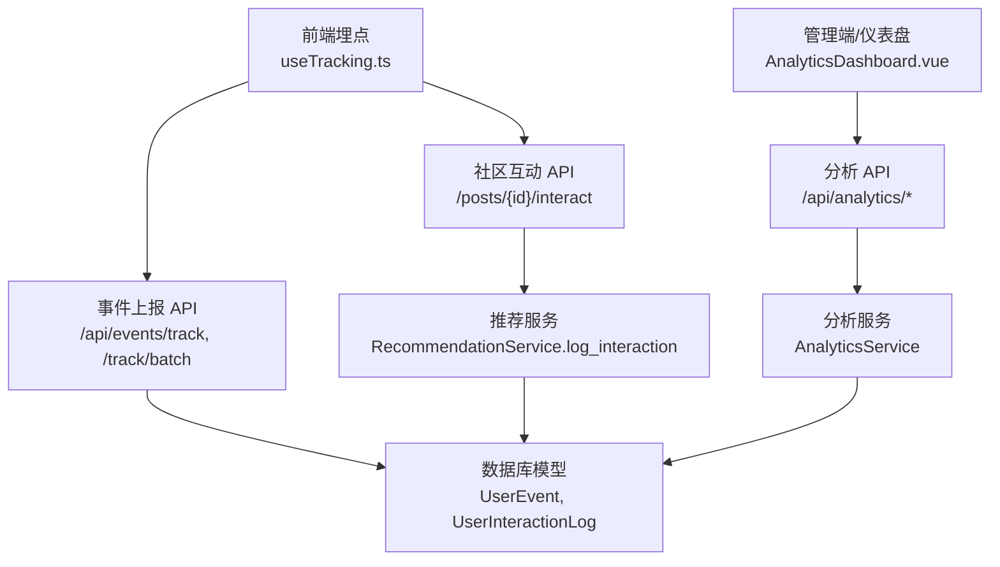
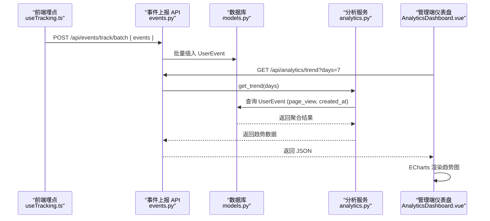
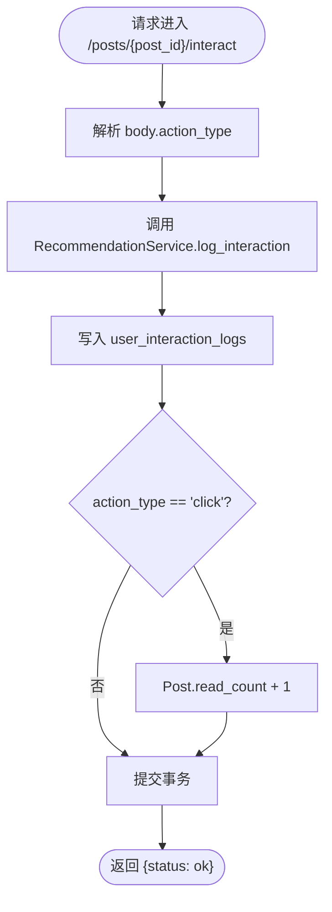
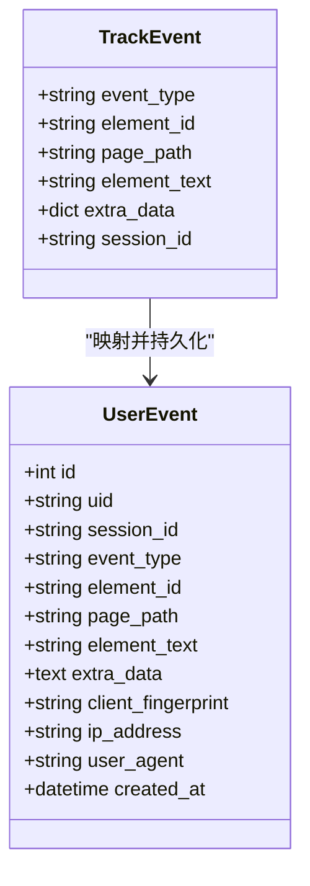
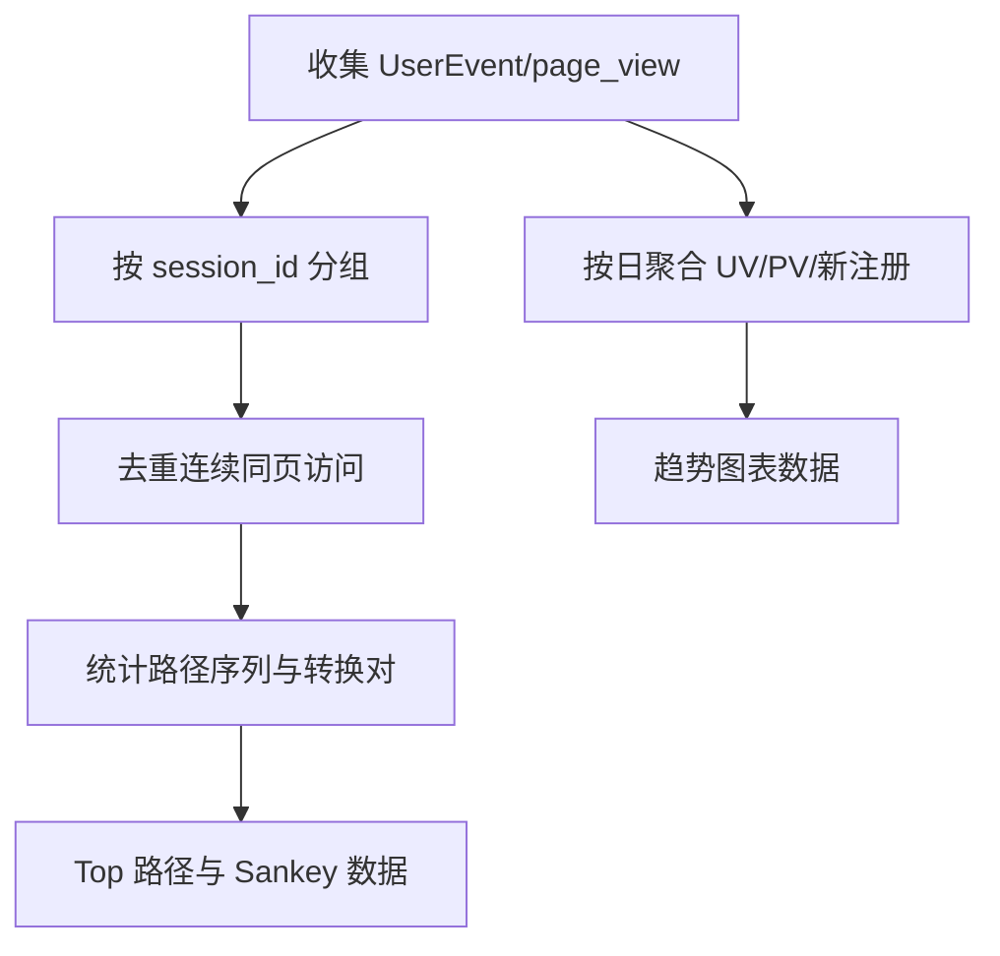
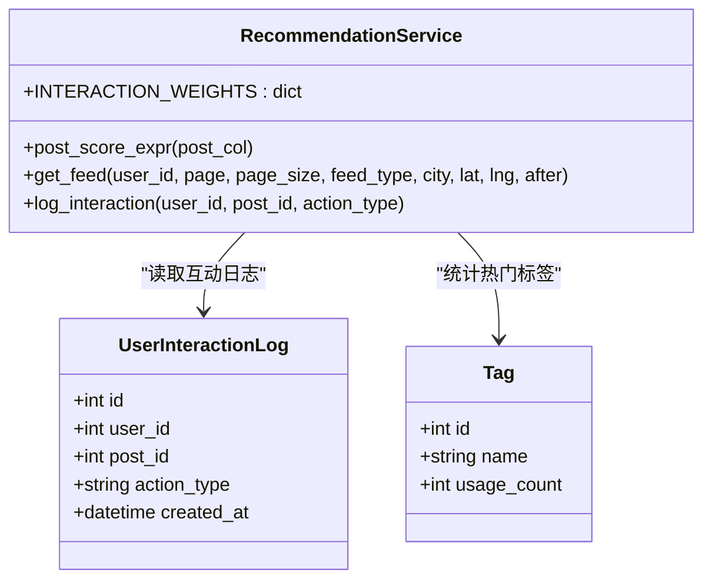
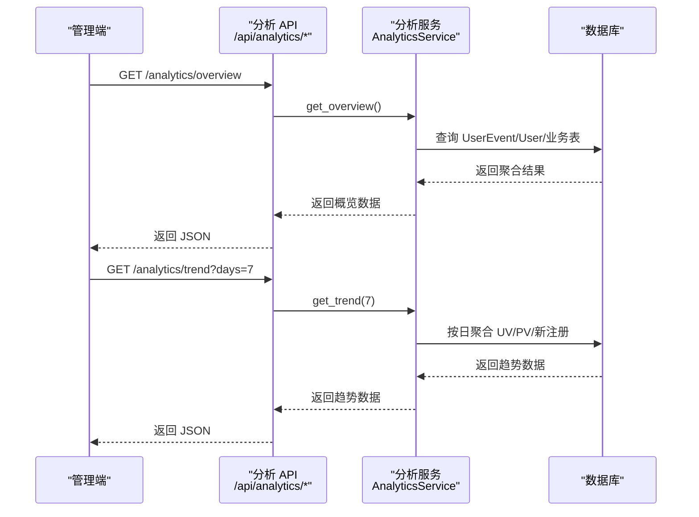
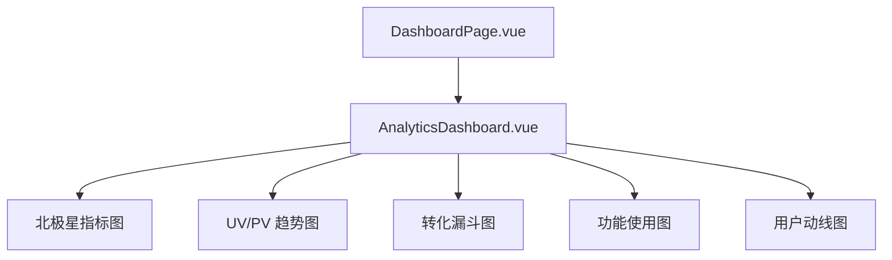
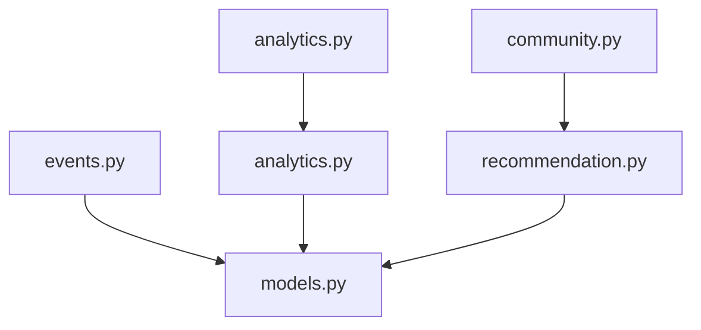

# 互动行为分析

<cite>
**本文引用的文件**   
- [web/backend/api/events.py](file://web/backend/api/events.py)
- [web/backend/database/models.py](file://web/backend/database/models.py)
- [web/backend/services/analytics.py](file://web/backend/services/analytics.py)
- [web/backend/api/analytics.py](file://web/backend/api/analytics.py)
- [web/app/src/composables/useTracking.ts](file://web/app/src/composables/useTracking.ts)
- [web/app/src/components/analytics/AnalyticsDashboard.vue](file://web/app/src/components/analytics/AnalyticsDashboard.vue)
- [web/app/src/views/DashboardPage.vue](file://web/app/src/views/DashboardPage.vue)
- [web/backend/services/recommendation.py](file://web/backend/services/recommendation.py)
- [web/backend/api/community.py](file://web/backend/api/community.py)
- [tests/backend/api/test_events.py](file://tests/backend/api/test_events.py)
</cite>

## 目录
1. [简介](#简介)
2. [项目结构](#项目结构)
3. [核心组件](#核心组件)
4. [架构总览](#架构总览)
5. [详细组件分析](#详细组件分析)
6. [依赖关系分析](#依赖关系分析)
7. [性能考量](#性能考量)
8. [故障排查指南](#故障排查指南)
9. [结论](#结论)
10. [附录：API 规范与数据模型](#附录api-规范与数据模型)

## 简介
本技术文档围绕“互动行为分析”展开，系统性说明用户行为事件的采集、上报、存储与分析流程；重点解析 log_interaction 接口的实现原理（事件记录、分类、存储），并给出互动数据分析维度（点击率、停留时间、互动频率等指标的计算方法）。同时，文档阐述个性化推荐算法的数据基础（基于用户行为的兴趣画像构建），并提供完整的互动分析 API 接口规范（事件上报、统计分析、报表生成）以及前端可视化界面（趋势图表、转化漏斗、功能使用统计、用户动线等）。

## 项目结构
本项目在前后端分离的架构下，前端负责埋点与可视化展示，后端提供事件上报与分析聚合能力。关键路径如下：
- 前端埋点：useTracking.ts 统一封装事件采集与批量上报
- 事件上报 API：events.py 暴露 /track 与 /track/batch
- 数据存储：models.py 定义 UserEvent、UserInteractionLog 等表结构
- 分析服务：analytics.py 提供 UV/PV、注册趋势、用户动线、功能使用等聚合查询
- 分析 API：analytics.py 路由将请求转发至 AnalyticsService
- 可视化：AnalyticsDashboard.vue 通过 ECharts 渲染趋势、漏斗、功能使用等图表
- 推荐系统：recommendation.py 基于用户交互日志进行内容排序与推荐

**图示来源** 
- [web/app/src/composables/useTracking.ts](file://web/app/src/composables/useTracking.ts)
- [web/backend/api/events.py](file://web/backend/api/events.py)
- [web/backend/database/models.py](file://web/backend/database/models.py)
- [web/backend/api/community.py](file://web/backend/api/community.py)
- [web/backend/services/recommendation.py](file://web/backend/services/recommendation.py)
- [web/backend/api/analytics.py](file://web/backend/api/analytics.py)
- [web/backend/services/analytics.py](file://web/backend/services/analytics.py)
- [web/app/src/components/analytics/AnalyticsDashboard.vue](file://web/app/src/components/analytics/AnalyticsDashboard.vue)

**章节来源**
- [web/app/src/composables/useTracking.ts:1-110](file://web/app/src/composables/useTracking.ts#L1-L110)
- [web/backend/api/events.py:1-111](file://web/backend/api/events.py#L1-L111)
- [web/backend/database/models.py:203-225](file://web/backend/database/models.py#L203-L225)
- [web/backend/api/community.py:201-216](file://web/backend/api/community.py#L201-L216)
- [web/backend/services/recommendation.py:42-94](file://web/backend/services/recommendation.py#L42-L94)
- [web/backend/api/analytics.py:1-88](file://web/backend/api/analytics.py#L1-L88)
- [web/backend/services/analytics.py:1-667](file://web/backend/services/analytics.py#L1-L667)
- [web/app/src/components/analytics/AnalyticsDashboard.vue:1-374](file://web/app/src/components/analytics/AnalyticsDashboard.vue#L1-L374)

## 核心组件
- 事件采集与上报
  - 前端：useTracking.ts 提供 trackEvent、trackPageView、trackClick、trackInput 等方法，支持队列化与批量上报
  - 后端：events.py 提供 /track 与 /track/batch，接收事件并写入 user_events 表
- 互动行为记录
  - 社区互动：community.py 暴露 POST /posts/{post_id}/interact，调用 RecommendationService.log_interaction 写入 user_interaction_logs，并在 click 时更新帖子 read_count
- 数据分析与报表
  - 分析服务：analytics.py 提供 overview、trend、funnel、feature_usage、registration_trend、user_journeys、page_views 等聚合查询
  - 分析 API：analytics.py 路由对外暴露上述能力，受管理员鉴权保护
- 可视化界面
  - 管理端 Dashboard：AnalyticsDashboard.vue 使用 ECharts 展示北极星指标、UV/PV 趋势、转化漏斗、功能使用、用户动线等

**章节来源**
- [web/app/src/composables/useTracking.ts:55-110](file://web/app/src/composables/useTracking.ts#L55-L110)
- [web/backend/api/events.py:40-111](file://web/backend/api/events.py#L40-L111)
- [web/backend/api/community.py:201-216](file://web/backend/api/community.py#L201-L216)
- [web/backend/services/recommendation.py:337-346](file://web/backend/services/recommendation.py#L337-L346)
- [web/backend/services/analytics.py:244-337](file://web/backend/services/analytics.py#L244-L337)
- [web/backend/api/analytics.py:14-88](file://web/backend/api/analytics.py#L14-L88)
- [web/app/src/components/analytics/AnalyticsDashboard.vue:100-374](file://web/app/src/components/analytics/AnalyticsDashboard.vue#L100-L374)

## 架构总览
整体采用“前端埋点 → 事件 API → 数据库 → 分析服务 → 分析 API → 前端可视化”的链路。关键设计要点：
- 事件采集：前端统一封装，支持 session_id、uid、页面路径、元素标识、额外数据等字段
- 事件存储：user_events 表具备多维度索引，便于按时间、类型、页面路径等范围查询
- 互动记录：user_interaction_logs 表用于推荐算法的数据源，包含 action_type 分类
- 分析聚合：AnalyticsService 对多表数据进行去重、过滤测试账号、计算 UV/PV、注册趋势、用户动线等
- 可视化：ECharts 渲染趋势、漏斗、功能使用、用户动线等图表，支持周期切换与响应式布局

**图示来源** 
- [web/app/src/composables/useTracking.ts:55-75](file://web/app/src/composables/useTracking.ts#L55-L75)
- [web/backend/api/events.py:70-111](file://web/backend/api/events.py#L70-L111)
- [web/backend/database/models.py:203-225](file://web/backend/database/models.py#L203-L225)
- [web/backend/services/analytics.py:297-337](file://web/backend/services/analytics.py#L297-L337)
- [web/backend/api/analytics.py:23-31](file://web/backend/api/analytics.py#L23-L31)
- [web/app/src/components/analytics/AnalyticsDashboard.vue:205-242](file://web/app/src/components/analytics/AnalyticsDashboard.vue#L205-L242)

## 详细组件分析

### log_interaction 接口实现原理
- 入口：POST /posts/{post_id}/interact（community.py）
- 处理逻辑：
  - 从请求体获取 action_type（默认 click）
  - 调用 RecommendationService.log_interaction(user_id, post_id, action_type)
  - 写入 user_interaction_logs 表，若 action_type 为 click，则同步增加 Post.read_count
- 数据模型：
  - UserInteractionLog：包含 user_id、post_id、action_type、created_at，并建立复合索引以优化查询
- 权重体系：
  - RecommendationService.INTERACTION_WEIGHTS 定义了不同动作的权重（click、read_end、like、bookmark、comment、share、skip），用于后续评分与排序

**图示来源** 
- [web/backend/api/community.py:201-216](file://web/backend/api/community.py#L201-L216)
- [web/backend/services/recommendation.py:337-346](file://web/backend/services/recommendation.py#L337-L346)
- [web/backend/database/models.py:562-578](file://web/backend/database/models.py#L562-L578)

**章节来源**
- [web/backend/api/community.py:201-216](file://web/backend/api/community.py#L201-L216)
- [web/backend/services/recommendation.py:337-346](file://web/backend/services/recommendation.py#L337-L346)
- [web/backend/database/models.py:562-578](file://web/backend/database/models.py#L562-L578)

### 用户行为事件记录、分类与存储
- 前端埋点：
  - useTracking.ts 提供 trackEvent、trackPageView、trackClick、trackInput
  - 事件包含 event_type、element_id、page_path、element_text、extra_data、session_id
  - 支持队列化与定时批量上报（MAX_QUEUE_SIZE=20，FLUSH_INTERVAL=3000ms）
- 后端接收：
  - events.py 提供 /track 与 /track/batch
  - 批量接口限制单次最多 50 条，防止写放大
  - 自动附加 uid、client_fingerprint、ip_address、user_agent 等上下文信息
- 数据存储：
  - UserEvent 表具备多维索引（created_at、event_type、page_path、uid、session_id、client_fingerprint）
  - 支持按时间范围、事件类型、页面路径等高效查询

**图示来源** 
- [web/app/src/composables/useTracking.ts:20-75](file://web/app/src/composables/useTracking.ts#L20-L75)
- [web/backend/api/events.py:27-67](file://web/backend/api/events.py#L27-L67)
- [web/backend/database/models.py:203-225](file://web/backend/database/models.py#L203-L225)

**章节来源**
- [web/app/src/composables/useTracking.ts:55-110](file://web/app/src/composables/useTracking.ts#L55-L110)
- [web/backend/api/events.py:40-111](file://web/backend/api/events.py#L40-L111)
- [web/backend/database/models.py:203-225](file://web/backend/database/models.py#L203-L225)

### 互动数据的分析维度与指标计算
- 概览指标：
  - total_users：注册用户数（去重 phone/email/uid）
  - today_uv：当日独立访客数（uid 或 client_fingerprint 去重）
  - today_pv：当日页面访问次数（event_type=page_view）
  - new_users_today：当日新增注册用户数
  - today_active_users：当日活跃用户数（综合 AI 问答、VASI 评估、体检报告上传、发帖、评论、点赞等行为）
- 趋势指标：
  - 按天统计 uv、pv、new_users，支持 7d/30d 切换
- 转化漏斗：
  - 访问 UV → 注册用户 → 登录 UV → 使用功能 UV，计算各阶段转化率
- 功能使用：
  - 统计 AI 问答、追踪评估、上传体检报告、发帖、评论、点赞、浏览百科等功能 UV/PV
- 用户动线：
  - 基于 page_view 事件构建会话序列，去重连续同页访问，统计 Top 路径与 Sankey 节点/边

**图示来源** 
- [web/backend/services/analytics.py:385-464](file://web/backend/services/analytics.py#L385-L464)
- [web/backend/services/analytics.py:297-337](file://web/backend/services/analytics.py#L297-L337)
- [web/backend/services/analytics.py:468-532](file://web/backend/services/analytics.py#L468-L532)
- [web/backend/services/analytics.py:536-642](file://web/backend/services/analytics.py#L536-L642)

**章节来源**
- [web/backend/services/analytics.py:244-337](file://web/backend/services/analytics.py#L244-L337)
- [web/backend/services/analytics.py:385-464](file://web/backend/services/analytics.py#L385-L464)
- [web/backend/services/analytics.py:468-532](file://web/backend/services/analytics.py#L468-L532)
- [web/backend/services/analytics.py:536-642](file://web/backend/services/analytics.py#L536-L642)

### 个性化推荐算法的数据基础与兴趣画像
- 数据源：
  - UserInteractionLog：记录用户对帖子的互动行为（click/read_end/like/bookmark/comment/share/skip）
  - PostTag：标签计数，辅助兴趣聚类
- 权重体系：
  - INTERACTION_WEIGHTS 定义不同动作的权重，用于评分公式
- 评分公式：
  - post_score_expr = like_count * 2.0 + comment_count * 2.5 + read_count * 1.0
- 兴趣画像构建：
  - 根据用户最近互动过的帖子，统计标签出现频次，得到热门标签集合，作为兴趣画像基础
- 推荐策略：
  - 支持热门、关注、同城、个性化推荐等多种 feed 类型

**图示来源** 
- [web/backend/services/recommendation.py:42-94](file://web/backend/services/recommendation.py#L42-L94)
- [web/backend/services/recommendation.py:323-346](file://web/backend/services/recommendation.py#L323-L346)
- [web/backend/database/models.py:562-578](file://web/backend/database/models.py#L562-L578)

**章节来源**
- [web/backend/services/recommendation.py:42-94](file://web/backend/services/recommendation.py#L42-L94)
- [web/backend/services/recommendation.py:323-346](file://web/backend/services/recommendation.py#L323-L346)
- [web/backend/database/models.py:562-578](file://web/backend/database/models.py#L562-L578)

### 互动分析的 API 接口规范
- 事件上报
  - POST /api/events/track：单条事件上报
  - POST /api/events/track/batch：批量事件上报（最大 50 条）
  - 请求体字段：event_type、element_id、page_path、element_text、extra_data、session_id
  - 响应：{status: ok} 或 {status: ok, count: N}
- 统计分析
  - GET /api/analytics/overview：概览指标（total_users、today_uv、today_pv、new_users_today、today_active_users）
  - GET /api/analytics/trend?days=N：趋势数据（uv、pv、new_users）
  - GET /api/analytics/funnel?days=N：转化漏斗步骤
  - GET /api/analytics/feature-usage?days=N：功能使用统计
  - GET /api/analytics/registration-trend?days=N：注册趋势（累计新用户）
  - GET /api/analytics/user-journeys?days=N&limit=M：用户动线（nodes、links、top_paths、total_sessions）
  - GET /api/analytics/page-views?days=N：页面访问排行（path、uv、pv）
- 权限控制：
  - 所有分析接口需管理员鉴权（get_admin_user）

**图示来源** 
- [web/backend/api/analytics.py:14-88](file://web/backend/api/analytics.py#L14-L88)
- [web/backend/services/analytics.py:244-337](file://web/backend/services/analytics.py#L244-L337)

**章节来源**
- [web/backend/api/events.py:40-111](file://web/backend/api/events.py#L40-L111)
- [web/backend/api/analytics.py:14-88](file://web/backend/api/analytics.py#L14-L88)

### 前端可视化界面
- 管理端仪表盘：
  - AnalyticsDashboard.vue 使用 ECharts 渲染：
    - 北极星指标（累计注册用户数）
    - UV/PV 趋势（7d/30d 切换）
    - 转化漏斗（访问→注册→登录→使用功能）
    - 功能使用统计（横向柱状图）
    - 用户动线 Top10（路径序列与次数）
  - 支持响应式布局与深色主题适配
- 访问控制：
  - DashboardPage.vue 仅允许管理员访问，非管理员重定向到首页

**图示来源** 
- [web/app/src/components/analytics/AnalyticsDashboard.vue:100-374](file://web/app/src/components/analytics/AnalyticsDashboard.vue#L100-L374)
- [web/app/src/views/DashboardPage.vue:1-45](file://web/app/src/views/DashboardPage.vue#L1-L45)

**章节来源**
- [web/app/src/components/analytics/AnalyticsDashboard.vue:100-374](file://web/app/src/components/analytics/AnalyticsDashboard.vue#L100-L374)
- [web/app/src/views/DashboardPage.vue:1-45](file://web/app/src/views/DashboardPage.vue#L1-L45)

## 依赖关系分析
- 模块耦合：
  - events.py 依赖 models.py（UserEvent）、auth（可选用户识别）、middleware（限流）
  - analytics.py 依赖 models.py（UserEvent、User、Post、Comment、Like、Conversation、Message、VASIAssessment、MedicalReport）
  - recommendation.py 依赖 models.py（UserInteractionLog、Post、Tag）
  - community.py 依赖 recommendation.py 与 models.py
- 外部依赖：
  - FastAPI、SQLAlchemy、ECharts（前端）
- 潜在循环依赖：
  - 当前未发现循环依赖，服务层与 API 层解耦清晰

**图示来源** 
- [web/backend/api/events.py:1-111](file://web/backend/api/events.py#L1-L111)
- [web/backend/api/analytics.py:1-88](file://web/backend/api/analytics.py#L1-L88)
- [web/backend/services/analytics.py:1-667](file://web/backend/services/analytics.py#L1-L667)
- [web/backend/api/community.py:201-216](file://web/backend/api/community.py#L201-L216)
- [web/backend/services/recommendation.py:42-94](file://web/backend/services/recommendation.py#L42-L94)
- [web/backend/database/models.py:203-225](file://web/backend/database/models.py#L203-L225)

**章节来源**
- [web/backend/api/events.py:1-111](file://web/backend/api/events.py#L1-L111)
- [web/backend/api/analytics.py:1-88](file://web/backend/api/analytics.py#L1-L88)
- [web/backend/services/analytics.py:1-667](file://web/backend/services/analytics.py#L1-L667)
- [web/backend/api/community.py:201-216](file://web/backend/api/community.py#L201-L216)
- [web/backend/services/recommendation.py:42-94](file://web/backend/services/recommendation.py#L42-L94)
- [web/backend/database/models.py:203-225](file://web/backend/database/models.py#L203-L225)

## 性能考量
- 事件上报：
  - 前端批量上报（MAX_QUEUE_SIZE=20，FLUSH_INTERVAL=3000ms）降低网络开销
  - 后端批量接口限制单次 50 条，避免写放大
  - 数据库索引优化（created_at、event_type、page_path、uid、session_id、client_fingerprint）提升查询效率
- 分析聚合：
  - 使用 SQL 聚合函数与子查询减少应用层计算
  - 排除测试账号与管理员流量，确保指标准确性
- 可视化：
  - ECharts 按需渲染与响应式 resize，避免内存泄漏
  - 定时刷新（1 小时）平衡实时性与性能

[本节为通用指导，不直接分析具体文件]

## 故障排查指南
- 事件未上报：
  - 检查前端 useTracking.ts 队列与 flush 定时器是否触发
  - 确认后端 /api/events/track/batch 接口可访问且无速率限制拦截
- 分析数据缺失：
  - 检查 UserEvent 表是否有 page_view 事件与正确的 created_at 时间戳
  - 确认 AnalyticsService 的排除规则（测试账号、管理员、特定手机号）是否符合预期
- 互动记录异常：
  - 检查 community.py 的 /posts/{post_id}/interact 接口是否正确传递 action_type
  - 验证 RecommendationService.log_interaction 是否成功写入 user_interaction_logs 并更新 read_count

**章节来源**
- [web/app/src/composables/useTracking.ts:55-75](file://web/app/src/composables/useTracking.ts#L55-L75)
- [web/backend/api/events.py:70-111](file://web/backend/api/events.py#L70-L111)
- [web/backend/services/analytics.py:94-121](file://web/backend/services/analytics.py#L94-L121)
- [web/backend/api/community.py:201-216](file://web/backend/api/community.py#L201-L216)
- [web/backend/services/recommendation.py:337-346](file://web/backend/services/recommendation.py#L337-L346)

## 结论
本项目构建了完整的前端埋点、事件上报、数据存储与分析可视化的互动行为分析体系。log_interaction 接口实现了用户互动行为的记录与分类，为推荐算法提供了可靠的数据基础。分析服务覆盖 UV/PV、注册趋势、用户动线、功能使用等多维度指标，管理端仪表盘通过 ECharts 直观呈现。整体架构清晰、扩展性强，适合持续迭代与性能优化。

[本节为总结性内容，不直接分析具体文件]

## 附录：API 规范与数据模型

### 事件上报 API
- POST /api/events/track
  - 请求体：TrackEvent（event_type、element_id、page_path、element_text、extra_data、session_id）
  - 响应：{status: ok}
- POST /api/events/track/batch
  - 请求体：TrackBatch（events: list[TrackEvent]，最大 50 条）
  - 响应：{status: ok, count: N}

**章节来源**
- [web/backend/api/events.py:27-67](file://web/backend/api/events.py#L27-L67)
- [web/backend/api/events.py:70-111](file://web/backend/api/events.py#L70-L111)

### 分析 API
- GET /api/analytics/overview
  - 响应：{total_users, today_uv, today_pv, new_users_today, today_active_users}
- GET /api/analytics/trend?days=N
  - 响应：{days, items: [{date, uv, pv, new_users}]}
- GET /api/analytics/funnel?days=N
  - 响应：[{name, count, rate_from_prev}]
- GET /api/analytics/feature-usage?days=N
  - 响应：[{name, uv, pv}]
- GET /api/analytics/registration-trend?days=N
  - 响应：[{date, new_users, cumulative_users}]
- GET /api/analytics/user-journeys?days=N&limit=M
  - 响应：{nodes, links, top_paths, total_sessions}
- GET /api/analytics/page-views?days=N
  - 响应：[{page, uv, pv}]

**章节来源**
- [web/backend/api/analytics.py:14-88](file://web/backend/api/analytics.py#L14-L88)

### 数据模型
- UserEvent（user_events）
  - 字段：id、uid、session_id、event_type、element_id、page_path、element_text、extra_data、client_fingerprint、ip_address、user_agent、created_at
  - 索引：created_at、event_type、page_path、uid、session_id、client_fingerprint
- UserInteractionLog（user_interaction_logs）
  - 字段：id、user_id、post_id、action_type、created_at
  - 索引：user_id、post_id、action_type、created_at

**章节来源**
- [web/backend/database/models.py:203-225](file://web/backend/database/models.py#L203-L225)
- [web/backend/database/models.py:562-578](file://web/backend/database/models.py#L562-L578)

### 测试用例参考
- 事件上报与批量上报的单元测试验证了接口行为与数据持久化

**章节来源**
- [tests/backend/api/test_events.py:71-98](file://tests/backend/api/test_events.py#L71-L98)