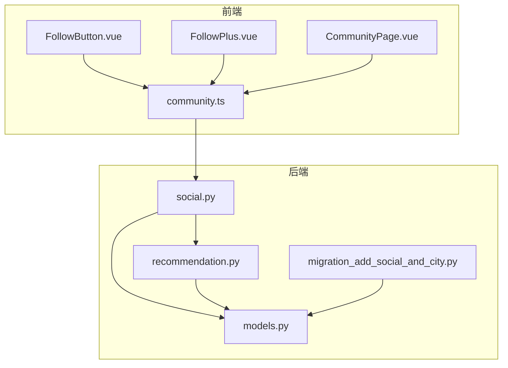
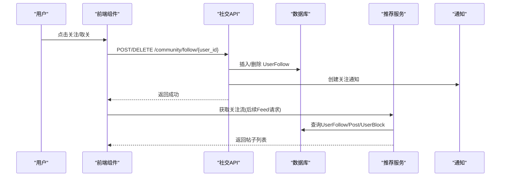
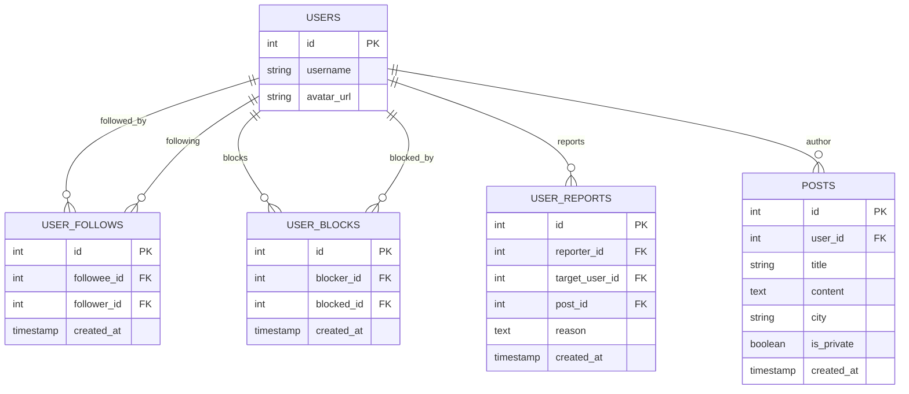
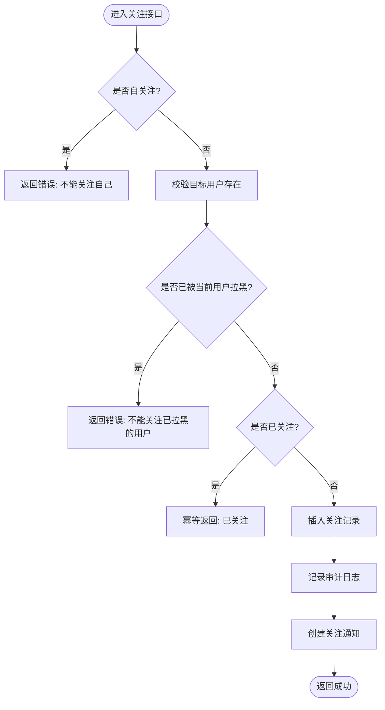
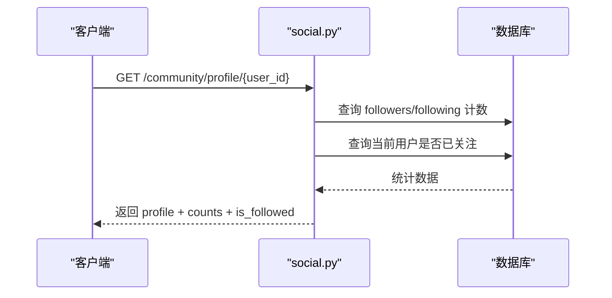
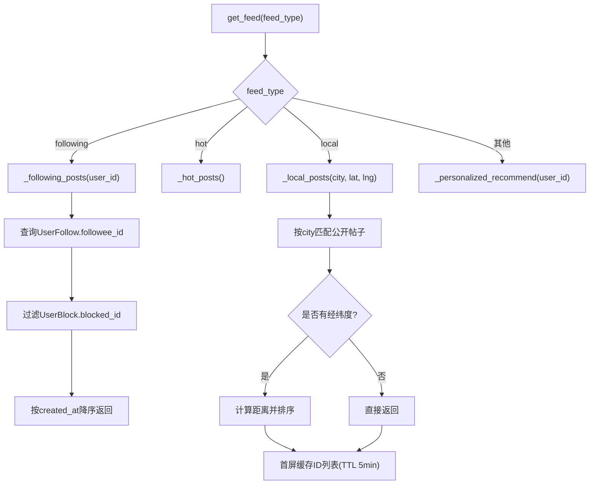
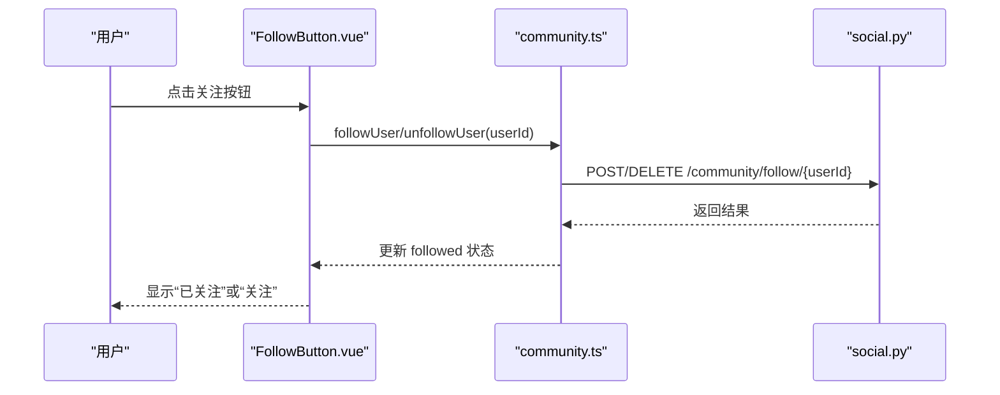
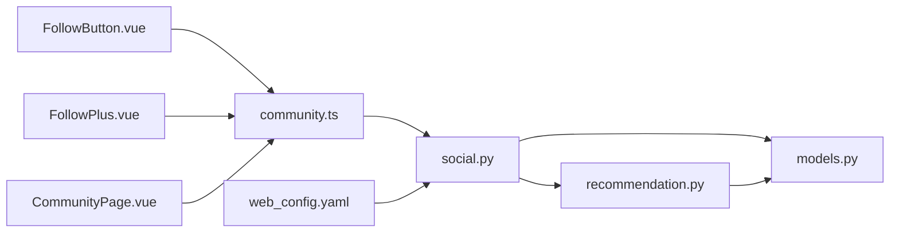

# 关注关系网络

<cite>
**本文引用的文件**
- [web/backend/api/social.py](file://web/backend/api/social.py)
- [web/backend/services/recommendation.py](file://web/backend/services/recommendation.py)
- [web/backend/database/models.py](file://web/backend/database/models.py)
- [web/backend/database/migration_add_social_and_city.py](file://web/backend/database/migration_add_social_and_city.py)
- [web/app/src/api/community.ts](file://web/app/src/api/community.ts)
- [web/app/src/components/community/FollowButton.vue](file://web/app/src/components/community/FollowButton.vue)
- [web/app/src/components/community/FollowPlus.vue](file://web/app/src/components/community/FollowPlus.vue)
- [web/app/src/views/CommunityPage.vue](file://web/app/src/views/CommunityPage.vue)
- [configs/web_config.yaml](file://configs/web_config.yaml)
</cite>

## 目录
1. [简介](#简介)
2. [项目结构](#项目结构)
3. [核心组件](#核心组件)
4. [架构总览](#架构总览)
5. [详细组件分析](#详细组件分析)
6. [依赖分析](#依赖分析)
7. [性能考虑](#性能考虑)
8. [故障排查指南](#故障排查指南)
9. [结论](#结论)
10. [附录：API 接口文档](#附录api-接口文档)

## 简介
本技术文档围绕“关注关系网络”展开，覆盖用户关注关系的建立与维护、粉丝统计与互相关注检测、数据库设计与查询优化、缓存策略、推荐算法（关注流、热门、同城）、以及前后端实现与界面交互。目标是帮助开发者快速理解并扩展关注功能，确保在高并发场景下的正确性与性能。

## 项目结构
关注功能涉及后端 API、数据模型、推荐服务、前端组件与页面路由等模块。整体组织如下：
- 后端 API：社交关系操作（关注/取关/拉黑/举报/公开资料）
- 数据模型：用户、帖子、关注、拉黑、举报、通知等 ORM 模型
- 推荐服务：关注流、热门推荐、同城推荐、个性化推荐
- 前端：关注按钮组件、社区页（Feed 切换）、API 客户端封装

**图示来源**
- [web/app/src/components/community/FollowButton.vue:1-56](file://web/app/src/components/community/FollowButton.vue#L1-L56)
- [web/app/src/components/community/FollowPlus.vue:1-47](file://web/app/src/components/community/FollowPlus.vue#L1-L47)
- [web/app/src/views/CommunityPage.vue:84-145](file://web/app/src/views/CommunityPage.vue#L84-L145)
- [web/app/src/api/community.ts:235-283](file://web/app/src/api/community.ts#L235-L283)
- [web/backend/api/social.py:29-155](file://web/backend/api/social.py#L29-L155)
- [web/backend/services/recommendation.py:77-229](file://web/backend/services/recommendation.py#L77-L229)
- [web/backend/database/models.py:786-846](file://web/backend/database/models.py#L786-L846)
- [web/backend/database/migration_add_social_and_city.py:28-80](file://web/backend/database/migration_add_social_and_city.py#L28-L80)

**章节来源**
- [web/backend/api/social.py:29-155](file://web/backend/api/social.py#L29-L155)
- [web/backend/services/recommendation.py:77-229](file://web/backend/services/recommendation.py#L77-L229)
- [web/backend/database/models.py:786-846](file://web/backend/database/models.py#L786-L846)
- [web/backend/database/migration_add_social_and_city.py:28-80](file://web/backend/database/migration_add_social_and_city.py#L28-L80)
- [web/app/src/api/community.ts:235-283](file://web/app/src/api/community.ts#L235-L283)
- [web/app/src/components/community/FollowButton.vue:1-56](file://web/app/src/components/community/FollowButton.vue#L1-L56)
- [web/app/src/components/community/FollowPlus.vue:1-47](file://web/app/src/components/community/FollowPlus.vue#L1-L47)
- [web/app/src/views/CommunityPage.vue:84-145](file://web/app/src/views/CommunityPage.vue#L84-L145)

## 核心组件
- 社交关系 API：提供关注、取关、拉黑、举报、公开资料与粉丝列表等能力，包含幂等性处理、审计日志与通知。
- 数据模型：UserFollow、UserBlock、UserReport、Post.city 等，使用唯一约束与索引保障一致性与查询效率。
- 推荐服务：支持 following（关注流）、hot（热门）、local（同城）、personalized（个性化）四种 feed 类型；同城带内存缓存与距离排序。
- 前端组件：FollowButton 与 FollowPlus 提供关注状态切换与 UI 反馈；CommunityPage 负责 Feed 切换与同城定位。

**章节来源**
- [web/backend/api/social.py:29-155](file://web/backend/api/social.py#L29-L155)
- [web/backend/database/models.py:786-846](file://web/backend/database/models.py#L786-L846)
- [web/backend/services/recommendation.py:77-229](file://web/backend/services/recommendation.py#L77-L229)
- [web/app/src/components/community/FollowButton.vue:1-56](file://web/app/src/components/community/FollowButton.vue#L1-L56)
- [web/app/src/components/community/FollowPlus.vue:1-47](file://web/app/src/components/community/FollowPlus.vue#L1-L47)
- [web/app/src/views/CommunityPage.vue:84-145](file://web/app/src/views/CommunityPage.vue#L84-L145)

## 架构总览
关注关系网络的数据流从前端点击关注按钮开始，经 API 层写入关注关系，触发通知与审计，并在推荐服务中用于构建关注流与过滤被拉黑的用户内容。同城推荐通过城市字段与可选经纬度进行排序与缓存。

**图示来源**
- [web/app/src/components/community/FollowButton.vue:23-41](file://web/app/src/components/community/FollowButton.vue#L23-L41)
- [web/backend/api/social.py:29-105](file://web/backend/api/social.py#L29-L105)
- [web/backend/services/recommendation.py:184-229](file://web/backend/services/recommendation.py#L184-L229)

## 详细组件分析

### 数据库设计
- 关注关系表 user_follows：包含 followee_id、follower_id、created_at，使用唯一约束防止重复关注，并建立索引加速查询。
- 拉黑关系表 user_blocks：blocker_id、blocked_id 唯一约束，避免重复拉黑。
- 举报记录表 user_reports：记录举报人与目标用户及原因，支持关联帖子。
- 帖子表 posts：新增 city 字段用于同城推荐，配合索引提升查询效率。

**图示来源**
- [web/backend/database/models.py:786-846](file://web/backend/database/models.py#L786-L846)
- [web/backend/database/migration_add_social_and_city.py:28-80](file://web/backend/database/migration_add_social_and_city.py#L28-L80)

**章节来源**
- [web/backend/database/models.py:786-846](file://web/backend/database/models.py#L786-L846)
- [web/backend/database/migration_add_social_and_city.py:28-80](file://web/backend/database/migration_add_social_and_city.py#L28-L80)

### 关注/取关流程与幂等性
- 关注：校验目标用户存在、未拉黑、非自关注；若已关注则幂等返回；否则插入关注记录，写审计日志并创建通知。
- 取关：查找关注记录，不存在则返回未关注；存在则删除并返回成功。
- 拉黑：自动解除双向关注关系，再写入拉黑记录。

**图示来源**
- [web/backend/api/social.py:29-85](file://web/backend/api/social.py#L29-L85)

**章节来源**
- [web/backend/api/social.py:29-105](file://web/backend/api/social.py#L29-L105)

### 粉丝统计与互相关注检测
- 粉丝统计：公开资料接口返回 follower_count、following_count，分别基于 user_follows 的 followee_id 与 follower_id 计数。
- 互相关注检测：通过查询是否存在两条反向关注记录判断互相关注；公开资料接口同时返回 is_followed 表示当前登录用户是否已关注目标用户。

**图示来源**
- [web/backend/api/social.py:270-304](file://web/backend/api/social.py#L270-L304)

**章节来源**
- [web/backend/api/social.py:270-304](file://web/backend/api/social.py#L270-L304)

### 推荐算法：关注流、热门、同城
- 关注流（following）：根据当前用户的关注列表获取作者 ID，过滤被拉黑的用户，按发布时间降序返回帖子；若无关注或全部被拉黑，降级为热门。
- 热门（hot）：近一周公开帖子，按互动分数排序（点赞、评论、阅读）。
- 同城（local）：按城市匹配公开帖子，支持经纬度计算距离排序；首屏有内存缓存（TTL 5分钟），减少重复查询。

**图示来源**
- [web/backend/services/recommendation.py:77-229](file://web/backend/services/recommendation.py#L77-L229)
- [web/backend/services/recommendation.py:231-310](file://web/backend/services/recommendation.py#L231-L310)

**章节来源**
- [web/backend/services/recommendation.py:77-229](file://web/backend/services/recommendation.py#L77-L229)
- [web/backend/services/recommendation.py:231-310](file://web/backend/services/recommendation.py#L231-L310)

### 前端关注界面与交互
- FollowButton：展示关注/已关注状态，点击调用关注/取关 API，更新本地状态并触发事件。
- FollowPlus：在个人主页等场景下增强逻辑，如查看自己的帖子时隐藏关注按钮，未登录时弹出登录框。
- CommunityPage：支持“关注/推荐/同城”标签切换，同城模式通过地理位置授权获取城市参数，调用后端 feed 接口。

**图示来源**
- [web/app/src/components/community/FollowButton.vue:23-41](file://web/app/src/components/community/FollowButton.vue#L23-L41)
- [web/app/src/components/community/FollowPlus.vue:25-46](file://web/app/src/components/community/FollowPlus.vue#L25-L46)
- [web/app/src/api/community.ts:235-253](file://web/app/src/api/community.ts#L235-L253)
- [web/backend/api/social.py:29-105](file://web/backend/api/social.py#L29-L105)

**章节来源**
- [web/app/src/components/community/FollowButton.vue:1-56](file://web/app/src/components/community/FollowButton.vue#L1-L56)
- [web/app/src/components/community/FollowPlus.vue:1-47](file://web/app/src/components/community/FollowPlus.vue#L1-L47)
- [web/app/src/api/community.ts:235-283](file://web/app/src/api/community.ts#L235-L283)
- [web/app/src/views/CommunityPage.vue:84-145](file://web/app/src/views/CommunityPage.vue#L84-L145)

## 依赖分析
- 前端依赖：FollowButton/FollowPlus 依赖 community.ts 提供的关注 API；CommunityPage 依赖地理定位与 feed 接口。
- 后端依赖：social.py 依赖 models.py 中的 User、UserFollow、UserBlock、UserReport；recommendation.py 依赖 Post、Tag、UserInteractionLog 等。
- 配置依赖：web_config.yaml 提供数据库连接池与 Redis 配置，可用于会话与缓存扩展。

**图示来源**
- [web/app/src/components/community/FollowButton.vue:1-56](file://web/app/src/components/community/FollowButton.vue#L1-L56)
- [web/app/src/components/community/FollowPlus.vue:1-47](file://web/app/src/components/community/FollowPlus.vue#L1-L47)
- [web/app/src/views/CommunityPage.vue:84-145](file://web/app/src/views/CommunityPage.vue#L84-L145)
- [web/app/src/api/community.ts:235-283](file://web/app/src/api/community.ts#L235-L283)
- [web/backend/api/social.py:29-155](file://web/backend/api/social.py#L29-L155)
- [web/backend/services/recommendation.py:77-229](file://web/backend/services/recommendation.py#L77-L229)
- [configs/web_config.yaml:61-78](file://configs/web_config.yaml#L61-L78)

**章节来源**
- [configs/web_config.yaml:61-78](file://configs/web_config.yaml#L61-L78)

## 性能考虑
- 数据库索引：user_follows 对 (followee_id, follower_id) 建立唯一索引；posts.city 建立索引以支持同城查询。
- 查询优化：关注流与同城推荐使用分页与游标（cursor）避免偏移量导致的重复或缺失；热门与个性化推荐使用统一评分表达式减少多次查询。
- 缓存策略：同城首屏采用进程内内存缓存（TTL 5分钟），仅缓存帖子 ID，避免跨请求复用 ORM 对象导致的状态问题；可按需接入 Redis 做分布式缓存。
- 连接池：数据库连接池大小与溢出配置可支撑高并发；Redis 默认 TTL 便于会话与热点数据缓存。

**章节来源**
- [web/backend/services/recommendation.py:231-310](file://web/backend/services/recommendation.py#L231-L310)
- [configs/web_config.yaml:61-78](file://configs/web_config.yaml#L61-L78)

## 故障排查指南
- 关注失败：检查目标用户是否存在、是否被当前用户拉黑、是否自关注；确认数据库唯一约束未被违反。
- 取关失败：确认是否存在关注记录；若不存在会返回未关注。
- 关注流为空：检查用户是否关注了任何人；若无关注或被拉黑，将降级为热门流。
- 同城无结果：确认城市字段是否正确设置；检查经纬度是否可用；验证缓存键生成与失效逻辑。
- 通知/审计异常：关注成功后可能因外部依赖失败导致通知或审计日志未写入，但不影响主流程；可查看日志定位。

**章节来源**
- [web/backend/api/social.py:29-105](file://web/backend/api/social.py#L29-L105)
- [web/backend/services/recommendation.py:184-229](file://web/backend/services/recommendation.py#L184-L229)

## 结论
该关注关系网络实现了完整的关注/取关、粉丝统计、互相关注检测、推荐流（关注/热门/同城）与前端交互。通过合理的数据库设计、索引与缓存策略，保证了查询性能与一致性。建议在生产环境引入 Redis 缓存与更细粒度的监控指标，进一步提升可扩展性与可观测性。

## 附录：API 接口文档
以下列出与关注相关的核心接口定义与行为说明（基于现有实现）：

- 关注用户
  - 方法：POST
  - 路径：/community/follow/{user_id}
  - 认证：需要
  - 行为：校验目标用户、拉黑状态、自关注；幂等处理已关注；写入审计日志与通知
  - 返回：status、message

- 取消关注
  - 方法：DELETE
  - 路径：/community/follow/{user_id}
  - 认证：需要
  - 行为：查找并删除关注记录
  - 返回：status、message

- 我关注的用户列表
  - 方法：GET
  - 路径：/community/follow/following
  - 认证：需要
  - 行为：按关注时间倒序返回关注者信息
  - 返回：items、total

- 我的粉丝列表
  - 方法：GET
  - 路径：/community/follow/followers
  - 认证：需要
  - 行为：按关注时间倒序返回粉丝信息
  - 返回：items、total

- 公开资料（含粉丝统计与关注状态）
  - 方法：GET
  - 路径：/community/profile/{user_id}
  - 认证：可选（is_followed 仅在登录时有效）
  - 行为：返回用户基本信息、post_count、following_count、follower_count、is_followed
  - 返回：id、username、avatar_url、is_doctor、patient_relation、post_count、following_count、follower_count、is_followed、created_at

- 用户帖子列表
  - 方法：GET
  - 路径：/community/profile/{user_id}/posts
  - 认证：可选
  - 行为：返回公开且审核通过的帖子（非管理员不可见 blocked）
  - 返回：total、items

- 社区帖子列表（支持 feed_type）
  - 方法：GET
  - 路径：/community/posts
  - 参数：feed_type（recommend/hot/following/local）、tag、city、limit、offset、after
  - 行为：根据不同 feed_type 返回推荐/热门/关注/同城帖子；同城支持经纬度距离排序与缓存
  - 返回：total、items、next_cursor

**章节来源**
- [web/backend/api/social.py:29-334](file://web/backend/api/social.py#L29-L334)
- [web/backend/services/recommendation.py:77-229](file://web/backend/services/recommendation.py#L77-L229)
- [web/app/src/api/community.ts:235-283](file://web/app/src/api/community.ts#L235-L283)