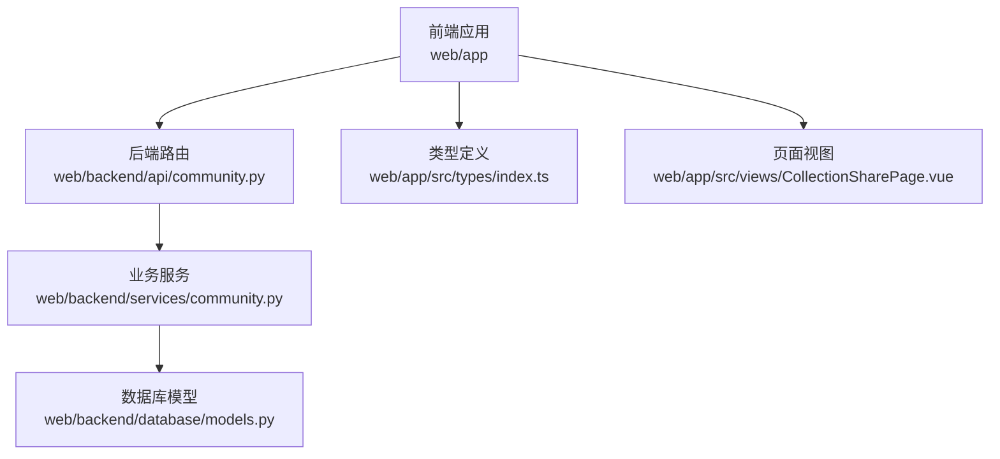
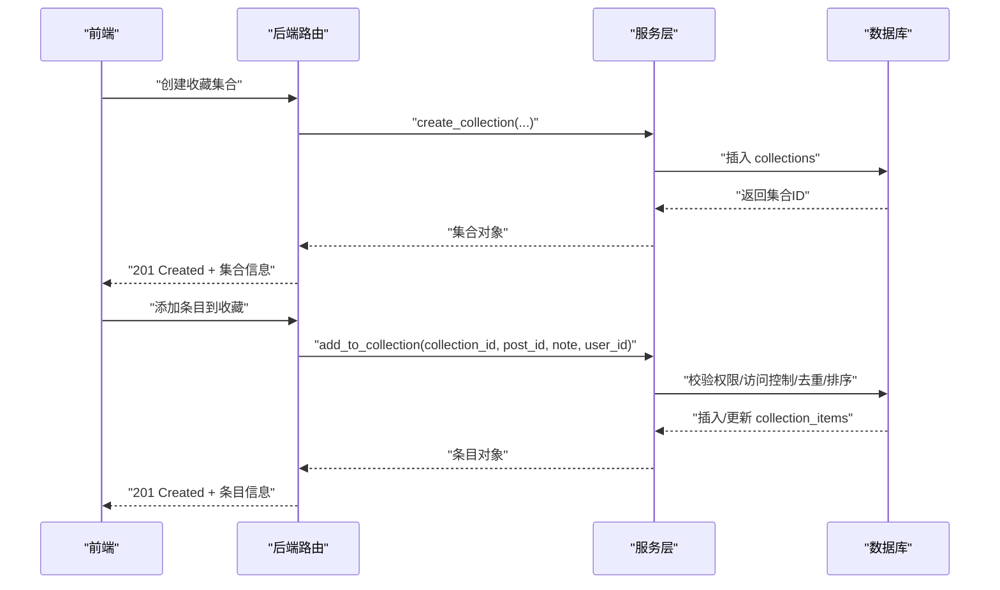
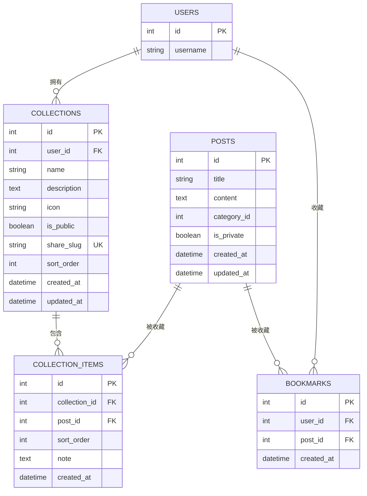
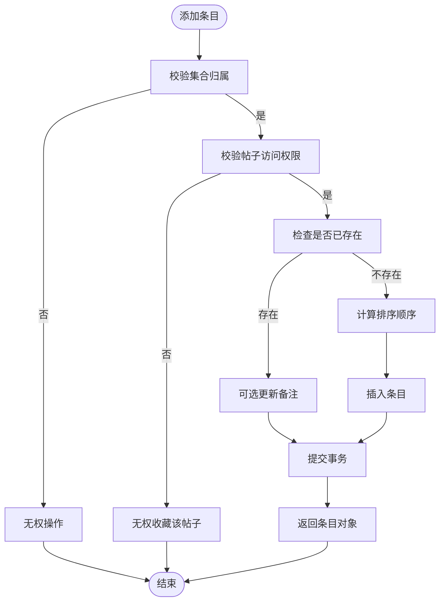
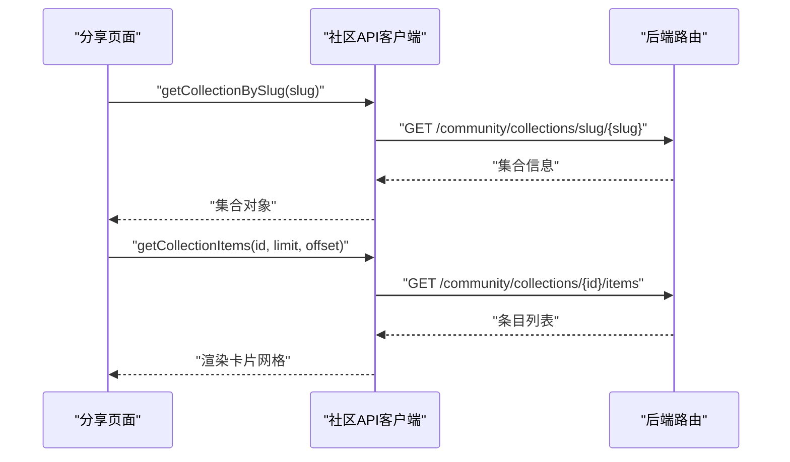
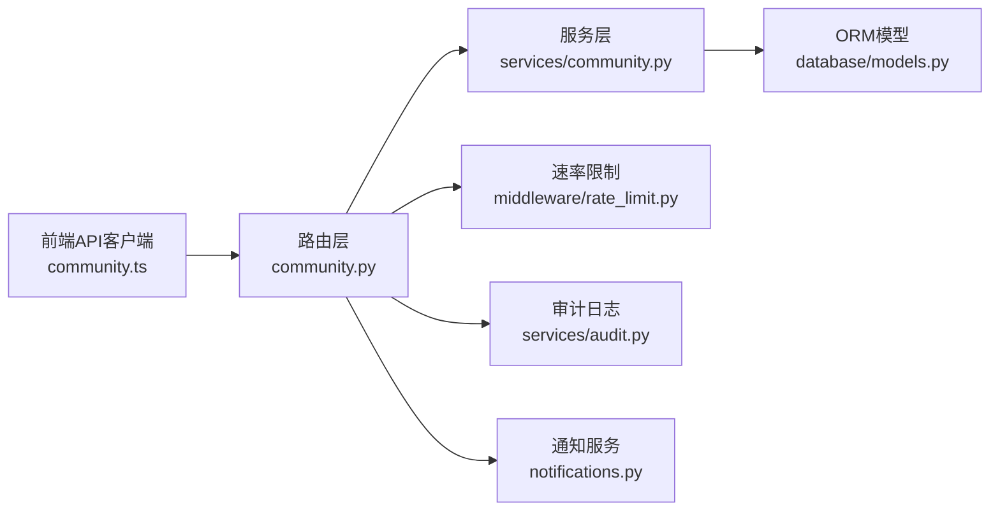

# 收藏系统

<cite>
**本文引用的文件**
- [web/backend/database/models.py](file://web/backend/database/models.py)
- [scripts/migration_add_collections.py](file://scripts/migration_add_collections.py)
- [web/backend/api/community.py](file://web/backend/api/community.py)
- [web/backend/services/community.py](file://web/backend/services/community.py)
- [web/backend/models/community.py](file://web/backend/models/community.py)
- [web/app/src/api/community.ts](file://web/app/src/api/community.ts)
- [web/app/src/views/CollectionSharePage.vue](file://web/app/src/views/CollectionSharePage.vue)
- [web/app/src/types/index.ts](file://web/app/src/types/index.ts)
- [web/app/src/composables/usePostActions.ts](file://web/app/src/composables/usePostActions.ts)
</cite>

## 目录
1. [简介](#简介)
2. [项目结构](#项目结构)
3. [核心组件](#核心组件)
4. [架构总览](#架构总览)
5. [详细组件分析](#详细组件分析)
6. [依赖关系分析](#依赖关系分析)
7. [性能考虑](#性能考虑)
8. [故障排查指南](#故障排查指南)
9. [结论](#结论)
10. [附录：API 接口文档](#附录api-接口文档)

## 简介
本技术文档围绕“收藏系统”展开，覆盖收藏集合的创建、管理、内容添加与删除；详细说明收藏数据的存储结构、查询优化与批量操作性能；阐述权限控制、隐私设置与分享功能；提供完整的后端 API 与前端交互说明，并给出数据模型（如 CollectionCreate、CollectionUpdate、CollectionItemAdd 等）的定义与使用方式。

## 项目结构
收藏系统由前后端协同实现：
- 后端：基于 FastAPI + SQLAlchemy，提供收藏集合与条目的 CRUD、书签（Bookmark）能力、公开分享访问控制，以及审计日志记录。
- 前端：Vue 应用通过 api 层调用后端接口，提供收藏列表、条目管理、分享页展示等界面。

**图表来源**
- [web/backend/api/community.py:786-1181](file://web/backend/api/community.py#L786-L1181)
- [web/backend/services/community.py:597-796](file://web/backend/services/community.py#L597-L796)
- [web/backend/database/models.py:486-523](file://web/backend/database/models.py#L486-L523)
- [web/app/src/api/community.ts:178-221](file://web/app/src/api/community.ts#L178-L221)
- [web/app/src/views/CollectionSharePage.vue:1-34](file://web/app/src/views/CollectionSharePage.vue#L1-L34)
- [web/app/src/types/index.ts:327-366](file://web/app/src/types/index.ts#L327-L366)

**章节来源**
- [web/backend/api/community.py:786-1181](file://web/backend/api/community.py#L786-L1181)
- [web/backend/services/community.py:597-796](file://web/backend/services/community.py#L597-L796)
- [web/backend/database/models.py:486-523](file://web/backend/database/models.py#L486-L523)
- [web/app/src/api/community.ts:178-221](file://web/app/src/api/community.ts#L178-L221)
- [web/app/src/views/CollectionSharePage.vue:1-34](file://web/app/src/views/CollectionSharePage.vue#L1-L34)
- [web/app/src/types/index.ts:327-366](file://web/app/src/types/index.ts#L327-L366)

## 核心组件
- 数据模型与迁移
  - 收藏集合表 collections：包含用户归属、名称、描述、图标、是否公开、分享 slug、排序、时间戳等字段。
  - 收藏条目表 collection_items：多对多关联帖子与收藏集合，支持排序与备注。
  - 书签表 bookmarks：用户与帖子的简单收藏关系，用于快速标记感兴趣的内容。
  - 迁移脚本负责建表与索引创建，确保查询性能。
- 后端服务与路由
  - 路由层暴露 RESTful 接口，处理收藏集合的增删改查、条目管理、公开分享访问。
  - 服务层封装业务逻辑，包括权限校验、访问控制、唯一性约束、排序计算、分页查询等。
- 前端交互
  - API 客户端封装了收藏相关的所有请求方法。
  - 分享页面根据 slug 加载公开收藏及其条目，提供阅读体验。
  - 通用动作组合 usePostActions 提供点赞与书签切换的统一入口。

**章节来源**
- [scripts/migration_add_collections.py:14-97](file://scripts/migration_add_collections.py#L14-L97)
- [web/backend/database/models.py:486-523](file://web/backend/database/models.py#L486-L523)
- [web/backend/api/community.py:786-1181](file://web/backend/api/community.py#L786-L1181)
- [web/backend/services/community.py:597-796](file://web/backend/services/community.py#L597-L796)
- [web/app/src/api/community.ts:178-221](file://web/app/src/api/community.ts#L178-L221)
- [web/app/src/views/CollectionSharePage.vue:1-34](file://web/app/src/views/CollectionSharePage.vue#L1-L34)
- [web/app/src/composables/usePostActions.ts:25-36](file://web/app/src/composables/usePostActions.ts#L25-L36)

## 架构总览
收藏系统的整体流程如下：
- 前端发起收藏集合或条目操作请求。
- 后端路由接收请求，进行鉴权与参数校验。
- 服务层执行业务逻辑（权限检查、访问控制、去重、排序、分页）。
- 数据层通过 ORM 读写数据库，利用索引优化查询。
- 返回结构化响应给前端，前端更新 UI。

**图表来源**
- [web/backend/api/community.py:786-833](file://web/backend/api/community.py#L786-L833)
- [web/backend/api/community.py:968-997](file://web/backend/api/community.py#L968-L997)
- [web/backend/services/community.py:597-701](file://web/backend/services/community.py#L597-L701)
- [web/backend/database/models.py:486-523](file://web/backend/database/models.py#L486-L523)

## 详细组件分析

### 数据模型与存储结构
- 收藏集合（collections）
  - 关键字段：user_id、name、description、icon、is_public、share_slug、sort_order、created_at、updated_at。
  - 索引：user_id、share_slug 提升按用户与分享链接的查询效率。
- 收藏条目（collection_items）
  - 关键字段：collection_id、post_id、sort_order、note、created_at。
  - 唯一约束：(collection_id, post_id) 防止重复添加同一帖子。
  - 索引：collection_id、post_id 加速按集合与帖子维度的查询。
- 书签（bookmarks）
  - 关键字段：user_id、post_id、created_at。
  - 唯一约束：(user_id, post_id) 保证用户对某帖子的书签唯一性。
  - 索引：user_id、post_id 提升用户书签列表与帖子被收藏统计的效率。

**图表来源**
- [web/backend/database/models.py:486-523](file://web/backend/database/models.py#L486-L523)
- [scripts/migration_add_collections.py:14-97](file://scripts/migration_add_collections.py#L14-L97)

**章节来源**
- [web/backend/database/models.py:486-523](file://web/backend/database/models.py#L486-L523)
- [scripts/migration_add_collections.py:14-97](file://scripts/migration_add_collections.py#L14-L97)

### 后端 API 与业务逻辑
- 收藏集合
  - 创建：POST /community/collections，返回集合元信息与条目计数。
  - 列表：GET /community/collections，仅当前用户可见。
  - 详情：GET /community/collections/{id}，非公开集合需为所有者或已授权。
  - 更新：PUT /community/collections/{id}，可修改名称、描述、图标、公开状态；公开时生成 share_slug，私密时清除。
  - 删除：DELETE /community/collections/{id}，仅所有者可删除。
- 收藏条目
  - 添加：POST /community/collections/{id}/items，支持备注；会校验帖子访问权限，避免私有帖子泄露。
  - 删除：DELETE /community/collections/{id}/items/{post_id}。
  - 列表：GET /community/collections/{id}/items，支持分页与排序。
- 书签
  - 切换：POST /community/posts/{post_id}/bookmark，若成功且非本人帖子则发送通知。
  - 列表：GET /community/bookmarks，返回用户收藏的帖子列表。
- 公开分享
  - 获取：GET /community/collections/slug/{slug}，仅公开集合可访问。

**图表来源**
- [web/backend/services/community.py:659-701](file://web/backend/services/community.py#L659-L701)
- [web/backend/api/community.py:968-997](file://web/backend/api/community.py#L968-L997)

**章节来源**
- [web/backend/api/community.py:786-1181](file://web/backend/api/community.py#L786-L1181)
- [web/backend/services/community.py:597-796](file://web/backend/services/community.py#L597-L796)

### 前端交互设计
- API 客户端
  - 提供 createCollection、getCollections、getCollection、updateCollection、deleteCollection、addToCollection、removeFromCollection、getCollectionItems 等方法。
- 分享页面
  - 根据路由参数 slug 加载公开收藏与条目，展示集合信息与帖子卡片网格。
- 通用动作
  - usePostActions 提供 toggleLike 与 toggleBookmark，统一登录态检查与错误处理。

**图表来源**
- [web/app/src/api/community.ts:178-221](file://web/app/src/api/community.ts#L178-L221)
- [web/backend/api/community.py:1085-1104](file://web/backend/api/community.py#L1085-L1104)
- [web/backend/api/community.py:1017-1051](file://web/backend/api/community.py#L1017-L1051)
- [web/app/src/views/CollectionSharePage.vue:22-27](file://web/app/src/views/CollectionSharePage.vue#L22-L27)

**章节来源**
- [web/app/src/api/community.ts:178-221](file://web/app/src/api/community.ts#L178-L221)
- [web/app/src/views/CollectionSharePage.vue:1-34](file://web/app/src/views/CollectionSharePage.vue#L1-L34)
- [web/app/src/composables/usePostActions.ts:25-36](file://web/app/src/composables/usePostActions.ts#L25-L36)

### 权限控制与隐私设置
- 集合访问控制
  - 非公开集合仅所有者可查看与编辑；公开集合可通过 share_slug 访问。
  - 条目列表访问同样遵循集合的公开状态与所有者校验。
- 帖子访问控制
  - 添加条目前校验用户对目标帖子的访问权限，防止私有帖子通过收藏泄露。
- 书签通知
  - 当用户收藏他人帖子时，向帖子作者发送通知，增强互动体验。

**章节来源**
- [web/backend/api/community.py:861-892](file://web/backend/api/community.py#L861-L892)
- [web/backend/api/community.py:1017-1051](file://web/backend/api/community.py#L1017-L1051)
- [web/backend/services/community.py:659-701](file://web/backend/services/community.py#L659-L701)
- [web/backend/api/community.py:1110-1133](file://web/backend/api/community.py#L1110-L1133)

### 数据模型定义
- 后端 Pydantic 模型
  - CollectionCreate、CollectionUpdate、CollectionItemAdd、CollectionResponse、CollectionItemListResponse、BookmarkResponse 等。
- 前端 TypeScript 类型
  - Collection、CollectionItem、CollectionCreateRequest、CollectionUpdateRequest、BookmarkResponse 等。

**章节来源**
- [web/backend/models/community.py:235-293](file://web/backend/models/community.py#L235-L293)
- [web/app/src/types/index.ts:327-366](file://web/app/src/types/index.ts#L327-L366)

## 依赖关系分析
- 模块耦合
  - 路由层依赖服务层进行业务编排；服务层依赖数据模型与迁移脚本提供的表结构。
  - 前端通过 API 客户端与后端通信，类型定义保持一致以减少契约漂移。
- 外部依赖
  - 速率限制中间件保护写操作；审计日志记录敏感变更。
  - 通知服务在书签创建时触发，增强社交互动。

**图表来源**
- [web/backend/api/community.py:1-20](file://web/backend/api/community.py#L1-L20)
- [web/backend/services/community.py:597-796](file://web/backend/services/community.py#L597-L796)
- [web/backend/database/models.py:486-523](file://web/backend/database/models.py#L486-L523)
- [web/app/src/api/community.ts:178-221](file://web/app/src/api/community.ts#L178-L221)

**章节来源**
- [web/backend/api/community.py:1-20](file://web/backend/api/community.py#L1-L20)
- [web/backend/services/community.py:597-796](file://web/backend/services/community.py#L597-L796)
- [web/backend/database/models.py:486-523](file://web/backend/database/models.py#L486-L523)
- [web/app/src/api/community.ts:178-221](file://web/app/src/api/community.ts#L178-L221)

## 性能考虑
- 查询优化
  - 为 collections.user_id、collections.share_slug、collection_items.collection_id、collection_items.post_id、bookmarks.user_id、bookmarks.post_id 建立索引，提升常见查询路径性能。
  - 条目列表采用分页（limit/offset）与排序（sort_order、created_at），避免一次性加载大量数据。
- 批量操作
  - 当前实现以单条操作为主；如需批量添加/删除，可在服务层引入事务与批量写入以提升吞吐。
- N+1 问题规避
  - 帖子列表转换采用批量转换策略，减少每篇帖子的额外关系查询开销。
- 缓存建议
  - 对高频读取的公开集合元数据与条目列表可引入缓存层（如 Redis），降低数据库压力。

**章节来源**
- [scripts/migration_add_collections.py:30-97](file://scripts/migration_add_collections.py#L30-L97)
- [web/backend/services/community.py:724-735](file://web/backend/services/community.py#L724-L735)
- [web/backend/api/community.py:345-353](file://web/backend/api/community.py#L345-L353)

## 故障排查指南
- 常见问题
  - 404 未找到：集合不存在或未公开；条目不存在；帖子不存在。
  - 403 无权限：非所有者尝试修改或删除集合；尝试收藏不可访问的帖子。
  - 400 参数错误：重复添加条目但未提供备注更新；非法参数。
- 定位步骤
  - 检查路由参数与服务层输入校验。
  - 查看数据库唯一约束冲突（如 collection_items 的 (collection_id, post_id)）。
  - 确认权限校验逻辑（集合归属、帖子访问控制）。
  - 审查审计日志与错误日志，定位异常堆栈。

**章节来源**
- [web/backend/api/community.py:861-892](file://web/backend/api/community.py#L861-L892)
- [web/backend/api/community.py:944-966](file://web/backend/api/community.py#L944-L966)
- [web/backend/api/community.py:968-997](file://web/backend/api/community.py#L968-L997)
- [web/backend/services/community.py:659-701](file://web/backend/services/community.py#L659-L701)

## 结论
收藏系统通过清晰的分层架构与严格的权限控制，实现了安全的集合管理与内容组织。数据库索引与分页策略保障了查询性能，前端提供了直观的分享与交互体验。未来可考虑引入批量操作与缓存机制以进一步提升性能与可扩展性。

## 附录：API 接口文档

### 收藏集合
- 创建收藏集合
  - 方法：POST
  - 路径：/community/collections
  - 请求体：CollectionCreate（name、description、icon、is_public）
  - 响应：CollectionResponse（含 item_count）
  - 状态码：201 Created
- 列出我的收藏集合
  - 方法：GET
  - 路径：/community/collections
  - 响应：CollectionListResponse（items）
- 获取收藏集合详情
  - 方法：GET
  - 路径：/community/collections/{collection_id}
  - 响应：CollectionResponse
  - 权限：仅所有者或公开集合
- 更新收藏集合
  - 方法：PUT
  - 路径：/community/collections/{collection_id}
  - 请求体：CollectionUpdate（name、description、icon、is_public）
  - 响应：CollectionResponse
- 删除收藏集合
  - 方法：DELETE
  - 路径：/community/collections/{collection_id}
  - 响应：204 No Content
- 通过分享链接获取公开收藏
  - 方法：GET
  - 路径：/community/collections/slug/{share_slug}
  - 响应：CollectionResponse

**章节来源**
- [web/backend/api/community.py:786-833](file://web/backend/api/community.py#L786-L833)
- [web/backend/api/community.py:836-858](file://web/backend/api/community.py#L836-L858)
- [web/backend/api/community.py:861-892](file://web/backend/api/community.py#L861-L892)
- [web/backend/api/community.py:895-941](file://web/backend/api/community.py#L895-L941)
- [web/backend/api/community.py:944-966](file://web/backend/api/community.py#L944-L966)
- [web/backend/api/community.py:1085-1104](file://web/backend/api/community.py#L1085-L1104)

### 收藏条目
- 添加条目到收藏
  - 方法：POST
  - 路径：/community/collections/{collection_id}/items
  - 请求体：CollectionItemAdd（post_id、note）
  - 响应：CollectionItemResponse（含 post 对象）
  - 状态码：201 Created
- 从收藏移除条目
  - 方法：DELETE
  - 路径：/community/collections/{collection_id}/items/{post_id}
  - 响应：204 No Content
- 列出收藏条目
  - 方法：GET
  - 路径：/community/collections/{collection_id}/items
  - 查询参数：limit、offset
  - 响应：CollectionItemListResponse（total、items）

**章节来源**
- [web/backend/api/community.py:968-997](file://web/backend/api/community.py#L968-L997)
- [web/backend/api/community.py:1000-1015](file://web/backend/api/community.py#L1000-L1015)
- [web/backend/api/community.py:1017-1051](file://web/backend/api/community.py#L1017-L1051)

### 书签
- 切换书签
  - 方法：POST
  - 路径：/community/posts/{post_id}/bookmark
  - 响应：BookmarkResponse（bookmarked、post_id）
- 列出我的书签
  - 方法：GET
  - 路径：/community/bookmarks
  - 查询参数：limit、offset
  - 响应：PostListResponse（total、items）

**章节来源**
- [web/backend/api/community.py:1110-1133](file://web/backend/api/community.py#L1110-L1133)
- [web/backend/api/community.py:1136-1146](file://web/backend/api/community.py#L1136-L1146)

### 前端类型与调用
- 类型定义
  - Collection、CollectionItem、CollectionCreateRequest、CollectionUpdateRequest、BookmarkResponse
- API 客户端方法
  - createCollection、getCollections、getCollection、getCollectionBySlug、updateCollection、deleteCollection、addToCollection、removeFromCollection、getCollectionItems、toggleBookmark、getBookmarks

**章节来源**
- [web/app/src/types/index.ts:327-366](file://web/app/src/types/index.ts#L327-L366)
- [web/app/src/api/community.ts:178-221](file://web/app/src/api/community.ts#L178-L221)
- [web/app/src/api/community.ts:107-115](file://web/app/src/api/community.ts#L107-L115)