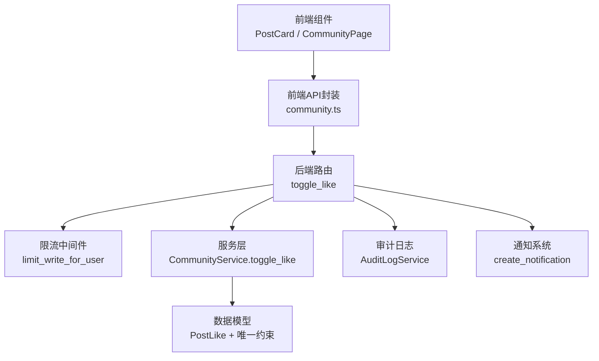
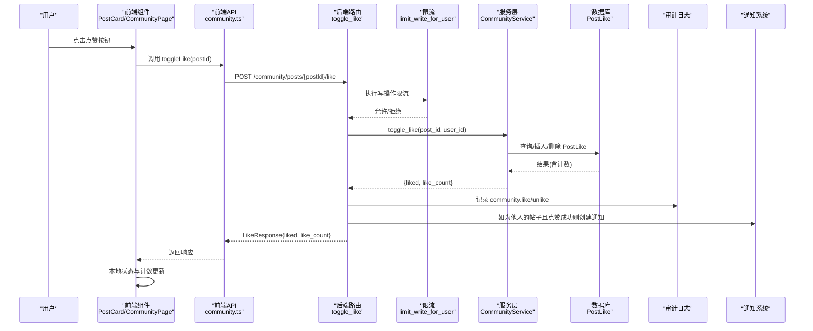
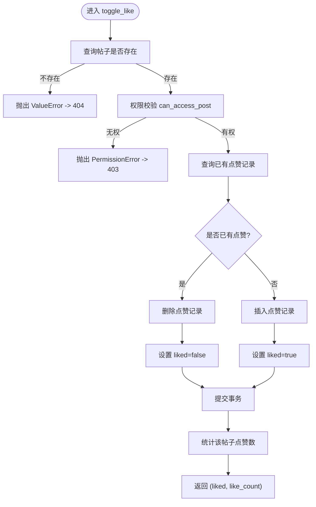
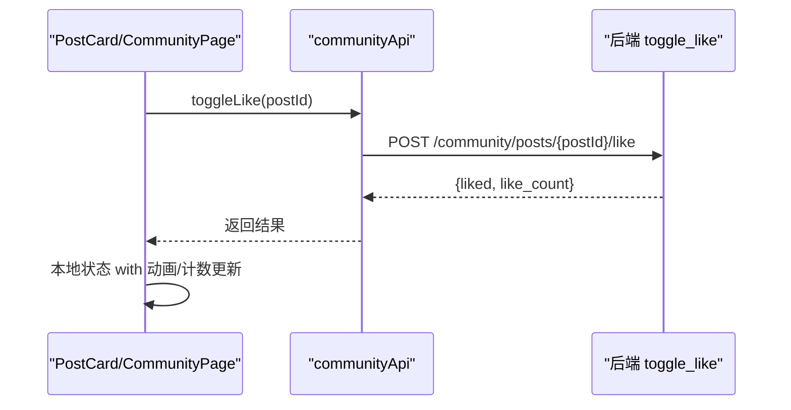
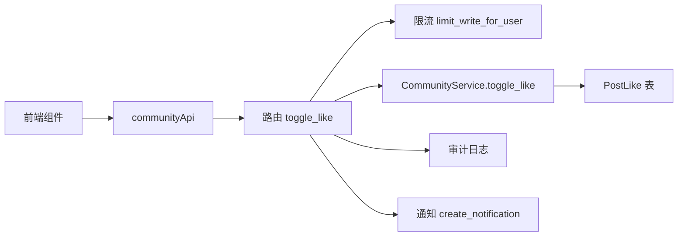

# 点赞系统

<cite>
**本文引用的文件**
- [web/backend/api/community.py](file://web/backend/api/community.py)
- [web/backend/services/community.py](file://web/backend/services/community.py)
- [web/backend/database/models.py](file://web/backend/database/models.py)
- [web/backend/app/middleware/rate_limit.py](file://web/backend/app/middleware/rate_limit.py)
- [web/backend/api/notifications.py](file://web/backend/api/notifications.py)
- [web/backend/models/community.py](file://web/backend/models/community.py)
- [web/app/src/api/community.ts](file://web/app/src/api/community.ts)
- [web/app/src/composables/usePostActions.ts](file://web/app/src/composables/usePostActions.ts)
- [web/app/src/views/CommunityPage.vue](file://web/app/src/views/CommunityPage.vue)
- [web/app/src/components/community/PostCard.vue](file://web/app/src/components/community/PostCard.vue)
</cite>

## 目录
1. [简介](#简介)
2. [项目结构](#项目结构)
3. [核心组件](#核心组件)
4. [架构总览](#架构总览)
5. [详细组件分析](#详细组件分析)
6. [依赖关系分析](#依赖关系分析)
7. [性能考量](#性能考量)
8. [故障排查指南](#故障排查指南)
9. [结论](#结论)
10. [附录：API 接口规范](#附录api-接口规范)

## 简介
本技术文档围绕社区“点赞”功能，系统性说明后端接口、服务层逻辑、数据模型与约束、权限控制、防刷限流、审计日志、通知联动以及前端交互与体验优化。重点覆盖 toggle_like 接口的处理流程、点赞状态切换机制、点赞计数实时更新、并发安全、错误处理与可观测性。

## 项目结构
点赞能力横跨前后端多个模块：
- 前端：调用社区 API 的客户端封装、组合式函数、页面与卡片组件负责交互与本地状态更新。
- 后端：路由层接收请求并做鉴权与限流；服务层实现业务逻辑（权限校验、状态切换、计数）；数据库模型定义表结构与唯一约束；通知模块在成功点赞时创建站内通知；审计模块记录操作日志。

图表来源
- [web/app/src/components/community/PostCard.vue:62-76](file://web/app/src/components/community/PostCard.vue#L62-L76)
- [web/app/src/api/community.ts:102-105](file://web/app/src/api/community.ts#L102-L105)
- [web/backend/api/community.py:543-584](file://web/backend/api/community.py#L543-L584)
- [web/backend/app/middleware/rate_limit.py:87-96](file://web/backend/app/middleware/rate_limit.py#L87-L96)
- [web/backend/services/community.py:424-454](file://web/backend/services/community.py#L424-L454)
- [web/backend/database/models.py:393-412](file://web/backend/database/models.py#L393-L412)
- [web/backend/api/notifications.py:84-109](file://web/backend/api/notifications.py#L84-L109)

章节来源
- [web/backend/api/community.py:543-584](file://web/backend/api/community.py#L543-L584)
- [web/backend/services/community.py:424-454](file://web/backend/services/community.py#L424-L454)
- [web/backend/database/models.py:393-412](file://web/backend/database/models.py#L393-L412)
- [web/backend/app/middleware/rate_limit.py:87-96](file://web/backend/app/middleware/rate_limit.py#L87-L96)
- [web/backend/api/notifications.py:84-109](file://web/backend/api/notifications.py#L84-L109)
- [web/app/src/api/community.ts:102-105](file://web/app/src/api/community.ts#L102-L105)
- [web/app/src/components/community/PostCard.vue:62-76](file://web/app/src/components/community/PostCard.vue#L62-L76)

## 核心组件
- 路由层：POST /community/posts/{post_id}/like，完成鉴权、限流、调用服务、审计与通知。
- 服务层：CommunityService.toggle_like，实现权限检查、点赞/取消点赞切换、并发安全与计数计算。
- 数据模型：PostLike 表及 (post_id, user_id) 唯一约束，防止重复点赞导致计数膨胀。
- 限流：基于用户ID（或IP回退）的写操作限流，防止恶意刷赞。
- 审计：记录 community.like / community.unlike 动作，便于追溯。
- 通知：当给他人帖子点赞时，为帖主创建“like”类型通知。
- 前端：封装 API 调用、本地乐观更新、未登录拦截与错误静默处理。

章节来源
- [web/backend/api/community.py:543-584](file://web/backend/api/community.py#L543-L584)
- [web/backend/services/community.py:424-454](file://web/backend/services/community.py#L424-L454)
- [web/backend/database/models.py:393-412](file://web/backend/database/models.py#L393-L412)
- [web/backend/app/middleware/rate_limit.py:87-96](file://web/backend/app/middleware/rate_limit.py#L87-L96)
- [web/backend/api/notifications.py:84-109](file://web/backend/api/notifications.py#L84-L109)
- [web/app/src/api/community.ts:102-105](file://web/app/src/api/community.ts#L102-L105)
- [web/app/src/composables/usePostActions.ts:12-23](file://web/app/src/composables/usePostActions.ts#L12-L23)
- [web/app/src/views/CommunityPage.vue:290-305](file://web/app/src/views/CommunityPage.vue#L290-L305)
- [web/app/src/components/community/PostCard.vue:62-76](file://web/app/src/components/community/PostCard.vue#L62-L76)

## 架构总览
点赞链路从前端到后端的完整调用序列如下：

图表来源
- [web/app/src/components/community/PostCard.vue:62-76](file://web/app/src/components/community/PostCard.vue#L62-L76)
- [web/app/src/api/community.ts:102-105](file://web/app/src/api/community.ts#L102-L105)
- [web/backend/api/community.py:543-584](file://web/backend/api/community.py#L543-L584)
- [web/backend/app/middleware/rate_limit.py:87-96](file://web/backend/app/middleware/rate_limit.py#L87-L96)
- [web/backend/services/community.py:424-454](file://web/backend/services/community.py#L424-L454)
- [web/backend/database/models.py:393-412](file://web/backend/database/models.py#L393-L412)
- [web/backend/api/notifications.py:84-109](file://web/backend/api/notifications.py#L84-L109)

## 详细组件分析

### 路由层：toggle_like 接口
- 路径与方法：POST /community/posts/{post_id}/like
- 鉴权：通过依赖注入获取当前用户
- 限流：调用 limit_write_for_user 进行写操作限流（按用户ID或IP）
- 业务：调用 CommunityService.toggle_like 执行点赞/取消点赞
- 审计：记录 community.like 或 community.unlike，包含 like_count
- 通知：若点赞成功且非作者本人，为帖主创建“like”通知
- 异常：权限错误返回 403；资源不存在返回 404

章节来源
- [web/backend/api/community.py:543-584](file://web/backend/api/community.py#L543-L584)
- [web/backend/app/middleware/rate_limit.py:87-96](file://web/backend/app/middleware/rate_limit.py#L87-L96)
- [web/backend/api/notifications.py:84-109](file://web/backend/api/notifications.py#L84-L109)

### 服务层：CommunityService.toggle_like
- 权限校验：通过 can_access_post 判断是否允许对该帖子进行点赞（私有/被屏蔽等）
- 状态切换：
  - 已有点赞：删除记录，liked=false
  - 无点赞：插入记录，liked=true
- 并发安全：捕获 IntegrityError（唯一约束冲突），视为已点赞并重新计算计数
- 计数计算：对 post_id 聚合统计点赞数
- 返回值：(bool liked, int like_count)

图表来源
- [web/backend/services/community.py:424-454](file://web/backend/services/community.py#L424-L454)

章节来源
- [web/backend/services/community.py:424-454](file://web/backend/services/community.py#L424-L454)

### 数据模型与并发安全
- PostLike 表：记录用户对帖子的点赞关系
- 唯一约束：(post_id, user_id) 确保同一用户对同一帖子仅有一条点赞记录
- 迁移脚本：确保唯一约束存在，并在必要时清理历史重复数据
- 索引：对 post_id、user_id 建立索引以加速查询

章节来源
- [web/backend/database/models.py:393-412](file://web/backend/database/models.py#L393-L412)
- [web/backend/database/migration_add_post_like_unique.py:1-76](file://web/backend/database/migration_add_post_like_unique.py#L1-L76)

### 权限控制
- 访问控制：can_access_post 限制对私密或被屏蔽的帖子进行点赞
- 角色/状态：结合用户状态（如封禁/禁言）在其他写操作中体现，点赞同样受限于帖子可见性与内容审核状态

章节来源
- [web/backend/services/community.py:48-64](file://web/backend/services/community.py#L48-L64)
- [web/backend/services/community.py:424-454](file://web/backend/services/community.py#L424-L454)

### 防刷机制
- 写操作限流：limit_write_for_user 使用进程内令牌桶，按用户ID（或IP回退）限制每分钟请求次数
- 目的：防止恶意刷赞、接口滥用与资源耗尽

章节来源
- [web/backend/app/middleware/rate_limit.py:10-36](file://web/backend/app/middleware/rate_limit.py#L10-L36)
- [web/backend/app/middleware/rate_limit.py:87-96](file://web/backend/app/middleware/rate_limit.py#L87-L96)

### 审计日志记录
- 动作标识：community.like / community.unlike
- 记录字段：actor_id、target_type=post、target_id=post_id、details.like_count、revokeable=True
- 容错：审计失败不影响主流程

章节来源
- [web/backend/api/community.py:558-569](file://web/backend/api/community.py#L558-L569)

### 通知系统集成
- 触发条件：点赞成功且目标帖子作者不是当前用户
- 通知类型：type="like"
- 关联信息：ref_type="post"、ref_id=post_id、body=帖子标题
- 去重策略：不给自己发通知（actor_id == user_id 时跳过）

章节来源
- [web/backend/api/community.py:570-579](file://web/backend/api/community.py#L570-L579)
- [web/backend/api/notifications.py:84-109](file://web/backend/api/notifications.py#L84-L109)

### 前端实现与用户体验
- API 封装：communityApi.toggleLike 调用后端接口
- 组合式函数：usePostActions 统一处理未登录拦截与调用
- 页面级更新：CommunityPage 在成功后就地更新 is_liked 与 like_count
- 卡片级更新：PostCard 使用本地 ref 状态进行即时反馈，提升交互流畅度
- 未登录处理：弹出登录弹窗，避免无效请求
- 错误处理：静默失败，避免影响主流程

图表来源
- [web/app/src/api/community.ts:102-105](file://web/app/src/api/community.ts#L102-L105)
- [web/app/src/composables/usePostActions.ts:12-23](file://web/app/src/composables/usePostActions.ts#L12-L23)
- [web/app/src/views/CommunityPage.vue:290-305](file://web/app/src/views/CommunityPage.vue#L290-L305)
- [web/app/src/components/community/PostCard.vue:62-76](file://web/app/src/components/community/PostCard.vue#L62-L76)

章节来源
- [web/app/src/api/community.ts:102-105](file://web/app/src/api/community.ts#L102-L105)
- [web/app/src/composables/usePostActions.ts:12-23](file://web/app/src/composables/usePostActions.ts#L12-L23)
- [web/app/src/views/CommunityPage.vue:290-305](file://web/app/src/views/CommunityPage.vue#L290-L305)
- [web/app/src/components/community/PostCard.vue:62-76](file://web/app/src/components/community/PostCard.vue#L62-L76)

## 依赖关系分析
- 路由依赖：auth、get_db、limit_write_for_user、AuditLogService、create_notification
- 服务依赖：Post、PostLike、User、权限方法 can_access_post
- 数据依赖：PostLike 表及唯一约束、索引
- 前端依赖：communityApi、useAuthStore、本地状态管理

图表来源
- [web/backend/api/community.py:543-584](file://web/backend/api/community.py#L543-L584)
- [web/backend/services/community.py:424-454](file://web/backend/services/community.py#L424-L454)
- [web/backend/database/models.py:393-412](file://web/backend/database/models.py#L393-L412)
- [web/backend/app/middleware/rate_limit.py:87-96](file://web/backend/app/middleware/rate_limit.py#L87-L96)
- [web/backend/api/notifications.py:84-109](file://web/backend/api/notifications.py#L84-L109)
- [web/app/src/api/community.ts:102-105](file://web/app/src/api/community.ts#L102-L105)

章节来源
- [web/backend/api/community.py:543-584](file://web/backend/api/community.py#L543-L584)
- [web/backend/services/community.py:424-454](file://web/backend/services/community.py#L424-L454)
- [web/backend/database/models.py:393-412](file://web/backend/database/models.py#L393-L412)
- [web/backend/app/middleware/rate_limit.py:87-96](file://web/backend/app/middleware/rate_limit.py#L87-L96)
- [web/backend/api/notifications.py:84-109](file://web/backend/api/notifications.py#L84-L109)
- [web/app/src/api/community.ts:102-105](file://web/app/src/api/community.ts#L102-L105)

## 性能考量
- 并发安全：通过数据库唯一约束与异常捕获，避免重复点赞导致的计数膨胀
- 计数效率：服务层直接对 post_id 聚合统计，减少多次查询
- 批量优化：列表渲染采用批量聚合（posts_to_models）降低 N+1 查询开销
- 限流保护：写操作限流防止高频请求造成数据库压力
- 前端优化：本地状态即时更新，减少等待时间，提升用户体验

[本节为通用性能建议，不直接分析具体文件]

## 故障排查指南
- 403 权限错误：检查帖子是否私密或被屏蔽，确认当前用户是否有权访问
- 404 资源不存在：确认帖子 ID 有效
- 429 请求过于频繁：检查限流配置与调用频率，适当降频或扩容
- 计数异常：核查 PostLike 唯一约束是否生效，必要时运行迁移清理重复数据
- 通知未生成：确认非作者本人点赞，且通知写入未抛异常

章节来源
- [web/backend/api/community.py:581-584](file://web/backend/api/community.py#L581-L584)
- [web/backend/app/middleware/rate_limit.py:87-96](file://web/backend/app/middleware/rate_limit.py#L87-L96)
- [web/backend/database/models.py:393-412](file://web/backend/database/models.py#L393-L412)
- [web/backend/api/notifications.py:84-109](file://web/backend/api/notifications.py#L84-L109)

## 结论
点赞系统在后端通过严格权限校验、唯一约束与限流保障一致性与安全性；在服务层实现简洁的状态切换与计数；在路由层集成审计与通知，形成完整的闭环。前端通过本地状态与即时更新提供流畅的用户体验。整体设计兼顾性能、可扩展性与可维护性。

[本节为总结性内容，不直接分析具体文件]

## 附录：API 接口规范
- 接口名称：toggle_like
- 方法与路径：POST /community/posts/{post_id}/like
- 认证：需要登录态（依赖 auth）
- 请求参数：
  - path: post_id（整数）
- 响应体：
  - liked（布尔）：当前是否已点赞
  - like_count（整数）：当前点赞总数
- 错误码：
  - 403：权限不足（例如帖子不可访问）
  - 404：帖子不存在
  - 429：操作过于频繁（写操作限流）
- 副作用：
  - 审计日志：记录 community.like 或 community.unlike
  - 通知：若为他人的帖子且点赞成功，为帖主创建“like”通知

章节来源
- [web/backend/api/community.py:543-584](file://web/backend/api/community.py#L543-L584)
- [web/backend/models/community.py:210-213](file://web/backend/models/community.py#L210-L213)
- [web/backend/app/middleware/rate_limit.py:87-96](file://web/backend/app/middleware/rate_limit.py#L87-L96)
- [web/backend/api/notifications.py:84-109](file://web/backend/api/notifications.py#L84-L109)