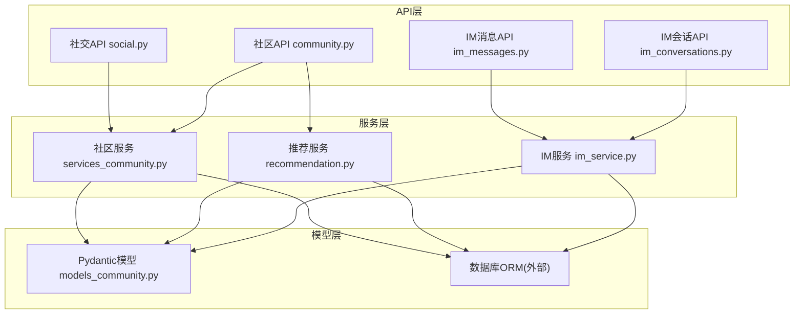
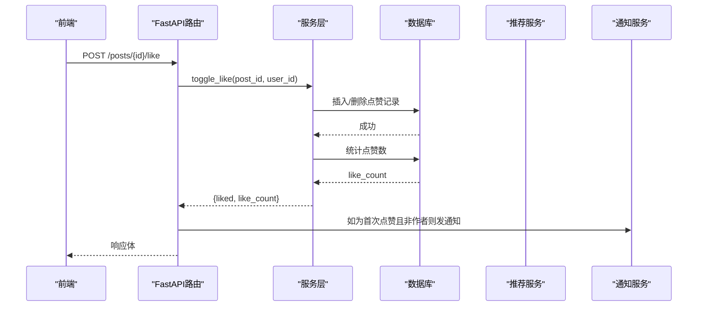
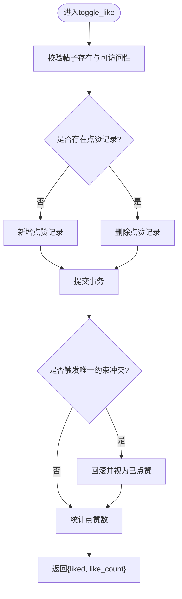
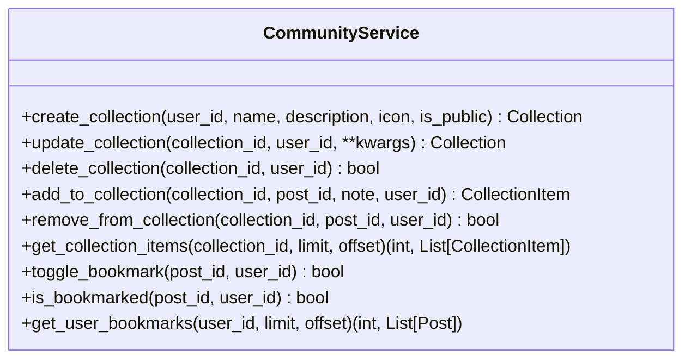
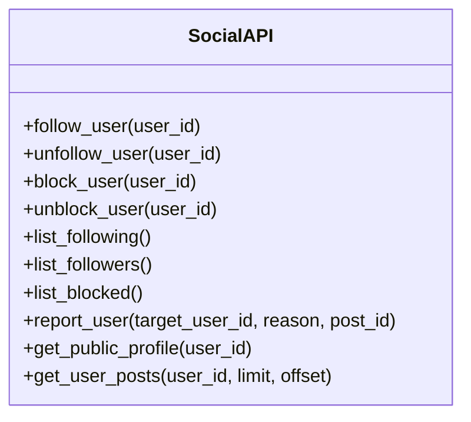
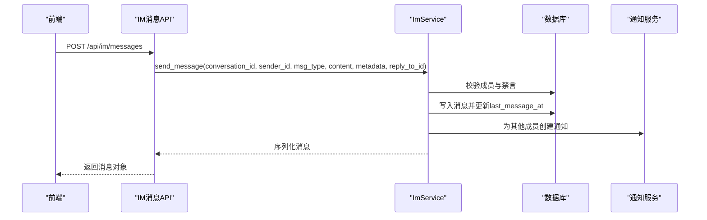
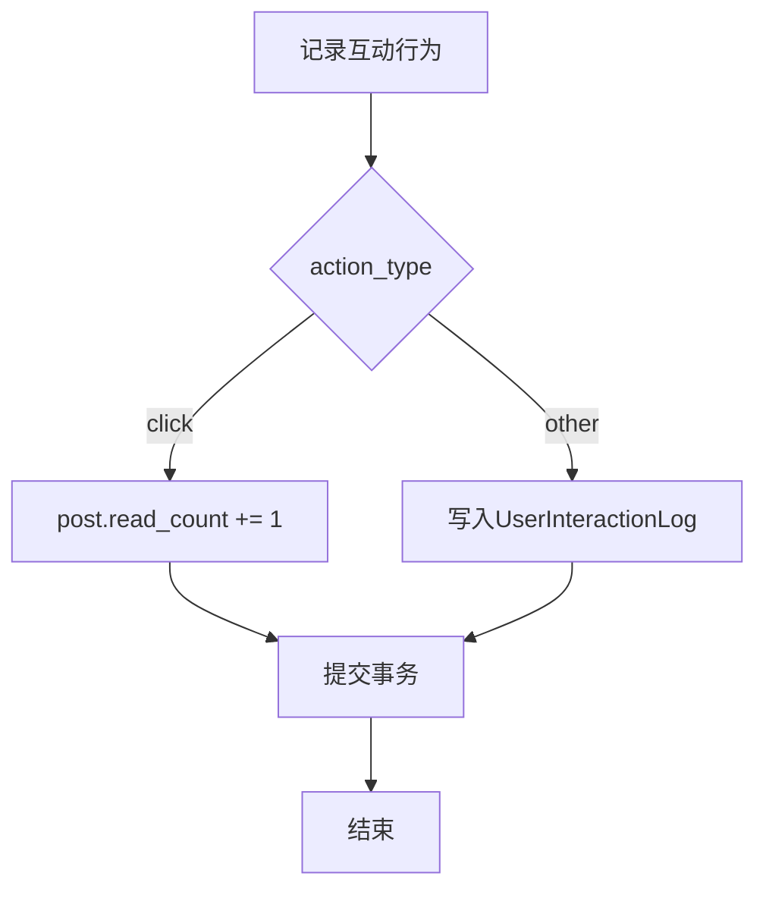
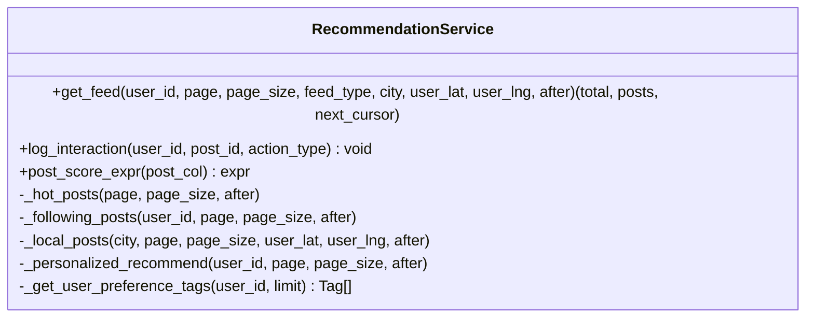
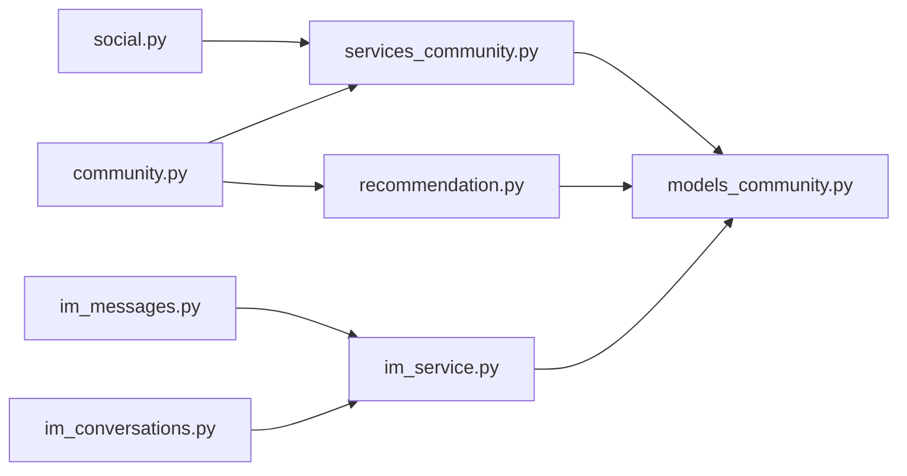

# 社交互动功能

<cite>
**本文引用的文件**   
- [social.py](file://web/backend/api/social.py)
- [community.py](file://web/backend/api/community.py)
- [models_community.py](file://web/backend/models/community.py)
- [services_community.py](file://web/backend/services/community.py)
- [recommendation.py](file://web/backend/services/recommendation.py)
- [im_messages.py](file://web/backend/api/im_messages.py)
- [im_conversations.py](file://web/backend/api/im_conversations.py)
- [im_service.py](file://web/backend/services/im_service.py)
</cite>

## 目录
1. [简介](#简介)
2. [项目结构](#项目结构)
3. [核心组件](#核心组件)
4. [架构总览](#架构总览)
5. [详细组件分析](#详细组件分析)
6. [依赖关系分析](#依赖关系分析)
7. [性能考量](#性能考量)
8. [故障排查指南](#故障排查指南)
9. [结论](#结论)
10. [附录：社交API接口规范](#附录社交api接口规范)

## 简介
本技术文档围绕“社交互动”能力进行系统化说明，覆盖点赞系统、收藏与书签、关注关系网络、私信消息系统，以及互动行为记录与分析、个性化推荐与热门排序。文档同时给出后端API契约、数据模型、服务层实现要点、前端组件集成建议与用户体验优化策略，帮助读者快速理解并落地相关功能。

## 项目结构
社交互动相关的代码主要分布在以下模块：
- API 层：FastAPI 路由定义，负责请求校验、鉴权、调用服务层、返回响应
- 服务层：社区/社交业务逻辑（点赞、评论、收藏、收藏夹、书签、版本控制）、IM即时通讯（会话、消息、好友）
- 推荐服务：统一评分公式、兴趣探索混合、同城与关注流、互动日志采集
- 数据模型：Pydantic 模型用于输入输出校验与序列化
- 数据库模型：ORM 实体（Post、UserFollow、Bookmark、ImConversation、ImMessage 等）

**图表来源** 
- [social.py:1-334](file://web/backend/api/social.py#L1-L334)
- [community.py:1-800](file://web/backend/api/community.py#L1-L800)
- [services_community.py:1-800](file://web/backend/services/community.py#L1-L800)
- [recommendation.py:1-347](file://web/backend/services/recommendation.py#L1-L347)
- [im_messages.py:1-78](file://web/backend/api/im_messages.py#L1-L78)
- [im_conversations.py:1-103](file://web/backend/api/im_conversations.py#L1-L103)
- [im_service.py:1-419](file://web/backend/services/im_service.py#L1-L419)
- [models_community.py:1-427](file://web/backend/models/community.py#L1-L427)

**章节来源**
- [social.py:1-334](file://web/backend/api/social.py#L1-L334)
- [community.py:1-800](file://web/backend/api/community.py#L1-L800)
- [services_community.py:1-800](file://web/backend/services/community.py#L1-L800)
- [recommendation.py:1-347](file://web/backend/services/recommendation.py#L1-L347)
- [im_messages.py:1-78](file://web/backend/api/im_messages.py#L1-L78)
- [im_conversations.py:1-103](file://web/backend/api/im_conversations.py#L1-L103)
- [im_service.py:1-419](file://web/backend/services/im_service.py#L1-L419)
- [models_community.py:1-427](file://web/backend/models/community.py#L1-L427)

## 核心组件
- 点赞系统：支持幂等切换、并发安全、计数统计、审计日志与通知
- 收藏与书签：收藏夹CRUD、条目管理、权限校验；书签一键切换
- 关注关系：关注/取关、拉黑/取消拉黑、举报、粉丝与关注列表、公开资料聚合
- 私信消息：会话创建与管理、消息收发、撤回、已读标记、未读数计算、好友申请与接受
- 互动记录与推荐：点击/阅读/点赞/收藏/评论/分享/跳过等行为记录，基于权重评分的热门与个性化推荐

**章节来源**
- [services_community.py:424-455](file://web/backend/services/community.py#L424-L455)
- [services_community.py:739-756](file://web/backend/services/community.py#L739-L756)
- [social.py:29-86](file://web/backend/api/social.py#L29-L86)
- [im_service.py:215-286](file://web/backend/services/im_service.py#L215-L286)
- [recommendation.py:337-347](file://web/backend/services/recommendation.py#L337-L347)

## 架构总览
整体采用“API路由 → 服务层 → ORM/缓存/第三方”的分层架构。推荐系统与社区服务解耦，通过统一的评分表达式与游标分页提供内容分发能力。IM子系统独立封装会话与消息生命周期，并与通知系统集成。

**图表来源** 
- [community.py:543-585](file://web/backend/api/community.py#L543-L585)
- [services_community.py:424-455](file://web/backend/services/community.py#L424-L455)
- [recommendation.py:337-347](file://web/backend/services/recommendation.py#L337-L347)

## 详细组件分析

### 点赞系统
- 能力要点
  - 幂等切换：重复操作不会重复计数，异常并发下通过唯一约束回退处理
  - 权限控制：仅允许访问可见帖子（私密或审核屏蔽不可赞）
  - 审计与通知：记录审计日志，若为首次点赞且非作者则触发通知
  - 计数与状态：返回当前是否已点赞与最新点赞数
- 关键流程
  - 校验帖子存在与可访问性
  - 查询是否存在点赞记录，存在则删除，不存在则新增
  - 提交事务，捕获完整性冲突后回滚并重算状态
  - 重新统计点赞数并返回

**图表来源** 
- [services_community.py:424-455](file://web/backend/services/community.py#L424-L455)

**章节来源**
- [community.py:543-585](file://web/backend/api/community.py#L543-L585)
- [services_community.py:424-455](file://web/backend/services/community.py#L424-L455)

### 收藏与书签
- 收藏夹
  - 创建/更新/删除：支持名称、描述、图标、公开性与分享码
  - 条目管理：添加/移除条目，自动排序，重复项支持备注更新
  - 权限校验：确保用户有权访问被收藏的帖子，防止私密内容泄露
- 书签
  - 一键切换：同一用户与帖子的书签唯一，切换即增删
  - 列表获取：按书签时间倒序分页

**图表来源** 
- [services_community.py:587-756](file://web/backend/services/community.py#L587-L756)

**章节来源**
- [services_community.py:587-756](file://web/backend/services/community.py#L587-L756)
- [models_community.py:232-294](file://web/backend/models/community.py#L232-L294)

### 关注关系网络
- 能力要点
  - 关注/取关：防自关注、防拉黑用户、去重、审计日志与通知
  - 拉黑/取消拉黑：自动解除双向关注，维护黑名单
  - 公开资料：聚合帖子数、关注数、粉丝数、是否已关注
  - 列表查询：我关注的用户、关注我的用户、已拉黑用户
- 数据模型
  - UserFollow：关注者与被关注者关系
  - UserBlock：拉黑关系
  - UserReport：举报记录

**图表来源** 
- [social.py:29-334](file://web/backend/api/social.py#L29-L334)

**章节来源**
- [social.py:29-334](file://web/backend/api/social.py#L29-L334)

### 私信消息系统
- 能力要点
  - 会话管理：私聊会话创建/复用、成员管理、置顶与静音
  - 消息收发：发送/拉取历史、已读标记、未读数计算、消息撤回（2分钟内）
  - 好友系统：好友申请、接受、好友列表
  - 速率限制：每分钟消息上限，防止滥用
- 关键流程
  - 发送消息前检查会话成员与禁言状态
  - 写入消息并更新会话最后消息时间
  - 向其他成员发送通知
  - 拉取消息时按时间倒序分页，支持 before_id 游标

**图表来源** 
- [im_messages.py:41-63](file://web/backend/api/im_messages.py#L41-L63)
- [im_service.py:215-286](file://web/backend/services/im_service.py#L215-L286)

**章节来源**
- [im_messages.py:1-78](file://web/backend/api/im_messages.py#L1-L78)
- [im_conversations.py:1-103](file://web/backend/api/im_conversations.py#L1-L103)
- [im_service.py:1-419](file://web/backend/services/im_service.py#L1-L419)

### 互动行为记录与分析
- 行为类型：click、read_end、like、bookmark、comment、share、skip
- 权重设计：不同行为赋予不同权重，影响推荐评分
- 记录方式：异步记录到交互日志表，点击行为同步增加阅读计数
- 应用：个性化推荐、热门排序、用户兴趣标签提取

**图表来源** 
- [recommendation.py:337-347](file://web/backend/services/recommendation.py#L337-L347)

**章节来源**
- [recommendation.py:337-347](file://web/backend/services/recommendation.py#L337-L347)

### 个性化推荐与热门排序
- 评分公式：like*2 + comment*2.5 + read*0.1（可扩展）
- 推荐模式
  - 热门：近一周公开帖子按评分排序
  - 关注：仅展示关注作者的公开帖子
  - 同城：按城市过滤，可选经纬度距离排序，带内存缓存
  - 个性化：兴趣与探索混合（首屏80%兴趣+20%探索），基于用户最近互动标签
- 游标分页：基于 created_at 与 id 的稳定分页

**图表来源** 
- [recommendation.py:42-347](file://web/backend/services/recommendation.py#L42-L347)

**章节来源**
- [recommendation.py:42-347](file://web/backend/services/recommendation.py#L42-L347)

## 依赖关系分析
- API层依赖服务层完成业务编排，服务层依赖数据库ORM与工具库（游标、时间工具）
- 推荐服务与社区服务解耦，通过统一评分表达式与游标分页协作
- IM服务独立于社区服务，但共享用户与通知基础设施
- 数据模型使用Pydantic进行输入输出校验，避免前后端契约不一致

**图表来源** 
- [social.py:1-334](file://web/backend/api/social.py#L1-L334)
- [community.py:1-800](file://web/backend/api/community.py#L1-L800)
- [services_community.py:1-800](file://web/backend/services/community.py#L1-L800)
- [recommendation.py:1-347](file://web/backend/services/recommendation.py#L1-L347)
- [im_messages.py:1-78](file://web/backend/api/im_messages.py#L1-L78)
- [im_conversations.py:1-103](file://web/backend/api/im_conversations.py#L1-L103)
- [im_service.py:1-419](file://web/backend/services/im_service.py#L1-L419)
- [models_community.py:1-427](file://web/backend/models/community.py#L1-L427)

**章节来源**
- [social.py:1-334](file://web/backend/api/social.py#L1-L334)
- [community.py:1-800](file://web/backend/api/community.py#L1-L800)
- [services_community.py:1-800](file://web/backend/services/community.py#L1-L800)
- [recommendation.py:1-347](file://web/backend/services/recommendation.py#L1-L347)
- [im_messages.py:1-78](file://web/backend/api/im_messages.py#L1-L78)
- [im_conversations.py:1-103](file://web/backend/api/im_conversations.py#L1-L103)
- [im_service.py:1-419](file://web/backend/services/im_service.py#L1-L419)
- [models_community.py:1-427](file://web/backend/models/community.py#L1-L427)

## 性能考量
- 游标分页：使用 created_at 与 id 组合游标，避免深度分页开销
- 并发安全：点赞操作通过唯一约束与异常回退保证一致性
- 内存缓存：同城推荐首屏结果缓存5分钟，减少重复计算
- 批量转换：社区服务对帖子列表进行批量转换，避免N+1查询
- 异步处理：内容安全审核与通知在后台线程执行，降低主流程延迟

**章节来源**
- [recommendation.py:231-310](file://web/backend/services/recommendation.py#L231-L310)
- [services_community.py:346-353](file://web/backend/services/community.py#L346-L353)
- [community.py:286-293](file://web/backend/api/community.py#L286-L293)

## 故障排查指南
- 点赞失败
  - 检查帖子是否存在与可访问性
  - 查看数据库唯一约束冲突日志
  - 确认并发场景下的回退逻辑
- 收藏权限错误
  - 确认用户是否有权访问目标帖子
  - 检查收藏夹归属与操作者身份
- 私信发送失败
  - 检查会话成员与禁言状态
  - 查看速率限制是否触发
  - 确认消息撤回时间窗口（2分钟）
- 推荐结果异常
  - 核对互动日志是否写入
  - 检查评分表达式与权重配置
  - 验证游标分页参数是否正确

**章节来源**
- [services_community.py:424-455](file://web/backend/services/community.py#L424-L455)
- [services_community.py:659-701](file://web/backend/services/community.py#L659-L701)
- [im_messages.py:41-63](file://web/backend/api/im_messages.py#L41-L63)
- [recommendation.py:337-347](file://web/backend/services/recommendation.py#L337-L347)

## 结论
本社交互动体系以清晰的分层架构与严谨的数据一致性保障为基础，实现了点赞、收藏、关注、私信等核心能力，并通过互动记录与推荐算法形成内容分发的闭环。建议在后续迭代中持续优化评分公式、扩展推荐维度，并加强监控与告警以提升稳定性与用户体验。

## 附录：社交API接口规范

### 点赞
- 路径：POST /posts/{post_id}/like
- 鉴权：需要登录
- 请求体：无
- 响应体：{ liked: boolean, like_count: number }
- 错误码：403（无权）、404（帖子不存在）

**章节来源**
- [community.py:543-585](file://web/backend/api/community.py#L543-L585)
- [services_community.py:424-455](file://web/backend/services/community.py#L424-L455)

### 收藏（收藏夹）
- 创建收藏夹：POST /collections
  - 请求体：{ name, description?, icon?, is_public? }
  - 响应体：CollectionResponse
- 添加条目：POST /collections/{collection_id}/items
  - 请求体：{ post_id, note? }
  - 响应体：CollectionItemResponse
- 移除条目：DELETE /collections/{collection_id}/items/{post_id}
- 列出条目：GET /collections/{collection_id}/items?limit&offset
  - 响应体：{ total, items: [CollectionItemResponse] }

**章节来源**
- [community.py:786-800](file://web/backend/api/community.py#L786-L800)
- [services_community.py:587-736](file://web/backend/services/community.py#L587-L736)
- [models_community.py:232-294](file://web/backend/models/community.py#L232-L294)

### 书签
- 切换书签：POST /posts/{post_id}/bookmark
  - 响应体：{ bookmarked: boolean, post_id: number }
- 列出书签：GET /my/bookmarks?limit&offset
  - 响应体：{ total, items: [Post] }

**章节来源**
- [services_community.py:739-771](file://web/backend/services/community.py#L739-L771)
- [models_community.py:290-294](file://web/backend/models/community.py#L290-L294)

### 关注
- 关注用户：POST /follow/{user_id}
- 取消关注：DELETE /follow/{user_id}
- 我关注的用户：GET /follow/following
- 关注我的用户：GET /follow/followers
- 拉黑用户：POST /block/{user_id}
- 取消拉黑：DELETE /block/{user_id}
- 已拉黑用户：GET /block/list
- 举报用户：POST /report?target_user_id&reason&post_id?
- 公开资料：GET /profile/{user_id}
- 用户帖子：GET /profile/{user_id}/posts?limit&offset

**章节来源**
- [social.py:29-334](file://web/backend/api/social.py#L29-L334)

### 私信消息
- 发送消息：POST /api/im/messages
  - 请求体：{ conversation_id, msg_type="text", content?, metadata?, reply_to_id? }
  - 响应体：序列化消息对象
- 撤回消息：POST /api/im/messages/{message_id}/recall
- 列出会话：GET /api/im/conversations
- 创建私聊会话：POST /api/im/conversations/private
  - 请求体：{ user_id }
- 拉取消息：GET /api/im/conversations/{conversation_id}/messages?before_id&limit
- 标记已读：POST /api/im/conversations/{conversation_id}/read
- 置顶/取消置顶：POST /api/im/conversations/{conversation_id}/pin

**章节来源**
- [im_messages.py:41-78](file://web/backend/api/im_messages.py#L41-L78)
- [im_conversations.py:21-103](file://web/backend/api/im_conversations.py#L21-L103)
- [im_service.py:215-331](file://web/backend/services/im_service.py#L215-L331)

### 互动行为记录
- 记录互动：POST /posts/{post_id}/interact
  - 请求体：{ action_type }（如 click、like、bookmark、comment、share、skip）
  - 响应体：{ status: "ok" }

**章节来源**
- [community.py:204-217](file://web/backend/api/community.py#L204-L217)
- [recommendation.py:337-347](file://web/backend/services/recommendation.py#L337-L347)