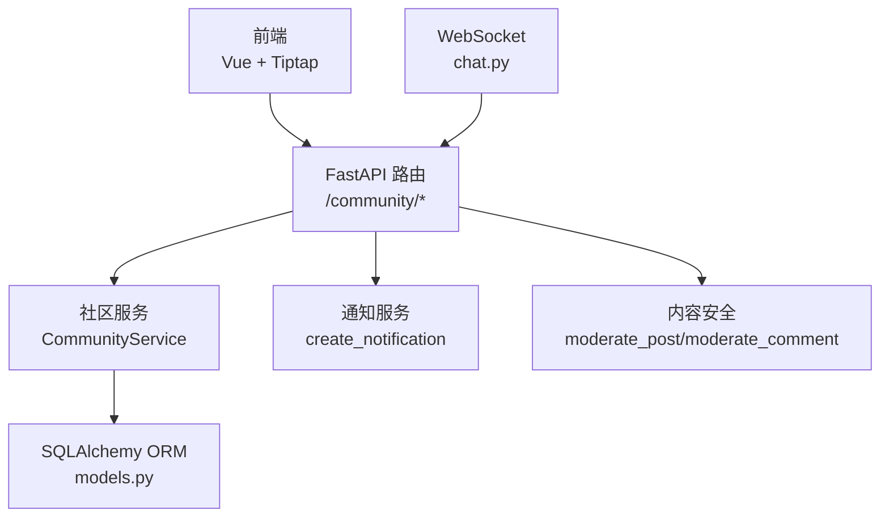
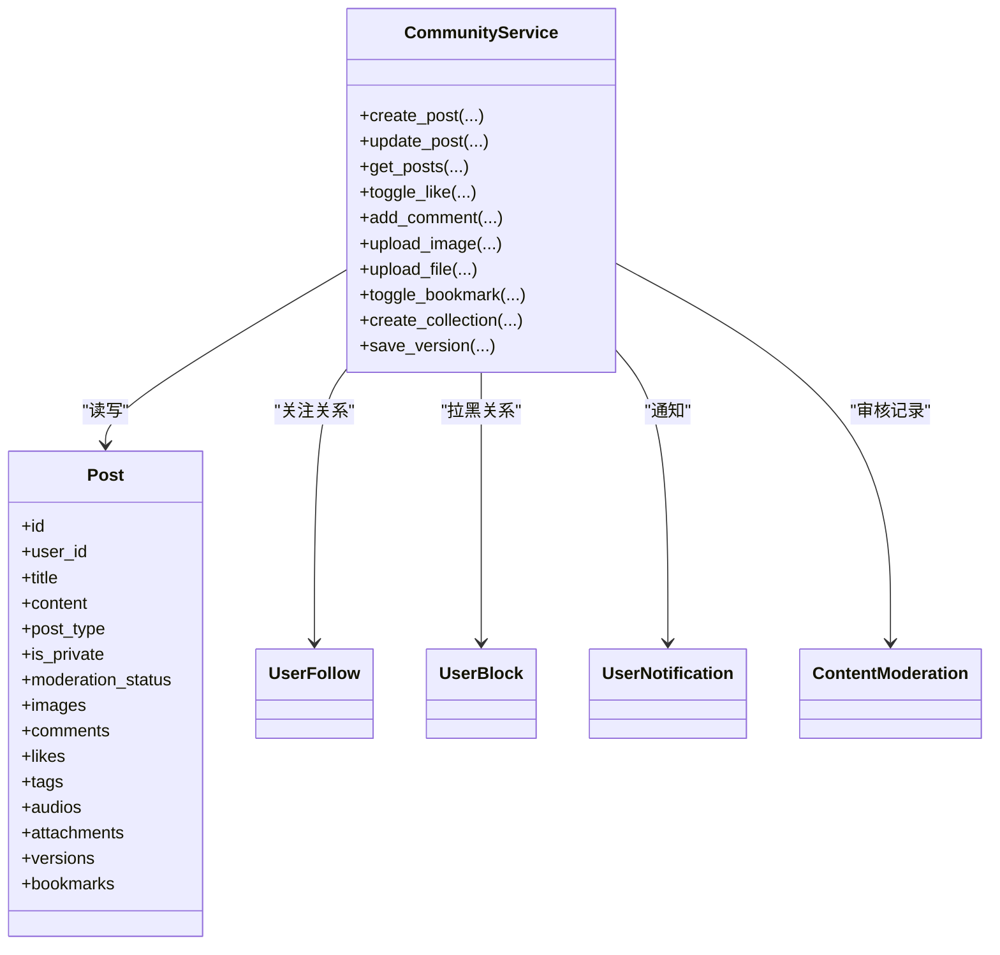
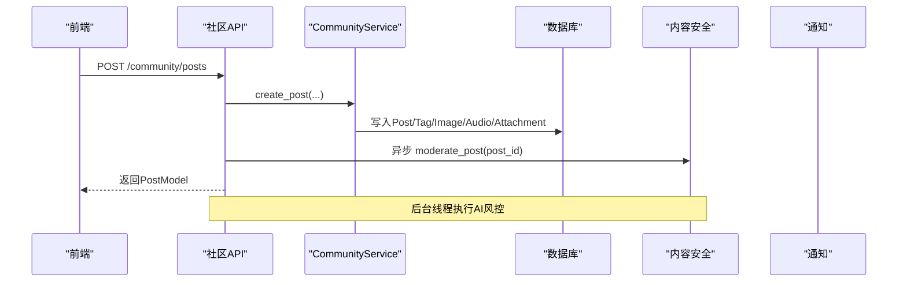
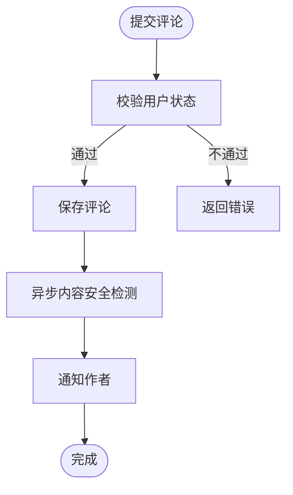
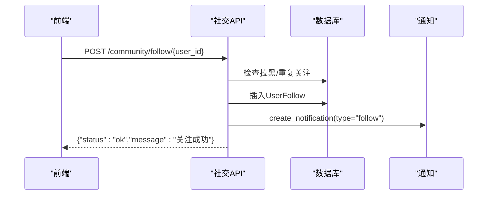
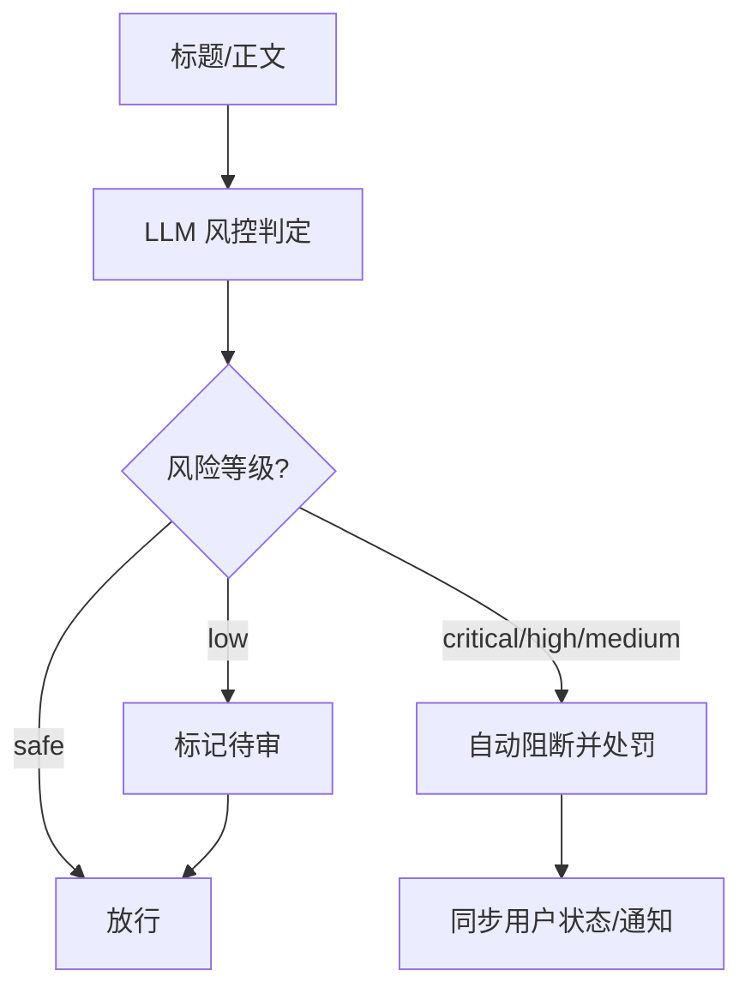
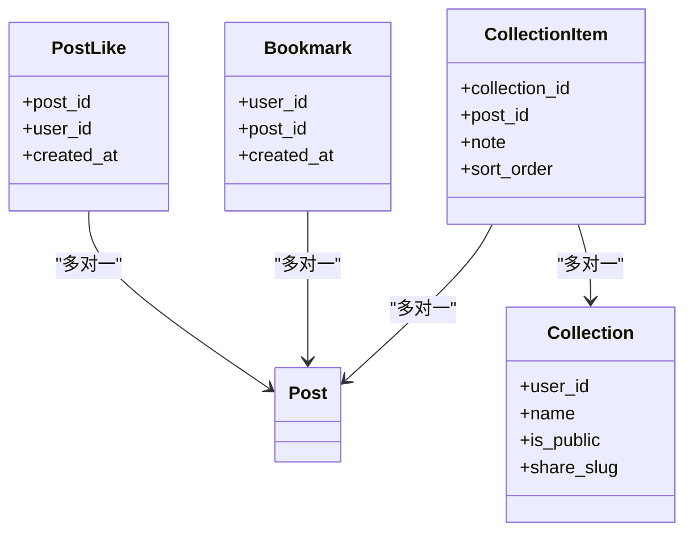
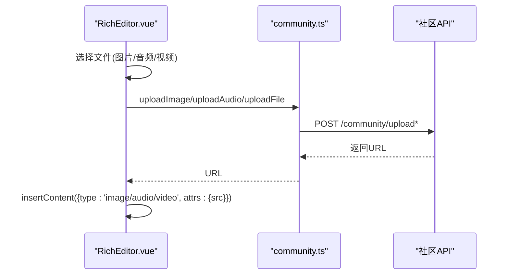
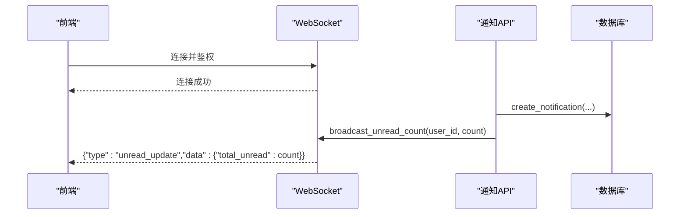
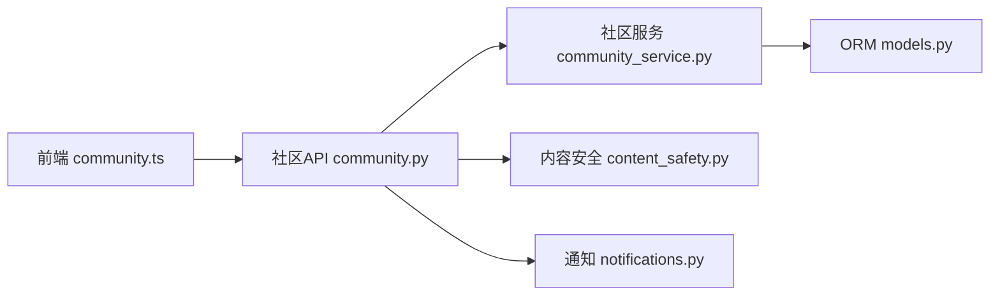

# 社区服务

<cite>
**本文引用的文件**   
- [community.py](file://web/backend/api/community.py)
- [comment.py](file://web/backend/api/comment.py)
- [social.py](file://web/backend/api/social.py)
- [notifications.py](file://web/backend/api/notifications.py)
- [models.py](file://web/backend/database/models.py)
- [community_service.py](file://web/backend/services/community.py)
- [content_safety.py](file://web/backend/services/content_safety.py)
- [RichEditor.vue](file://web/app/src/components/community/RichEditor.vue)
- [community.ts](file://web/app/src/api/community.ts)
- [chat.py](file://web/backend/ws/chat.py)
</cite>

## 目录
1. [简介](#简介)
2. [项目结构](#项目结构)
3. [核心组件](#核心组件)
4. [架构总览](#架构总览)
5. [详细组件分析](#详细组件分析)
6. [依赖关系分析](#依赖关系分析)
7. [性能考虑](#性能考虑)
8. [故障排查指南](#故障排查指南)
9. [结论](#结论)
10. [附录：API 接口与前端集成示例](#附录api-接口与前端集成示例)

## 简介
本技术文档面向社区服务的后端与前端实现，覆盖帖子管理、评论交互、关注关系网络、内容审核机制与社交功能。重点说明以下能力：
- 帖子类型支持：图文、视频、长文（以及结构化治疗经验分享）
- 富文本编辑器集成：基于 Tiptap 的图文音视频插入、链接、列表等
- 文件上传处理：图片、音频、通用文件的校验与存储
- 点赞与收藏：点赞切换、书签收藏、收藏夹管理
- 实时通知系统：WebSocket 连接管理与未读计数推送
- 数据模型设计：ORM 模型、关系映射、索引优化
- 查询性能调优：游标分页、批量转换、推荐流排序表达式
- API 接口文档与前端集成示例

## 项目结构
社区服务由 FastAPI 后端与 Vue/Tiptap 前端组成，关键路径如下：
- 后端 API：web/backend/api/*
- 数据库 ORM：web/backend/database/models.py
- 业务服务：web/backend/services/community.py、content_safety.py
- 通知与 WebSocket：web/backend/api/notifications.py、web/backend/ws/chat.py
- 前端富文本：web/app/src/components/community/RichEditor.vue
- 前端 API 封装：web/app/src/api/community.ts

图表来源
- [community.py:1-120](file://web/backend/api/community.py#L1-L120)
- [community_service.py:44-120](file://web/backend/services/community.py#L44-L120)
- [content_safety.py:103-146](file://web/backend/services/content_safety.py#L103-L146)
- [notifications.py:84-109](file://web/backend/api/notifications.py#L84-L109)
- [chat.py:45-51](file://web/backend/ws/chat.py#L45-L51)

章节来源
- [community.py:1-120](file://web/backend/api/community.py#L1-L120)
- [models.py:312-377](file://web/backend/database/models.py#L312-L377)

## 核心组件
- 帖子 CRUD 与列表：创建、更新、删除、按分类/标签/类型筛选、游标分页、推荐/热门流
- 评论：添加评论、分页获取、异步内容安全检测
- 社交关系：关注/取关、拉黑/取消拉黑、举报、公开主页与用户帖子
- 文件上传：图片/音频/文件上传，含大小限制、扩展名白名单、Magic Byte 校验
- 点赞与收藏：点赞切换、书签收藏、收藏夹增删改查
- 通知：统一创建通知、未读数统计、标记已读
- 实时通信：WebSocket 鉴权、心跳、已读回执

章节来源
- [community.py:219-353](file://web/backend/api/community.py#L219-L353)
- [community.py:587-660](file://web/backend/api/community.py#L587-L660)
- [social.py:29-105](file://web/backend/api/social.py#L29-L105)
- [community_service.py:529-583](file://web/backend/services/community.py#L529-L583)
- [community_service.py:424-454](file://web/backend/services/community.py#L424-L454)
- [community_service.py:739-756](file://web/backend/services/community.py#L739-L756)
- [notifications.py:84-109](file://web/backend/api/notifications.py#L84-L109)
- [chat.py:45-51](file://web/backend/ws/chat.py#L45-L51)

## 架构总览
社区服务采用“路由层 -> 服务层 -> ORM”的分层架构，配合异步内容审核与通知模块，形成高内聚低耦合的系统。

图表来源
- [community_service.py:136-224](file://web/backend/services/community.py#L136-L224)
- [models.py:312-377](file://web/backend/database/models.py#L312-L377)
- [models.py:786-800](file://web/backend/database/models.py#L786-L800)
- [notifications.py:84-109](file://web/backend/api/notifications.py#L84-L109)
- [content_safety.py:103-146](file://web/backend/services/content_safety.py#L103-L146)

## 详细组件分析

### 帖子管理系统
- 支持类型：image/video/text/long/treatment（自动推断或显式指定）
- 字段：标题、HTML 内容、Tiptap JSON、分类、私密性、日记日期/类型/心情、城市、结构化治疗分享
- 列表：支持分类/标签/类型过滤、游标分页、推荐/热门流（使用评分表达式排序）
- 权限：私密帖仅作者可见；被屏蔽内容对非作者不可见
- 版本历史：编辑时保存旧版本

图表来源
- [community.py:219-293](file://web/backend/api/community.py#L219-L293)
- [community_service.py:136-224](file://web/backend/services/community.py#L136-L224)
- [content_safety.py:103-146](file://web/backend/services/content_safety.py#L103-L146)

章节来源
- [community.py:219-353](file://web/backend/api/community.py#L219-L353)
- [community_service.py:226-292](file://web/backend/services/community.py#L226-L292)
- [models.py:312-377](file://web/backend/database/models.py#L312-L377)

### 评论交互功能
- 新增评论：需登录，支持状态检查（封禁/禁言），异步内容安全检测
- 评论列表：分页获取，按时间排序
- 权限控制：仅可评论可访问的帖子

图表来源
- [community.py:587-643](file://web/backend/api/community.py#L587-L643)
- [content_safety.py:190-226](file://web/backend/services/content_safety.py#L190-L226)
- [notifications.py:84-109](file://web/backend/api/notifications.py#L84-L109)

章节来源
- [community.py:587-660](file://web/backend/api/community.py#L587-L660)
- [community_service.py:467-492](file://web/backend/services/community.py#L467-L492)

### 关注关系网络
- 关注/取关：防止自关注、拉黑保护、幂等处理
- 拉黑：自动解绑双向关注
- 举报：记录举报原因与关联帖子
- 公开主页：展示用户基本信息、关注数、粉丝数、是否已关注

图表来源
- [social.py:29-85](file://web/backend/api/social.py#L29-L85)
- [notifications.py:84-109](file://web/backend/api/notifications.py#L84-L109)

章节来源
- [social.py:29-105](file://web/backend/api/social.py#L29-L105)
- [models.py:786-800](file://web/backend/database/models.py#L786-L800)

### 内容审核机制
- LLM 驱动的内容安全检测：标题+正文输入，输出风险等级与类别
- 自动处置：critical/high/medium 达到阈值直接 blocked，low 标记 flagged
- 违规处罚：警告、禁言、封号，并同步用户状态与通知
- 评论与个人资料字段同样适用

图表来源
- [content_safety.py:54-100](file://web/backend/services/content_safety.py#L54-L100)
- [content_safety.py:229-329](file://web/backend/services/content_safety.py#L229-L329)

章节来源
- [content_safety.py:54-100](file://web/backend/services/content_safety.py#L54-L100)
- [content_safety.py:103-146](file://web/backend/services/content_safety.py#L103-L146)

### 社交功能实现（点赞、收藏、书签、收藏夹）
- 点赞：唯一约束防并发重复，返回当前点赞状态与数量
- 书签：快速收藏，去重约束
- 收藏夹：创建/更新/删除、条目增删、排序与笔记备注
- 权限：收藏前校验帖子可访问性，避免隐私泄露

图表来源
- [models.py:393-412](file://web/backend/database/models.py#L393-L412)
- [models.py:546-559](file://web/backend/database/models.py#L546-L559)
- [models.py:486-526](file://web/backend/database/models.py#L486-L526)

章节来源
- [community_service.py:424-454](file://web/backend/services/community.py#L424-L454)
- [community_service.py:739-756](file://web/backend/services/community.py#L739-L756)
- [community_service.py:587-735](file://web/backend/services/community.py#L587-L735)

### 富文本编辑器集成（Tiptap）
- 工具栏：加粗、斜体、下划线、删除线、标题、列表、引用、分割线、链接
- 媒体插入：图片/音频/视频上传，自定义节点渲染
- 内容输出：HTML 与 Tiptap JSON 双格式，便于存储与渲染

图表来源
- [RichEditor.vue:395-498](file://web/app/src/components/community/RichEditor.vue#L395-L498)
- [community.ts:132-157](file://web/app/src/api/community.ts#L132-L157)
- [community.py:683-757](file://web/backend/api/community.py#L683-L757)

章节来源
- [RichEditor.vue:231-498](file://web/app/src/components/community/RichEditor.vue#L231-L498)
- [community.ts:132-157](file://web/app/src/api/community.ts#L132-L157)

### 文件上传处理
- 图片：最大 10MB，允许 jpg/jpeg/png/webp/gif，Magic Byte 校验
- 音频/文件：最大 50MB，允许 mp3/wav/m4a/aac/pdf/txt/doc/docx
- 存储：本地 data/uploads/*，文件名包含用户ID与哈希，避免冲突

章节来源
- [community_service.py:501-583](file://web/backend/services/community.py#L501-L583)
- [community.py:683-757](file://web/backend/api/community.py#L683-L757)

### 实时通知系统
- 通知创建：统一入口，支持类型、标题、内容、引用对象
- 未读数：独立接口统计，WebSocket 推送 unread_update
- 标记已读：单条/全部标记

图表来源
- [notifications.py:84-109](file://web/backend/api/notifications.py#L84-L109)
- [chat.py:35-39](file://web/backend/ws/chat.py#L35-L39)
- [chat.py:45-51](file://web/backend/ws/chat.py#L45-L51)

章节来源
- [notifications.py:114-186](file://web/backend/api/notifications.py#L114-L186)
- [chat.py:14-42](file://web/backend/ws/chat.py#L14-L42)

## 依赖关系分析
- 路由层依赖服务层进行业务编排，服务层操作 ORM 模型
- 内容安全与通知为横切关注点，在关键动作后触发
- 前端通过 TypeScript API 封装调用后端接口，富文本组件负责媒体上传与内容生成

图表来源
- [community.py:1-60](file://web/backend/api/community.py#L1-L60)
- [community_service.py:1-42](file://web/backend/services/community.py#L1-L42)
- [content_safety.py:1-25](file://web/backend/services/content_safety.py#L1-L25)
- [notifications.py:1-18](file://web/backend/api/notifications.py#L1-L18)
- [models.py:1-24](file://web/backend/database/models.py#L1-L24)

章节来源
- [community.py:1-60](file://web/backend/api/community.py#L1-L60)
- [community_service.py:1-42](file://web/backend/services/community.py#L1-L42)

## 性能考虑
- 游标分页：使用 created_at 与 id 组合游标，避免深度分页
- 批量转换：posts_to_models 避免 N+1 查询
- 推荐/热门流：使用评分表达式排序，减少应用层计算
- 上传限制：大小与扩展名白名单、Magic Byte 校验，降低 DoS 风险
- 并发点赞：唯一约束保障一致性，异常回滚后重算

章节来源
- [community.py:296-353](file://web/backend/api/community.py#L296-L353)
- [community_service.py:226-292](file://web/backend/services/community.py#L226-L292)
- [community_service.py:424-454](file://web/backend/services/community.py#L424-L454)

## 故障排查指南
- 上传失败：检查文件大小、扩展名、Magic Byte 校验结果
- 点赞异常：确认唯一约束是否生效，查看 IntegrityError 日志
- 内容审核：检查 LLM 配置与响应解析，确认 auto_action 与处罚逻辑
- 通知未达：验证 WebSocket 连接与鉴权，检查 unread_update 推送
- 权限问题：确认 can_access_post 逻辑与 moderation_status

章节来源
- [community_service.py:501-583](file://web/backend/services/community.py#L501-L583)
- [content_safety.py:54-100](file://web/backend/services/content_safety.py#L54-L100)
- [chat.py:45-51](file://web/backend/ws/chat.py#L45-L51)

## 结论
社区服务以清晰的分层架构与完善的数据模型支撑了帖子、评论、社交、审核与通知等核心能力。通过严格的上传校验、并发安全与游标分页，系统在可用性与性能上取得平衡。前端富文本与 API 封装提升了用户体验与开发效率。建议后续持续优化推荐算法、扩展审核规则与增强监控告警。

## 附录：API 接口与前端集成示例

### 帖子相关
- POST /community/posts：创建帖子
- GET /community/posts：列表（支持 category_id、tag、post_type、feed_type、city、is_private、limit、offset、after）
- GET /community/posts/{post_id}：获取详情
- PUT /community/posts/{post_id}：更新帖子
- DELETE /community/posts/{post_id}：删除帖子
- POST /community/posts/{post_id}/like：点赞切换
- GET /community/my-diaries：我的日记
- GET /community/diary-calendar：日历视图

章节来源
- [community.py:219-353](file://web/backend/api/community.py#L219-L353)
- [community.py:356-443](file://web/backend/api/community.py#L356-L443)
- [community.py:445-541](file://web/backend/api/community.py#L445-L541)

### 评论相关
- POST /community/posts/{post_id}/comments：添加评论
- GET /community/posts/{post_id}/comments：评论列表

章节来源
- [community.py:587-660](file://web/backend/api/community.py#L587-L660)

### 社交关系
- POST /community/follow/{user_id}：关注
- DELETE /community/follow/{user_id}：取关
- GET /community/follow/following：我关注的
- GET /community/follow/followers：我的粉丝
- POST /community/block/{user_id}：拉黑
- DELETE /community/block/{user_id}：取消拉黑
- GET /community/block/list：拉黑列表
- POST /community/report：举报
- GET /community/profile/{user_id}：公开主页
- GET /community/profile/{user_id}/posts：用户帖子列表

章节来源
- [social.py:29-334](file://web/backend/api/social.py#L29-L334)

### 文件上传
- POST /community/upload：图片上传
- POST /community/upload/audio：音频上传
- POST /community/upload/file：通用文件上传

章节来源
- [community.py:683-757](file://web/backend/api/community.py#L683-L757)

### 收藏夹与书签
- POST /community/collections：创建收藏夹
- GET /community/collections：收藏夹列表
- GET /community/collections/{id}：收藏夹详情
- PUT /community/collections/{id}：更新收藏夹
- DELETE /community/collections/{id}：删除收藏夹
- POST /community/collections/{id}/items：添加条目
- DELETE /community/collections/{id}/items/{post_id}：移除条目
- GET /community/collections/{id}/items：条目列表
- POST /community/posts/{post_id}/bookmark：书签切换
- GET /community/bookmarks：书签列表

章节来源
- [community.py:783-800](file://web/backend/api/community.py#L783-800)
- [community_service.py:587-735](file://web/backend/services/community.py#L587-L735)
- [community_service.py:739-756](file://web/backend/services/community.py#L739-L756)

### 通知
- GET /notifications：通知列表
- GET /notifications/unread-count：未读数
- POST /notifications/{id}/read：标记已读
- POST /notifications/read-all：全部已读

章节来源
- [notifications.py:114-186](file://web/backend/api/notifications.py#L114-L186)

### 前端集成示例（TypeScript）
- 使用 communityApi.getPosts、createPost、toggleLike、uploadImage 等方法调用后端
- RichEditor 组件通过 uploadImage/uploadAudio/uploadFile 将媒体插入到编辑器

章节来源
- [community.ts:55-157](file://web/app/src/api/community.ts#L55-L157)
- [RichEditor.vue:395-498](file://web/app/src/components/community/RichEditor.vue#L395-L498)