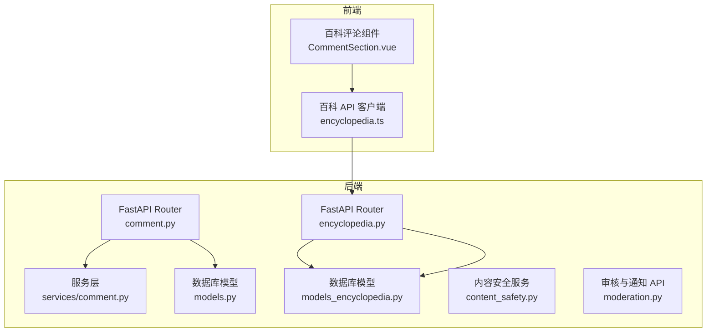
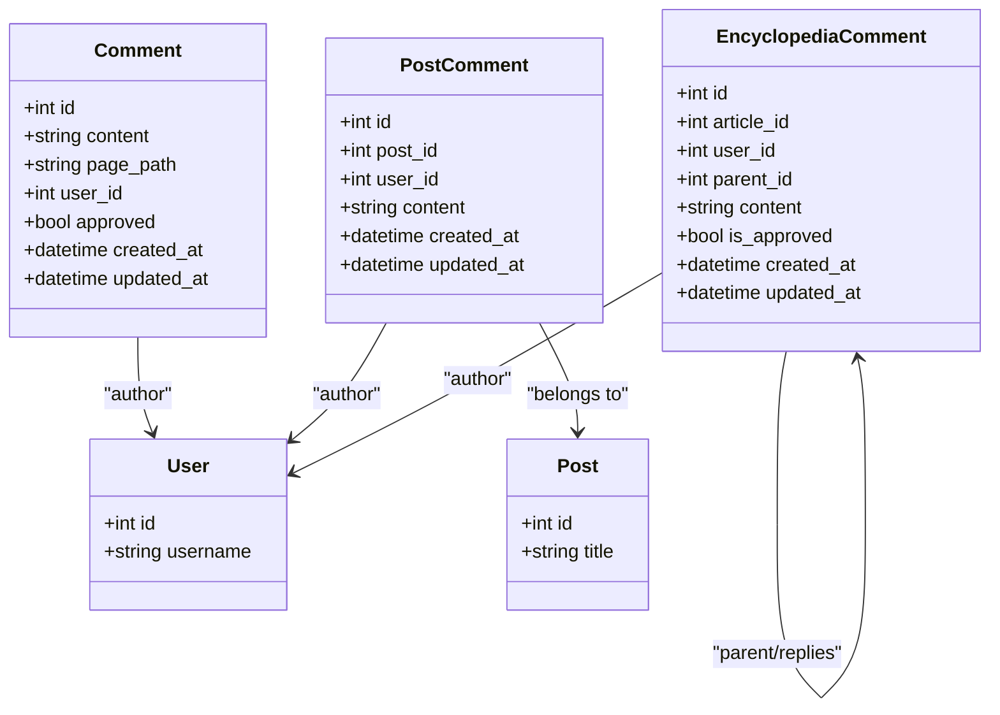
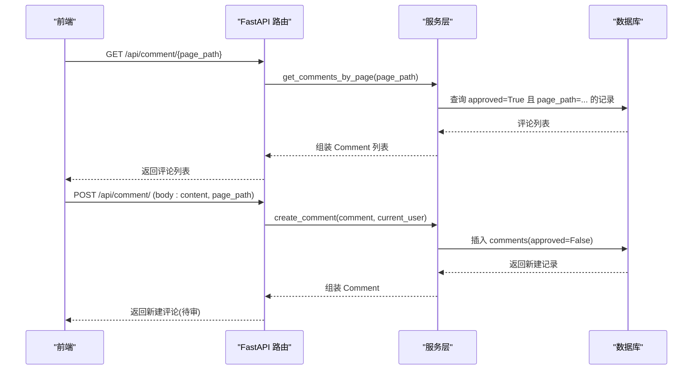
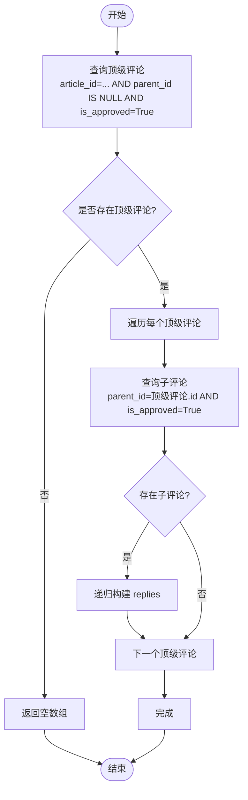
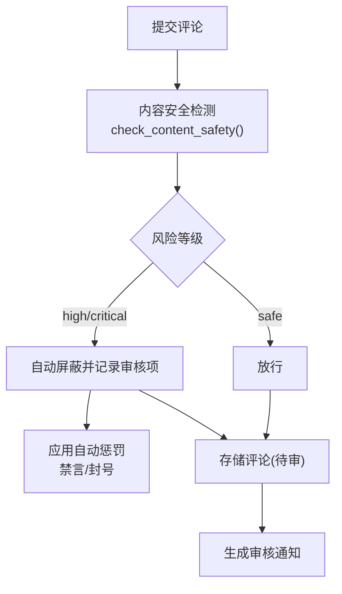
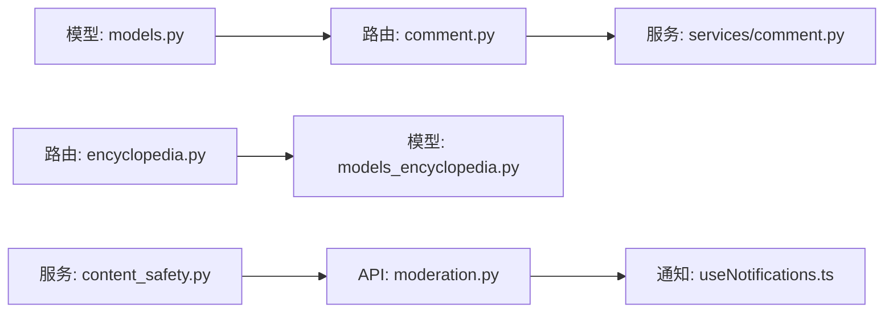

# 评论系统

<cite>
**本文引用的文件**   
- [web/backend/api/comment.py](file://web/backend/api/comment.py)
- [web/backend/api/comment_admin.py](file://web/backend/api/comment_admin.py)
- [web/backend/services/comment.py](file://web/backend/services/comment.py)
- [web/backend/models/comment.py](file://web/backend/models/comment.py)
- [web/backend/database/models.py](file://web/backend/database/models.py)
- [web/backend/api/encyclopedia.py](file://web/backend/api/encyclopedia.py)
- [web/backend/database/models_encyclopedia.py](file://web/backend/database/models_encyclopedia.py)
- [web/app/src/components/encyclopedia/CommentSection.vue](file://web/app/src/components/encyclopedia/CommentSection.vue)
- [web/app/src/api/encyclopedia.ts](file://web/app/src/api/encyclopedia.ts)
- [tests/backend/api/test_comment.py](file://tests/backend/api/test_comment.py)
- [tests/backend/api/test_comment_admin.py](file://tests/backend/api/test_comment_admin.py)
- [tests/backend/services/test_comment.py](file://tests/backend/services/test_comment.py)
- [web/backend/services/content_safety.py](file://web/backend/services/content_safety.py)
- [web/backend/api/moderation.py](file://web/backend/api/moderation.py)
- [web/app/src/composables/useNotifications.ts](file://web/app/src/composables/useNotifications.ts)
</cite>

## 目录
1. [简介](#简介)
2. [项目结构](#项目结构)
3. [核心组件](#核心组件)
4. [架构总览](#架构总览)
5. [详细组件分析](#详细组件分析)
6. [依赖关系分析](#依赖关系分析)
7. [性能考量](#性能考量)
8. [故障排查指南](#故障排查指南)
9. [结论](#结论)
10. [附录：API 接口规范](#附录api-接口规范)

## 简介
本技术文档围绕评论系统的后端与前端实现，系统性阐述以下能力：
- 评论的创建、查询、删除（当前实现以创建与查询为主，删除能力可基于现有模型扩展）
- 评论与帖子/百科文章的关联关系
- 嵌套评论支持（百科评论具备 parent_id 层级结构）
- 评论内容安全检测、用户权限验证、反垃圾机制
- 评论列表分页、排序策略
- 实时通知机制（通过轮询获取未读数量与通知列表）
- 前端评论组件的实现方式与交互设计

## 项目结构
评论系统涉及“通用页面评论”和“百科文章评论”两条路径：
- 通用页面评论：按 page_path 维度组织，适用于任意页面
- 百科文章评论：按 article_id 维度组织，支持 parent_id 嵌套回复

图表来源
- [web/backend/api/comment.py:1-33](file://web/backend/api/comment.py#L1-L33)
- [web/backend/services/comment.py:1-83](file://web/backend/services/comment.py#L1-L83)
- [web/backend/database/models.py:239-253](file://web/backend/database/models.py#L239-L253)
- [web/backend/api/encyclopedia.py:472-586](file://web/backend/api/encyclopedia.py#L472-L586)
- [web/backend/database/models_encyclopedia.py:91-114](file://web/backend/database/models_encyclopedia.py#L91-L114)
- [web/app/src/components/encyclopedia/CommentSection.vue:1-154](file://web/app/src/components/encyclopedia/CommentSection.vue#L1-L154)
- [web/app/src/api/encyclopedia.ts:120-133](file://web/app/src/api/encyclopedia.ts#L120-L133)

章节来源
- [web/backend/api/comment.py:1-33](file://web/backend/api/comment.py#L1-L33)
- [web/backend/api/encyclopedia.py:472-586](file://web/backend/api/encyclopedia.py#L472-L586)
- [web/backend/database/models.py:239-253](file://web/backend/database/models.py#L239-L253)
- [web/backend/database/models_encyclopedia.py:91-114](file://web/backend/database/models_encyclopedia.py#L91-L114)

## 核心组件
- 路由层
  - 通用评论路由：提供按 page_path 获取已批准评论、创建评论（需登录，默认待审）
  - 百科评论路由：提供按 slug 获取树形评论、创建评论（支持 parent_id 回复）
- 服务层
  - 通用评论服务：查询已批准评论、创建评论、管理员待审列表、审核操作
- 数据模型
  - 通用评论模型：comments 表，包含 content、page_path、user_id、approved、时间戳
  - 百科评论模型：encyclopedia_comments 表，包含 article_id、parent_id、is_approved、时间戳
- 前端组件
  - 百科评论组件：加载评论树、提交评论（含 parent_id）、登录校验、提示反馈

章节来源
- [web/backend/api/comment.py:1-33](file://web/backend/api/comment.py#L1-L33)
- [web/backend/api/encyclopedia.py:472-586](file://web/backend/api/encyclopedia.py#L472-L586)
- [web/backend/services/comment.py:1-83](file://web/backend/services/comment.py#L1-L83)
- [web/backend/models/comment.py:1-27](file://web/backend/models/comment.py#L1-L27)
- [web/backend/database/models.py:239-253](file://web/backend/database/models.py#L239-L253)
- [web/backend/database/models_encyclopedia.py:91-114](file://web/backend/database/models_encyclopedia.py#L91-L114)
- [web/app/src/components/encyclopedia/CommentSection.vue:1-154](file://web/app/src/components/encyclopedia/CommentSection.vue#L1-L154)

## 架构总览
评论系统采用分层架构：路由层负责请求解析与鉴权，服务层封装业务逻辑，数据模型层定义持久化结构与关系。百科评论通过 parent_id 自引用实现树形结构；通用评论通过 page_path 索引快速定位。

图表来源
- [web/backend/database/models.py:239-253](file://web/backend/database/models.py#L239-L253)
- [web/backend/database/models.py:414-428](file://web/backend/database/models.py#L414-L428)
- [web/backend/database/models_encyclopedia.py:91-114](file://web/backend/database/models_encyclopedia.py#L91-L114)

## 详细组件分析

### 通用评论模块（按 page_path）
- 功能要点
  - 获取已批准评论：按 page_path 过滤且仅返回 approved=True 的记录，按创建时间倒序
  - 创建评论：需要登录，新评论默认 approved=False（待审核）
  - 管理员待审列表：支持 skip/limit 分页，按创建时间倒序
  - 审核操作：approve/reject，更新 approved 字段
- 数据流
  - GET /{page_path} → service.get_comments_by_page → DB 查询 → 组装 Comment 响应
  - POST / → service.create_comment → 写入 comments 表 → 返回 Comment
  - GET /pending → service.get_pending_comments → DB 查询 → 管理员分页
  - POST /{id}/approve → service.approve_comment → 更新 approved

图表来源
- [web/backend/api/comment.py:19-32](file://web/backend/api/comment.py#L19-L32)
- [web/backend/services/comment.py:14-60](file://web/backend/services/comment.py#L14-L60)
- [web/backend/database/models.py:239-253](file://web/backend/database/models.py#L239-L253)

章节来源
- [web/backend/api/comment.py:1-33](file://web/backend/api/comment.py#L1-L33)
- [web/backend/services/comment.py:1-83](file://web/backend/services/comment.py#L1-L83)
- [web/backend/database/models.py:239-253](file://web/backend/database/models.py#L239-L253)
- [tests/backend/api/test_comment.py:10-82](file://tests/backend/api/test_comment.py#L10-L82)

### 百科评论模块（按 article_id，支持嵌套）
- 功能要点
  - 获取评论树：查询顶级评论（parent_id 为空），递归构建 replies 子树，仅返回 is_approved=True
  - 创建评论：支持 parent_id 回复父评论，默认 is_approved=False（待审）
  - 数据结构：EncyclopediaComment 表包含 article_id、parent_id、is_approved、时间戳
- 数据流
  - GET /articles/{slug}/comments → 查询顶级评论 → 递归构建 replies → 返回树
  - POST /articles/{slug}/comments → 校验 parent_id（可选）→ 插入评论 → 返回 comment_id

图表来源
- [web/backend/api/encyclopedia.py:474-517](file://web/backend/api/encyclopedia.py#L474-L517)
- [web/backend/database/models_encyclopedia.py:91-114](file://web/backend/database/models_encyclopedia.py#L91-L114)

章节来源
- [web/backend/api/encyclopedia.py:472-586](file://web/backend/api/encyclopedia.py#L472-L586)
- [web/backend/database/models_encyclopedia.py:91-114](file://web/backend/database/models_encyclopedia.py#L91-L114)

### 管理员评论管理
- 功能要点
  - 获取待审评论：skip/limit 分页，按创建时间倒序
  - 审核操作：approve/reject，更新 approved 字段
  - 权限控制：仅管理员可访问
- 数据流
  - GET /api/admin/comment/pending?skip=&limit= → service.get_pending_comments → 返回待审列表
  - POST /api/admin/comment/{id}/approve?approved= → service.approve_comment → 更新状态

章节来源
- [web/backend/api/comment_admin.py:1-63](file://web/backend/api/comment_admin.py#L1-L63)
- [web/backend/services/comment.py:63-83](file://web/backend/services/comment.py#L63-L83)
- [tests/backend/api/test_comment_admin.py:1-121](file://tests/backend/api/test_comment_admin.py#L1-L121)

### 内容与风控、反垃圾机制
- 内容安全检测
  - 对评论内容进行风险等级评估，生成 ContentModeration 记录
  - 高风险自动屏蔽并触发惩罚（如禁言、封号）
- 反垃圾机制
  - IM 反欺诈规则可用于识别重复消息、高频发送等异常行为
- 审核流程
  - 后台审核接口支持 approve/rejected/escalated，并生成通知

图表来源
- [web/backend/services/content_safety.py:190-234](file://web/backend/services/content_safety.py#L190-L234)
- [web/backend/api/moderation.py:154-181](file://web/backend/api/moderation.py#L154-L181)
- [web/backend/database/models.py:848-873](file://web/backend/database/models.py#L848-L873)

章节来源
- [web/backend/services/content_safety.py:136-234](file://web/backend/services/content_safety.py#L136-L234)
- [web/backend/api/moderation.py:1-181](file://web/backend/api/moderation.py#L1-181)
- [web/backend/database/models.py:848-873](file://web/backend/database/models.py#L848-L873)

### 前端评论组件与交互
- 功能要点
  - 加载评论树：调用百科 API 获取评论列表
  - 提交评论：校验登录态与输入，支持 parent_id 回复
  - 交互设计：显示作者头像/用户名、时间戳、回复按钮、回复区域缩进
- 数据流
  - onMounted → getComments(slug) → 渲染评论树
  - handleSubmit → createComment(slug, {content, parent_id}) → 成功提示并刷新列表

章节来源
- [web/app/src/components/encyclopedia/CommentSection.vue:1-154](file://web/app/src/components/encyclopedia/CommentSection.vue#L1-L154)
- [web/app/src/api/encyclopedia.ts:120-133](file://web/app/src/api/encyclopedia.ts#L120-L133)

## 依赖关系分析
- 路由层依赖服务层进行业务处理
- 服务层依赖数据库模型进行数据读写
- 百科评论模型自引用形成父子关系
- 内容安全服务与审核 API 联动，生成审核记录与通知

图表来源
- [web/backend/api/comment.py:1-33](file://web/backend/api/comment.py#L1-L33)
- [web/backend/services/comment.py:1-83](file://web/backend/services/comment.py#L1-L83)
- [web/backend/api/encyclopedia.py:472-586](file://web/backend/api/encyclopedia.py#L472-L586)
- [web/backend/database/models_encyclopedia.py:91-114](file://web/backend/database/models_encyclopedia.py#L91-L114)
- [web/backend/database/models.py:239-253](file://web/backend/database/models.py#L239-L253)
- [web/backend/services/content_safety.py:190-234](file://web/backend/services/content_safety.py#L190-L234)
- [web/backend/api/moderation.py:323-358](file://web/backend/api/moderation.py#L323-L358)
- [web/app/src/composables/useNotifications.ts:1-50](file://web/app/src/composables/useNotifications.ts#L1-L50)

章节来源
- [web/backend/api/comment.py:1-33](file://web/backend/api/comment.py#L1-L33)
- [web/backend/api/encyclopedia.py:472-586](file://web/backend/api/encyclopedia.py#L472-L586)
- [web/backend/services/content_safety.py:190-234](file://web/backend/services/content_safety.py#L190-L234)
- [web/backend/api/moderation.py:323-358](file://web/backend/api/moderation.py#L323-L358)

## 性能考量
- 查询优化
  - 通用评论按 page_path 索引，approved 过滤减少无效数据
  - 百科评论按 article_id、parent_id、user_id 建立索引，提升树构建效率
- 分页策略
  - 管理员待审列表使用 skip/limit 分页，避免一次性加载大量数据
- 排序策略
  - 通用评论按 created_at 倒序展示最新评论
  - 百科评论顶级按倒序、子评论按正序展示对话顺序
- 前端渲染
  - 百科评论组件按需渲染，避免过多 DOM 节点影响性能

[本节为通用指导，不直接分析具体文件]

## 故障排查指南
- 常见问题
  - 评论未显示：检查 approved/is_approved 是否为 True
  - 无法提交评论：确认用户登录态与权限
  - 嵌套回复失败：校验 parent_id 是否属于同一 article/page
  - 审核不生效：检查管理员权限与 approve 接口调用
- 调试建议
  - 查看数据库 records 的 approved/is_approved 字段
  - 检查内容安全检测结果与审核记录
  - 前端日志与网络请求响应体

章节来源
- [tests/backend/api/test_comment.py:10-82](file://tests/backend/api/test_comment.py#L10-L82)
- [tests/backend/api/test_comment_admin.py:1-121](file://tests/backend/api/test_comment_admin.py#L1-L121)
- [tests/backend/services/test_comment.py:129-168](file://tests/backend/services/test_comment.py#L129-L168)
- [web/backend/services/content_safety.py:190-234](file://web/backend/services/content_safety.py#L190-L234)

## 结论
评论系统实现了通用页面评论与百科文章评论两条路径，前者按 page_path 组织，后者按 article_id 组织并支持嵌套回复。系统内置内容安全检测与审核流程，结合管理员权限控制保障内容质量。前端组件提供直观的评论交互体验，并通过通知机制提醒用户审核结果。整体架构清晰、可扩展性强，便于后续增加删除、点赞、实时推送等功能。

[本节为总结性内容，不直接分析具体文件]

## 附录：API 接口规范

### 通用评论 API
- 获取评论列表
  - 方法：GET
  - 路径：/api/comment/{page_path}
  - 参数：page_path（字符串）
  - 返回：评论数组（仅 approved=True）
- 创建评论
  - 方法：POST
  - 路径：/api/comment/
  - 请求体：{ content: string, page_path: string }
  - 鉴权：需要登录
  - 返回：新建评论对象（approved=False）

章节来源
- [web/backend/api/comment.py:19-32](file://web/backend/api/comment.py#L19-L32)
- [web/backend/services/comment.py:40-60](file://web/backend/services/comment.py#L40-L60)

### 百科评论 API
- 获取评论树
  - 方法：GET
  - 路径：/api/encyclopedia/articles/{slug}/comments
  - 参数：slug（字符串）
  - 返回：评论树（顶级按倒序，子评论按正序，仅 is_approved=True）
- 创建评论
  - 方法：POST
  - 路径：/api/encyclopedia/articles/{slug}/comments
  - 请求体：{ content: string, parent_id?: number }
  - 鉴权：需要登录
  - 返回：{ status: string, message: string, comment_id: number }

章节来源
- [web/backend/api/encyclopedia.py:474-517](file://web/backend/api/encyclopedia.py#L474-L517)
- [web/backend/api/encyclopedia.py:520-555](file://web/backend/api/encyclopedia.py#L520-L555)

### 管理员评论管理 API
- 获取待审评论
  - 方法：GET
  - 路径：/api/admin/comment/pending
  - 参数：skip（整数，默认0）、limit（整数，默认20）
  - 鉴权：管理员
  - 返回：待审评论数组（按 created_at 倒序）
- 审核评论
  - 方法：POST
  - 路径：/api/admin/comment/{comment_id}/approve
  - 参数：approved（布尔，默认True）
  - 鉴权：管理员
  - 返回：{ status: string, approved: boolean }

章节来源
- [web/backend/api/comment_admin.py:18-44](file://web/backend/api/comment_admin.py#L18-L44)
- [web/backend/api/comment_admin.py:47-63](file://web/backend/api/comment_admin.py#L47-L63)

### 通知与审核相关 API
- 获取通知列表
  - 方法：GET
  - 路径：/api/moderation/notifications
  - 参数：limit（整数，默认20）、offset（整数，默认0）
  - 鉴权：需要登录
  - 返回：{ total: number, items: NotificationItem[] }
- 标记通知已读
  - 方法：POST
  - 路径：/api/moderation/notifications/{notification_id}/read
  - 鉴权：需要登录
  - 返回：{ status: string }

章节来源
- [web/backend/api/moderation.py:328-358](file://web/backend/api/moderation.py#L328-L358)