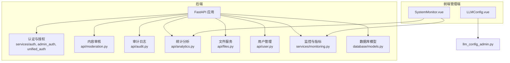
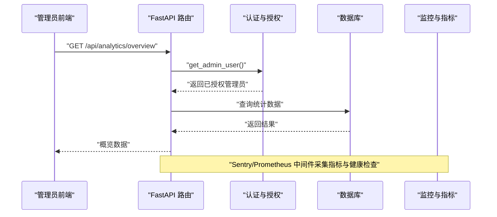
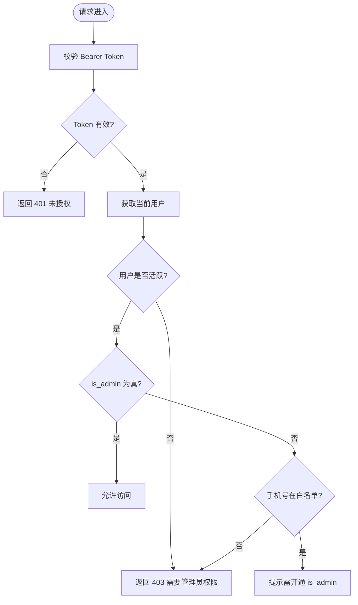
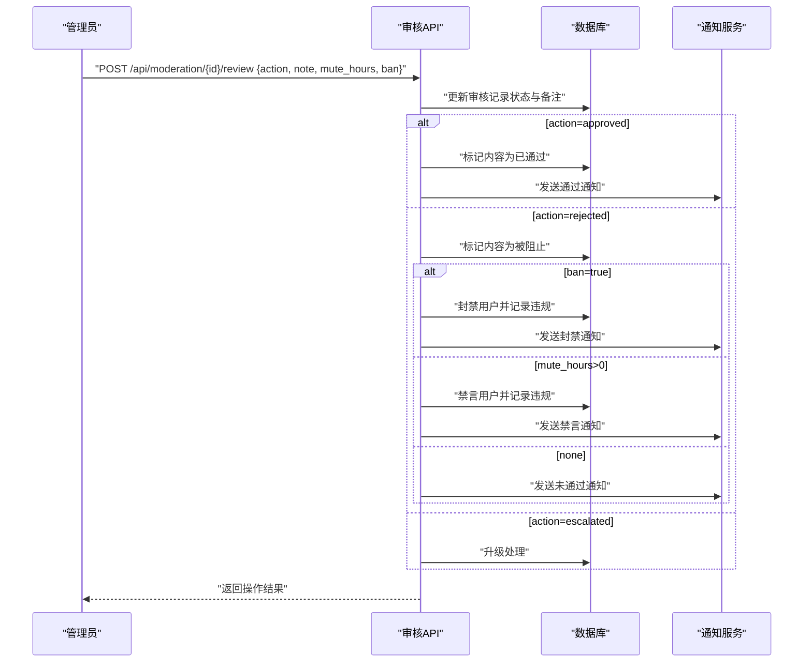
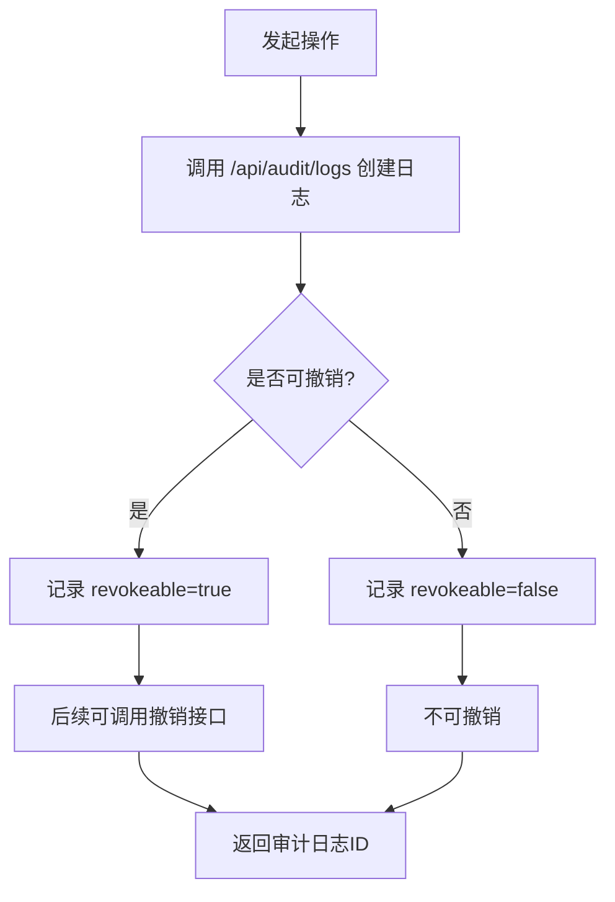
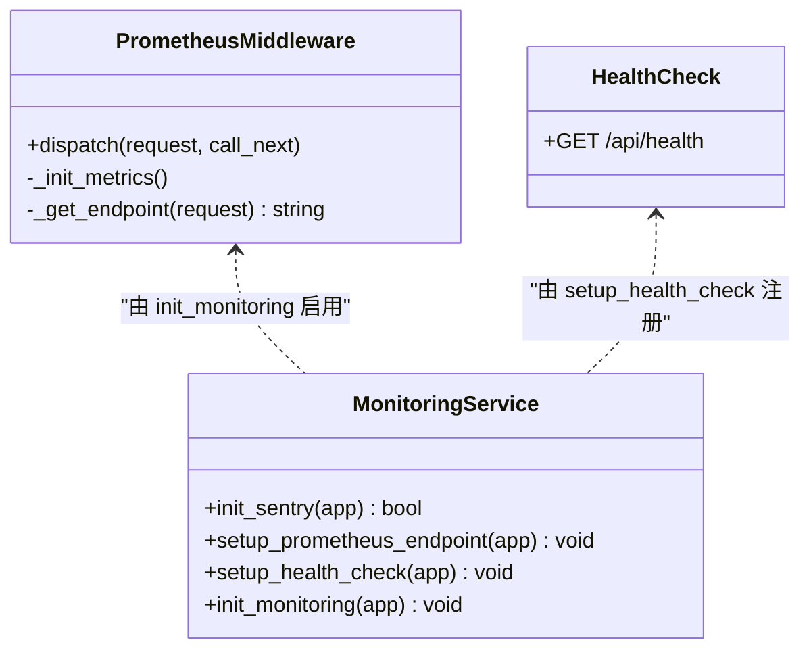
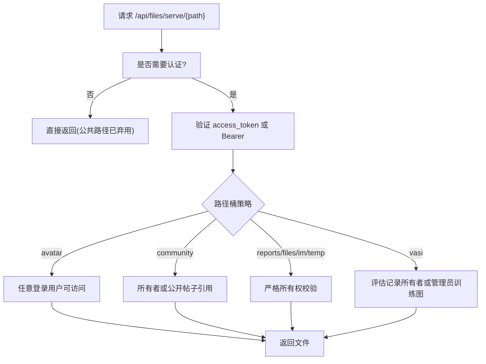
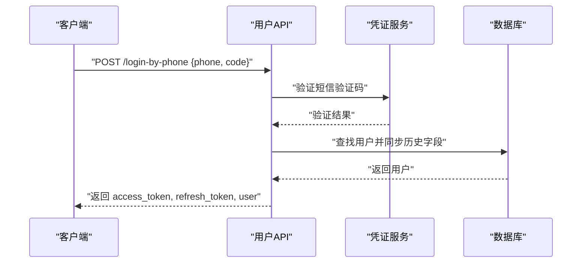
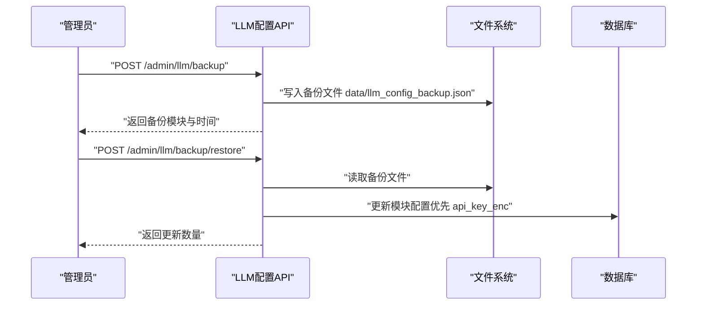
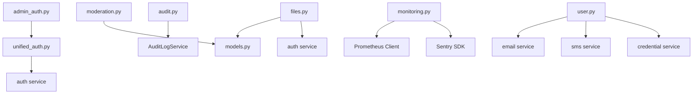

# 管理后台服务

<cite>
**本文引用的文件**   
- [web/backend/services/admin_auth.py](file://web/backend/services/admin_auth.py)
- [web/backend/services/unified_auth.py](file://web/backend/services/unified_auth.py)
- [web/backend/api/moderation.py](file://web/backend/api/moderation.py)
- [web/backend/api/audit.py](file://web/backend/api/audit.py)
- [web/backend/api/analytics.py](file://web/backend/api/analytics.py)
- [web/backend/services/monitoring.py](file://web/backend/services/monitoring.py)
- [web/backend/api/files.py](file://web/backend/api/files.py)
- [web/backend/api/user.py](file://web/backend/api/user.py)
- [web/backend/database/models.py](file://web/backend/database/models.py)
- [web/admin/src/views/SystemMonitor.vue](file://web/admin/src/views/SystemMonitor.vue)
- [web/admin/src/views/LLMConfig.vue](file://web/admin/src/views/LLMConfig.vue)
- [web/backend/api/llm_config_admin.py](file://web/backend/api/llm_config_admin.py)
- [web/app/src/api/moderation.ts](file://web/app/src/api/moderation.ts)
</cite>

## 目录
1. [简介](#简介)
2. [项目结构](#项目结构)
3. [核心组件](#核心组件)
4. [架构总览](#架构总览)
5. [详细组件分析](#详细组件分析)
6. [依赖关系分析](#依赖关系分析)
7. [性能考量](#性能考量)
8. [故障排查指南](#故障排查指南)
9. [结论](#结论)
10. [附录](#附录)

## 简介
本技术文档面向管理后台服务，围绕管理员认证与权限控制、系统监控面板、内容审核工具、配置管理界面等核心能力进行系统化说明。同时覆盖用户管理、内容管理、系统配置、日志审计与性能监控、批量操作、数据导入导出、备份恢复与故障诊断等运维与管理场景，帮助读者快速理解并安全高效地使用管理后台。

## 项目结构
后端采用 FastAPI 模块化路由组织，按功能划分 API 模块（如 moderation、audit、analytics、files、user），并通过 services 层提供统一认证、审计、监控等服务能力；数据库模型集中在 models.py；前端管理端位于 web/admin，包含监控、配置、登录等页面。

图表来源
- [web/backend/api/moderation.py:1-418](file://web/backend/api/moderation.py#L1-L418)
- [web/backend/api/audit.py:1-124](file://web/backend/api/audit.py#L1-L124)
- [web/backend/api/analytics.py:1-88](file://web/backend/api/analytics.py#L1-L88)
- [web/backend/api/files.py:1-503](file://web/backend/api/files.py#L1-L503)
- [web/backend/api/user.py:1-800](file://web/backend/api/user.py#L1-L800)
- [web/backend/services/monitoring.py:1-260](file://web/backend/services/monitoring.py#L1-L260)
- [web/backend/database/models.py:848-873](file://web/backend/database/models.py#L848-L873)
- [web/admin/src/views/SystemMonitor.vue:1-40](file://web/admin/src/views/SystemMonitor.vue#L1-L40)
- [web/admin/src/views/LLMConfig.vue:31-506](file://web/admin/src/views/LLMConfig.vue#L31-L506)
- [web/backend/api/llm_config_admin.py:205-335](file://web/backend/api/llm_config_admin.py#L205-L335)

章节来源
- [web/backend/api/moderation.py:1-418](file://web/backend/api/moderation.py#L1-L418)
- [web/backend/api/audit.py:1-124](file://web/backend/api/audit.py#L1-L124)
- [web/backend/api/analytics.py:1-88](file://web/backend/api/analytics.py#L1-L88)
- [web/backend/api/files.py:1-503](file://web/backend/api/files.py#L1-L503)
- [web/backend/api/user.py:1-800](file://web/backend/api/user.py#L1-L800)
- [web/backend/services/monitoring.py:1-260](file://web/backend/services/monitoring.py#L1-L260)
- [web/backend/database/models.py:848-873](file://web/backend/database/models.py#L848-L873)
- [web/admin/src/views/SystemMonitor.vue:1-40](file://web/admin/src/views/SystemMonitor.vue#L1-L40)
- [web/admin/src/views/LLMConfig.vue:31-506](file://web/admin/src/views/LLMConfig.vue#L31-L506)
- [web/backend/api/llm_config_admin.py:205-335](file://web/backend/api/llm_config_admin.py#L205-L335)

## 核心组件
- 管理员认证与权限控制
  - 统一认证中间件支持 JWT Bearer，校验当前用户并限制非活跃账号访问。
  - 管理员鉴权通过 is_admin 字段与环境变量白名单二次校验，禁止运行时自动提升权限。
- 内容审核
  - 提供待审列表、审核动作（通过/拒绝/升级）、用户违规记录与通知、历史查询等。
- 审计日志
  - 提供创建、查询、撤销与目标追踪的审计接口，支持按目标类型与 ID 回溯操作轨迹。
- 统计分析
  - 提供概览、趋势、页面访问、转化漏斗、功能使用、注册趋势、用户旅程等统计接口。
- 文件服务
  - 短时效文件访问令牌、路径所有权校验、多桶策略（avatar/community/reports/files/im/temp/vasi）访问控制、PDF 分页预览与 HTML 自包含查看器。
- 用户管理
  - 多种登录方式（用户名密码、手机验证码、邮箱验证码及对应密码登录）、注册、绑定/解绑凭证、头像上传、密码设置与重置、IP 维度验证码限速。
- 监控与指标
  - Sentry 错误追踪、Prometheus 指标收集、健康检查端点。
- 配置管理
  - LLM 配置模块的刷新、备份与恢复，支持密文存储与掩码响应。

章节来源
- [web/backend/services/unified_auth.py:1-43](file://web/backend/services/unified_auth.py#L1-L43)
- [web/backend/services/admin_auth.py:1-56](file://web/backend/services/admin_auth.py#L1-L56)
- [web/backend/api/moderation.py:1-418](file://web/backend/api/moderation.py#L1-L418)
- [web/backend/api/audit.py:1-124](file://web/backend/api/audit.py#L1-L124)
- [web/backend/api/analytics.py:1-88](file://web/backend/api/analytics.py#L1-L88)
- [web/backend/api/files.py:1-503](file://web/backend/api/files.py#L1-L503)
- [web/backend/api/user.py:1-800](file://web/backend/api/user.py#L1-L800)
- [web/backend/services/monitoring.py:1-260](file://web/backend/services/monitoring.py#L1-L260)
- [web/backend/api/llm_config_admin.py:205-335](file://web/backend/api/llm_config_admin.py#L205-L335)

## 架构总览
管理后台服务以 FastAPI 为核心，各业务模块通过路由注册到主应用，服务层封装认证、审计、监控、LLM 配置等通用能力，数据库模型集中定义实体与关系。前端管理端通过 API 调用实现监控、配置、审核等功能。

图表来源
- [web/backend/api/analytics.py:1-88](file://web/backend/api/analytics.py#L1-L88)
- [web/backend/services/admin_auth.py:1-56](file://web/backend/services/admin_auth.py#L1-L56)
- [web/backend/services/monitoring.py:1-260](file://web/backend/services/monitoring.py#L1-L260)

## 详细组件分析

### 管理员认证与权限控制
- 统一认证：基于 HTTPBearer，解析 Bearer Token 获取当前用户，未通过则返回 401。
- 管理员鉴权：要求 User.is_admin=True；环境变量 ADMIN_PHONES 仅作为二次只读门控，不自动提升权限。
- 活跃状态检查：非活跃账号将被拒绝访问。

图表来源
- [web/backend/services/unified_auth.py:1-43](file://web/backend/services/unified_auth.py#L1-L43)
- [web/backend/services/admin_auth.py:1-56](file://web/backend/services/admin_auth.py#L1-L56)

章节来源
- [web/backend/services/unified_auth.py:1-43](file://web/backend/services/unified_auth.py#L1-L43)
- [web/backend/services/admin_auth.py:1-56](file://web/backend/services/admin_auth.py#L1-L56)

### 内容审核工具
- 待审列表：支持风险等级过滤、分页、作者与标题信息聚合。
- 审核动作：通过/拒绝/升级，拒绝时可禁言或封号，并生成通知与违规记录。
- 用户审核档案：展示违规计数、最近处理记录与状态。
- 历史查询：按状态分页查询已处理的审核记录。

图表来源
- [web/backend/api/moderation.py:1-418](file://web/backend/api/moderation.py#L1-L418)

章节来源
- [web/backend/api/moderation.py:1-418](file://web/backend/api/moderation.py#L1-L418)
- [web/backend/database/models.py:848-873](file://web/backend/database/models.py#L848-L873)
- [web/app/src/api/moderation.ts:1-70](file://web/app/src/api/moderation.ts#L1-L70)

### 审计日志与操作追踪
- 创建审计日志：记录操作人、动作、目标类型与 ID、范围、详情、可撤销标志与 IP。
- 查询与详情：支持分页与按 ID 查询。
- 撤销：支持对可撤销日志进行撤销操作。
- 目标追踪：按目标类型与 ID 拉取相关审计轨迹，非管理员仅能查看自身操作。

图表来源
- [web/backend/api/audit.py:1-124](file://web/backend/api/audit.py#L1-L124)

章节来源
- [web/backend/api/audit.py:1-124](file://web/backend/api/audit.py#L1-L124)

### 系统监控面板与性能指标
- 监控面板：前端 SystemMonitor.vue 展示 CPU、内存等指标卡片与进度条。
- 指标采集：Prometheus 中间件收集请求总数、耗时、并发数，暴露 /metrics 端点。
- 错误追踪：Sentry 初始化与敏感信息过滤，支持手动捕获异常。
- 健康检查：/api/health 检查数据库连接与磁盘空间。

图表来源
- [web/backend/services/monitoring.py:1-260](file://web/backend/services/monitoring.py#L1-L260)
- [web/admin/src/views/SystemMonitor.vue:1-40](file://web/admin/src/views/SystemMonitor.vue#L1-L40)

章节来源
- [web/backend/services/monitoring.py:1-260](file://web/backend/services/monitoring.py#L1-L260)
- [web/admin/src/views/SystemMonitor.vue:1-40](file://web/admin/src/views/SystemMonitor.vue#L1-L40)

### 文件服务与安全访问控制
- 短时效文件令牌：/api/files/access-token 颁发仅用于文件读取的短期令牌。
- 路径所有权校验：按桶策略（avatar/community/reports/files/im/temp/vasi）校验访问者身份与公开性。
- PDF 分页预览与 HTML 查看器：/api/files/view/{file_id} 提供自包含 HTML 预览，兼容微信内置浏览器。
- 临时文件清理：/api/files/cleanup-temp 清理过期临时上传。

图表来源
- [web/backend/api/files.py:1-503](file://web/backend/api/files.py#L1-L503)

章节来源
- [web/backend/api/files.py:1-503](file://web/backend/api/files.py#L1-L503)

### 用户管理与认证流程
- 登录方式：用户名密码、手机验证码、邮箱验证码以及对应的密码登录。
- 注册流程：支持手机号与邮箱注册，绑定凭证并同步历史字段。
- 凭证管理：绑定/解绑手机号与邮箱，列出凭证，设置与重置密码。
- 安全机制：IP 维度验证码发送限速，防止分布式骚扰。

图表来源
- [web/backend/api/user.py:1-800](file://web/backend/api/user.py#L1-L800)

章节来源
- [web/backend/api/user.py:1-800](file://web/backend/api/user.py#L1-L800)

### 配置管理界面（LLM 配置）
- 刷新配置：从环境变量刷新 LLM 配置模块。
- 备份与恢复：创建初始配置备份（含密文 api_key_enc），恢复时优先解密密文字段，兼容旧明文备份，跳过掩码值避免污染配置。
- 前端交互：LLMConfig.vue 提供初始模式栏、重新备份与一键恢复按钮。

图表来源
- [web/backend/api/llm_config_admin.py:205-335](file://web/backend/api/llm_config_admin.py#L205-L335)
- [web/admin/src/views/LLMConfig.vue:31-506](file://web/admin/src/views/LLMConfig.vue#L31-L506)

章节来源
- [web/backend/api/llm_config_admin.py:205-335](file://web/backend/api/llm_config_admin.py#L205-L335)
- [web/admin/src/views/LLMConfig.vue:31-506](file://web/admin/src/views/LLMConfig.vue#L31-L506)

## 依赖关系分析
- 认证与授权依赖：unified_auth 依赖 auth 服务与数据库会话；admin_auth 依赖 get_current_user 与环境变量白名单。
- 内容审核依赖：moderation 依赖 ContentModeration、Post、User、UserViolation、UserViolationLog 等模型。
- 审计日志依赖：audit 依赖 AuditLogService 与审计模型。
- 监控依赖：monitoring 集成 Sentry 与 Prometheus，注册健康检查端点。
- 文件服务依赖：files 依赖认证、数据库模型与文件系统路径策略。
- 用户管理依赖：user 依赖凭证服务、短信/邮件服务与审计服务。

图表来源
- [web/backend/services/unified_auth.py:1-43](file://web/backend/services/unified_auth.py#L1-L43)
- [web/backend/services/admin_auth.py:1-56](file://web/backend/services/admin_auth.py#L1-L56)
- [web/backend/api/moderation.py:1-418](file://web/backend/api/moderation.py#L1-L418)
- [web/backend/api/audit.py:1-124](file://web/backend/api/audit.py#L1-L124)
- [web/backend/services/monitoring.py:1-260](file://web/backend/services/monitoring.py#L1-L260)
- [web/backend/api/files.py:1-503](file://web/backend/api/files.py#L1-L503)
- [web/backend/api/user.py:1-800](file://web/backend/api/user.py#L1-L800)
- [web/backend/database/models.py:848-873](file://web/backend/database/models.py#L848-L873)

章节来源
- [web/backend/services/unified_auth.py:1-43](file://web/backend/services/unified_auth.py#L1-L43)
- [web/backend/services/admin_auth.py:1-56](file://web/backend/services/admin_auth.py#L1-L56)
- [web/backend/api/moderation.py:1-418](file://web/backend/api/moderation.py#L1-L418)
- [web/backend/api/audit.py:1-124](file://web/backend/api/audit.py#L1-L124)
- [web/backend/services/monitoring.py:1-260](file://web/backend/services/monitoring.py#L1-L260)
- [web/backend/api/files.py:1-503](file://web/backend/api/files.py#L1-L503)
- [web/backend/api/user.py:1-800](file://web/backend/api/user.py#L1-L800)
- [web/backend/database/models.py:848-873](file://web/backend/database/models.py#L848-L873)

## 性能考量
- 指标采集：Prometheus 中间件按方法、端点、状态码分组计数，使用直方图记录请求耗时，Gauge 跟踪并发请求数，避免高基数标签。
- 错误追踪：Sentry 过滤敏感头与参数，降低事件噪声与隐私风险。
- 健康检查：/api/health 快速检测数据库连通性与磁盘空间，便于自动化巡检。
- 文件服务：短时效令牌减少长生命周期凭据泄露风险；路径所有权校验避免越权访问。
- 验证码限速：IP 维度限制发送频率，抑制分布式攻击。

[本节为通用指导，无需特定文件来源]

## 故障排查指南
- 认证失败
  - 检查 Bearer Token 是否有效，确认用户是否活跃，管理员权限是否通过 is_admin 授予。
  - 参考：[web/backend/services/unified_auth.py:1-43](file://web/backend/services/unified_auth.py#L1-L43)、[web/backend/services/admin_auth.py:1-56](file://web/backend/services/admin_auth.py#L1-L56)
- 内容审核问题
  - 核对审核记录状态、风险等级与分类；确认拒绝动作是否触发禁言或封号；检查通知是否生成。
  - 参考：[web/backend/api/moderation.py:1-418](file://web/backend/api/moderation.py#L1-L418)
- 审计日志缺失
  - 确认操作是否调用审计接口；检查目标追踪是否受非管理员限制。
  - 参考：[web/backend/api/audit.py:1-124](file://web/backend/api/audit.py#L1-L124)
- 文件访问被拒
  - 检查文件桶策略与所有权；确认是否使用正确的短时效令牌；查看 PDF 分页是否存在。
  - 参考：[web/backend/api/files.py:1-503](file://web/backend/api/files.py#L1-L503)
- 监控无数据
  - 确认 Prometheus 中间件是否启用，/metrics 端点是否可达；检查 Sentry DSN 与环境变量。
  - 参考：[web/backend/services/monitoring.py:1-260](file://web/backend/services/monitoring.py#L1-L260)
- 配置恢复失败
  - 检查备份文件是否存在；确认 api_key_enc 解密逻辑与掩码值处理。
  - 参考：[web/backend/api/llm_config_admin.py:205-335](file://web/backend/api/llm_config_admin.py#L205-L335)

章节来源
- [web/backend/services/unified_auth.py:1-43](file://web/backend/services/unified_auth.py#L1-L43)
- [web/backend/services/admin_auth.py:1-56](file://web/backend/services/admin_auth.py#L1-L56)
- [web/backend/api/moderation.py:1-418](file://web/backend/api/moderation.py#L1-L418)
- [web/backend/api/audit.py:1-124](file://web/backend/api/audit.py#L1-L124)
- [web/backend/api/files.py:1-503](file://web/backend/api/files.py#L1-L503)
- [web/backend/services/monitoring.py:1-260](file://web/backend/services/monitoring.py#L1-L260)
- [web/backend/api/llm_config_admin.py:205-335](file://web/backend/api/llm_config_admin.py#L205-L335)

## 结论
管理后台服务通过统一的认证与权限控制、完善的内容审核与审计机制、全面的监控与指标采集、安全的文件访问控制以及灵活的配置管理能力，构建了稳定可靠的管理平台。建议在生产环境中强化环境变量与密钥管理、启用 Sentry 与 Prometheus 监控、定期备份与演练恢复流程，确保系统在高可用与合规的前提下持续运行。

[本节为总结性内容，无需特定文件来源]

## 附录
- 常用管理接口速览
  - 内容审核：/api/moderation/pending、/api/moderation/{id}/review、/api/moderation/history
  - 审计日志：/api/audit/logs、/api/audit/logs/{id}、/api/audit/logs/{id}/revoke、/api/audit/target/{type}/{id}
  - 统计分析：/api/analytics/overview、/api/analytics/trend、/api/analytics/page-views、/api/analytics/funnel、/api/analytics/feature-usage、/api/analytics/registration-trend、/api/analytics/user-journeys
  - 文件服务：/api/files/access-token、/api/files/serve/{path}、/api/files/view/{file_id}、/api/files/pages/{file_id}/{page_name}、/api/files/cleanup-temp
  - 用户管理：/api/user/login、/api/user/register、/api/user/bind-phone、/api/user/bind-email、/api/user/set-password、/api/user/reset-password
  - 配置管理：/admin/llm/refresh、/admin/llm/backup、/admin/llm/backup/restore
  - 监控：/api/health、/metrics

[本节为补充信息，无需特定文件来源]