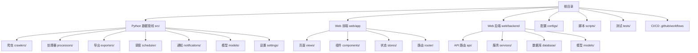
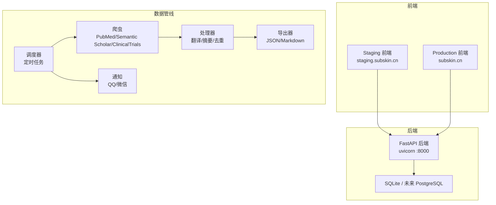
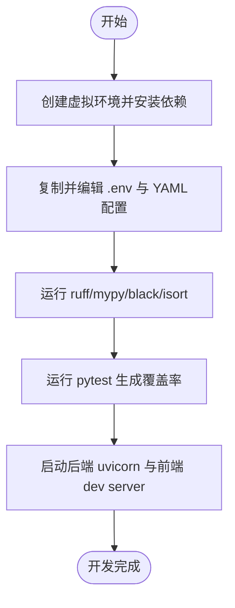
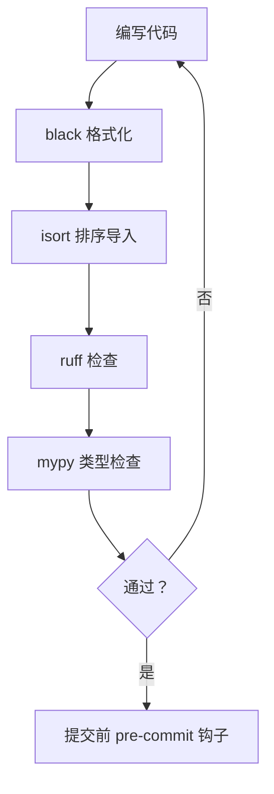
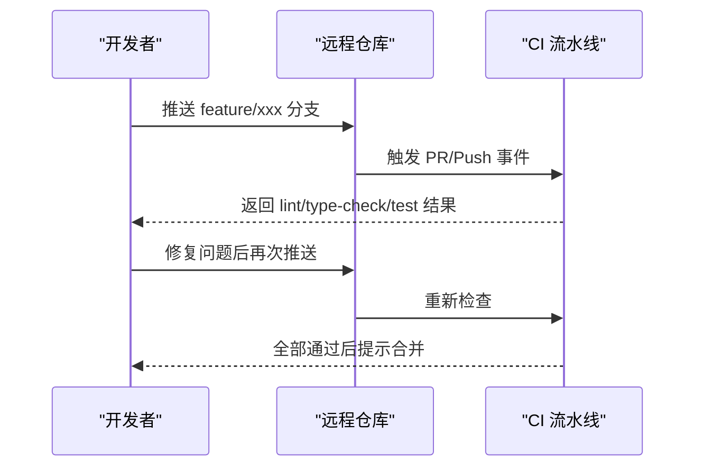
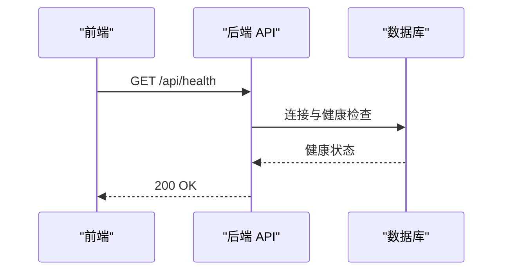
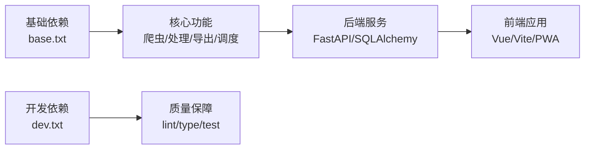

# 开发指南

<cite>
**本文引用的文件**
- [README.md](file://README.md)
- [INSTALLATION.md](file://INSTALLATION.md)
- [Makefile](file://Makefile)
- [pyproject.toml](file://pyproject.toml)
- [.pre-commit-config.yaml](file://.pre-commit-config.yaml)
- [configs/web_config.yaml](file://configs/web_config.yaml)
- [configs/crawler_config.yaml](file://configs/crawler_config.yaml)
- [requirements/base.txt](file://requirements/base.txt)
- [requirements/dev.txt](file://requirements/dev.txt)
- [.github/workflows/ci.yml](file://.github/workflows/ci.yml)
- [.github/workflows/test.yml](file://.github/workflows/test.yml)
- [AGENTS.md](file://AGENTS.md)
</cite>

## 目录
1. [简介](#简介)
2. [项目结构](#项目结构)
3. [核心组件](#核心组件)
4. [架构总览](#架构总览)
5. [详细组件分析](#详细组件分析)
6. [依赖分析](#依赖分析)
7. [性能考虑](#性能考虑)
8. [故障排查指南](#故障排查指南)
9. [结论](#结论)
10. [附录](#附录)

## 简介
本指南面向 SubSkin 项目的开发者与贡献者，覆盖开发环境搭建、代码风格规范、Git 工作流与提交信息格式、调试技巧、常见问题排查、性能分析方法、开发工具使用、代码审查流程、分支管理策略、版本发布流程与贡献者指南。内容基于仓库现有配置与工作流，确保可操作、可复现、可协作。

## 项目结构
SubSkin 采用前后端分离与数据流水线并行的多模块结构：
- Python 数据 Pipeline（src/）：爬虫、处理、导出、调度、通知、模型与设置
- Web 前端（web/app）：Vue 3 + TypeScript + Vite + Tailwind CSS + PWA
- Web 后端（web/backend）：FastAPI + SQLAlchemy + Alembic 迁移
- 配置与脚本（configs/, scripts/）：YAML 配置、部署与运维脚本
- 测试与质量（tests/, .pre-commit-config.yaml, Makefile, pyproject.toml）：pytest、ruff、mypy、black、isort
- CI/CD（.github/workflows）：CI 构建、Lint、类型检查、测试与覆盖率上报

**章节来源**
- [README.md:113-144](file://README.md#L113-L144)
- [INSTALLATION.md:62-79](file://INSTALLATION.md#L62-L79)

## 核心组件
- 数据管道：负责从 PubMed、Semantic Scholar、ClinicalTrials.gov 等源采集文献，进行翻译、摘要、去重与导出，支持定时调度与通知推送。
- Web 前端：PWA 应用，提供社区、百科、评估追踪、AI 助手等功能；遵循响应式与一致性设计原则。
- Web 后端：FastAPI 提供 REST API，结合 SQLAlchemy ORM 与 Alembic 管理数据库迁移；包含鉴权、社区、VASI、RAG、IM 等服务。
- 配置中心：YAML 配置文件集中管理站点、认证、数据库、LLM、搜索、邮件、监控与安全策略。
- 质量保障：ruff/lint、black/isort/format、mypy/type-check、pytest/test、pre-commit hooks、CI 流水线。

**章节来源**
- [README.md:29-65](file://README.md#L29-L65)
- [configs/web_config.yaml:1-284](file://configs/web_config.yaml#L1-L284)
- [configs/crawler_config.yaml:1-143](file://configs/crawler_config.yaml#L1-L143)
- [requirements/base.txt:1-37](file://requirements/base.txt#L1-L37)
- [requirements/dev.txt:1-46](file://requirements/dev.txt#L1-L46)

## 架构总览
SubSkin 的架构由“前端 PWA + 共享后端 FastAPI + 数据 Pipeline”组成，并通过 Nginx 对外提供服务。Staging 与 Production 前端独立部署，后端为单实例共享，数据库为 SQLite（或未来 PostgreSQL）。

**图表来源**
- [AGENTS.md:45-88](file://AGENTS.md#L45-L88)

**章节来源**
- [AGENTS.md:45-88](file://AGENTS.md#L45-L88)

## 详细组件分析

### 开发环境与工具链
- Python 环境：使用 venv 隔离，安装 base/dev 依赖；通过 Makefile 统一命令执行 lint、format、type-check、test、run-dev。
- 前端环境：Node.js 18+，npm 9+；在 web/app 下执行 dev/build/lint/type-check。
- 配置管理：环境变量通过 python-dotenv 加载；YAML 配置用于站点、认证、数据库、LLM、搜索、邮件、监控与安全。
- 代码质量：ruff 检查与格式化、black/isort 格式化与导入排序、mypy 类型检查、pytest 测试与覆盖率、pre-commit 钩子检测敏感信息。
- CI/CD：GitHub Actions 在多 Python 版本上执行 lint、type-check、test 与覆盖率上报。

**图表来源**
- [Makefile:25-107](file://Makefile#L25-L107)
- [INSTALLATION.md:19-48](file://INSTALLATION.md#L19-L48)
- [requirements/base.txt:1-37](file://requirements/base.txt#L1-L37)
- [requirements/dev.txt:1-46](file://requirements/dev.txt#L1-L46)
- [.pre-commit-config.yaml:1-15](file://.pre-commit-config.yaml#L1-L15)

**章节来源**
- [INSTALLATION.md:1-112](file://INSTALLATION.md#L1-L112)
- [Makefile:1-136](file://Makefile#L1-L136)
- [pyproject.toml:1-58](file://pyproject.toml#L1-L58)
- [.pre-commit-config.yaml:1-15](file://.pre-commit-config.yaml#L1-L15)

### 代码风格规范
- Python：black 格式化（行宽 88）、isort 导入排序、ruff 检查、mypy 类型检查；函数签名需类型注解，异常使用具体类型，文档字符串采用 Google 风格。
- 命名约定：文件 snake_case，类 PascalCase，函数/变量 snake_case，常量 UPPER_SNAKE_CASE，私有以单下划线开头。
- 错误处理：捕获具体异常并抛出领域异常，避免裸 except。
- 前端：遵循 PWA-first、响应式优先、触摸友好、主题一致、图标系统（RemixIcon）与容器宽度统一等原则。

**图表来源**
- [pyproject.toml:12-35](file://pyproject.toml#L12-L35)
- [requirements/dev.txt:7-17](file://requirements/dev.txt#L7-L17)
- [AGENTS.md:416-506](file://AGENTS.md#L416-L506)

**章节来源**
- [AGENTS.md:416-506](file://AGENTS.md#L416-L506)
- [pyproject.toml:12-35](file://pyproject.toml#L12-L35)

### Git 工作流与提交信息格式
- 分支命名：feature/<name>、fix/<name>、crawler/<name>、docs/<name>。
- 提交信息：<type>(<scope>): <subject>，可选 body/footer；类型包括 feat、fix、docs、style、refactor、test、chore、crawler、ai。
- 工作流：Fork → 创建分支 → 提交更改 → 创建 PR → CI 检查 → 合并到 main。

**图表来源**
- [AGENTS.md:526-552](file://AGENTS.md#L526-L552)
- [.github/workflows/ci.yml:1-77](file://.github/workflows/ci.yml#L1-L77)
- [.github/workflows/test.yml:1-42](file://.github/workflows/test.yml#L1-L42)

**章节来源**
- [AGENTS.md:526-552](file://AGENTS.md#L526-L552)
- [.github/workflows/ci.yml:1-77](file://.github/workflows/ci.yml#L1-L77)
- [.github/workflows/test.yml:1-42](file://.github/workflows/test.yml#L1-L42)

### 调试技巧
- 后端调试：使用 uvicorn 的 --reload 模式快速热重载；结合 pdbpp 增强调试体验；通过 /api/health 验证后端健康。
- 前端调试：Vite dev server 自动代理 /api 至后端；浏览器开发者工具 Network 面板查看请求与响应；PWA 更新通过 version.json 轮询提示。
- 日志与指标：启用 metrics 端口（默认 9090），结合 Sentry（可选）进行错误追踪；CORS 与 CSP 安全头需在配置中开启并校验。

**图表来源**
- [Makefile:104-107](file://Makefile#L104-L107)
- [configs/web_config.yaml:232-251](file://configs/web_config.yaml#L232-L251)

**章节来源**
- [INSTALLATION.md:43-60](file://INSTALLATION.md#L43-L60)
- [configs/web_config.yaml:232-251](file://configs/web_config.yaml#L232-L251)

### 常见问题排查
- 虚拟环境问题：删除 .venv 重建并重新安装依赖。
- 前端依赖问题：删除 node_modules 与 package-lock.json 重装。
- API 密钥无效：检查账户额度与密钥格式；确认 .env 已正确加载。
- 数据库迁移：使用 alembic upgrade head 执行迁移；必要时回滚或修正迁移脚本。
- 网络与速率限制：调整爬虫 rate_limit 与重试策略；关注超时与连接超时配置。

**章节来源**
- [INSTALLATION.md:107-112](file://INSTALLATION.md#L107-L112)
- [configs/crawler_config.yaml:117-143](file://configs/crawler_config.yaml#L117-L143)

### 性能分析方法
- 后端指标：启用 metrics 端口（默认 9090），收集请求耗时、QPS、错误率等指标。
- 前端性能：PWA 缓存与服务 Worker 优化；减少首屏资源体积；合理使用 dvh 与 safe-area 提升移动端渲染性能。
- 数据管线：合理设置缓存 TTL、分页与并发；对 LLM 调用进行限流与重试；记录原始数据以保证可重复性。

**章节来源**
- [configs/web_config.yaml:232-251](file://configs/web_config.yaml#L232-L251)
- [AGENTS.md:555-573](file://AGENTS.md#L555-L573)
- [configs/crawler_config.yaml:40-43](file://configs/crawler_config.yaml#L40-L43)

### 开发工具使用
- 代码质量：ruff check/format、black、isort、mypy、pytest、coverage。
- 预提交钩子：detect-secrets 防止敏感信息泄露。
- 文档与站点：mkdocs 生成文档站点；VitePress 百科内容管理。
- 部署与运维：Nginx 配置与 systemd 服务；version.json 与 PWA 更新机制。

**章节来源**
- [requirements/dev.txt:7-36](file://requirements/dev.txt#L7-L36)
- [.pre-commit-config.yaml:1-15](file://.pre-commit-config.yaml#L1-L15)
- [AGENTS.md:268-286](file://AGENTS.md#L268-L286)

## 依赖分析
- Python 基础依赖：requests、BeautifulSoup、lxml、OpenAI/Anthropic、SQLAlchemy、Pydantic、Redis、FastAPI、Uvicorn、Jinja2、httpx、tqdm、PyYAML、tenacity、MKDocs、阿里云视觉 SDK。
- 开发依赖：pytest、pytest-cov、pytest-mock、black、mypy、pre-commit、mkdocs、ipython、jupyter、pdbpp、bandit、safety、radon、build、twine、setuptools、alembic、sqlalchemy-utils。
- 前端依赖：Vue 3、TypeScript、Vite、Tailwind CSS、Pinia、RemixIcon、Service Worker、Manifest。

**图表来源**
- [requirements/base.txt:1-37](file://requirements/base.txt#L1-L37)
- [requirements/dev.txt:1-46](file://requirements/dev.txt#L1-L46)

**章节来源**
- [requirements/base.txt:1-37](file://requirements/base.txt#L1-L37)
- [requirements/dev.txt:1-46](file://requirements/dev.txt#L1-L46)

## 性能考虑
- 后端：合理设置数据库连接池与回收时间；启用 Redis 缓存会话与热点数据；对 LLM 调用进行温度、最大 token 与重试控制。
- 前端：使用 dvh 与 safe-area 适配移动端；避免全局样式破坏布局；复用组件与样式类；PWA 缓存策略优化首屏与离线体验。
- 数据管线：设置合理的 rate_limit、max_requests_per_day、cache_ttl；分页与过滤减少不必要的数据传输；保留原始数据以便回溯。

**章节来源**
- [configs/web_config.yaml:61-79](file://configs/web_config.yaml#L61-L79)
- [configs/web_config.yaml:80-112](file://configs/web_config.yaml#L80-L112)
- [configs/crawler_config.yaml:12-43](file://configs/crawler_config.yaml#L12-L43)
- [AGENTS.md:555-573](file://AGENTS.md#L555-L573)

## 故障排查指南
- 环境搭建失败：检查 Python/Node 版本；清理并重建 venv 与 node_modules；确认 .env 与 YAML 配置正确。
- 后端无法启动：检查端口占用与 CORS/CSP 配置；验证数据库连接与迁移状态；查看 uvicorn 日志。
- 前端构建失败：检查 TypeScript 类型检查与 ESLint；确认依赖版本兼容；清理缓存后重试。
- 爬虫异常：调整 rate_limit、超时与重试策略；检查 API Key 与配额；查看输出目录与日志。
- 部署问题：核对 staging/production 差异；验证 version.json 与 PWA 更新；检查 Nginx 配置与 systemd 服务。

**章节来源**
- [INSTALLATION.md:107-112](file://INSTALLATION.md#L107-L112)
- [configs/web_config.yaml:253-284](file://configs/web_config.yaml#L253-L284)
- [configs/crawler_config.yaml:117-143](file://configs/crawler_config.yaml#L117-L143)
- [AGENTS.md:199-237](file://AGENTS.md#L199-L237)

## 结论
SubSkin 提供了完整的前后端与数据管线架构，配合严格的代码质量与 CI/CD 流程，确保开发与交付的可控性与稳定性。遵循本指南的环境搭建、代码规范、Git 工作流与调试方法，可有效提升团队协作效率与项目质量。建议在新增功能时同步更新 AI 导航与知识库，保持用户入口与后端能力的一致性。

## 附录
- 常用命令
  - 后端：make run-dev、make lint、make format、make type-check、make test
  - 前端：cd web/app && npm run dev、npm run build、npm run lint、npm run type-check
  - 数据管线：python -m src.cli pubmed --query "vitiligo" --limit 10、python -m src.cli run-scheduler
- 配置要点
  - 环境变量：OPENAI_API_KEY、NCBI_API_KEY、JWT_SECRET_KEY、DATABASE_URL、REDIS_URL 等
  - YAML：站点信息、认证、数据库、LLM、搜索、邮件、监控与安全
- 发布流程
  - 先部署到 staging，用户确认后全量同步至 production；记录变更到 DEPLOY_LOG.md；验证 PWA 更新与后端健康

**章节来源**
- [README.md:68-110](file://README.md#L68-L110)
- [INSTALLATION.md:19-48](file://INSTALLATION.md#L19-L48)
- [configs/web_config.yaml:1-284](file://configs/web_config.yaml#L1-L284)
- [AGENTS.md:91-159](file://AGENTS.md#L91-L159)