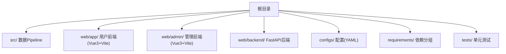
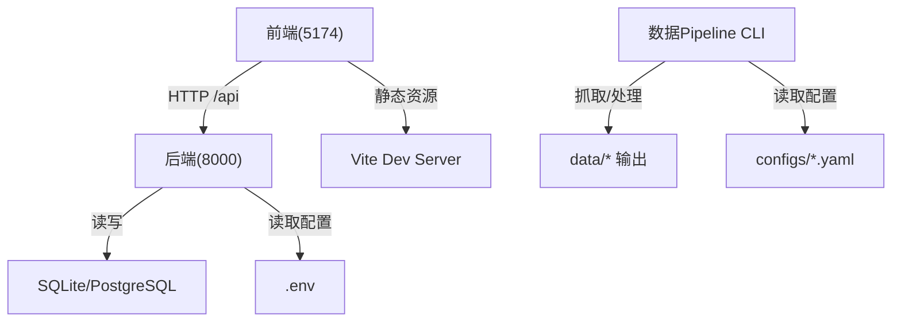
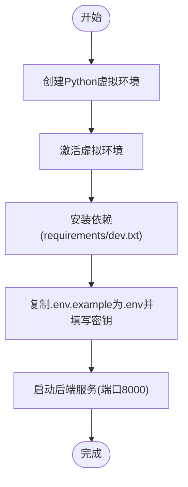
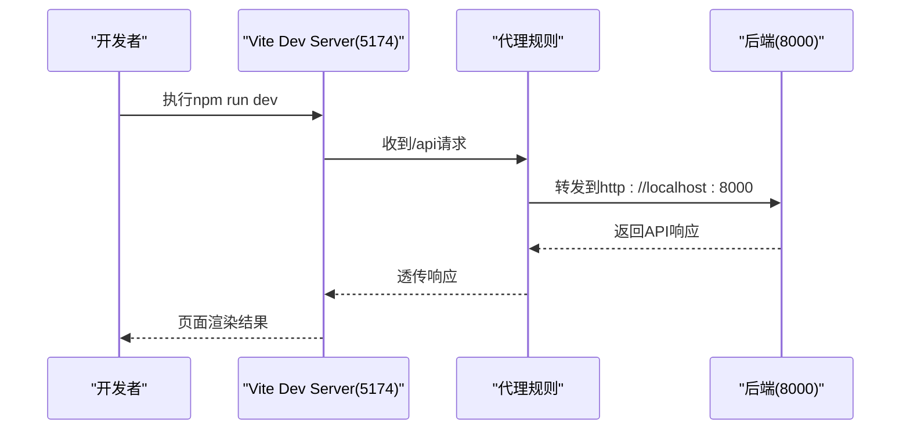
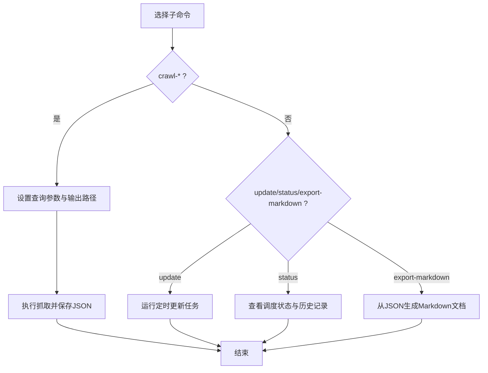
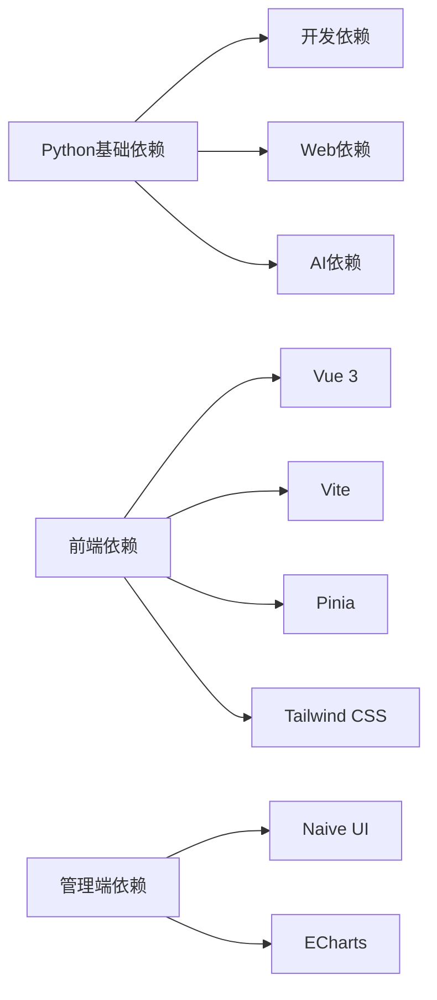

# 快速开始

<cite>
**本文引用的文件**   
- [README.md](file://README.md)
- [INSTALLATION.md](file://INSTALLATION.md)
- [Makefile](file://Makefile)
- [pyproject.toml](file://pyproject.toml)
- [web/app/package.json](file://web/app/package.json)
- [web/admin/package.json](file://web/admin/package.json)
- [web/app/vite.config.ts](file://web/app/vite.config.ts)
- [web/backend/.env.example](file://web/backend/.env.example)
- [configs/web_config.yaml](file://configs/web_config.yaml)
- [configs/crawler_config.yaml](file://configs/crawler_config.yaml)
- [src/cli.py](file://src/cli.py)
</cite>

## 目录
1. [简介](#简介)
2. [项目结构](#项目结构)
3. [核心组件](#核心组件)
4. [架构总览](#架构总览)
5. [详细组件分析](#详细组件分析)
6. [依赖分析](#依赖分析)
7. [性能考虑](#性能考虑)
8. [故障排除指南](#故障排除指南)
9. [结论](#结论)
10. [附录：一键启动与常用命令](#附录：一键启动与常用命令)

## 简介
本指南面向首次接触 SubSkin 的开发者，目标是帮助你在最短时间内完成环境准备、后端与前端本地运行、数据 Pipeline 的基本使用，并提供常见问题的排查思路。SubSkin 是一个以 AI 赋能的白癜风知识平台，包含数据采集与处理 Pipeline、FastAPI 后端、Vue 3 PWA 前端以及管理后台。

## 项目结构
- Python 数据 Pipeline（爬虫、处理、导出、调度）位于 src/
- Web 前端（用户端与管理端）位于 web/app 与 web/admin
- FastAPI 后端位于 web/backend
- 配置文件集中在 configs/，环境变量示例在 web/backend/.env.example
- Makefile 提供常用开发任务（安装、测试、格式化、类型检查、启动等）

**章节来源**
- [README.md:113-144](file://README.md#L113-L144)

## 核心组件
- 后端服务：FastAPI + Uvicorn，默认监听 8000 端口，支持热重载
- 前端应用：Vue 3 + Vite，开发服务器默认 5174 端口，自动代理 /api 到后端
- 数据 Pipeline：命令行工具，支持 PubMed/Semantic Scholar/ClinicalTrials.gov 抓取与导出
- 配置系统：YAML 配置与环境变量结合，LLM/数据库/认证等通过 .env 注入

**章节来源**
- [Makefile:105-107](file://Makefile#L105-L107)
- [web/app/vite.config.ts:96-108](file://web/app/vite.config.ts#L96-L108)
- [src/cli.py:211-325](file://src/cli.py#L211-L325)
- [web/backend/.env.example:1-91](file://web/backend/.env.example#L1-L91)

## 架构总览
下图展示了本地开发时前后端与数据 Pipeline 的交互关系：前端通过 Vite 代理将 API 请求转发至后端；数据 Pipeline 通过命令行调用爬虫与处理器，输出 JSON/Markdown 供后续使用或入库。

**图表来源**
- [web/app/vite.config.ts:96-108](file://web/app/vite.config.ts#L96-L108)
- [Makefile:105-107](file://Makefile#L105-L107)
- [configs/web_config.yaml:1-284](file://configs/web_config.yaml#L1-L284)
- [configs/crawler_config.yaml:1-143](file://configs/crawler_config.yaml#L1-L143)

## 详细组件分析

### 环境要求与前置准备
- 操作系统：Linux、macOS 或 Windows(WSL2)
- Python：3.10+
- Node.js：18+
- npm：9+
- 内存：建议至少 8GB

**章节来源**
- [INSTALLATION.md:3-8](file://INSTALLATION.md#L3-L8)
- [README.md:70-74](file://README.md#L70-L74)

### 后端开发环境搭建
- 创建并激活虚拟环境
- 安装开发依赖
- 复制并编辑环境变量（数据库、JWT、LLM、短信、邮件、OAuth 等）
- 启动后端服务（支持热重载）

**图表来源**
- [INSTALLATION.md:19-32](file://INSTALLATION.md#L19-L32)
- [Makefile:105-107](file://Makefile#L105-L107)
- [web/backend/.env.example:1-91](file://web/backend/.env.example#L1-L91)

**章节来源**
- [INSTALLATION.md:19-32](file://INSTALLATION.md#L19-L32)
- [Makefile:105-107](file://Makefile#L105-L107)

### 前端开发服务器启动
- 进入 web/app 目录
- 安装依赖
- 启动开发服务器（端口 5174），自动代理 /api 到后端 8000

**图表来源**
- [web/app/vite.config.ts:96-108](file://web/app/vite.config.ts#L96-L108)
- [web/app/package.json:6-13](file://web/app/package.json#L6-L13)

**章节来源**
- [README.md:95-101](file://README.md#L95-L101)
- [web/app/vite.config.ts:96-108](file://web/app/vite.config.ts#L96-L108)

### 数据 Pipeline 命令行使用方法
- 支持子命令：crawl-pubmed、crawl-scholar、crawl-trials、process、update、status、export-markdown
- 典型用法：
  - 抓取 PubMed 论文并导出 JSON
  - 运行定时更新任务
  - 查看调度状态与历史执行记录
  - 将论文导出为 Markdown

**图表来源**
- [src/cli.py:211-325](file://src/cli.py#L211-L325)

**章节来源**
- [README.md:103-109](file://README.md#L103-L109)
- [src/cli.py:211-325](file://src/cli.py#L211-L325)

### 环境变量与配置说明
- 后端环境变量（数据库、JWT、LLM、短信、邮件、OAuth 等）参考 web/backend/.env.example
- Web 配置（站点信息、认证、数据库、LLM/RAG、搜索、邮件、监控、安全等）参考 configs/web_config.yaml
- 爬虫配置（PubMed/Semantic Scholar/ClinicalTrials.gov）参考 configs/crawler_config.yaml

**章节来源**
- [web/backend/.env.example:1-91](file://web/backend/.env.example#L1-L91)
- [configs/web_config.yaml:1-284](file://configs/web_config.yaml#L1-L284)
- [configs/crawler_config.yaml:1-143](file://configs/crawler_config.yaml#L1-L143)

## 依赖分析
- Python 依赖分组：base、dev、web、ai（通过 pyproject 与 requirements 管理）
- 前端依赖：Vue 3、Vite、Pinia、Tailwind、PWA 插件等
- 管理端依赖：Naive UI、ECharts、Vue Router 等

**图表来源**
- [pyproject.toml:1-58](file://pyproject.toml#L1-L58)
- [web/app/package.json:14-53](file://web/app/package.json#L14-L53)
- [web/admin/package.json:11-28](file://web/admin/package.json#L11-L28)

**章节来源**
- [pyproject.toml:1-58](file://pyproject.toml#L1-L58)
- [web/app/package.json:14-53](file://web/app/package.json#L14-L53)
- [web/admin/package.json:11-28](file://web/admin/package.json#L11-L28)

## 性能考虑
- 后端建议使用生产模式关闭 --reload，避免额外开销
- 前端构建产物由 Nginx 托管，开发阶段使用 Vite 代理减少跨域问题
- 数据 Pipeline 抓取需遵守各 API 速率限制，合理设置缓存与重试策略

[本节为通用指导，不直接分析具体文件]

## 故障排除指南
- 虚拟环境问题：删除 .venv 后重建
- 前端依赖问题：删除 node_modules 与 package-lock.json 后重装
- API 密钥无效：检查账户额度与密钥格式
- 端口占用：确认 5174/8000 未被其他进程占用
- 代理失败：检查 vite.config.ts 中代理目标地址与后端是否一致

**章节来源**
- [INSTALLATION.md:107-112](file://INSTALLATION.md#L107-L112)
- [web/app/vite.config.ts:96-108](file://web/app/vite.config.ts#L96-L108)

## 结论
按照本指南完成环境准备与配置后，你可以快速启动后端与前端，并通过命令行工具运行数据 Pipeline。建议在开发过程中保持 .env 与 YAML 配置与实际环境一致，遇到常见问题可参考故障排除部分。

[本节为总结性内容，不直接分析具体文件]

## 附录：一键启动与常用命令
- 后端一键启动（含依赖安装与开发环境初始化）
  - make setup
  - source .venv/bin/activate
  - make install
  - make run-dev
- 前端开发服务器
  - cd web/app && npm install && npm run dev
- 数据 Pipeline
  - python -m src.cli crawl-pubmed --query "vitiligo" --output data/raw/pubmed.json --limit 10
  - python -m src.cli update
  - python -m src.cli status --history 10
  - python -m src.cli export-markdown --input data/raw/papers.json --output data/exports/

**章节来源**
- [Makefile:25-54](file://Makefile#L25-L54)
- [Makefile:105-107](file://Makefile#L105-L107)
- [README.md:76-109](file://README.md#L76-L109)
- [src/cli.py:211-325](file://src/cli.py#L211-L325)