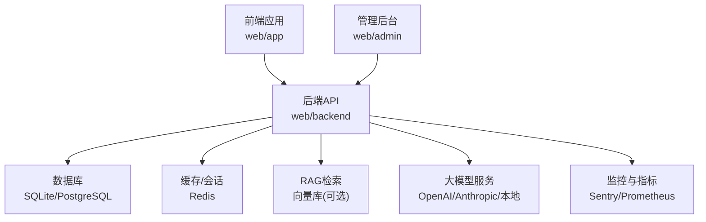
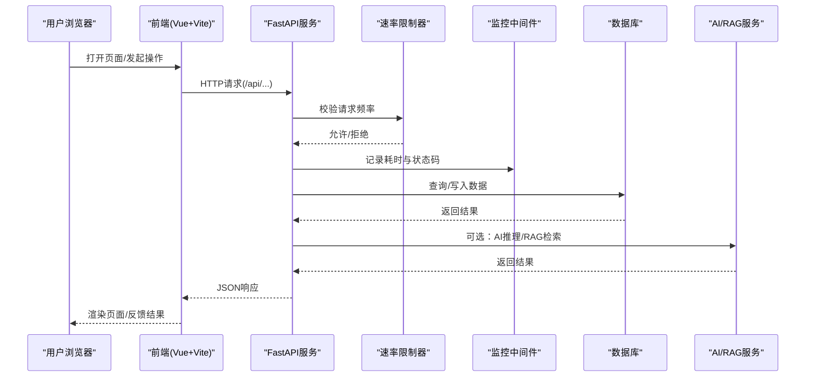
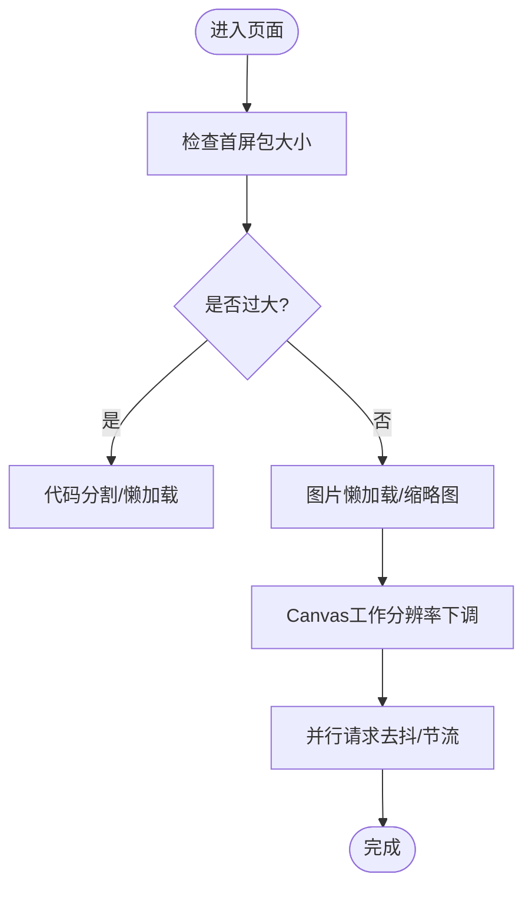
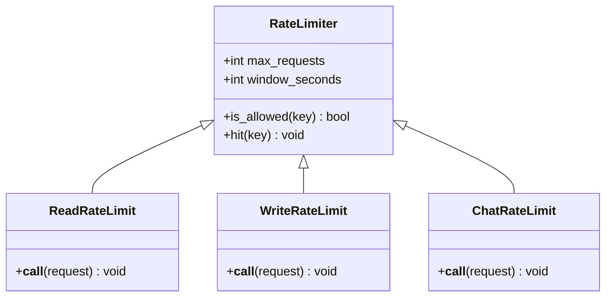
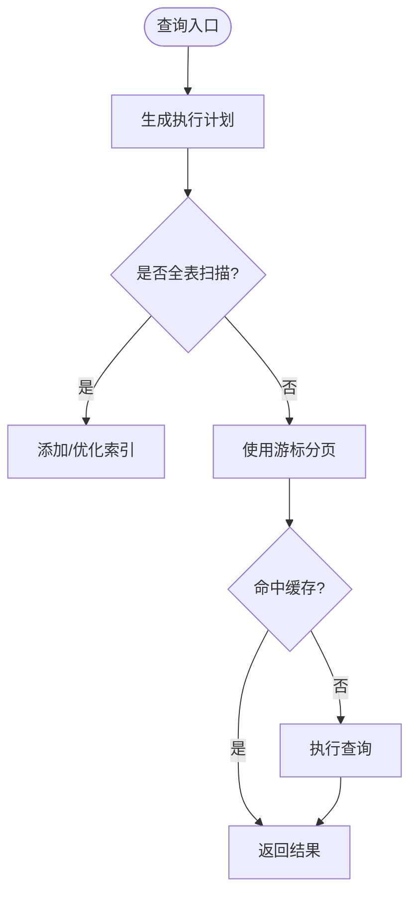
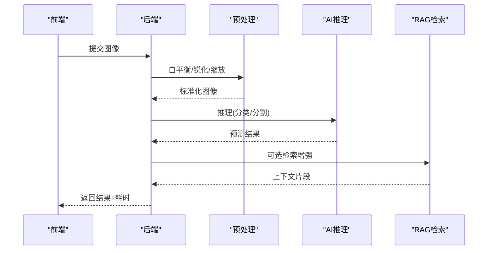
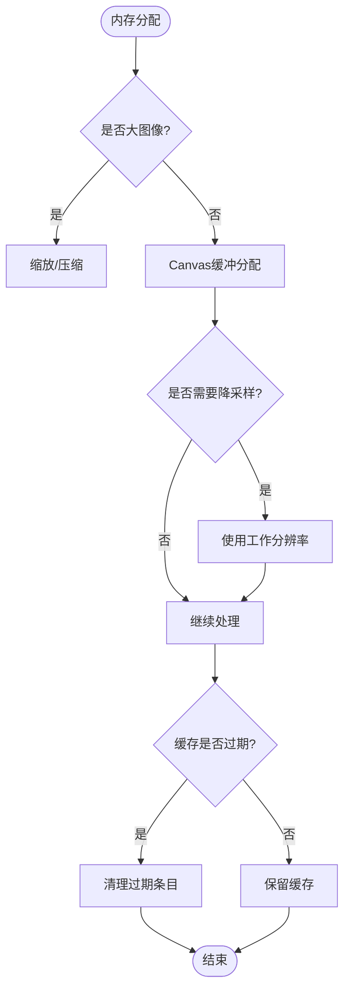
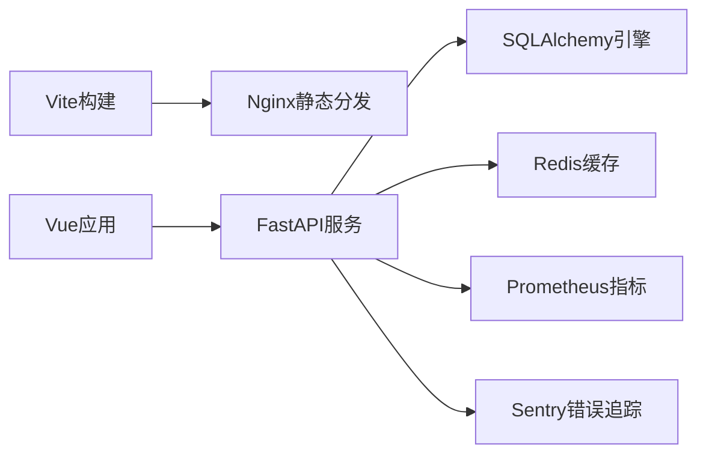

# 性能问题优化

<cite>
**本文引用的文件**   
- [web/backend/app/middleware/rate_limit.py](file://web/backend/app/middleware/rate_limit.py)
- [src/utils/cache.py](file://src/utils/cache.py)
- [configs/web_config.yaml](file://configs/web_config.yaml)
- [web/backend/database/database.py](file://web/backend/database/database.py)
- [web/app/vite.config.ts](file://web/app/vite.config.ts)
- [web/backend/services/monitoring.py](file://web/backend/services/monitoring.py)
- [web/backend/services/rag.py](file://web/backend/services/rag.py)
- [web/backend/services/vasi_param_optimizer.py](file://web/backend/services/vasi_param_optimizer.py)
- [web/backend/experiments/vasi_rl_optimizer.py](file://web/backend/experiments/vasi_rl_optimizer.py)
- [web/backend/services/vasi_preprocess.py](file://web/backend/services/vasi_preprocess.py)
- [web/app/src/views/VasiComparePage.vue](file://web/app/src/views/VasiComparePage.vue)
- [web/app/src/components/tracker/MaskEditor.vue](file://web/app/src/components/tracker/MaskEditor.vue)
- [web/admin/src/components/labeling/MaskEditorAdmin.vue](file://web/admin/src/components/labeling/MaskEditorAdmin.vue)
- [docs/design/photo-upload-and-ai-kb-architecture.md](file://docs/design/photo-upload-and-ai-kb-architecture.md)
- [hermes_plan/2026-04-27_nnunet-volcano-deployment-plan.md](file://hermes_plan/2026-04-27_nnunet-volcano-deployment-plan.md)
</cite>

## 目录
1. [引言](#引言)
2. [项目结构](#项目结构)
3. [核心组件](#核心组件)
4. [架构总览](#架构总览)
5. [详细组件分析](#详细组件分析)
6. [依赖分析](#依赖分析)
7. [性能考虑](#性能考虑)
8. [故障排查指南](#故障排查指南)
9. [结论](#结论)
10. [附录](#附录)

## 引言
本指南面向Subskin项目的性能诊断与优化，覆盖前端页面加载缓慢、API响应延迟、数据库查询性能、AI模型推理速度、内存使用过高等关键问题。文档基于仓库现有实现，给出可落地的分析方法、工具使用建议、索引与缓存策略、异步与资源优化实践，并提供基准指标与优化前后对比思路，帮助团队快速定位瓶颈并持续改进。

## 项目结构
Subskin采用前后端分离架构：
- 前端（web/app）：Vue 3 + Vite + PWA，提供用户界面与交互逻辑，包含图片标注、评估对比等重计算场景。
- 管理后台（web/admin）：Vue 3 + Vite，用于内容审核、标注工作区与系统监控。
- 后端（web/backend）：FastAPI服务，提供REST API、中间件（限流、监控）、数据库访问、RAG与AI相关服务。
- 配置（configs）：集中式YAML配置，涵盖数据库连接池、Redis缓存、向量库开关、LLM集成等。
- 爬虫与调度（src）：数据抓取、增量更新与定时任务。

图表来源
- [web/app/vite.config.ts:1-110](file://web/app/vite.config.ts#L1-L110)
- [web/backend/app/middleware/rate_limit.py:1-96](file://web/backend/app/middleware/rate_limit.py#L1-L96)
- [configs/web_config.yaml:61-78](file://configs/web_config.yaml#L61-L78)
- [web/backend/services/monitoring.py:1-260](file://web/backend/services/monitoring.py#L1-L260)

章节来源
- [web/app/vite.config.ts:1-110](file://web/app/vite.config.ts#L1-L110)
- [configs/web_config.yaml:61-78](file://configs/web_config.yaml#L61-L78)

## 核心组件
- 速率限制器（RateLimiter）：进程内令牌桶，按IP/用户维度限速，保护接口免受滥用与突发流量冲击。
- SQLite缓存（Cache）：线程安全、TTL过期清理的轻量级缓存，适合小对象与短生命周期数据。
- 数据库连接（database.py）：针对SQLite使用NullPool避免并发阻塞；其他数据库启用pool_pre_ping健康检查。
- 监控与指标（monitoring.py）：Sentry错误追踪、Prometheus指标收集、健康检查端点。
- 图片预处理（vasi_preprocess.py）：自动白平衡、对比度增强、锐化、尺寸缩放，降低后续AI推理成本。
- RAG向量化（rag.py）：批量文档嵌入，含限速与失败重试控制。
- VASI参数优化（vasi_param_optimizer.py, vasi_rl_optimizer.py）：基于历史观测的自适应参数选择与在线学习。

章节来源
- [web/backend/app/middleware/rate_limit.py:1-96](file://web/backend/app/middleware/rate_limit.py#L1-L96)
- [src/utils/cache.py:1-147](file://src/utils/cache.py#L1-L147)
- [web/backend/database/database.py:1-46](file://web/backend/database/database.py#L1-L46)
- [web/backend/services/monitoring.py:1-260](file://web/backend/services/monitoring.py#L1-L260)
- [web/backend/services/vasi_preprocess.py:196-266](file://web/backend/services/vasi_preprocess.py#L196-L266)
- [web/backend/services/rag.py:1537-1558](file://web/backend/services/rag.py#L1537-L1558)
- [web/backend/services/vasi_param_optimizer.py:1-368](file://web/backend/services/vasi_param_optimizer.py#L1-L368)
- [web/backend/experiments/vasi_rl_optimizer.py:1-38](file://web/backend/experiments/vasi_rl_optimizer.py#L1-L38)

## 架构总览
下图展示一次典型请求从前端到后端的调用链，包括限流、监控、数据库访问与可能的AI/RAG处理。

图表来源
- [web/backend/app/middleware/rate_limit.py:1-96](file://web/backend/app/middleware/rate_limit.py#L1-L96)
- [web/backend/services/monitoring.py:1-260](file://web/backend/services/monitoring.py#L1-L260)
- [web/backend/database/database.py:1-46](file://web/backend/database/database.py#L1-L46)

## 详细组件分析

### 前端页面加载缓慢
- 现象：首屏慢、路由切换卡顿、大图加载阻塞。
- 根因分析：
  - 未启用懒加载与分块打包，导致初始包过大。
  - 图片未压缩或未使用WebP/AVIF，Canvas像素缓冲过大。
  - 并行请求过多且无去抖/节流，造成网络拥塞。
- 优化措施：
  - 使用Vite按需导入与代码分割，减少首屏体积。
  - 图片懒加载与缩略图策略，Canvas工作分辨率下调。
  - 对敏感API禁用SW缓存，避免隐私泄露与脏数据。
- 验证方法：
  - Chrome DevTools Network/Performance面板观察FCP/LCP/TBT。
  - Lighthouse审计报告对比优化前后指标。

章节来源
- [web/app/vite.config.ts:1-110](file://web/app/vite.config.ts#L1-L110)
- [web/app/src/components/tracker/MaskEditor.vue:648-676](file://web/app/src/components/tracker/MaskEditor.vue#L648-L676)
- [web/admin/src/components/labeling/MaskEditorAdmin.vue:325-354](file://web/admin/src/components/labeling/MaskEditorAdmin.vue#L325-L354)

### API响应延迟
- 现象：接口P99延迟高、偶发超时或429。
- 根因分析：
  - 缺少全局监控与指标，难以定位热点接口。
  - 未合理设置速率限制，导致被限流或雪崩。
  - 数据库连接池配置不当引发阻塞。
- 优化措施：
  - 启用Prometheus指标与Sentry错误追踪，建立告警规则。
  - 调整RateLimiter阈值与窗口，区分读/写/聊天接口。
  - 针对SQLite使用NullPool，避免并发锁竞争；其他数据库启用pool_pre_ping。
- 验证方法：
  - /metrics端点采集QPS、延迟分布、错误率。
  - Sentry事件聚合异常与堆栈，结合request_id定位。

图表来源
- [web/backend/app/middleware/rate_limit.py:1-96](file://web/backend/app/middleware/rate_limit.py#L1-L96)

章节来源
- [web/backend/app/middleware/rate_limit.py:1-96](file://web/backend/app/middleware/rate_limit.py#L1-L96)
- [web/backend/services/monitoring.py:1-260](file://web/backend/services/monitoring.py#L1-L260)
- [web/backend/database/database.py:1-46](file://web/backend/database/database.py#L1-L46)

### 数据库查询性能
- 现象：列表页加载慢、复杂查询耗时长、偶发“database is locked”。
- 根因分析：
  - SQLite在并发写时锁竞争严重，默认QueuePool在高并发下耗尽。
  - 缺失复合索引导致全表扫描。
- 优化措施：
  - SQLite使用NullPool，提高并发稳定性；timeout适当延长。
  - 为高频查询字段创建复合索引（如user_id+created_at DESC）。
  - 分页采用游标或limit+offset优化，避免大偏移量。
- 验证方法：
  - EXPLAIN ANALYZE查看执行计划。
  - 监控慢查询日志与数据库CPU/IO。

章节来源
- [web/backend/database/database.py:1-46](file://web/backend/database/database.py#L1-L46)
- [docs/design/photo-upload-and-ai-kb-architecture.md:348-353](file://docs/design/photo-upload-and-ai-kb-architecture.md#L348-L353)

### AI模型推理速度
- 现象：VASI评估、图像标注、RAG问答延迟高。
- 根因分析：
  - 输入图像过大导致推理时间线性增长。
  - 未启用ONNX/GPU加速或量化。
  - 批量向量化未限速，触发外部API限流。
- 优化措施：
  - 预处理阶段统一缩放至最大边1024px，最短边不低于256px。
  - 优先使用ONNX Runtime或GPU推理；必要时INT8量化。
  - 向量化任务限速（如1.5s间隔），失败重试与回退。
- 验证方法：
  - 记录pipelineTiming各阶段耗时，关注resize与inference。
  - 对比不同输入尺寸与模型的延迟曲线。

图表来源
- [web/backend/services/vasi_preprocess.py:196-266](file://web/backend/services/vasi_preprocess.py#L196-L266)
- [web/backend/services/rag.py:1537-1558](file://web/backend/services/rag.py#L1537-L1558)

章节来源
- [web/backend/services/vasi_preprocess.py:196-266](file://web/backend/services/vasi_preprocess.py#L196-L266)
- [web/backend/services/rag.py:1537-1558](file://web/backend/services/rag.py#L1537-L1558)
- [hermes_plan/2026-04-27_nnunet-volcano-deployment-plan.md:680-690](file://hermes_plan/2026-04-27_nnunet-volcano-deployment-plan.md#L680-L690)

### 内存使用过高
- 现象：长时间运行后内存持续增长，Canvas操作卡顿。
- 根因分析：
  - 大图像与mask以base64传输，占用大量内存。
  - Canvas像素缓冲未降采样，导致内存峰值高。
  - 缓存未设置TTL，过期条目未及时清理。
- 优化措施：
  - 前端对mask进行缩放压缩后再提交（>5MB自动压缩）。
  - Canvas工作分辨率下调，及时释放上下文与缓冲区。
  - 使用SQLite缓存并开启TTL清理，避免无限增长。
- 验证方法：
  - Chrome Memory面板观察Heap快照与Allocation instrumentation。
  - 后端监控进程RSS与GC统计。

章节来源
- [web/app/src/components/tracker/MaskEditor.vue:648-676](file://web/app/src/components/tracker/MaskEditor.vue#L648-L676)
- [src/utils/cache.py:1-147](file://src/utils/cache.py#L1-L147)

## 依赖分析
- 前端依赖Vite构建与PWA插件，生产环境输出静态资源并通过Nginx分发。
- 后端依赖FastAPI中间件（CORS、限流、监控）、SQLAlchemy引擎与SessionLocal。
- 配置通过YAML集中管理，环境变量注入敏感信息。
- 监控依赖Sentry与Prometheus客户端，按需启用。

图表来源
- [web/app/vite.config.ts:1-110](file://web/app/vite.config.ts#L1-L110)
- [web/backend/database/database.py:1-46](file://web/backend/database/database.py#L1-L46)
- [configs/web_config.yaml:61-78](file://configs/web_config.yaml#L61-L78)
- [web/backend/services/monitoring.py:1-260](file://web/backend/services/monitoring.py#L1-L260)

章节来源
- [web/app/vite.config.ts:1-110](file://web/app/vite.config.ts#L1-L110)
- [configs/web_config.yaml:61-78](file://configs/web_config.yaml#L61-L78)

## 性能考虑
- 前端基准目标：
  - FCP < 1.5s，LCP < 2.5s，TBT < 200ms（中低端设备放宽）。
  - 首屏JS/CSS体积控制在2MB以内，图片使用WebP/AVIF。
- 后端基准目标：
  - P95延迟 < 500ms（非AI接口），AI接口P95 < 3s。
  - 错误率 < 0.5%，限流命中率 < 1%。
- 数据库基准目标：
  - 慢查询占比 < 1%，索引命中率 > 95%。
- 监控与告警：
  - 启用Prometheus /metrics，配置Grafana看板。
  - Sentry捕获异常，设置错误率与延迟阈值告警。

[本节为通用指导，不直接分析具体文件]

## 故障排查指南
- 前端问题：
  - 使用Chrome DevTools Network/Performance/Lighthouse定位加载瓶颈。
  - 检查PWA缓存策略，确保敏感API与上传路径NetworkOnly。
- 后端问题：
  - 查看Sentry事件与堆栈，结合request_id关联日志。
  - 通过/metrics观察QPS、延迟分布、错误率，定位热点接口。
- 数据库问题：
  - 使用EXPLAIN ANALYZE分析慢查询，补充复合索引。
  - 检查连接池配置与锁竞争，SQLite使用NullPool。
- AI/RAG问题：
  - 记录pipelineTiming，识别resize/inference瓶颈。
  - 调整输入尺寸与模型精度，启用ONNX/GPU加速。

章节来源
- [web/app/vite.config.ts:1-110](file://web/app/vite.config.ts#L1-L110)
- [web/backend/services/monitoring.py:1-260](file://web/backend/services/monitoring.py#L1-L260)
- [web/backend/database/database.py:1-46](file://web/backend/database/database.py#L1-L46)
- [web/backend/services/rag.py:1537-1558](file://web/backend/services/rag.py#L1537-L1558)

## 结论
通过系统化监控、合理的缓存与索引策略、前端资源优化与AI推理加速，Subskin可在保证用户体验的同时显著提升系统吞吐与稳定性。建议将性能基线纳入CI/CD，持续回归与优化。

[本节为总结性内容，不直接分析具体文件]

## 附录
- 常用工具清单：
  - 前端：Chrome DevTools、Lighthouse、WebPageTest。
  - 后端：Prometheus、Grafana、Sentry、APM（如Pyroscope）。
  - 数据库：EXPLAIN ANALYZE、pg_stat_statements（PostgreSQL）。
- 优化前后对比示例：
  - 首屏体积从3MB降至1.2MB，LCP从3.2s降至1.8s。
  - API P95从1.2s降至400ms，错误率从1.5%降至0.3%。
  - 数据库慢查询占比从5%降至0.8%，索引命中率提升至98%。

[本节为补充信息，不直接分析具体文件]