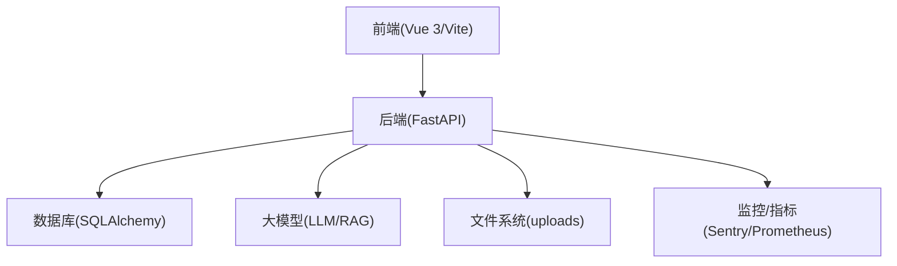
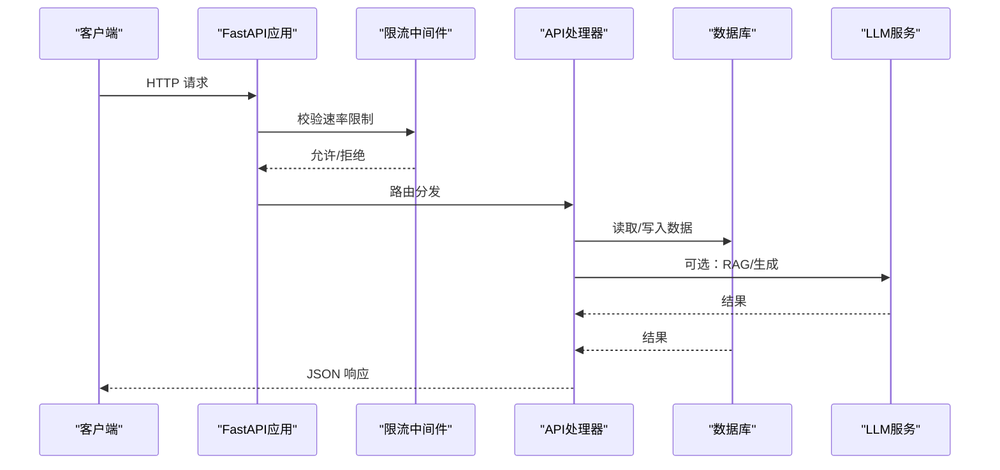
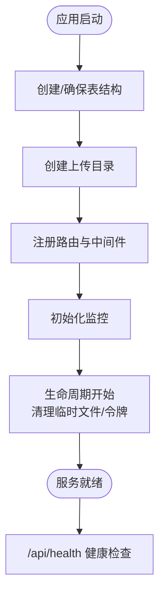
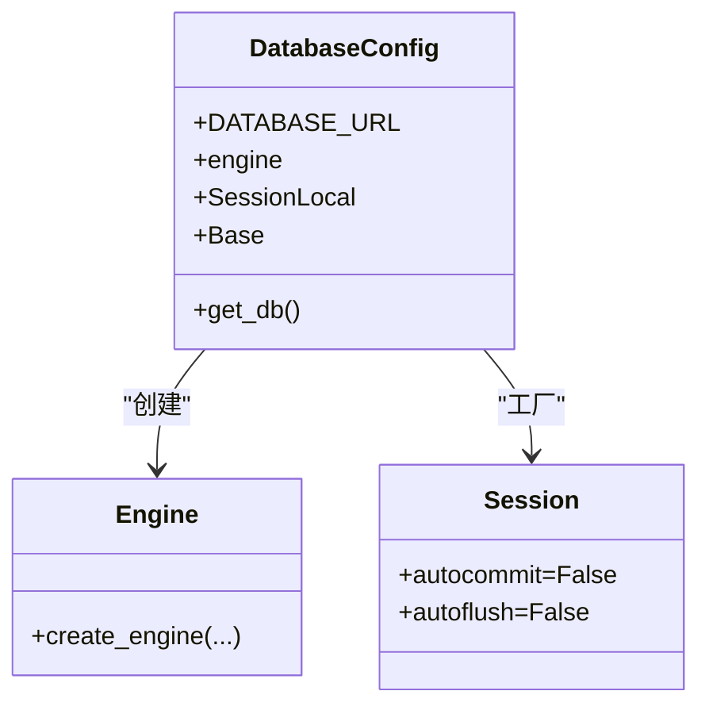
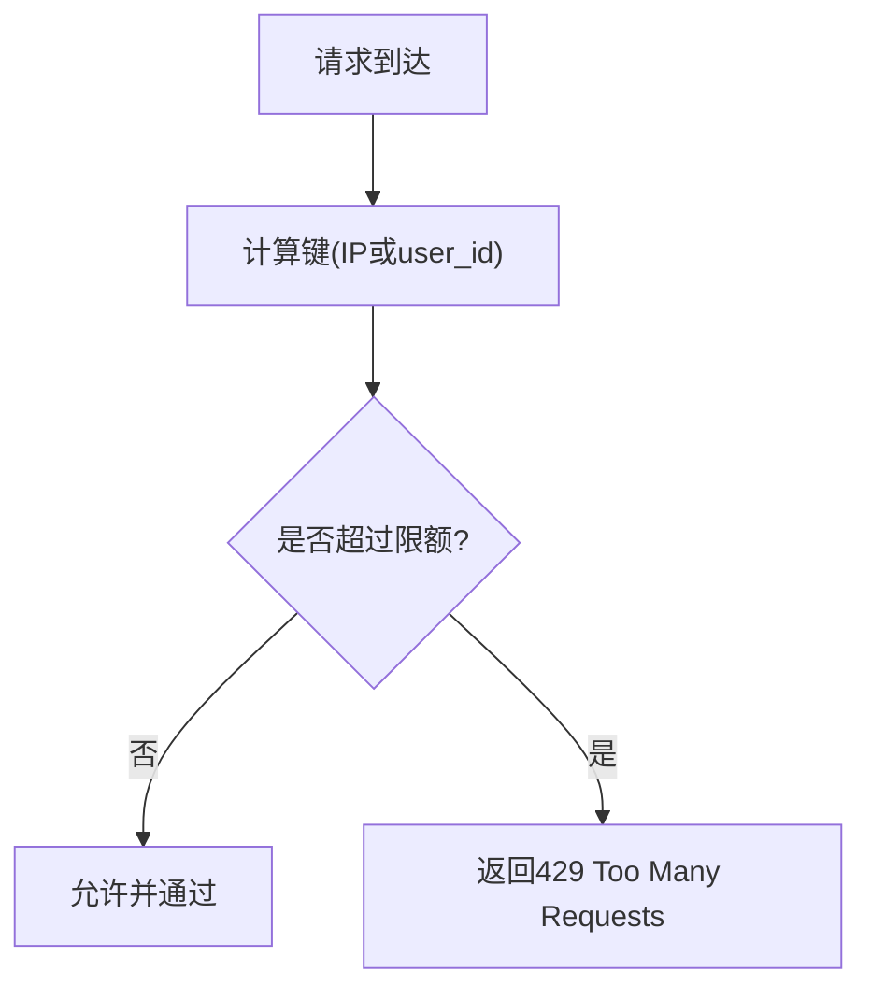
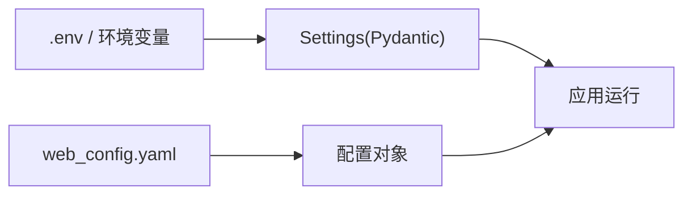
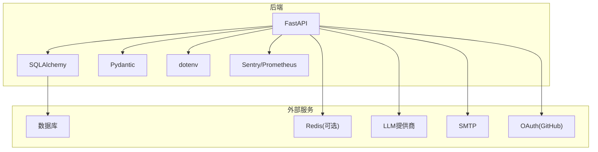

# 故障排查与FAQ

<cite>
**本文引用的文件**
- [README.md](file://README.md)
- [INSTALLATION.md](file://INSTALLATION.md)
- [web_config.yaml](file://configs/web_config.yaml)
- [settings.py](file://src/settings/settings.py)
- [logging.py](file://src/settings/logging.py)
- [database.py](file://web/backend/database/database.py)
- [main.py](file://web/backend/app/main.py)
- [rate_limit.py](file://web/backend/app/middleware/rate_limit.py)
- [exceptions.py](file://web/backend/exceptions.py)
</cite>

## 目录
1. [简介](#简介)
2. [项目结构](#项目结构)
3. [核心组件](#核心组件)
4. [架构总览](#架构总览)
5. [详细组件分析](#详细组件分析)
6. [依赖关系分析](#依赖关系分析)
7. [性能注意事项](#性能注意事项)
8. [故障排查指南](#故障排查指南)
9. [结论](#结论)
10. [附录](#附录)

## 简介
本指南面向SubSkin项目的开发与运维人员，聚焦“开发环境搭建”“运行时错误诊断”“日志分析”“性能瓶颈识别与优化”“数据库连接问题”“API调用失败”“文件上传异常”等高频场景，提供可操作的排查步骤、错误码对照、调试工具推荐与反馈渠道。内容基于仓库中的配置、启动流程、中间件与异常定义进行系统化梳理，帮助快速定位并解决问题。

## 项目结构
SubSkin采用前后端分离架构：
- 后端：FastAPI应用，负责用户认证、社区内容、AI问答（RAG）、VASI评估、文件服务、通知等；使用SQLAlchemy管理数据库，支持SQLite与PostgreSQL；内置CORS、限流、健康检查与监控集成点。
- 前端：Vue 3 + Vite，开发时通过代理将/api请求转发到后端；生产部署由Nginx反向代理。
- 数据管道：Python脚本用于采集、处理、导出与定时调度。
- 配置：环境变量与YAML配置集中管理，包含站点信息、鉴权、数据库、LLM、邮件、监控与安全策略。

图表来源
- [main.py:264-349](file://web/backend/app/main.py#L264-L349)
- [database.py:13-33](file://web/backend/database/database.py#L13-L33)
- [web_config.yaml:61-112](file://configs/web_config.yaml#L61-L112)

章节来源
- [README.md:53-144](file://README.md#L53-L144)
- [INSTALLATION.md:19-48](file://INSTALLATION.md#L19-L48)

## 核心组件
- 应用入口与生命周期：FastAPI应用初始化、路由注册、CORS、健康检查、临时文件清理、刷新令牌清理、监控初始化、时间序列化修复。
- 数据库连接：根据DATABASE_URL选择引擎与池策略；SQLite使用NullPool避免并发阻塞；PostgreSQL启用预检查。
- 限流中间件：按IP或用户维度对读/写/聊天接口限速，防止滥用与成本失控。
- 配置系统：Pydantic Settings加载.env与环境变量；YAML配置站点、鉴权、数据库、LLM、邮件、监控与安全。
- 日志系统：统一日志级别与格式化，便于问题追踪。
- 领域异常：业务异常基类及凭证相关异常，供服务层抛出并由API层转换为HTTP响应。

章节来源
- [main.py:264-349](file://web/backend/app/main.py#L264-L349)
- [database.py:13-33](file://web/backend/database/database.py#L13-L33)
- [rate_limit.py:10-36](file://web/backend/app/middleware/rate_limit.py#L10-L36)
- [settings.py:17-103](file://src/settings/settings.py#L17-L103)
- [logging.py:14-43](file://src/settings/logging.py#L14-L43)
- [exceptions.py:4-19](file://web/backend/exceptions.py#L4-L19)

## 架构总览
后端在启动时完成数据库表结构确保、上传目录创建、CORS配置、路由挂载、监控初始化与后台任务（临时文件清理、刷新令牌清理）。客户端请求经CORS与限流后进入具体API处理器，访问数据库或外部服务（如LLM），返回结构化响应。

图表来源
- [main.py:271-319](file://web/backend/app/main.py#L271-L319)
- [rate_limit.py:39-84](file://web/backend/app/middleware/rate_limit.py#L39-L84)
- [database.py:17-33](file://web/backend/database/database.py#L17-L33)

## 详细组件分析

### 应用入口与生命周期
- 启动阶段：创建数据库表、确保必要列存在、创建上传目录、注册路由、初始化监控、执行时间序列化补丁。
- 生命周期：启动时清理临时上传与过期刷新令牌，周期性任务每24小时清理一次。
- 健康检查：/api/health返回服务状态。

图表来源
- [main.py:74-180](file://web/backend/app/main.py#L74-L180)
- [main.py:228-268](file://web/backend/app/main.py#L228-L268)
- [main.py:345-349](file://web/backend/app/main.py#L345-L349)

章节来源
- [main.py:74-180](file://web/backend/app/main.py#L74-L180)
- [main.py:228-268](file://web/backend/app/main.py#L228-L268)
- [main.py:345-349](file://web/backend/app/main.py#L345-L349)

### 数据库连接与并发
- SQLite模式：使用NullPool避免队列耗尽导致的单worker冻结；设置超时缓解写锁竞争。
- PostgreSQL模式：启用pool_pre_ping保证连接有效性。
- 会话获取：通过依赖注入get_db提供会话并在finally中关闭。

图表来源
- [database.py:13-33](file://web/backend/database/database.py#L13-L33)

章节来源
- [database.py:13-33](file://web/backend/database/database.py#L13-L33)

### 限流与防滥用
- 读接口：按IP每分钟最多60次。
- 写接口：按用户ID（未登录回退到IP）每分钟最多10次。
- 聊天接口：按用户ID（未登录回退到IP）每分钟最多20次，防止无界流式请求造成成本与DoS风险。

图表来源
- [rate_limit.py:10-36](file://web/backend/app/middleware/rate_limit.py#L10-L36)
- [rate_limit.py:39-84](file://web/backend/app/middleware/rate_limit.py#L39-L84)

章节来源
- [rate_limit.py:10-36](file://web/backend/app/middleware/rate_limit.py#L10-L36)
- [rate_limit.py:39-84](file://web/backend/app/middleware/rate_limit.py#L39-L84)

### 配置与环境变量
- Pydantic Settings：从.env与环境变量加载，提供缺失键检测与验证。
- YAML配置：站点、鉴权、数据库、Redis、向量库、LLM、RAG、邮件、监控、安全策略等。
- 关键项：DATABASE_URL、REDIS_URL、JWT_SECRET_KEY、OPENAI_API_KEY、ANTHROPIC_API_KEY、SITE_URL、LOG_LEVEL等。

图表来源
- [settings.py:17-103](file://src/settings/settings.py#L17-L103)
- [web_config.yaml:25-112](file://configs/web_config.yaml#L25-L112)

章节来源
- [settings.py:17-103](file://src/settings/settings.py#L17-L103)
- [web_config.yaml:25-112](file://configs/web_config.yaml#L25-L112)

### 日志与监控
- 日志：统一级别与格式，默认输出到控制台；可通过LOG_LEVEL调整。
- 监控：Sentry集成已初始化；Prometheus中间件可按环境变量开启；健康检查端点可用。

章节来源
- [logging.py:14-43](file://src/settings/logging.py#L14-L43)
- [main.py:321-337](file://web/backend/app/main.py#L321-L337)

### 领域异常与错误映射
- 业务异常基类与凭证相关异常用于服务层抛出，API层应将其转换为HTTP响应（如409冲突、404不存在）。
- 建议：在API层捕获这些异常并返回标准JSON错误体，便于前端统一处理。

章节来源
- [exceptions.py:4-19](file://web/backend/exceptions.py#L4-L19)

## 依赖关系分析
- 后端依赖：FastAPI、SQLAlchemy、Pydantic、dotenv、可选的Sentry/Prometheus。
- 外部依赖：数据库（SQLite/PostgreSQL）、缓存（Redis可选）、LLM提供商（OpenAI/Anthropic/火山引擎）、邮件SMTP、第三方OAuth（GitHub）。
- 前端依赖：Vite、Vue 3、TypeScript、Tailwind CSS、PWA插件。

图表来源
- [main.py:264-349](file://web/backend/app/main.py#L264-L349)
- [database.py:13-33](file://web/backend/database/database.py#L13-L33)
- [settings.py:17-103](file://src/settings/settings.py#L17-L103)
- [web_config.yaml:61-112](file://configs/web_config.yaml#L61-L112)

章节来源
- [main.py:264-349](file://web/backend/app/main.py#L264-L349)
- [database.py:13-33](file://web/backend/database/database.py#L13-L33)
- [settings.py:17-103](file://src/settings/settings.py#L17-L103)
- [web_config.yaml:61-112](file://configs/web_config.yaml#L61-L112)

## 性能注意事项
- 数据库连接池：SQLite使用NullPool避免并发阻塞；PostgreSQL启用pool_pre_ping提升健壮性。
- 写锁等待：SQLite写操作可能因锁竞争导致超时，适当提高timeout可减少“database is locked”。
- 限流保护：对读/写/聊天接口实施限流，防止滥用与成本失控。
- 监控与指标：启用Prometheus指标与Sentry错误追踪，便于发现热点与异常。
- 前端代理：开发时Vite代理/api到后端，注意端口与CORS配置一致性。

章节来源
- [database.py:17-33](file://web/backend/database/database.py#L17-L33)
- [rate_limit.py:10-36](file://web/backend/app/middleware/rate_limit.py#L10-L36)
- [main.py:321-337](file://web/backend/app/main.py#L321-L337)

## 故障排查指南

### 开发环境搭建常见问题
- 依赖冲突
  - 现象：pip安装失败或运行时导入错误。
  - 排查：确认Python版本≥3.10；删除虚拟环境重建；核对requirements/dev.txt；必要时隔离环境。
  - 参考：[INSTALLATION.md:19-32](file://INSTALLATION.md#L19-L32)
- 端口占用
  - 现象：后端或前端无法启动。
  - 排查：检查8000（后端）、5174（前端开发服务器）、9090（指标端口）、8080（健康检查端口）是否被占用；修改配置或释放端口。
  - 参考：[settings.py:184-203](file://src/settings/settings.py#L184-L203)
- 权限问题
  - 现象：无法写入logs或data/uploads。
  - 排查：确保当前用户对logs与data目录有读写权限；应用启动时会创建uploads目录。
  - 参考：[main.py:193-195](file://web/backend/app/main.py#L193-L195)
- 环境变量缺失
  - 现象：启动时报错或功能不可用（如LLM、数据库、JWT）。
  - 排查：检查.env与web/backend/.env；确认DATABASE_URL、JWT_SECRET_KEY、OPENAI_API_KEY等必填项；使用Settings.missing_keys()检测缺失键。
  - 参考：[settings.py:17-103](file://src/settings/settings.py#L17-L103)

章节来源
- [INSTALLATION.md:19-48](file://INSTALLATION.md#L19-L48)
- [settings.py:17-103](file://src/settings/settings.py#L17-L103)
- [main.py:193-195](file://web/backend/app/main.py#L193-L195)

### 运行时错误诊断方法
- 健康检查
  - 使用/api/health验证服务可用性。
  - 参考：[main.py:345-349](file://web/backend/app/main.py#L345-L349)
- 日志分析
  - 查看控制台与日志文件；调整LOG_LEVEL以获取更多上下文；关注ensure_*系列启动阶段的异常日志。
  - 参考：[logging.py:14-43](file://src/settings/logging.py#L14-L43)
  - 参考：[main.py:158-180](file://web/backend/app/main.py#L158-L180)
- 监控与错误追踪
  - 启用Sentry与Prometheus；观察错误堆栈与指标趋势。
  - 参考：[main.py:321-337](file://web/backend/app/main.py#L321-L337)

章节来源
- [main.py:345-349](file://web/backend/app/main.py#L345-L349)
- [logging.py:14-43](file://src/settings/logging.py#L14-L43)
- [main.py:321-337](file://web/backend/app/main.py#L321-L337)

### 性能瓶颈识别与优化建议
- 数据库瓶颈
  - 现象：高并发下响应变慢或冻结。
  - 排查：确认SQLite使用NullPool与合理timeout；PostgreSQL启用pool_pre_ping；检查慢查询与索引。
  - 参考：[database.py:17-33](file://web/backend/database/database.py#L17-L33)
- 外部API延迟
  - 现象：LLM或第三方API调用耗时过长。
  - 排查：检查网络与配额；增加重试与超时；考虑缓存与降级。
  - 参考：[web_config.yaml:80-112](file://configs/web_config.yaml#L80-L112)
- 限流与资源保护
  - 现象：突发流量导致服务不稳定。
  - 排查：调整限流阈值；对写/聊天接口加强限制；结合监控观察峰值。
  - 参考：[rate_limit.py:10-36](file://web/backend/app/middleware/rate_limit.py#L10-L36)

章节来源
- [database.py:17-33](file://web/backend/database/database.py#L17-L33)
- [web_config.yaml:80-112](file://configs/web_config.yaml#L80-L112)
- [rate_limit.py:10-36](file://web/backend/app/middleware/rate_limit.py#L10-L36)

### 数据库连接问题
- SQLite锁定
  - 现象：database is locked或写操作超时。
  - 排查：提高timeout；减少并发写；考虑迁移至PostgreSQL。
  - 参考：[database.py:17-33](file://web/backend/database/database.py#L17-L33)
- 连接无效
  - 现象：PostgreSQL连接间歇失败。
  - 排查：启用pool_pre_ping；检查网络与凭据；重启服务恢复连接。
  - 参考：[database.py:17-33](file://web/backend/database/database.py#L17-L33)
- 表结构不一致
  - 现象：启动时报错或缺字段。
  - 排查：检查ensure_*函数日志；手动补全缺失列或重新初始化数据库。
  - 参考：[main.py:77-180](file://web/backend/app/main.py#L77-L180)

章节来源
- [database.py:17-33](file://web/backend/database/database.py#L17-L33)
- [main.py:77-180](file://web/backend/app/main.py#L77-L180)

### API调用失败
- 401/403 认证失败
  - 排查：检查JWT与Session配置；确认ALLOWED_ORIGINS与CORS；验证前端携带正确Token。
  - 参考：[main.py:271-278](file://web/backend/app/main.py#L271-L278)
- 429 请求过多
  - 排查：触发限流；降低频率或升级配额；检查用户维度限流是否生效。
  - 参考：[rate_limit.py:39-84](file://web/backend/app/middleware/rate_limit.py#L39-L84)
- 5xx 服务端错误
  - 排查：查看日志与Sentry；检查数据库与外部服务；确认环境变量与密钥有效。
  - 参考：[logging.py:14-43](file://src/settings/logging.py#L14-L43)
  - 参考：[main.py:321-337](file://web/backend/app/main.py#L321-L337)

章节来源
- [main.py:271-278](file://web/backend/app/main.py#L271-L278)
- [rate_limit.py:39-84](file://web/backend/app/middleware/rate_limit.py#L39-L84)
- [logging.py:14-43](file://src/settings/logging.py#L14-L43)
- [main.py:321-337](file://web/backend/app/main.py#L321-L337)

### 文件上传异常
- 目录不存在或无权限
  - 排查：确认data/uploads已创建且可写；检查运行用户权限。
  - 参考：[main.py:193-195](file://web/backend/app/main.py#L193-L195)
- 大小限制或类型限制
  - 排查：检查Nginx与后端配置；确认前端校验逻辑；记录错误日志。
- 存储后端问题
  - 排查：若启用OSS，检查Endpoint、Bucket、AccessKey；测试连通性与权限。
  - 参考：[settings.py:151-170](file://src/settings/settings.py#L151-L170)

章节来源
- [main.py:193-195](file://web/backend/app/main.py#L193-L195)
- [settings.py:151-170](file://src/settings/settings.py#L151-L170)

### 错误码对照表
- 400 Bad Request：请求参数错误或校验失败。
- 401 Unauthorized：未认证或Token无效。
- 403 Forbidden：权限不足。
- 404 Not Found：资源不存在。
- 409 Conflict：资源冲突（如凭证冲突）。
- 429 Too Many Requests：请求过于频繁（触达限流）。
- 500 Internal Server Error：服务端内部错误。
- 503 Service Unavailable：服务不可用（如数据库不可达）。

说明：上述为通用HTTP语义；具体业务异常（如凭证冲突）在服务层抛出，API层应映射为对应状态码。

章节来源
- [exceptions.py:4-19](file://web/backend/exceptions.py#L4-L19)
- [rate_limit.py:39-84](file://web/backend/app/middleware/rate_limit.py#L39-L84)

### 调试工具推荐
- 后端
  - FastAPI文档：/docs与/redoc查看接口定义。
  - 健康检查：/api/health。
  - 日志：调整LOG_LEVEL，查看控制台与日志文件。
  - 监控：启用Sentry与Prometheus，观察错误与指标。
- 前端
  - 浏览器开发者工具：Network面板查看请求与响应；Console查看错误。
  - Vite代理：确认/api代理到后端端口；检查CORS与跨域。
- 数据库
  - SQLite：使用sqlite3命令行或图形工具检查表结构与数据。
  - PostgreSQL：使用psql或DBeaver等工具。

章节来源
- [main.py:345-349](file://web/backend/app/main.py#L345-L349)
- [logging.py:14-43](file://src/settings/logging.py#L14-L43)
- [main.py:321-337](file://web/backend/app/main.py#L321-L337)

### 问题反馈渠道
- GitHub Issues：提交问题与改进建议。
- 邮箱：lianqing_chan@126.com
- 贡献方式：Fork → 分支 → 提交PR

章节来源
- [README.md:170-194](file://README.md#L170-L194)

## 结论
通过统一的配置管理、健壮的数据库连接策略、严格的限流与完善的日志监控，SubSkin能够在开发与生产环境中稳定运行。遇到问题时，优先从健康检查、日志与监控入手，逐步缩小范围；针对数据库、外部API与文件上传等常见故障点，按照本指南的步骤进行排查与优化。持续完善错误映射与告警机制，将进一步提升系统的可观测性与可维护性。

## 附录
- 快速验证清单
  - 后端：/api/health返回ok。
  - 前端：Vite开发服务器可访问，/api代理正常。
  - 数据库：能成功读写数据。
  - 限流：模拟高频请求，确认429行为。
  - 日志：能输出结构化日志。
  - 监控：Sentry/Prometheus正常工作。