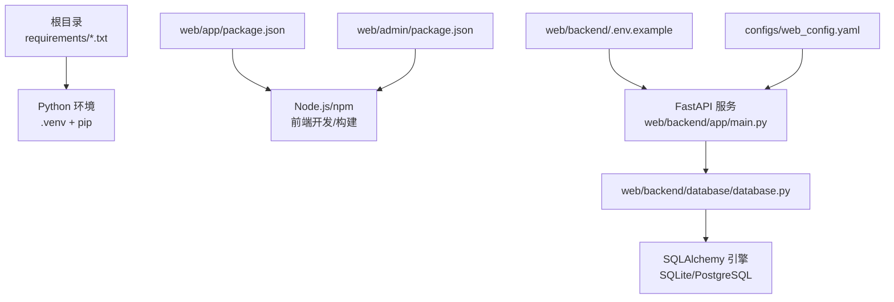
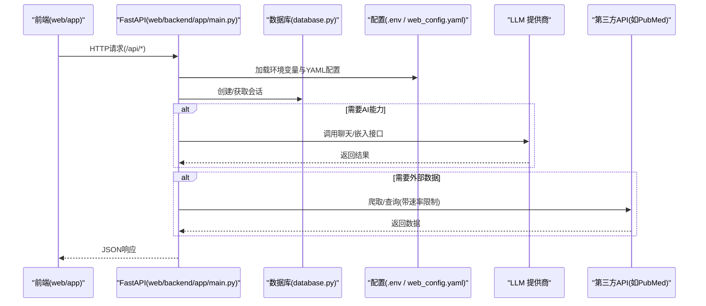
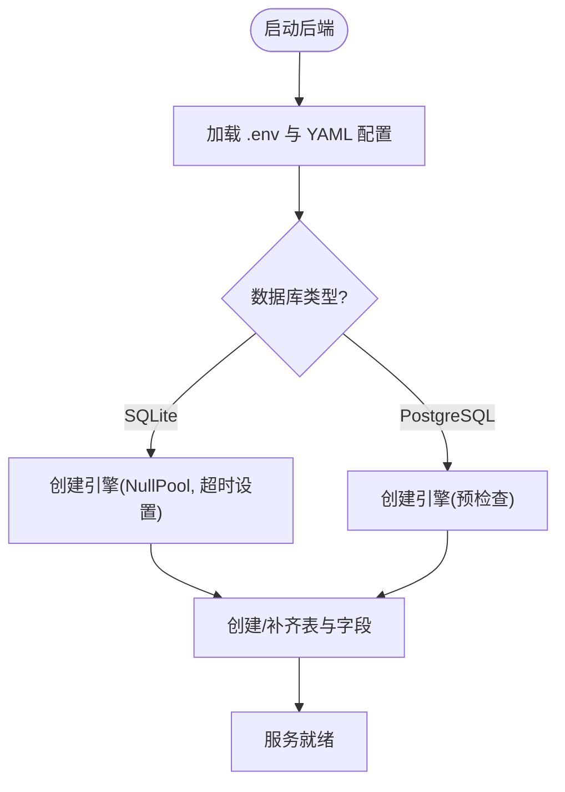
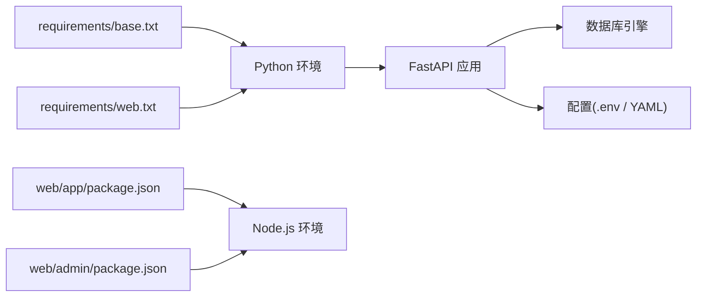

# 环境搭建问题

<cite>
**本文引用的文件**
- [INSTALLATION.md](file://INSTALLATION.md)
- [Makefile](file://Makefile)
- [requirements/base.txt](file://requirements/base.txt)
- [requirements/web.txt](file://requirements/web.txt)
- [web/app/package.json](file://web/app/package.json)
- [web/admin/package.json](file://web/admin/package.json)
- [configs/web_config.yaml](file://configs/web_config.yaml)
- [web/backend/.env.example](file://web/backend/.env.example)
- [src/settings/settings.py](file://src/settings/settings.py)
- [src/exceptions.py](file://src/exceptions.py)
- [web/backend/database/database.py](file://web/backend/database/database.py)
- [web/backend/app/main.py](file://web/backend/app/main.py)
- [configs/crawler_config.yaml](file://configs/crawler_config.yaml)
</cite>

## 目录
1. [简介](#简介)
2. [项目结构](#项目结构)
3. [核心组件](#核心组件)
4. [架构总览](#架构总览)
5. [详细组件分析](#详细组件分析)
6. [依赖关系分析](#依赖关系分析)
7. [性能注意事项](#性能注意事项)
8. [故障排查指南](#故障排查指南)
9. [结论](#结论)
10. [附录](#附录)

## 简介
本指南面向Subskin项目的本地与生产环境搭建，聚焦常见环境问题：Python版本冲突、依赖安装失败、虚拟环境激活异常；Node.js/npm版本不兼容、包安装失败、端口占用；数据库连接（SQLite权限、PostgreSQL配置）；API Key与环境变量配置错误等。文档提供症状描述、定位思路、命令行解决方案与配置文件修改方法，并附带环境验证命令与诊断工具使用建议。

## 项目结构
- Python后端与数据管道位于根目录与src/，Web后端FastAPI服务在web/backend/，前端应用与后台管理在web/app/与web/admin/。
- 依赖清单分为基础依赖与Web依赖，便于按需安装。
- 环境变量与配置通过.env与YAML集中管理，启动时由后端加载。

**图示来源**
- [requirements/base.txt:1-37](file://requirements/base.txt#L1-L37)
- [requirements/web.txt:1-40](file://requirements/web.txt#L1-L40)
- [web/app/package.json:1-55](file://web/app/package.json#L1-L55)
- [web/admin/package.json:1-30](file://web/admin/package.json#L1-L30)
- [web/backend/.env.example:1-91](file://web/backend/.env.example#L1-L91)
- [web/backend/app/main.py:1-200](file://web/backend/app/main.py#L1-L200)
- [configs/web_config.yaml:1-284](file://configs/web_config.yaml#L1-L284)
- [web/backend/database/database.py:1-46](file://web/backend/database/database.py#L1-L46)

**章节来源**
- [INSTALLATION.md:1-112](file://INSTALLATION.md#L1-L112)
- [Makefile:1-136](file://Makefile#L1-L136)

## 核心组件
- Python环境与依赖：通过requirements/base.txt与requirements/web.txt定义，建议使用虚拟环境隔离。
- Node.js前端：web/app与web/admin分别维护package.json，使用Vite进行开发与构建。
- Web后端：FastAPI应用，启动时加载.env与YAML配置，初始化数据库表结构与中间件。
- 数据库：默认SQLite，支持PostgreSQL；连接参数来自环境变量或配置文件。
- 配置中心：web/backend/.env.example提供关键密钥与连接串；configs/web_config.yaml提供站点、认证、LLM、搜索、邮件、监控等配置项。

**章节来源**
- [requirements/base.txt:1-37](file://requirements/base.txt#L1-L37)
- [requirements/web.txt:1-40](file://requirements/web.txt#L1-L40)
- [web/app/package.json:1-55](file://web/app/package.json#L1-L55)
- [web/admin/package.json:1-30](file://web/admin/package.json#L1-L30)
- [web/backend/app/main.py:1-200](file://web/backend/app/main.py#L1-L200)
- [web/backend/database/database.py:1-46](file://web/backend/database/database.py#L1-L46)
- [web/backend/.env.example:1-91](file://web/backend/.env.example#L1-L91)
- [configs/web_config.yaml:1-284](file://configs/web_config.yaml#L1-L284)

## 架构总览
下图展示从前端到后端再到数据库与外部服务的调用链路，以及配置加载流程。

**图示来源**
- [web/backend/app/main.py:1-200](file://web/backend/app/main.py#L1-L200)
- [web/backend/database/database.py:1-46](file://web/backend/database/database.py#L1-L46)
- [configs/web_config.yaml:1-284](file://configs/web_config.yaml#L1-L284)
- [configs/crawler_config.yaml:1-143](file://configs/crawler_config.yaml#L1-L143)

## 详细组件分析

### Python环境搭建与常见问题
- 症状
  - 虚拟环境无法激活或python/pip路径不正确。
  - 安装依赖时报错（C扩展编译失败、版本冲突）。
  - 运行测试或启动服务时报模块未找到。
- 定位与解决
  - 确认Python版本满足要求（参考安装说明），重新创建虚拟环境并激活。
  - 升级pip后按顺序安装基础与Web依赖，避免混装。
  - 若C扩展编译失败，检查系统编译工具链与依赖头文件。
  - 使用项目提供的Make目标统一执行安装与测试。
- 验证命令
  - 激活虚拟环境后执行测试套件，确保依赖完整。
  - 类型检查与格式化检查可提前发现潜在问题。

**章节来源**
- [INSTALLATION.md:19-60](file://INSTALLATION.md#L19-L60)
- [Makefile:25-77](file://Makefile#L25-L77)
- [requirements/base.txt:1-37](file://requirements/base.txt#L1-L37)
- [requirements/web.txt:1-40](file://requirements/web.txt#L1-L40)

### Node.js环境与前端构建
- 症状
  - npm install失败（网络超时、缓存损坏、版本不兼容）。
  - 开发服务器启动失败（端口被占用、插件缺失）。
  - 构建失败（TypeScript类型检查或Vite插件报错）。
- 定位与解决
  - 清理node_modules与锁文件后重装依赖。
  - 切换Node版本至推荐范围，使用nvm管理多版本。
  - 检查端口占用并更换端口或终止占用进程。
  - 使用项目脚本进行类型检查与构建，定位具体错误。
- 验证命令
  - 运行类型检查与预览模式，确认前端可正常加载。

**章节来源**
- [web/app/package.json:1-55](file://web/app/package.json#L1-L55)
- [web/admin/package.json:1-30](file://web/admin/package.json#L1-L30)
- [INSTALLATION.md:34-60](file://INSTALLATION.md#L34-L60)

### 数据库连接与迁移
- 症状
  - SQLite权限不足导致无法写入或锁定。
  - PostgreSQL连接失败（URL格式错误、凭据无效、网络不通）。
  - 启动时报表不存在或字段缺失。
- 定位与解决
  - 检查DATABASE_URL与文件路径，确保进程对data目录有读写权限。
  - SQLite并发写场景下注意锁等待时间设置；必要时切换到PostgreSQL。
  - 启动时会自动创建表与补齐字段；若失败查看日志中的异常信息。
  - 使用迁移工具更新数据库结构。
- 验证命令
  - 启动后端并访问健康检查端点，观察数据库初始化日志。

**图示来源**
- [web/backend/app/main.py:1-200](file://web/backend/app/main.py#L1-L200)
- [web/backend/database/database.py:1-46](file://web/backend/database/database.py#L1-L46)

**章节来源**
- [web/backend/database/database.py:1-46](file://web/backend/database/database.py#L1-L46)
- [web/backend/app/main.py:1-200](file://web/backend/app/main.py#L1-L200)
- [web/backend/.env.example:1-91](file://web/backend/.env.example#L1-L91)

### API Key与环境变量配置
- 症状
  - 调用OpenAI/Anthropic/DashScope/Volcengine等LLM接口报鉴权失败。
  - PubMed/Semantic Scholar/ClinicalTrials.gov等外部API限流或拒绝访问。
  - JWT签名或会话加密失败。
- 定位与解决
  - 将必要密钥填入web/backend/.env或根级.env，确保变量名一致。
  - 检查YAML中引用${VAR}的环境变量是否已注入。
  - 使用配置校验工具列出缺失的必填键，逐项补齐。
  - 对外部API，确认账户额度、IP白名单与速率限制策略。
- 验证命令
  - 启动后端后尝试最小化请求（如健康检查或简单查询），观察日志输出。

**章节来源**
- [web/backend/.env.example:1-91](file://web/backend/.env.example#L1-L91)
- [configs/web_config.yaml:1-284](file://configs/web_config.yaml#L1-L284)
- [configs/crawler_config.yaml:1-143](file://configs/crawler_config.yaml#L1-L143)
- [src/settings/settings.py:1-328](file://src/settings/settings.py#L1-L328)

### 爬虫与外部服务集成
- 症状
  - 爬取PubMed/Semantic Scholar/ClinicalTrials.gov失败或限流。
  - 请求超时或重试过多导致任务堆积。
- 定位与解决
  - 检查对应API Key与速率限制配置，合理设置retmax、limit与重试策略。
  - 调整超时与退避因子，避免瞬时风暴。
  - 启用缓存与增量更新，减少重复请求。
- 验证命令
  - 使用Make目标单独运行各爬虫任务，观察输出与日志。

**章节来源**
- [configs/crawler_config.yaml:1-143](file://configs/crawler_config.yaml#L1-L143)
- [Makefile:109-122](file://Makefile#L109-L122)

## 依赖关系分析
- Python依赖分层清晰：基础依赖用于数据采集与处理，Web依赖包含认证、数据库、缓存、搜索、文件处理与监控。
- 前端依赖集中在两个package.json中，分别服务于用户端与管理端。
- 后端启动时依赖数据库引擎、中间件与各路由模块，配置来源于.env与YAML。

**图示来源**
- [requirements/base.txt:1-37](file://requirements/base.txt#L1-L37)
- [requirements/web.txt:1-40](file://requirements/web.txt#L1-L40)
- [web/app/package.json:1-55](file://web/app/package.json#L1-L55)
- [web/admin/package.json:1-30](file://web/admin/package.json#L1-L30)
- [web/backend/app/main.py:1-200](file://web/backend/app/main.py#L1-L200)
- [web/backend/database/database.py:1-46](file://web/backend/database/database.py#L1-L46)
- [web/backend/.env.example:1-91](file://web/backend/.env.example#L1-L91)
- [configs/web_config.yaml:1-284](file://configs/web_config.yaml#L1-L284)

**章节来源**
- [requirements/base.txt:1-37](file://requirements/base.txt#L1-L37)
- [requirements/web.txt:1-40](file://requirements/web.txt#L1-L40)
- [web/app/package.json:1-55](file://web/app/package.json#L1-L55)
- [web/admin/package.json:1-30](file://web/admin/package.json#L1-L30)

## 性能注意事项
- SQLite在高并发写场景下易出现锁竞争，建议开发阶段使用SQLite但注意超时设置；生产环境推荐使用PostgreSQL并合理配置连接池。
- 外部API调用应遵循速率限制与重试退避策略，避免触发限流。
- 前端构建与类型检查应在CI中执行，减少本地构建差异。

[本节为通用指导，无需特定文件来源]

## 故障排查指南

### Python环境
- 症状示例
  - “找不到模块”或“版本冲突”：通常因虚拟环境未激活或依赖未正确安装。
  - C扩展编译失败：缺少系统库或编译器。
- 解决步骤
  - 删除旧虚拟环境，重建并激活。
  - 升级pip后按requirements安装基础与Web依赖。
  - 使用make test与make type-check验证环境。
- 验证命令
  - 激活环境后执行测试套件与类型检查。

**章节来源**
- [INSTALLATION.md:19-60](file://INSTALLATION.md#L19-L60)
- [Makefile:25-77](file://Makefile#L25-L77)

### Node.js环境
- 症状示例
  - “ECONNREFUSED”或“端口占用”：开发服务器端口冲突。
  - “npm ERR!”：网络或缓存问题。
- 解决步骤
  - 清理node_modules与锁文件，重装依赖。
  - 切换Node版本至推荐范围，使用nvm管理。
  - 更换端口或释放占用进程。
- 验证命令
  - 运行类型检查与预览模式。

**章节来源**
- [web/app/package.json:1-55](file://web/app/package.json#L1-L55)
- [web/admin/package.json:1-30](file://web/admin/package.json#L1-L30)
- [INSTALLATION.md:34-60](file://INSTALLATION.md#L34-L60)

### 数据库连接
- 症状示例
  - “database is locked”：SQLite写锁竞争。
  - “连接失败”：PostgreSQL URL或凭据错误。
- 解决步骤
  - 检查DATABASE_URL与文件权限；SQLite增加超时；生产切换PostgreSQL。
  - 启动时自动补齐表与字段，若失败查看日志异常。
- 验证命令
  - 启动后端并观察健康检查与初始化日志。

**章节来源**
- [web/backend/database/database.py:1-46](file://web/backend/database/database.py#L1-L46)
- [web/backend/app/main.py:1-200](file://web/backend/app/main.py#L1-L200)

### API Key与环境变量
- 症状示例
  - “鉴权失败”：LLM或外部API Key缺失或无效。
  - “JWT签名错误”：SECRET_KEY/JWT_SECRET_KEY未设置或格式错误。
- 解决步骤
  - 将密钥填入.env或YAML引用处，确保变量名一致。
  - 使用配置校验列出缺失键，逐项补齐。
- 验证命令
  - 启动后端并尝试最小化请求，观察日志。

**章节来源**
- [web/backend/.env.example:1-91](file://web/backend/.env.example#L1-L91)
- [configs/web_config.yaml:1-284](file://configs/web_config.yaml#L1-L284)
- [src/settings/settings.py:1-328](file://src/settings/settings.py#L1-L328)

### 爬虫与外部服务
- 症状示例
  - “限流”或“请求超时”：外部API限制或网络不稳定。
- 解决步骤
  - 调整速率限制、超时与重试策略；启用缓存与增量更新。
- 验证命令
  - 使用Make目标单独运行爬虫任务。

**章节来源**
- [configs/crawler_config.yaml:1-143](file://configs/crawler_config.yaml#L1-L143)
- [Makefile:109-122](file://Makefile#L109-L122)

### 异常与错误分类
- 自定义异常用于区分爬虫、API、速率限制与缓存错误，便于上层捕获与处理。
- 业务异常用于服务层抛出，API层转换为HTTP响应。

**章节来源**
- [src/exceptions.py:1-39](file://src/exceptions.py#L1-L39)
- [web/backend/exceptions.py:1-20](file://web/backend/exceptions.py#L1-L20)

## 结论
通过规范化的环境搭建流程、清晰的依赖管理与配置中心，结合完善的异常分类与日志记录，可快速定位并解决Subskin项目在Python、Node.js、数据库与API Key方面的常见问题。建议在CI中固化环境验证步骤，确保本地与生产环境一致性。

[本节为总结性内容，无需特定文件来源]

## 附录

### 环境验证命令清单
- Python
  - 激活虚拟环境并运行测试：make test
  - 类型检查：make type-check
  - 代码检查与格式化：make lint / make format
- Node.js
  - 前端类型检查：cd web/app && npm run type-check
  - 前端预览：cd web/app && npm run preview
  - 管理端构建：cd web/admin && npm run build
- 后端
  - 启动开发服务：make run-dev
  - 数据库初始化与迁移：make db-init / make db-migrate

**章节来源**
- [Makefile:56-107](file://Makefile#L56-L107)
- [INSTALLATION.md:50-60](file://INSTALLATION.md#L50-L60)

### 常用诊断工具
- 端口占用：使用系统工具查找并释放占用端口。
- 日志分析：关注后端启动与请求日志，定位数据库初始化与外部API调用异常。
- 配置校验：使用Settings工具列出缺失键，确保所有必填配置已设置。

**章节来源**
- [web/backend/app/main.py:1-200](file://web/backend/app/main.py#L1-L200)
- [src/settings/settings.py:289-328](file://src/settings/settings.py#L289-L328)