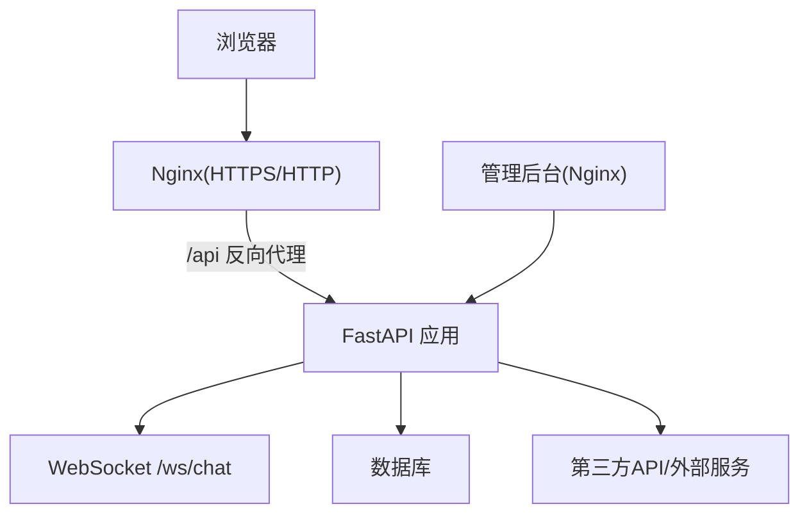
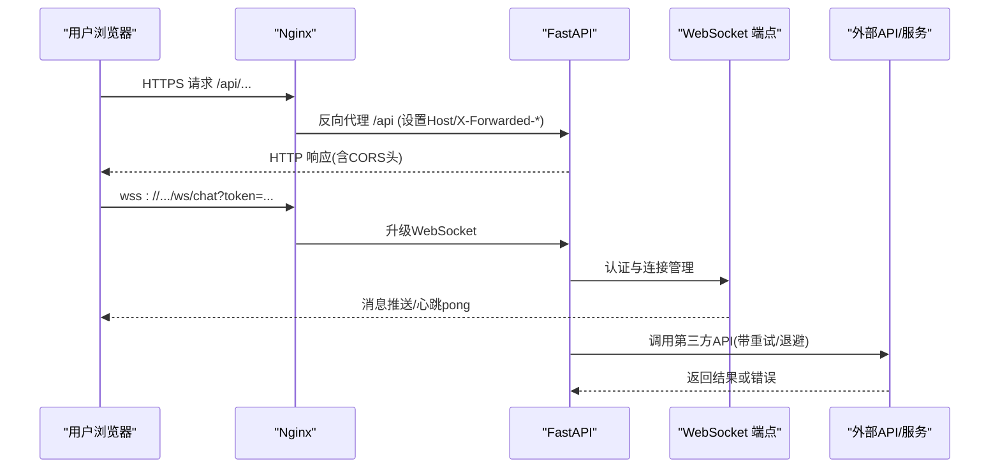
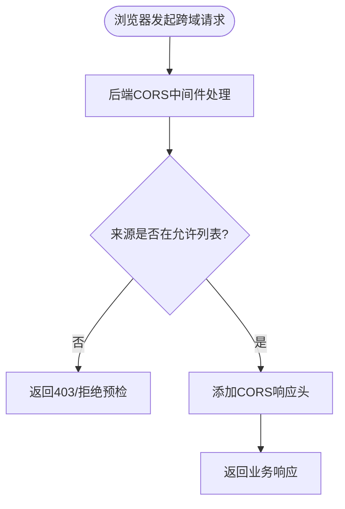
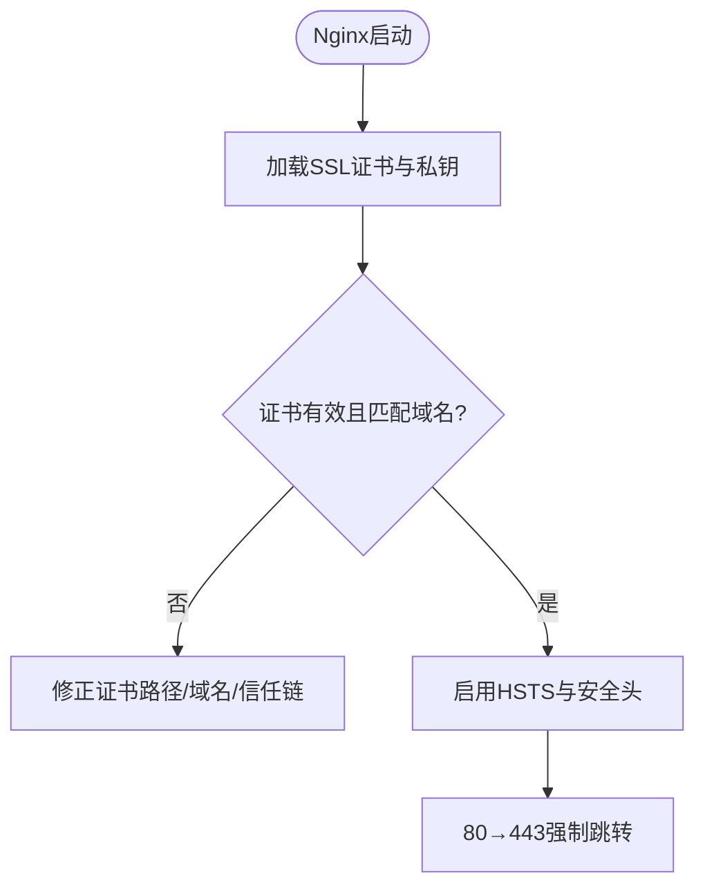
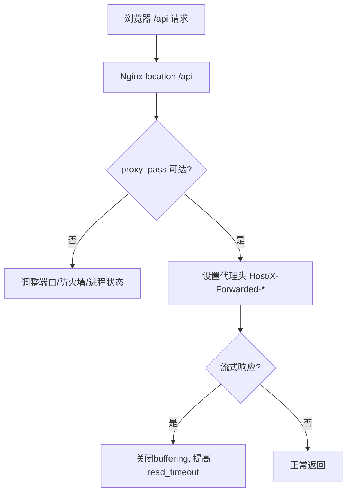
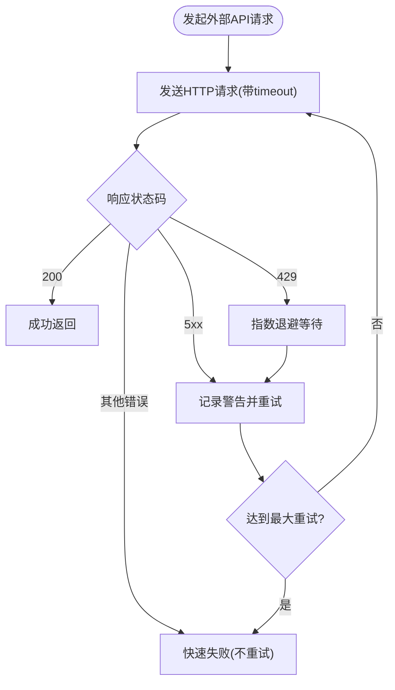
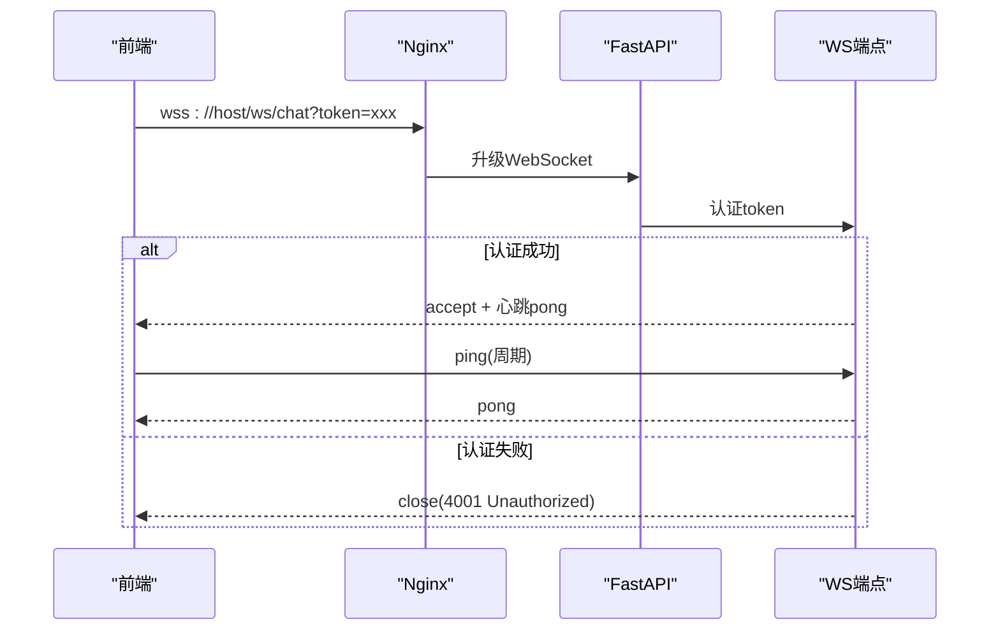
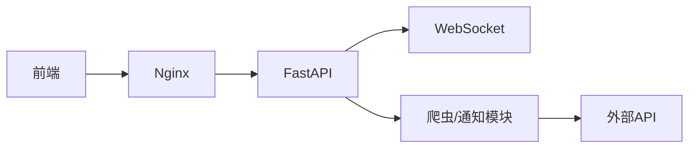

# 网络连接问题

<cite>
**本文引用的文件**
- [web/backend/app/main.py](file://web/backend/app/main.py)
- [web/deploy/nginx.conf](file://web/deploy/nginx.conf)
- [web/deploy/subskin-staging.conf](file://web/deploy/subskin-staging.conf)
- [web/deploy/subskin-admin.conf](file://web/deploy/subskin-admin.conf)
- [configs/web_config.yaml](file://configs/web_config.yaml)
- [web/app/src/composables/useWebSocket.ts](file://web/app/src/composables/useWebSocket.ts)
- [web/backend/ws/chat.py](file://web/backend/ws/chat.py)
- [web/backend/utils/client_ip.py](file://web/backend/utils/client_ip.py)
- [web/backend/api/admin_general.py](file://web/backend/api/admin_general.py)
- [src/crawlers/cma_crawler.py](file://src/crawlers/cma_crawler.py)
- [src/crawlers/semantic_scholar_crawler.py](file://src/crawlers/semantic_scholar_crawler.py)
- [src/crawlers/clinical_trials_crawler.py](file://src/crawlers/clinical_trials_crawler.py)
- [src/notifications/qq_notifier.py](file://src/notifications/qq_notifier.py)
- [tests/backend/api/test_files.py](file://tests/backend/api/test_files.py)
- [AGENTS.md](file://AGENTS.md)
</cite>

## 目录
1. [简介](#简介)
2. [项目结构](#项目结构)
3. [核心组件](#核心组件)
4. [架构总览](#架构总览)
5. [详细组件分析](#详细组件分析)
6. [依赖关系分析](#依赖关系分析)
7. [性能考虑](#性能考虑)
8. [故障排除指南](#故障排除指南)
9. [结论](#结论)
10. [附录](#附录)

## 简介
本文件面向Subskin项目的网络相关问题排查，覆盖跨域请求失败、HTTPS证书问题、代理配置错误、第三方API调用超时、WebSocket连接断开等常见场景。文档基于仓库中的后端FastAPI应用、Nginx部署模板、前端Vite开发代理、爬虫与通知模块的重试逻辑，以及WebSocket实现，提供可操作的诊断步骤、修复建议与流程图。

## 项目结构
- 反向代理层：Nginx负责HTTPS终止、静态资源服务、将/api转发到后端（uvicorn），并设置必要的代理头与超时。
- 应用层：FastAPI应用注册CORS中间件、路由、WebSocket端点与健康检查。
- 客户端层：前端通过HTTP客户端与WebSocket与后端通信；管理后台使用独立Nginx配置。
- 数据抓取与外部调用：爬虫与通知模块对第三方API进行带重试与退避的访问。

**图表来源**
- [web/deploy/nginx.conf:13-47](file://web/deploy/nginx.conf#L13-L47)
- [web/backend/app/main.py:271-278](file://web/backend/app/main.py#L271-L278)
- [web/backend/app/main.py:340-348](file://web/backend/app/main.py#L340-L348)

**章节来源**
- [web/deploy/nginx.conf:1-73](file://web/deploy/nginx.conf#L1-L73)
- [web/deploy/subskin-staging.conf:1-75](file://web/deploy/subskin-staging.conf#L1-L75)
- [web/deploy/subskin-admin.conf:1-43](file://web/deploy/subskin-admin.conf#L1-L43)
- [web/backend/app/main.py:264-348](file://web/backend/app/main.py#L264-L348)

## 核心组件
- CORS与跨域控制：FastAPI中动态计算允许的来源列表，支持生产与开发环境差异，并通过环境变量覆盖。
- Nginx反向代理：统一入口，强制HTTPS跳转、安全响应头、静态资源缓存策略、/api代理至后端，并为流式响应关闭缓冲。
- WebSocket实时通道：前端自动选择wss/ws协议，携带token建立连接，服务端校验token并维护连接状态。
- 外部API重试与退避：爬虫与通知模块在遇到超时、连接异常、限流时采用指数退避与最大重试次数。
- 真实客户端IP解析：经Nginx反代后，后端通过X-Forwarded-For/X-Real-IP获取真实客户端IP，用于限速与审计。

**章节来源**
- [web/backend/app/main.py:196-223](file://web/backend/app/main.py#L196-L223)
- [web/backend/app/main.py:271-278](file://web/backend/app/main.py#L271-L278)
- [web/deploy/nginx.conf:37-47](file://web/deploy/nginx.conf#L37-L47)
- [web/app/src/composables/useWebSocket.ts:11-53](file://web/app/src/composables/useWebSocket.ts#L11-L53)
- [web/backend/ws/chat.py:45-51](file://web/backend/ws/chat.py#L45-L51)
- [src/crawlers/cma_crawler.py:102-137](file://src/crawlers/cma_crawler.py#L102-L137)
- [src/crawlers/semantic_scholar_crawler.py:114-153](file://src/crawlers/semantic_scholar_crawler.py#L114-L153)
- [src/crawlers/clinical_trials_crawler.py:124-199](file://src/crawlers/clinical_trials_crawler.py#L124-L199)
- [src/notifications/qq_notifier.py:77-112](file://src/notifications/qq_notifier.py#L77-L112)
- [web/backend/utils/client_ip.py:29-39](file://web/backend/utils/client_ip.py#L29-L39)

## 架构总览
下图展示从浏览器到后端再到外部服务的完整链路，标注了关键的网络边界与可能出错的环节。

**图表来源**
- [web/deploy/nginx.conf:37-47](file://web/deploy/nginx.conf#L37-L47)
- [web/backend/app/main.py:271-278](file://web/backend/app/main.py#L271-L278)
- [web/backend/app/main.py:340-348](file://web/backend/app/main.py#L340-L348)
- [web/backend/ws/chat.py:45-51](file://web/backend/ws/chat.py#L45-L51)
- [src/crawlers/clinical_trials_crawler.py:124-199](file://src/crawlers/clinical_trials_crawler.py#L124-L199)

## 详细组件分析

### 跨域请求（CORS）问题
- 现象：浏览器控制台出现“跨域请求被阻止”错误；预检OPTIONS未返回允许的来源或凭据。
- 定位要点：
  - 确认后端已启用CORS中间件并正确设置allow_origins、allow_credentials。
  - 确认Nginx未拦截OPTIONS请求或改写Host/Proto导致后端误判来源。
  - 确认前端实际访问域名包含在允许列表中（生产/测试/本地开发）。
- 修复建议：
  - 在生产环境仅放行正式域名；开发环境额外放行localhost端口。
  - 如需新增站点，更新允许来源并在测试中验证。
  - 若使用自定义Header或Cookie，确保allow_headers与allow_credentials配合。

**图表来源**
- [web/backend/app/main.py:271-278](file://web/backend/app/main.py#L271-L278)
- [web/backend/app/main.py:196-223](file://web/backend/app/main.py#L196-L223)
- [tests/backend/api/test_files.py:99-115](file://tests/backend/api/test_files.py#L99-L115)

**章节来源**
- [web/backend/app/main.py:196-223](file://web/backend/app/main.py#L196-L223)
- [web/backend/app/main.py:271-278](file://web/backend/app/main.py#L271-L278)
- [configs/web_config.yaml:253-284](file://configs/web_config.yaml#L253-L284)
- [tests/backend/api/test_files.py:99-115](file://tests/backend/api/test_files.py#L99-L115)

### HTTPS与SSL证书问题
- 现象：浏览器提示证书无效、过期或不匹配；Nginx无法启动或握手失败。
- 定位要点：
  - 检查Nginx配置的ssl_certificate与ssl_certificate_key路径是否正确。
  - 确认TLS版本与密码套件兼容（如TLSv1.2/TLSv1.3）。
  - 确认80端口强制跳转到443，避免混合内容。
- 修复建议：
  - 使用Let’s Encrypt或其他可信CA签发证书，确保证书链完整。
  - 在Nginx中开启HSTS与安全响应头，提升安全性。
  - 修改后先执行nginx -t验证语法再重启。

**图表来源**
- [web/deploy/nginx.conf:6-27](file://web/deploy/nginx.conf#L6-L27)
- [web/deploy/subskin-admin.conf:9-17](file://web/deploy/subskin-admin.conf#L9-L17)

**章节来源**
- [web/deploy/nginx.conf:6-27](file://web/deploy/nginx.conf#L6-L27)
- [web/deploy/subskin-admin.conf:9-17](file://web/deploy/subskin-admin.conf#L9-L17)
- [AGENTS.md:962-971](file://AGENTS.md#L962-L971)

### 代理配置错误（Nginx → FastAPI）
- 现象：/api请求返回502/504；后端日志无记录或IP为127.0.0.1；流式响应中断。
- 定位要点：
  - 检查location /api的proxy_pass是否指向正确的后端地址。
  - 确认设置了Host、X-Real-IP、X-Forwarded-For、X-Forwarded-Proto。
  - 对于SSE/WebSocket，需关闭buffering并设置合理的read_timeout。
- 修复建议：
  - 保持代理头一致，确保后端能识别真实客户端与协议。
  - 对长耗时接口提高proxy_read_timeout，避免提前断开。
  - 修改后使用nginx -t验证并平滑重启。

**图表来源**
- [web/deploy/nginx.conf:37-47](file://web/deploy/nginx.conf#L37-L47)
- [web/deploy/subskin-staging.conf:18-27](file://web/deploy/subskin-staging.conf#L18-L27)
- [web/deploy/subskin-admin.conf:32-41](file://web/deploy/subskin-admin.conf#L32-L41)

**章节来源**
- [web/deploy/nginx.conf:37-47](file://web/deploy/nginx.conf#L37-L47)
- [web/deploy/subskin-staging.conf:18-27](file://web/deploy/subskin-staging.conf#L18-L27)
- [web/deploy/subskin-admin.conf:32-41](file://web/deploy/subskin-admin.conf#L32-L41)
- [web/backend/utils/client_ip.py:29-39](file://web/backend/utils/client_ip.py#L29-L39)

### 第三方API调用超时与重试
- 现象：爬虫或通知模块调用外部API频繁超时/连接错误/限流。
- 定位要点：
  - 检查请求超时时间、最大重试次数、退避策略。
  - 关注429限流与5xx服务器错误的处理分支。
  - 观察日志中的重试次数与最终失败原因。
- 修复建议：
  - 合理设置timeout与max_retries，避免过短导致误判、过长影响用户体验。
  - 对429实施指数退避；对5xx进行有限次重试。
  - 对非重试错误（如4xx）快速失败，减少无效等待。

**图表来源**
- [src/crawlers/cma_crawler.py:102-137](file://src/crawlers/cma_crawler.py#L102-L137)
- [src/crawlers/semantic_scholar_crawler.py:114-153](file://src/crawlers/semantic_scholar_crawler.py#L114-L153)
- [src/crawlers/clinical_trials_crawler.py:124-199](file://src/crawlers/clinical_trials_crawler.py#L124-L199)
- [src/notifications/qq_notifier.py:77-112](file://src/notifications/qq_notifier.py#L77-L112)

**章节来源**
- [src/crawlers/cma_crawler.py:102-137](file://src/crawlers/cma_crawler.py#L102-L137)
- [src/crawlers/semantic_scholar_crawler.py:114-153](file://src/crawlers/semantic_scholar_crawler.py#L114-L153)
- [src/crawlers/clinical_trials_crawler.py:124-199](file://src/crawlers/clinical_trials_crawler.py#L124-L199)
- [src/notifications/qq_notifier.py:77-112](file://src/notifications/qq_notifier.py#L77-L112)

### WebSocket连接断开与重连
- 现象：聊天或实时消息页面显示“连接断开”，消息不刷新。
- 定位要点：
  - 前端根据当前协议选择wss/ws，并携带token建立连接。
  - 服务端校验token，认证成功才accept连接。
  - 前端实现ping/pong心跳与断线指数退避重连。
- 修复建议：
  - 确保Nginx对WebSocket路径允许升级（通常由FastAPI路由处理）。
  - 检查token有效期与鉴权逻辑，避免4001未授权关闭。
  - 调整重连间隔与最大尝试次数，避免风暴式重连。

**图表来源**
- [web/app/src/composables/useWebSocket.ts:11-53](file://web/app/src/composables/useWebSocket.ts#L11-L53)
- [web/backend/ws/chat.py:45-51](file://web/backend/ws/chat.py#L45-L51)

**章节来源**
- [web/app/src/composables/useWebSocket.ts:11-53](file://web/app/src/composables/useWebSocket.ts#L11-L53)
- [web/backend/ws/chat.py:45-51](file://web/backend/ws/chat.py#L45-L51)

## 依赖关系分析
- Nginx作为统一入口，依赖上游FastAPI进程监听本地端口；所有/api请求均经其转发。
- FastAPI依赖CORS中间件与路由注册；WebSocket端点与HTTP路由共享同一应用实例。
- 爬虫与通知模块依赖requests会话与超时配置；重试逻辑依赖日志与退避策略。
- 前端依赖Nginx提供的HTTPS与静态资源，以及后端提供的REST与WebSocket接口。

**图表来源**
- [web/deploy/nginx.conf:37-47](file://web/deploy/nginx.conf#L37-L47)
- [web/backend/app/main.py:271-278](file://web/backend/app/main.py#L271-L278)
- [web/backend/app/main.py:340-348](file://web/backend/app/main.py#L340-L348)
- [src/crawlers/clinical_trials_crawler.py:124-199](file://src/crawlers/clinical_trials_crawler.py#L124-L199)

**章节来源**
- [web/deploy/nginx.conf:1-73](file://web/deploy/nginx.conf#L1-L73)
- [web/backend/app/main.py:264-348](file://web/backend/app/main.py#L264-L348)
- [src/crawlers/clinical_trials_crawler.py:124-199](file://src/crawlers/clinical_trials_crawler.py#L124-L199)

## 性能考虑
- 代理超时：对RAG等长耗时接口提高proxy_read_timeout，避免Nginx提前断开。
- 流式响应：关闭proxy_buffering以支持SSE/WebSocket流式传输。
- 静态资源缓存：为JS/CSS/图片设置长期缓存，Service Worker禁用缓存以确保更新。
- 重试与退避：外部API调用采用指数退避，避免雪崩与过度重试。
- 速率限制：后端按IP/用户维度限制读写频率，防止滥用。

[本节为通用指导，无需特定文件引用]

## 故障排除指南
- 跨域失败
  - 检查浏览器Network面板的OPTIONS请求与响应头。
  - 核对后端允许的origin列表是否包含当前站点。
  - 确认Nginx未拦截或改写Origin/Host。
- HTTPS证书问题
  - 使用openssl s_client或在线工具检测证书链与有效期。
  - 检查Nginx ssl_certificate路径与权限。
  - 确认域名与证书CN/SAN匹配。
- 代理错误
  - 查看Nginx error.log与access.log，确认是否到达后端。
  - 检查后端进程是否监听预期端口且可被本机访问。
  - 对SSE/WebSocket，确认关闭buffering与足够超时。
- 第三方API超时
  - 检查爬虫/通知模块的timeout与max_retries配置。
  - 观察日志中的重试次数与退避时间。
  - 针对429增加退避，针对5xx限制重试次数。
- WebSocket断开
  - 前端控制台查看ws连接状态与ping/pong。
  - 服务端日志查看认证失败与断开原因。
  - 调整重连策略，避免频繁重连。

**章节来源**
- [web/backend/api/admin_general.py:173-189](file://web/backend/api/admin_general.py#L173-L189)
- [web/deploy/nginx.conf:37-47](file://web/deploy/nginx.conf#L37-L47)
- [web/backend/ws/chat.py:45-51](file://web/backend/ws/chat.py#L45-L51)
- [src/crawlers/cma_crawler.py:102-137](file://src/crawlers/cma_crawler.py#L102-L137)

## 结论
Subskin的网络栈由Nginx与FastAPI协同构成，CORS、HTTPS、代理头与超时配置直接影响跨域、证书与代理行为；外部API调用通过重试与退避提升稳定性；WebSocket通过前端心跳与后端认证保障实时性。排查时应自上而下逐层验证：浏览器→Nginx→FastAPI→外部服务，并结合日志与指标定位问题根因。

[本节为总结，无需特定文件引用]

## 附录
- 常用命令
  - 验证Nginx配置：nginx -t
  - 重启Nginx：systemctl restart nginx
  - 查看Nginx日志：journalctl -u nginx -f 或 tail -f /var/log/nginx/error.log
- 抓包与延迟测试
  - 抓包：tcpdump、Wireshark、curl -v
  - 延迟：ping、traceroute、mtr、curl -o /dev/null -s -w "%{time_total}"
- HTTP状态码速查
  - 200 成功；401 未授权；403 禁止；404 未找到；429 限流；502 网关错误；504 网关超时

[本节为通用参考，无需特定文件引用]