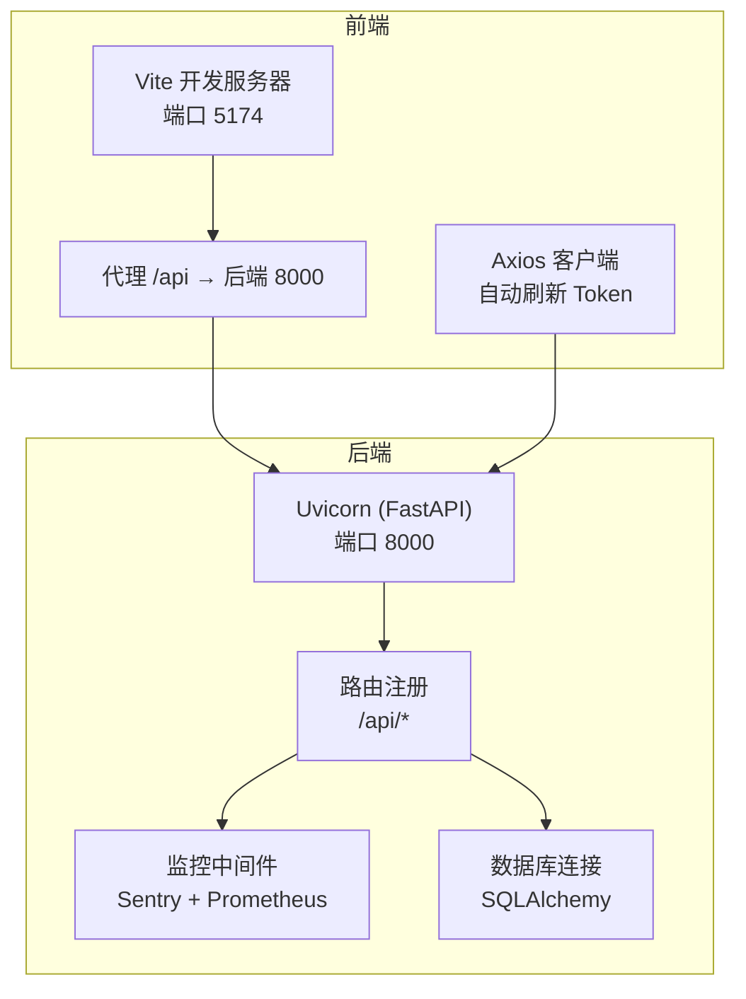
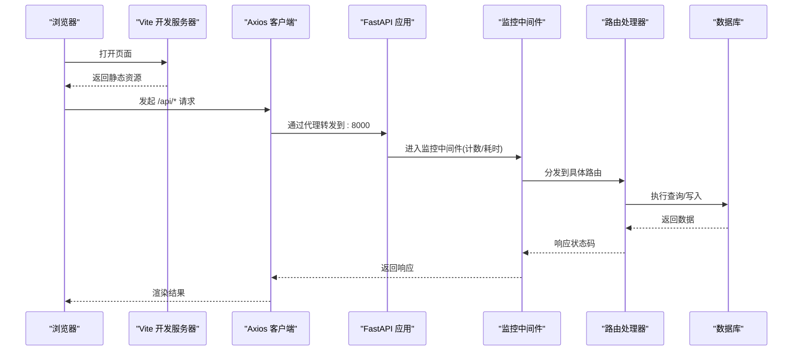
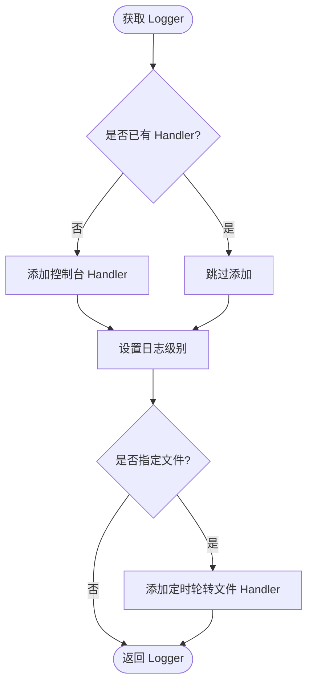
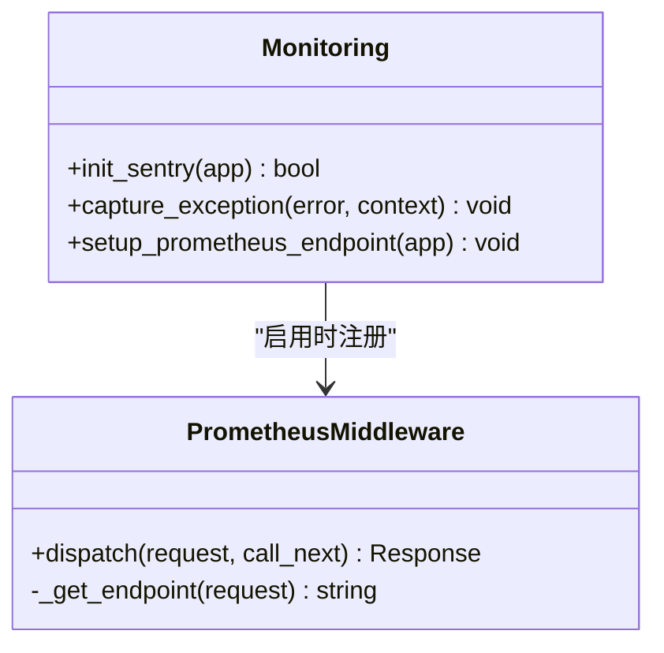
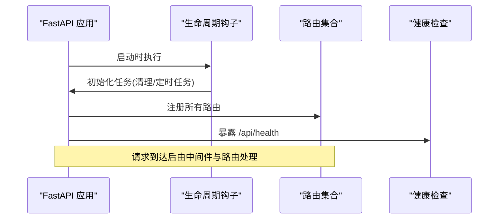
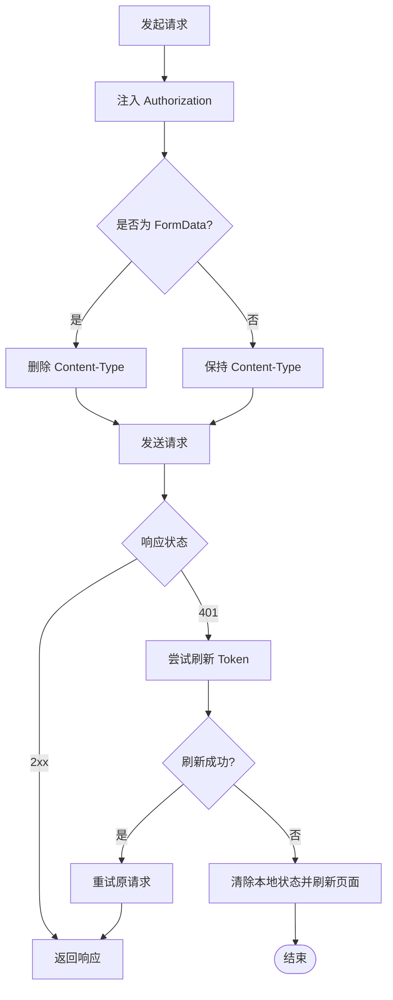
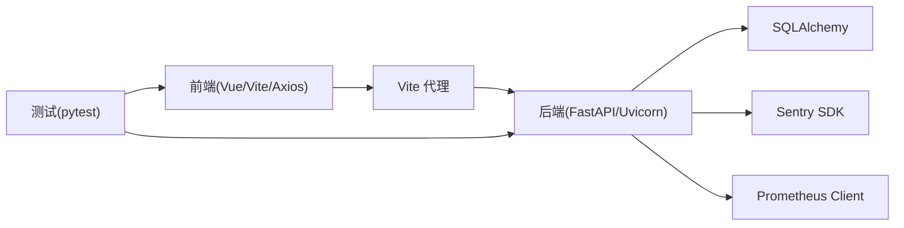

# 调试工具与技巧

<cite>
**本文引用的文件**   
- [README.md](file://README.md)
- [Makefile](file://Makefile)
- [pytest.ini](file://pytest.ini)
- [src/settings/logging.py](file://src/settings/logging.py)
- [src/utils/logger.py](file://src/utils/logger.py)
- [web/backend/app/main.py](file://web/backend/app/main.py)
- [web/backend/services/monitoring.py](file://web/backend/services/monitoring.py)
- [web/backend/exceptions.py](file://web/backend/exceptions.py)
- [web/app/vite.config.ts](file://web/app/vite.config.ts)
- [web/app/src/api/client.ts](file://web/app/src/api/client.ts)
- [tests/conftest.py](file://tests/conftest.py)
</cite>

## 目录
1. [简介](#简介)
2. [项目结构](#项目结构)
3. [核心组件](#核心组件)
4. [架构总览](#架构总览)
5. [详细组件分析](#详细组件分析)
6. [依赖关系分析](#依赖关系分析)
7. [性能考虑](#性能考虑)
8. [故障排查指南](#故障排查指南)
9. [结论](#结论)
10. [附录](#附录)

## 简介
本指南面向 SubSkin 项目的开发者，系统化介绍前后端调试环境搭建、日志收集与分析、单元测试调试、性能分析与内存快照等高级调试技术。内容覆盖 VS Code、PyCharm、浏览器开发者工具的常用配置与最佳实践，并提供断点调试、变量检查、调用栈分析、错误追踪（Sentry）、指标采集（Prometheus）等实战方法。

## 项目结构
SubSkin 采用“前端 Vue + 后端 FastAPI”的双端结构，配合 Vite 开发服务器与 Uvicorn 运行后端；测试使用 pytest，监控集成 Sentry 与 Prometheus。

图表来源
- [web/app/vite.config.ts:96-108](file://web/app/vite.config.ts#L96-L108)
- [web/backend/app/main.py:264-328](file://web/backend/app/main.py#L264-L328)
- [web/backend/services/monitoring.py:141-172](file://web/backend/services/monitoring.py#L141-L172)

章节来源
- [README.md:113-144](file://README.md#L113-L144)
- [web/app/vite.config.ts:96-108](file://web/app/vite.config.ts#L96-L108)
- [web/backend/app/main.py:264-328](file://web/backend/app/main.py#L264-L328)

## 核心组件
- 日志系统：提供统一格式、控制台输出与可选文件轮转，支持按模块命名空间隔离。
- 监控与错误追踪：Sentry 初始化与敏感信息过滤；Prometheus 指标中间件与 /metrics 端点。
- API 启动与路由：FastAPI 应用生命周期、CORS、路由集中注册、健康检查。
- 前端网络层：Axios 拦截器实现自动鉴权与 401 重试、上传类型处理。
- 测试框架：pytest 配置与异步模式、覆盖率阈值、测试夹具。

章节来源
- [src/utils/logger.py:19-81](file://src/utils/logger.py#L19-L81)
- [src/settings/logging.py:14-43](file://src/settings/logging.py#L14-L43)
- [web/backend/services/monitoring.py:28-63](file://web/backend/services/monitoring.py#L28-L63)
- [web/backend/services/monitoring.py:96-172](file://web/backend/services/monitoring.py#L96-L172)
- [web/backend/app/main.py:264-328](file://web/backend/app/main.py#L264-L328)
- [web/app/src/api/client.ts:1-84](file://web/app/src/api/client.ts#L1-L84)
- [pytest.ini:1-8](file://pytest.ini#L1-L8)

## 架构总览
下图展示从浏览器请求到后端处理的完整链路，包括 CORS、路由、监控中间件与数据库访问。

图表来源
- [web/app/vite.config.ts:96-108](file://web/app/vite.config.ts#L96-L108)
- [web/backend/app/main.py:272-328](file://web/backend/app/main.py#L272-L328)
- [web/backend/services/monitoring.py:141-172](file://web/backend/services/monitoring.py#L141-L172)

## 详细组件分析

### 日志系统与级别设置
- 统一 Logger：提供控制台输出与可选文件输出，支持按天轮转与保留天数。
- 设置化 Logger：根据 settings.LOG_LEVEL 动态设置级别，避免重复添加 handler。
- 建议：
  - 开发环境使用 DEBUG/INFO，生产环境使用 WARNING/ERROR。
  - 为每个模块创建独立 logger，便于定位问题。
  - 在关键路径记录结构化日志（如请求 ID、用户 ID）。

图表来源
- [src/utils/logger.py:19-81](file://src/utils/logger.py#L19-L81)
- [src/settings/logging.py:14-43](file://src/settings/logging.py#L14-L43)

章节来源
- [src/utils/logger.py:19-81](file://src/utils/logger.py#L19-L81)
- [src/settings/logging.py:14-43](file://src/settings/logging.py#L14-L43)

### 监控与错误追踪（Sentry + Prometheus）
- Sentry：
  - 通过环境变量 DSN、环境名、采样率初始化。
  - 内置敏感字段过滤（password、token、secret、api_key、authorization）。
  - 提供 capture_exception 手动上报异常并附加上下文。
- Prometheus：
  - 中间件统计请求总数、耗时、并发数。
  - 暴露 /metrics 端点供抓取。
- 建议：
  - 在异常捕获处附加业务上下文（用户、请求 ID、参数摘要）。
  - 生产环境开启采样率控制，避免过多追踪数据。

图表来源
- [web/backend/services/monitoring.py:28-63](file://web/backend/services/monitoring.py#L28-L63)
- [web/backend/services/monitoring.py:96-172](file://web/backend/services/monitoring.py#L96-L172)
- [web/backend/services/monitoring.py:185-203](file://web/backend/services/monitoring.py#L185-L203)

章节来源
- [web/backend/services/monitoring.py:28-63](file://web/backend/services/monitoring.py#L28-L63)
- [web/backend/services/monitoring.py:96-172](file://web/backend/services/monitoring.py#L96-L172)
- [web/backend/services/monitoring.py:185-203](file://web/backend/services/monitoring.py#L185-L203)

### FastAPI 应用启动与路由
- 生命周期管理：启动时清理临时文件、刷新过期 token、初始化 LLM 配置。
- CORS：根据环境变量或默认列表允许跨域。
- 路由：集中注册各功能模块路由，包含 /api/* 前缀。
- 健康检查：提供 /api/health 用于服务存活探测。

图表来源
- [web/backend/app/main.py:228-269](file://web/backend/app/main.py#L228-L269)
- [web/backend/app/main.py:272-328](file://web/backend/app/main.py#L272-L328)
- [web/backend/app/main.py:345-349](file://web/backend/app/main.py#L345-L349)

章节来源
- [web/backend/app/main.py:228-269](file://web/backend/app/main.py#L228-L269)
- [web/backend/app/main.py:272-328](file://web/backend/app/main.py#L272-L328)
- [web/backend/app/main.py:345-349](file://web/backend/app/main.py#L345-L349)

### 前端网络层与鉴权重试
- Axios 基础配置：baseURL、超时、Content-Type 处理。
- 请求拦截器：注入 Authorization 头，上传时移除 Content-Type 以适配 FormData。
- 响应拦截器：401 时尝试刷新 token，失败则清除本地状态并重载页面。
- 建议：
  - 在开发环境打印请求/响应摘要以便快速定位问题。
  - 对长耗时接口（AI 推理）适当提高超时时间。

图表来源
- [web/app/src/api/client.ts:11-22](file://web/app/src/api/client.ts#L11-L22)
- [web/app/src/api/client.ts:29-42](file://web/app/src/api/client.ts#L29-L42)
- [web/app/src/api/client.ts:44-82](file://web/app/src/api/client.ts#L44-L82)

章节来源
- [web/app/src/api/client.ts:1-84](file://web/app/src/api/client.ts#L1-L84)

### 测试框架与夹具
- pytest 配置：测试路径、覆盖率报告、异步模式 auto。
- 夹具：提供临时 SQLite 缓存库、模拟 API 响应、示例数据对象。
- 建议：
  - 使用夹具隔离测试数据，确保可重复性。
  - 对异步测试使用 @pytest.mark.asyncio 并确保 asyncio_mode=auto。

章节来源
- [pytest.ini:1-8](file://pytest.ini#L1-L8)
- [tests/conftest.py:20-55](file://tests/conftest.py#L20-L55)
- [tests/conftest.py:57-115](file://tests/conftest.py#L57-L115)

## 依赖关系分析
- 前端依赖：Vite、Vue、Axios、PWA 插件。
- 后端依赖：FastAPI、Uvicorn、SQLAlchemy、Sentry SDK、Prometheus Client。
- 测试依赖：pytest、pytest-cov、pytest-asyncio。

图表来源
- [web/app/vite.config.ts:96-108](file://web/app/vite.config.ts#L96-L108)
- [web/backend/app/main.py:264-328](file://web/backend/app/main.py#L264-L328)
- [web/backend/services/monitoring.py:96-172](file://web/backend/services/monitoring.py#L96-L172)

章节来源
- [web/app/vite.config.ts:96-108](file://web/app/vite.config.ts#L96-L108)
- [web/backend/app/main.py:264-328](file://web/backend/app/main.py#L264-L328)
- [web/backend/services/monitoring.py:96-172](file://web/backend/services/monitoring.py#L96-L172)

## 性能考虑
- 前端：
  - 合理设置代理与缓存策略，避免敏感数据被 Service Worker 缓存。
  - 对大文件或长耗时请求增加超时与进度反馈。
- 后端：
  - 使用 Prometheus 指标观察请求耗时与并发。
  - 数据库连接池与查询优化，避免慢查询阻塞。
- 监控：
  - 调整 Sentry 采样率，平衡问题发现与成本。
  - 定期导出 Prometheus 指标进行趋势分析。

[本节为通用指导，不直接分析具体文件]

## 故障排查指南
- 常见问题定位步骤：
  - 查看后端日志：确认异常堆栈与请求上下文。
  - 检查 Sentry 事件：定位错误发生位置与触发条件。
  - 查看 Prometheus 指标：识别慢接口与高错误率端点。
  - 前端 Network 面板：核对请求头、响应体与状态码。
- 领域异常：
  - 自定义业务异常基类与子类，便于统一处理与提示。
- 健康检查：
  - 使用 /api/health 验证服务状态与依赖可用性。

章节来源
- [web/backend/exceptions.py:4-20](file://web/backend/exceptions.py#L4-L20)
- [web/backend/app/main.py:345-349](file://web/backend/app/main.py#L345-L349)
- [web/backend/services/monitoring.py:208-241](file://web/backend/services/monitoring.py#L208-L241)

## 结论
通过统一的日志、完善的监控与清晰的调试流程，SubSkin 项目在开发与生产环境中均可高效定位与解决问题。建议团队遵循本文的最佳实践，持续优化调试体验与系统稳定性。

[本节为总结性内容，不直接分析具体文件]

## 附录

### 常用调试命令与环境准备
- 后端开发：
  - 安装依赖：make install
  - 启动开发服务：make run-dev
  - 运行测试：make test
- 前端开发：
  - 安装依赖：npm install
  - 启动开发服务器：npm run dev（端口 5174，代理 /api → 8000）
- 日志级别：
  - 通过 settings.LOG_LEVEL 或 get_logger(level=...) 设置。
- 监控开关：
  - Sentry：设置 SENTRY_DSN、SENTRY_ENVIRONMENT、SENTRY_TRACES_SAMPLE_RATE。
  - Prometheus：设置 PROMETHEUS_ENABLED=true，访问 /metrics。

章节来源
- [Makefile:57-77](file://Makefile#L57-L77)
- [Makefile:105-107](file://Makefile#L105-L107)
- [src/settings/logging.py:14-43](file://src/settings/logging.py#L14-L43)
- [web/backend/services/monitoring.py:28-63](file://web/backend/services/monitoring.py#L28-L63)
- [web/backend/services/monitoring.py:185-203](file://web/backend/services/monitoring.py#L185-L203)

### IDE 配置模板（VS Code / PyCharm）
- VS Code：
  - Python 解释器选择 .venv/bin/python。
  - 添加 launch.json 配置 uvicorn 启动与断点调试。
  - 前端使用 Node.js 调试，端口 5174。
- PyCharm：
  - 配置 Python 解释器与运行脚本为 uvicorn。
  - 设置环境变量（.env）与监听端口。
  - 前端使用 Chrome/Edge 调试，映射源码路径。

[本节为通用指导，不直接分析具体文件]

### 浏览器开发者工具技巧
- Network：过滤 /api 请求，查看请求头与响应体。
- Console：打印前端日志与错误，结合 Source 面板打断点。
- Application：检查 LocalStorage、IndexedDB 与服务工作者缓存。
- Performance：录制性能片段，分析主线程阻塞与重排重绘。

[本节为通用指导，不直接分析具体文件]

### 单元测试调试技巧
- 使用 pytest 的 --cov 与 --cov-report 生成覆盖率报告。
- 对异步测试使用 @pytest.mark.asyncio，确保 asyncio_mode=auto。
- 利用 fixtures 构造测试数据与模拟外部依赖。

章节来源
- [pytest.ini:1-8](file://pytest.ini#L1-L8)
- [tests/conftest.py:20-55](file://tests/conftest.py#L20-L55)

### 实际调试案例与最佳实践
- 案例一：401 未授权
  - 现象：前端多次 401 后刷新页面。
  - 排查：检查 refresh_token 是否存在，查看拦截器重试逻辑。
  - 解决：确保后端刷新接口可用，前端正确更新 token。
- 案例二：慢接口定位
  - 现象：某 AI 接口响应缓慢。
  - 排查：查看 Prometheus 直方图与 Sentry 追踪，定位瓶颈。
  - 解决：优化模型调用或增加超时与重试策略。
- 最佳实践：
  - 在关键路径记录结构化日志。
  - 使用 Sentry 上下文丰富错误信息。
  - 定期审查监控指标与健康检查。

[本节为通用指导，不直接分析具体文件]